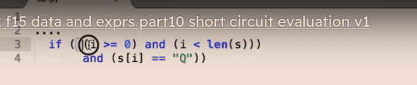

# python my note 2024-06-28

- [Trio: a friendly Python library for async concurrency and I/O — Trio 0.29.0 documentation](https://trio.readthedocs.io/en/stable/)

> python3 -m site --user-base
> find out which python path

[Python Tutor - Python Online Compiler with Visual AI Help](https://pythontutor.com/)
[pathrise-eng/pathrise-python-tutor: Visualize Python, Java, JavaScript, TypeScript, Ruby, C, and C++ code execution in your Web browser](https://github.com/pathrise-eng/pathrise-python-tutor)

python math way
[Introductory Tutorial - SymPy 1.13.3 documentation](https://docs.sympy.org/latest/tutorials/intro-tutorial/index.html)
[SageMath - Open-Source Mathematical Software System](https://www.sagemath.org/)
[Basic Algebra and Calculus - Tutorial](https://doc.sagemath.org/html/en/tutorial/tour_algebra.html)

- Software Design by Example\_ A Tool-Based I - Wilson, Greg

- [Software Design by Example](https://third-bit.com/sdxpy/)

[通过动画可视化数据结构和算法<br> - VisuAlgo](https://visualgo.net/zh)

source code

Problem set:
[15-110: Principles of Computing](https://www.cs.cmu.edu/~15110/practice.html#ta)
[CodingBat Java](https://codingbat.com/java)

Notes or short concepts:
[15-112: Fundamentals of Programming](https://www.cs.cmu.edu/~112-f22/schedule.html)

Problem set:
CS61A

python -> to exe or binary file:

nuitka

- it convert python to c , and then compile it to exe lol

[norvig/pytudes: Python programs, usually short, of considerable difficulty, to perfect particular skills.](https://github.com/norvig/pytudes/)

- Python programs, usually short, of considerable difficulty, to perfect particular skills.

my py --> stoping variable change its type ((linter usage))

```python
x = """test
or tested
"""

"" is alread a list

```

- for mulit line

.strip
.find (finding order)
.trim (deleting )
.replace
x = input("x: ")
y = x + 1
In Python, when we talk about handling strings and manipulating them, two useful methods often come up: `strip()` and `trim()`. However, it's important to clarify that in Python, there isn't a built-in function or method explicitly named `trim()`, as you might find in other programming languages. Instead, what serves the similar purpose of trimming in Python is the `strip()` method. Let's see what these do:

### strip()

The `strip()` method is used to remove characters from both the beginning and the end of a string. By default, `strip()` removes any whitespace characters, such as spaces, tabs, and newlines. You can also specify a set of characters to be removed by passing them as an argument to the method.

#### Syntax

```python
string.strip([chars])
```

- `string` refers to the string you want to strip characters from.
- `[chars]` is an optional parameter specifying the set of characters you want to remove. If not provided, the method removes whitespace.

#### Examples

- **Removing whitespace by default:**

  ```python
  text = "   Hello, World!   "
  trimmed_text = text.strip()
  print(trimmed_text)  # Output: "Hello, World!"
  ```

- **Removing specific characters:**
  ```python
  text = "xxHello, World!xx"
  trimmed_text = text.strip('x')
  print(trimmed_text)  # Output: "Hello, World!"
  ```

### Equivalent of "trim" in Python

In other programming languages, `trim()` might be a function aimed at doing what `strip()` does in Python. If you're looking for such functionality in Python, `strip()`, along with its relatives `lstrip()` (for left strip) and `rstrip()` (for right strip), will be the methods to use.

To summarize, to trim spaces or specific characters from a string in Python, you would use the `strip()` method, or `lstrip()` and `rstrip()` for more directional control (left or right side of the string, respectively). There's no `trim()` function in Python, but `strip()` provides the needed functionality.

```python
print(xxx in listname)
```

it will then print t/f

(hex())
(bin())
x = 10 // 3 --> integer number

- uppercase variable name for constant
- abs() absoulte
- round()
  [Built-in Functions — Python 3.12.4 documentation](https://docs.python.org/3/library/functions.html)

Search all the pyton module in internet

- like math module

# Type conversion

- int(x)
- float()
- bool()
- str()

falsy type:
""
0
[]
NONE (same as null)
x = input('Whats your favorite TV Show')
if x:
print('Wow I like that too !')
else:
print('You have entered nothing')

# This is an example of the truthiness and falsiness

# if user enters nothing it will print out nothing

- bool()
  if is falsy type , output false

# A psuedo code example

if some condition is true:
do this
elif Some other condition is true:
Do this
else:
do something else

and x and y This returns True if both x and y are true
or x or y This returns True if either x or y are true
not not x Reverses a result, so if something is True , not turns it False

# for loop

for x in range(5):
print(x)

for x in range(2,5):
print(x)
2,3,4
// last number -1

.startwith

> key word argument
> (2, by =3)
> def increment(number: int, by: int = 1) -> int:

```python
def min_max(numbers):
    # Assuming 'numbers' is a list of integers
    minimum = min(numbers)
    maximum = max(numbers)
    # Returning a tuple containing the minimum and maximum
    return minimum, maximum  # Parentheses optional here: return (minimum, maximum)
numbers = [5, 1, 8, 3, 2]
result = min_max(numbers)
print(result)  # Output will be something like (1, 8)

# Or, you can unpack the tuple directly into two variables
min_val, max_val = min_max(numbers)
print(f"The minimum is {min_val} and the maximum is {max_val}")  # Output: The minimum is 1 and the maximum is 8
```

```python
def multiply(*list):
print(list)

multiply(2, 3, 4, 5)

```

````python
Certainly! Here's the formatted code:

```python
def multiply(*args):
    total = 1
    for number in args:
        total *= number
    return total

print(multiply(2, 3, 4, 5))
````

This code defines a function named `multiply` which takes any number of arguments, multiplies them all together, and returns the result. When called with the values 2, 3, 4, and 5, it prints out the product of these numbers.

# Study Notes on Keyword Arguments and Dictionaries in Python

## Key Concepts

- **Variable Number of Arguments**: Previous session covered how to pass an arbitrary number of arguments to a function using one asterisk (\*).
- **Keyword Arguments**: This session introduces passing an arbitrary number of **keyword arguments** using two asterisks (\*\*).

## Syntax Overview

- Define a function using `def`, for example, `save_user`.
- To accept a variable number of keyword arguments, use two asterisks before a parameter name, e.g., `**user`.
- Inside the function, you can access these arguments as if they were in a dictionary.

## Example

```python
def save_user(**user):
    print(user)
```

- Calling `save_user(id=1, name="admin")` prints a dictionary with the provided keyword arguments: `{'id': 1, 'name': 'admin'}`.

## Working with Dictionary

- Data is stored in key-value pairs inside curly braces `{}`.
- If you're familiar with JavaScript, this resembles an object. If not, Python dictionaries will be covered in detail later.
- Access dictionary elements using square bracket notation, like `user['id']`.

## Conclusion

- Use two asterisks (\*\*kwargs) to collect keyword arguments into a dictionary within a function.
- This allows passing and handling named data conveniently, facilitating functions that can accept a flexible set of named parameters.

This summarizes the essential points on handling keyword arguments in Python and gives a brief introduction to dictionaries.

---

Here are concise study notes with a small Python code example to illustrate the difference between local and global variables:

---

## Python Variables: Local vs Global

### Local Variables

- **Scope**: Limited to the function in which they are defined.
- **Block Scope**: Unlike languages like C# or JavaScript, Python does not have block-level scope. Variables defined inside a block (`if`, `for`, `while`) are accessible outside the block within the function.

#### Example:

```python
def greet():
    if True:
        message = "Hello, Python!"
    print(message)  # Accessible here

greet()  # Prints "Hello, Python!"
```

### Global Variables

- **Scope**: Accessible throughout the file in which they are declared.
- **Usage**: Can be read from any function within the file.

#### Example:

```python
message = "Hello, Global!"

def greet():
    print(message)  # Accessible and prints the global variable

greet()  # Prints "Hello, Global!"
```

### Modifying Global Variables Inside a Function

- **Default Behavior**: Assigning a new value to a global variable within a function creates a new local variable unless explicitly stated.
- **Using `global` Keyword**: To modify a global variable inside a function, use the `global` keyword to refer to the variable.

#### Example:

```python
message = "a"  # Global variable

def greet():
    global message  # Refer to the global variable
    message = "b"  # Modify the global variable

greet()
print(message)  # Prints "b"
```

### Best Practice

- **Avoid Global Variables**: They can lead to side effects in other parts of the program.
- **Avoid Modifying Global Variables in Functions**: It's considered a bad practice and can cause unpredictability in your program's behavior.

---

These notes outline the key aspects of handling local and global variables in Python, emphasizing best practices against modifying global variables within functions.

# Study Notes on List Operations

## Accessing List Items

- Utilize square brackets to access specific items in a list by their index.
- Example: Printing `letters[0]` returns the first item in the list.
- Negative indices can access items from the end of the list (e.g., `-1` returns the last item).

## Modifying List Items

- Square brackets can also be used to modify items in a list.
- Example: Changing the first letter to a capital "A".

## Slicing Lists

- Similar to strings, lists can be sliced using `[start_index:end_index]`.
- Omitting `start_index` assumes `0`; omitting `end_index` uses the list's length by default.
- Slicing does not alter the original list but returns a new list based on the specified range.
- A step can be included in slicing to skip elements (e.g., `[::2]` returns every second item).

## Advanced Slicing Techniques

- Using a negative step (e.g., `[::-1]`) reverses the order of the list.
- Creating a new list with a range (e.g., `list(range(20))`) and then slicing it can efficiently generate sequences like even numbers.

## Unpacking Lists

- The next topic to explore is unpacking lists, which allows for assigning elements of a list to separate variables directly.

These notes summarize the basics of accessing, modifying, and slicing lists in Python, along with introducing some advanced techniques for list manipulation.

```python
# 03 List Unpacking

numbers = [1, 2, 3]
print(numbers)

# Assigning an item of a list to a variable
# first = numbers[0]
# second = numbers[1]
# third = numbers[3]

# The best way to this is by list unpacking
first, second, third = numbers
print(first)
print(second)
print(third)
# this is the same as the code in lines 6, 7, 8. The number of item in the left side of = most be the same as th number of items in the lis.

# If we have alist with a lot of item and we just want to unpack the first two item and pack the rest os item in another list
numbers_0_19 = [0, 1, 2, 3, 4, 5, 6, 7, 8, 9,
                10, 11, 12, 13, 14, 15, 16, 17, 18, 19]
print(numbers_0_19)
first, second, *others = numbers_0_19
print(first)
print(second)
print(others)

# For example if we want the unpack the first and the the last item
first, *others, last = numbers_0_19
print(first)
print(others)
print(last)


```

# looping over lists

```python
# 04 Looping over Lists

letters = ["a", "b", "c", "d"]

for letter in letters:
    print(letter)

# to get the index of each item use the built in function enumerate()
for letter in enumerate(letters):
    print(letter)
# we get a Tuple with two item the first the index , second the item it self

for index, letter in enumerate(letters):
    print(index, letter)


    output:
        a
b
c
d
(0, 'a')
(1, 'b')
(2, 'c')
(3, 'd')
0 a
1 b
2 c
3 d

```

# 05 Adding or Removing Items

```python

# 05 Adding or Removing Items

letters = ["a", "b", "c", "d", "e", "f", "g"]
print(letters)

# Add an item to the end of the list
letters.append("h")
print(letters)

# Add item at a specific position using the method insert()
# first argumet position of the list, second argument iem to add
letters.insert(2, "-")
print(letters)

# Remove an item of a list use the method pop()
# with no argument it removes the last item
letters.pop()
print(letters)

# with a argument it removes the item with that index
letters.pop(2)
print(letters)

# Remove an item for a lsi using the method remove()
# specify the item
letters.remove("c")  # this will remove the first "c" in the list
print(letters)
# if there were multiple "c" we need to loop over the list

# Remove item using the del statement
# we this statement we can rmove one item or a range of items by theer index
del letters[0:2]
print(letters)

# to clear the list and delete all the items use the method clear
letters.clear()
print(letters)

```

- append , adding from the last
- pop, deleting from the last, // could use index way as well
- insert (index, value)
- remove , remove the value(not knowing the index is )
  `del letters [0:3]` could delete range of items
  `letters.clear` clear all
  letters.count , counting how many times that item occur
  `if "d" in letters:
print(letter.index("d"))`

# sorting

```python
# 07 Sorting Lists

numbers = [5, 51, 2, 15, 6]
print(numbers)

# sort numbers in use the sort() method
numbers.sort()
print(numbers)

numbers.sort(reverse=True)
print(numbers)

# The sort function can be used an it will creat a new list
print(sorted(numbers))
print(sorted(numbers, reverse=True))


# List of complex objects, like a list of tuples, example a list of orders with product name and price
# in situations like this we need to define a function  to sort the list, the above methods don't work
items = [
    ("Product1", 15),
    ("Product2", 50),
    ("Product3", 5)
]
print(items)

# In this example we are going to sort the items base in price


def sort_items_price(index):
    return index[1]
# if each item in the list is a tuple we are returning the second item in the tuple


items.sort(key=sort_items_price)
print(items)


```

.sort

- this will change the list order from the original
  sorted()
- this will not.

```python
# 08 Lambda Functions

# List of complex objects, like a list of tuples, example a list of orders with product name and price
# in situations like this we need to define a function  to sort the list, the above methos don't work
items = [
    ("Product1", 15),
    ("Product2", 50),
    ("Product3", 5)
]
print(items)

# In this exeample we are going to sort the items base in price

def sort_items_price(index):
    return index[1]
#if each item in the list is a tuple we are returning the second item in the tuple

# items.sort(key=sort_items_price)
# print(items)

# with a lambda or anonymous functions it's short and cleaner way to define a function that we are going to use only once as an argument of another function.
items.sort(key=lambda index: index[1])  # lambda parameter_list: expression
print(items)
```

Certainly, here's a small study note in markdown format that encapsulates the essence of lambda expressions in Python, particularly focusing on their utility in simplifying code blocks that require functions as arguments:

---

# Python Lambda Expressions

Lambda expressions, or lambda functions, are a staple of many programming languages. In Python, they provide a way to create small, one-line anonymous functions. These functions are particularly useful when you need to pass a function as an argument to another function, but wish to avoid the verbosity of traditional function definitions.

## Example: Simplifying Sorting

Consider you have a list of items you wish to sort based on one of their properties, such as price. Traditionally, you might define a separate function to express the sorting criterion:

```python
# Traditional function definition
def sort_item(item):
    return item[1]

items = [(1, 10), (2, 5), (3, 7)]
items.sort(key=sort_item)
```

### Using Lambda Expressions

Lambda expressions can condense the above code, making it cleaner and more readable. A lambda function can replace the `sort_item` function entirely:

```python
# Using a lambda expression
items = [(1, 10), (2, 5), (3, 7)]
items.sort(key=lambda item: item[1])
```

### Syntax

The syntax for lambda expressions in Python is straightforward:

```python
lambda parameters: expression
```

- `parameters` is the list of parameters, just like in a standard function definition. These are the inputs to your lambda function.
- `expression` is a single expression that the function evaluates and returns. This expression cannot contain statements or multiple expressions.

#### Advantages of Lambda

1. **Conciseness**: Lambda expressions allow you to define functions in a single line.
2. **Anonymity**: They are anonymous; you do not need to give them a name.
3. **No Need for `return`**: The expression is automatically returned by the lambda function.

### Use Case

Lambda expressions shine in scenarios where you need a simple function for short-term use, particularly as arguments to functions like `sort()`, `filter()`, `map()`, etc., where defining a separate, named function would be cumbersome and unnecessary.

```python
# Sorting items by price using lambda
items.sort(key=lambda item: item[1])

# Output: [(2, 5), (3, 7), (1, 10)]
print(items)
```

By adopting lambda expressions, Python code can be made more readable and brief, especially for small, single-use functions passed to other functions.

---

This note should help you quickly grasp what lambda expressions are and how to utilize them to write cleaner and more efficient Python code.

# Map

Sure, I'll condense the information into a concise markdown study note focusing on the use of Lambda expressions with the `map()` function in Python for transforming lists.

---

# Transforming Lists with Lambda and `map()`

Python's versatility is showcased in its ability to transform data structures efficiently. Lambda expressions, combined with the `map()` function, offer a robust solution for modifying lists without verbose loops. Let's explore how to use these tools to transform a list of tuples into a list of prices.

## Example: Extracting Prices from Tuples

Consider a list where each element is a tuple representing an item, where the first element is an item ID and the second is its price. The goal is to extract just the prices into a new list.

### Traditional Approach

Normally, you might loop through each tuple, extracting the price, and appending it to a new list:

```python
items = [(1, 10), (2, 5), (3, 7)]
prices = []
for item in items:
    prices.append(item[1])
print(prices)  # Output: [10, 5, 7]
```

### Using `map()` and Lambda Expressions

The `map()` function offers a more elegant solution. It applies a given function to each item of an iterable and returns a map object.

```python
items = [(1, 10), (2, 5), (3, 7)]
prices = list(map(lambda item: item[1], items))
print(prices)  # Output: [10, 5, 7]
```

### Syntax

`map()` takes two main arguments:

- A function to apply to each item. This is where lambda expressions shine.
- An iterable (e.g., list, tuple).

### Advantages of Using `map()` with Lambda

1. **Conciseness**: Achieving the same result in fewer lines of code.
2. **Readability**: Expressing the transformation logic succinctly.
3. **Efficiency**: `map()` is often faster for large datasets.

### Example

Transforming a list of tuples into a list of the second elements (prices) in the tuples:

```python
# Transforming a list with map() and lambda
items = [(1, 10), (2, 5), (3, 7)]
prices = list(map(lambda item: item[1], items))
print(prices)  # Output: [10, 5, 7]
```

By combining lambda functions with the `map()` function, we've succinctly transformed our list of tuples into a list of prices.

---

This note encapsulates how to leverage Python's lambda expressions and the `map()` function to efficiently transform lists, demonstrating a practical scenario of extracting prices from a list of tuples.

the code:

```python
# 09 Map Function

items = [
    ("Product1", 15),
    ("Product2", 50),
    ("Product3", 5)
]
print(items)

# Transform this list in a simple list of numbers, with just the price
# prices = []
# for index in items:
#     prices.append(index[1])
# print(prices)

# there is a better more cleaner way to achive the same result with the map() function
prices = map(lambda index: index[1], items)
print(prices)
for index in prices:  # this way we loop the map function
    print(index)

# to create a list with just the prices use the list function
prices = list(map(lambda index: index[1], items))
print(prices)


```

- map with lambda is still a itterable, so we will have to for loop it , or just use list() function

---

# Question and Answer

[Function Definitions](https://www.cs.cmu.edu/~15110/practice/unit1/function_definitions.html)
[5.9] Write a function named right_justify that takes a string named s as a parameter and prints the string with enough leading spaces so that the last letter of the string is in column 70 of the display.

def right_justify(s):
lengthOfs = len(s)
remainingSpaces = 70 - lengthOfs
print(remainingSpaces \* " " + s)

---

def squareParameter(x):
return x\*4 # Remember a square's sides are all equal

def area(x):
print(x\*\*x)

---

[5.16] Write a function that takes as a parameter the radius of a circle and prints the perimeter of the circle.

This is an example of a function definition:

import math

def perimeterCircle(r):
print(2*r*math.pi)

---

[5.17] Write a function that takes as a parameter the radius of a circle and returns the area of the circle.

This is an example of a function definition:

import math

def areaCircle(r):
return r*r*math.pi

---

[5.18] Write a function that takes as a parameter the two sides of a rectangle, prints the perimeter of the rectangle, and returns the area of the rectangle.

This is an example of a function definition:

def rectangleFun(w, h):
print(w*2 + h*2)
return w\*h

---

[5.19] Write a function dice(n) which simulates a dice roll for a dice with n sides and prints the result. Hint: Using the random library is helpful here! Call the function with 3 different values of n and see the results!

This is an example of a function definition:

import random

def dice(n):
roll = random.randint(1, n) # remember randint is inclusive [1,n]
return roll

print(dice(6)) # 6 sided die
print(dice(12)) # 12 sided die
print(dice(22)) # 22 sided die

---


Short-Circuit Evaluation :
and is use ful for making sure the code isn't crack

def yes():
return True

def no():
return False

def crash():
return 1/0 # crashes!

print(no() and crash()) # Works!
print(crash() and no()) # Crashes!
print (yes() and crash()) # Never runs (due to crash), but would also crash (without short-circuiting)

```python

def f(w):
    return 10*w

def g(x, y):
    return f(3*x) + y   # f(3*x) must be evaluated before we can return

def h(z):
    return f(g(z, f(z+1)))  # The innermost f(z+1) must be evaluated first

print(h(1)) # hint: try the "visualize" feature

```

Test Functions

```python
def onesDigit(n):
    return n%10

def testOnesDigit():
    print("Testing onesDigit()...", end="")
    assert(onesDigit(5) == 5)
    assert(onesDigit(123) == 3)
    assert(onesDigit(100) == 0)
    assert(onesDigit(999) == 9)
    print("Passed!")

testOnesDigit() # Passed!  Why is this bad?

```

Let’s dive into Python’s **iterables** and **iterators** in a way that’s clear and beginner-friendly, based on the notes you provided. Imagine we’re unpacking these concepts step-by-step, as if you’re seeing them for the first time while learning Python.

---

### What is an Iterable?

An **iterable** is like a container or a collection of items that you can go through one by one, in order. Think of it as anything you can loop over—like a list of groceries, a string of letters, or even a range of numbers. In Python, an iterable is any object that knows how to give you an **iterator** when you ask for it.

- **How it Works**: You “ask” an iterable for an iterator by calling the `iter()` function on it.
- **Examples**:
  - A list: `[1, 2, 3]`
  - A string: `"hello"`
  - A tuple: `(4, 5, 6)`
  - Even a range: `range(5)` (gives you `0, 1, 2, 3, 4`)
- **Key Idea**: An iterable is something you can process **sequentially**, but it doesn’t do the processing itself—it hands that job to an iterator.

In a `for` loop, Python secretly uses iterables. For example:

```python
for x in [1, 2, 3]:
    print(x)
```

Here, `[1, 2, 3]` is the iterable. Python calls `iter([1, 2, 3])` behind the scenes to get an iterator, which then feeds `1`, `2`, and `3` to the loop one at a time.

---

### What is an Iterator?

An **iterator** is like a little pointer or tracker that moves through the iterable, keeping its place and giving you the next item each time you ask. It’s the worker that does the actual stepping through the sequence.

- **How it Works**:
  - You get an iterator from an iterable using `iter()`.
  - You ask the iterator for the next item using `next()`.
  - When there’s nothing left, it raises a `StopIteration` exception to say, “I’m done!”
- **Key Features**:
  - It remembers its **position** in the sequence.
  - It gives you one item at a time, moving forward each time you call `next()`.

Let’s see it in action:

```python
my_list = [1, 2, 3]
my_iterator = iter(my_list)  # Get the iterator
print(next(my_iterator))     # 1 (moves to first item)
print(next(my_iterator))     # 2 (moves to second item)
print(next(my_iterator))     # 3 (moves to third item)
print(next(my_iterator))     # Raises StopIteration (no more items!)
```

---

### The Difference: Iterable vs. Iterator

- **Iterable**: The container or blueprint. It can give you an iterator whenever you want. You can call `iter()` on it multiple times to start fresh each time.
  - Example: A list `[1, 2, 3]` is an iterable. It doesn’t move or track anything itself.
- **Iterator**: The worker that walks through the container. It’s a one-time-use object—once it’s gone through everything, it’s exhausted.
  - Example: `iter([1, 2, 3])` gives you an iterator. After calling `next()` until `StopIteration`, it’s done.

Think of it like a book (iterable) and a bookmark (iterator). The book has all the pages, and you can get a new bookmark anytime to start reading. The bookmark keeps track of where you are and moves forward page by page until the end.

---

### How `for` Loops Use Them

A `for` loop in Python is just a nice way to handle iterables and iterators without you doing the `iter()` and `next()` manually. Here’s what happens under the hood:

```python
for x in [1, 2, 3]:
    print(x)
```

- Python does:
  1. `iterator = iter([1, 2, 3])` (gets an iterator from the iterable).
  2. `x = next(iterator)` (gets `1`, prints it).
  3. `x = next(iterator)` (gets `2`, prints it).
  4. `x = next(iterator)` (gets `3`, prints it).
  5. `next(iterator)` raises `StopIteration`, so the loop stops.

---

### Playing with It

Let’s try some examples to make it click:

#### Example 1: Manual Iteration

```python
text = "hi"
it = iter(text)
print(next(it))  # h
print(next(it))  # i
# next(it) would raise StopIteration because "hi" has only 2 letters
```

#### Example 2: Multiple Iterators

```python
numbers = [10, 20, 30]
it1 = iter(numbers)
it2 = iter(numbers)  # Fresh start!
print(next(it1))  # 10
print(next(it2))  # 10 (it2 is independent of it1)
```

#### Example 3: Exhausting an Iterator

```python
stuff = range(2)  # 0, 1
it = iter(stuff)
print(next(it))  # 0
print(next(it))  # 1
print(next(it))  # StopIteration!
```

---

### Why Care?

- **Iterables** let you write loops easily over all kinds of data (lists, strings, files, etc.).
- **Iterators** save memory because they generate items one at a time instead of holding everything at once (like `range()` or file reading).
- Together, they power Python’s `for` loops, list comprehensions, and more.

---

### Your Notes, Explained

- **Iterable**: “Container that can be processed sequentially by calling `iter` to get an iterator.”
  - Translation: It’s anything you can loop over that gives you a tracker when you ask.
- **Iterator**: “Object that keeps track of position and returns the next value in the sequence when `next` is called.”
  - Translation: It’s the tracker that moves forward and hands you items one by one.
- **StopIteration**: “Calling `next` raises a `StopIteration` if the end of the iterator has been reached.”
  - Translation: When the tracker runs out of items, it says “stop” with this signal.

---

### Quick Recap

- **Iterable**: The thing you loop over (e.g., `[1, 2, 3]`).
- **Iterator**: The thing that does the looping (e.g., `iter([1, 2, 3])`).
- Python’s `for` loop hides the `iter()` and `next()` dance, but now you know the magic behind it!

Try playing with `iter()` and `next()` in a Python shell—it’s a fun way to see this in action!

---

Let’s unpack the concepts of **iterables** and **iterators** in Python based on the notes you’ve shared. I’ll explain them clearly and practically, as if you’re encountering them for the first time, while tying in the technical details like `__iter__()`, `__getitem__()`, and `__next__()`. We’ll keep it conversational and grounded with examples.

---

### What Are Iterables?

An **iterable** is anything in Python that you can loop over sequentially—like a list of numbers, a word’s letters, or even something that generates values on the fly. It’s a fixed representation of a sequence, meaning it’s something Python knows how to process one item at a time. You get an **iterator** from it by calling `iter()`.

#### Two Flavors of Iterables

1. **Explicit Sequences**:

   - These store all their values upfront, ready to go.
   - Examples:
     - **Lists**: `[1, 2, 3]`—all numbers are right there.
     - **Tuples**: `(4, 5, 6)`—same deal, fixed and stored.
     - **Strings**: `"cat"`—letters `c`, `a`, `t` are explicitly held in memory.
   - Think of these as a pre-written shopping list: everything’s already listed out.

2. **Implicit Sequences**:
   - These don’t store everything at once—they “lazily” calculate values when you ask for them.
   - Examples:
     - **Map**: `map(lambda x: x*2, [1, 2, 3])`—doubles numbers only when needed.
     - **Filter**: `filter(lambda x: x > 0, [-1, 2, -3])`—picks positives on demand.
     - **Generators**: `(x**2 for x in range(3))`—yields `0`, `1`, `4` one at a time.
   - Think of these as a recipe: the values aren’t cooked yet, but the instructions are ready.

#### How Does Python Know It’s Iterable?

An object is iterable if it has one of these special methods:

- **`__iter__()`**: Returns an iterator object when `iter()` is called. This is the preferred way.
- **`__getitem__()`**: Lets you access items by index (like `obj[0]`, `obj[1]`, etc.), and Python can figure out how to iterate over it. This is an older fallback.

For example:

```python
my_list = [1, 2, 3]
it = my_list.__iter__()  # Same as iter(my_list)
```

Lists have `__iter__()`, so they’re iterable. A string like `"hi"` has it too. Even a custom class can be iterable if you define `__iter__()` or `__getitem__()`.

---

### What Are Iterators?

An **iterator** is the worker that steps through an iterable, one item at a time. It’s like a cursor or a bookmark—it knows where it is in the sequence and gives you the next value when you ask. Iterators keep track of their state, so they’re not “pure” (they change as you use them).

#### How Iterators Work

- **Get One**: Call `iter()` on an iterable to create an iterator.
- **Use It**: Call `next()` on the iterator to get the next value.
- **End It**: When there’s nothing left, `next()` raises `StopIteration`.

Example:

```python
nums = [1, 2, 3]      # Iterable (explicit sequence)
it = iter(nums)       # Get iterator
print(next(it))       # 1
print(next(it))       # 2
print(next(it))       # 3
print(next(it))       # Raises StopIteration
```

#### Behind the Scenes

An object is an iterator if it implements:

- **`__next__()`**: Returns the next value or raises `StopIteration` when done.
- (Usually) **`__iter__()`**: Returns itself (since iterators are often their own iterators).

The iterator from `iter([1, 2, 3])` has `__next__()`, which is why `next()` works on it.

---

### Practical Example: Explicit vs. Implicit

#### Explicit (List)

```python
lst = [10, 20, 30]    # All values stored
it = iter(lst)
print(next(it))       # 10
print(next(it))       # 20
```

- The list is fully built in memory, and the iterator just walks through it.

#### Implicit (Generator)

```python
gen = (x * 2 for x in range(3))  # Lazy: values not stored yet
it = iter(gen)
print(next(it))       # 0 (computes 0 * 2)
print(next(it))       # 2 (computes 1 * 2)
print(next(it))       # 4 (computes 2 * 2)
```

- The generator calculates each value only when `next()` asks for it—super memory-efficient!

---

### Why Iterators “Store State”?

Iterators remember where they are. If you call `next()` twice on the same iterator, you get different results because it moves forward:

```python
it = iter("abc")
print(next(it))  # a
print(next(it))  # b
```

This “state” makes `next()` **non-pure**—unlike a pure function like `abs(-5)`, which always returns `5`, `next(it)` depends on what’s happened before.

---

### Connecting to `for` Loops

A `for` loop uses this machinery automatically:

```python
for x in [1, 2, 3]:   # Iterable
    print(x)
```

- Python:
  1. Calls `iter([1, 2, 3])` to get an iterator.
  2. Calls `next()` repeatedly until `StopIteration`.
- Same with implicit iterables:

```python
for x in map(str, [1, 2, 3]):  # "1", "2", "3" computed lazily
    print(x)
```

---

### Your Notes, Explained

#### Iterables

- **“Fixed representations that can be processed sequentially by calling `iter` to retrieve an iterator”**:
  - They’re the source of the sequence, ready to hand off to an iterator.
- **Explicit**: Pre-stored (e.g., `[1, 2, 3]`).
- **Implicit**: Computed on demand (e.g., `map()`).
- **Practically**: Needs `__iter__()` (modern way) or `__getitem__()` (old-school way).

#### Iterators

- **“Provide sequential access to an iterable”**:
  - They’re the movers, stepping through the sequence.
- **“Call `iter` on an iterable to get the iterator”**:
  - `iter()` is the bridge from iterable to iterator.
- **“Call `next` to get the next value”**:
  - `next()` is how you pull items out.
- **“Iterators store state”**:
  - They track their position, so each `next()` moves forward.

---

### Fun Experiment

Try this to see the difference:

```python
# Iterable (can restart)
lst = [1, 2]
for x in lst: print(x)  # 1, 2
for x in lst: print(x)  # 1, 2 again!

# Iterator (one-time use)
it = iter([1, 2])
print(next(it))  # 1
print(next(it))  # 2
print(next(it))  # StopIteration—exhausted!
```

The iterable (`lst`) can give fresh iterators; the iterator (`it`) runs out.

---

### Wrap-Up

- **Iterable**: The container or recipe (has `__iter__()` or `__getitem__()`).
- **Iterator**: The walker (has `__next__()`).
- Together, they make Python’s loops and lazy processing possible. Play with `iter()` and `next()` to feel the flow!

---

```python

def falling(n, k):
    """Compute the falling factorial of n to depth k.

    >>> falling(6, 3)  # 6 * 5 * 4
    120
    >>> falling(4, 3)  # 4 * 3 * 2
    24
    >>> falling(4, 1)  # 4
    4
    >>> falling(4, 0)
    1
    """
    total, stop = 1, n-k
    while n > stop:
        total, n = total*n, n-1
    return total

    def falling(n, k):
        """Compute the falling factorial of n to depth k."""
        if k == 0:
            return 1
        return n * falling(n - 1, k - 1)
```

def sum_digits(y):
"""Sum all the digits of y.

    >>> sum_digits(10) # 1 + 0 = 1
    1
    >>> sum_digits(4224) # 4 + 2 + 2 + 4 = 12
    12
    >>> sum_digits(1234567890)
    45
    >>> a = sum_digits(123) # make sure that you are using return rather than print
    >>> a
    6
    """
    total = 0
    while y > 0:
        total, y = total + y % 10, y // 10
    return total

---

```python
def double_eights(n):
    """Return true if n has two eights in a row.
    >>> double_eights(8)
    False
    >>> double_eights(88)
    True
    >>> double_eights(2882)
    True
    >>> double_eights(880088)
    True
    >>> double_eights(12345)
    False
    >>> double_eights(80808080)
    False
    """
    prev_eight = False
    while n > 0:
        last_digit = n % 10
        if last_digit == 8 and prev_eight:
            return True
        elif last_digit == 8:
            prev_eight = True
        else:
            prev_eight = False
        n = n // 10
    return False

```

---

# python tools in repl

### **Using `--listfuncs` in Python REPL**

The `--listfuncs` option in the `trace` module is mainly used to list functions **without executing them**. This is useful for understanding the structure of a script.

Normally, you would use it like this in a terminal:

```bash
python -m trace --listfuncs my_script.py
```

This will list all functions defined in `my_script.py`.

However, **in REPL mode**, the `trace` module doesn’t directly support `--listfuncs`. Instead, you can achieve the same effect using Python introspection tools.

---

### **Alternative: Listing Functions in the Current Module (REPL Mode)**

If you're working in Python interactively (REPL), here are better ways to list functions:

#### **1. Using `inspect` to List Functions in a Module**

```python
import inspect
import my_script  # Import the script you want to inspect

functions = [name for name, obj in inspect.getmembers(my_script, inspect.isfunction)]
print(functions)
```

This will print all functions defined in `my_script.py`.

#### **2. Listing Functions in the Current REPL Session**

If you’ve defined functions interactively in REPL:

```python
import types

functions = [name for name, obj in globals().items() if isinstance(obj, types.FunctionType)]
print(functions)
```

This lists all functions defined in the REPL session.

---

### **Better Alternatives to `trace` for Tracing Execution**

Python has **better tracing tools** than `trace.Trace()`. Here are a few:

#### **1. Using `sys.setprofile()` for Full Function Call Logging**

```python
import sys

def trace_calls(frame, event, arg):
    if event == "call":
        print(f"Calling {frame.f_code.co_name} at {frame.f_lineno}")
    return trace_calls

sys.setprofile(trace_calls)

def foo():
    print("Inside foo")
    bar()

def bar():
    print("Inside bar")

foo()

sys.setprofile(None)  # Stop tracing
```

This logs **all function calls** while the program runs.

#### **2. Using `py-spy` for Live Function Tracing (Recommended)**

`py-spy` is an **external tool** for better function tracing:

```bash
pip install py-spy
py-spy top --pid <your-python-process-id>
```

It shows **real-time function calls** and CPU usage.

#### **3. Using `pdb` for Step-by-Step Debugging**

Python’s built-in debugger (`pdb`) lets you **step through functions** interactively:

```python
import pdb

def foo():
    print("Inside foo")
    bar()

def bar():
    print("Inside bar")

pdb.run('foo()')  # Start debugging foo()
```

You can use commands like `s` (step), `n` (next), and `c` (continue).

---

### **Conclusion**

- `trace --listfuncs` **only works on script files, not REPL**.
- In REPL, use `inspect` or `types.FunctionType` to **list functions**.
- For **better tracing**, use:
  - `sys.setprofile()` for function call tracking.
  - `pdb` for debugging.
  - `py-spy` for real-time profiling.

Would you like a deeper dive into any of these? 🚀

---

# graph tools for python

https://github.com/gauge-sh/tach

---
