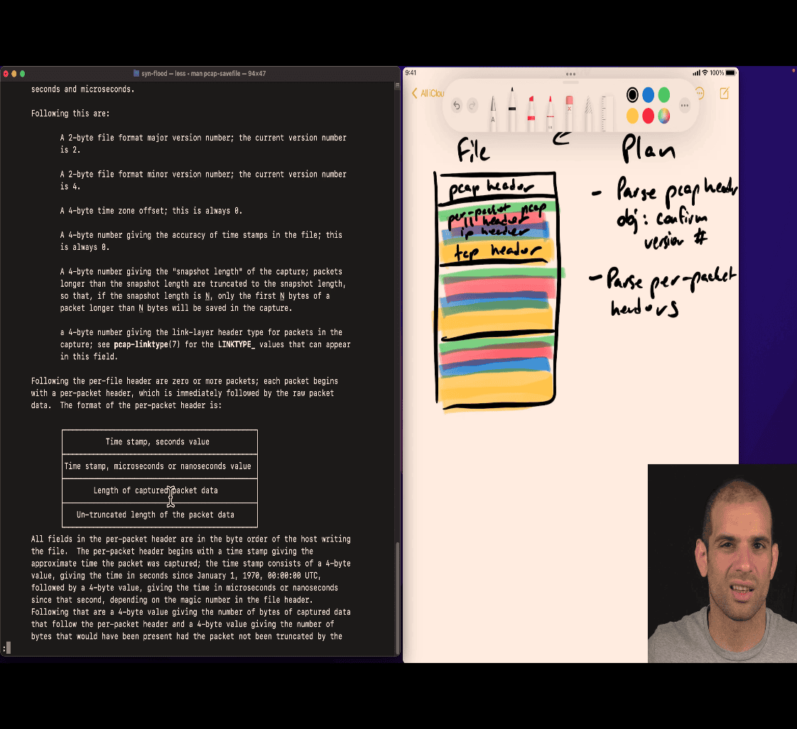
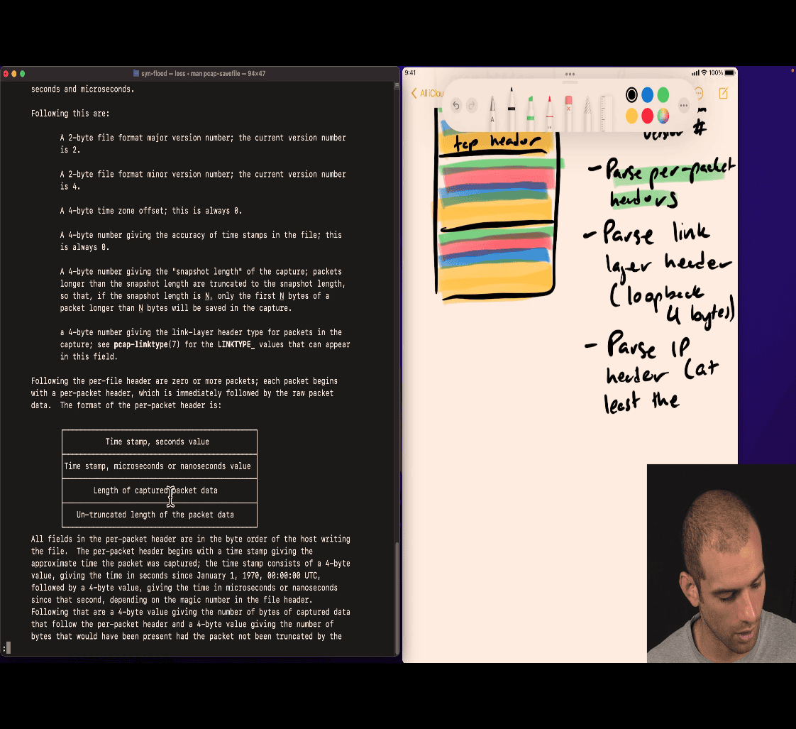

# CS_Primer

[C Programming Notes](https://www.eskimo.com/~scs/cclass/progintro/top.html)
[[1720715847-discord-learning]]

1. **Understand the problem**
2. Devise a plan
3. Implement the plan
4. Reflect / revise

---

# Heuristic

1. Draw a figure
1. Be Systematic
1. Is this similar to a solved / previous problem?
1. Induction (generalize from specific cases)
1. Decomposing / recomposing , e.g problem a, problem b, factoring a problem into a chunks
1. Solve a easier problem (could ask gpt, -> adjust the best level)
1. Definiton

> asking gpt about that particular small concept , and ask for practical use of xxx concept.

[[1737418909-cs61a|cs61a]]

[Learn to Code — For Free — Coding Courses for Busy People](https://www.freecodecamp.org/learn)

> [Teach Yourself Computer Science](https://teachyourselfcs.com/#math)

- [Composing Programs](https://www.composingprograms.com/) python version of sicp
  [CS 61A Summer 2019](http://web.archive.org/web/20191030034034/https://inst.eecs.berkeley.edu/~cs61a/su19/)
  CS Barkely Career Road:
  [Eta Kappa Nu (HKN), Mu Chapter](https://hkn.eecs.berkeley.edu/courseguides)
  [UC BerkeleyCS61B数据结构Java - 名校公开课程评价网](https://conanhujinming.github.io/comments-for-awesome-courses/%E6%95%B0%E6%8D%AE%E7%BB%93%E6%9E%84%E4%B8%8E%E7%AE%97%E6%B3%95/UC%20BerkeleyCS61B%E6%95%B0%E6%8D%AE%E7%BB%93%E6%9E%84Java/)

[Online Python Tutor - Composing Programs - Python 3](https://pythontutor.com/cp/composingprograms.html#mode=edit)ss
[Lesabotsy/bootcamp](https://github.com/Lesabotsy/bootcamp/tree/main)

- seems like a great bootcamp

> Core learning mindset -> Hacker mindset

- project based -> achieving something -> searching the doc, left for book / tutorial , right for actual doc (book or official website)
- routines > yoga / sport / streching / boxing + enough energy
- mindmap -> use your code comment as your note --> enhancing your knowledge castle

using self host -> python testing like w3cschool

e.g. learning itertools python

import itertools as it ,

x= it.count(10)
dir(x) showing all the command from that , dir(it) -> show all the option from (it)
help (next) -> learning next synatax
using your command as a question to learn, instant feedback
import dis -> dis.dis(take) -> low level explaining

method two
using cursor ai editor
generate typical xxx

directing modify that code

- asking how to chang a little bit code
- how to get faster result

command entr

> entr bash -c "clear; go test $\*" < <(find .)

```bash
entr bash -c "clear; go test $*" < <(find .)
```

ls \*.c | entr -s 'cc primality.c && ./a.out'

cursor + ai + test and try

cursor -> typical code -> perperixty -> searching for ans or comparsion + ai learn model prompt + hand writing + anki + typing into database KPM

- programming c course -> [Dive into Systems](https://diveintosystems.org/singlepage/#_by_the_c_by_the_c_by_the_beautiful_c)
  [C Tutorial](https://www.w3schools.com/c/index.php)
  C project + cs course from low level restruct

- Must Watch
  > [Teach Yourself Computer Science](https://teachyourselfcs.com/#math)
- [Teach Yourself Programming in Ten Years](http://norvig.com/21-days.html)
  [How To Become A Hacker](http://www.catb.org/~esr/faqs/hacker-howto.html)
- [How To Learn Hacking](http://www.catb.org/~esr/faqs/hacking-howto.html)[How To Learn Hacking](http://www.catb.org/~esr/faqs/hacking-howto.html)
- thinker books
  [The Unix and Internet Fundamentals HOWTO](https://tldp.org/HOWTO/Unix-and-Internet-Fundamentals-HOWTO/index.html)
  might be outed [Single list of HOWTOs](https://tldp.org/HOWTO/HOWTO-INDEX/howtos.html)
  might be outed [LDP HOWTO-INDEX](https://tldp.org/HOWTO/HOWTO-INDEX/)

[Terminal Velocity](https://rwxrob.github.io/books/terminal-velocity/)

- podman - container -> linux -> learning
  [[1721344589-termkitty|term_kitty]]

[Books from Robert S. Muhlestein (rwxrob)](https://rwxrob.github.io/books/)

# discord

basically classic computer science projects
you can just do
15-213 (cs:app) + (Understanding UNIX/LINUX Programming: A Guide to Theory and Practice)
cs19
Plai etc
rigorously with all the problem sets
this is why i always shill csprimer.

python -> bit

watch command -> result

- entr

---

Let’s break this down step-by-step, like solving a fun puzzle!

The number 1 (easy example)

    •	01 in binary: 0000 0001
    •	The most significant bit (MSB) is not set (it’s 0), meaning this byte is the only one in the number.
    •	The rest of the bits (000 0001) represent the number 1. Done!

The number 150 (a little harder example)

The encoded value for 150 is 9601, which in binary is:

10010110 00000001

    1.	Step 1: Drop the MSBs
    •	The MSB is the leftmost bit of each byte.
    •	First byte: 10010110 → Drop MSB → 0010110
    •	Second byte: 00000001 → Drop MSB → 0000001

Now, we have the 7-bit chunks: 0010110 and 0000001. 2. Step 2: Little-endian order
• Little-endian means the smallest chunk (the one with the lowest place value) comes first.
• Reverse the order:

Original: 0010110 0000001  
Reversed: 0000001 0010110

    3.	Step 3: Concatenate (join them together)
    •	Stick the bits together to get one long binary number:

0000001 0010110 → 00000010010110

    4.	Step 4: Convert to decimal
    •	Break it down by place value:

00000010010110 = 128 + 16 + 4 + 2 = 150

Key points:

    •	The MSB is just a marker to tell you if there’s another byte after this one.
    •	The actual number is formed by dropping the MSBs, reversing little-endian order to big-endian, concatenating, and interpreting the result.

So, 9601 (encoded varint) = 150 (decoded value)! 🎉

[Encoding | Protocol Buffers Documentation](https://protobuf.dev/programming-guides/encoding/)

---

Polya

[The Value of Values with Rich Hickey - YouTube](https://www.youtube.com/watch?v=-6BsiVyC1kM)

[Amazon.com: Data and Reality: A Timeless Perspective on Perceiving and Managing Information in Our Imprecise World, 3rd Edition: 9781935504214: Kent, William, Hoberman, Steve: Books](https://www.amazon.com/Data-Reality-Perspective-Perceiving-Information/dp/1935504215)

---

# CS Career

[15 Years of Software Engineer Knowledge in 1 hour 30 mins - YouTube](https://www.youtube.com/watch?v=PJPFLHw8lKI&t=1123s)

- debug
  [[2024-12-17]]

some book recommendations:

1. clean code
2. you don't know js yet
3. **The phoenix Project**
4. Cracking the coding interview

building a side project to create credibility and a good story to tell

tell me about interesting project you work on, what is your role

Where are your knowledge gaps? + From the list, pick out technologies you need to learn and are also in demand.

---

One of the most powerful things you can do is to write down your goals. Without a clear path you can end up going down a path you did not intend. Wouldyou just jump into a car without a destination and start driving? Sail on a ship without a map? Then why spin your wheels learning Python, AWS, Kubernetes and Machine Learning when your real goal is to be a Senior Front
End Developer?

When you feel yourself getting eaten up by impostor syndrome or directionless - come back to this exercise.

Example: You just got promoted to senior software engineer but still feel like a junior.
The seniors on your team have an understanding of design patterns in ReactJS, excellent communication skills and the concepts of functional programming in US.
You realize you are lacking in a few of these areas. That's ok - and it's normal to feel like an impostor when you start a new job or get promoted but it's not ok to just wait the feeling out. It will eat you up from the inside.

What are the traits/skills of a person in my current position that I admire or respect? [[1718163444--rwxrob-twitch-list|# rwxrob twitch list]] very similir to rob slef- rating method
Get specific!
1 to 10 list
e.g. swe

1. design pattern
2. data structure
3. framework etc
   Now what skills do I not currently have that are on the list above?
4.
5.
6.

and try close the gap
Ok, now lastly, what is my plan to get these skills?
Example: To increase my leadership skills I will volunteer to lead an epic at work OR to get better at system design I will do a mock system design interview through Pramp.com

1.
1.
1.

---

# Basic Programming Area

[SICP 2024 Fall @ NJU](https://sicp.pascal-lab.net/2024/)
[Python Tutor code visualizer: Visualize code in Python, JavaScript, C, C++, and Java](https://pythontutor.com/visualize.html#mode=edit)
[ocaml-community/utop: Universal toplevel for OCaml](https://github.com/ocaml-community/utop)
**watch** for ocamn

REPLs
Compiler. This is why people who write in functional languages find it incredibly productives
[GitHub - pre-commitpre-commit A framework for managing and maintaining multi-language pre-commit hooks.](https://github.com/pre-commit/pre-commit)

- List out many possible [things to do] [actions to take] ie try to be exhaustive
- rank  
   Avoid failure mode -> force youself to rank the list

List, rank, iterate

- make 1 minute to think about which data structure you can use first

list out first in order to rank (assessment) - good way to avoid failure
Rank based on clear priority order

- iterate through the list ... start at the top and just keep going - trying another option if the first don't work
  for example
  **[[2024-12-19]]**

-> indeed it kind of force you to making decision

- after it is more need to get an execution phase -> should come back to list/rank/ iterats tmr
  - trying different method and update

e.g. goal : learn high performance python

- work through high performance python book
- learn to use cython
- learn to write c extension
- just find an open source project that needs to faster
- google for course
- reach out raymond hettinger for tutoring

mindset -> doing suitable challenging project rather than giving information

[[2025-01-02]]

- Higher order functions and recursion
  In most languages, it's possible to treat functions not just as a set of instructions, but as their own thing that can be bound to variables and passed around. This can often enable better program factoring, readability and code reuse.

Recursion is a power tool will often allow us to write code in a way that closely fits how a problem is expressed. Many structures in computing are nested, so we will often traverse or otherwise process them recursively. It's also a technique where deliberate practice is particularly helpful.

As a supplementary resource, consider Chapter 1.6 and Chapter 1.7 of Composing Programs as well as the Little Schemer book.

reduce() in python

# Luhn algorithm

simplfiy the code , refactor it into fuctional, minmize if else if from the code , changing math formula like a algebra

1. Create two method to main , seeing two way at the same time by using entr

# Look up table (skip the computation)

lookup = {'7': 5, '9' etc....
lookup = dict(zip('0123456789'),)

python -> dict (zip('123','acb')) --> Quick way to create a list {'1': 'a', '2': 'b'} etc

[[2025-02-03]]
reduce() -> high order function

---

# Learning through fast feedback

[Learning through fast feedback](https://csprimer.com/watch/fast-feedback/)

> A great way to increase your learning rate is to simply lower the amount of time taken to receive feedback. Not only will this increase the number of pieces of feedback you receive in the day, it will also remove a psychological barrier you may have to probing a system and asking questions.
> In this video I give a hint of how and why I use REPLs for this purpose when I can, but also how I use tools like entr and wach.
> [GitHub - eradman/entr: Run arbitrary commands when files change](https://github.com/eradman/entr)

---

A great way to increase your learning rate is to simply lower the amount of time taken to receive feedback. Not only will this increase the number of pieces of feedback you receive in the day, it will also remove a psychological barrier you may have to probing a system and asking questions.

In this video I give a hint of how and why I use REPLs for this purpose when I can, but also how I use tools like [entr](https://github.com/eradman/entr) and [wach](https://github.com/quackingduck/wach).

---

# Requirement for entry level programmer (for quant)

Their optimal candidate:

    has a very high standard of code quality
    knows about the CPU-arch execution pipeline and cache architecture
        what can cause a cache eviction
    knows how their chosen language's runtime works
        memory allocation can happen deep inside library code you import
        using free can add complexity (look how many lines of code it has)
    knows the standard algorithmic problem-solving strategies
        divide/decrease and conquer, transform and conquer, dynamic programming (min/max)
    knows at least the basics of probability or can teach themselves
        depends on role but translating MATLAB/SageMath programs is common
    is at least familiar with writing multicore code/concurrency
    knows what they don't know
        they catch the candidate bluffing during the interview and ask them to define on the spot any jargon used

[Home | OpenBSD Handbook](https://www.openbsdhandbook.com/) -> great doc for learning deep linux
arch linux as well

---

#2024-12-30

Wayback Mech
[CS 61A Summer 2019](http://web.archive.org/web/20191030034034/https://inst.eecs.berkeley.edu/~cs61a/su19/)

[Online Python Tutor - Composing Programs - Python 3](https://pythontutor.com/cp/composingprograms.html#mode=edit)

---

# Computer System

[CMU 15-213: CSAPP - CS自学指南](https://csdiy.wiki/%E8%AE%A1%E7%AE%97%E6%9C%BA%E7%B3%BB%E7%BB%9F%E5%9F%BA%E7%A1%80/CSAPP/)
这门课由于过于出名，全世界的码农争相学习，导致其 Project 的答案在网上几乎唾手可得。但如果你真的想锻炼自己的代码能力，希望你不要借鉴任何第三方代码。

认真学完这一门课，你对计算机系统的理解绝对会上升一个台阶。
有关 Lab 部分，同学们亦可参考 Arthals 在北大计算机系统导论（ICS）课程中所做的详尽笔记：
[第01章：计算机系统漫游 | CSAPP重点解读](https://fengmuzi2003.gitbook.io/csapp3e)

- cs bottom up github book

# Network

大名鼎鼎的 Stanford CS144: Computer Network，8 个 Project 带你实现整个 TCP/IP 协议栈。

如果你只是想在理论上对计算机网络有所了解，那么推荐计网著名教材《自顶向下方法》的配套学习资源 Computer Networking: A Top-Down Approach。

---

# Computer Systems

the 1 first problem

Alright, I’ll explain Protobuf varint in a simple way, like I’m talking to a friend who’s new to this!

Imagine you’re sending numbers over the internet, and you want to save space—like packing light for a trip. Normal integers (like 1, 50, or 1000) are usually stored using a fixed amount of space, say 4 bytes (32 bits), even if the number is small. That’s wasteful, right? A number like "5" doesn’t need all that room.

Protobuf varint (short for "variable-length integer") is a clever trick to use _just enough space_ for each number. Here’s how it works:

1. **Break it into tiny chunks**: Numbers are split into groups of 7 bits (not 8, because they use 1 bit for a special job—more on that in a sec). Why 7? It’s just a handy size they picked.

2. **Add a "continue" flag**: Each 7-bit chunk gets an extra bit (making it 8 bits total, or 1 byte). This bit is like a little note saying, “Hey, there’s more coming!” (1) or “Nope, I’m done!” (0).

   - If the number is small (like 5), it fits in one chunk, and the flag says “done” (0).
   - If it’s bigger (like 300), it takes more chunks, and all but the last one say “more coming” (1).

3. **Pack it tight**: These chunks get sent one after another. Small numbers take less space (maybe 1 byte), while big numbers take more (2, 3, or more bytes). It’s like using a small bag for a weekend trip but a bigger one for a month-long adventure.

### Example Time!

- Number: **5**

  - In binary: `101` (super small, only 3 bits).
  - Fits in one 7-bit chunk: `0000101`.
  - Add the "done" flag (0): `00000101` (1 byte total).
  - That’s it! Just 1 byte instead of 4.

- Number: **300**
  - In binary: `100101100` (9 bits, too big for 7).
  - Split into two 7-bit chunks:
    - First chunk: `00101100` (the lower 7 bits).
    - Second chunk: `0000010` (the leftover 2 bits, padded with zeros).
  - Add flags:
    - First chunk gets “more coming” (1): `100101100` (1 byte).
    - Second chunk gets “done” (0): `00000010` (1 byte).
  - Total: 2 bytes instead of 4.

### Why It’s Cool

Small numbers (like 1, 10, 100) use fewer bytes, saving space. Big numbers still work but take a bit more. It’s like shrinking your data to fit through a tiny pipe!

Does that make sense? Let me know if you want me to tweak it or add more examples!

---

that is the first problem concept protobuf varint

read the test file

- hexdump
- interpret as int

- implemen basic varint
  encoder

- implement docoder + roundtrip test

- reflector /

### Hex to Decimal: 96 = 150

Hexadecimal (base 16) is a way of writing numbers using digits 0–9 and letters A–F (where A=10, B=11, ..., F=15). Let’s convert 96 from hex to decimal:

- 9 in the "16¹" place (16s): 9 × 16 = 144.
- 6 in the "16⁰" place (1s): 6 × 1 = 6.
- Add them up: 144 + 6 = 150.

So, 96 in hex is 150 in decimal. Easy enough so far!

because 64 bits for all is wasting space in protcol, so protocol buffers cut in into 7 bits

- and the top number will be the flag there is more number (1 -> more) or (0 -> done)

concatenate the 7-bit pabload and interpret it as a litte-endian , 64-bit unsigned interger
[Encoding | Protocol Buffers Documentation](https://protobuf.dev/programming-guides/encoding/)

```language
10010110 00000001        // Original inputs.
 0010110  0000001        // Drop continuation bits.
 0000001  0010110        // Convert to big-endian.
   00000010010110        // Concatenate.
 128 + 16 + 4 + 2 = 150  // Interpret as an unsigned 64-bit integer.
```

why using n % 128 in encoding part?

2^7

Let’s dive into this code snippet and figure out why `n % 128` is there, keeping it simple since you mentioned you don’t have a CS background!

### What’s the Goal?

The first part of your code (`encode(n)`) looks like it’s trying to encode a number `n` into a Protobuf varint—a variable-length integer where numbers are split into 7-bit chunks, with an extra bit (the MSB, or most significant bit) to say “keep going” (1) or “stop here” (0). I explained this earlier: small numbers use fewer bytes, big ones use more.

The second part (`while n > 8`) seems like a different attempt at the same thing, but it’s incomplete and has some TODOs. That’s where `n % 128` shows up, and it’s got us curious!

### Breaking Down `n % 128`

- **`%` means "remainder"**: In programming, `n % 128` gives you the leftover after dividing `n` by 128. For example:
  - `150 % 128 = 22` (because 128 goes into 150 once, leaving 22).
  - `10 % 128 = 10` (no division needed, it’s already less than 128).
- **Why 128?**: 128 is `2^7`, which is the number of values you can fit in 7 bits (0 to 127). In Protobuf varint, each chunk holds 7 bits of the number, and the 8th bit is the “continue” flag.

### Connecting It to Varint Encoding

In varint encoding, you:

1. Grab the lowest 7 bits of the number.
2. Add a flag (1 if more chunks are coming, 0 if it’s the last).
3. Shift the number down by 7 bits and repeat until nothing’s left.

The `n % 128` in the second loop is likely trying to extract those lowest 7 bits:

- If `n` is 150 (binary `10010110`), then `n % 128` is 22 (binary `0010110`), which is the lower 7 bits (`0010110`).
- The 8th bit (the `1` in `10010110`) gets handled separately by adding the MSB (the TODO part).

So, `n % 128` is a way to say, “Give me just the 7-bit chunk I need right now,” because 128 masks off everything above the first 7 bits.

### Why Not Something Else?

- **Why not `n % 256`?**: 256 is `2^8` (a full byte), but varint only uses 7 bits per chunk for the number itself. Using 256 would grab 8 bits, which is too much.
- **Bitmask comment**: The TODO says “bitmask for possible speed.” A bitmask like `n & 127` does the same thing as `n % 128` (keeping the lowest 7 bits) and might be faster because it’s a direct binary operation, not a division. For example:
  - `150 & 127 = 22` (binary `10010110 & 01111111 = 0010110`).

### How It Fits

In the incomplete loop:

```python
while n > 8:  # Should probably be while n > 0 to catch all cases
    part = n % 128  # Get the lowest 7 bits
    # TODO: Add MSB (1 if more, 0 if last)
    # Push `part` to a byte sequence
    # Reduce n (like n //= 128 or shift right 7 bits)
```

- `n % 128` grabs the 7-bit chunk (0–127).
- The MSB (1 or 0) gets added to make it a full byte (8 bits).
- Then you’d shrink `n` and keep going.

For 150:

- First chunk: `150 % 128 = 22`, add MSB `1` (more coming), byte = `10010110` (hex `96`).
- Shrink `n`: `150 // 128 = 1`.
- Next chunk: `1 % 128 = 1`, add MSB `0` (done), byte = `00000001` (hex `01`).
- Result: `96 01`.

### Why `n > 8`?

The condition `while n > 8` is odd—should be `n > 0` to encode all bits. Maybe a typo or a different intent!

### Simple Answer

`n % 128` is there to pull out the lowest 7 bits of `n` at each step, because that’s what varint needs: 7-bit pieces to pack the number tightly. The 128 comes from `2^7`, matching the 7-bit chunk size.

Does that make sense? Want me to tweak the code to finish it for you?

- 7 bits part for part

---

- TCP SYN flood (problem)
- important binary data -> network
- three shake connection
  - only ack(last step work will be done) ~> drawback

self checking?
Latency ?
server full answer ?

man 5 pacp-savefile
based on binary , not unix, file extension

Plan

- parse code ~> to code locate your mistake => this is a way to find error

binary number is hard to find error

header -> stage check? 🤔

It seems like you’re asking about a TCP SYN flood attack and how to analyze it by parsing a packet capture (pcap) file, focusing on IP and TCP headers, possibly referencing a timestamp or duration like "52:52." Since you don’t have a CS background, I’ll keep this as simple as possible, like explaining it over coffee! Let’s break it down.

---

### What’s a TCP SYN Flood?

Imagine you’re a waiter at a busy restaurant (a server). Customers (clients) walk in and say, “Hey, save me a table!” (this is a TCP SYN packet—a request to start a connection). You say, “Sure, I’ll set it up,” and hold the table (the server sends a SYN-ACK back). Normally, the customer sits down (sends an ACK), and you’re all good.

A **TCP SYN flood** is like a prank: tons of fake customers flood in, asking for tables, but never sit down. You run out of tables (server resources) because you’re holding spots for people who never show up. In tech terms:

- **SYN**: Start of a TCP connection (client says "hello").
- **Flood**: Tons of these requests overwhelm the server.
- Goal: Crash or slow down the server (a type of denial-of-service attack).

---

### What’s a Pcap File?

A pcap file is like a video recording of all the network traffic—like capturing every "hello" shouted at the restaurant. It logs packets (chunks of data) with details like who sent them, where they’re going, and what they’re saying. To spot a SYN flood, we’ll look at the **IP header** (the address label) and **TCP header** (the message type).

---

### IP Header: The Address Label

The IP header tells us:

- **Source IP**: Who’s sending the packet (the prankster’s fake address).
- **Destination IP**: Who’s getting attacked (the restaurant/server).

In a SYN flood, you might see lots of different source IPs (spoofed/fake) hitting one destination IP over and over.

---

### TCP Header: The Message Type

The TCP header is where the action is. Key parts:

- **SYN flag**: A bit set to `1` means “I want to start a connection.” In a SYN flood, almost all packets have this flag on.
- **ACK flag**: A bit set to `0` (or not set) means no acknowledgment yet. In a flood, attackers don’t reply with ACKs.
- **Sequence Number**: A random ID for the connection. Floods might reuse these or make them random.

A normal connection looks like:

1. Client: SYN → Server
2. Server: SYN-ACK → Client
3. Client: ACK → Server

In a SYN flood, you only see step 1—tons of SYN packets, no follow-up ACKs.

---

### Parsing a Pcap to Spot a SYN Flood

“Parsing” just means reading the pcap file and pulling out the juicy bits. Here’s what you’d do:

1. **Open the pcap**: Use a tool (like Wireshark) or write code (e.g., in Python with `scapy`) to read each packet.
2. **Check the IP header**:
   - Count how many packets go to the same destination IP. A flood targets one server, so you’ll see a pile-up.
   - Look at source IPs. Are they all different (spoofed) or from one sneaky attacker?
3. **Check the TCP header**:
   - Filter for packets with SYN flag = 1 and ACK flag = 0. These are the “save me a table” requests.
   - Look for missing ACKs. If the server replies with SYN-ACK but no ACK comes back, it’s suspicious.
4. **Count and time it**: If you see hundreds or thousands of SYN packets in a short time (like "52:52" minutes?), it’s a flood.

---

### Example: What You Might See

In a pcap with a SYN flood:

- Packet 1: Src IP `192.168.1.1` → Dest IP `10.0.0.5`, SYN = 1, ACK = 0
- Packet 2: Src IP `192.168.1.2` → Dest IP `10.0.0.5`, SYN = 1, ACK = 0
- Packet 3: Src IP `192.168.1.3` → Dest IP `10.0.0.5`, SYN = 1, ACK = 0
- …and 1000s more, all hitting `10.0.0.5` with SYN but no ACKs.

Normal traffic has a mix of SYN, SYN-ACK, and ACK, not just a barrage of SYNs.

---

### The "52:52" Part

You mentioned “52:52”—maybe it’s a typo, a duration (52 minutes, 52 seconds?), or a reference I’m missing. If it’s time-related, it could mean the attack lasted that long in the pcap. If it’s something else, let me know, and I’ll adjust!

---

### Simple Takeaway

To analyze a SYN flood in a pcap:

- **IP header**: Look for one destination IP getting hammered by many source IPs.
- **TCP header**: Spot tons of SYN flags (1) with no ACKs (0).
- It’s like seeing a restaurant swamped with fake reservations—no one’s actually eating!

Does this click? Want me to sketch out a simple Python example or clarify anything?

---






