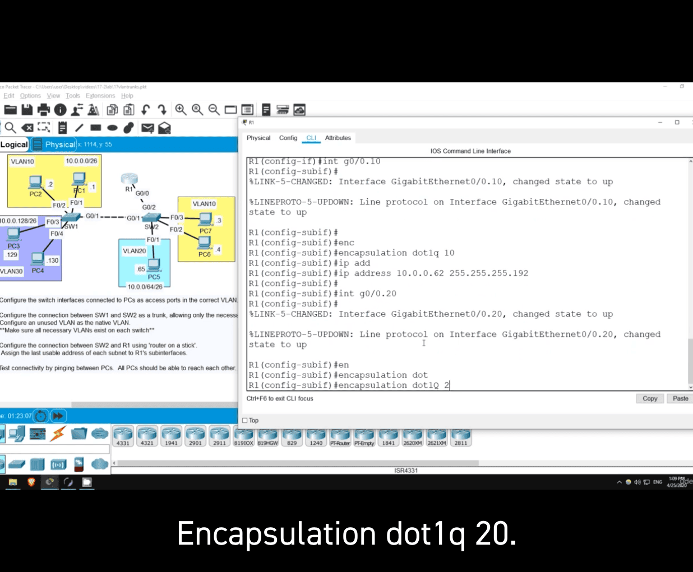
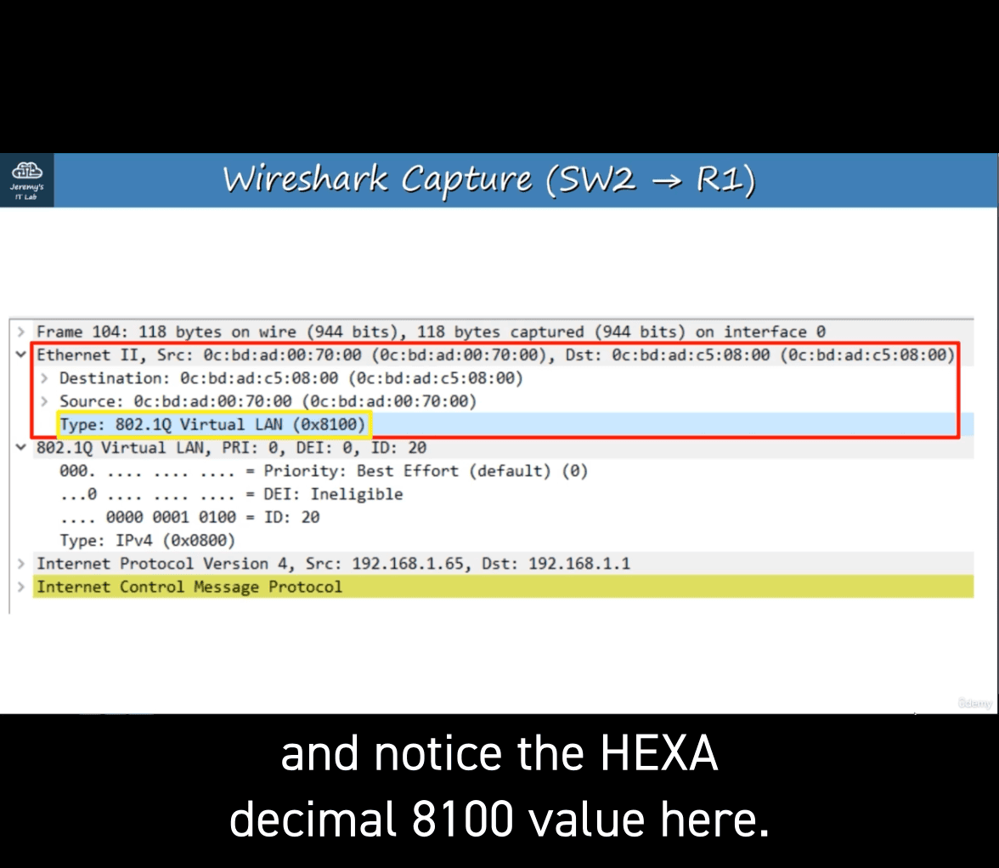

# ccna-notes8-vlan

Broadcast frame = destination MAC FFFF.FFFF.FFFF,

- switch will automatically broadcast except the one who sent it
- router will drop 

R1 => R2 (still broadcast domain)
router to router can also count as 1 lan

A broadcast domain is the group of devices which will receive a broadcast frame (destination MAC FFFF.FFFF.FFFF) sent by any one of the members.

- Performance: Lots of unnecessary broadcast traffic can reduce network performance.
e.g HR => broadcast to all other departments

Security: Even within the same office, you want to limit who has access to what.
You can apply security policies on a router/firewall. Because this is one LAN, PCs can reach each other directly, without traffic passing through the router. So, even if you configure security policies, they won't have any effect.


- adding separate connections in each subnet
    - can be more efficient 


- However , if missing the dst. mac address:

Like
Src. IP: 192.168.1.1
Dst. IP: 192.168.1.63
Src. MAC: PC1 MAC
Dst. MAC: FFFF.FFFF.FFFF
- switch only aware in layer 2
    - switch will fload all the mac address

Although we separated the three departments into three subnets (Layer 3), they are still in the same broadcast domain (Layer 2).

- VLan -> to seperate it


- only sent it to same vlan (Broadcast)
- if sent to other department:(through router)

VLANS...
- are configured on switches on a per-interface basis.
* logically separate end hosts at Layer 2.

Switches do not forward traffic directly between hosts in different VLANS.

sh
command : **show vlan brief:** 

VLANSs 1,1002-1005 exist by default and cannot be deleted.

(config)interface range g1/0-3 
- **switchport mode access**
- **switchport access vlan 10**

what is access port?
- An access port is a switchport which belongs to a single VLAN, and usually connects to end hosts like PCs.
- Switchports which carry multiple VLANSs are called ‘trunk ports’.

- if switchport mode acces , (vlan not exist , => it will create one)

interface range g3/0-3 -> mode acces-> swictport access vlan 30


- vlan 10 
    - name eng 
- vlan 20
    - name hr


- broadcast domains 


- counting router as well


You create VLANs 10, 20, and 30 on a Cisco switch. How many VLANs will be  displayed in the output of the show vlan brief command?

ans : 8
- some of that is defalt built-in 

---

# Trunk Ports

You can use trunk ports to carry traffic from multiple
VLANSs over a single interface.

- it solved the situation where not have enough interfce for each vlan when the number of vlans increas

- how does switch one know which vlan it belongs to?
    - vlan tagging

Switches will ‘tag’ all frames that they send over a trunk link. This allows the receiving switch to know which VLAN the frame belongs|

Trunk ports = ‘tagged’ ports
Access ports = ‘untagged’ ports


# Vlan tagging

ISL and IEEE 802.1Q.

IEEE 802.1Q is an industry standard protocol created by
the IEEE (Institute of Electrical and Electronics Engineers).

You will probably NEVER use ISL in the real world. Even
modern Cisco equipment doesn’t support it. For the CCNA,
you only need to learn 802.1Q.


The 802.1Q tag is inserted between the Source and
TypelLength fields of the Ethernet frame.
The tag is 4 bytes (32 bits) in length.
The tag consists of two main fields:
Tag Protocol Identifier (TPID)
Tag Control Information (TCI)
The TCI consists of three sub-fields.


0x8100


12 bits in length = 4096 total VLANSs (2^12) range of 0 - 4095
VLANSs 0 and 4095 are reserved and can't be used.

- The actual range of VLANs is 1 — 4094


---

802.1Q has a feature called the native VLAN.
(ISL does not have this feature)

- The switch does not add an 802.1Q tag to frames in the native VLAN.

- When a switch receives an untagged frame on a trunk port, it assumes the frame belongs to the native VLAN.

> important that the native vlan matches

- without vlan tag, system will just send it to native vlan tag, if vlan tag don't contains that ip, stop sending

-> has to create correct trunk port


Many modern switches do not support Cisco’s ISL at all. They only support 802.1Q (dotlq)

However, switches that do support both (like the one I'm using in this example) have a trunk encapsulation of ‘Auto’ by default. )

To manually configure the interface as a trunk port, you must first set the encapsulation to 802.1Q or ISL. On switches that only support 802.1Q, this is not necessary.

- set encapsulation to **8020.1 Q** or ISL

- switchport mode trunk
    - check
```bash
switchport trunk encapsulation dot1q
```
`switchport trunk allowed vlan` 
`switchport trunk allowed vlan ?(tab)` 
option : 
- Word
- add 
- all 
- except 
- none 
- remove 

`switchport trunk allowed vlan 10,30` 

`switchport trunk allowed vlan add 20`

switchport trunk allowed remove 20

switchport trunk allowed **vlan all**
**except 1-5, 10** 
**alowed vlan none**

- For security purposes, it is best to change the **native VLAN to an unused VLAN.**
(network security will be explained more in-depth later in the course) **Make sure the native VLAN matches on between switches**
    limiting access network

```language
**switchport trunk native vlan 1001**
```

show vlan brief
**- The show vlan brief command shows the access ports assigned to each VLAN, NOT the trunk ports that allow each VLAN.**

Use the show interfaces trunk command instead to confirm trunk ports.
----------
# ROAS 
router on a stick

`no shtutdown` 

`interface g0/0.10` 

The subinterface number does not have to match the VLAN number. However it is highly recommended that they do match, to make it easier to understand.

`encapsulation dot1q 10(vlan number)` 


- assigned last usable address for the subnet
- interface g0/0.20 => encapsulation dot1q 20(vlan number)
    - assigned last usable address for the subnet

`show ip interface brief` 


ip route

ROAS is used to route between multiple VLANS using a single interface on the router and switch.

The switch interface is configured as a regular trunk.
The router interface is configured using *subinterfaces*. **You configure the VLAN tag and IP address on each subinterface.**

The router will behave as if frames arriving with a certain VLAN tag have arrived on the subinterface configured with that VLAN tag.

The router will tag frames sent out of each subinterface with the VLAN tag configured on the subinterface.


vlan 10 => vlan 30 (right to left)
1. g0/1(SW2) -> R1 -> G0/0.10(sw2 with tag vlan30) -> SW1

case left address -> 192.168.1.128/26 = R1 g0/0.10
- seems like it

---
vlan quiz


a -> router inface to check which it belongs to

b and c -> B and C are used to modify the vln allowed on the trunk

d : used to specify the native vlan and traffic in the traffic native vlan is sent untagged over the trunk


manually set it to -> trunk


- VID vlan ID -> 12 bits 

TPID -> tag protocol identifer and uses a 0x8100

Pcp -> priority code point -> class of service

d -> fake name


# Lab for vlan 2


```bash
en 
configure terminal 
int range f0/1-2 
switchprt mode ac (access)
sw ac vlan 10 

```

- this create a vlan in the f0/1-f0/2
- creating vlan

click on sw2  and do the same


```bash
switchport trunk ?
```
- not option in encapsulation
    - dot1q

```bash
on switch 1
sw trunk all
sw trunk allowed vlan
sw trunk allowed vlan 10,30
```

why not vlan 20 ? because vlan20 isn't connected to this swicth


```bash
sw trunk native vlan 1001 (anything here but unuse vlan)
 do show vlan br

do sh vlan br
```

```bash
(switch 2)
int g0/1
sw mode trunk
sw trunk allowed vlan 10,30
- (still skipping vlan 20 as there isn't any related vlan20)

sw trunk native vlan 1001

do sh vlan br (brief)
do sh int(interface) trunk

```


- second line => only 10 allowed and active in management doman ❌
    - because vlan 30 doesn't have switch yet ⭕

```bash
on switch2 
vlan 30 
exit 

do sh int trunk

```
- vlan 30 and then *exit* =_= -> fixed this 

# ROAS now

```bash
on switch2
int g0/2
sw mode trunk
sw trunk all
sw trunk allowed vlan 10,20,30
sw trunk nat 
sw trunk native vlan 1001

```

```bash
on R1 (router 1)
en 
conf t

- enable the physical interface
int g0/0
no shut 
- cisco router interfaces are disabled by default

int g0/0.10
- this subnet number should match the vlan number even it is not a must

encapsulation dot1q 10
- last usable ip address on that subnet
IP address 10.0.0.62 255.255.255.192.

- router could be first / last usable ip address , good for understanding of the large network

int g0/0.20
encapsulation dot1q 20

```

# IP address reminder:
Let's calculate the **last usable IP address** for the subnet **10.0.0.62/26**, assuming VLAN 10 with **encapsulation dot1q 10**.

---

### **Step 1: Subnet Details**
- **Given IP:** 10.0.0.62/26  
- **Subnet Mask:** 255.255.255.192 (/26)  
- **Subnet Size:** \( 2^{(32-26)} = 2^6 = 64 \)  
- **Subnet Range:** Each /26 subnet increments by **64**.

192 :  

11111111.11111111.11111111.11000000
Convert each octet from binary to decimal:
11111111 = 255
11111111 = 255
11111111 = 255
11000000 = 192

---

### **Step 2: Determine the Subnet Range**

Since the subnet mask is `/26`, the subnet block sizes are:

- Subnets:  
  ```
  10.0.0.0 - 10.0.0.63
  10.0.0.64 - 10.0.0.127
  ```

Since **10.0.0.62** falls within the first range, the subnet is:

- **Network Address:** 10.0.0.0  
- **Broadcast Address:** 10.0.0.63  

---

### **Step 3: Usable IP Range**

- **First usable IP:** 10.0.0.1  
- **Last usable IP:** **10.0.0.62**  

---

### **Step 4: Encapsulation Configuration**

If you're configuring a router interface with **802.1Q VLAN tagging**, the configuration would look like this:

```bash
interface GigabitEthernet0/0.10
 encapsulation dot1q 10
 ip address 10.0.0.62 255.255.255.192
```

---

### **Answer:**
The **last usable IP address** for the subnet **10.0.0.62/26** is **10.0.0.62**, and you can assign it to your router with the encapsulation for VLAN 10.

---

## step2 explanation
Sure! Let's break it down step by step to explain how the subnet range is determined for **10.0.0.62/26**.

---

### **Step 1: Understanding the Subnet Mask /26**

- **A /26 subnet mask** means that the first **26 bits** of the IP address are used for the **network portion**, and the remaining **6 bits** are used for **host addresses**.
- The decimal equivalent of the /26 subnet mask is:  
  **255.255.255.192**, which corresponds to binary:

  ```
  11111111.11111111.11111111.11000000
  ```

- The **last 6 bits** (because 32 - 26 = 6) define the number of host addresses within a single subnet.

---

### **Step 2: Subnet Block Size Calculation**

The **block size** (or subnet increment) is calculated based on the remaining host bits:

\[
2^{\text{remaining host bits}} = 2^6 = 64 \text{ total IPs per subnet}
\]

This means each /26 subnet covers **64 addresses**, starting from 0 and increasing in steps of 64.

---

### **Step 3: Determine Subnet Ranges**

Since the block size is 64, the subnet ranges in the 10.0.0.0 network would be:

- **First subnet:**  
  - Starts at **10.0.0.0**  
  - Ends at **10.0.0.63** (since 0 + 64 = 64, the last address is 64 - 1 = 63)
  
- **Second subnet:**  
  - Starts at **10.0.0.64**  
  - Ends at **10.0.0.127** (since 64 + 64 = 128, last address is 128 - 1 = 127)

---

### **Step 4: Why 10.0.0.62 Falls in the First Subnet**

Given the IP address **10.0.0.62**, check which subnet it belongs to:

- Since **10.0.0.62** falls between **10.0.0.0 - 10.0.0.63**, it belongs to the first subnet.

---

### **Step 5: Important Subnet Addresses**

Within the first subnet (**10.0.0.0/26**):

- **Network Address (first address):**  
  - **10.0.0.0** → Identifies the subnet itself (not usable for hosts)
  
- **Broadcast Address (last address):**  
  - **10.0.0.63** → Used to send data to all hosts in the subnet (not usable for hosts)

Thus, the usable IP range is:

- **Usable IPs:** 10.0.0.1 to **10.0.0.62**  
- The **last usable IP address** is **10.0.0.62**, which you can assign to your router.

---

### **Conclusion**

Your given IP address, **10.0.0.62**, falls into the first subnet, which ranges from **10.0.0.0 to 10.0.0.63**, where:

- **10.0.0.0** = Network address  
- **10.0.0.1 - 10.0.0.62** = Usable addresses  
- **10.0.0.63** = Broadcast address  

---

## int g0/0.10


## ## int g0/0.20


The router's IP address (last usable) for the subnet 10.0.0.64/26 is **10.0.0.126**.

**Step-by-Step Explanation:**
1. **Subnet Mask:** /26 means the first 26 bits are for the network, leaving 6 bits for hosts.  
   Subnet Mask: `255.255.255.192` (Binary: `11111111.11111111.11111111.11000000`).

2. **Network Address:** `10.0.0.64` (the given subnet).  
   - Hosts range: `10.0.0.65` to `10.0.0.126` (since `10.0.0.127` is the **broadcast address**).  

3. **Last Usable IP:** The address before the broadcast (`10.0.0.127`), so **10.0.0.126**.  

This is typically assigned to the router/gateway.


For the subnet **10.0.0.128/26**, the router’s IP address (last usable IP) is **10.0.0.190**.  

**Step-by-Step Explanation:**  
1. **Subnet Mask:**  
   - `/26` means the first 26 bits are for the network, leaving 6 bits for hosts.  
   - Subnet Mask: `255.255.255.192` (Binary: `11111111.11111111.11111111.11000000`).  

2. **Network Address:**  
   - The given subnet is **10.0.0.128/26**.  

3. **Host Range:**  
   - **First Usable IP:** `10.0.0.129` (first address after the network address).  
   - **Last Usable IP:** `10.0.0.190` (address before the broadcast address).  
   - **Broadcast Address:** `10.0.0.191` (last address in the subnet).  

4. **Router/Gateway:**  
   - Typically, the **last usable IP** (`10.0.0.190`) is reserved for the router.  

**Summary:**  
- Subnet: `10.0.0.128/26`  
- Usable IPs: `10.0.0.129` – `10.0.0.190`  
- Router IP: `10.0.0.190`


- Part 2 end

---
- bosom exam for ccna exam mock
native vlan on a router
wireshark analysis
layer 3 switching/multilayer switching

ccna remove belowed below topic but is essetial for understanding the ccna
    DTP (Dynamic Trunking Protocol)
    VTP (VLAN Trunking Protocol)


- method 1 :

-Use the command encapsulation dotlq vlan-id native on the router subinterface.

- sw2 to r1
(vlan20 to r1 icmp echo requst)



type Virtual lan :0x8100

vlan ID: 20 (vlan 20)

another type : IPv4 (0x0800)

icmo requst from r1 back to vlan20

- method 2

- Configure the IP address for the native VLAN on the router’s physical interface (the encapsulation dotilq vlan-1id command is not necessary)


- first one is vlan 10 ip 
- other is using interface gigabitethernet to subvlan 


# Layer 3 (mulitilayer ) switches

A multilayer switch is capable of both switching AND routing.
Itis ‘Layer 3 aware’.
You can assign IP addresses to its interfaces, like a router.

You can create virtual interfaces for each VLAN, and assign
IP addresses to those interfaces.

You can configure routes on it, just like a router.
It can be used for inter-vlan routing

sw2 into multilayer switch now


> comfortable converting between binary and dotted decimal is key! 

A common rookie mistake (and the subject of many networking memes—yes, such a thing exists!) is to forget the add keyword when modifying the list of allowed VLANs on a trunk. For example, if you want to add VLAN 40 to the list of allowed VLANs, but you use the command switchport trunk allowed vlan 40, you haven’t added VLAN 40 to the list of allowed VLANs; you have replaced the list of allowed VLANs with only VLAN 40! 


It’s a simple mistake, but the results can be disastrous: blocking all communications over the trunk except for hosts in a single VLAN. This is a potential “trick question” on the exam, so make sure you are aware of the difference between specifying the list of allowed VLANs (switchport trunk allowed vlan vlans) and adding to the list of allowed VLANs (switchport trunk allowed vlan add vlans). 


----

EXAM TIP The default VLAN and the native VLAN are often confused. The default VLAN is the VLAN that access ports are assigned to by default: VLAN 1 (this cannot be changed). The native VLAN is the VLAN that untagged frames are assigned to when received on a trunk port, and frames in the native VLAN are forwarded untagged over that port. The native VLAN is also VLAN 1 by default, but this can be changed per port. 


in normal case , same case as before

it will send through router first with according tag, like vlan 20 (before ), after r1 , -> vlan 10  -> vlan 10 to sw1 , -> des

**SVIs** (Switch Virtual Interfaces) are the virtual interfaces you can assign IP addresses to in a multilayer switch.

Configure each PC to use the SVI (NOT the router) as their gateway address.


- no interface (require reload afterward)


- with/30


- ip routing -> allow  layer 3


- now allow to sign ip address into it


switch 2 to defalut to point r1

show interfaces status -> comfirm


now started to config svi


svi are stutdown by dafault
 no shutdown

another example ih  (another sv1 for a vlan dosn't exist)


down down  (because vlan don't exist)

---

usually when asign access point to vlan (it will auto create vlan if it dosent't existt )

- but not for svi clearly

requirments to create svi :
(in our case , as r1 can provide up for vlan30 in switch 2 so , vlan 30 is up as well)


- work result


 


