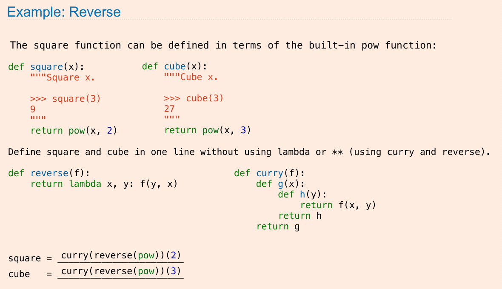
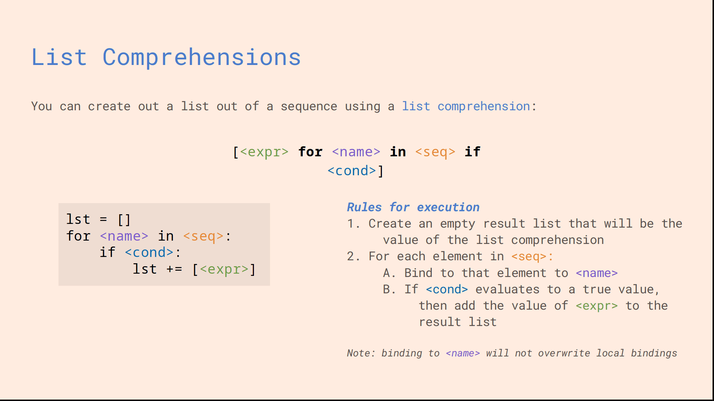

# cs61a

[(157) John DeNero - YouTube](https://www.youtube.com/@JohnDeNero/playlists)

- crash crouse playlist

[自学编程 CS自学社区 | CS自学社区](http://www.learncs.site/)
[shuo-liu16/CS61A: CS61A 2024sp，这是一场有趣的旅程。](https://github.com/shuo-liu16/CS61A)

[csfive/composing-programs-zh: 🦊 CS61A æ•™æ Composing Programs 的中文翻译](https://github.com/csfive/composing-programs-zh)
[[2021 Spring] CS61A 学习笔记 索引 - ikventure - åšå®¢å›­](https://www.cnblogs.com/ikventure/p/14984919.html)

sicp book -> little scheme
[SICP Lecture Notes](https://mk12.github.io/sicp/lecture/index.html)

- Functions are first-class, meaning they can be manipulated as values

# A higher-order function is:

1. A function that a function as an argument
   and/or
2. A function that returns a function as a return value

# Describing funtions

- function's domain
  - all inputs that might be as arguments
- function's range
  - set of output values it might possibly return
- function's behavior
  - relationship that creates btw input and output


Don’t repeat yourself (DRY). Implement a process just once, but execute it many times.

e.g round (1.23,1), ronud(1.23)

---

Great question! The reason why `term(k)` is equal to the `identity` function (i.e., why calling `term(k)` effectively means calling `identity(k)`) lies in how functions are passed as arguments in Python.

---

### **1. Function as an Argument (Function Reference)**

When you call:

```python
summation(n, identity)
```

You are passing the `identity` function itself as an argument to the `summation` function. Notice that you're passing **the function reference**, **not** calling it with parentheses (`identity()`).

**Key point:**

- `identity` (without parentheses) is a reference to the function.
- `identity(x)` (with parentheses) would immediately execute the function.

So when `summation` is defined as:

```python
def summation(n, term):
    total, k = 0, 1
    while k <= n:
        total, k = total + term(k), k + 1  # calling term with k
    return total
```

Here, `term` acts as a placeholder for any function passed to `summation`. If you pass `identity`, then inside the loop:

```python
total, k = total + term(k), k + 1
```

Becomes:

```python
total, k = total + identity(k), k + 1
```

Thus, `term(k)` effectively translates to `identity(k)` when `identity` is passed as an argument.

---

### **2. Why Not Call `identity(k)` Directly?**

If you had written `summation(n, identity(k))`, this would cause an error or unintended behavior because:

- `identity(k)` would be executed immediately **before** being passed to `summation`.
- Instead of passing the function, you'd be passing the **result** of `identity(k)` when `summation` starts, which is not the intended behavior.

---

### **3. Example to Clarify the Concept**

Consider this example:

```python
def example(func):
    return func(5)  # Calling the function with 5

def double(x):
    return x * 2

print(example(double))  # Pass function reference, outputs 10
```

- Here, `example(double)` passes the function `double` without executing it.
- Inside `example`, we call `func(5)`, which results in `double(5)`.

---

### **4. Visualizing the Execution of `sum_naturals(10)`**

When you call:

```python
sum_naturals(10)
```

It expands like this:

```python
summation(10, identity)
```

- Inside `summation`, the function `identity` is assigned to the parameter `term`.
- Then `term(k)` calls `identity(k)`, meaning it just returns `k` as is.

---

### **5. Another Example for Better Understanding**

```python
def greet(name):
    return f"Hello, {name}!"

def caller(func, value):
    return func(value)

print(caller(greet, "Alice"))  # Output: "Hello, Alice!"
```

Here:

- `caller(greet, "Alice")` means that `func = greet`, so `func(value)` → `greet("Alice")`.

---

# Let's break down the key concepts from this section on **nested function definitions, lexical scoping, and environment models**, step by step.

---

## **1. Why Use Nested Functions?**

In the previous example, functions like `golden_update` and `square_close_to_successor` were defined globally. However, this leads to two main problems:

1. **Name Clutter:**

   - Many small functions pollute the global namespace.
   - All function names must be unique, which can make naming difficult.

2. **Argument Restrictions:**
   - Some functions, like `sqrt_update`, require multiple parameters, but the `improve` function expects an update function that takes only one argument.

### **Solution: Nested Functions**

Nested function definitions solve both of these problems by allowing functions to be defined **inside** another function. This way, helper functions remain hidden (local), reducing global clutter and providing flexibility in managing arguments.

---

## **2. Example: Computing the Square Root Using Nested Functions**

Here's an example of using nested functions to compute the square root of a number:

```python
def average(x, y):
    return (x + y) / 2

def approx_eq(x, y, tolerance=1e-3):
    return abs(x - y) < tolerance

def sqrt(a):
    def sqrt_update(x):
        return average(x, a / x)  # Nested function uses 'a' from sqrt's scope

    def sqrt_close(x):
        return approx_eq(x * x, a)  # Another nested function

    return improve(sqrt_update, sqrt_close)
```

### **Step-by-Step Explanation of Execution**

When you call `sqrt(256)`, the following happens:

1. **Local frame creation:**

   - A new local frame for `sqrt` is created with `a = 256`.

2. **Nested function definitions:**

   - `sqrt_update` and `sqrt_close` are defined **inside** the `sqrt` function.
   - They have access to the `a` parameter from `sqrt` due to **lexical scoping**.

3. **Calling `improve`:**
   - `improve` is called with these nested functions, iteratively improving the guess until convergence.

---

### **3. Key Concept: Lexical Scoping**

Lexical scoping means that **nested functions have access to variables defined in the enclosing function's scope**.

#### **Example:**

In the `sqrt` function:

```python
def sqrt(a):
    def sqrt_update(x):
        return average(x, a / x)  # 'a' comes from the outer function 'sqrt'

    def sqrt_close(x):
        return approx_eq(x * x, a)

    return improve(sqrt_update, sqrt_close)
```

Here, both `sqrt_update` and `sqrt_close` can directly access `a`, even though `a` is not passed to them explicitly. This works because Python resolves variables using the **enclosing scope**.

---

### **4. Environment Model with Nested Functions**

To understand how Python handles nested functions, consider the environment model:

1. **Before calling `sqrt(256)`:**

   - The `sqrt` function exists in the **global environment**.

2. **When `sqrt(256)` is called:**

   - A **new local frame** for `sqrt` is created with `a = 256`.
   - The local environment is established where `sqrt_update` and `sqrt_close` are defined.

3. **Calling `improve`:**
   - `improve` is invoked with the nested functions.
   - When `sqrt_update` is called inside `improve`, it looks for `a` in its **parent environment**, which is the local environment of `sqrt`.

---

### **5. Scope Lookup Order (LEGB Rule)**

Python follows the **LEGB rule** when resolving variable names:

1. **Local (L):** Variables inside the function.
2. **Enclosing (E):** Variables from outer (enclosing) functions.
3. **Global (G):** Variables defined at the top level of the module.
4. **Built-in (B):** Variables from built-in Python functions.

Thus, in our example:

- `a` is not found in `sqrt_update`'s local scope.
- It checks the enclosing function `sqrt` and finds `a` there.
- If not found in `sqrt`, it would check the global scope.

---

### **6. Advantages of Nested Functions**

Using nested functions provides several benefits:

1. **Encapsulation:**

   - Helper functions (`sqrt_update` and `sqrt_close`) are not exposed globally.
   - They are only accessible within `sqrt`, reducing potential conflicts.

2. **Cleaner Code:**

   - Keeps related logic together within the function.
   - Easier to understand and modify.

3. **Avoiding Unnecessary Arguments:**
   - Nested functions can access outer function variables without passing them explicitly.

---

### **7. Practical Example: Using Nested Functions in Other Scenarios**

#### **Example: Factorial Calculation**

```python
def factorial(n):
    def fact_helper(acc, k):
        if k > n:
            return acc
        return fact_helper(acc * k, k + 1)
    return fact_helper(1, 1)

print(factorial(5))  # Output: 120
```

#### **Example: Finding the Fixed Point of a Function**

```python
def fixed_point(f, guess=1):
    def close_enough(x):
        return approx_eq(f(x), x)

    def update(x):
        return f(x)

    return improve(update, close_enough)

print(fixed_point(lambda x: 1 + 1/x))  # Approximates the golden ratio
```

---

### **8. Comparison of Nested vs. Global Functions**

| Aspect            | Global Functions    | Nested Functions                     |
| ----------------- | ------------------- | ------------------------------------ |
| Scope             | Available globally  | Available only in enclosing function |
| Encapsulation     | No                  | Yes                                  |
| Argument Passing  | Required explicitly | Not required                         |
| Code Organization | Spread out          | More localized                       |

---

### **9. Summary**

1. **Nested functions** allow defining helper functions inside another function to avoid clutter and simplify parameter management.
2. **Lexical scoping** enables inner functions to access variables from their enclosing functions.
3. The **environment model** helps track where functions are defined and how they access variables.
4. Nested functions improve **encapsulation, readability, and flexibility**.

---

Let me know if you need further clarification or practice questions! 😊

---

# Let's break down the concept of **functions as returned values** and the example of function composition step by step.

---

## **1. Functions Returning Functions**

In Python (and many other languages), functions can return other functions as values. This means that a function can dynamically create and return a new function during execution.

### **Why is this useful?**

- It allows for **higher-order programming**, meaning we can create generic, reusable components.
- It enables **function composition**, closures, and more expressive abstractions.
- Functions can remember values from their defining environment, making them powerful for building customized behaviors.

---

## **2. Example: Function Composition**

Function composition is a technique where one function's output becomes another function's input.

Mathematically, given:

\[
h(x) = f(g(x))
\]

We want to create a function `compose1` that takes two functions `f` and `g` and returns a new function `h` that applies `g` first, then `f` to the result.

### **Python Code:**

```python
def compose1(f, g):
    def h(x):
        return f(g(x))
    return h
```

### **Step-by-Step Explanation:**

1. `compose1` takes two functions, `f` and `g`, as arguments.
2. Inside `compose1`, a new function `h(x)` is defined:
   - It first applies `g(x)`, then passes the result to `f`.
3. Finally, `h` is **returned**, allowing us to call the composition later.

---

### **3. How It Works in Practice**

Let's try composing two simple functions:

```python
def square(x):
    return x * x

def increment(x):
    return x + 1

# Create a new composed function
composed_function = compose1(square, increment)

print(composed_function(3))  # Output: square(increment(3)) = square(4) = 16
```

### **What happens internally:**

1. `compose1(square, increment)` returns a new function `h(x)` that does `square(increment(x))`.
2. When we call `composed_function(3)`, it executes as follows:

   - `increment(3)` → returns `4`
   - `square(4)` → returns `16`
   - Final result: `16`

---

## **4. Lexical Scoping in Returned Functions**

A critical concept here is **lexical scoping**, meaning:

- When `h(x)` is returned from `compose1`, it retains access to the variables `f` and `g` even though `compose1` has finished executing.
- This works because Python stores the **parent environment** of `h` when it is defined.

### **Example of Scoping:**

```python
def outer_function():
    x = 10
    def inner_function():
        return x + 5
    return inner_function

f = outer_function()  # f is now a function that remembers x = 10
print(f())  # Output: 15
```

Even though `outer_function` has finished execution, `f()` still knows `x = 10` because of lexical scoping.

---

## **5. Environment Model Explanation**

Let's consider how Python manages the environment when `compose1` is executed.

1. **When `compose1` is called:**

   - A new local frame is created with parameters `f` and `g`.
   - The nested function `h` is defined inside this frame and remembers `f` and `g`.

2. **When `compose1` returns `h`:**

   - The function `h` is returned and stored in a variable.
   - It carries a reference to the enclosing environment where `f` and `g` were defined.

3. **When `h(x)` is called:**
   - It uses the stored references to apply `f(g(x))` correctly.

---

## **6. Practical Uses of Returning Functions**

Returning functions is a powerful concept used in many programming patterns:

1. **Customizable Function Behavior (Closures):**

   - Creating specialized versions of a function with preset values.

   ```python
   def multiplier(factor):
       def multiply(x):
           return x * factor
       return multiply

   double = multiplier(2)
   triple = multiplier(3)

   print(double(5))  # Output: 10
   print(triple(5))  # Output: 15
   ```

2. **Function Decorators:**

   - Wrapping functions to modify behavior without changing their code.

   ```python
   def logger(func):
       def wrapper(x):
           print(f"Calling function {func.__name__} with argument {x}")
           return func(x)
       return wrapper

   @logger
   def square(x):
       return x * x

   print(square(4))  # Logs the function call and returns 16
   ```

3. **Currying:**

   - Breaking down multi-argument functions into a series of single-argument functions.

   ```python
   def curry_add(a):
       def add_b(b):
           return a + b
       return add_b

   add_5 = curry_add(5)
   print(add_5(10))  # Output: 15
   ```

---

## **7. Summary**

- **Functions can return other functions,** allowing dynamic function creation and reuse.
- **Lexical scoping** ensures that returned functions "remember" variables from their defining environment.
- **Function composition** enables chaining of functions to build more complex operations.
- This concept is used in **closures, decorators, and functional programming techniques.**

---

Let me know if you need further clarification or practice exercises! 😊

---

> small python tips

```python


def logger(func):
    def wrapper(x):
        print(f"Calling function {func.__name__} with argument {x}")
        return func(x)
    return wrapper

@logger
def square(x):
    return x * x

print(square(4))  # Logs the function call and returns 16

```

- it show which fuction and argument being used

[[2025-02-03]]
reduce()-> high order function

\*args → tuple of positional arguments.
\*\*kwargs → dict of keyword arguments.

They enable flexibility in function definitions and decorators (like the caching example).

- cache {}

  cached_fib=memoize(fib) âŒ
  print(cached_fib(35))

  fib= memoize(fib) 👌
  print(fib(35))

adding @memoize
before
def

```python
@memoize
def fib()
```

---

````python
def multiple(a, b):
    """Return the smallest number n that is a multiple of both a and b.

    >>> multiple(3, 4)
    12
    >>> multiple(14, 21)
    42
    """
    "*** YOUR CODE HERE ***"
    n =1
    while True:
        if n % a ==0 and n % b ==0:
            return n
        n +=1


lab qustion:

  ```python
def cycle(f1, f2, f3):
    """Returns a function that is itself a higher-order function.


    >>> def add1(x):
    ...     return x + 1
    >>> def times2(x):
    ...     return x * 2
    >>> def add3(x):
    ...     return x + 3
    >>> my_cycle = cycle(add1, times2, add3)
    >>> identity = my_cycle(0)
    >>> identity(5)
    5
    >>> add_one_then_double = my_cycle(2) (like making a repeated fn)
    >>> add_one_then_double(1) ((1)importing input into each function
    4
    >>> do_all_functions = my_cycle(3)
    >>> do_all_functions(2)
    9
    >>> do_more_than_a_cycle = my_cycle(4)
    >>> do_more_than_a_cycle(2)
    10
    >>> do_two_cycles = my_cycle(6)
    >>> do_two_cycles(1)
    19

    so just
    def add1
    def time2
    then
    add(n)
    time(n)
    add while for more than a cycle
    """

    "*** YOUR CODE HERE ***"
````

- start thinking from the bottom , the first number that can % as 0 are the answer

Let’s break down the `cycle` function in Python as simply as possible. This is a higher-order function (a function that returns another function), and it’s all about applying three given functions (`f1`, `f2`, `f3`) in a repeating pattern based on a number `n`. I’ll explain it step-by-step, using examples from the docstring, and keep it beginner-friendly.

---

### What Does `cycle` Do?

- **Input**: Three functions (`f1`, `f2`, `f3`)—like `add1`, `times2`, `add3` in the example.
- **Output**: A function `g` that takes a number `n` and returns another function `h`.
- **What `h` Does**: Applies `f1`, `f2`, `f3` in a cycle (repeating every 3 steps) `n` times to a value `x`.

Think of it as a conveyor belt: you give it a number `n` (how many steps to run) and a starting value `x`, and it applies the functions in order—`f1`, `f2`, `f3`, then back to `f1`, and so on—`n` times.

---

### The Example Functions

These are the tools `cycle` uses:

- `add1(x)`: Adds 1 to `x` (e.g., `add1(5) = 6`).
- `times2(x)`: Doubles `x` (e.g., `times2(5) = 10`).
- `add3(x)`: Adds 3 to `x` (e.g., `add3(5) = 8`).

`my_cycle = cycle(add1, times2, add3)` sets up a pattern: `add1 → times2 → add3`, repeating.

---

### How It Works (Iterative Version)

The main code uses a loop to apply the functions. Let’s follow it:

- cycle makes a function that applies f1, f2, f3 in a loop, n times.

```python
def cycle(f1, f2, f3):
    def g(n):           # Takes number of steps
        def h(x):       # Takes the starting value this (x) is the same (x) from other formula, so when u can the fuction second time, it will be inputing x into each fuction
            i = 0       # Counter for steps
            while i < n:  # Run n times
                if i % 3 == 0:  # Step 0, 3, 6, ...: use f1
                    x = f1(x)
                elif i % 3 == 1:  # Step 1, 4, 7, ...: use f2
                    x = f2(x)
                else:            # Step 2, 5, 8, ...: use f3
                    x = f3(x)
                i += 1      # Next step
            return x       # Final result
        return h
    return g
```

- **`i % 3`**: This modulo trick cycles through `0, 1, 2` (then repeats), picking `f1`, `f2`, `f3`.
- Each step transforms `x`, and it stops after `n` steps.

---

### Examples from the Docstring

Let’s trace some examples to see it in action with `my_cycle = cycle(add1, times2, add3)`.

#### `identity = my_cycle(0)`

- `n = 0`: Loop runs 0 times (`i < 0` is false).
- `identity(5)`: Returns `5` unchanged.
- **Result**: `5`.

#### `add_one_then_double = my_cycle(2)`

- `n = 2`: Loop runs 2 times (`i = 0, 1`).
- Start with `x = 1`:
  - `i = 0`: `0 % 3 = 0`, `f1 = add1`, `x = add1(1) = 2`.
  - `i = 1`: `1 % 3 = 1`, `f2 = times2`, `x = times2(2) = 4`.
- **Result**: `4`.

#### `do_all_functions = my_cycle(3)`

- `n = 3`: Loop runs 3 times (`i = 0, 1, 2`).
- Start with `x = 2`:
  - `i = 0`: `f1 = add1`, `x = add1(2) = 3`.
  - `i = 1`: `f2 = times2`, `x = times2(3) = 6`.
  - `i = 2`: `f3 = add3`, `x = add3(6) = 9`.
- **Result**: `9`.

#### `do_more_than_a_cycle = my_cycle(4)`

- `n = 4`: Loop runs 4 times (`i = 0, 1, 2, 3`).
- Start with `x = 2`:
  - `i = 0`: `f1 = add1`, `x = add1(2) = 3`.
  - `i = 1`: `f2 = times2`, `x = times2(3) = 6`.
  - `i = 2`: `f3 = add3`, `x = add3(6) = 9`.
  - `i = 3`: `3 % 3 = 0`, `f1 = add1`, `x = add1(9) = 10`.
- **Result**: `10`.

#### `do_two_cycles = my_cycle(6)`

- `n = 6`: Loop runs 6 times (`i = 0, 1, 2, 3, 4, 5`).
- Start with `x = 1`:
  - `i = 0`: `f1 = add1`, `x = 1 + 1 = 2`.
  - `i = 1`: `f2 = times2`, `x = 2 * 2 = 4`.
  - `i = 2`: `f3 = add3`, `x = 4 + 3 = 7`.
  - `i = 3`: `f1 = add1`, `x = 7 + 1 = 8`.
  - `i = 4`: `f2 = times2`, `x = 8 * 2 = 16`.
  - `i = 5`: `f3 = add3`, `x = 16 + 3 = 19`.
- **Result**: `19`.

---

### The Recursive Version (Alternative)

There’s also a recursive solution:

```python
def g(n):
    def h(x):
        if n == 0:
            return x  # No steps, return x
        return cycle(f2, f3, f1)(n - 1)(f1(x))  # Shift cycle, apply f1
    return h
```

- **Base Case**: `n = 0`, return `x` unchanged.
- **Recursive Step**: Apply `f1` to `x`, then pass the result to a new `cycle` with `f2, f3, f1` and `n-1`.
- It shifts the cycle: `f1 → f2 → f3` becomes `f2 → f3 → f1`, applying `f1` first.

For `my_cycle(2)(1)`:

- `n = 2`: `h(1) = cycle(times2, add3, add1)(1)(add1(1))`.
- `add1(1) = 2`.
- `n = 1`: `h(2) = cycle(add3, add1, times2)(0)(times2(2))`.
- `times2(2) = 4`.
- `n = 0`: `h(4) = 4`.
- **Result**: `4`.

---

### Simple Takeaway

- `cycle` makes a function that applies `f1, f2, f3` in a loop, `n` times.
- The pattern repeats every 3 steps: `add1, times2, add3, add1, ...`.
- `n` controls how many functions you apply, and `x` is the number you start with.

It’s like a dance: `n` steps, 3 moves, cycling through. Try it with small `n` values to see the pattern!

why starting point of x is different :

It seems like there’s a bit of confusion in your question—perhaps you’re asking why the starting value of `x` changes (like `x = 1` or `x = 2`) in the examples for the `cycle` function, and how that affects the outcome. I’ll assume you’re referring to the examples in the `cycle` docstring, where the input to the inner function `h(x)` varies (e.g., `identity(5)`, `add_one_then_double(1)`, `do_all_functions(2)`, etc.). Let’s clear this up simply and step-by-step!

---

### Why Does `x` Start Differently?

In the `cycle` function, `x` is the input you give to the inner function `h` when you call it—like `identity(5)` or `add_one_then_double(1)`. The starting value of `x` isn’t fixed by the `cycle` function itself; it’s whatever you choose to pass in when you use the function. The examples use different `x` values (`5`, `1`, `2`, etc.) to show how the same `cycle` logic behaves with different inputs.

- **Key Point**: The `cycle` function doesn’t “start†`x` at `1` or `2`. You, the user, decide what `x` is when you call the returned function (e.g., `my_cycle(2)(1)` means `x = 1`).

Let’s look at the examples to see why `x` varies and how it affects the result.

---

### Breaking Down the Examples

The `cycle` function is defined as `my_cycle = cycle(add1, times2, add3)`, where:

- `add1(x)`: `x + 1`
- `times2(x)`: `x * 2`
- `add3(x)`: `x + 3`

It applies these functions in a cycle (`add1 → times2 → add3`, repeating) `n` times to a starting value `x`. The docstring tests different `n` and `x` combinations.

#### Example 1: `identity(5)`

- Code: `identity = my_cycle(0); identity(5)`
- `n = 0`: No functions are applied (loop runs 0 times).
- `x = 5`: You pass `5` as the input.
- Result: `5` (unchanged because `n = 0`).
- **Why `x = 5`?**: The example chose `5` to show that with `n = 0`, any input stays the same.

#### Example 2: `add_one_then_double(1)`

- Code: `add_one_then_double = my_cycle(2); add_one_then_double(1)`
- `n = 2`: Apply 2 steps.
- `x = 1`: You pass `1` as the input.
- Steps:
  - `i = 0`: `add1(1) = 2`
  - `i = 1`: `times2(2) = 4`
- Result: `4`
- **Why `x = 1`?**: The example picked `1` to demonstrate a small starting value growing through two steps.

#### Example 3: `do_all_functions(2)`

- Code: `do_all_functions = my_cycle(3); do_all_functions(2)`
- `n = 3`: Apply 3 steps.
- `x = 2`: You pass `2` as the input.
- Steps:
  - `i = 0`: `add1(2) = 3`
  - `i = 1`: `times2(3) = 6`
  - `i = 2`: `add3(6) = 9`
- Result: `9`
- **Why `x = 2`?**: They chose `2` to show all three functions in action with a different starting point.

#### Example 4: `do_more_than_a_cycle(2)`

- Code: `do_more_than_a_cycle = my_cycle(4); do_more_than_a_cycle(2)`
- `n = 4`: Apply 4 steps.
- `x = 2`: You pass `2` again.
- Steps:
  - `i = 0`: `add1(2) = 3`
  - `i = 1`: `times2(3) = 6`
  - `i = 2`: `add3(6) = 9`
  - `i = 3`: `add1(9) = 10`
- Result: `10`
- **Why `x = 2` again?**: Reusing `2` shows how more steps (`n = 4` vs. `n = 3`) change the outcome.

#### Example 5: `do_two_cycles(1)`

- Code: `do_two_cycles = my_cycle(6); do_two_cycles(1)`
- `n = 6`: Apply 6 steps (two full cycles).
- `x = 1`: You pass `1`.
- Steps:
  - `i = 0`: `add1(1) = 2`
  - `i = 1`: `times2(2) = 4`
  - `i = 2`: `add3(4) = 7`
  - `i = 3`: `add1(7) = 8`
  - `i = 4`: `times2(8) = 16`
  - `i = 5`: `add3(16) = 19`
- Result: `19`
- **Why `x = 1`?**: Back to `1` to contrast with earlier examples and show a full double cycle.

---

### Why the Difference in `x`?

The starting `x` changes because:

1. **It’s Up to You**: When you call `my_cycle(n)(x)`, you pick `x`. The examples use `5`, `1`, or `2` to test different scenarios.
2. **Show Variety**: The docstring wants to demonstrate how `cycle` works with different inputs and `n` values, so it mixes up `x` to keep things interesting and clear.
   - `x = 5` with `n = 0`: Shows “do nothing.â€
   - `x = 1` with `n = 2`: Shows two steps.
   - `x = 2` with `n = 3`: Shows a full cycle.
   - `x = 1` with `n = 6`: Shows two cycles.

There’s no rule saying `x` must be `1` or `2`—it’s just the input you provide!

---

### How Can `x` Change the Result?

The starting `x` is like the seed you plant. The same `n` with a different `x` gives a different “treeâ€:

- `my_cycle(3)(2)`:
  - `2 → 3 → 6 → 9` (result: `9`).
- `my_cycle(3)(1)`:
  - `1 → 2 → 4 → 7` (result: `7`).
- Same steps (`add1, times2, add3`), different starting points.

---

### Simple Answer

- **Why does `x` start at `1` sometimes and `2` other times?**: It’s just the input chosen for each example. You decide `x` when you call the function, like `my_cycle(3)(2)` or `my_cycle(6)(1)`.
- **How can it vary?**: Because `x` is the starting value you pass, and `cycle` applies the functions to whatever `x` you give it.

Try it yourself with `my_cycle(3)(5)` or `my_cycle(2)(10)`—`x` can be anything, and the cycle will roll from there!

---

`{0..n}`
i % 4

> = 0, 1,2,3 and then loop no matter how large the i become

---

# discussion 1

Let's break this down step by step:

### Given code:

```python
result = (lambda x: 2 * (lambda x: 3)(4) * x)(5)
```

### Step 1: Identify inner lambda function

The expression inside the outer lambda function is:

```python
(lambda x: 3)(4)
```

- This is an **immediately invoked lambda function**, meaning it is executed right away.
- The function `(lambda x: 3)` takes an argument `x` but **ignores** it and always returns `3`.
- When we pass `4` to it:
  ```python
  (lambda x: 3)(4)  →  3
  ```

### Step 2: Replace the inner lambda function result

Now, replace `(lambda x: 3)(4)` with `3` in the outer lambda function:

```python
(lambda x: 2 * 3 * x)(5)
```

This simplifies to:

```python
(lambda x: 6 * x)(5)
```

### Step 3: Evaluate the outer lambda function

Now, call the outer lambda function with `x = 5`:

```python
6 * 5  = 30
```

### Final Result:

```python
result = 30
```

---

### **Key Takeaways**

1. **Lambda functions** can be called immediately when defined.
2. **Inner lambda function execution happens first** and its result replaces the expression.
3. **Variable shadowing** happens when an inner lambda function has a parameter with the same name as an outer one (but it doesn’t affect the outer scope).
4. **Order of operations matters**—always evaluate the innermost expressions first.

Would you like another example to reinforce this?

---

a function that is gonna print if the case it true

```python

def make_keeper(n):
    def f(cond):
        i = 1
        while i <= n:
            if cond(i):
                print(i)
            i += 1
    return f
keep_even = make_keeper(5)
keep_even(lambda x: x % 2 == 0) # Prints 2, 4

```

Here's a simplified version of the lambda function in `find_digit`:

```python
return lambda x: (x // (10 ** (k - 1))) % 10
```

### Explanation:

1. `10 ** (k - 1)`:

   - This calculates \(10^{(k-1)}\), which shifts the desired digit to the last position.
   - Example: If `k = 2`, then `10 ** (2 - 1) = 10`, so `x // 10` removes the last digit.

2. `x // (10 ** (k - 1))`:

   - This removes the last `(k-1)` digits, bringing the `k`th digit to the rightmost place.
   - Example: `3456 // 10 = 345`, `345 // 10 = 34`, `34 % 10 = 4` (2nd digit from right).

3. `% 10`:
   - Extracts the last digit (which is now the desired digit).

### Example Walkthrough:

For `find_digit(2)(3456)`:

- `k = 2`, so we compute:  
  \[
  (3456 // 10) \% 10 = 345 \% 10 = 5
  \]
- The output is `5`, which is the 2nd digit from the right.

This lambda function efficiently extracts the `k`th digit from the right in one step. 🚀

- number // 10^k-1 -> get how many digit u want 😉

- % 10 -> get only the last digit 😉

---

### Explanation of the `race` Function

The `race` function simulates a race between a **tortoise** and a **hare** and determines how many minutes pass before the tortoise catches up to the hare.

#### **Understanding the Movement**

- The **tortoise** moves at a constant speed of `x` feet per minute.
- The **hare** runs at `y` feet per minute but follows a cycle:
  - Runs for **5 minutes**
  - Then **rests for 5 minutes** (does not move)

The function finds the **first time when the tortoise catches up to the hare**.

---

### **Key Points in the Code**

1. **Assertion: Ensuring the hare is fast but not too fast**

   ```python
   assert y > x and y <= 2 * x, 'the hare must be fast but not too fast'
   ```

   - The hare must be **faster than the tortoise** (`y > x`).
   - The hare must not be **too fast** (`y <= 2 * x`) to ensure the tortoise has a chance to catch up.

2. **Initialize variables**

   ```python
   tortoise, hare, minutes = 0, 0, 0
   ```

   - Both the tortoise and hare start at position `0`.
   - `minutes` tracks the time elapsed.

3. **Race Simulation Loop**

   ```python
   while minutes == 0 or tortoise - hare:
   ```

   - The loop continues **until the tortoise catches up** (when `tortoise == hare`).
   - `minutes == 0` ensures the loop runs at least once.

4. **Move the tortoise**

   ```python
   tortoise += x
   ```

   - The tortoise **always** moves `x` feet per minute.

5. **Move the hare if not resting**

   ```python
   if minutes % 10 < 5:
       hare += y
   ```

   - The hare **runs for the first 5 minutes** of every 10-minute cycle.
   - `minutes % 10 < 5` checks whether the hare is in the running phase.

6. **Increment time**

   ```python
   minutes += 1
   ```

   - Each loop iteration represents **one minute** passing.

7. **Return the total minutes elapsed**
   ```python
   return minutes
   ```
   - When the tortoise catches up, the function stops and returns the time.

---

### **Example Walkthrough**

#### **Case: `race(5, 7)`**

- **Tortoise speed** = 5 feet/min
- **Hare speed** = 7 feet/min (for 5 minutes, then rests for 5 minutes)

| Minute | Tortoise | Hare | Hare Running?   |
| ------ | -------- | ---- | --------------- |
| 1      | 5        | 7    | ✅              |
| 2      | 10       | 14   | ✅              |
| 3      | 15       | 21   | ✅              |
| 4      | 20       | 28   | ✅              |
| 5      | 25       | 35   | ✅              |
| 6      | 30       | 35   | ⌠             |
| 7      | 35       | 35   | ⌠(Caught up!) |

**Result: `race(5, 7) → 7 minutes`**

---

### **Simplified Key Takeaways**

- The **tortoise moves steadily** every minute.
- The **hare runs for 5 minutes**, then **rests for 5 minutes**.
- The loop **stops when the tortoise catches up** to the hare.
- The `minutes % 10 < 5` check ensures the hare follows its running/resting cycle.
- **Returns the time taken for the tortoise to catch up.**


---

Let’s break down this problem from the UC Berkeley CS61A "Hog" project, explain what it’s asking, and why the provided solution works.

---

### Problem Explanation

The "Hog" project is a dice game where two players take turns rolling dice to accumulate points, aiming to reach a target score (the `goal`). A _strategy_ in this context is a function that takes two arguments:

- `score`: the current player’s score (an integer from 0 to `goal-1`).
- `opponent_score`: the opponent’s score (also an integer from 0 to `goal-1`).

The strategy function returns an integer representing the number of dice the player chooses to roll on their turn (typically between 0 and 10, though the problem doesn’t explicitly restrict this).

The function `is_always_roll` needs to determine whether a given `strategy` always returns the _same number of dice_ to roll, regardless of the values of `score` and `opponent_score`. In other words, it checks if the strategy is _fixed_—it doesn’t adapt based on the game state—and always picks the same number of dice.

#### Key Details:

- The game ends when one player reaches or exceeds the `goal` points, so valid scores range from 0 to `goal-1` for both players.
- You must test the strategy across _all possible combinations_ of `score` and `opponent_score` up to the given `goal`.
- The function returns `True` if the strategy always returns the same number, and `False` if it ever returns a different number.

#### Example Strategies:

- `always_roll_5`: Always returns 5 (e.g., a strategy that rolls 5 dice every turn).
- `always_roll(3)`: Always returns 3 (a strategy that rolls 3 dice every turn).
- `catch_up`: A strategy that varies the number of dice based on the scores (e.g., rolls more dice if behind, fewer if ahead).

The docstring tests confirm:

- `is_always_roll(always_roll_5)` → `True` (always rolls 5).
- `is_always_roll(always_roll(3))` → `True` (always rolls 3).
- `is_always_roll(catch_up)` → `False` (adapts based on scores).

---

### Solution Code

```python
def is_always_roll(strategy, goal=GOAL):
    num = strategy(0, 0)  # Get the number of dice rolled for score=0, opponent_score=0
    for i in range(goal):  # Iterate over all possible scores (0 to goal-1)
        for j in range(goal):  # Iterate over all possible opponent scores (0 to goal-1)
            if strategy(i, j) != num:  # Compare with initial number
                return False  # If any call differs, strategy isn’t fixed
    return True  # If all calls match, strategy is fixed
```

#### How It Works:

1. **Baseline Value**:

   - Call `strategy(0, 0)` to get the number of dice rolled for the initial state (both scores at 0). Store this in `num`. This is our reference value.

2. **Exhaustive Check**:

   - Use nested loops to test every possible combination of `score` (denoted `i`) and `opponent_score` (denoted `j`), where both range from 0 to `goal-1`.
   - For each combination `(i, j)`, call `strategy(i, j)` and compare the result to `num`.

3. **Decision**:
   - If _any_ call to `strategy(i, j)` returns a value different from `num`, the strategy isn’t fixed, so return `False`.
   - If the loops complete without finding a difference, the strategy always returns the same number, so return `True`.

#### Why This Works:

- The problem states there are a finite number of possible argument combinations (e.g., for `goal=100`, there are 100 × 100 = 10,000 combinations). The nested loops systematically check every single one.
- By comparing each result to a single baseline (`num`), we ensure the strategy’s output is consistent. If it ever deviates, we can stop and conclude it’s not fixed.
- The solution is efficient enough for the context of the problem (small `goal` values) and meets the requirement of testing all possibilities.

---

### Example Walkthrough

Let’s test it mentally with the example strategies:

1. **`always_roll_5`**:

   - `strategy(0, 0)` → 5 (set `num = 5`).
   - Check `strategy(i, j)` for all `i, j` in range(goal):
     - `strategy(1, 0)` → 5, `strategy(0, 1)` → 5, `strategy(99, 99)` → 5, etc.
   - Every call returns 5, so no mismatch is found. Returns `True`.

2. **`always_roll(3)`**:

   - `strategy(0, 0)` → 3 (set `num = 3`).
   - Check all combinations: always 3.
   - No mismatch. Returns `True`.

3. **`catch_up`** (hypothetical adaptive strategy):
   - Suppose `catch_up(0, 0)` → 5 (set `num = 5`).
   - But `catch_up(10, 20)` → 6 (roll more dice to catch up when behind).
   - Since 6 ≠ 5, the loop finds a mismatch and returns `False`.

This matches the docstring tests perfectly.

---

### Why This Is the Answer

The solution is correct because:

- **Completeness**: It tests every possible input combination, as required by the problem.
- **Correctness**: It accurately identifies whether the strategy’s output is constant by comparing all results to a baseline.
- **Simplicity**: It uses a straightforward brute-force approach, which is appropriate for a CS61A project where clarity and correctness are prioritized over optimization (especially for small `goal` values).

In the context of the "Hog" game, this function helps analyze strategies to classify them as either fixed (always rolling the same number) or dynamic (adapting to the game state), which is useful for understanding player behavior or designing AI opponents.

Let me know if you’d like further clarification!

---

# tutorial about \*args with high order

Let’s create an easy-to-understand higher-order function that uses `*args` to demonstrate its flexibility and power. This example will be intuitive and practical, building on the concept of functions manipulating other functions.

---

### Example: `repeat_n_times`

This higher-order function takes a function and repeats its execution a specified number of times, collecting the results in a list. It uses `*args` to handle any number of arguments the original function might need.

```python
def repeat_n_times(original_function, n):
    """Return a function that calls ORIGINAL_FUNCTION N times and returns a list of results.

    >>> def greet(name):
    ...     return f"Hello, {name}!"
    >>> repeated_greet = repeat_n_times(greet, 3)
    >>> repeated_greet("Alice")  # Calls greet("Alice") 3 times
    ['Hello, Alice!', 'Hello, Alice!', 'Hello, Alice!']
    >>> def add(a, b):
    ...     return a + b
    >>> repeated_add = repeat_n_times(add, 2)
    >>> repeated_add(5, 3)  # Calls add(5, 3) 2 times
    [8, 8]
    """
    def repeated(*args):
        results = []
        for _ in range(n):
            results.append(original_function(*args))
        return results
    return repeated
```

---

### Explanation

#### What It Does

- **Input**:
  - `original_function`: The function you want to repeat (e.g., `greet` or `add`).
  - `n`: How many times to call it.
- **Output**: A new function (`repeated`) that:
  - Takes any arguments via `*args`.
  - Calls `original_function` `n` times with those arguments.
  - Returns a list of all results.

#### How `*args` Is Used

- **In `repeated(*args)`**:
  - `*args` captures whatever arguments are passed to `repeated` (e.g., `"Alice"` or `5, 3`) as a tuple.
- **In `original_function(*args)`**:
  - The `*` unpacks the tuple, passing the arguments to `original_function` in the correct format (e.g., `greet("Alice")` or `add(5, 3)`).

#### Step-by-Step Example

1. **Using `greet`**:

   ```python
   greet = lambda name: f"Hello, {name}!"
   repeated_greet = repeat_n_times(greet, 3)
   result = repeated_greet("Alice")
   ```

   - `repeated_greet("Alice")`:
     - `*args` = `("Alice",)`.
     - Calls `greet("Alice")` 3 times: `"Hello, Alice!"` each time.
     - Results = `["Hello, Alice!", "Hello, Alice!", "Hello, Alice!"]`.

2. **Using `add`**:
   ```python
   add = lambda a, b: a + b
   repeated_add = repeat_n_times(add, 2)
   result = repeated_add(5, 3)
   ```
   - `repeated_add(5, 3)`:
     - `*args` = `(5, 3)`.
     - Calls `add(5, 3)` 2 times: `8` each time.
     - Results = `[8, 8]`.

---

### Why It’s Easy and Useful

- **Intuitive**: Repeating something `n` times is a simple idea—like saying “do this 3 times and show me all the results.â€
- **Flexible**: Works with any function, whether it takes 1 argument (like `greet`) or 2 (like `add`), thanks to `*args`.
- **Visual**: The list output makes it clear what’s happening, like a log of actions.

---

### Key Concept: Higher-Order Functions with `*args`

- **Higher-Order Function**: `repeat_n_times` takes a function (`original_function`) and returns a new function (`repeated`). It’s a “function factory.â€
- **`*args` Power**: It ensures `repeated` can adapt to any `original_function`, no matter how many arguments it needs. Without `*args`, you’d have to write separate versions for `greet(name)` and `add(a, b)`.

---

### Try It Yourself

Run this in Python:

```python
def multiply(x, y):
    return x * y

repeated_multiply = repeat_n_times(multiply, 4)
print(repeated_multiply(2, 3))  # [6, 6, 6, 6]
```

- `*args` = `(2, 3)`.
- Calls `multiply(2, 3)` 4 times, each returning `6`.

Or with a single argument:

```python
def shout(text):
    return text.upper() + "!"

repeated_shout = repeat_n_times(shout, 2)
print(repeated_shout("hi"))  # ['HI!', 'HI!']
```

---

### Takeaway

This pattern—wrapping a function to modify its behavior (here, repeating it)—is super common. `*args` makes it universal, like a Swiss Army knife for function arguments. Once you get this, you can build all sorts of cool tools, like logging calls, timing functions, or modifying outputs! Want another example?

---

```python
    def average(*args):
        count = 0
        for i in range(samples_count):
            count += original_function(*args)
        return count / samples_count
    return average

```

---

```python
def max_scoring_num_rolls(dice=six_sided, samples_count=1000):
    """Return the number of dice (1 to 10) that gives the highest average turn score
    by calling roll_dice with the provided DICE a total of SAMPLES_COUNT times.
    Assume that the dice always return positive outcomes.

    >>> dice = make_test_dice(1, 6)
    >>> max_scoring_num_rolls(dice)
    1
    """
    # BEGIN PROBLEM 9
    "*** YOUR CODE HERE ***"
    index = 1
    max_num = 0
    for i in range(1, 11):
        make_roll_averaged = make_averaged(roll_dice, samples_count)
        num = make_roll_averaged(i, dice)
        if(num > max_num):
            max_num = num
            index = i
    return index
    # END PROBLEM 9

```

- for i in range -> no need index ++
  index start from 1

method 2 :

```python
def max_scoring_num_rolls(dice=six_sided, trials_count=1000):
    """Return the number of dice (1 to 10) that gives the highest average turn
    score by calling roll_dice with the provided DICE over TRIALS_COUNT times.
    Assume that the dice always return positive outcomes.

    >>> dice = make_test_dice(1, 6)
    >>> max_scoring_num_rolls(dice)
    1
    """
    # BEGIN PROBLEM 9
    "*** YOUR CODE HERE ***"
    ma = make_averaged(roll_dice, trials_count)
    trials = [ma(i, dice) for i in range(1, 11)]
    return trials.index(max(trials)) + 1


    # END PROBLEM 9

```

using list, list.index(max(list)) to find the largest number in the range 1 to 11,

- but .index() still show from 0 so it require adding 1

---

# Homework exercise:

```python

def product(n, term):
    """Return the product of the first n terms in a sequence.

    n: a positive integer
    term:  a function that takes one argument to produce the term

    >>> product(3, identity)  # 1 * 2 * 3
    6
    >>> product(5, identity)  # 1 * 2 * 3 * 4 * 5
    120
    >>> product(3, square)    # 1^2 * 2^2 * 3^2
    36
    >>> product(5, square)    # 1^2 * 2^2 * 3^2 * 4^2 * 5^2
    14400
    >>> product(3, increment) # (1+1) * (2+1) * (3+1)
    24
    >>> product(3, triple)    # 1*3 * 2*3 * 3*3
    162
    """
    start=1
    ans = 1
    while start <= n:
        ans = ans * term(start)
        start += 1
    return ans
```

corret one , my wrong ans:

```python

def product(n, term):
    """Return the product of the first n terms in a sequence.

    n: a positive integer
    term:  a function that takes one argument to produce the term

    >>> product(3, identity)  # 1 * 2 * 3
    6
    >>> product(5, identity)  # 1 * 2 * 3 * 4 * 5
    120
    >>> product(3, square)    # 1^2 * 2^2 * 3^2
    36
    >>> product(5, square)    # 1^2 * 2^2 * 3^2 * 4^2 * 5^2
    14400
    >>> product(3, increment) # (1+1) * (2+1) * (3+1)
    24
    >>> product(3, triple)    # 1*3 * 2*3 * 3*3
    162
    """
    "*** YOUR CODE HERE ***"
    start = 1
    ans = 0
    while start < n:
        ans = ans + start * term(start)
        start += 1
    return ans
```

```python
def accumulate(fuse, start, n, term):
    """Return the result of fusing together the first n terms in a sequence
    and start.  The terms to be fused are term(1), term(2), ..., term(n).
    The function fuse is a two-argument commutative & associative function.

    >>> accumulate(add, 0, 5, identity)  # 0 + 1 + 2 + 3 + 4 + 5
    15
    >>> accumulate(add, 11, 5, identity) # 11 + 1 + 2 + 3 + 4 + 5
    26
    >>> accumulate(add, 11, 0, identity) # 11 (fuse is never used)
    11
    >>> accumulate(add, 11, 3, square)   # 11 + 1^2 + 2^2 + 3^2
    25
    >>> accumulate(mul, 2, 3, square)    # 2 * 1^2 * 2^2 * 3^2
    72
    >>> # 2 + (1^2 + 1) + (2^2 + 1) + (3^2 + 1)
    >>> accumulate(lambda x, y: x + y + 1, 2, 3, square)
    19
    """
    "*** YOUR CODE HERE ***"
    if n == 0:
        return start
    order = 1
    ans = 0 + start
    while order <= n:
        ans = fuse(ans, term(order))
        order += 1
    return ans

```

other ans:

```python

    "*** YOUR CODE HERE ***"
    sum = start
    for i in range(1, n+1):
        sum = fuse(sum, term(i))
    return sum

```

```python
    sum = 0
    for i in range(1, n + 1):
        sum = sum + term(i)
    return sum


def product_using_accumulate(n, term):
    """Returns the product: term(1) * ... * term(n), using accumulate.

    >>> product_using_accumulate(4, square)
    576
    >>> product_using_accumulate(6, triple)
    524880
    >>> # This test checks that the body of the function is just a return statement.
    >>> import inspect, ast
    >>> [type(x).__name__ for x in ast.parse(inspect.getsource(product_using_accumulate)).body[0].body]
    ['Expr', 'Return']
    """
    sum = 1
    for i in range(1, n + 1):
        sum = sum * term(i)
    return sum

```

- sum + sum ... can start from 0 🤔
- sum \* sum ... need to start from 1

  return accumulate(add, 0, n, term)
  return accumulate(mul, 1, n, term)

---

```python
def make_repeater(f, n):
    """Returns the function that computes the nth application of f.

    >>> add_three = make_repeater(increment, 3)
    >>> add_three(5)
    8
    >>> make_repeater(triple, 5)(1) # 3 * 3 * 3 * 3 * 3 * 1
    243
    >>> make_repeater(square, 2)(5) # square(square(5))
    625
    >>> make_repeater(square, 3)(5) # square(square(square(5)))
    390625
    """
    "*** YOUR CODE HERE ***"
    ans=1
    # def f(*args):
    #     for i in range(n):
    #         ans=ans*f(i)
    #     return ans*n
    for i in range(n):
        ans= lambda ans: f(ans)
    return ans

```

Let’s dive into your thinking process for the `make_repeater(f, n)` function from the CS61A project, analyze where your current code stands, and explore how to fix it—especially focusing on whether and how you can use a `lambda` function effectively. The goal is to return a function that applies `f` to an input `n` times, and we’ll build on your ideas step by step.

---

### Problem Recap

The `make_repeater(f, n)` function should:

- Take a function `f` (e.g., `increment`, `triple`, `square`) and an integer `n`.
- Return a new function that applies `f` to its argument `n` times.
- Examples:
  - `make_repeater(increment, 3)(5)` → `increment(increment(increment(5))) = 5 + 1 + 1 + 1 = 8`.
  - `make_repeater(square, 2)(5)` → `square(square(5)) = square(25) = 625`.

This is about function composition—applying `f` repeatedly—and it’s a classic higher-order function problem.

---

### Your Current Code

```python
def make_repeater(f, n):
    ans = 1
    for i in range(n):
        ans = lambda ans: f(ans)
    return ans
```

#### What You’re Thinking

- **Initialization (`ans = 1`)**: You start with `ans` as 1, possibly thinking it’s a base value that gets transformed. But `ans` needs to become a function, not a number.
- **Loop with Lambda**: You’re using a `for` loop to redefine `ans` as a `lambda` function `n` times, aiming to build up the repeated application of `f`.
- **Lambda (`lambda ans: f(ans)`)**: You’re trying to use `lambda` to create a function that applies `f`, which is a good instinct since the result must be a function.

#### Why It Doesn’t Work

Let’s test it with `make_repeater(square, 2)(5)`:

1. `ans = 1` (starts as an integer).
2. First iteration (`i = 0`): `ans = lambda ans: square(ans)`.
   - `ans` is now a function, overwriting the `1`.
3. Second iteration (`i = 1`): `ans = lambda ans: square(ans)`.
   - `ans` is redefined as a new `lambda`, but it’s still just `square(ans)`—it doesn’t compose the previous `lambda`.
4. Call `ans(5)`: Runs `square(5) = 25`, not `square(square(5)) = 625`.

**Problems**:

- **No Composition**: Each loop iteration overwrites `ans` with a fresh `lambda ans: f(ans)`, so it only applies `f` once, no matter how big `n` is.
- **Variable Shadowing**: The `ans` in `lambda ans: f(ans)` shadows the outer `ans`, but you’re not using the previous `ans` to build a chain of calls.
- **Initial Value**: Starting with `ans = 1` (a number) doesn’t make sense since the result must be a function, and you don’t use that `1` anywhere.

#### Your Commented-Out Attempt

```python
# def f(*args):
#     for i in range(n):
#         ans = ans * f(i)
#     return ans * n
```

- This suggests you initially thought of multiplication or accumulating results, but:
  - It redefines `f` (confusing with the parameter `f`).
  - Uses `*args` and multiplication, which fits a product, not repeated application.
  - It’s a different problem (like `product` from earlier), not function composition.

You’re pivoting away from this, which is good—it’s not the right approach here.

---

### Can You Use `lambda`?

Yes, absolutely! `lambda` is perfect for this because it lets you define a function inline, and we need to return a function. The trick is composing `f` with itself `n` times. Let’s refine your idea.

#### Fixing the Logic

- **Goal**: If `n = 3`, the returned function should do `f(f(f(x)))`.
- **Issue**: Your loop reassigns `ans` to `lambda ans: f(ans)` each time, losing the prior composition.
- **Solution**: Build the composition incrementally by applying `f` to the result of the previous function.

Here’s a corrected version using `lambda`:

```python
def make_repeater(f, n):
    def repeater(x):
        result = x
        for _ in range(n):
            result = f(result)
        return result
    return repeater
```

But you asked about `lambda`, so let’s try a pure `lambda` approach:

```python
def make_repeater(f, n):
    ans = lambda x: x  # Identity function: returns input unchanged
    for _ in range(n):
        ans = lambda x: f(ans(x))  # Compose f with the previous ans
    return ans
```

#### How It Works

- **Base Case**: Start with `ans = lambda x: x` (does nothing—returns the input).
- **Loop**: Each iteration wraps `ans` in a new `lambda` that applies `f` to `ans(x)`:
  - `n = 0`: `ans = lambda x: x`.
  - `n = 1`: `ans = lambda x: f(x)`.
  - `n = 2`: `ans = lambda x: f((lambda x: f(x))(x)) = f(f(x))`.
  - `n = 3`: `ans = lambda x: f(f(f(x)))`.

Test it:

- `make_repeater(square, 2)(5)`:
  - First: `ans = lambda x: x`.
  - Loop 1: `ans = lambda x: square(x)` → `square(5) = 25`.
  - Loop 2: `ans = lambda x: square(ans(x))` → `square(25) = 625`.
  - Result: `625`.

This matches the docstring!

---

### Your Thinking Process, Continued

You’re on the right track with `lambda` and a loop:

- **Instinct**: “I need to apply `f` `n` times, so loop `n` times and update something.†Correct!
- **Lambda Attempt**: “Use `lambda` to define the function dynamically.†Smart!
- **Stumble**: You didn’t chain the applications. Instead of `f(ans(x))`, you reset `ans` to `f(ans)` without using the prior `ans` as a function.

Let’s tweak your code directly:

```python
def make_repeater(f, n):
    ans = lambda x: x  # Start with identity
    for i in range(n):
        ans = lambda x: f(ans(x))  # Apply f to the result of the previous ans
    return ans
```

#### Why This Works

- Each iteration builds a deeper composition:
  - After 1 loop: `lambda x: f(x)`.
  - After 2 loops: `lambda x: f(f(x))`.
  - After 3 loops: `lambda x: f(f(f(x)))`.
- The `lambda x:` ensures the argument `x` is passed through the chain.

---

### Alternative Without Lambda

If `lambda` feels tricky, here’s the simpler version (like above):

```python
def make_repeater(f, n):
    def repeater(x):
        result = x
        for _ in range(n):
            result = f(result)
        return result
    return repeater
```

This avoids `lambda` by applying `f` directly in a loop, but your question was about `lambda`, so the `lambda`-based solution fits your thinking.

---

### Key Takeaway

- **Yes, you can use `lambda`**: It’s ideal for composing functions dynamically.
- **Composition is Key**: To repeat `f` `n` times, nest it like `f(f(...f(x)...))`. Your original code didn’t nest—it replaced.
- **Build Incrementally**: Use the previous `ans` inside the new `lambda` to chain the calls.

Test it yourself:

```python
increment = lambda x: x + 1
add_three = make_repeater(increment, 3)
print(add_three(5))  # 8
square = lambda x: x * x
print(make_repeater(square, 3)(5))  # 390625
```

Your `lambda` intuition was spot-on— just needed to connect the dots! Want to explore more?

😰😰😅

- that lambda ans is incorrent , RecursionError: maximum recursion depth exceeded

```python
    def repeated_function(x):
        for _ in range(n):
            x = f(x)
        return x
    return repeated_function


```

- this work

---


from x=3 to x= 9 because of using triple twice, from i 0 to 1

the `_` have been used once, it just keep looping the x into triple()

(1) -> f2: repeated_function [parent=f1] x 1

Let’s dive into your question about these two versions of the `make_repeater(f, n)` function from the CS61A project. Both implementations work correctly, and you’re wondering why `sum = x` isn’t strictly necessary—why just using `x = f(x)` directly works fine, and whether Python is “doing something for you.†I’ll explain the logic, compare the two, and clarify what’s happening under the hood.

---

### The Two Versions

#### Version 1 (Without `sum`)

```python
def make_repeater(f, n):
    def repeated_function(x):
        for _ in range(n):
            x = f(x)
        return x
    return repeated_function
```

#### Version 2 (With `sum = x`)

```python
def make_repeater(f, n):
    def rep(x):
        sum = x
        for i in range(n):
            sum = f(sum)
        return sum
    return rep
```

Both pass the docstring tests:

- `make_repeater(increment, 3)(5)` → `8` (5 + 1 + 1 + 1).
- `make_repeater(square, 2)(5)` → `625` (square(square(5)) = 25 \* 25).

---

### Why Both Work

The core logic in both is identical: they apply the function `f` to the input `x` exactly `n` times, updating the value each time. The difference is just in naming and variable use:

1. **Version 1**:

   - Uses `x` directly as the working variable.
   - Reassigns `x` in each loop iteration: `x = f(x)`.
   - Returns the final `x`.

2. **Version 2**:
   - Introduces a new variable `sum`, initialized to `x`.
   - Reassigns `sum` in each iteration: `sum = f(sum)`.
   - Returns the final `sum`.

**Key Observation**: The variable `sum` in Version 2 is just a renamed version of `x` from Version 1. Both track the same sequence of values through the loop. The extra step of `sum = x` doesn’t change the computation—it’s just a naming choice.

---

### Testing the Flow

Let’s trace `make_repeater(square, 2)(5)` in both:

- **Version 1**:

  - Initial: `x = 5`.
  - Loop 1: `x = square(5) = 25`.
  - Loop 2: `x = square(25) = 625`.
  - Return: `625`.

- **Version 2**:
  - Initial: `sum = x = 5`.
  - Loop 1: `sum = square(5) = 25`.
  - Loop 2: `sum = square(25) = 625`.
  - Return: `625`.

The result is the same because the logic (`apply f n times`) is unchanged. The variable name (`x` vs. `sum`) doesn’t affect the math.

---

### Why `sum = x` Isn’t Needed

You asked, “Why does it work without `sum = x`?†Here’s why:

1. **Parameter `x` Is Already Available**:

   - In both versions, `x` is the input parameter to the inner function (`repeated_function` or `rep`).
   - You can use `x` directly in the loop because it’s already in scope and holds the starting value. There’s no need to copy it to another variable like `sum`.

2. **Reassignment Is Fine**:

   - In Python, reassigning `x` with `x = f(x)` updates the local variable `x` in each iteration. It’s not “magicâ€â€”it’s just how assignment works.
   - `x` isn’t a sacred input that must be preserved; it’s a mutable name you can overwrite.

3. **No Functional Difference**:
   - `sum = x` creates a new variable, but it starts with the same value as `x` and follows the same update pattern (`f` applied `n` times). It’s redundant unless you need `x` to remain unchanged (which you don’t here).

**Python Isn’t “Working for Youâ€**: It’s not doing anything special. Both approaches are explicitly coded to do the same thing—Python just executes the instructions as written. The simpler version skips an unnecessary step.

---

### Is `sum = x` Ever Useful?

Sometimes! Here’s when it might matter:

1. **Preserving the Original `x`**:

   - If you needed to reference the initial `x` later, `sum = x` lets you keep `x` intact:
     ```python
     def rep(x):
         sum = x
         for _ in range(n):
             sum = f(sum)
         return x, sum  # Return original and final value
     ```
   - But `make_repeater` only needs the final result, so this doesn’t apply.

2. **Clarity or Debugging**:
   - Naming it `sum` (or better, `result`) might make the intent clearer to a reader, especially if the variable accumulates something (though “sum†implies addition, which isn’t happening here—`result` would be more neutral).

In this case, though, `sum = x` adds no functional benefit—it’s just extra typing.

---

### Why Your Naming Choice Might Have Confused You

You used `sum = x`, which might suggest you were thinking of accumulation (like in the `product` problem, where you multiplied terms). But:

- `make_repeater` is about _composition_ (`f(f(f(x)))`), not adding or multiplying results.
- The name `sum` could mislead you into thinking of a sum operation, when it’s really just a placeholder for the current value.

In Version 1, using `x` directly keeps it simple and avoids that mental trap.

---

### Python’s Role

Python isn’t “helping†beyond its normal behavior:

- **Local Scope**: Both `x` and `sum` are local variables in their respective functions. Reassigning them updates their values in the loop.
- **No Magic**: The loop explicitly applies `f` `n` times—whether you call the variable `x` or `sum`, the computation is the same.

If you wrote `x = f(x)` or `sum = f(sum)`, Python just follows the reassignment. The shorter version works because `x` is already the right starting point.

---

### Takeaway

- **Why No `sum = x` Works**: You don’t need a new variable—`x` is sufficient and ready to use. Adding `sum` is optional and doesn’t change the outcome here.
- **Python’s Role**: It’s not doing anything behind the scenes; both versions are logically equivalent because they apply `f` to the current value `n` times.
- **Simplicity Wins**: Version 1 is more concise and avoids an unnecessary assignment, making it a cleaner solution.

Try this to see it in action:

```python
increment = lambda x: x + 1
add_three = make_repeater(increment, 3)
print(add_three(5))  # 8 (both versions)
```

Both give `8`—no difference! Want to explore a case where separate variables _do_ matter?

---

```python
def print_if(s, f):
    """Print each element of s for which f returns a true value.

    >>> print_if([3, 4, 5, 6], lambda x: x > 4)
    5
    6
    >>> result = print_if([3, 4, 5, 6], lambda x: x % 2 == 0)
    4
    6
    >>> print(result)  # print_if should return None
    None
    """
    for x in s:
        "*** YOUR CODE HERE ***"
        if f(x):
            print(x)
```

return and print difference

---

```python
def close(s, k):
    """Return how many elements of s that are within k of their index.

    >>> t = [6, 2, 4, 3, 5]
    >>> close(t, 0)  # Only 3 is equal to its index
    1
    >>> close(t, 1)  # 2, 3, and 5 are within 1 of their index
    3
    >>> close(t, 2)  # 2, 3, 4, and 5 are all within 2 of their index
    4
    >>> close(list(range(10)), 0)
    10
    """
    count = 0
    for i in range(len(s)):  # Use a range to loop over indices
        "*** YOUR CODE HERE ***"
        if abs(s[i] - i) <= k:
            count += 1
    return count

def close_list(s, k):
    """Return a list of the elements of s that are within k of their index.

    >>> t = [6, 2, 4, 3, 5]
    >>> close_list(t, 0)  # Only 3 is equal to its index
    [3]
    >>> close_list(t, 1)  # 2, 3, and 5 are within 1 of their index
    [2, 3, 5]
    >>> close_list(t, 2)  # 2, 3, 4, and 5 are all within 2 of their index
    [2, 4, 3, 5]
    """
    return [s[i] for i in range(len(s)) if abs(s[i] - i) <= k]


```

---

def squares(s):
return [round(n**0.5) for n in s if n == round(n**0.5) ** 2]
This uses a list comprehension with two parts:

Condition (if n == round(n**0.5) ** 2): Checks if a number is a perfect square.
Output (round(n\*\*0.5)): Returns the square root of numbers that pass the check.
Let’s unpack the math and logic as simply as possible.

---

```python
def double_eights(n):
    """Returns whether or not n has two digits in row that
    are the number 8. Assume n has at least two digits in it.

    >>> double_eights(1288)
    True
    >>> double_eights(880)
    True
    >>> double_eights(538835)
    True
    >>> double_eights(284682)
    False
    >>> double_eights(588138)
    True
    >>> double_eights(78)
    False
    >>> from construct_check import check
    >>> # ban iteration
    >>> check(LAB_SOURCE_FILE, 'double_eights', ['While', 'For'])
    True
    """
    "*** YOUR CODE HERE ***"
    while n > 0:
        if n % 10 == 8 and (n // 10) % 10 == 8:
            return True
        n //= 10
    return False
```

This uses a `while` loop to check for consecutive eights in the number. Let me know if you'd like a recursive solution instead to comply with the constraints.

recursion way

To modify the function so that it checks whether the number contains exactly two occurrences of the digit `8`, regardless of their sequence, you can use the following implementation:

[file:lab03.py](lab03.py) line:95-104

````python
    count = 0
    while n > 0:
        if n % 10 == 8:
            count += 1
        if count == 2:
            return True
        n //= 10
    return False

---
Let’s break down the `double_eights(n)` function and its recursive solutions as simply as possible, using first principles. The goal is to check if a number `n` has two consecutive 8s in its digits (e.g., 88), and we’re banned from using loops, so recursion is the tool. I’ll explain each solution step-by-step, focusing on the “why†from the ground up, like we’re figuring it out together.

---

### What We’re Solving
- **Input**: A number `n` with at least two digits (e.g., 1288, 78, 588138).
- **Output**: `True` if there are two 8s next to each other, `False` otherwise.
- **No Loops**: We can’t use `for` or `while`, so we’ll use recursion—calling the function on smaller parts of the problem.

**Examples**:
- `1288` → `True` (has “88â€).
- `78` → `False` (no “88â€).
- `538835` → `True` (has “88â€).

---

### First Principles: How to Check Digits?
To find two 8s in a row:
1. **Look at Pairs**: We need to check every pair of adjacent digits (e.g., in 1288: 12, 28, 88).
2. **Break Down the Number**: Use math to get digits:
   - Last digit: `n % 10` (remainder when divided by 10).
   - Second-to-last digit: `n // 10 % 10` (divide by 10, then get remainder).
   - Rest of the number: `n // 10` (chop off the last digit).
3. **Recursion Idea**: If we check the last two digits and they aren’t both 8s, “shift†to the rest of the number and check again.

---

### Solution 1: Simple Recursion
```python
def double_eights(n):
    last, second_last = n % 10, n // 10 % 10
    if last == 8 and second_last == 8:
        return True
    elif n < 100:
        return False
    return double_eights(n // 10)
````

#### How It Works, Step by Step

- **Base Idea**: Check the last two digits. If they’re not 88, move left by removing the last digit and repeat.
- **First Principles**:
  1. **Get Digits**: `last = n % 10`, `second_last = n // 10 % 10`.
  2. **Check Pair**: If `last == 8` and `second_last == 8`, we found “88â€â€”stop and return `True`.
  3. **Stop Condition**: If `n < 100` (two digits left) and they aren’t 88, no more pairs to check—return `False`.
  4. **Recurse**: Otherwise, chop off the last digit (`n // 10`) and try again.

**Example: `double_eights(1288)`**:

1. `n = 1288`:
   - `last = 8`, `second_last = 8` (1288 % 10 = 8, 1288 // 10 % 10 = 8).
   - `8 == 8 and 8 == 8` → `True`. Stop here!
2. Result: `True`.

**Example: `double_eights(1283)`**:

1. `n = 1283`:
   - `last = 3`, `second_last = 8`.
   - `3 != 8` → Not 88.
   - `1283 >= 100` → Recurse: `double_eights(128)`.
2. `n = 128`:
   - `last = 8`, `second_last = 2`.
   - `8 != 2` → Not 88.
   - `128 >= 100` → Recurse: `double_eights(12)`.
3. `n = 12`:
   - `last = 2`, `second_last = 1`.
   - Not 88.
   - `12 < 100` → `False`.
4. Result: `False`.

**Why It Works**: It slides a “window†of two digits leftward each time, checking for 88, and stops when it finds it or runs out of pairs.

---

### Solution 2: Alternate Recursion

```python
def double_eights(n):
    last, second_last = n % 10, n // 10 % 10
    if n < 10:
        return False
    return (last == 8 and second_last == 8) or double_eights(n // 10)
```

#### How It Works, Step by Step

- **Base Idea**: Same as above, but with a tighter stop condition and a combined check.
- **First Principles**:
  1. **Get Digits**: Same as before.
  2. **Stop Condition**: If `n < 10` (one digit left), no pair possible—return `False`.
  3. **Check or Recurse**: Return `True` if the last two digits are 88, otherwise recurse on `n // 10`.

**Example: `double_eights(588138)`**:

1. `n = 588138`:
   - `last = 8`, `second_last = 3`.
   - Not 88 → Recurse: `double_eights(58813)`.
2. `n = 58813`:
   - `last = 3`, `second_last = 1`.
   - Not 88 → Recurse: `double_eights(5881)`.
3. `n = 5881`:
   - `last = 1`, `second_last = 8`.
   - Not 88 → Recurse: `double_eights(588)`.
4. `n = 588`:
   - `last = 8`, `second_last = 8`.
   - `8 == 8 and 8 == 8` → `True`.
5. Result: `True` (bubbles up through `or`).

**Difference**: Uses `n < 10` as the base case (when no pair is left) and combines the check with recursion using `or`. It’s more concise but does the same sliding check.

---

### Solution 3: Helper Function Recursion

```python
def double_eights(n):
    def helper(num, prev_eight):
        if num == 0:
            return False
        if num % 10 == 8:
            if prev_eight:
                return True
            return helper(num // 10, True)
        return helper(num // 10, False)
    return helper(n, False)
```

#### How It Works, Step by Step

- **Base Idea**: Track whether the previous digit was an 8 while moving right to left.
- **First Principles**:
  1. **State**: Use `prev_eight` (True/False) to remember if the last digit we saw was an 8.
  2. **Digit**: Check `num % 10` (current digit).
  3. **Stop**: If `num == 0` (no digits left), no 88 found—return `False`.
  4. **Logic**:
     - If current digit is 8 and `prev_eight` is True, we have 88—return `True`.
     - If current digit is 8, mark `prev_eight = True` and recurse.
     - If not 8, reset `prev_eight = False` and recurse.

**Example: `double_eights(1288)`**:

1. `helper(1288, False)`:
   - `1288 % 10 = 8`, `prev_eight = False`.
   - Not True yet → `helper(128, True)`.
2. `helper(128, True)`:
   - `128 % 10 = 8`, `prev_eight = True`.
   - `True` → Found 88!
3. Result: `True`.

**Example: `double_eights(78)`**:

1. `helper(78, False)`:
   - `8`, `prev_eight = False` → `helper(7, True)`.
2. `helper(7, True)`:
   - `7`, `prev_eight = True` → `helper(0, False)`.
3. `helper(0, False)`:
   - `num == 0` → `False`.
4. Result: `False`.

**Why It Works**: It scans digits one by one, remembering the previous digit’s state, and flags “88†when it sees an 8 after another 8.

---

### Simplest Explanation

- **Recursion**: Instead of looping, we “peel off†digits and check smaller numbers.
- **Solution 1 & 2**: Look at two digits at a time, shift left if no match, stop when done.
- **Solution 3**: Look at one digit, track the last one, stop when we find 88 or run out.

**Analogy**: Imagine flipping through a book (digits) page by page:

- Sol 1/2: Check two pages at once, slide the window.
- Sol 3: Check one page, remember the last page, shout when you see “88â€.

---

### Takeaway

- **Recursion Replaces Loops**: We break `n` into smaller pieces (`n // 10`) and solve the same problem on each.
- **Math**: `% 10` and `// 10` let us “read†digits like peeling an onion.
- **First Principle**: Solve a small piece (two digits), then reuse that for the rest.

Which solution clicks best for you? Want to try one out with a number like `881`?

---

Let’s dive into the `make_onion(f, g)` problem from CS61A, compare your solution to the correct one, figure out why yours doesn’t work, and guide your thought process to align with the right approach. We’ll keep it simple and build from first principles, walking through the logic step by step.

---

### What the Function Does

`make_onion(f, g)` returns a function `can_reach(x, y, limit)` that checks if you can start with `x` and reach `y` by applying some combination of functions `f` and `g`, using up to `limit` calls. Think of it as a game:

- You have two moves: apply `f` or `g`.
- You start at `x` and want to hit `y`.
- You can make at most `limit` moves.

**Examples**:

- `can_reach(5, 25, 4)` with `f = up` (x + 1), `g = double` (x \* 2):
  - Possible: `up(double(double(up(5)))) = up(double(double(6))) = up(double(12)) = up(24) = 25`.
  - Uses 4 calls → `True`.
- `can_reach(5, 25, 3)`: Can’t reach 25 in 3 calls → `False`.
- `can_reach(1, 1, 0)`: No calls needed (1 = 1) → `True`.

---

### Correct Solution

```python
def make_onion(f, g):
    def can_reach(x, y, limit):
        if limit < 0:
            return False
        elif x == y:
            return True
        else:
            return can_reach(f(x), y, limit - 1) or can_reach(g(x), y, limit - 1)
    return can_reach
```

---

### Your Solution (Incorrect)

```python
def make_onion(f, g):
    def can_reach(x, y, limit):
        if limit < 0:
            return Falseenblow
        elif x == y:
            return True
        else:
            return can_reach(f(x), g(y), limit - 1) or can_reach(g(x), f(y), limit - 1)
    return can_reach
```

---

### Why Your Solution Is Wrong

Your version looks close, but the recursive calls are fundamentally flawed. Let’s test it with `can_reach(5, 25, 4)` (`f = up`, `g = double`) and see what happens:

#### Your Logic

- **Base Cases**:
  - `limit < 0`: `False` (good, stops if we overuse calls).
  - `x == y`: `True` (good, we reached the target).
- **Recursive Step**:
  - `can_reach(f(x), g(y), limit - 1) or can_reach(g(x), f(y), limit - 1)`.

**Trace `can_reach(5, 25, 4)`**:

1. `x = 5`, `y = 25`, `limit = 4`:
   - `5 != 25`, recurse.
   - First call: `can_reach(f(5), g(25), 3)` = `can_reach(6, 50, 3)`.
   - Second call: `can_reach(g(5), f(25), 3)` = `can_reach(10, 26, 3)`.
2. **First Branch**: `can_reach(6, 50, 3)`:
   - `6 != 50`, recurse.
   - `can_reach(f(6), g(50), 2)` = `can_reach(7, 100, 2)`.
   - `can_reach(g(6), f(50), 2)` = `can_reach(12, 51, 2)`.
3. **Second Branch**: `can_reach(10, 26, 3)`:
   - `10 != 26`, recurse.
   - `can_reach(11, 52, 2)` or `can_reach(20, 27, 2)`.

**Problem**:

- You’re applying `f` to `x` and `g` to `y` (and vice versa), changing _both_ `x` and `y` each time.
- The target `y` (25) becomes 50, 100, etc., moving further away instead of staying fixed.
- This isn’t testing if `x` can reach `y`—it’s creating new pairs that drift apart.

**Correct Path (Not Followed)**:

- We need `5 → 6 → 12 → 24 → 25`, but your code never keeps `y = 25` constant to check against.

---

### Why the Correct Solution Works

```python
return can_reach(f(x), y, limit - 1) or can_reach(g(x), y, limit - 1)
```

#### Logic

- **Base Cases**: Same as yours (stop if `limit < 0`, succeed if `x == y`).
- **Recursive Step**: Try applying `f` or `g` to `x`, keep `y` fixed, reduce `limit` by 1:
  - `f(x)`: Test if applying `f` to `x` gets us closer to `y`.
  - `g(x)`: Test if applying `g` to `x` gets us closer to `y`.
  - `or`: If either path works, return `True`.

**Trace `can_reach(5, 25, 4)`**:

1. `x = 5`, `y = 25`, `limit = 4`:
   - `5 != 25`, recurse.
   - `can_reach(6, 25, 3)` or `can_reach(10, 25, 3)`.
2. **First Branch**: `can_reach(6, 25, 3)`:
   - `6 != 25`.
   - `can_reach(7, 25, 2)` or `can_reach(12, 25, 2)`.
3. **Second Sub-Branch**: `can_reach(12, 25, 2)`:
   - `12 != 25`.
   - `can_reach(13, 25, 1)` or `can_reach(24, 25, 1)`.
4. **Second Sub-Sub-Branch**: `can_reach(24, 25, 1)`:
   - `24 != 25`.
   - `can_reach(25, 25, 0)` or `can_reach(48, 25, 0)`.
5. `can_reach(25, 25, 0)`:
   - `25 == 25` → `True`.

**Why It Works**:

- `y` stays 25, and `x` evolves (5 → 6 → 12 → 24 → 25).
- Each step uses one call (`limit` decreases), and `or` explores all possible paths.
- Finds `up(double(double(up(5)))) = 25` within 4 calls.

---

### Guiding Your Thought Process

Your attempt shows you understood:

- **Recursion**: Break the problem into smaller steps.
- **Base Cases**: Stop when `limit < 0` or `x == y`.
- **Two Choices**: Use `f` and `g`, combine with `or`.

**Where You Went Off**:

- **Changing `y`**: You thought, “Apply `f` to `x` and `g` to `y`,†but the problem is about transforming `x` into `y`, not transforming both. `y` is the fixed goal.
- **Misinterpreting the Goal**: You might’ve imagined `f(x)` reaching `g(y)` or vice versa, but it’s about `x` reaching `y` through `f` and `g` alone.

**First Principles Fix**:

1. **Define the Problem**: Can `x` become `y` with `f` and `g` in `limit` steps?
2. **One Step**: Apply `f` to `x`—does that get me to `y` in `limit - 1`? Or apply `g` to `x`?
3. **Test Paths**: If `f(x)` works or `g(x)` works, we’re good (`or`).
4. **Keep `y` Constant**: `y` is the target, not a variable to manipulate.

**Adjust Your Thinking**:

- Imagine a maze: `x` is your position, `y` is the exit. `f` and `g` are moves. You don’t move the exit (`y`); you move yourself (`x`) toward it.
- Each recursive call is: “Try `f` or `g` on `x`, see if I’m closer to `y` with one less move.â€

---

### Blow-by-Blow: Correct vs. Yours

- **Correct**: `can_reach(f(x), y, ...)` and `can_reach(g(x), y, ...)`:
  - Moves `x` toward `y`, keeps `y` as the goal.
  - Explores all sequences like `f(g(f(x)))` or `g(f(g(x)))`.
- **Yours**: `can_reach(f(x), g(y), ...)` and `can_reach(g(x), f(y), ...)`:
  - Moves both `x` and `y`, creating new targets (e.g., 6 vs. 50) that don’t match the problem.
  - Never tests if `x` alone reaches the original `y`.

**Test `can_reach(5, 25, 3)`**:

- Correct: Tries paths like `5 → 6 → 7 → 8` or `5 → 10 → 20`, none hit 25 in 3 → `False`.
- Yours: `5, 25` → `6, 50` → `7, 100`, chasing moving targets, misses the point.

---

### Takeaway

- **Your Instinct**: Recursion with two choices (`f` and `g`) was spot-on.
- **Fix**: Apply `f` and `g` only to `x`, keep `y` as the fixed target.
- **Recursion Lesson**: Break it into “try this step, then solve the rest†(not “change everythingâ€).

Try tracing `can_reach("un", "unending", 3)` with both—see how the correct one finds `add_ing(add_end("un"))`! Want more practice?

> OR logic rathering two fuction at the same time 🤔

---

> overall , I haven't understand the x and y relationship clearly , x should be
> the starting point, and y should be the goal

- if I want using another formula , I can just adding or newfuction(x) recursively 🤩

---

# another recusive notes from disc:

Let’s dive into the key concepts from Discussion 3 of CS61A Spring 2024, focusing on recursion since that’s the central theme across all the problems (Q1-Q6). I’ll explain recursion as simply as possible, using first principles, and tie it to the specific problems in your notes. By the end, you’ll see how recursion replaces loops, breaks problems into smaller pieces, and builds solutions step-by-step—plus how it’s applied in each question.

---

### Key Concept: Recursion

**Recursion** is when a function calls itself to solve a problem by breaking it into smaller, similar subproblems. Instead of using loops (`for` or `while`), we let the function “stack†calls until it hits a simple case it can solve directly (the _base case_), then works backward to finish the job.

#### First Principles

1. **Big Problem, Small Problem**: If a problem is too big, chop it into a smaller version of the same problem plus a little work.
2. **Base Case**: Define when to stop—when the problem is so small it’s easy to solve.
3. **Recursive Step**: Assume the smaller problem is solved (by the function calling itself), then add your step to finish it.

**Analogy**: Imagine mailing a package. You don’t carry it all the way—you hand it to the next post office (recursive call), which hands it to the next, until it reaches the destination (base case). Then the answer (delivery confirmation) comes back up the chain.

---

### Why Recursion Here?

This discussion bans loops (`while`, `for`) to force you to think recursively. Each problem uses numbers, sequences, or movement, and recursion replaces iteration by “peeling off†one piece at a time.

---

### Applying Recursion to Each Problem

#### Q1: Swipe

**Task**: Print digits of `n` backward then forward (e.g., `123` → `3`, `2`, `1`, `2`, `3`), no loops or strings.

- **Base Case**: If `n < 10` (one digit), print it once.
- **Recursive Step**: Print last digit (`n % 10`), recurse on rest (`n // 10`), print last digit again.
- **Key**: Recursion builds the “backward†part as calls stack, “forward†part as they unwind.
  - `swipe(123)` → prints 3, calls `swipe(12)` → prints 2, calls `swipe(1)` → prints 1, then back up: 2, 3.

#### Q2: Skip Factorial

**Task**: Product of every other integer from `n` (e.g., `skip_factorial(5)` = 5 _ 3 _ 1).

- **Base Case**: `n <= 2`—return 2 if even, 1 if odd (smallest “skip†product).
- **Recursive Step**: Multiply `n` by `skip_factorial(n - 2)` (skip one number).
- **Key**: Recursion steps down by 2, mimicking a loop with a step size of 2.
  - `skip_factorial(5)` → 5 _ `skip_factorial(3)` → 5 _ 3 _ `skip_factorial(1)` → 5 _ 3 \* 1.

#### Q3: Is Prime

**Task**: Check if `n > 1` is prime (no divisors from 2 to n-1), use a helper function.

- **Base Case**: If `i >= n`, no divisors found → `True`. If `n % i == 0`, not prime → `False`.
- **Recursive Step**: Check `i` as a divisor, recurse with `i + 1`.
- **Helper Function**: `f(i)` tests divisors starting at 2.
  - `is_prime(7)` → `f(2)` → `f(3)` → `f(4)` → `f(7)` → `True` (no divisors).
- **Key**: Recursion replaces a loop over divisors, stopping when it finds one or runs out.

#### Q4: Recursive Hailstone

**Task**: Print Hailstone sequence (even: n/2, odd: 3n+1) and return steps to 1.

- **Base Case**: `n == 1`, print 1, return 1 (steps so far).
- **Recursive Step**: Print `n`, recurse on next value (`n // 2` if even, `3 * n + 1` if odd), add 1 to steps.
- **Key**: Recursion builds the sequence downward, counts steps as it unwinds.
  - `hailstone(5)` → 5, `hailstone(16)` → 16, `hailstone(8)` → … → 1, returns 7 steps.

#### Q5: Sevens

**Task**: Simulate a game where direction switches on 7s, find who says `n` among `k` players.

- **Base Case**: `i == n`, return current player `who`.
- **Recursive Step**: Check if `i` has 7 or is divisible by 7 (switch direction), update `who`, recurse with `i + 1`.
- **Key**: Recursion simulates turns one-by-one, tracking state (player, direction).
  - `sevens(7, 5)` → Switches at 7, adjusts player, stops at target.

#### Q6: Karel the Robot

**Task**: Move Karel to the middle of an n x n grid’s bottom row, no loops or assignments.

- **Base Case**: `front_is_blocked()` (at wall), stop.
- **Recursive Step**: Move forward twice, turn left, move back once, recurse (net one step forward).
- **Key**: Recursion uses function calls to “loop†movement, halving distance to center.
  - For n=7: Moves 1 → 2 → 1 → 2 → 1 → stops at 4.

---

### Core Recursion Concepts

1. **Base Case**: When to stop (e.g., `n < 10`, `x == y`, `i >= n`).
   - Without this, recursion runs forever (infinite stack).
2. **Recursive Case**: Break into a smaller problem + one step (e.g., `n // 10`, `i + 1`).
   - Trust the function to handle the smaller part.
3. **State**: Sometimes tracked in arguments (e.g., `prev_eight`, `limit`), sometimes computed fresh (e.g., `n % 10`).

**Pattern Across Problems**:

- **Numbers**: Chop digits (`swipe`, `sevens`) or reduce values (`skip_factorial`, `hailstone`).
- **Conditions**: Test and branch (`is_prime`, `can_reach` from earlier).
- **Simulation**: Step through a process (`sevens`, `karel`).

---

### Why Recursion Over Loops?

- **Forced Here**: Discussion bans loops to teach recursive thinking.
- **Natural Fit**: Problems like digit processing or sequences “peel†naturally (e.g., `n // 10`).
- **Conceptual Power**: Teaches breaking problems into self-similar pieces, a foundation for later topics (e.g., trees).

**Analogy**: Loops are like walking a path step-by-step. Recursion is like handing the map to your clone, who hands it to their clone, until someone reaches the end, then they pass the answer back.

---

### Guiding Your Thinking

Your earlier recursion attempts (e.g., `double_eights`, `make_onion`) show you’re grasping this! For these problems:

- **Start Small**: What’s the tiniest case? (e.g., `n = 1`, `limit = 0`).
- **One Step**: What’s one move toward the solution? (e.g., `f(x)`, `n % 10`).
- **Trust the Stack**: Let recursion handle the rest (e.g., `double_eights(n // 10)`).

**Try This**: For `swipe(123)`:

1. Base: `n < 10` → print 3.
2. Recursive: Print 3, call `swipe(12)`, print 3.
3. Unwinds: 3, 2, 1, 2, 3.

---

### Takeaway

Recursion is about:

- **Divide and Conquer**: Split into a small task + a recursive call.
- **Base Cases**: Know when to stop.
- **Faith**: Assume the recursive call works, build on it.

Pick `is_prime`—trace `is_prime(5)` with the helper. See how it checks 2, 3, 4, then hits 5 and says `True`. Want to walk through one together?

---

```python
def skip_factorial(n):
    """Return the product of positive integers n * (n - 2) * (n - 4) * ...
    >>> skip_factorial(5) # 5 * 3 * 1
    15
    >>> skip_factorial(8) # 8 * 6 * 4 * 2
    384
    """
    if n <= 2:
        return n
    else:
        return n * skip_factorial(n - 2)

```

- the seq of can applied to both odd and even case

---

Let’s dive into the `is_prime(n)` function from your CS61A Discussion 3 notes and unpack the recursion, especially why we return `helper(2)` and how the helper function works. I’ll explain it step-by-step, as simply as possible, using first principles, so you can see the logic build from the ground up—like we’re solving it together.

---

### What the Function Does

`is_prime(n)` checks if `n` (an integer > 1) is a prime number:

- **Prime**: Only divisible by 1 and itself (e.g., 2, 3, 5, 7, 67, 521).
- **Not Prime**: Divisible by some number between 2 and n-1 (e.g., 16 = 4 \* 4).

**Examples**:

- `is_prime(2)` → `True` (no divisors between 2 and 1).
- `is_prime(16)` → `False` (divisible by 2, 4, 8).
- `is_prime(67)` → `True` (no divisors from 2 to 66).

We’re using recursion (no loops allowed) and a helper function to check divisors.

---

### The Code

```python
def is_prime(n):
    assert n > 1
    def helper(i):
        if i == n:
            return True
        if n % i == 0:
            return False
        return helper(i + 1)
    return helper(2)
```

---

### Breaking It Down: First Principles

To determine if `n` is prime:

1. **Test Divisors**: Check numbers from 2 up to n-1. If any divide `n` evenly (`n % i == 0`), it’s not prime.
2. **Stop When Safe**: If we test all possible divisors and find none, `n` is prime.
3. **Recursion**: Instead of a loop, we’ll check one number (`i`), then ask the function to check the rest (`i + 1`).

#### Why a Helper Function?

- `is_prime(n)` takes just `n`, but we need to track the divisor we’re testing (`i`).
- A helper function (`helper(i)`) lets us add `i` as an argument without changing `is_prime`’s interface.
- We start with `i = 2` because 1 divides everything, and primes start being testable at 2.

---

### How Recursion Works Here

The helper function `helper(i)`:

- **Purpose**: Checks if any number from `i` up to `n-1` divides `n`. If none do, return `True` (prime).
- **Base Cases**:
  - `i == n`: We’ve checked all numbers up to `n-1` and found no divisors → `True`.
  - `n % i == 0`: `i` divides `n` → `False` (not prime).
- **Recursive Step**: If `i` doesn’t divide `n`, check the next number: `helper(i + 1)`.

**Why `return helper(2)`?**

- We start testing divisors at 2 (smallest possible divisor besides 1).
- `helper(2)` kicks off the recursive process, asking: “Does 2 divide `n`? If not, check 3, then 4, etc.â€

---

### Step-by-Step Example: `is_prime(7)`

Let’s trace it:

1. `is_prime(7)`:
   - `n = 7`, calls `helper(2)`.
2. `helper(2)`:
   - `i = 2`, `n = 7`.
   - `2 == 7`? No.
   - `7 % 2 = 1` (not 0) → Not divisible.
   - Recurse: `helper(3)`.
3. `helper(3)`:
   - `i = 3`.
   - `3 == 7`? No.
   - `7 % 3 = 1` → Not divisible.
   - `helper(4)`.
4. `helper(4)`:
   - `4 != 7`.
   - `7 % 4 = 3` → Not divisible.
   - `helper(5)`.
5. `helper(5)`:
   - `5 != 7`.
   - `7 % 5 = 2` → Not divisible.
   - `helper(6)`.
6. `helper(6)`:
   - `6 != 7`.
   - `7 % 6 = 1` → Not divisible.
   - `helper(7)`.
7. `helper(7)`:
   - `i = 7`, `n = 7`.
   - `7 == 7` → `True`.
8. Result: `True` (unwinds back up).

**Why It’s Prime**: No number from 2 to 6 divides 7 evenly, so when `i` reaches `n`, we’ve confirmed it’s prime.

---

### Example: `is_prime(16)`

1. `helper(2)`:
   - `2 == 16`? No.
   - `16 % 2 = 0` → Divisible!
   - Return `False`.
2. Result: `False` (stops immediately).

**Why Not Prime**: 2 divides 16, so we don’t need to check further.

---

### Why `return helper(2)` Specifically?

- **Starting Point**: 2 is the smallest potential divisor. If we started at 3, we’d miss cases like `is_prime(4)` (needs 2 to catch it).
- **Recursion Chain**: `helper(2)` sets off a chain: 2 → 3 → 4 → … → n-1, testing each divisor.
- **Base Case Trigger**: The recursion either:
  - Hits `n % i == 0` (not prime, stops early).
  - Reaches `i == n` (prime, all checked).

If we did `return helper(3)`:

- `is_prime(4)` → `helper(3)` → `3 != 4`, `4 % 3 = 1`, `helper(4)` → `4 == 4` → `True` (wrong, 4 isn’t prime!).

Starting at 2 ensures we catch all divisors.

---

### Does It Matter Where `helper` Is Defined?

- **Inside `is_prime`** (nested):
  - Pros: `helper` can “see†`n` without passing it as an argument (fewer args, cleaner).
  - Cons: Only usable within `is_prime`.
  - Here: `helper(i)` needs just `i` because `n` is in scope.
- **Global Frame** (separate):

  - Pros: Reusable elsewhere.
  - Cons: Must pass `n` too: `helper(n, i)`, more arguments.
  - Example:

    ```python
    def helper(n, i):
        if i == n:
            return True
        if n % i == 0:
            return False
        return helper(n, i + 1)

    def is_prime(n):
        return helper(n, 2)
    ```

**Why Inside Here?**

- Problem asks for minimal arguments (`i` only).
- `helper` is specific to `is_prime`, no reuse needed.
- Nested keeps `n` “free,†simplifying the code.

---

### Key Recursion Concepts

1. **Base Cases**:
   - `i == n`: Done checking, prime.
   - `n % i == 0`: Found a divisor, not prime.
2. **Recursive Step**: `helper(i + 1)` moves to the next divisor, trusting the recursion to finish the job.
3. **Starting Point**: `helper(2)` begins the process at the first relevant divisor.

**Analogy**: Imagine a line of guards (2, 3, 4, …) checking a castle (n). Each guard asks, “Do I get in?†If one does (`n % i == 0`), the castle’s not secure (not prime). If none do by the end (`i == n`), it’s safe (prime). You start at guard 2 and say, “Go check!â€

---

### Your Thought Process

You might wonder:

- **“Why 2?â€**: It’s the smallest divisor to test. Starting higher misses cases.
- **“Why helper?â€**: It tracks `i` while keeping `is_prime(n)` simple.
- **“How does it stop?â€**: Recursion ends at a base case (`i == n` or `n % i == 0`).

Try tracing `is_prime(9)`:

- `helper(2)` → `9 % 2 = 1`, `helper(3)`.
- `9 % 3 = 0` → `False`.
- Stops early—9 isn’t prime.

---

### Takeaway

- **`return helper(2)`**: Starts the recursive divisor check at 2, letting it climb to `n` or stop at a divisor.
- **Recursion**: Replaces a loop by checking one `i`, then passing the baton to the next.
- **Helper**: Keeps the logic tidy with minimal arguments.

Test it with `is_prime(67)`—watch it check 2 through 66 and return `True`! Want to trace another?

---

🔥
Let’s dive into this snippet from the recursive `hailstone` problem in CS61A Discussion 3 and figure out why `def even(n): return 1 + hailstone(n // 2)` includes a `1 +`, especially since the rule “if n is even, divide it by 2†doesn’t seem to involve adding 1. I’ll explain it step-by-step, using first principles, and connect it to the full context of the Hailstone sequence so we can see why that `1 +` is there—and whether your intuition that it might not be needed is on the right track.

---

### Context: Recursive Hailstone

The `hailstone` function (Q4 from Discussion 3) computes the Hailstone sequence for a number `n`:

- **Rules**:
  - If `n` is even, divide by 2 (`n // 2`).
  - If `n` is odd, multiply by 3 and add 1 (`3 * n + 1`).
  - Repeat until `n` reaches 1.
- **Task**: Print the sequence (e.g., for 5: 5, 16, 8, 4, 2, 1) and return the number of steps to reach 1 (e.g., 5 steps from 5 to 1).

The full solution looks something like this:

```python
def hailstone(n):
    print(n)
    if n == 1:
        return 1  # Base case: 1 step to "reach" 1
    elif n % 2 == 0:
        return 1 + hailstone(n // 2)  # Even case
    else:
        return 1 + hailstone(3 * n + 1)  # Odd case
```

Your question focuses on the even case: `def even(n): return 1 + hailstone(n // 2)`. Why the `1 +`?

---

### First Principles: What’s Happening?

The Hailstone problem has two goals:

1. **Print the Sequence**: Show every number along the way.
2. **Count Steps**: Return how many steps it takes to get to 1.

When `n` is even:

- The next number in the sequence is `n // 2`.
- We recurse on `hailstone(n // 2)` to continue the sequence from there.
- But the _return value_ isn’t just the next number—it’s the total steps.

#### Why Add 1?

- **Steps, Not Values**: The function returns the _number of steps_, not the sequence values. Each recursive call represents one step in the process.
- **Even Case**: Moving from `n` to `n // 2` is one step (e.g., 8 to 4). Then, `hailstone(n // 2)` gives the steps from `n // 2` to 1. Adding 1 counts the current step.

**Without `1 +`**:

- If we just returned `hailstone(n // 2)`, we’d only get the steps from `n // 2` to 1, missing the step from `n` to `n // 2`.

---

### Step-by-Step Example: `hailstone(8)`

Let’s trace it:

1. `hailstone(8)`:
   - Print 8.
   - `n = 8`, even.
   - Return `1 + hailstone(8 // 2)` = `1 + hailstone(4)`.
2. `hailstone(4)`:
   - Print 4.
   - `n = 4`, even.
   - Return `1 + hailstone(4 // 2)` = `1 + hailstone(2)`.
3. `hailstone(2)`:
   - Print 2.
   - `n = 2`, even.
   - Return `1 + hailstone(2 // 2)` = `1 + hailstone(1)`.
4. `hailstone(1)`:
   - Print 1.
   - `n = 1`, base case.
   - Return 1.

Now unwind:

- `hailstone(2)` → `1 + hailstone(1)` = `1 + 1` = 2.
- `hailstone(4)` → `1 + hailstone(2)` = `1 + 2` = 3.
- `hailstone(8)` → `1 + hailstone(4)` = `1 + 3` = 4.

**Output**:

```
8
4
2
1
```

**Return**: 4 (steps: 8 → 4 → 2 → 1).

**Why `1 +`?**: Each `1` counts one transition (8 to 4, 4 to 2, 2 to 1), plus the base case (1 itself).

---

### Your Intuition: “It Doesn’t Need to Add 1 Hereâ€

You’re thinking: “If n is even, divide it by 2—that’s just a division, no addition in the rule.†That’s a great observation! Let’s test it:

#### Without `1 +`:

```python
def hailstone(n):
    print(n)
    if n == 1:
        return 1
    elif n % 2 == 0:
        return hailstone(n // 2)  # No 1 +
    else:
        return hailstone(3 * n + 1)
```

- `hailstone(8)`:
  - Print 8, `hailstone(4)`.
  - Print 4, `hailstone(2)`.
  - Print 2, `hailstone(1)`.
  - Print 1, return 1.
  - Back up: 1, 1, 1.
- Returns 1.

**Problem**: It prints correctly (8, 4, 2, 1) but returns 1, not 4. It’s counting only the base case, not the steps!

#### Why You’re Half-Right

- **Sequence Rule**: Yes, “divide by 2†doesn’t add 1 to `n`. The `+ 1` isn’t about computing the next number—it’s about counting the step.
- **Return Value**: The function’s job isn’t to return `n // 2` (e.g., 4 from 8)—it’s to return the _step count_. Each move (even or odd) is a step, so we add 1.

---

### Correct Role of `1 +`

- **Even Case**: `1 + hailstone(n // 2)` means “1 step from `n` to `n // 2`, plus however many steps from `n // 2` to 1.â€
- **Odd Case**: `1 + hailstone(3 * n + 1)` means “1 step from `n` to `3 * n + 1`, plus steps from there.â€

**Analogy**: Imagine walking a path:

- Each step forward (even: /2, odd: 3n+1) costs 1 effort.
- You count total effort: 1 for this step + effort for the rest of the path (`hailstone`).

---

### Why It’s Needed

- **Step Counting**: Without `1 +`, you’d undercount steps, returning just the base case value (1) or some subset of steps.
- **Recursion Structure**: Recursion builds the answer by adding up contributions from each level. For `hailstone`, each level is a step.

**Test Without `1 +` in Odd Case Too**:

```python
def hailstone(n):
    print(n)
    if n == 1:
        return 1
    elif n % 2 == 0:
        return hailstone(n // 2)
    else:
        return hailstone(3 * n + 1)
```

- `hailstone(5)` → 5, 16, 8, 4, 2, 1, returns 1 (wrong, should be 6).

---

### Takeaway

- **Your Intuition**: “Divide by 2 doesn’t add 1†is true for the sequence values, but the `1 +` is for step counting, not the math of `n`.
- **Why `1 +`**: Each recursive call is one step toward 1. The `1 +` tallies that step, building the total as recursion unwinds.
- **Recursion Key**: The return value accumulates work done at each level, not just the end result.

Try tracing `hailstone(10)` (10, 5, 16, 8, 4, 2, 1)—count the steps (6) and see how each `1 +` adds up! Want to walk through it?

return 1 + xx()

return 1 + is just for adding total steps(recursion numbers in the last line)

---




Let’s break down this page from your CS61A notes, titled "Example: Reverse." The goal is to define the `square` and `cube` functions in one line each, using the concepts of _currying_ and _reverse_, without using `lambda` or `*args`. I’ll explain each part step-by-step, define the key concepts, and show how the solution works, all in a simple and clear way.

---

### What We’re Trying to Do

We need to define two functions:

- `square(x)`: Returns `x` squared (e.g., `square(3)` = 9).
- `cube(x)`: Returns `x` cubed (e.g., `cube(3)` = 27).

We’re given that these can be defined using Python’s built-in `pow` function:

- `pow(x, y)`: Returns `x` raised to the power `y` (e.g., `pow(3, 2)` = 9, `pow(3, 3)` = 27).

The challenge is to define `square` and `cube` in one line each, using two helper functions: `curry` and `reverse`, without using `lambda` or `*args`.

---

### Step 1: Understand the Given Definitions

The page starts with the standard definitions of `square` and `cube` using `pow`:

```python
def square(x):
    """Square x."""
    return pow(x, 2)

def cube(x):
    """Cube x."""
    return pow(x, 3)
```

- `square(3)` → `pow(3, 2)` → 9.
- `cube(3)` → `pow(3, 3)` → 27.

This is straightforward, but we need to redefine them using `curry` and `reverse`.

---

### Step 2: Understand `reverse` and `curry`

The page provides two helper functions we’ll use:

#### `reverse(f)`

```python
def reverse(f):
    return lambda x, y: f(y, x)
```

- **What It Does**: Takes a function `f` that expects two arguments and returns a new function that swaps the order of those arguments.
- **Example**:
  - `pow(3, 2)` = 9 (3 raised to power 2).
  - `reverse(pow)` creates a function that does `pow(y, x)`.
  - So `reverse(pow)(3, 2)` = `pow(2, 3)` = 8 (2 raised to power 3).
- **Key**: It flips the argument order: `f(x, y)` becomes `f(y, x)`.

#### `curry(f)`

```python
def curry(f):
    def g(x):
        def h(y):
            return f(x, y)
        return h
    return g
```

- **What It Does**: Takes a function `f` that expects two arguments and turns it into a function that takes one argument at a time (currying).
- **Example**:
  - `pow(3, 2)` = 9.
  - `curry(pow)` creates a function where:
    - `curry(pow)(3)` returns a function that waits for the second argument.
    - `curry(pow)(3)(2)` = `pow(3, 2)` = 9.
- **Key**: `curry(f)(x)(y)` = `f(x, y)`. It splits a two-argument function into two one-argument functions.

---

### Step 3: The Goal

We need to define:

- `square = curry(reverse(pow))(2)`
- `cube = curry(reverse(pow))(3)`

And these should work like the original `square` and `cube`:

- `square(3)` → 9.
- `cube(3)` → 27.

Let’s break down how this works.

---

### Step 4: Build It Step-by-Step

#### What is `reverse(pow)`?

- `pow(x, y)` = `x` to the power `y`.
- `reverse(pow)` = `lambda x, y: pow(y, x)`.
- So `reverse(pow)(3, 2)` = `pow(2, 3)` = 8.

#### What is `curry(reverse(pow))`?

- `reverse(pow)` is a function that takes two arguments (`x, y`) and returns `pow(y, x)`.
- `curry(reverse(pow))` turns it into a curried function:
  - `curry(reverse(pow))(x)` returns a function that waits for `y`.
  - `curry(reverse(pow))(x)(y)` = `reverse(pow)(x, y)` = `pow(y, x)`.

#### What is `curry(reverse(pow))(2)`?

- Plug in `x = 2`:
  - `curry(reverse(pow))(2)` returns a function `h(y)` where `h(y) = reverse(pow)(2, y)`.
  - `reverse(pow)(2, y)` = `pow(y, 2)`.
- So `curry(reverse(pow))(2)` is a function that takes `y` and returns `pow(y, 2)`.

This is exactly `square`!

- `square = curry(reverse(pow))(2)`.
- `square(y)` = `pow(y, 2)` = `y` squared.
- `square(3)` = `pow(3, 2)` = 9.

#### What is `curry(reverse(pow))(3)`?

- Plug in `x = 3`:
  - `curry(reverse(pow))(3)` returns a function `h(y)` where `h(y) = reverse(pow)(3, y)`.
  - `reverse(pow)(3, y)` = `pow(y, 3)`.
- So `curry(reverse(pow))(3)` is a function that takes `y` and returns `pow(y, 3)`.

This is exactly `cube`!

- `cube = curry(reverse(pow))(3)`.
- `cube(y)` = `pow(y, 3)` = `y` cubed.
- `cube(3)` = `pow(3, 3)` = 27.

---

### Why Does This Work?

Let’s see the flow:

1. **Start with `pow`**: `pow(x, y)` = `x` to the power `y`.
2. **Apply `reverse`**: `reverse(pow)` = `lambda x, y: pow(y, x)` = `y` to the power `x`.
3. **Apply `curry`**: `curry(reverse(pow))` = a function that takes `x`, returns a function that takes `y`, and computes `pow(y, x)`.
4. **Fix the Exponent**:
   - `curry(reverse(pow))(2)` = a function that computes `pow(y, 2)` (square).
   - `curry(reverse(pow))(3)` = a function that computes `pow(y, 3)` (cube).

**Why `reverse`?**

- `pow(x, y)` expects the base first, then the exponent.
- We want a function where we fix the exponent (e.g., 2 for square) and vary the base.
- `pow(x, 2)` would fix the base and vary the exponent, which isn’t what we want.
- `reverse(pow)` makes it `pow(y, x)`, so `reverse(pow)(2, y)` = `pow(y, 2)`—now we can fix the exponent (2) and vary the base (y).

**Why `curry`?**

- `reverse(pow)` still takes two arguments at once.
- `curry` lets us split it: `curry(reverse(pow))(2)` fixes the exponent, giving us a one-argument function for the base.

---

### Test It

- `square = curry(reverse(pow))(2)`:
  - `square(3)` = `pow(3, 2)` = 9.
- `cube = curry(reverse(pow))(3)`:
  - `cube(3)` = `pow(3, 3)` = 27.

Matches the original definitions!

---

### Key Concepts

1. **Currying**:

   - Turns a two-argument function into a chain of one-argument functions.
   - `curry(f)(x)(y)` = `f(x, y)`.
   - Here, it lets us fix the exponent first, then apply the base.

2. **Reverse**:

   - Swaps argument order: `f(x, y)` → `f(y, x)`.
   - Here, it adjusts `pow` so we can fix the exponent and vary the base.

3. **Function Composition**:
   - We’re building `square` and `cube` by composing `pow` with `reverse` and `curry`.
   - This is a functional programming trick—building new functions from existing ones.

---

### Why No `lambda` or `*args`?

- **No `lambda`**: The problem forces us to use `def` for clarity and to avoid inline functions.
  - We could write `square = lambda x: pow(x, 2)`, but that’s banned.
- **No `*args`**: `pow` takes exactly two arguments, and we’re not dealing with variable arguments.

Instead, `curry` and `reverse` let us manipulate `pow` to fit our needs.

---

### Takeaway

- **Solution**:
  - `square = curry(reverse(pow))(2)`: Fixes exponent to 2, varies base.
  - `cube = curry(reverse(pow))(3)`: Fixes exponent to 3, varies base.
- **Why It Works**:
  - `reverse` flips `pow` to `pow(y, x)`.
  - `curry` lets us fix `x` (exponent), making a one-argument function for `y` (base).
- **Big Idea**: Functional programming lets us build complex functions by combining simpler ones.

Try it: What would `curry(reverse(pow))(4)` be? (Answer: A function that computes `y` to the power 4.) Want to explore more currying examples?

Using pow(x, y) (built-in function for x to the power y), we were tasked with defining these in one line each, without lambda or \*args, using two helper functions:

- 🔥reverse(f): Swaps the arguments of a two-argument function (f(x, y) → f(y, x)).
- 🔥curry(f): Turns a two-argument function into a chain of one-argument functions (f(x, y) → curry(f)(x)(y)).

---

Let’s dive into the question of why we use `curry` and `reverse` in the context of the CS61A "Example: Reverse" problem, where we defined `square` and `cube` as `curry(reverse(pow))(2)` and `curry(reverse(pow))(3)`. I’ll explain the purpose of using these functions, both in this specific problem and in a broader programming context, breaking it down simply and connecting it to the bigger picture of functional programming.

---

### The Problem Recap

We needed to define:

- `square(x)` = `x` squared (e.g., `square(3)` = 9).
- `cube(x)` = `x` cubed (e.g., `cube(3)` = 27).

Using `pow(x, y)` (built-in function for `x` to the power `y`), we were tasked with defining these in one line each, without `lambda` or `*args`, using two helper functions:

- `reverse(f)`: Swaps the arguments of a two-argument function (`f(x, y)` → `f(y, x)`).
- `curry(f)`: Turns a two-argument function into a chain of one-argument functions (`f(x, y)` → `curry(f)(x)(y)`).

The solution:

- `square = curry(reverse(pow))(2)`
- `cube = curry(reverse(pow))(3)`

**Question**: Why use `curry` and `reverse`? What’s the point?

---

### Point 1: Solving the Problem with Constraints

The immediate reason for using `curry` and `reverse` is to meet the problem’s requirements:

- **One-Line Definitions**: We need `square` and `cube` defined in a single line each.
- **No `lambda` or `*args`**: We can’t write `square = lambda x: pow(x, 2)` (which would be the obvious solution) because `lambda` is banned.
- **Use `curry` and `reverse`**: The problem explicitly asks us to use these helpers, forcing us to think functionally.

#### Why `reverse`?

- `pow(x, y)` takes the base first, then the exponent: `pow(3, 2)` = 3² = 9.
- For `square`, we want to fix the exponent to 2 and vary the base: `pow(x, 2)`.
- But to use `curry`, we need to fix the _first_ argument of the function and vary the second.
- Problem: If we did `curry(pow)(2)`, we’d get a function that does `pow(2, y)`—fixing the base to 2 and varying the exponent (e.g., `pow(2, 3)` = 8), which isn’t `square`.
- **Fix**: `reverse(pow)` swaps the arguments to `pow(y, x)`. Now `curry(reverse(pow))(2)` fixes the first argument (which is now the exponent) to 2, and the second argument (the base) varies: `pow(y, 2)`—exactly what we want for `square`.

#### Why `curry`?

- `reverse(pow)` is still a two-argument function (`pow(y, x)`).
- We need a one-argument function for `square(x)` and `cube(x)`.
- `curry` transforms `reverse(pow)` into a form where we can fix the exponent first: `curry(reverse(pow))(2)` gives a function that takes one argument `y` and computes `pow(y, 2)`.

**In This Problem**:

- `reverse` adjusts `pow`’s argument order so we can fix the exponent.
- `curry` lets us fix that exponent and get a one-argument function, meeting the “no `lambda`†constraint.
- Together, they let us write `square` and `cube` in one line each, using functional composition.

---

### Point 2: Learning Functional Programming Concepts

Beyond solving the problem, `curry` and `reverse` are used here to teach you key ideas in functional programming, which is a core theme in CS61A. Let’s break down what you’re learning:

#### Functional Programming Basics

Functional programming emphasizes:

- **Functions as First-Class Citizens**: You can pass functions as arguments, return them, and compose them.
- **Immutability and Pure Functions**: Functions like `pow`, `curry`, and `reverse` don’t change state—they take inputs and produce outputs.
- **Composition**: Build complex functions by combining simpler ones.

#### What `reverse` Teaches

- **Argument Manipulation**: `reverse` shows how to transform a function by changing how its arguments are used.
- **Flexibility**: It lets you adapt a function to fit a new need (e.g., flipping `pow`’s arguments to fix the exponent instead of the base).
- **Higher-Order Functions**: `reverse` takes a function and returns a new function—a hallmark of functional programming.

#### What `curry` Teaches

- **Currying**: A technique where a function with multiple arguments is broken into a chain of single-argument functions.
  - Why? It makes functions more modular and reusable.
  - Example: `curry(pow)(2)(3)` = `pow(2, 3)`. You can “partially apply†the function, fixing one argument at a time.
- **Partial Application**: `curry(pow)(2)` creates a new function with the first argument fixed, which you can use later.
- **Functional Composition**: Currying lets you build functions incrementally, which is powerful for creating specialized functions like `square`.

#### Why This Matters

- **Problem-Solving Skill**: You’re learning to manipulate functions in creative ways, not just write straightforward code.
- **Foundation for Later**: Currying and function manipulation are building blocks for more advanced topics (e.g., in functional languages like Haskell, or when working with map/reduce in Python).
- **CS61A Goal**: The course wants you to think about computation as transformations, not just step-by-step instructions.

---

### Point 3: Broader Usefulness of `curry` and `reverse`

Let’s look at why these concepts are useful beyond this problem.

#### Usefulness of `reverse`

- **Adapting Functions**: Sometimes a function’s argument order doesn’t match your needs. `reverse` lets you flip it without rewriting the function.
- **Example**:

  ```python
  def subtract(x, y):
      return x - y

  reverse_subtract = reverse(subtract)
  print(reverse_subtract(3, 5))  # subtract(5, 3) = 2
  ```

  - `subtract(5, 3)` = 2, but if you needed `y - x`, `reverse` gives it to you for free.

#### Usefulness of `curry`

- **Modularity**: Currying lets you create specialized functions by fixing some arguments.
- **Example**:

  ```python
  def add(x, y):
      return x + y

  add_five = curry(add)(5)
  print(add_five(3))  # add(5, 3) = 8
  ```

  - `add_five` is a new function that always adds 5 to its input—useful for reuse.

- **Functional Pipelines**: In functional programming, you often chain functions. Currying makes this easier by breaking multi-argument functions into single-argument ones.
  - Example: In a pipeline, you might map a curried function over a list:
    ```python
    numbers = [1, 2, 3]
    add_ten = curry(add)(10)
    result = list(map(add_ten, numbers))  # [11, 12, 13]
    ```

#### Real-World Applications

- **Libraries**: In Python’s `functools.partial` or JavaScript’s function binding, currying-like ideas let you pre-set arguments.
- **Event Handling**: In UI programming, you might curry a function to pre-set some parameters (e.g., a button click handler with a fixed ID).
- **Math and Science**: Currying is common in mathematical programming, where you fix parameters (like exponents) and vary others.

---

### Why Use Them Here Specifically?

1. **Educational Purpose**:

   - CS61A uses this problem to teach you how to think functionally—manipulating functions instead of writing imperative code.
   - It forces you to understand how `pow`’s arguments can be rearranged and partially applied to create new functions.

2. **Constraint Challenge**:

   - Banning `lambda` pushes you to use `def` and think about function composition.
   - Using `curry` and `reverse` shows how higher-order functions can replace simple definitions.

3. **Elegance**:
   - `square = curry(reverse(pow))(2)` is a concise, functional way to express “a function that squares its input.â€
   - It demonstrates the power of composing small, reusable functions to build bigger ones.

---

### Could We Do It Without `curry` and `reverse`?

Yes, but it would violate the constraints:

- **With `lambda`**:
  ```python
  square = lambda x: pow(x, 2)
  cube = lambda x: pow(x, 3)
  ```
  - Simple, but banned.
- **With `def`**:

  ```python
  def square(x):
      return pow(x, 2)

  def cube(x):
      return pow(x, 3)
  ```

  - Works, but not one line each, and doesn’t use `curry` or `reverse`.

The point of using `curry` and `reverse` is to show how functional programming can achieve the same result in a different way, teaching you a new mindset.

---

### Takeaway

- **In This Problem**:
  - `reverse` flips `pow`’s arguments so we can fix the exponent.
  - `curry` lets us fix that exponent and get a one-argument function, meeting the “no `lambda`†rule.
- **Bigger Picture**:
  - Teaches functional programming: currying, higher-order functions, and composition.
  - Prepares you for advanced concepts where function manipulation is key.
  - Shows how to build new tools from existing ones, a core skill in programming.

**Try It**: Define a function `fourth_power = curry(reverse(pow))(4)`. What does `fourth_power(2)` give? (Answer: 2â´ = 16.) Want to explore more functional programming tricks?

---


```python
from operator import add, mul

# Newton

def find_zero(f, x=1):
    """Return a zero of the function f."""
    update = newton_update(f)
    while not close(f(x), 0):
        x = update(x)
    return x

def close(x, y, tolerance=1e-15):
    return abs(x - y) < tolerance

def slope(f, x, a=1e-10):
    """Return the approximate slope of f at x.

    >>> f = lambda x: x * x - 16
    >>> slope_at_two = 4
    >>> abs(slope(f, 2) - slope_at_two) < 1e-3
    True
    """
    return (f(x+a) - f(x)) / a

def newton_update(f):
    """Return the Newton update for f."""
    return lambda x: x - f(x) / slope(f, x)

def sqrt(a):
    """Return the square root of a.

    >>> sqrt(9)
    3.0
    """
    def f(x):
        return x*x - a
    return find_zero(f)

def inverse(f):
    """Return the inverse function of f.

    >>> sqrt = inverse(lambda x: x * x)
    >>> sqrt(16)
    4.0
    """
    return lambda y: find_zero(lambda x: f(x)-y)


```

Let’s dive into this section of your CS61A lecture notes, titled "Newton," which focuses on Newton’s method for finding roots (zeros) of functions, and related concepts like computing slopes, square roots, and inverse functions. I’ll explain the core concepts as simply as possible, using first principles, and tie them to the code provided. This section builds on functional programming ideas (like in the "Reverse" example), but shifts focus to numerical methods and function manipulation.

---

### Core Concept: Newton’s Method for Finding Zeros

The central idea here is **Newton’s method**, a numerical technique to find where a function equals zero (a "zero" or "root"). This is useful for solving equations like `x² - 9 = 0` (where `x = 3` or `x = -3`) or finding square roots, inverses, and more.

#### First Principles: What’s Newton’s Method?

Imagine you’re trying to find where a function `f(x)` crosses the x-axis (i.e., `f(x) = 0`). For example, to solve `x² - 9 = 0`:

- The function is `f(x) = x² - 9`.
- We want `f(x) = 0`, so `x² - 9 = 0` → `x = 3` or `x = -3`.

Newton’s method works by:

1. **Start with a Guess**: Pick an initial `x` (e.g., `x = 1`).
2. **Use the Slope**: At that `x`, find the slope of `f` (the derivative, approximated here by `slope(f, x)`).
3. **Move Closer**: Use the slope to “slide†toward the zero by adjusting `x`.
4. **Repeat**: Keep adjusting until `f(x)` is very close to 0.

**Analogy**: Think of `f(x)` as a hill, and you’re trying to find where it hits sea level (0). You start somewhere on the hill, check how steep it is (slope), and slide down toward 0. If you overshoot, the next step corrects you, getting closer each time.

---

### Code Breakdown and Core Concepts

#### 1. `find_zero(f, x=1)`

```python
def find_zero(f, x=1):
    """Return a zero of the function f."""
    update = newton_update(f)
    while not close(f(x), 0):
        x = update(x)
    return x
```

- **Purpose**: Finds a value `x` where `f(x) = 0`, starting with a guess `x = 1`.
- **How It Works**:
  - `update = newton_update(f)`: Creates a function to adjust `x` using Newton’s method.
  - `while not close(f(x), 0)`: Loops until `f(x)` is very close to 0 (within a tiny tolerance).
  - `x = update(x)`: Updates `x` to a better guess.
  - Returns the final `x`.
- **Key Concept**: This is the main loop of Newton’s method—iteratively improving the guess until the function’s value is essentially 0.

**Example**: `f(x) = x² - 9`:

- Start: `x = 1`, `f(1) = 1 - 9 = -8` (not 0).
- Update `x` (we’ll see how below), maybe to `x ≈ 5`.
- `f(5) = 25 - 9 = 16`, still not 0.
- Update again, maybe to `x ≈ 3.4`.
- Eventually, `x ≈ 3`, where `f(3) = 0`.

---

#### 2. `close(x, y, tolerance=1e-15)`

```python
def close(x, y, tolerance=1e-15):
    return abs(x - y) < tolerance
```

- **Purpose**: Checks if two numbers are “close enough†(within a tiny tolerance, here 10â»Â¹âµ).
- **Why Needed**: Floating-point math isn’t exact (e.g., `f(x)` might be 0.000000000000001, not exactly 0). This lets us stop when we’re “close enough†to 0.
- **Key Concept**: Numerical methods deal with approximations, so we need a way to decide when we’re done.

---

#### 3. `slope(f, x, a=1e-10)`

```python
def slope(f, x, a=1e-10):
    """Return the approximate slope of f at x."""
    return (f(x+a) - f(x)) / a
```

- **Purpose**: Approximates the derivative (slope) of `f` at `x`.
- **How It Works**:
  - The derivative is the slope of the tangent line: `lim(h→0) [f(x+h) - f(x)] / h`.
  - We can’t use a limit in code, so we use a tiny `h` (here `a = 1e-10`).
  - `(f(x+a) - f(x)) / a` ≈ slope at `x`.
- **Example**:
  - `f(x) = x² - 16`, at `x = 2`.
  - Derivative of `x² - 16` is `2x`, so at `x = 2`, slope = `2 * 2 = 4`.
  - Code: `(f(2+1e-10) - f(2)) / 1e-10` ≈ `(4.0000000004 - 4) / 1e-10` ≈ 4.
- **Key Concept**: The slope tells us how fast `f` is changing at `x`, which Newton’s method uses to adjust the guess.

---

#### 4. `newton_update(f)`

```python
def newton_update(f):
    """Return the Newton update for f."""
    return lambda x: x - f(x) / slope(f, x)
```

- **Purpose**: Creates a function that applies one step of Newton’s method.
- **How It Works**:
  - Newton’s method formula: `x_new = x - f(x) / f'(x)`.
  - `f(x)`: Value of the function at `x`.
  - `f'(x)`: Slope (derivative) at `x`, approximated by `slope(f, x)`.
  - `x - f(x) / slope(f, x)`: Adjusts `x` to get closer to the zero.
- **Example**:
  - `f(x) = x² - 9`, `x = 1`.
  - `f(1) = 1 - 9 = -8`.
  - `slope(f, 1)` ≈ `2 * 1 = 2` (derivative of `x²` is `2x`).
  - Update: `1 - (-8) / 2` = `1 + 4` = 5.
  - New `x = 5`, closer to the root (3).
- **Key Concept**: This is the heart of Newton’s method—using the slope to “correct†the guess by moving toward the zero.

---

#### 5. `sqrt(a)`

```python
def sqrt(a):
    """Return the square root of a."""
    def f(x):
        return x*x - a
    return find_zero(f)
```

- **Purpose**: Finds the square root of `a` using Newton’s method.
- **How It Works**:
  - To find √a, solve `x² - a = 0` (e.g., √9 → `x² - 9 = 0` → `x = 3`).
  - Define `f(x) = x² - a`.
  - Use `find_zero(f)` to find `x` where `f(x) = 0`.
- **Example**:
  - `sqrt(9)` → `f(x) = x² - 9`.
  - `find_zero(f)` starts at `x = 1`, updates until `x ≈ 3`.
  - Returns 3.0.
- **Key Concept**: Newton’s method can solve equations like `x² = a`, which is how we compute square roots without a built-in `sqrt` function.

---

#### 6. `inverse(f)`

```python
def inverse(f):
    """Return the inverse function of f."""
    return lambda y: find_zero(lambda x: f(x)-y)
```

- **Purpose**: Finds the inverse of a function `f` (i.e., if `f(x) = y`, the inverse gives `x` given `y`).
- **How It Works**:
  - To find the inverse, solve `f(x) = y` for `x`.
  - Rewrite as `f(x) - y = 0`.
  - Use `find_zero` to solve for `x`.
- **Example**:
  - `f(x) = x * x`, inverse is `sqrt`.
  - `inverse(lambda x: x * x)` creates a function that solves `(x * x) - y = 0`.
  - `sqrt(16)` → solve `x² - 16 = 0` → `x = 4`.
- **Key Concept**: Newton’s method can compute inverses by turning `f(x) = y` into a root-finding problem.

---

### Core Concepts Summarized

1. **Newton’s Method**:

   - Find zeros of `f(x)` by iteratively guessing: `x_new = x - f(x) / f'(x)`.
   - Uses the slope (derivative) to adjust the guess.
   - Here, `slope` approximates the derivative, and `newton_update` applies the formula.

2. **Numerical Approximation**:

   - `slope` approximates derivatives using small differences.
   - `close` handles floating-point imprecision by checking if `f(x)` is “close enough†to 0.

3. **Functional Programming**:

   - Functions like `newton_update` and `inverse` return other functions (`lambda`), showing higher-order function use.
   - `find_zero` takes a function `f` as input, a hallmark of functional programming.

4. **Applications**:
   - **Square Roots**: `sqrt(a)` uses Newton’s method to solve `x² - a = 0`.
   - **Inverses**: `inverse(f)` solves `f(x) = y` for `x`, generalizing the idea to any function.

---

### Why Use These Concepts?

1. **Numerical Power**:

   - Newton’s method is a fast, general way to solve equations that don’t have simple algebraic solutions (e.g., `xⵠ- 3x + 1 = 0`).
   - It’s used in real-world math, physics, and engineering (e.g., optimizing functions, solving nonlinear equations).

2. **Functional Programming**:

   - Writing `newton_update` and `inverse` as higher-order functions teaches you to think in terms of function composition and abstraction.
   - This builds on the "Reverse" example (currying, function manipulation) but applies it to numerical problems.

3. **CS61A Learning Goals**:
   - Teaches you to break problems into reusable pieces (`slope`, `newton_update`, `find_zero`).
   - Shows how functional programming can solve practical problems (like finding roots or inverses).
   - Prepares you for more advanced numerical methods and algorithms.

---

### Tying It Together

- **Newton’s Method**: The core engine (`find_zero`, `newton_update`) iteratively finds zeros by using slopes.
- **Applications**: `sqrt` and `inverse` show how this engine solves real problems (square roots, function inverses).
- **Functional Style**: The code uses function passing and returning (`lambda`), reinforcing functional programming.

**Example Walkthrough**:

- `sqrt(16)`:
  - `f(x) = x² - 16`.
  - `find_zero(f)` starts at `x = 1`.
  - Updates: `x = 1` → `8.5` → `5.19` → `4.14` → `4.000...` (converges to 4).
- `inverse(lambda x: x * x)(16)`:
  - Solves `x² - 16 = 0`, same as above → 4.

---

### Takeaway

- **Core Idea**: Newton’s method finds zeros by guessing, using slopes to improve the guess, and repeating until close enough.
- **Why It’s Cool**: It turns hard problems (square roots, inverses) into a systematic process.
- **Functional Twist**: The implementation uses higher-order functions, blending numerical methods with functional programming.

Try tracing `sqrt(4)`—watch how `find_zero` converges to 2! Want to explore another example?

> what so special about inverse()?

Let’s dive into the `sqrt` and `inverse` functions from your CS61A lecture notes on Newton’s method and explore why `inverse` exists, especially since it seems to overlap with `sqrt`. I’ll break this down simply, using first principles, and explain the purpose of `inverse`, how it generalizes beyond `sqrt`, and why it’s a powerful concept in this context.

---

### Recap of the Functions

#### `sqrt(a)`

```python
def sqrt(a):
    """Return the square root of a."""
    def f(x):
        return x * x - a
    return find_zero(f)
```

- **What It Does**: Finds the square root of `a` by solving `x² - a = 0`.
- **How**: Uses `find_zero` (Newton’s method) to find `x` where `f(x) = x² - a = 0`.
- **Example**: `sqrt(9)` → `find_zero` solves `x² - 9 = 0` → `x = 3`.

#### `inverse(f)`

```python
def inverse(f):
    """Return the inverse function of f."""
    return lambda y: find_zero(lambda x: f(x) - y)
```

- **What It Does**: Returns a function that computes the inverse of `f`. If `f(x) = y`, the inverse finds `x` given `y`.
- **How**: Solves `f(x) - y = 0` for `x` using `find_zero`.
- **Example**: `f(x) = x * x`, so `inverse(f)` is like `sqrt`. `sqrt(16)` → solves `x² - 16 = 0` → `x = 4`.

---

### Why Does `inverse` Seem Like `sqrt`?

In the example:

- `sqrt = inverse(lambda x: x * x)`.
- `sqrt(16)` → solves `x * x - 16 = 0` → `x = 4`.
- This is exactly what `sqrt(16)` does: solves `x² - 16 = 0`.

You’re right—they look the same in this case! But `inverse` is much more general. Let’s explore why.

---

### The Point of `inverse`

#### 1. **Generalization: `inverse` Works for Any Function**

- `sqrt` is specific: It only computes square roots by solving `x² - a = 0`.
- `inverse` is general: It computes the inverse of _any_ function `f` by solving `f(x) = y` for `x`.

**Example Beyond Square Roots**:

- Let’s say `f(x) = x + 5`.
  - Inverse should be `g(y) = y - 5` (if `y = x + 5`, then `x = y - 5`).
  - `inverse(f)(7)` → solves `f(x) - 7 = 0` → `(x + 5) - 7 = 0` → `x + 5 = 7` → `x = 2`.
  - Correct: `f(2) = 2 + 5 = 7`, so the inverse of 7 is 2.
- `sqrt` can’t do this—it’s hard-coded for `x² - a`. But `inverse` can handle any `f`.

#### 2. **Mathematical Power: Inverses Are Fundamental**

- **What’s an Inverse?**: If `f(x) = y`, the inverse `fâ»Â¹(y) = x`. It “undoes†the function.
  - `f(x) = x * x` → `fâ»Â¹(y) = √y`.
  - `f(x) = 2 * x` → `fâ»Â¹(y) = y / 2`.
- `inverse(f)` lets you compute this for any function, not just squaring.
- **Why Useful?**:
  - In math, inverses are everywhere (e.g., logarithms are inverses of exponentials, division is the inverse of multiplication).
  - In programming, inverses let you “reverse†a computation (e.g., if you know the output, find the input).

#### 3. **Connection to Newton’s Method**

- Both `sqrt` and `inverse` use `find_zero` (Newton’s method) to solve equations.
- `sqrt(a)` solves a specific equation: `x² - a = 0`.
- `inverse(f)` solves a general equation: `f(x) - y = 0`.
- **Key Insight**: `inverse` uses Newton’s method to turn the problem of finding an inverse into a root-finding problem.
  - Want `fâ»Â¹(y)`? Solve `f(x) = y` → `f(x) - y = 0` → use `find_zero`.

---

### Why Not Just Use `sqrt`?

- **Specific vs. General**:
  - `sqrt` is a one-trick pony: It only solves `x² - a = 0`.
  - `inverse` is a Swiss Army knife: It can invert any function (as long as it’s invertible—more on that later).
- **Example with a Different Function**:
  - `f(x) = 3 * x + 1`.
  - Inverse: Solve `3 * x + 1 = y` → `3 * x + 1 - y = 0` → `x = (y - 1) / 3`.
  - `inverse(f)(7)` → `(7 - 1) / 3 = 2`.
  - `sqrt` can’t help here—it’s not about square roots.

#### Test It

```python
f = lambda x: 3 * x + 1
inv_f = inverse(f)
print(inv_f(7))  # Should be 2, since 3 * 2 + 1 = 7
```

- `sqrt` wouldn’t know what to do with `3 * x + 1`, but `inverse` handles it.

---

### Deeper Insight: Why This Matters in CS61A

1. **Functional Programming**:

   - `inverse` returns a function (`lambda y: ...`), showing how to build new functions from old ones.
   - It uses higher-order functions (passing `f` as an argument), reinforcing functional programming concepts from earlier (like `curry` and `reverse`).

2. **Numerical Methods**:

   - `inverse` leverages Newton’s method (`find_zero`) to solve equations numerically.
   - This shows how a general tool (root-finding) can solve a broad class of problems (inverses).

3. **Abstraction**:
   - `sqrt` is a specific application of Newton’s method.
   - `inverse` abstracts the idea: “Solve `f(x) = y` for `x`,†which applies to square roots, cube roots, logarithms, etc.

---

### Limitations and Notes

- **Invertibility**: `inverse` assumes `f` is invertible (one-to-one). For `f(x) = x * x`, it finds the positive root (e.g., `sqrt(16)` = 4, not -4), because Newton’s method converges to one solution based on the starting guess.
- **Convergence**: Newton’s method might not always converge (e.g., if `f` is flat or the guess is bad), but for simple functions like `x * x` or `3 * x + 1`, it works well.

---

### Takeaway

- **Why `inverse`?**:
  - It’s a general tool to find the inverse of any function, not just squaring.
  - `sqrt` is a special case: `inverse(lambda x: x * x)` happens to be `sqrt`, but `inverse` can do much more.
- **Big Picture**:
  - Shows how Newton’s method can solve a wide range of problems (not just square roots).
  - Teaches functional programming by building new functions (`inverse(f)`) from existing ones.
  - Encourages abstraction: Think about the general problem (inverses) rather than the specific one (square roots).

**Try It**: Use `inverse` to find the inverse of `f(x) = 2 * x`. What’s `inverse(f)(10)`? (Answer: 5, since `2 * 5 = 10`.) Want to explore another function’s inverse?

---


```python
# Twenty-one

def play(strategy0, strategy1, goal=21):
    """Play twenty-one and return the index of the winner.

    >>> play(two_strat, two_strat)
    1
    """
    n = 0
    who = 0  # Player 0 goes first
    while n < goal:
        if who == 0:
            n = n + strategy0(n)
            who = 1
        elif who == 1:
            n = n + strategy1(n)
            who = 0
    return who  # The player who didn't just add to n

def two_strat(n):
    return 2

def best_strat(n):
    return min(4 - n % 4, 3)

def interactive_strat(n):
    choice = 0
    while choice < 1 or choice > 3:
        print('How much will you add to', n, '(1-3)?', end=' ')
        choice = int(input())
    return choice

def noisy(who, s):
    """A strategy that prints its choices.

    >>> play(noisy(0, two_strat), noisy(1, two_strat))
    Player 0 added 2 to 0 to reach 2
    Player 1 added 2 to 2 to reach 4
    Player 0 added 2 to 4 to reach 6
    Player 1 added 2 to 6 to reach 8
    Player 0 added 2 to 8 to reach 10
    Player 1 added 2 to 10 to reach 12
    Player 0 added 2 to 12 to reach 14
    Player 1 added 2 to 14 to reach 16
    Player 0 added 2 to 16 to reach 18
    Player 1 added 2 to 18 to reach 20
    Player 0 added 2 to 20 to reach 22
    1
    """
    def strat(n):
        choice = s(n)
        print('Player', who, 'added', choice, 'to', n, 'to reach', choice + n)
        return choice
    return strat


```

---

# Tips to trace FP

I’m glad you’re starting to understand the concepts from the CS61A lecture notes! Tracing variables like `n` in the "Twenty-One" game (or in any code) can indeed feel tricky at first, especially when the code involves loops, recursion, or multiple functions passing values around. Let’s break this down and share some practical tips to make tracing variables and understanding code easier. I’ll use the `play` function from the "Twenty-One" section as an example, but these tips will apply broadly to any code you encounter.

---

### Why Tracing `n` Feels Hard

In the `play` function:

```python
def play(strategy0, strategy1, goal=21):
    n = 0
    who = 0
    while n < goal:
        if who == 0:
            n = n + strategy0(n)
            who = 1
        elif who == 1:
            n = n + strategy1(n)
            who = 0
    return who
```

- `n` changes on every iteration of the `while` loop, based on what `strategy0(n)` or `strategy1(n)` returns.
- `who` also changes, flipping between 0 and 1, which affects which strategy is used.
- The loop continues until `n >= 21`, and the final value of `who` determines the winner.

The challenge comes from:

- **Multiple Updates**: `n` is updated repeatedly, and its value depends on the strategies.
- **Dependencies**: `n`’s new value depends on its old value and the strategy’s output.
- **State Tracking**: You need to keep track of both `n` and `who` to understand the game’s flow.

Let’s go through some tips to make this easier, then apply them to trace `n` in an example.

---

### Tips for Understanding Code and Tracing Variables

#### 1. **Break the Code into Small Steps**

- Don’t try to understand the whole program at once. Focus on one iteration of a loop or one function call at a time.
- For `play`, look at what happens in a single turn (one iteration of the `while` loop):
  - Check `who`.
  - Compute the strategy’s output.
  - Update `n` and `who`.

#### 2. **Use a Table to Track Variables**

- Create a table with columns for each variable (`n`, `who`, etc.) and a row for each step.
- Update the table as you go through the code, noting what changes and why.
- This helps you visualize how values evolve over time.

#### 3. **Add Print Statements (Temporarily)**

- If you’re running the code, add `print` statements to see variable values at each step.
- For `play`, you could print `n` and `who` inside the loop:
  ```python
  while n < goal:
      print(f"Before turn: n={n}, who={who}")
      if who == 0:
          n = n + strategy0(n)
          who = 1
      elif who == 1:
          n = n + strategy1(n)
          who = 0
      print(f"After turn: n={n}, who={who}")
  ```
- This is like the `noisy` strategy in the code—it shows you the state at each step.

#### 4. **Trace by Hand with a Simple Example**

- Pick a small, concrete example and walk through it manually.
- For `play`, use simple strategies like `two_strat` (always adds 2) and trace a few turns.

#### 5. **Understand the Role of Each Variable**

- Before tracing, identify what each variable represents:
  - `n`: The current total in the game.
  - `who`: The current player (0 or 1).
  - `goal`: The target total (21).
- Knowing their purpose helps you predict how they’ll change.

#### 6. **Focus on the Control Flow**

- Pay attention to the structure of the code (loops, conditionals, function calls).
- In `play`, the `while` loop runs until `n >= 21`, and the `if/elif` decides which player moves.
- Ask: “What happens in this iteration? When does the loop stop?â€

#### 7. **Simplify the Problem**

- If the strategies are complex, start with simple ones (like `two_strat`) to see the basic flow.
- You can also reduce the `goal` (e.g., set `goal=5`) to make the game shorter and easier to trace.

#### 8. **Use Comments to Annotate Your Thinking**

- As you read the code, add comments to explain what each line does in plain English.
- For example:
  ```python
  n = 0  # Start with total 0
  who = 0  # Player 0 goes first
  while n < goal:  # Keep going until total reaches 21
      if who == 0:  # Player 0's turn
          n = n + strategy0(n)  # Add Player 0's choice to total
          who = 1  # Switch to Player 1
  ```

#### 9. **Draw a Diagram or Timeline**

- For games like Twenty-One, draw a timeline of turns:
  - Turn 1: Player 0, `n` changes from 0 to 2.
  - Turn 2: Player 1, `n` changes from 2 to 4.
- This visual can help you see the progression.

#### 10. **Practice with Recursion or Loops Separately**

- If the code involves recursion (like earlier problems) or loops (like `play`), practice tracing small examples to get comfortable with how values change over iterations or recursive calls.

---

### Applying the Tips: Tracing `n` in `play(two_strat, two_strat)`

Let’s trace `play(two_strat, two_strat)` using a table and step-by-step reasoning. Both players use `two_strat`, which always adds 2.

#### Step 1: Set Up the Table

| Step | `n` (Before) | `who` (Before) | Strategy Used | Amount Added | `n` (After) | `who` (After) |
| ---- | ------------ | -------------- | ------------- | ------------ | ----------- | ------------- |
| 1    | 0            | 0              | `two_strat`   |              |             |               |
| 2    |              |                |               |              |             |               |
| ...  |              |                |               |              |             |               |

#### Step 2: Trace Step-by-Step

- **Initial State**:
  - `n = 0`, `who = 0`, `goal = 21`.
- **Step 1**:
  - `n < 21` → True, enter loop.
  - `who == 0` → Player 0’s turn.
  - `strategy0(n) = two_strat(0)` = 2.
  - `n = 0 + 2 = 2`.
  - `who = 1`.
  - Table: `0, 0, two_strat, 2, 2, 1`.
- **Step 2**:
  - `n = 2 < 21` → True.
  - `who == 1` → Player 1’s turn.
  - `strategy1(2) = two_strat(2)` = 2.
  - `n = 2 + 2 = 4`.
  - `who = 0`.
  - Table: `2, 1, two_strat, 2, 4, 0`.
- **Step 3**:
  - `n = 4 < 21` → True.
  - `who == 0` → Player 0.
  - `two_strat(4)` = 2.
  - `n = 4 + 2 = 6`.
  - `who = 1`.
  - Table: `4, 0, two_strat, 2, 6, 1`.

#### Keep Going

- Continue until `n >= 21`:
  - `6 → 8 → 10 → 12 → 14 → 16 → 18 → 20 → 22`.
- At `n = 20`:
  - `who = 0`, `two_strat(20)` = 2.
  - `n = 20 + 2 = 22`.
  - `who = 1`.
- `n = 22 >= 21`, loop ends.
- Return `who = 1` (Player 1 wins, Player 0 made the last move).

#### Final Table

| Step | `n` (Before) | `who` (Before) | Strategy Used | Amount Added | `n` (After) | `who` (After) |
| ---- | ------------ | -------------- | ------------- | ------------ | ----------- | ------------- |
| 1    | 0            | 0              | `two_strat`   | 2            | 2           | 1             |
| 2    | 2            | 1              | `two_strat`   | 2            | 4           | 0             |
| 3    | 4            | 0              | `two_strat`   | 2            | 6           | 1             |
| 4    | 6            | 1              | `two_strat`   | 2            | 8           | 0             |
| 5    | 8            | 0              | `two_strat`   | 2            | 10          | 1             |
| 6    | 10           | 1              | `two_strat`   | 2            | 12          | 0             |
| 7    | 12           | 0              | `two_strat`   | 2            | 14          | 1             |
| 8    | 14           | 1              | `two_strat`   | 2            | 16          | 0             |
| 9    | 16           | 0              | `two_strat`   | 2            | 18          | 1             |
| 10   | 18           | 1              | `two_strat`   | 2            | 20          | 0             |
| 11   | 20           | 0              | `two_strat`   | 2            | 22          | 1             |

- **Result**: `n = 22`, `who = 1`, returns 1 (Player 1 wins).

---

### Applying Tips to Other Problems

Let’s try a tip with a recursive function from earlier, like `hailstone`:

```python
def hailstone(n):
    print(n)
    if n == 1:
        return 1
    elif n % 2 == 0:
        return 1 + hailstone(n // 2)
    else:
        return 1 + hailstone(3 * n + 1)
```

- **Trace `hailstone(5)` with a Table**:
  | Call Level | `n` | Condition | Next Call | Return Value |
  |------------|-----|-----------|-----------|--------------|
  | 1 | 5 | Odd | `hailstone(16)` | 1 + 5 = 6 |
  | 2 | 16 | Even | `hailstone(8)` | 1 + 4 = 5 |
  | 3 | 8 | Even | `hailstone(4)` | 1 + 3 = 4 |
  | 4 | 4 | Even | `hailstone(2)` | 1 + 2 = 3 |
  | 5 | 2 | Even | `hailstone(1)` | 1 + 1 = 2 |
  | 6 | 1 | Base | None | 1 |
  - Prints: 5, 16, 8, 4, 2, 1.
  - Returns: 6 steps.

---

### Takeaway

- **Key Tips**:
  - Use a table to track variables step-by-step.
  - Add `print` statements to see values as they change.
  - Trace small examples by hand.
  - Break the code into small, manageable steps.
- **For `play`**:
  - Focus on one turn at a time.
  - Track `n` and `who` in a table to see the game’s flow.
  - Use simple strategies first to understand the basics.

Try tracing `play(best_strat, two_strat)` with a table—see how `best_strat` forces `two_strat` to lose! Want to practice another example together?

---


- seq abstraction




---


[[20250307-china-wiki-cs|china-wiki-cs]]
