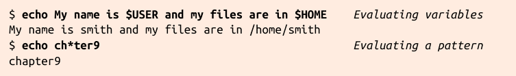
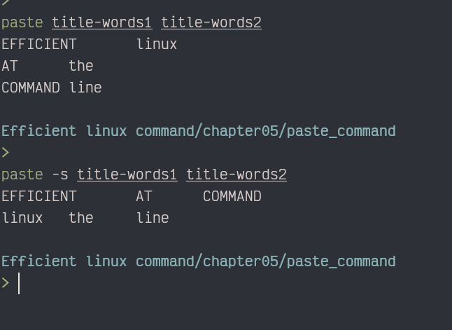

# Efficient-Command-Line

Sundeep Agarwal tutorial books 2024-11-01

---

# Useful guideline !!!!!!!!!!!!!!!!!!!

> [Bash scripting cheatsheet](https://devhints.io/bash)

- pretty amazing doc about bash
  [Special parameters and shell variables [Bash Hackers Wiki]](https://web.archive.org/web/20230318164746/https://wiki.bash-hackers.org/syntax/shellvars)

## [Learn Bash in Y Minutes](https://learnxinyminutes.com/bash/)

## [BashGuide - Greg's Wiki](http://mywiki.wooledge.org/BashGuide)

# bash pattern matching

- expression

grep Linux chapter?

-> chapeter 1-9

grep Linux chapter??
-> chapter 10-99

grep Linux chapter[12345]
only chapter 1, 2, 3, 4, or 5

grep Linux chapter[1-5]

grep Linux chapter\*[02468]
filenames ending in an even digit:

sort -V -> version number

Any characters, not just digits, may appear within the square brackets for matching. For example, filenames that begin with a capital letter, contain an underscore, and end with an @ symbol would be matched by the shell in this command: 任何字元（而不僅僅是數位）都可以出現在方括弧內以進行匹配。例 如，以大寫字母開頭、包含下劃線並以 @ 符號結尾的文件名將由以下 命令中的 shell 匹配：

'ls [A-Z]\_\_\_@'

ls -1 /etc/\*.conf



#! /bin/sh
FILES="lizard.txt snake.txt"
for f in $FILES; do
ls -l $f
done

- in order to make variate work, use a for loop

---

wc < filenames

wc filename -> wc open the filename

- wc is invoked with no arguments, so it reads from stdin, which is usually the keyboard. The shell, however, sneakily redirects stdin to come from animals.txt instead. wc has no idea that the file animals.txt exists.

wc < animals.txt > count

- grep Perl < animals.txt | wc > count

use 2> filenames

- to redirect error messages to a file

To redirect both stdout and stderr to the same file, use &> followed by a filename:

&> filenames

&> – Redirecting Everything

    What it does: Sends both regular output and errors to a file.
    Easy explanation: The & means "everything" (both standard output and errors). The > says "send it somewhere."

2> – Redirecting Errors

    What it does: Sends error messages (not regular output) to a file.
    Easy explanation: The 2 means "errors" (it’s short for "standard error" or stderr). The > says "send it somewhere."
    Example:

---

# Disabling Evaluation with Quotes and Escapes

To force the shell to treat spaces as part of a fliename, you have three options—
single quotes, double quotes, and backslashes:

backslashes don't work in single quotes

Use the backslash to escape a double quote character within double quotes:

\ can be used as multiple line connector,

- \less -> show command less without alias

# bash path

Your search path may contain the same-named command in different directories, such as /usr/bin/less and /bin/less. The shell runs whichever command appears in the earlier directory in the path. By leveraging this behavior, you can override a Linux command by placing a same-named command in an earlier directory in your search path, such as your personal $HOME/bin directory.

echo $PATH | tr : "\n"

---

# History expansion:

!grep
-> last command that starts with grep
To refer to the most recent command that contained a given string somewhere, not just at the beginning of the command, surround the string with question marks as well

- !?grep?
  append the modifier :p to print the command from your history but not execute it:

`:p` -> not to execute with bang
!1203 -> bang history expansion

alias rm = 'rm -i'
to prevent wrong deletion

using `ls` to to verify

if that is correct then:

rm !$ -> the final word that you typed

`!*` for all arguments

_(m0) rm _(m0) Last modified today
\*(m-4) Last modified <4 days ago

ls \*(md-3) -> modified 3 days ago

- use your tab to study it lol

---

e.g. `md5sum *.jg | cut -c1-32 | sort | uniq -c | sort -nr `

- caret syntax
- This technique changes only the first occurrence of the source sting jq
  `^jg^jpg` -> to quickly replace the mistype filename

> shell support sed or ed with bang bang

`!!:s/jg/jpg/`
`!md5sum:s/jg/jpg/ `

```bash
# Define the qcd function
qcd () {
  # Accept 1 argument that's a string key, and perform a different
  # "cd" operation for each key.
  case "$1" in
    work)
      cd $HOME/Work/Projects/Web/src/include
      ;;
    recipes)
      cd $HOME/Family/Cooking/Recipes
      ;;
    video)
      cd /data/Arts/Video/Collection
      ;;
    beatles)
      cd $HOME/Music/mp3/Artists/B/Beatles
      ;;
    *)
      # The supplied argument was not one of the supported keys
      echo "qcd: unknown key '$1'"
      return 1
      ;;
  esac
  # Helpfully print the current directory name to indicate where you are
  pwd
}
# Set up tab completion
complete -W "work recipes video beatles" qcd
```

use this to quickly switch main directory

case -> esac
if -> fi

`case $1 in `

`complete -W "work recipes video beatles" qcd `

- complete -W -> bas only

Optimized CDPATH Setup

Add this to your ~/.bashrc:
bash
export CDPATH=.:~/Work/Projects:~/Family/Cooking:~/Music/mp3:~/Linux/configs:/data/Video:~/Downloads

    .: Ensures cd first checks the current directory (avoids surprises).
    List: Includes your 6 frequent directories, colon-separated.

How It Works

Now, you can cd to subdirectories within those 6 locations by typing just the subdirectory name. Bash searches CDPATH in order until it finds a match.

Examples:

    cd src → ~/Work/Projects/src (if it exists).
    cd Recipes → ~/Family/Cooking/Recipes.
    cd Beatles → ~/Music/mp3/Beatles.
    cd Collection → /data/Video/Collection.

If a name exists in multiple places (e.g., src in both ~/Work/Projects and ~/Linux/configs), it picks the first match in the CDPATH order.

pushd -> cd with record(store)
popd -> cd with record(pop)

dirs -> list the stack

dirs -v -> top-down with index

`alias gd=pushd alias pd=popd `

date

`date +"what it is %A"
`

---

## seq

= {x..z..y}

seq -s , seperator

seq -s " " 1 10

seq -w 0, it will pad the number with 0

- it can be used as decmial as well

echo {1..10}

with leading zero(equal width)

01 02 03 04 ...

- {x..y..z}
- More generally, the shell expression {x..y..z} generates the values x through y, incrementing

echo {1..1000..100} # Count by hundreds from 1
Output: 1 101 201 301 401 501 601 701 801 901

echo {1000..1..100} # Backward from 1000
Output: 1000 900 800 700 600 500 400 300 200 100

echo {01..1000..100} # With leading zeros
Output: 0001 0101 0201 0301 0401 0501 0601 0701 0801 0901

- from x to y , z rule

- CURLY BRACES VERSUS SQUARE BRACKETS

square brackets `[]`

- pattern-matching

- when using curly bracket, no space between them

$ echo {A..Z} | tr -d ' ' Delete spaces ABCDEFGHIJKLMNOPQRSTUVWXYZ
$ echo {A..Z} | tr ' ' '\n' Change spaces into newlines

---

> diff two command

- either using echo or printf
- or diff <() <() -> compare the output of two commands

find

-exec {}

- end with a quoted or a escaped semicolon like:
  `;` or `\`

  find -name "\*.txt"

- using echo rm {} for verifing

`find . -type f -name "*.jpg" -exec echo rm {} ";"
`

- yes "fuck" | head -n4

- by default, yes will endlessly print ""
  we can use this for print how many time we want or just vim damn

  ***

# Isolating Text


grep

grep -w -> match the word

- -i

- -l only print the name of that file

- regular expression

---

# Regular expression:

| Pattern              | Description                                                  | Example Usage                                                | Example Output                                               |
| -------------------- | ------------------------------------------------------------ | ------------------------------------------------------------ | ------------------------------------------------------------ | ------------------------ | ----------------------------------- | ----------------- |
|                      |                                                              |                                                              |                                                              |
|                      |                                                              |                                                              |                                                              |                          |                                     |                   |
| ----                 | ----                                                         | ----                                                         | ----                                                         | ----                     | ----                                | ----              |
|                      |                                                              |                                                              |                                                              |                          |                                     |                   |
| `^`                  | Beginning of a line                                          | `^a` = Line beginning with a                                 | `^a` = 以 a 開頭的行                                         |
| ----                 | -------------------                                          | ----------------------------                                 | --------------------                                         |
|                      |                                                              |                                                              |                                                              |
| `$`                  | End of a line                                                | `!$` = Line ending with an exclamation point                 | `!$` = 以感嘆號結尾的行                                      |
| ----                 | -------------                                                | --------------------------------------------                 | -----------------------                                      |
|                      |                                                              |                                                              |                                                              |
| `.`                  | Any single character (except newline)                        | `…` = Any three consecutive characters                       | `…` = 任意三個連續字符                                       |
| ----                 | -------------------------------------                        | --------------------------------------                       | ----------------------                                       |
|                      |                                                              |                                                              |                                                              |
| `\c`                 | A literal caret, dollar sign, or any other special character | `\$` = A literal dollar sign                                 | `\$` = 字面上的美元符號                                      |
| ----                 | ------------------------------------------------------------ | ----------------------------                                 | -----------------------                                      |
|                      |                                                              |                                                              |                                                              |
| `E*`                 | Zero or more occurrences of expression E                     | `_ *` = Zero or more underscores                             | `_ *` = 零個或多個下劃線                                     |
| ----                 | ----------------------------------------                     | --------------------------------                             | ------------------------                                     |
|                      |                                                              |                                                              |                                                              |
| `[characters]`       | Any single character in a set                                | `[aeiouAEIOU]` = Any vowel                                   | `[aeiouAEIOU]` = 任何元音                                    |
| --------------       | -----------------------------                                | --------------------------                                   | -------------------------                                    |
|                      |                                                              |                                                              |                                                              |
| `[^characters]`      | Any single character not in a set                            | `[^aeiouAEIOU]` = Any nonvowel                               | `[^aeiouAEIOU]` = 任何非元音                                 |
| ---------------      | ---------------------------------                            | ------------------------------                               | ----------------------------                                 |
|                      |                                                              |                                                              |                                                              |
| `[c-c]`              | Any character in a given range between c and c               | `[0-9]` = Any digit                                          | `[0-9]` = 任何數位                                           |
| -------              | ----------------------------------------------               | -------------------                                          | ------------------                                           |
|                      |                                                              |                                                              |                                                              |
| `[^c-c]`             | Any character not in a given range between c and c           | `[^0-9]` = Any nondigit                                      | `[^0-9]` = 任何非數位                                        |
| --------             | --------------------------------------------------           | -----------------------                                      | ---------------------                                        |
|                      |                                                              |                                                              |                                                              |
| `E\|E`               | Either of two expressions for grep and sed                   | `one\|two` = Either one or two                               | `one\|two` = one 或 two                                      |
| ------               | ------------------------------------------                   | ------------------------------                               | -----------------------                                      |
|                      |                                                              |                                                              |                                                              |
| `E                   | E`                                                           | Either of two expressions for awk                            | `one                                                         | two` = Either one or two | `one                                | two` = one 或 two |
| -------------------- | ---------------------------------                            | ------------------------------------------------------------ | -------------------------------------------------------      |
|                      |                                                              |                                                              |                                                              |
| `\(E\)`              | Grouping expression for precedence in grep and sed           | `\(one\|two\)*` = Zero or more occurrences of one or two     | `\(one\|two\)*` = one 或 two 出現零次或多次                  |
| -------              | --------------------------------------------------           | --------------------------------------------------------     | -------------------------------------------                  |
|                      |                                                              |                                                              |                                                              |
| `(E)`                | Grouping expression for precedence in awk                    | `(one                                                        | two)\*` = Zero or more occurrences of one or two             | `(one                    | two)\*` = one 或 two 出現零次或多次 |
| -----                | -----------------------------------------                    | ------------------------------------------------------------ | ------------------------------------------------------------ |

---

- `.` -> `...` any three consecurtive character

`E` zero or more occurrences -> `_*`

[$0-9] -> any digit
`[^0-9]` -> any non-digit

- `one\|two` -> either one or two

using `\ before | to escape it`

`\(E\)` for grep and sed grouping

- `\(one\|two\)* = Zero or more occurrences of one or two `

- grep '^[A-Z]' myfile
  matching

- grep -v for reverse (-v =~ not =~ !)

Match all lines at least five characters long:
`grep '.....' myfile`

`grep '<.*>' myfile`

> sometimes regular will affect the usage wording:

w. -> `.` mean any character

however -> you want "w."

- use `w\.`
  - use \ escape symbol

grep -F (fixed string)

- no regular mode for grep

> OR just use fgrep

---

# How can you tell if a program is a shell? Well, the file /etc/shells lists all valid login shells on a Linux system:

- cat /etc/shells

- diff way in grep
  `cut -d: -f7 /etc/passwd|sort -u| grep -f /etc/shells -F
`
  cut -d: -f7 /etc/passwd: Extracts the 7th field (shell) from /etc/passwd, using : as the delimiter.
  sort -u: Sorts and removes duplicates from the list of shells.
  grep -f /etc/shells -F: Matches the unique shells against lines in /etc/shells.

This finds which shells in /etc/passwd are valid according to /etc/shells.

---

- tail
  tail -n+25 alphabet
  from bottom add 25 lines

---

# awk

awk does not print whitespace between values by default. If you want whitespace, separate the values with commas:

$ echo Efficient fun Linux | awk '{print $1 $3}'           No whitespace EfficientLinux 
$ echo Efficient fun Linux | awk '{print $1, $3}' Whitespace Efficient Linux

`df / /data | awk 'FNR>1 {print $4}' `

`FNR>1 skip the first line`

`echo efficient:::::linux | awk -F':*' '{print $2}'
`

- it will print the second field, ignore any `:::::` by -F
  `-F':*'`
  > pretty useful here

# Combining text

tac is great for processing data that is already in chronological order but not reversible with the sort -r command. A typical case is reversing a web-server log file to process its lines from newest to oldest:
e.g. _web-server log_

- tac -> reverse order list

- paste -> side by side

- diff


paste -> `-s` by row paste

- paste -d "\n" title-words1 title-words2

- think side by side first, then apply \n as delimiter

  - it just paste the two files side by side(line(1) by line(1) from different files)

  e.g. 13579 + 2468
  paste -d -> 1\n2\n3\n4\n5\n6\n7\n8\n9

  - 123456789

paste is like a another diff
1 file after another file

-s -> like a matrix
-d -> show with your choice {z}
{z}line by line , not file by file(form result angle)

- diff

  > **Note:** The notation `1c1` means line 1 in the first file differs from line 1 in the second file.
  > `<` indicates a line from the first file,
  > and `>` indicates a line from the second file.

- The notation 2a3 represents an addition.
- It means that file2 has a third line not present after the second line of file1.

- `cut -c3-`
  - Removes the first two characters from each line of the input.
  - The `-c3-` option means "start from the 3rd character to the end of the line."

diff file1 file2 | grep '^[<>]' | cut -c3

- grep $ = < or >
- cut -c3 -> remove the first two characters to the
  - -c3`-` mean - =~ end of the line

---

# Transforming Text

- tr
- rev
- awk
- sed

- tr
  -d -> delete
  .tr " " "\n" -> change space to newline
  tr a-z A-Z -> change lower case to upper case

- echo efficient linux | tr -d ' \t'

  - Remove spaces and tabs

- rev
  echo Efficient Linux! | rev

- rev file > reverse from line $ to ^
  rev file | cut -d' ' -f1 -> get the reversed first word
  rev file | cut -d' ' -f1 | rev' -> rev again to the last word of the orginal file

> rev and rev again to get $ vB(vim)

- sed
  $ sed 10q myfile Print 10 lines and quit (q)  
  $ awk 'FNR<=10' myfile Print while line number is ≤ 10

- awk language:

The word BEGIN 單詞 BEGIN Its action runs just once, before awk processes any input. 它的 action 在 awk 處理任何輸入之前只運行一次。 The word END

An example is /^[A-Z]/ to match lines that begin with a capital letter.

For example, to check whether the third field on an input line ($3) begins with a capital letter, a pattern would be $3~/^[A-Z]/. Another example is FNR>5, which tells awk to skip the first five lines of input.

3~ -> 3rd line
FNR>5 -> skip the first five lines

awk '{print $NF}' myfile -> 🔥 replace rev , get the last word

- When supplying an awk program on the command line, enclose it in quotes to prevent the shell from evaluating awk’s special characters. Use single or double quotes as needed.

- awk '/efficent/' 🤔 without print it ️ust like grep

## Special variables[🔗](https://learnbyexample.github.io/awk-idioms-explained//#special-variables)

- `$0` contains the current record being processed
- `$1` first field
- `$2` second field and so on
- `FS` input field separator
- `OFS` output field separator
- `NF` number of fields
- `RS` input record separator
- `ORS` output record separator
- `NR` number of records (i.e. line number) for the entire input
- `FNR` number of records per file

## Removing duplicates[🔗](https://learnbyexample.github.io/awk-idioms-explained//#removing-duplicates)

`awk '!a[$0]++'` is one of the most famous `awk` one-liners. It eliminates line based duplicates while retaining the input order.

```ruby
$ cat purchases.txt
coffee
tea
washing powder
coffee
tea
coffee milkshake
soap
tea
washing soda

$ awk '{print +a[$0] "\t" $0; a[$0]++}' purchases.txt
0coffee
0tea
0washing powder
1coffee
1tea
0coffee milkshake
0soap
2tea
0washing soda

# only the entries with zero in the first column will be retained
$ awk '!a[$0]++' purchases.txt
coffee
tea
washing powder
coffee milkshake
soap
washing soda
```

`a[$0]` creates an uninitialized element in array `a` with `$0` as the key (if the key doesn't exist yet). Thus, `!a[$0]` will succeed only on the first occurrence of an item (since an uninitialized value is _falsy_) and the post-increment operator will ensure that further instances of an item will fail the conditional expression.

# Great rename tips!!️🤩👌️❤️🔥🔥

> $ mv very_silly_long_file_name{,.old}
