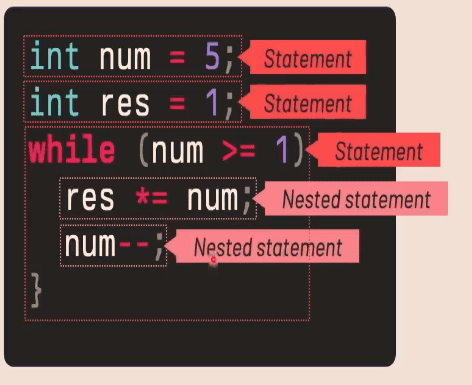

# 777-Compiler

Lexical Analysis (scanning and finding token)
Syntax Analysis (parsing) , grammar, dnf form
IR (Abstract Syntax Tree) model in memory


Compiler and Interprets

python > allow focus on these concept

native C optimize

- code in parallel with the writer

head in time
just in time interpretation

---

# CPU pikuma

even for VM

math , logic part is done by ALU


Control unit -> ALU , where we are going excute the program

like


control unit aka instruction pointer
SP -> Stack Pointer

load and store from memory btw register
cpu <=> Memory


Program is also in memory


- different cpu have different instruction set

# Executing cpu instruction

e.g. 2+4 \* 3-6
PC -> Move #2, DO

load the value into register first
then doing the operation

MULS ( S ~> mean Sign)
ADD D0,D2
SUB D3,D2


- math rule (manually) => instruction important
- what if we run out of register?
  1.stack for temporary storage for `+-\*/`

  [Specy/asm-editor: A modern webapp to write, run and learn M68K and MIPS assembly code](https://github.com/Specy/asm-editor)

when mul and add , the value store in D2, (update D2)

using cpu (stack) only yet

# Push and Pop

MOVE D2, -(SP)

- decrement the stack pointer and store the value in the stack, = push

it seems like store in the last value from the stack first

MOVE D7, (SP)+ ; D7 didn't used yet

- this is typo, because it is store in the SP

MOVE (SP)+, D7 ; pop back in the register

backup place from the stack
e.g. box

# Control Flow Instruction

what is a program?
5! = 5 \* 4 \* 3 \* 2 \* 1

```c
int num=5; // number store
int res=1; // result
while (num>1){
  res *= num;
  num--;
}
```


Num: (label) DC.W 5 , data label,
Res: DC.W 1

int num = 5

seting up alias, reserving data

factorial:
move num, d0
move res, d1

everything has to be done in the register

CMP #1, D

JMP LOOP
jump back to loop
JMP ~> LOOP:

CMP -> compare
BEQ END -> branch if equal

END ~> END: part

Branching and jumping :
= processor in the program counter

blue part of the picture, control unit

PC = Program counter
SP = Stack Pointer

FLOW >= nature of loop 🔥


SP -> stack pointer
is more giving more space to the register to work

cash mechine box

from the e.g. the SP seems start from the maximum value of the memory

# Program Structure

.c file is just are characters with ascil2 code

number = literals


= , + , etc , => operators

token >= -> operators

`{}, ()` => grouping

`--` => decrement

aka Binary Operator


only on one variable -> unary operator

while , if , else

- resersed word / keyword


- evaluating the expression


- executing something




- block , nested statement -> keep in control
- unary operator, binary operator

> how do we represent a program using a data structure?

- data structure in memory
  memory model ?

# Tokens &lexemes

grammar , expression, statement for that program in memory

1 characters after characters,

tokenizer


- using tokenizer to scan all the characters -> into useful memory


lexemes > raw data

- don't have 'white space' ` `

# AST (Abstract Syntax Tree)

syntax tree


- tree like structure in memory


memory model ~= AST tree

AST -> for better assembly usage
just like hex number to bit

the ast is the center of everything
-. type checker(left hand side = right hand side)
-. optimization

- code generation, bit code or machine code
- llvm

> So , as I can understand the AST, doesn't mean I can quickly pickup a new language? 🤔

tree walking interpretator


IR -> LLVM -> code generation based on the AST

- modern compiler -> AST (Grammar) -> IR -> code generation

# Configuring our project folder

# Lexer

- finding pattern
  characters by characters -> token
  part comparsing

start characters and end characters


if digit -> number
{0..9}

next , is it still a number?


curr mean end characters

- Token ~> oject
- integer only
- position of the token

list of token

ignore space, tab


1.digit
2.whitespace
3.operator? 4.

Lexer (helper fucnctions)


def advance
return the ch -> that moment curr

def peek:
peek what is the grammar of that thin , current position

def lookahead(self, n = 1): (maximum n 1)
look a next characters in the sources
return curr + n

def match (self, expected):

all characters on this stage
