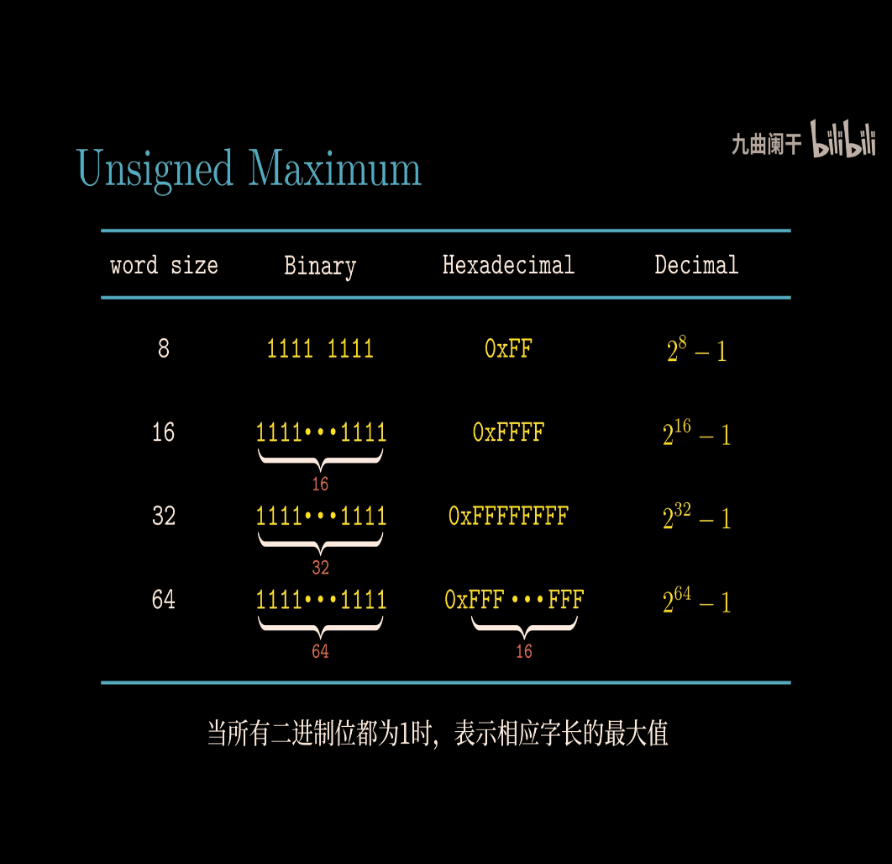
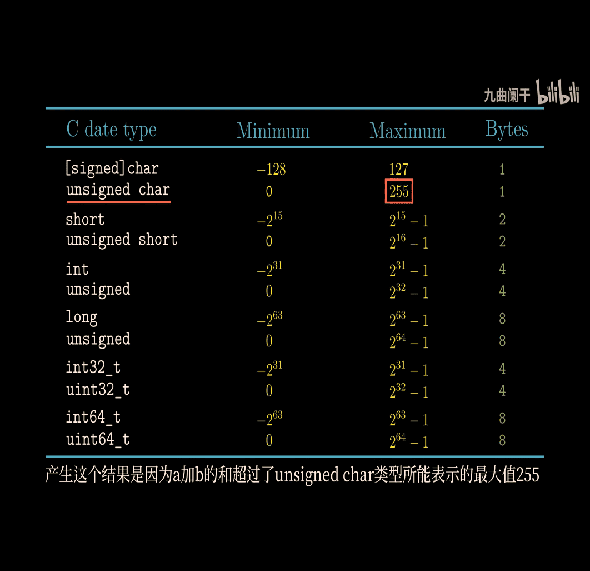
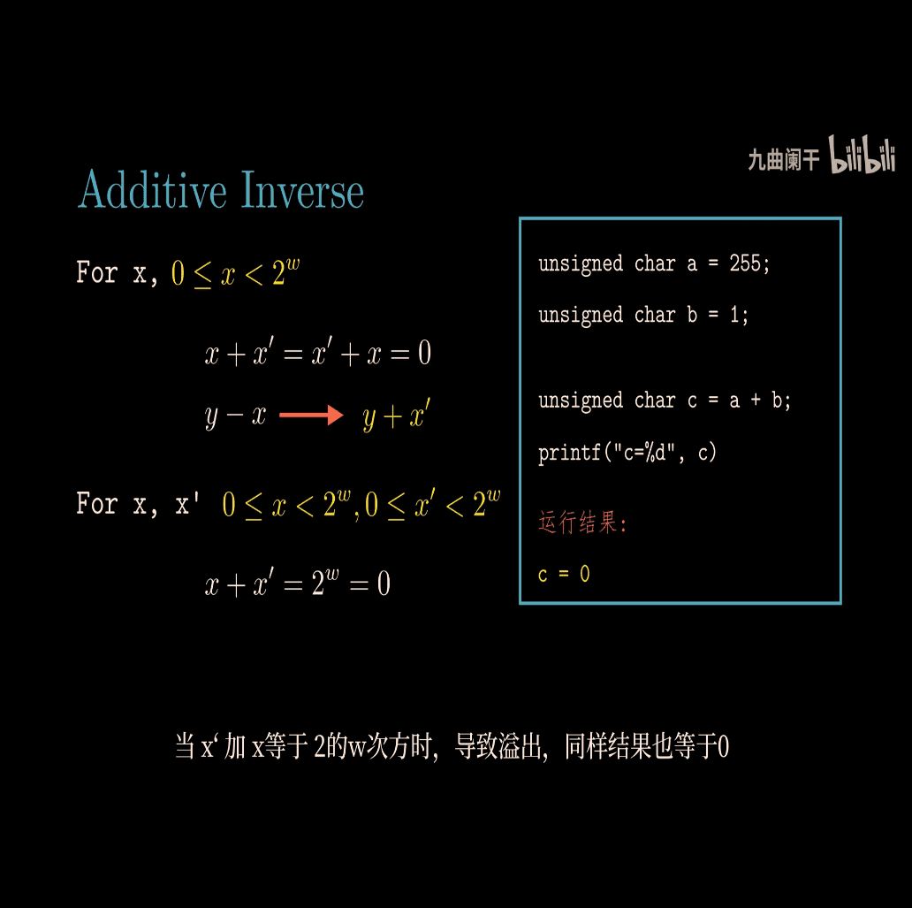

# csprimer-ComputerSystem-concept

[[20250317-cmu-15-213|cmu-15-213]]
[[bottomup-cs-c]]
[npip99/cs-wiki: A computer science wiki serving as a collection of all kinds of CS-related knowledge](https://github.com/npip99/cs-wiki)
[bloominstituteoftechnology/CS-Wiki: Lambda School CS Wiki](https://github.com/bloominstituteoftechnology/CS-Wiki)
014 What do bigendian and littleendian mean

BE
256
LE
LE

write little from left to right

Ports 0-2^16


- it is the byte ordering , not the bit ordering
  intel -> BE

026 How to remember all the powers of two

- use the first ten

1. \(2^1 = 2\)
2. \(2^2 = 4\)
3. \(2^3 = 8\)
4. \(2^4 = 16\)
5. \(2^5 = 32\)
6. \(2^6 = 64\)
7. \(2^7 = 128\)
8. \(2^8 = 256\)
9. \(2^9 = 512\)
10. \(2^{10} = 1024\)

asking port -> when you run out of a port

`2^16 = 2^10 x 2^6`
easy to count

`2^32 = 2^10 x 2^10 x 2^10 x 2^2`

---

027 How do I read a hexdump

first column: index , second column: first 8 byte , third column: second 8 byte

Reading a hexdump with the `-C` option (like `hexdump -C`) might seem intimidating at first, but it’s actually pretty straightforward once you get the hang of it. Since you don’t have a CS background, I’ll explain it like we’re unpacking a weird puzzle together—nice and simple!

---

### What’s a Hexdump?

A hexdump is a way to display raw data (like a file or network packet) in a human-readable format. It shows the bytes (8-bit chunks) of data as hexadecimal numbers (0-9, A-F) and often includes a text version of the data. The `-C` option in the `hexdump` command makes it “canonical,” meaning it’s nicely formatted with both hex and ASCII (text) side by side.

Here’s an example from your earlier question:

```
00000000  00 00 00 00 00 00 00 96  |........|
```

---

### Breaking It Down

Each line of a `hexdump -C` output has three main parts:

1. **Offset (left column)**:

   - `00000000`: This is the address or position in the file where this line starts, in hexadecimal. Think of it as a “page number” in the data.
   - It counts up by 16 bytes per line (because each line shows 16 bytes).

2. **Hexadecimal bytes (middle column)**:

   - `00 00 00 00 00 00 00 96`: These are the actual bytes of data, shown in hex. Each pair (like `00` or `96`) is one byte (8 bits).
   - Hex uses 0-9 and A-F (A=10, B=11, ..., F=15). So `96` is 9×16 + 6 = 150 in decimal.
   - There are 16 bytes per line, separated by spaces. If the data is shorter, it might stop early.

3. **ASCII representation (right column)**:
   - `|........|`: This shows the same bytes as text (ASCII characters), if they’re printable. Between the `|` bars, each byte becomes a letter, number, or symbol.
   - Non-printable bytes (like `00`, which is a null character) show up as dots (`.`). Here, `96` isn’t a printable character either (it’s outside the usual ASCII range), so it’s a dot too.
   - It’s a quick way to spot readable text in the data.

---

### Step-by-Step: Reading Your Example

Let’s read this line:

```
00000000  00 00 00 00 00 00 00 96  |........|
```

1. **Offset**: `00000000`

   - The data starts at position 0 (the beginning of the file or chunk).

2. **Hex Bytes**: `00 00 00 00 00 00 00 96`

   - There are 8 bytes: seven `00`s and one `96`.
   - `00` in hex = 0 in decimal (nothing).
   - `96` in hex = 150 in decimal (9×16 + 6 = 144 + 6 = 150).
   - So, this could be an 8-byte number (like a 64-bit integer) where only the last byte matters: `96`.

3. **ASCII**: `........`
   - All dots! That’s because `00` (null) and `96` (not a standard printable character) don’t turn into letters or symbols. It’s just raw data, not text.

---

### Another Example

Here’s a different one to practice:

```
00000010  48 65 6c 6c 6f 20 77 6f  72 6c 64 00 00 00 00 00  |Hello world.....|
```

1. **Offset**: `00000010`

   - Starts at position 16 (in decimal), because `10` in hex is 16. This is the second line (first was 0-15).

2. **Hex Bytes**: `48 65 6c 6c 6f 20 77 6f 72 6c 64 00 00 00 00 00`

   - 16 bytes. Let’s decode a few:
     - `48` = 72 in decimal = ASCII ‘H’
     - `65` = 101 = ‘e’
     - `6c` = 108 = ‘l’
     - And so on… `20` = space, `00` = null.

3. **ASCII**: `Hello world.....`
   - The bytes spell “Hello world” followed by nulls (`00`), which show as dots.

---

### Tips for Reading

- **Look at the hex first**: The middle part tells you the raw data. Convert to decimal if needed (e.g., `FF` = 255).
- **Check ASCII for text**: If it’s not dots, you’ve got readable stuff like names or messages.
- **Count bytes**: Each line is 16 bytes. The offset jumps by `10` in hex (16 in decimal) each time.
- **Context matters**: In your case (`00 00 00 00 00 00 00 96`), it’s a number (150), not text, because it’s a `.uint64` field.

---

### Your Example Again

```
00000000  00 00 00 00 00 00 00 96  |........|
```

- Starts at 0.
- 8 bytes: mostly zeros, ending with `96` (150 in decimal).
- All dots because it’s not text, just a number.

If this was part of a bigger file, the next line might be:

```
00000008  01 02 03 04 05 06 07 08  |........|
```

- Starts at byte 8, showing more data.

---

### Why It’s Useful

Hexdumps let you peek inside files or packets—like seeing the ingredients of a mystery dish. For your earlier Protobuf question, `96` was the varint-encoded 150, and the zeros were padding for the 64-bit field.

- hex ~> decimal ~> ASCII -> text

---

030 What is a file descriptor
telling the OS where is the thing what we are writing to

0 Standard input STDIN_FILENO stdin
1 Standard output STDOUT_FILENO stdout
2 Standard error STDERR_FILENO stderr

e.g open in unix ~> int result
map 2 open

int fildes ~> file descriptor

---

021 Why do I sometimes see the sequence rn for a newline

- history ~> typewriters

CR => Carriage Return

\r\n ~> window , dos , rt-11 etc ~> escape sequence

different window system will causing the problem

http ~> require using ASCII code, awell as LF(`\n`, )

---

016 Why do we care about teletype machines

unix ~> compatible with teletype machines

e.g TTY
unix rely on this subsystem

---

017 Why are some bitwise operations faster than arithmetic equivalents
Alright, let’s figure out why some bitwise operations (like `&`, `|`, or shifts) are faster than arithmetic ones (like `+`, `-`, `*`, or `/`)—and I’ll keep it super simple, like we’re chatting over a snack!

---

### What Are These Operations?

- **Arithmetic**: Stuff like addition (`+`), subtraction (`-`), multiplication (`*`), or division (`/`). You’re used to these from math class—5 + 3 = 8, 10 / 2 = 5.
- **Bitwise**: These work directly on the _bits_ (0s and 1s) of a number. Examples:
  - `&` (AND): Compares bits—1 & 1 = 1, otherwise 0.
  - `|` (OR): 1 if either bit is 1.
  - `<<` (left shift): Moves bits left, like doubling a number.
  - `>>` (right shift): Moves bits right, like halving.

Numbers in a computer are stored as bits (e.g., 5 is `0101`, 3 is `0011`). Arithmetic works on the whole number, while bitwise messes with the individual 0s and 1s.

---

### Why Are Bitwise Faster?

Think of a computer like a chef:

- **Arithmetic** is like cooking a full recipe:
  - Add 5 + 3: The chef grabs ingredients (bits), checks for carry-overs (like when 9 + 1 = 10), and mixes it all together. It’s a few steps—fetch, calculate, handle overflow, done.
  - Divide 10 / 2: Even trickier! The chef has to split things, count how many times 2 fits into 10, and deal with leftovers (remainder). More steps, more time.
- **Bitwise** is like flipping a switch:
  - `5 & 3`: Line up the bits (`0101 & 0011`), check each pair (0&0=0, 1&0=0, 0&1=0, 1&1=1), boom, result is `0001` (1). No carrying, no fuss—just a quick peek.
  - `5 << 1`: Take `0101`, shove the bits left to `1010` (10). It’s just sliding, no math required.

The big difference? Bitwise operations are _simpler_ for the computer’s hardware. They skip extra steps like carrying digits or figuring out remainders.

---

### Real-Life Example

Imagine you’re sorting socks:

- **Arithmetic (addition)**: You count pairs one by one: “2 socks + 2 more = 4, + 2 more = 6.” You’re adding and keeping track.
- **Bitwise (shift)**: You grab a stack and double it by sliding it over: “2 socks? Move it left, now it’s 4.” No counting, just a quick move.

The computer’s processor (CPU) loves bitwise stuff because it’s built to flip bits super fast with simple circuits. Arithmetic needs more complex circuits that take a tiny bit longer.

---

### Common Speedy Bitwise Tricks

1. **Multiply by 2 with `<<`**:
   - `5 << 1` = `0101` becomes `1010` = 10. Same as 5 × 2, but it’s just a shift.
   - Faster because there’s no “multiply” step—just slide the bits.
2. **Divide by 2 with `>>`**:
   - `10 >> 1` = `1010` becomes `0101` = 5. Same as 10 / 2, but no division math.
3. **Masking with `&`**:
   - `150 & 127` = `10010110 & 01111111` = `0010110` (22). Grabs the lower 7 bits (like your `n % 128` question). Faster than division because it’s just a bit-by-bit check.

---

### Why Not Always Use Bitwise?

- They’re not the same thing! `5 + 3` (8) isn’t `5 | 3` (7). Bitwise only replaces arithmetic in specific cases (like doubling or masking).
- Harder to read if you’re not used to bits.

---

### The Speed Part

In the CPU:

- **Arithmetic**: Uses an Arithmetic Logic Unit (ALU) with steps like “add, carry, check overflow.” Takes a few clock ticks.
- **Bitwise**: Uses simpler gates (AND, OR, shift circuits) that finish in _one tick_. Less work = faster.

For example:

- `n / 128` (division): CPU does a full divide, maybe 10-20 cycles.
- `n & 127` (bitwise): One cycle, bam, done.

---

### Simple Takeaway

Bitwise operations are faster because they’re like shortcuts—tweaking bits directly with no extra math steps. Arithmetic is slower because it’s like doing the full recipe, checking every detail. The computer’s hardware is built to love those bit flips!

Does this click? Want me to show a fun example with numbers?

~> manual of the that cpu, latency, instruction comparison

file: list of instruction timing and uop breakdown

comparison , shifting binary to division, multiplication, etc

cpu cycle, bitwise operations sometimes is better

---

Problem Set :002 CSS color convert

---

Problem Set :003 Beep beep boop

man 7 ascii -> ascii table

Plan

- beep
- echo stdin
- beep n times


7 bel (decimal)

--
python print(7)
-> character 7 only

python(b'7')
bit form of 7

print(b'\x07')

import sys
sys.stdout.write(b'\x07')

help(sys.stdout)

dir(sys.stout)
-> search for buffer
~> help(sys.stoud.buff)

rawIO ~>

sys.stout.buffer.write(b'\x07')

import sys
sys.stdout.buffer.write(b"\x07")

XXXXXXXXXXXXXXXXXXXXXXXXXXXXXXXXXXXXXXXX

man termios
man stty

turn your terminal into a raw mode ~> for this task
cbreak mode

> when learning python , import that module in python repl mode, help(module), dir(module)

- like a manpage in python

```python
import sys
import tty

tty.setcbreak(0)

while True:
    ch = sys.stdin.read(1)
    if "1" <= ch <= "9":
        for _ in range(int(ch)):
            sys.stdout.buffer.write(b"\x07")
    sys.stdout.buffer.flush()


```

`stty` command gnu coreutils for changing terminal setting

```python
import sys
import tty
import termios

tty_attrs = termios.tcgetattr(0)
tty.setcbreak(0)

while True:
    ch = sys.stdin.read(1)
    if "1" <= ch <= "9":
        for _ in range(int(ch)):
            sys.stdout.buffer.write(b"\x07")
    sys.stdout.buffer.flush()

try:
    run()
finally:
    termios.tcsetattr(0,termios.TCSADRAIN,tty_attrs)


```

---

XXXXXXXXXXXXXXXXXXXXXXXXXXXXXXXXXXXXXXXXXXXXX

Problem: 005 TCP SYN flood
bmp file format ~> to rotate the image

sequence of byte

```python

with open("teapot.bmp", "rb") as f:
    data = f.read()

print(data[:2].hex())

# try to parse the file correctly in python
#
# where is the pixel is actually start
#
# parse the offset
# bmp file format , MS version, OS2 file
#
# binary file always has some format though
# e.g file header
#

```


LE with the doc file, littleendian

~> offset dec , 10, 4bytes ~> star with 10 bytes
e.g 8a 00 00 00
8a -> index 080 in hexdump -> adding 10
is more likely a location of the pixel

so 8a is a location

`00000080(index)  00 00 00 00 00 00 00 00  00 00 b6 b1 a8 b5 b0 a7`

first piexl


the hexdump is showing a4 01

but can't show it directly in python as it is littleendian

- show typing in 0x01a4 is the correct one in python

- can use file command to test it out

like find the pixels correct value

for this case , height , we need to this convert it into reverse order

left to right (bit shifting seems faster)
a4 01 00 00
00 00 01 a4

a4 ~> a4
shift the 0 byte to the left
take the byte a4 and shift the byte as integer
for o1, shift the 1 byte to the left
and add that to accumulate

Let’s zoom in on this `le()` function and the bit-shifting part, breaking it down as simply as possible since you’re new to this! I’ll explain it like we’re building something with toy blocks, step by step, so you can see how `a4 01` turns into `0x01a4` (420 in decimal).

---

### What’s Happening?

The `le()` function takes a sequence of bytes (like `a4 01`) that are in **little-endian** order—meaning the smallest part comes first—and turns them into a regular number we can use. Little-endian is like reading a book backward: instead of `01 a4` (big part first), it’s stored as `a4 01` (small part first). We need to flip it back.

Here’s the code:

```python
def le(bs):
    n = 0
    for i, b in enumerate(bs):
        n += b << (i * 8)
    return n
```

- `bs`: A byte sequence, e.g., `b'\xa4\x01'` (hex `a4 01`).
- `n`: The number we’re building, starts at 0.
- `<<`: The left-shift operator—it moves bits left.

---

### Little-Endian Quick Recap

- **Normal (big-endian)**: `01 a4` = `0x01a4` = 1×256 + 164 = 420.
- **Little-endian**: `a4 01` = same value, but bytes are reversed.
- Goal: Turn `a4 01` back into `0x01a4`.

In memory:

- Byte 0: `a4` (164 in decimal).
- Byte 1: `01` (1 in decimal).

We need to put them in the right order: `01 a4`.

---

### How Does `le()` Work?

Think of `n` as a big empty shelf, and we’re stacking blocks (bytes) on it. Each byte gets shifted to its proper spot using `<<`.

#### Loop Breakdown

- `bs = b'\xa4\x01'` (2 bytes: `a4`, then `01`).
- `enumerate(bs)` gives us each byte with an index `i`.

##### Step 1: First Byte (`i = 0`, `b = a4`)

- `b = a4` (hex `a4` = 164 in decimal).
- Shift: `i * 8 = 0 * 8 = 0`.
- `b << 0`: Shift `a4` left by 0 places—**it stays the same**.
  - `a4` in binary: `10100100`.
  - Shift 0: Still `10100100`.
- `n += a4 << 0`: Add it to `n`.
  - `n` was 0, now `n = 0 + 0xa4 = 0xa4`.

Shelf so far: `000000a4` (in hex, padded with zeros).

##### Step 2: Second Byte (`i = 1`, `b = 01`)

- `b = 01` (hex `01` = 1 in decimal).
- Shift: `i * 8 = 1 * 8 = 8`.
- `b << 8`: Shift `01` left by 8 places—**move it over one byte**.
  - `01` in binary: `00000001`.
  - Shift left 8: Move 8 spots → `00000001 00000000` = `0100` (hex `0x0100`).
  - Why 8? A byte is 8 bits, so shifting 8 puts it in the next “slot.”
- `n += 01 << 8`: Add it to `n`.
  - `n` was `0xa4`.
  - `n = 0xa4 + 0x0100 = 0x01a4`.

Shelf now: `000001a4` (hex `0x01a4` = 420).

##### Done!

- Loop ends, `return n` gives `0x01a4` (420).

---

### Why Shift?

Shifting (`<<`) is like sliding blocks into position:

- **No shift (`<< 0`)**: `a4` stays at the “units” spot (lowest byte).
- **Shift 8 (`<< 8`)**: `01` slides to the “256s” spot (next byte up).
- Add them together: `0100 + a4 = 01a4`.

In bits:

- `a4` = `10100100` (stays low).
- `01 << 8` = `00000001` → `00000001 00000000` = `0100`.
- Combine: `00000001 00000000 + 00000000 10100100 = 00000001 10100100` = `01a4`.

---

### Toy Block Analogy

Imagine stacking blocks:

- Block `a4` (164) goes on the floor (position 0).
- Block `01` (1) goes up one shelf (position 8 bits over, worth 256 each).
- Total height: 1×256 + 164 = 420.

Little-endian gives us `a4 01`, and `le()` “stacks” them back to `01a4`.

---

### Testing It

```python
bs = b'\xa4\x01'  # a4 01
print(le(bs))     # Outputs 420
print(hex(le(bs))) # Outputs 0x01a4
```

---

### Why Not Just Reverse It?

You _could_ reverse the bytes (`01 a4`) and read it, but `le()` does it dynamically with shifts, which:

- Works for any length (2, 4, 8 bytes).
- Is fast (bitwise, like we talked about!).

---

### Does It Click?

- `a4 01` → `0x01a4` because `a4` stays low, `01` shifts up.
- Shifting moves bits to their “weight” (0, 256, 65536, etc.).
- Add them up, and you’ve rebuilt the number!

Let me know if you want to play with more examples or tweak it!

### Logical Right Shifts

When shifting right with a **logical right shift**, the least-significant bit is lost and a 000 is inserted on the other end.

```
  1011 >>> 1  →  0101
1011 >>> 3  →  0001

```

CC#C++JavaJavaScriptObjective-CPHPPython 2.7Python 3.6RubySwift

For positive numbers, a single logical right shift divides a number by 2, throwing out any remainders.

```
  0101 >>> 1  →  0010

0101 is 5
0010 is 2


### Arithmetic Right Shifts

When shifting right with an **arithmetic right shift**, the least-significant bit is lost and the most-significant bit is _copied_.

Languages handle arithmetic and logical right shifting in different ways. Java provides two right shift operators: >> does an _arithmetic_ right shift and >>> does a _logical_ right shift.

```

1011 >> 1 → 1101
1011 >> 3 → 1111

0011 >> 1 → 0001
0011 >> 2 → 0000

```


The first two numbers had a 111 as the most significant bit, so more 111's were inserted during the shift. The last two numbers had a 000 as the most significant bit, so the shift inserted more 000's.

If a number is encoded using [two's complement,](https://www.interviewcake.com/concept/binary-numbers#twos-complement) then an arithmetic right shift preserves the number's sign, while a logical right shift makes the number positive.

```

// Arithmetic shift
1011 >> 1 → 1101
1011 is -5
1101 is -3

// Logical shift
1111 >>> 1 → 0111
1111 is -1
0111 is 7

This binary number 0000000100000000 is equivalent to 256 in decimal, which is represented as 0100 in hexadecimal

because 01 0 0 in hex 00 ~> 8's 0

XXXXXXXXXXXXXXXXXXXXXXXXXXXXXX

- case analysis ~> as a great habit
- write a the solution with minims l time investment
- figuring what do you actually really want to do

- source ~> to target table


blue ~>
green ~>
yellow ~>
red ~>

source x ~> source y to targetx ~> targety
e.g. 0 1 2 to 0 1 2

- create a table for it


pattern ~> source y = target x

source x = width-ty-1

worked program:

```python
def le(bs):
    n = 0
    for i, b in enumerate(bs):
        n = n + (b << (i * 8))
    return n


with open("teapot.bmp", "rb") as f:
    data = f.read()

assert data[:2] == b"BM"
# offset = data[10]
# print(offset)

# print(data[offset : offset + 6])
offset, width, height = le(data[10:14]), le(data[18:22]), le(data[22:26])
print(offset, width, height)

# f.write(0x00 for _ in data[offset:])

# spixels = data[offset:]
pixels = []  # BGR triples
for ty in range(width):  # TODO
    for tx in range(width):
        sy = tx
        sx = width - ty - 1
        n = offset + 3 * (sy * width + sx)
        pixels.append(data[n : n + 3])

with open("out.bmp", "wb") as f:
    f.write(data[:offset])
    f.write(b"".join(pixels))
```

Let’s dive into this code snippet that rotates a BMP image by adding pixel manipulation to your earlier BMP parsing code. I’ll explain it step-by-step in a simple way, like we’re flipping a picture together, since you don’t have a CS background!

---

### What’s the Goal?

You’re taking a BMP file’s pixel data, rotating it 90 degrees clockwise, and writing it back into a new file (`out.bmp`). The original code reads the BMP, finds the pixel data (starting at `offset`), and now this part:

- Loops through the pixels.
- Rearranges them to rotate the image.
- Saves the result.

---

### Your Code

```python
pixels = []  # BGR triples
for ty in range(width):  # TODO
    for tx in range(width):
        sy = tx
        sx = width - ty - 1
        n = offset + 3 * (sy * width + sx)
        pixels.append(data[n : n + 3])

with open("out.bmp", "wb") as f:
    f.write(data[:offset])  # Copy headers unchanged
    f.write(b"".join(pixels))  # Write rotated pixels
```

- `pixels`: A list to hold the new pixel data (each pixel is 3 bytes: Blue, Green, Red—BGR).
- `ty`, `tx`: Loop variables (though `ty` should probably range over `height`—we’ll fix that).
- `sy`, `sx`: Source coordinates for the rotation.
- `n`: Calculates where to grab the original pixel from `data`.
- Output: Copies the header, then adds the rotated pixels.

---

### How Does Rotation Work?

Rotating an image 90 degrees clockwise means:

- The top row becomes the right column.
- The left column becomes the top row (reversed).
- Each pixel moves to a new spot.

For a tiny 2×2 image:

```
Original:
A B    (0,0) (0,1)
C D    (1,0) (1,1)

Rotated 90° clockwise:
C A    (0,0) (0,1)
D B    (1,0) (1,1)
```

- `(0,0) A` → `(0,1)`.
- `(0,1) B` → `(1,1)`.
- `(1,0) C` → `(0,0)`.
- `(1,1) D` → `(1,0)`.

The pattern: `(x, y)` becomes `(y, width - x - 1)`.

---

### Breaking Down the Code

#### The Loops

```python
for ty in range(width):  # Should be height!
    for tx in range(width):
```

- `ty`: Should be the _height_ of the new image (rows). Your BMP has `height` rows, but after rotation, the new height is the original `width`.
- `tx`: The _width_ of the new image (columns), which stays `width` if the image is square or matches the original width.
- **Fix**: Use `range(height)` for `ty`, since we’re reading the original image’s rows.

#### The Rotation Math

```python
sy = tx
sx = width - ty - 1
```

- `(tx, ty)`: Target position in the new image (where the pixel goes).
- `(sx, sy)`: Source position in the original image (where we grab the pixel).
- **Logic**:
  - `sy = tx`: The new column (`tx`) maps to the old row (`sy`).
  - `sx = width - ty - 1`: The new row (`ty`) flips the old column (`sx`) and reverses it.
- This matches a 90° clockwise rotation!

Example (width = 2, height = 2):

- `(tx=0, ty=0)` → `(sx=1, sy=0)`: Top-left goes to bottom-left.
- `(tx=1, ty=0)` → `(sx=1, sy=1)`: Top-right stays bottom-right.
- `(tx=0, ty=1)` → `(sx=0, sy=0)`: Bottom-left goes to top-left.

#### Pixel Offset

```python
n = offset + 3 * (sy * width + sx)
```

- BMP stores pixels as BGR triples (3 bytes each).
- `offset`: Start of pixel data in `data`.
- `sy * width + sx`: Converts 2D coordinates `(sx, sy)` to a 1D index in the original pixel array.
  - `sy * width`: Skips to the right row.
  - `+ sx`: Moves to the right column.
- `3 * (...)`: Each pixel is 3 bytes.
- `n`: The byte position in `data` where this pixel starts.

#### Grab the Pixel

```python
pixels.append(data[n : n + 3])
```

- `data[n : n + 3]`: Slices 3 bytes (BGR) from the original data.
- Adds it to `pixels` in the new order.

---

### Why It Rotates

- The loops scan the new image’s grid (`tx`, `ty`).
- For each spot, it grabs a pixel from a rotated position (`sx`, `sy`).
- The formula `sx = width - ty - 1` flips and shifts, turning rows into columns.

For a 2×2:

- Original pixels in memory: `A B C D` (row-major, `A=0,0`, `B=0,1`, `C=1,0`, `D=1,1`).
- New order: `C A D B` (checks `(0,0)=C`, `(0,1)=A`, `(1,0)=D`, `(1,1)=B`).

---

### Fixed Code

Assuming `offset`, `width`, `height` from your earlier BMP parsing:

```python
pixels = []  # BGR triples
for ty in range(height):  # New height = original width
    for tx in range(width):  # New width = original width
        sy = tx
        sx = width - ty - 1
        n = offset + 3 * (sy * width + sx)
        pixels.append(data[n : n + 3])

with open("out.bmp", "wb") as f:
    f.write(data[:offset])  # Headers unchanged
    f.write(b"".join(pixels))  # Rotated pixels
```

---

### Full Example with Parsing

```python
def le(bs):
    n = 0
    for i, b in enumerate(bs):
        n += b << (i * 8)
    return n

with open("teapot.bmp", "rb") as f:
    data = f.read()

assert data[:2] == b'BM', "Not a BMP file!"
offset = le(data[10:14])
width = le(data[18:22])
height = le(data[22:26])
print(f"Offset: {offset}, Width: {width}, Height: {height}")

pixels = []
for ty in range(height):
    for tx in range(width):
        sy = tx
        sx = width - ty - 1
        n = offset + 3 * (sy * width + sx)
        pixels.append(data[n : n + 3])

with open("out.bmp", "wb") as f:
    f.write(data[:offset])
    f.write(b"".join(pixels))
```

---

### Does It Work?

- If `width` and `height` match your BMP (e.g., 420x420 from `0x01a4`), and it’s 24-bit (3 bytes/pixel), this rotates it.
- Check `out.bmp`—open it in an image viewer!
- If it’s garbled, the BMP might have padding (rows align to 4-byte boundaries) or a different bit depth—let me know!

---

### Simple Takeaway

- Loops build the new image.
- `sy = tx`, `sx = width - ty - 1` flips rows to columns.
- `n` finds the old pixel, and we copy it to the new spot.
- Headers stay, pixels rotate!

Want to test it or fix something? Let’s tweak it together!

To understand nested for loops in Python, let's visualize them as a grid:

```
for ty in range(height):
    for tx in range(width):
        # Code here
```

Imagine this as a grid where:

- `height` represents the number of rows
- `width` represents the number of columns

Let's use a simple example with `height = 3` and `width = 4`:

```
 ┌───┬───┬───┬───┐
 │   │   │   │   │ ty = 0
 ├───┼───┼───┼───┤
 │   │   │   │   │ ty = 1
 ├───┼───┼───┼───┤
 │   │   │   │   │ ty = 2
 └───┴───┴───┴───┘
  tx tx tx tx
  =0 =1 =2 =3
```

Here's how the loops work:

1. The outer loop (`ty`) controls the rows:

   - It starts at 0 and goes up to `height - 1`
   - In our example, it runs 3 times (0, 1, 2)

2. For each row, the inner loop (`tx`) controls the columns:

   - It starts at 0 and goes up to `width - 1`
   - In our example, it runs 4 times (0, 1, 2, 3) for each row

3. The code inside both loops will execute for each cell in the grid:
   - It runs a total of `height * width` times
   - In our example, that's 3 \* 4 = 12 times

The loops will process the grid in this order:

```
(0,0) → (0,1) → (0,2) → (0,3)
  ↓
(1,0) → (1,1) → (1,2) → (1,3)
  ↓
(2,0) → (2,1) → (2,2) → (2,3)
```

This nested loop structure is commonly used for tasks like:

- Processing 2D arrays or matrices
- Creating patterns or grids
- Iterating over coordinates in a 2D space

Remember, the inner loop completes all its iterations for each single iteration of the outer loop[1][4].

Citations:
[1] https://pynative.com/python-nested-loops/
[2] https://codingnomads.com/python-nested-for-loop
[3] https://www.youtube.com/watch?v=qwvswinpu2s
[4] https://openstax.org/books/introduction-python-programming/pages/5-3-nested-loops
[5] https://www.youtube.com/watch?v=APWy6Pc83gE
[6] https://www.youtube.com/watch?v=O60CFmcWyEY
[7] https://www.youtube.com/watch?v=EdPmiImcyv0
[8] https://www.w3schools.com/python/gloss_python_for_nested.asp

---

Answer from Perplexity: pplx.ai/share

---

xxxxxxxxxxxxxxxxxxxxxxxxxxxxxxxxxxxxxxxxxxxxx

Problem:006 UTF-8 truncate

brifely explain:

Let’s break down how to cleanly truncate UTF-8 encoded strings in a simple way, like trimming a string without breaking it mid-character!

---

### What’s UTF-8?

UTF-8 is a way to store text (like "hello" or "café") in bytes. Unlike plain ASCII (1 byte per character), UTF-8 uses **1 to 4 bytes** per character:

- Basic letters (e.g., "A") = 1 byte (`0xxxxxxx` in binary).
- Accented letters (e.g., "é") or emojis = 2-4 bytes (start with `11xxxxxx`, extra bytes are `10xxxxxx`).

If you chop a UTF-8 string in the middle of a multi-byte character, you get garbage—like splitting "é" (`c3 a9`) after `c3`. The goal is to cut only at **whole character boundaries**.

---

### Why Truncate Cleanly?

Say you have "café" (hex: `63 61 66 c3 a9`) and want the first 4 bytes:

- Raw cut: `63 61 66 c3` → "caf" + broken `c3` (error or �).
- Clean cut: Stop at `63 61 66` → "caf" (no junk).

---

### How to Do It

To truncate cleanly:

1. **Check byte patterns**:
   - `0xxxxxxx`: Single-byte character, safe to cut after.
   - `11xxxxxx`: Start of a multi-byte character, count the `1`s to know how many `10xxxxxx` bytes follow (2, 3, or 4 total).
   - `10xxxxxx`: Continuation byte, don’t cut here—back up to the start.
2. **Find the last safe spot**:
   - Look at the byte at your truncate point (e.g., index 4).
   - If it’s `10xxxxxx`, move back until you hit a start byte (`0xxxxxxx` or `11xxxxxx`).
   - Ensure you include all continuation bytes if it’s multi-byte.

---

### Example

String: "café" = `63 61 66 c3 a9`.

- Truncate to 4 bytes:
  - Byte 4 is `c3` (`11000011`), start of a 2-byte character (`c3 a9` = "é").
  - Can’t cut after `c3`—back up to byte 3 (`66` = "f").
  - Result: `63 61 66` = "caf".
- Truncate to 5 bytes:
  - Byte 5 is `a9` (`10101001`), a continuation byte.
  - Include the full character: `c3 a9`.
  - Result: `63 61 66 c3 a9` = "café".

---

### Python Shortcut

Python’s `encode`/`decode` can help, but for manual control:

```python
def truncate_utf8(s, max_bytes):
    b = s.encode('utf-8')
    if len(b) <= max_bytes:
        return s
    # Move back to last safe byte
    i = max_bytes
    while i > 0 and (b[i] & 0xc0) == 0x80:  # 10xxxxxx
        i -= 1
    return b[:i].decode('utf-8')

s = "café"
print(truncate_utf8(s, 4))  # "caf"
```

- `& 0xc0 == 0x80`: Checks for `10xxxxxx` (continuation bytes).

---

### Takeaway

- UTF-8 uses 1-4 bytes per character.
- Truncate only after a full character (not mid-sequence).
- Check bytes: `0xxxxxxx` or complete `11xxxxxx 10xxxxxx…` groups.

Simple, right? Want more examples?

280 bytes limit for social media, not 280 character, emojis take more space

- character may take more than 1 byte
- give a string and a number, truncate the string to that number of bytes

cat cases, cat expected file

UTF (Unicode Transformation Format) and ASCII (American Standard Code for Information Interchange) are both character encoding standards, but they differ significantly in scope and structure.

### 1. **ASCII (7-bit & 8-bit)**

- ASCII is a character encoding standard that uses **7 bits** to represent **128 characters** (0-127).
- It includes English letters (A-Z, a-z), digits (0-9), punctuation marks, and control characters (e.g., newline, tab).
- **Extended ASCII (8-bit, 256 characters)** was later introduced, but it remains limited to specific language needs.

### 2. **UTF (Unicode Transformation Format)**

- UTF is an encoding scheme used to represent **Unicode**, which supports over **143,000** characters from multiple languages, symbols, and emojis.
- UTF comes in different formats: **UTF-8, UTF-16, and UTF-32**, each with different ways of storing characters in bytes.

#### **How UTF Differs from ASCII**

| Feature                | ASCII                               | UTF-8                           |
| ---------------------- | ----------------------------------- | ------------------------------- |
| Character Set          | English characters (128 or 256 max) | Supports all Unicode characters |
| Bits per Character     | 7-bit (or 8-bit for extended ASCII) | 1 to 4 bytes per character      |
| Encoding               | Fixed-length (1 byte)               | Variable-length (1-4 bytes)     |
| Backward Compatibility | Not compatible with Unicode         | Compatible with ASCII           |

#### **UTF-8 Encoding (Most Common)**

- **Variable-length encoding:**
  - 1 byte for ASCII characters (0-127)
  - 2-4 bytes for non-ASCII characters
- Example:
  - **A** (U+0041) → `01000001` (1 byte, same as ASCII)
  - **€** (U+20AC) → `11100010 10000010 10101100` (3 bytes)
  - **你** (U+4F60) → `11100100 10111100 10100000` (3 bytes)

This makes UTF-8 space-efficient and **backward compatible with ASCII**, meaning any valid ASCII text is also valid UTF-8.

Would you like a deeper explanation of how multi-byte encoding works in UTF-8?

> hints


- first number tell you how many bytes it is

planing:

- parse test cases
  read lines
  unt8 for n
  remember to ship trailing in
- truncation
  start from end
  if s[n] next character, starts wit 0b10 then n-= 1
  Remember for n out of bounds
- finaly
  print the stdout
  diff against expected file

  Let’s dive into your teacher’s plan for truncating UTF-8 strings and try to read their mind! They’ve laid out a strategy to build a program that processes test cases and truncates strings cleanly, like we talked about earlier. Since you don’t have a CS background, I’ll keep it simple and guess their reasoning as if we’re piecing together a puzzle they left for us.

  Here’s the plan:

  ```
  - parse test cases
    read lines
    unt8 for n
    remember to ship trailing in
  - truncation
    start from end
    if s[n] next character, starts wit 0b10 then n-= 1
    Remember for n out of bounds
  - finaly
    print the stdout
    diff against expected file
  ```

  ***

### Step 1: Parse Test Cases

#### What It Says

- **Read lines**: Probably reading input from a file or standard input (like `stdin`).
- **unt8 for n**: Typo? Maybe “uint8” (unsigned 8-bit integer) or “use n as the truncate length.” I’ll guess they mean `n` is the number of bytes to keep.
- **Remember to ship trailing in**: Another typo—likely “skip trailing” (maybe trailing newlines or junk).

#### Teacher’s Mind

- **Goal**: They want you to handle multiple test cases, like a file with lines where each line has a string and a number `n` (e.g., "café 4").
- **Why lines?**: Common in programming challenges—each line is a separate problem to solve.
- **Why uint8 for n?**: `n` might be small (0-255, fitting in 8 bits), or they just mean “treat `n` as a byte count.”
- **Why skip trailing?**: Input might have extra stuff (like `\n`) you don’t want to truncate—keep it clean.

**Guess**: You’ll read something like:

```
café 4
hello 3
```

- Split each line into a string and `n`, then truncate the string to `n` bytes.

---

### Step 2: Truncation

#### What It Says

- **Start from end**: Look at the string from the back.
- **If s[n] next character, starts wit 0b10 then n-= 1**: If the byte at position `n` is part of a multi-byte UTF-8 character (starts with `0b10` in binary), move back.
- **Remember for n out of bounds**: Handle cases where `n` is too big or too small.

#### Teacher’s Mind

- **Why start from end?**: In UTF-8, you can’t just cut at `n`—you might split a character (like `c3 a9` for "é"). Starting from `n` and moving back ensures you find a safe cut point.
- **Why check `0b10`?**: UTF-8 continuation bytes start with `10xxxxxx` (binary `0b10`). If `s[n]` is one, it’s mid-character, so back up to include the whole thing or stop before it.
- **Why adjust `n`?**: They want a clean truncate—don’t break characters. If `n` lands on a `10xxxxxx`, it’s not a start byte, so `n -= 1` moves to a safe spot.
- **Why out of bounds?**: If `n > len(string)` or `n < 0`, you need to avoid errors—maybe return the whole string or an empty one.

**Guess**: For "café" (`63 61 66 c3 a9`) with `n=4`:

- `s[4] = a9` (binary `10101001` = `0b10xxxxxx`).
- It’s a continuation byte, so `n -= 1` → `n=3`.
- `s[3] = c3` (start of "é"), but we want _before_ it → stop at `63 61 66` = "caf".

---

### Step 3: Finally

#### What It Says

- **Print the stdout**: Output the truncated strings.
- **Diff against expected file**: Compare your output to a correct answer file.

#### Teacher’s Mind

- **Why stdout?**: Standard way to show results in coding tasks—print each truncated string, one per line.
- **Why diff?**: They’ve got a file with expected outputs (e.g., "caf\nhel\n"). You’ll test if your program matches it, teaching you to validate your work.

**Guess**: Input:

```
café 4
hello 3
```

Output:

```
caf
hel
```

They’ll check it against a file like `expected.txt` using a tool like `diff`.

---

### Why This Plan?

Your teacher’s thinking:

1. **Teach Input Handling**: Parsing lines makes you deal with real-world data (strings + numbers).
2. **UTF-8 Mastery**: Truncating from the end with `0b10` checks forces you to understand UTF-8’s multi-byte structure.
3. **Error Handling**: Out-of-bounds `n` adds a practical twist—don’t crash!
4. **Validation**: Diffing against an expected file teaches you to test, not just code blindly.
5. **Bitwise Simplicity**: Using `0b10` (binary) hints at bitwise checks (like `& 0xc0 == 0x80`), tying into our earlier speed talk!

---

### Sample Code (Reading Their Mind)

```python
def truncate_utf8(s, n):
    if n >= len(s):
        return s
    if n <= 0:
        return ""
    b = s.encode('utf-8')
    i = n
    # Move back if we hit a continuation byte (0b10xxxxxx)
    while i > 0 and (b[i] & 0xc0) == 0x80:  # 0xc0 = 0b11000000, 0x80 = 0b10000000
        i -= 1
    return b[:i].decode('utf-8')

# Parse test cases
with open("input.txt", "r") as f:
    lines = f.readlines()  # Read lines, skip trailing \n later

for line in lines:
    parts = line.strip().split()  # e.g., "café 4" → ["café", "4"]
    s, n = parts[0], int(parts[1])  # String and n
    result = truncate_utf8(s, n)
    print(result)  # To stdout

# Run: python script.py > output.txt
# Then: diff output.txt expected.txt
```

---

### Their Logic

- **Lines**: Flexible input format.
- **End-first**: UTF-8’s structure is easier to check backward (continuation bytes are obvious).
- **Testing**: Diff ensures you nail it.

Does this match what you’re seeing? Want to tweak it for your class?

```python
with open("cases", "rb") as f:
    line = f.readline()
    print(line[0], line[1:])
```

This code does the following:

1. Opens a file named "cases" in binary read mode ("rb").
2. Reads a single line from the file using `f.readline()`.
3. Prints two things:
   - `line`: The first byte of the line
   - `line[1:]`: All bytes from the second byte to the end of the line

The comma in the `print()` function doesn't create two lines. Instead, it separates the two arguments being passed to `print()`. By default, `print()` uses a space to separate its arguments when outputting them.

So, if the first line of your "cases" file contains, for example, "Hello", the output would look like this:

```
b'H' b'ello'
```

This is all on one line, with a space between the two parts. The `b` prefix indicates these are bytes objects, not strings, because the file was opened in binary mode.

If you're seeing two lines in your output, it could be because:

1. The line read from the file contains a newline character at the end.
2. There's another `print()` statement in your code that you haven't shown.
3. The "cases" file itself contains a newline or other invisible characters.

To see exactly what's in the line, you could use `repr()`:

```python
print(repr(line))
```

This will show you all characters, including any hidden or special characters.

- print(repr(line))
  this is useful for testing

---

```python

import sys
with open("cases", "rb") as f:
    while True:
        line = f.readline()
        # n=line[0]
        # sys.stdout.buffer.write(line[1:])
        print(line[0], line[1:])
        print(repr(line))

```

```python
import sys

with open("cases", "rb") as f:
    while True:
        line = f.readline()
        if len(line) == 0:
            break
        n = line[0]
        sys.stdout.buffer.write(line[1:])


```

`s = line[1:-1] ~> skip the last byte like formating , /n /r etc`

Let’s zoom in on this line of code—`if (s[n] & 0xc0) == 0x80`—from your `truncate` function and break it down as simply as possible, like we’re figuring out a secret code together! Since you don’t have a CS background, I’ll keep it clear and relatable.

---

### The Context

Your code is trying to truncate a UTF-8 encoded string `s` to `n` bytes, but it needs to avoid cutting in the middle of a multi-byte character. This line is the heart of that check. Here’s the snippet:

```python
def truncate(s, n):
    if (s[n] & 0xc0) == 0x80:
        n -= 1
```

- `s`: A byte string (e.g., `b"caf\xc3\xa9"` for "café").
- `n`: The position where you want to cut (e.g., 4).
- The `if` checks something about the byte at `s[n]`, and if true, moves `n` back.

---

### What’s `s[n] & 0xc0`?

- **`s[n]`**: The byte at position `n` in the string `s`. For "café" (`63 61 66 c3 a9`), if `n=4`, `s[4] = a9`.
- **`&`**: A bitwise AND operation. It compares bits of two numbers and keeps only the ones both have as `1`.
- **`0xc0`**: Hex `c0` is `11000000` in binary. It’s a mask—a filter to look at just the first two bits of `s[n]`.

Think of `& 0xc0` like putting on sunglasses that only let you see the leftmost two bits of the byte:

- `s[n] = a9` = `10101001`.
- `0xc0` = `11000000`.
- `10101001 & 11000000 = 10000000` (only where both have `1`s).

Result: `0x80` (hex `80` = `10000000` in binary).

---

### What’s `== 0x80`?

- **`0x80`**: Hex `80` is `10000000` in binary.
- The check: Is the result of `s[n] & 0xc0` equal to `0x80`?
- In UTF-8:
  - **Continuation bytes** start with `10xxxxxx` (binary). Examples: `a9` (`10101001`), `80` (`10000000`).
  - **Start bytes** are either `0xxxxxxx` (single-byte, like `63`) or `11xxxxxx` (multi-byte start, like `c3`).

When you AND with `0xc0` (`11000000`):

- `10xxxxxx & 11000000 = 10000000` (`0x80`) → Continuation byte.
- `0xxxxxxx & 11000000 = 00000000` (`0x00`) → Single-byte character.
- `11xxxxxx & 11000000 = 11000000` (`0xc0`) → Start of multi-byte.

So, `if (s[n] & 0xc0) == 0x80` asks: “Is the byte at `n` a continuation byte (starts with `10`)?”

---

### Why Check This?

In UTF-8, you can’t cut in the middle of a multi-byte character (e.g., `c3 a9` for "é"). If `n` points to a continuation byte (`10xxxxxx`), it’s part of a character that started earlier, so you need to back up (`n -= 1`) to avoid splitting it.

#### Example: "café" = `63 61 66 c3 a9`

- `n = 4`: `s[4] = a9`.
- `a9 & 0xc0`:
  - `10101001 & 11000000 = 10000000` = `0x80`.
- `(s[4] & 0xc0) == 0x80` is `True`.
- `n -= 1`: Move to `n = 3` (before `c3 a9`).

Now you’d cut at `63 61 66` = "caf", which is safe.

#### Another: "caf" = `63 61 66`

- `n = 2`: `s[2] = 66`.
- `66 & 0xc0`:
  - `01100110 & 11000000 = 00000000` = `0x00`.
- `(s[2] & 0xc0) == 0x80` is `False`.
- No change—cut at `63 61` = "ca" is fine.

---

### Why `n -= 1`?

- If `s[n]` is `10xxxxxx`, it’s mid-character. Moving back one byte gets you closer to a safe cut point (either a start byte or before the character).

But **issue**: Your code only checks once and doesn’t loop. If `n=5` on `c3 a9 00`, it moves to `a9` (still bad). It should keep moving back until `s[n]` isn’t `10xxxxxx`.

---

### Teacher’s Intent

Your teacher swapped `s` and `n` in `truncate(s, n)` (should be `truncate(n, s)`?), but this line:

- Uses bitwise magic (`&`) to spot UTF-8 continuation bytes.
- Ensures clean truncation by avoiding mid-character cuts.
- Ties to their plan: “if next character starts with 0b10, then n -= 1.”

---

### Fixed Snippet

```python
def truncate(s, n):
    while n > 0 and (s[n] & 0xc0) == 0x80:  # Keep moving back
        n -= 1
    return s[:n]  # Return truncated bytes
```

---

### Simple Takeaway

- `(s[n] & 0xc0) == 0x80`: Checks if byte `s[n]` starts with `10` (continuation byte).
- If `True`, it’s mid-character—back up with `n -= 1`.
- It’s like saying, “Don’t cut in the middle of a word—find the space before!”

Does this click? Want to test it with your file?

---


Processing Virtual Memory:


- heap and stack

- stack from top to bottom (high to low) position


Topest is kernel Memory

Evereything is File


Let’s dive into **Amdahl’s Law** from your _Computer Systems: A Programmer’s Perspective_ (CSAPP) course and break it down as simply as possible! Since you’re new to some of these ideas, I’ll use a fun analogy and keep it clear—no jargon overload. Imagine we’re solving this together over a snack.

---

## What Is Amdahl’s Law?

Amdahl’s Law is a rule that tells you how much faster a program can get when you try to speed up parts of it—like adding more workers to a job. It says: **the overall speedup is limited by the parts you _can’t_ speed up.** Even if you make some parts lightning-fast, the slow parts hold you back.

---

## Analogy: Baking Cookies

Picture this: You’re baking 100 cookies, and it takes 60 minutes total. The work breaks down like this:

- **Mixing dough**: 20 minutes (can speed up with helpers).
- **Baking**: 40 minutes (oven can only do one batch at a time).

### Step 1: Normal Baking

- Total time: 20 (mixing) + 40 (baking) = **60 minutes**.

### Step 2: Speed Up Mixing

You hire 3 helpers, and now mixing takes only 5 minutes (20 ÷ 4, since 4 people work together).

- New time: 5 (mixing) + 40 (baking) = **45 minutes**.
- **Speedup**: 60 ÷ 45 = **1.33x faster**.

### Step 3: Infinite Helpers?

Add a million helpers—mixing drops to nearly 0 minutes.

- New time: 0 (mixing) + 40 (baking) = **40 minutes**.
- **Speedup**: 60 ÷ 40 = **1.5x faster**.

### The Catch

No matter how fast you mix, baking takes 40 minutes. You can’t speed up the oven part—it’s the bottleneck. The max speedup is 1.5x, not infinity, because **some work can’t be improved**.

---

## Amdahl’s Law in Simple Terms

- **Formula**: Speedup = 1 / [(1 - P) + (P / S)]

  - **P**: Fraction of the program you _can_ speed up (e.g., 0.33 for mixing, since 20/60).
  - **S**: How much you speed that part up (e.g., 4x with 4 helpers).
  - **1 - P**: Fraction you _can’t_ speed up (e.g., 0.67 for baking).

- **Cookie Example**:

  - P = 20/60 = 0.33 (mixing).
  - 1 - P = 40/60 = 0.67 (baking).
  - S = 4 (4 helpers).
  - Speedup = 1 / [0.67 + (0.33 / 4)] = 1 / [0.67 + 0.0825] ≈ 1 / 0.7525 ≈ **1.33x**.

- **Infinite Helpers (S → ∞)**:
  - Speedup = 1 / [0.67 + (0.33 / ∞)] = 1 / 0.67 ≈ **1.5x**.

---

## Key Idea

- **Speedup Limit**: The part you _can’t_ improve (baking, 0.67) caps how fast the whole job gets. Even with infinite helpers, you’re stuck waiting for the oven.
- **Real-World**: In computers, if 90% of a program runs on multiple cores (P = 0.9) and 10% is single-threaded (1 - P = 0.1), speeding up the 90% has limits:
  - 4 cores (S = 4): Speedup = 1 / [0.1 + (0.9 / 4)] ≈ 3.08x.
  - ∞ cores: Speedup = 1 / 0.1 = 10x max.

---

## Why It Matters in CSAPP

- **Parallelism**: Adding more CPU cores or threads doesn’t always make programs proportionally faster.
- **Bottlenecks**: You learn to spot what’s sequential (can’t parallelize) vs. parallelizable.
- **Design**: Focus on optimizing the unchangeable parts or rethinking the problem.

---

## Simple Takeaway

- **Amdahl’s Law**: Speeding up a program is like baking cookies—make one part faster all you want, but the slow part decides the final time.
- **Lesson**: Don’t expect miracles from more workers (or cores) if some work can’t be split.

Does this click? Want to try a different example or dig deeper into CSAPP concepts? Let me know!

---


4 core cpu ~> 8 thread

Let’s dive into these three concepts from your _Computer Systems: A Programmer’s Perspective_ (CSAPP) course—**Thread-Level Concurrency**, **Instruction-Level Parallelism (ILP)**, and **Single-Instruction Multiple-Data (SIMD) Parallelism**. Your input has some funky OCR symbols (like `%4 4% 3# %`), but I’ll assume they’re just noise and focus on the core ideas. I’ll explain each one simply, with analogies, like we’re building a team to get work done faster—no CS degree needed, just curiosity!

---

## 1. Thread-Level Concurrency (TLC)

### What It Is

Thread-Level Concurrency is about running multiple **threads** (small, independent tasks) at the same time on a computer, often using multiple CPU cores. It’s like having several workers doing different jobs simultaneously.

### Analogy: A Busy Kitchen

Imagine a restaurant kitchen:

- **One cook** (single-threaded): Chops veggies, cooks soup, bakes bread—one task at a time, slow.
- **Multiple cooks** (multi-threaded): One chops, one cooks, one bakes—all at once, faster!
- If you have **multiple stoves** (CPU cores), each cook gets their own stove, and work flies.

### How It Works

- A program splits into threads (e.g., one thread loads data, another processes it).
- Modern CPUs with multiple cores run these threads in parallel.
- Example: A web server handling 10 users—each user’s request is a thread.

### Key Points

- **Speedup**: More cores = more threads running at once, but **Amdahl’s Law** says unparallelizable parts limit gains.
- **CSAPP**: You’ll see this in multi-core programming—think pthreads or OpenMP.

---

## 2. Instruction-Level Parallelism (ILP)

### What It Is

Instruction-Level Parallelism is about executing multiple **instructions** (tiny steps in a program) at the same time _within a single thread_. The CPU figures out which instructions don’t depend on each other and runs them together.

### Analogy: Assembly Line Workers

Picture a car factory:

- **Sequential**: One worker welds, then bolts, then paints—slow, one step at a time.
- **Parallel**: Three workers—welder, bolter, painter—work on different cars at once, as long as they don’t trip over each other.
- The CPU is the manager, scheduling tasks that don’t wait on each other.

### How It Works

- **Pipelining**: The CPU breaks instructions into stages (fetch, decode, execute) and overlaps them.
- **Superscalar**: Modern CPUs have multiple execution units (e.g., adders, multipliers) and run independent instructions simultaneously.
- Example: `a = b + c; d = e + f`—if `a` and `d` don’t depend on each other, compute both additions at once.

### Key Points

- **Limits**: Dependencies (e.g., `a = b + c; d = a + 1`) stop parallelism—you can’t compute `d` until `a` is ready.
- **CSAPP**: This is why CPUs have fancy hardware like out-of-order execution—to squeeze out ILP.

---

## 3. Single-Instruction Multiple-Data (SIMD) Parallelism

### What It Is

SIMD is when one instruction operates on **multiple pieces of data** at the same time. It’s a special kind of parallelism where the CPU uses wide registers to process batches of data with a single command.

### Analogy: A Paint Roller

- **Normal Painting**: Use a tiny brush to paint one square at a time—slow.
- **SIMD Painting**: Use a wide roller to paint four squares with one swipe—fast!
- The “instruction” (swipe) is the same, but it hits multiple “data” (squares) at once.

### How It Works

- **Vector Processing**: CPUs have SIMD units (e.g., SSE, AVX on Intel) with registers holding multiple values (e.g., four 32-bit numbers).
- Example: Add four pairs of numbers in one go:
  - Normal: `a1 + b1`, `a2 + b2`, `a3 + b3`, `a4 + b4` (four instructions).
  - SIMD: One instruction adds `[a1, a2, a3, a4] + [b1, b2, b3, b4] = [c1, c2, c3, c4]`.
- Common in graphics, audio, or machine learning (e.g., adjusting pixel brightness).

### Key Points

- **Efficiency**: Great for repetitive tasks on big data sets (e.g., image filters).
- **CSAPP**: You’ll see this in optimizing loops or using compiler flags like `-msse`.

---

## Comparing the Three

| **Type**              | **What Runs at Once**      | **Analogy**           | **Where It Happens**  |
| --------------------- | -------------------------- | --------------------- | --------------------- |
| **Thread-Level**      | Multiple threads           | Multiple cooks        | Across CPU cores      |
| **Instruction-Level** | Multiple instructions      | Assembly line workers | Inside one core       |
| **SIMD**              | One instruction, many data | Paint roller          | Special CPU registers |

---

## Why They Matter in CSAPP

- **Thread-Level Concurrency**: Teaches you to use multi-core CPUs effectively (e.g., parallel web servers).
- **Instruction-Level Parallelism**: Shows how CPUs optimize single-threaded code—crucial for performance tuning.
- **SIMD**: Unlocks power for data-heavy tasks (e.g., games, AI)—you’ll optimize code to leverage it.

### Tie-In with Amdahl’s Law

- **TLC**: Speedup depends on how much work splits across threads—sequential parts cap it.
- **ILP**: Limited by instruction dependencies.
- **SIMD**: Works only if your data fits the “same operation, many items” pattern.

---

## Simple Takeaway

- **Thread-Level**: Many workers (threads) on many stoves (cores).
- **Instruction-Level**: One worker juggling multiple tasks at once.
- **SIMD**: One big tool hitting lots of nails with one swing.

Does this make sense? Want to explore one more—like how to code them—or connect them to CSAPP labs? Let me know!


- C -> hex -> binary -> Not`~` -> hex


logical operations in C

- all not 0 -> true

! 0x 41 -> think 0x41 first , -> true -> ! not(true) -> 0x00


if ( a && 5/a) avoiding `a` divide by 0


- shifting
- shifting complemetnt with 0

right shift there are two types


logical right shift:

- pop last one , and adding 0 same as left shift, except direction

arithmetic right shift:


arithmetic right shift:

- if the numbre is 1 , complement with 1 instead of 0

e.g.


- arithmetic shifting is different

### Logical vs. Arithmetic Shift: The Difference

- **Logical Right Shift**:

  - Shifts all bits right, fills leftmost bits with 0s.
  - Used for unsigned integers or when treating values as raw bit patterns.
  - Example: `00001010` (10) >> 2 = `00000010` (2).

- **Arithmetic Right Shift**:
  - Shifts all bits right, fills leftmost bits with the sign bit (0 for positive, 1 for negative).
  - Used for signed integers to preserve the sign (effectively divides by 2 while maintaining negativity).
  - Example: `11110110` (-10) >> 2 = `11111101` (-3).

---

### How the Compiler Chooses: Signed vs. Unsigned Types

In C, the `>>` operator’s behavior (logical or arithmetic) depends on the **type** of the operand:

- **Unsigned Types** (e.g., `unsigned int`, `unsigned char`):

  - The compiler uses a **logical right shift**.
  - Reason: Unsigned integers represent non-negative values (0 to 2^n - 1), so there’s no sign bit to preserve.
  - Example:
    ```c
    unsigned int x = 0x80000000; // 2147483648 in decimal
    x = x >> 4;                  // Logical shift: 0x08000000 (134217728)
    ```

- **Signed Types** (e.g., `int`, `char` if signed):

  - The compiler uses an **arithmetic right shift** (on most platforms).
  - Reason: Signed integers use two’s complement to represent negative numbers, and arithmetic shift preserves the sign bit for correct division semantics.
  - Example:
    ```c
    int x = 0x80000000; // -2147483648 in decimal
    x = x >> 4;         // Arithmetic shift: 0xF8000000 (-134217728)
    ```

- **Key Rule**: The C standard leaves the behavior of `>>` on signed integers implementation-defined for negative values, but virtually all modern compilers (GCC, Clang, MSVC) use arithmetic right shift for signed types on two’s complement systems (which is nearly universal today).

---

### When Does the Compiler Use Each?

1. **Logical Shift**:

   - **When**: The operand is an unsigned type (`unsigned int`, `unsigned char`, etc.).
   - **Why**: No sign bit exists, so filling with zeros is the only logical choice.
   - **Example**:
     ```c
     unsigned char x = 0xF0; // 240
     x = x >> 4;             // 0x0F (15), logical shift
     ```

2. **Arithmetic Shift**:

   - **When**: The operand is a signed type (`int`, `char` if signed) and the value is negative.
   - **Why**: Preserves the sign for signed integer arithmetic (e.g., division by powers of 2).
   - **Example**:
     ```c
     signed char x = 0xF0; // -16 in 8-bit two’s complement
     x = x >> 4;           // 0xFF (-1), arithmetic shift
     ```

3. **Ambiguity with Positive Signed Values**:
   - For positive signed integers (e.g., `int x = 6`), `>>` behaves the same as logical shift because the sign bit is 0, so both fill with zeros.
   - Example:
     ```c
     int x = 6;     // 00000110
     x = x >> 4;    // 00000000 (arithmetic or logical, same result)
     ```

---

### Fixing Your Examples

Your examples seem inconsistent. Let’s hypothesize corrections:

- **Logical `00000110 >> 4`**: Should be `00000000`, not `00001001`.
- **Logical `00001001 >> 4`**: Should be `00000000`.
- **Arithmetic `00000110 >> 4`**: Should be `00000000`.
- **Arithmetic `11111001 >> 4`**: Should be `11111111` (-1), not `00001001`.

Possible intent:

- If you meant `00001001` as a result, perhaps the shift was `>> 2` (e.g., `00100100 >> 2 = 00001001` logically).
- For `11111001`, an arithmetic shift of a different value or fewer positions might yield `00001001` if misinterpreted as unsigned.

---

### Compiler Decision Process

1. **Parse the Type**:
   - Compiler checks `x`’s declaration (e.g., `int x` vs. `unsigned int x`).
2. **Apply Semantics**:
   - Unsigned → Logical shift (fill with 0s).
   - Signed → Arithmetic shift (fill with sign bit, typically).
3. **Generate Machine Code**:
   - On x86, `SHR` (logical) for unsigned, `SAR` (arithmetic) for signed.
   - Example assembly:
     ```asm
     shr eax, 4  ; Logical shift (unsigned)
     sar eax, 4  ; Arithmetic shift (signed)
     ```

---

### Conclusion

- **Logical Shift**: Used for unsigned types, fills with 0s.
- **Arithmetic Shift**: Used for signed types, preserves the sign bit.
- **When**: Determined by the operand’s type in the C code, not the value itself.
- **Your Examples**: Likely contain errors; corrected results align with standard shift behavior.

If you clarify your intended inputs or context (e.g., bit width, shift amount), I can refine this further!

---

More details about integer in C


- unsigned encoding:


### What is B2U (Binary to Unsigned)?

**B2U** refers to the straightforward mapping of a non-negative integer to its binary representation as an unsigned value. In this encoding:

- The number is represented in base-2 (binary) without a sign bit.
- The range for an \( n \)-bit unsigned integer is \( 0 \) to \( 2^n - 1 \).
- Each bit position represents a power of 2, from \( 2^0 \) (rightmost) to \( 2^{n-1} \) (leftmost).

For example:

- For a 4-bit unsigned integer:
  - \( B2U_4(0) = 0000 \)
  - \( B2U_4(1) = 0001 \)
  - \( B2U_4(5) = 0101 \)
  - \( B2U_4(15) = 1111 \)
- The subscript (e.g., \( B2U_4 \)) denotes the bit width.

---

### Applying B2U to a Vector

Assuming your vector `v = [x1, x2, x3, x4]` contains non-negative integer components (e.g., `v = [3, 0, 5, 2]`), B2U encoding would convert each element into its unsigned binary form based on a fixed bit width. Let’s use a 4-bit width as an example:

- **Vector**: \( v = [3, 0, 5, 2] \)
- **B2U Encoding** (4 bits per element):
  - \( x1 = 3 \): \( B2U_4(3) = 0011 \)
  - \( x2 = 0 \): \( B2U_4(0) = 0000 \)
  - \( x3 = 5 \): \( B2U_4(5) = 0101 \)
  - \( x4 = 2 \): \( B2U_4(2) = 0010 \)
- **Resulting Vector in Binary**: \( [0011, 0000, 0101, 0010] \)

If the vector elements are symbolic (e.g., `zy`, `Ty`), they’d need to be numeric values first, which could come from evaluating expressions or assigning integer values.

---

### Combining into a Single Value (Optional)

Sometimes, a vector’s elements are concatenated into a single unsigned integer (e.g., for storage or transmission). For \( v = [3, 0, 5, 2] \) with 4-bit elements:

- Concatenate: \( 0011 \, 0000 \, 0101 \, 0010 \)
- Result: \( 0011000001010010 \) (16 bits)
- Decimal: \( 2^{13} \cdot 0 + 2^{12} \cdot 0 + 2^{11} \cdot 1 + 2^{10} \cdot 1 + \cdots + 2^1 \cdot 1 + 2^0 \cdot 0 = 1234 \)

This assumes each element fits within the bit width and the total width (e.g., 16 bits) accommodates all elements.

---

### How B2U Works Mathematically

For an integer \( x \) and bit width \( w \), the B2U encoding is simply its binary representation:

- \( B2U_w(x) = \text{binary form of } x \), where \( 0 \leq x < 2^w \).
- If \( x = a*{w-1} \cdot 2^{w-1} + a*{w-2} \cdot 2^{w-2} + \cdots + a*0 \cdot 2^0 \), then \( B2U_w(x) = a*{w-1} a\_{w-2} \cdots a_0 \) (bits \( a_i \) are 0 or 1).

Example:

- \( x = 5 \), \( w = 4 \):
  - \( 5 = 0 \cdot 2^3 + 1 \cdot 2^2 + 0 \cdot 2^1 + 1 \cdot 2^0 = 0101 \)
  - \( B2U_4(5) = 0101 \).

---

### When and Why Use B2U?

- **When**: Used for unsigned integer types (e.g., `unsigned int` in C) where negative values aren’t needed.
- **Why**: Simplest encoding for non-negative numbers; maximizes range (e.g., 0 to 255 for 8 bits) without reserving a sign bit.
- **Contrast with Two’s Complement (B2T)**: B2U doesn’t handle negatives, unlike B2T, which uses the leftmost bit as a sign bit (e.g., \( 1111 \) is 15 in B2U_4, but -1 in B2T_4).

---

### Addressing Your Original Input

Your OCR-corrupted vector `& = [zy, _1, Ty, -, To)` might have been something like \( v = [z, y, T, 0] \) or similar. Without the exact formula, I’ll hypothesize:

- If \( v = [2, 1, 5, 0] \) and each element is 4-bit B2U:
  - \( B2U_4(2) = 0010 \)
  - \( B2U_4(1) = 0001 \)
  - \( B2U_4(5) = 0101 \)
  - \( B2U_4(0) = 0000 \)
  - Vector: \( [0010, 0001, 0101, 0000] \).

If you meant something specific (e.g., a formula combining these), please clarify!

---

### Summary

- **B2U**: Converts non-negative integers to unsigned binary (e.g., \( 5 \to 0101 \) for 4 bits).
- **Vector Application**: Each element gets its B2U representation based on a bit width.
- **Compiler Use**: In C, `unsigned` types use B2U naturally (e.g., `unsigned int x = 5;` is stored as `00000101` in 8 bits).
- **Your Case**: Likely a vector of integers encoded as unsigned binary; exact elements need confirmation.

Let me know the correct vector or more context, and I’ll refine this further!

---


B2U -> mean binary to unsigned


- important visual way to understand the concept


B2U_4 > 0~15

---


the leftest bit is the sign bit


for 4 bit w ,
the lowest point is -8, biggest point is 7 (0111)




- signed maximum 2^7 -1


- signed minimum 2^7

---

Special Numeric in C
unsigned UMax, is the same as -1 in signed number
UMax (U unsigned) ~> -1 in (signed)

### Corrected Interpretation

You probably meant something like this:

#### Values: `-1` and `UMax` in 8, 16, 32, 64 bits

1. **For `-1`** (signed integer in two’s complement):

   - 8-bit: `11111111`
   - 16-bit: `11111111 11111111`
   - 32-bit: `11111111 11111111 11111111 11111111`
   - 64-bit: `11111111 11111111 11111111 11111111 11111111 11111111 11111111 11111111`

2. **For `UMax`** (maximum unsigned integer, e.g., `UINT_MAX` in C):
   - 8-bit: `11111111` (255 in decimal)
   - 16-bit: `11111111 11111111` (65,535)
   - 32-bit: `11111111 11111111 11111111 11111111` (4,294,967,295)
   - 64-bit: `11111111 11111111 11111111 11111111 11111111 11111111 11111111 11111111` (18,446,744,073,709,551,615)

Your observation: **The bit pattern for `-1` (signed) and `UMax` (unsigned) is identical**—all 1s—across these bit widths. This is a key feature of two’s complement representation in C.

---

### Explanation: Why `-1` and `UMax` Are the Same Bit Pattern

In C:

- **Signed integers** use **two’s complement** to represent negative numbers.
- **Unsigned integers** use **B2U (Binary to Unsigned)** encoding, where all bits are interpreted as a positive value.

#### Two’s Complement for `-1`

- In two’s complement, `-1` is represented by flipping all bits of 0 and adding 1, but more simply, it’s all 1s:
  - 8-bit: Start with 0 (`00000000`), invert (`11111111`), add 1 (wraps around, but `-1` is directly `11111111`).
  - Decimal check: `11111111` = \(-2^7 + 2^6 + \cdots + 2^0 = -128 + 127 = -1\).
  - Same for 16, 32, 64 bits: all 1s.

#### Unsigned Maximum (`UMax`)

- The maximum unsigned value occurs when all bits are 1:
  - 8-bit: `11111111` = \( 2^8 - 1 = 255 \)
  - 16-bit: `11111111 11111111` = \( 2^{16} - 1 = 65,535 \)
  - 32-bit: `11111111 11111111 11111111 11111111` = \( 2^{32} - 1 = 4,294,967,295 \)
  - 64-bit: `11111111 11111111 ...` = \( 2^{64} - 1 = 18,446,744,073,709,551,615 \).

#### Why They’re the Same

- The bit pattern `11111111...` is interpreted differently based on type:
  - **Signed (`int`)**: `-1` (two’s complement).
  - **Unsigned (`unsigned int`)**: `UMax` (maximum value).
- This overlap is intentional in two’s complement systems, making conversions between signed and unsigned seamless at the bit level.

---

### Corrected Table

Here’s what your table likely intended:

#### `-1` (Signed, Two’s Complement)

| Bits | Binary Representation                     | Decimal (Signed) |
| ---- | ----------------------------------------- | ---------------- |
| 8    | `11111111`                                | -1               |
| 16   | `11111111 11111111`                       | -1               |
| 32   | `11111111 11111111 11111111 11111111`     | -1               |
| 64   | `11111111 11111111 ... 11111111 11111111` | -1               |

#### `UMax` (Unsigned, B2U)

| Bits | Binary Representation                     | Decimal (Unsigned)         |
| ---- | ----------------------------------------- | -------------------------- |
| 8    | `11111111`                                | 255                        |
| 16   | `11111111 11111111`                       | 65,535                     |
| 32   | `11111111 11111111 11111111 11111111`     | 4,294,967,295              |
| 64   | `11111111 11111111 ... 11111111 11111111` | 18,446,744,073,709,551,615 |

---

### How This Works in C

- **Type Determines Interpretation**:

  ```c
  int s = -1;              // 11111111 (8-bit example)
  unsigned int u = 255;    // 11111111 (8-bit example)
  printf("%d\n", s);       // Prints: -1
  printf("%u\n", u);       // Prints: 255
  ```

  - Same bits, different meaning.

- **Casting**:

  ```c
  int s = -1;              // 11111111
  unsigned int u = s;      // 11111111, now 255
  printf("%u\n", u);       // Prints: 255
  ```

  - Casting reinterprets the bits without changing them.

- **Constants in C**:
  - `-1` is signed by default.
  - `UINT_MAX` (from `<limits.h>`) is the unsigned max (e.g., `4294967295U` for 32-bit).

---

### Fixing the Typos

- **OCR Errors**: `111teee`, `1111eee1111`, `1111e-01111` → All meant to be `1111...` (repeating 1s).
- **Structure**: Your table had separators (`—_—`, `——`) that likely delineate `-1` and `UMax` rows, with bit widths (8, 16, 32, 64) misaligned by OCR.

---

### Key Insight

In C, `-1` (signed) and `UMax` (unsigned) share the same bit pattern (all 1s) due to two’s complement. The compiler doesn’t “choose” between them; the type (`int` vs. `unsigned int`) dictates how the bits are interpreted:

- Signed: `-1`.
- Unsigned: \( 2^n - 1 \).

Let me know if you had a specific vector or additional formula in mind!

---

# Conversion btw signed and unsigned


T2U -> signed to unsigned

U2T -> unsigned to signed


- C will change signed to unsigned behind


char -> short (bigger bits)


evidence for this formula (I skip that for now)

- small to big


give up higher 16 bit


- 123456 mod 10^3 to get 456(last 3 digit)

`print(123456 % 10**3)`


- truncating signed number


2.2 finished

---

# Integer Arithmetic





### What Are Unsigned Numbers?

- **Unsigned integers** are numbers that can only be non-negative (0 or positive).
- They are stored in binary with a fixed number of bits (e.g., 8 bits, 16 bits).
- For \( w \) bits:
  - Smallest value: 0 (all bits are 0).
  - Largest value: \( 2^w - 1 \) (all bits are 1).
  - Example: For \( w = 4 \) bits:
    - Range: 0 to \( 2^4 - 1 = 15 \) (binary: `0000` to `1111`).

---

### The Formula for Unsigned Addition

The image gives the formula for adding two unsigned numbers \( x \) and \( y \), where both are in the range \( 0 \leq x < 2^w \) and \( 0 \leq y < 2^w \). The operation is denoted \( x +\_u y \), meaning "unsigned addition with \( w \) bits."

The formula is:

\[
x +\_u y =
\begin{cases}
x + y, & \text{if } x + y < 2^w \\
x + y - 2^w, & \text{if } 2^w \leq x + y < 2^{w+1}
\end{cases}
\]

---

### What Does This Mean?

This formula describes what happens when you add two unsigned numbers:

1. **No Overflow**: If the sum \( x + y \) fits within \( w \) bits (i.e., \( x + y < 2^w \)), you get the normal sum.
2. **Overflow**: If the sum \( x + y \) is too big (i.e., \( x + y \geq 2^w \)), the result "wraps around" by subtracting \( 2^w \).

---

### Simple Explanation of Overflow

- Think of an unsigned number as a car odometer with a fixed number of digits. For example, a 4-bit unsigned number is like an odometer that goes from 0000 to 9999 (but in binary, 0000 to 1111, or 0 to 15 in decimal).
- If you go past the maximum (15 in this case), the odometer "rolls over" to 0 and keeps counting from there.

#### Example with \( w = 4 \) bits:

- Range: 0 to 15 (binary: `0000` to `1111`).
- Let’s add \( x = 10 \) (`1010`) and \( y = 7 \) (`0111`):
  - Normal sum: \( 10 + 7 = 17 \).
  - Max value for 4 bits: \( 2^4 = 16 \).
  - Since \( 17 \geq 16 \), there’s overflow.
  - Formula: \( x + y - 2^w = 17 - 16 = 1 \).
  - Result: \( 10 +\_u 7 = 1 \) (binary: `0001`).

#### Another Example:

- \( x = 5 \) (`0101`), \( y = 3 \) (`0011`):
  - Normal sum: \( 5 + 3 = 8 \).
  - Since \( 8 < 16 \), no overflow.
  - Result: \( 5 +\_u 3 = 8 \) (binary: `1000`).

---

### Why Does Overflow Happen?

- Computers use a fixed number of bits to store numbers.
- For \( w \) bits, the largest number is \( 2^w - 1 \).
- If the sum exceeds this, the extra bits are "lost" (they don’t fit), and the result wraps around:
  - The formula \( x + y - 2^w \) is like keeping only the lower \( w \) bits of the sum.

#### Visualizing with Bits (4-bit example):

- \( x = 10 \) (`1010`), \( y = 7 \) (`0111`):
  - Add in binary:
    ```
      1010
    + 0111
    ------
     10001  (17 in decimal)
    ```
  - But 4 bits can only hold up to `1111` (15). The leftmost bit (`1`, which is \( 2^4 = 16 \)) is discarded.
  - Keep the lower 4 bits: `0001` (1 in decimal).
  - Same as \( 17 - 16 = 1 \).

---

### Key Points

- **No Overflow**: If \( x + y < 2^w \), the result is just \( x + y \).
- **Overflow**: If \( x + y \geq 2^w \), subtract \( 2^w \) to "wrap around."
- This wrapping behavior is standard for unsigned integers in C (e.g., `unsigned int`).

#### Real-World Analogy:

- Imagine a clock (12-hour format). If it’s 10:00 and you add 5 hours:
  - \( 10 + 5 = 15 \).
  - 12 is the max, so \( 15 - 12 = 3 \).
  - Result: 3:00.
- Unsigned addition works the same way, but with \( 2^w \) as the "max."

---

### Why Does This Matter?

- In programming, unsigned overflow is well-defined (it wraps around), unlike signed overflow, which is undefined in C.
- This behavior is useful in applications like:
  - Counters (e.g., odometers, timers).
  - Hash functions or checksums, where wrapping is intentional.

---

### Summary

- **Unsigned Addition**: Add normally, but if the result is too big (\( \geq 2^w \)), subtract \( 2^w \) to wrap around.
- **Overflow**: Happens when the sum exceeds the maximum value for the bit width.
- **Example**: For 4 bits, \( 10 + 7 = 17 \), but max is 15, so \( 17 - 16 = 1 \).

Let me know if you’d like more examples or a deeper dive!


because highest number become 0 ~ = - 2^w


return sum >= x;

- as x an y must > 0, so the sum of these two must bigger than one of them

- checking overflow in c

proof:


---

# Two's Complement Addition


t = first number , represent signed number?


there is two overflow case in two's complement addition


Let’s break down the concept of **two’s complement addition** for signed numbers, focusing on **positive overflow** and **negative overflow**, as shown in the image. I’ll explain this in a simple way, using examples to make it clear.

---

### What Are Signed Numbers?

- **Signed numbers** can be positive, negative, or zero.
- In computers, they’re stored using **two’s complement** with a fixed number of bits (e.g., 4 bits, 8 bits).
- For \( w \) bits:
  - Range: \( -2^{w-1} \) to \( 2^{w-1} - 1 \).
  - Example: For \( w = 4 \) bits:
    - Range: \( -2^{4-1} = -8 \) to \( 2^{4-1} - 1 = 7 \).
    - Binary: `1000` (-8) to `0111` (7).
- The leftmost bit is the **sign bit**:
  - 0 = positive or zero.
  - 1 = negative.

---

### Two’s Complement Addition Formula

The image gives the formula for adding two signed numbers \( x \) and \( y \), where both are in the range \( -2^{w-1} \leq x < 2^{w-1} \) and \( -2^{w-1} \leq y < 2^{w-1} \). The operation is denoted \( x +\_t y \), meaning "two’s complement addition with \( w \) bits."

The formula is:

\[
x +\_t y =
\begin{cases}
x + y - 2^w, & \text{if } 2^{w-1} \leq x + y & \text{(Positive overflow)} \\
x + y, & \text{if } -2^{w-1} \leq x + y < 2^{w-1} \\
x + y + 2^w, & \text{if } x + y < -2^{w-1} & \text{(Negative overflow)}
\end{cases}
\]

---

### What Does This Mean?

This formula describes what happens when you add two signed numbers in two’s complement:

1. **No Overflow**: If the sum \( x + y \) fits within the range \( -2^{w-1} \leq x + y < 2^{w-1} \), you get the normal sum.
2. **Positive Overflow**: If the sum \( x + y \geq 2^{w-1} \), the result is too large (too positive), so subtract \( 2^w \) to wrap around.
3. **Negative Overflow**: If the sum \( x + y < -2^{w-1} \), the result is too small (too negative), so add \( 2^w \) to wrap around.

---

### Simple Explanation with Examples (4-bit Numbers)

Let’s use \( w = 4 \) bits:

- Range: -8 to 7 (binary: `1000` to `0111`).
- \( 2^{w-1} = 2^3 = 8 \), \( -2^{w-1} = -8 \), \( 2^w = 2^4 = 16 \).

#### 1. No Overflow

- Add \( x = 3 \) (`0011`) and \( y = 2 \) (`0010`):
  - Normal sum: \( 3 + 2 = 5 \).
  - Check range: \( -8 \leq 5 < 8 \)? Yes.
  - Result: \( 5 +\_t 2 = 5 \) (binary: `0101`).
- **No wrapping needed** because the sum fits.

#### 2. Positive Overflow

- Add \( x = 5 \) (`0101`) and \( y = 4 \) (`0100`):
  - Normal sum: \( 5 + 4 = 9 \).
  - Check range: \( 9 \geq 8 \)? Yes (too positive).
  - Formula: \( x + y - 2^w = 9 - 16 = -7 \).
  - Result: \( 5 +\_t 4 = -7 \) (binary: `1001`).
- **What Happened?**
  - The sum (9) is too big for 4 bits (max is 7).
  - It wraps around: \( 9 - 16 = -7 \).
  - In binary:
    ```
      0101  (5)
    + 0100  (4)
    ------
      1001  (-7 in two’s complement)
    ```
  - The carry-out is discarded, and the sign bit flips, indicating overflow.

#### 3. Negative Overflow

- Add \( x = -5 \) (`1011`) and \( y = -6 \) (`1010`):
  - Normal sum: \( -5 + (-6) = -11 \).
  - Check range: \( -11 < -8 \)? Yes (too negative).
  - Formula: \( x + y + 2^w = -11 + 16 = 5 \).
  - Result: \( -5 +\_t -6 = 5 \) (binary: `0101`).
- **What Happened?**
  - The sum (-11) is too small for 4 bits (min is -8).
  - It wraps around: \( -11 + 16 = 5 \).
  - In binary:
    ```
      1011  (-5)
    + 1010  (-6)
    ------
      0101  (5 in two’s complement)
    ```
  - The result flips to positive, indicating overflow.

---

### What Are Positive and Negative Overflow?

- **Positive Overflow**:

  - Happens when adding two positive numbers, and the result is too large (e.g., \( 5 + 4 = 9 > 7 \)).
  - The sum exceeds the maximum positive value (\( 2^{w-1} - 1 \)).
  - Result wraps to a negative number (e.g., \( 9 \to -7 \)).

- **Negative Overflow**:
  - Happens when adding two negative numbers, and the result is too small (e.g., \( -5 + (-6) = -11 < -8 \)).
  - The sum is less than the minimum value (\( -2^{w-1} \)).
  - Result wraps to a positive number (e.g., \( -11 \to 5 \)).

---

### Why Does Overflow Happen?

- Computers use a fixed number of bits.
- If the result of addition doesn’t fit in the range, it wraps around:
  - Too positive → subtract \( 2^w \).
  - Too negative → add \( 2^w \).
- This wrapping is a feature of two’s complement, but in C, signed integer overflow is **undefined behavior** (compilers may not handle it consistently).

---

### Real-World Analogy

- Think of a 4-bit signed number as a clock with numbers from -8 to 7.
- **Positive Overflow**: If you’re at 7 and add 1, you “roll over” to -8 (like a clock going from 11:59 to 12:00).
- **Negative Overflow**: If you’re at -8 and subtract 1, you roll over to 7.

---

### Key Points

- **Signed Numbers**: Use two’s complement; range is \( -2^{w-1} \) to \( 2^{w-1} - 1 \).
- **No Overflow**: Sum fits in the range.
- **Positive Overflow**: Sum too large (\( \geq 2^{w-1} \)), subtract \( 2^w \).
- **Negative Overflow**: Sum too small (\( < -2^{w-1} \)), add \( 2^w \).

Let me know if you’d like more examples or a deeper explanation!


the key is the sum of x and y , and the value of 2^w-1


- overflow checking for ADD , `+`




Let’s dive into the concept of the **additive inverse** as presented in the image, which is from the context of _Computer Systems: A Programmer’s Perspective_ (CS:APP). The image discusses the additive inverse for both unsigned and signed (two’s complement) numbers in the context of computer arithmetic. I’ll explain this concept step-by-step, using inline math in LaTeX format with `$$` as requested, and provide examples to make it clear.

---

### What is the Additive Inverse?

The **additive inverse** of a number \( x \) is another number \( x' \) such that when you add them together, you get zero. In regular math, for any number \( x \), the additive inverse is \( -x \), because \( x + (-x) = 0 \).

In computer systems, numbers are stored with a fixed number of bits (\( w \)), and the way we compute the additive inverse depends on whether the numbers are **unsigned** or **signed** (using two’s complement). The image provides formulas for both cases.

---

### Unsigned Numbers: Additive Inverse

#### Formula

For an unsigned number \( x \), where \( 0 \leq x < 2^w \), the additive inverse \( -\_u x \) (unsigned negation) is defined as:

\[
-\_u x = \begin{cases}
x, & \text{if } x = 0 \\
2^w - x, & \text{if } x > 0
\end{cases}
\]

#### Explanation

- **Unsigned numbers** range from \( 0 \) to \( 2^w - 1 \). For example, with \( w = 4 \) bits, the range is \( 0 \) to \( 15 \) (binary: \( 0000 \) to \( 1111 \)).
- The additive inverse \( x' \) must satisfy \( x + x' = 0 \) in unsigned arithmetic. Since unsigned addition wraps around (as we saw in the previous unsigned addition explanation), \( x + x' \) must equal \( 2^w \), which wraps to \( 0 \).

#### Case 1: \( x = 0 \)

- If \( x = 0 \), the inverse is \( 0 \), because \( 0 + 0 = 0 \).
- Example: \( -\_u 0 = 0 \).

#### Case 2: \( x > 0 \)

- If \( x > 0 \), the inverse is \( 2^w - x \).
- Why? Because \( x + (2^w - x) = 2^w \), and in unsigned arithmetic with \( w \) bits, \( 2^w \) wraps around to \( 0 \).

#### Example (4 bits, \( w = 4 \))

- \( x = 5 \) (binary: \( 0101 \)).
- \( 2^w = 2^4 = 16 \).
- \( -\_u 5 = 2^4 - 5 = 16 - 5 = 11 \) (binary: \( 1011 \)).
- Check: \( 5 + 11 = 16 \), which wraps to \( 0 \) in 4-bit unsigned arithmetic:
  - Binary: \( 0101 + 1011 = 10000 \), keep 4 bits: \( 0000 \) (0).

#### Why It Works

- Unsigned addition \( +\_u \) wraps around at \( 2^w \). So, \( x + (2^w - x) = 2^w \equiv 0 \mod 2^w \).

---

### Signed Numbers (Two’s Complement): Additive Inverse

#### Formula

For a signed number \( x \), where \( 0 \leq x < 2^w \) (but interpreted as two’s complement, so \( -2^{w-1} \leq x < 2^{w-1} \)), the additive inverse \( -\_u x \) (unsigned negation first) is used to compute \( x' \), and then:

\[
x + x' = 2^w = 0
\]

#### Explanation

- **Signed numbers** use two’s complement, with range \( -2^{w-1} \) to \( 2^{w-1} - 1 \). For \( w = 4 \), range is \( -8 \) to \( 7 \).
- The image first computes \( -\_u x \) (unsigned negation), then interprets the result in two’s complement.
- The equation \( x + x' = 2^w \) means the sum wraps to \( 0 \) in \( w \)-bit arithmetic.

#### Steps to Find the Additive Inverse

1. Compute \( -\_u x \):
   - If \( x = 0 \), \( -\_u 0 = 0 \).
   - If \( x > 0 \), \( -\_u x = 2^w - x \).
2. Interpret \( -\_u x \) as a two’s complement number to get \( x' \).

#### Example (4 bits, \( w = 4 \))

- \( x = 5 \) (binary: \( 0101 \), two’s complement: \( +5 \)).
- Step 1: Compute \( -\_u 5 \):
  - \( 2^4 - 5 = 16 - 5 = 11 \) (binary: \( 1011 \)).
- Step 2: Interpret \( 1011 \) in two’s complement:
  - Sign bit is 1 (negative).
  - Invert bits: \( 0100 \), add 1: \( 0101 \), so \( 1011 = -5 \).
- So, the additive inverse of \( 5 \) is \( -5 \).
- Check: \( 5 + (-5) = 0 \):
  - Binary: \( 0101 + 1011 = 10000 \), keep 4 bits: \( 0000 \) (0).

#### Special Case: \( x = 0 \)

- \( x = 0 \), \( -\_u 0 = 0 \), which is \( 0 \) in two’s complement.
- Inverse of \( 0 \) is \( 0 \), as expected.

#### Case: \( x < 0 \)

- \( x = -5 \) (binary: \( 1011 \)).
- \( -\_u 1011 \):
  - \( x \) as unsigned: \( 1011 = 11 \).
  - \( 2^4 - 11 = 16 - 11 = 5 \) (binary: \( 0101 \)).
- Interpret \( 0101 \): \( +5 \).
- So, inverse of \( -5 \) is \( 5 \).
- Check: \( -5 + 5 = 0 \).

---

### Why the Same Formula for Both?

- The image uses \( -\_u x \) (unsigned negation) for both cases because:
  - In unsigned arithmetic, \( x + (2^w - x) = 0 \mod 2^w \).
  - In two’s complement, the bit pattern of \( 2^w - x \) (when \( x > 0 \)) naturally corresponds to \( -x \).
- This reflects how computers perform negation: they compute \( 2^w - x \) (or equivalently, invert bits and add 1).

#### Two’s Complement Negation

- To negate \( x \) in two’s complement: invert all bits and add 1.
- Example: \( x = 5 \) (\( 0101 \)):
  - Invert: \( 1010 \).
  - Add 1: \( 1011 \) (\( -5 \)).
- This matches \( 2^4 - 5 = 11 \), which is \( 1011 \).

---

### Key Points

- **Unsigned**:
  - Additive inverse of \( x \) is \( 2^w - x \) (if \( x > 0 \)), or \( 0 \) (if \( x = 0 \)).
  - \( x + (2^w - x) = 0 \mod 2^w \).
- **Signed (Two’s Complement)**:
  - Use the same \( -\_u x \), but interpret the result in two’s complement.
  - For \( x > 0 \), inverse is \( -x \); for \( x < 0 \), inverse is \( -x \) (positive).
- **In Practice**: Computers compute the additive inverse by bit inversion plus 1, which aligns with \( 2^w - x \).

#### Example in C

```c
unsigned int x = 5;
unsigned int x_inv = -x; // 2^w - x (unsigned)
printf("%u\n", x + x_inv); // 0 (wraps around)

int y = 5;
int y_inv = -y; // Two’s complement negation
printf("%d\n", y + y_inv); // 0
```

---

### Summary

- The **additive inverse** \( x' \) makes \( x + x' = 0 \).
- **Unsigned**: \( x' = 2^w - x \) (if \( x > 0 \)), wraps to 0.
- **Signed**: Same bit pattern, but interpreted as \( -x \) in two’s complement.
- Computers use this to perform negation efficiently.

Let me know if you’d like more examples!

---

- signed additive inverse


---

- unsigned Multiplication

should start with 2.3
