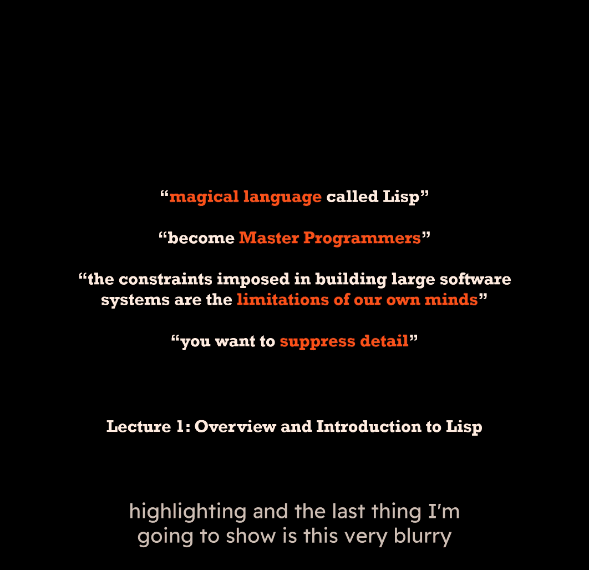

# cs-sicp

using guix to setup
sicp info for emac

[huangzworks/SICP-answers: 我的 SICP 解题集](https://github.com/huangzworks/SICP-answers)
[Ditro](http://deathking.github.io/)

### Summary and Insights:

> guix install sicp emacs guile emacs-auto-complete emacs-geiser emacs-paredit

The discussion centers around the suitability of _Structure and Interpretation of Computer Programs (SICP)_ versus _How to Design Programs (HtDP)_ as introductory programming textbooks.

#### **Key Takeaways:**

1. **SICP’s Philosophy:**

   - SICP is not about Scheme but about programming as a way to model and think.
   - It focuses on abstraction, problem decomposition, and computational models.
   - While it includes some mathematical concepts, it does not require an extensive math background.

2. **Criticisms of SICP:**

   - Some learners find its mathematical examples intimidating.
   - It was designed for MIT students who had prior calculus and programming experience.
   - It demands high intellectual maturity rather than just syntax knowledge.
   - Some feel it doesn't emphasize practical programming but rather deep computational thinking.

3. **HtDP as an Alternative:**

   - HtDP focuses on systematic problem-solving with a structured approach.
   - It avoids unnecessary math and makes programming concepts more accessible.
   - Some argue it is better suited for beginners, while others feel it may be too artificial.

4. **Pedagogy and Learning Styles:**

   - Some believe SICP assumes too much prior knowledge.
   - Others argue that programming should be taught in context with real-world applications.
   - There’s debate on whether a course should be theoretical (CS foundations) or practical (building real applications).

5. **Historical Context:**

   - SICP was designed when programming was done more deliberately due to limited resources.
   - Computer Science evolved from Electrical Engineering and Mathematics, which influenced how programming was initially taught.

6. **The Role of Mathematics in CS Education:**
   - Some argue that mathematical maturity is essential for deep understanding.
   - Others believe that focusing too much on theory without practical applications is a mistake.

#### **Final Insight:**

SICP is excellent for those who want to deeply understand computing, while HtDP is better for structured learning. The choice depends on whether the learner prefers conceptual depth or a more systematic, accessible introduction to programming.

### Other [#](https://sicp-solutions.net//#other)

- [Projects for MIT 6.001 on ocw.mit.edu](https://ocw.mit.edu/courses/electrical-engineering-and-computer-science/6-001-structure-and-interpretation-of-computer-programs-spring-2005/projects/)
- [Lecture Notes for MIT 6.001 on ocw.mit.edu](https://ocw.mit.edu/courses/electrical-engineering-and-computer-science/6-001-structure-and-interpretation-of-computer-programs-spring-2005/lecture-notes/)
- [If not SICP, then what? Maybe HTDP? (stevenrosenberg.net) – Thread on Hacker News](https://news.ycombinator.com/item?id=18890417)

### Other solutions [#](https://sicp-solutions.net//#other-solutions)

- [community schemewiki SICP-Solutions](http://community.schemewiki.org/?SICP-Solutions) or other solutions
- [Structure and Interpretation of Computer Programs](https://github.com/zv/SICP-guile): “This repository includes answers to a bit more than 90% of the book’s 360-some exercises as well as material intended to help others get an idea of how to begin with the book, avoid many common pitfalls as they continue, and review interesting secondary material along the way.”

### Tools used [#](https://sicp-solutions.net//#tools-used)

- [DrRacket](https://racket-lang.org/): used to develop and run the code.
  - [SICP Collections](https://docs.racket-lang.org/sicp-manual/index.html): The sicp collection contains a #lang sicp language ideal for studying the book “Structure and Interpretation of Computer Programs” by Gerald Jay Sussman and Hal Abelson.
- [MathType demo - For Developers](http://www.wiris.com/editor/demo/en/developers#mathml-latex): used to write and check the Latex.
- [Overleaf, Online LaTeX Editor](https://www.overleaf.com/)

### Misc links [#](https://sicp-solutions.net//#misc-links)

- [SICP: the end of an era (2021) \[video\] | Hacker News](https://news.ycombinator.com/item?id=34657535)
- [Episode 503: Robert Martin on Structure and Interpretation of Computer Programming](https://www.youtube.com/watch?v=Z0VpFmp_q4A)

  - “It changed the way I look at the fundamental structure of programs. It is possible, and desirable, to write code without assignement statements as much as possible. To not mutate the states of variables. And it forces you to think about software in a very different way. \[…\] I assign now variable less frequently.”
  - “\[functional programming\] forces you to keep your data in much better order. There will always be times when you have to change the state of the system but you do so with a tremendous amount of discipline in this language. You treat the changing of data in the system the way you would treat a transaction on disk.”

### Other [#](https://sicp-solutions.net//#other)

- [Projects for MIT 6.001 on ocw.mit.edu](https://ocw.mit.edu/courses/electrical-engineering-and-computer-science/6-001-structure-and-interpretation-of-computer-programs-spring-2005/projects/)
- [Lecture Notes for MIT 6.001 on ocw.mit.edu](https://ocw.mit.edu/courses/electrical-engineering-and-computer-science/6-001-structure-and-interpretation-of-computer-programs-spring-2005/lecture-notes/)
- [If not SICP, then what? Maybe HTDP? (stevenrosenberg.net) – Thread on Hacker News](https://news.ycombinator.com/item?id=18890417)

### Other solutions [#](https://sicp-solutions.net//#other-solutions)

- [community schemewiki SICP-Solutions](http://community.schemewiki.org/?SICP-Solutions) or other solutions
- [Structure and Interpretation of Computer Programs](https://github.com/zv/SICP-guile): “This repository includes answers to a bit more than 90% of the book’s 360-some exercises as well as material intended to help others get an idea of how to begin with the book, avoid many common pitfalls as they continue, and review interesting secondary material along the way.”

### Tools used [#](https://sicp-solutions.net//#tools-used)

- [DrRacket](https://racket-lang.org/): used to develop and run the code.
  - [SICP Collections](https://docs.racket-lang.org/sicp-manual/index.html): The sicp collection contains a #lang sicp language ideal for studying the book “Structure and Interpretation of Computer Programs” by Gerald Jay Sussman and Hal Abelson.
- [MathType demo - For Developers](http://www.wiris.com/editor/demo/en/developers#mathml-latex): used to write and check the Latex.
- [Overleaf, Online LaTeX Editor](https://www.overleaf.com/)

### Misc links [#](https://sicp-solutions.net//#misc-links)

- [SICP: the end of an era (2021) \[video\] | Hacker News](https://news.ycombinator.com/item?id=34657535)
- [Episode 503: Robert Martin on Structure and Interpretation of Computer Programming](https://www.youtube.com/watch?v=Z0VpFmp_q4A)

  - “It changed the way I look at the fundamental structure of programs. It is possible, and desirable, to write code without assignement statements as much as possible. To not mutate the states of variables. And it forces you to think about software in a very different way. \[…\] I assign now variable less frequently.”
  - “\[functional programming\] forces you to keep your data in much better order. There will always be times when you have to change the state of the system but you do so with a tremendous amount of discipline in this language. You treat the changing of data in the system the way you would treat a transaction on disk.”


design patterns in c++

write the epigramson programming:

- a lisp programmer knows the value of everything, but the cost of nothing

- it is better have 100 functions operate on one data structure than 10 functions on 10 data structures

Let’s dive into these two classic quotes often attributed to the Lisp programming world and unpack them with simple analogies and explanations. Since you’re exploring recursion and higher-order functions (like in _The Little Schemer_), these ideas fit right into that mindset. I’ll keep it approachable and fun, like we’re chatting over coffee—no CS degree required!

---

### 1. "A Lisp programmer knows the value of everything, but the cost of nothing"

#### What It Means

This is a playful jab at Lisp programmers (and Lisp itself). It suggests that Lisp gives you incredible flexibility and power to express ideas ("value"), but it doesn’t always make it obvious how much computational effort ("cost") those ideas take.

#### Analogy: A Magic Toolbox

Imagine you’re a carpenter with a magical toolbox. You can build anything—a chair, a rocket, a castle—because the tools are so versatile (that’s the **value**). But the toolbox doesn’t tell you how much wood, nails, or time each project needs (that’s the **cost**). You might design a gorgeous spiral staircase, only to realize later it took ten times more effort than a simple ladder!

#### Explanation

- **Value**: Lisp’s strength is its simplicity and abstraction. Everything is a **list** (a basic data structure), and functions can manipulate lists in endless ways using recursion and higher-order functions. You can write elegant, concise code to solve complex problems—like defining a function that knows _everything_ about your data.
- **Cost**: Lisp often hides performance details. Recursion might look beautiful, but it could stack up memory or run slowly compared to a loop. The language doesn’t force you to think about low-level costs (e.g., memory allocation, CPU cycles)—you’re free to dream big, but you might not notice the bill until runtime.

#### Example: Factorial in Lisp (Translated to Python)

```python
def factorial(n):
    if n == 0:
        return 1
    return n * factorial(n - 1)
```

- **Value**: This is pure and elegant—solves factorial perfectly.
- **Cost**: Each call adds a stack frame. For `factorial(1000)`, you might blow the stack or slow down, and the code doesn’t warn you.

#### Takeaway

Lisp programmers love the _power_ of their tools (recursion, lists, macros), but they might overlook _efficiency_ until it bites them. It’s like knowing how to cook every dish in the world but not checking if you have enough gas in the stove!

---

### 2. "It is better to have 100 functions operate on one data structure than 10 functions on 10 data structures"

#### What It Means

This quote (from Alan Perlis) praises simplicity and uniformity. It’s better to have one flexible data structure (like a list in Lisp) that many functions can work with, rather than juggling lots of specialized data structures with fewer functions each.

#### Analogy: A Swiss Army Knife vs. a Tool Shed

- **100 functions, 1 data structure**: A Swiss Army knife with 100 tools (knife, screwdriver, bottle opener) all built into one handle. You carry one thing, and it does everything.
- **10 functions, 10 data structures**: A shed with 10 separate tools (hammer, saw, wrench), each needing its own handle. You’re lugging around a bunch of stuff, and each tool only does one job.

#### Explanation

- **One Data Structure**: In Lisp, the **list** is king. Numbers, strings, even code are all lists (or can be treated as such). You write tons of functions (`car`, `cdr`, `cons`, `map`) that all play with lists in different ways. This uniformity makes your code flexible and reusable.
- **Many Data Structures**: In other languages (like C or Java), you might have arrays, structs, classes, etc. Each needs its own functions (e.g., `array_get`, `struct_field`), leading to duplication and complexity.

#### Example: Lisp-Style List Processing in Python

```python
# One data structure: a list
numbers = [1, 2, 3, 4]

# Many functions operating on it
def first(lst): return lst[0]             # Like Lisp's 'car'
def rest(lst): return lst[1:]             # Like 'cdr'
def add_one(lst): return [x + 1 for x in lst]  # Transform
def double(lst): return [x * 2 for x in lst]   # Another transform

print(first(numbers))  # 1
print(rest(numbers))   # [2, 3, 4]
print(add_one(numbers))  # [2, 3, 4, 5]
print(double(numbers))   # [2, 4, 6, 8]
```

- **Contrast**: In a language with many structures, you’d need separate functions for arrays, linked lists, etc. (e.g., `array_get`, `linked_list_next`).

#### Why It’s Better

- **Simplicity**: One structure means you learn it once, then focus on what you can _do_ with it.
- **Flexibility**: 100 functions can combine in endless ways (e.g., `map` with `add_one` or `double`).
- **Less Overhead**: No need to convert between types or write boilerplate for each structure.

#### Lisp Connection

In _The Little Schemer_, recursion and higher-order functions shine because everything’s a list. You don’t juggle types—you recurse over lists and pass functions around, building complexity from simplicity.

---

## Connecting to Recursion and Higher-Order Functions

### Recursion

- **Quote 1**: Recursion’s “value” is its elegance (e.g., `factorial`), but its “cost” (stack growth) isn’t obvious. Lisp loves recursion, and Bash can do it too (like our directory example).
- **Quote 2**: Recursive functions (e.g., `sum_list`, `reverse_list`) work beautifully on one structure (lists), avoiding the need for specialized versions.

### Higher-Order Functions

- **Quote 1**: Higher-order functions (like `map`) show Lisp’s power—apply any logic to a list—but their cost (e.g., memory for closures) sneaks up on you.
- **Quote 2**: With one list and 100 functions like `map`, `filter`, or `reduce`, you get endless possibilities without needing new structures.

---

## Bash Tie-In

Since you asked about Bash recursion:

- **Quote 1**: A recursive Bash script (e.g., `factorial`) gives you the answer (value) but might crash with too many calls (cost)—Bash doesn’t hide that limit well!
- **Quote 2**: Bash operates on strings or arrays (its “one structure”), with commands like `ls`, `grep`, or `find` acting as the “100 functions.” It’s not as pure as Lisp’s lists, but the idea holds.

---

## Try It Yourself

### Recursion on One Structure

Write a Bash script to count characters in a string recursively:

```bash
#!/bin/bash

count_chars() {
    local str="$1"
    if [ -z "$str" ]; then  # Base case: empty string
        echo 0
    else  # Recursive case: first char + rest
        local rest="${str:1}"
        local sub=$(count_chars "$rest")
        echo $((1 + sub))
    fi
}

count_chars "hello"  # Outputs: 5
```

### Higher-Order Approximation

Apply a command twice in Bash:

```bash
#!/bin/bash

apply_twice() {
    local cmd="$1"
    local val="$2"
    local step1=$(bash -c "$cmd $val")
    bash -c "$cmd $step1"
}

add_one="echo \$(( \$1 + 1 ))"
apply_twice "$add_one" 5  # Outputs: 7
```

---

## Simple Takeaways

- **"Value vs. Cost"**: Lisp (and recursion) makes coding feel magical, but you gotta watch the hidden effort (memory, speed).
- **"100 Functions, 1 Structure"**: One flexible tool (like lists) with tons of uses beats a cluttered toolbox of specialized gadgets.

Does this make sense? Want to explore more Lisp-y ideas in Bash or Python? Let me know how to keep the fun going!

---

> A programmer should acquire good algorithms and idioms

- should rely on the library of the languages instead of hard build it ~> cpp


racket and clojure ~> poplar lisp dialects
lisp invented in 1958

conference :


list processing


- threading
  it pipe different algorithms together without having to nest them inside the parentheses

Let’s dive into this piece of Scheme code and figure out what it’s doing! It looks like your OCR introduced some typos, so I’ll first clean it up based on context and common Scheme conventions, then explain it step by step. The code involves a **threading macro** (`~>`), recursion, and higher-order functions—perfect for our _Little Schemer_-inspired journey. I’ll keep it simple and fun, like we’re unraveling a puzzle together!

---

### Cleaned-Up Code

The original OCR’d code has typos (e.g., `1st` instead of `lst`, `A` instead of `lambda`, `@` instead of `0`). Here’s my best guess at the corrected version:

```scheme
(define (sum-square-two-largest lst)
  (~> lst
      (sort >)
      (take 2)
      (map (lambda (x) (* x x)) _)
      (foldl + 0 _)))
```

Assumptions:

- `1st` ‚Üí `lst` (a list argument).
- `A` → `lambda` (Scheme’s anonymous function syntax).
- `@` ‚Üí `0` (initial value for `foldl`).
- `'`, `(A`, and other oddities ‚Üí fixed as logical syntax.

If this isn’t what you meant, let me know, and we’ll tweak it!

---

### What Does It Do?

This function, `sum-square-two-largest`, takes a list of numbers (`lst`), finds the two largest numbers, squares them, and returns their sum. For example:

- Input: `(sum-square-two-largest '(1 2 3 4))`
- Output: `25` (because the two largest are 4 and 3; `4² + 3² = 16 + 9 = 25`).

It uses a **threading macro** (`~>`) to chain operations in a readable way, passing the result of each step to the next.

---

### Analogy: Assembly Line

Think of this as a factory assembly line:

1. **Raw materials** (the list) come in.
2. **Sort** them by size (biggest first).
3. **Take** the top two.
4. **Square** each one (like shaping parts).
5. **Add** them up to ship the final product.

The `~>` macro is the conveyor belt, moving the materials smoothly from station to station.

---

### Breaking It Down Step by Step

#### 1. `(define (sum-square-two-largest lst) ...)`

- Defines a function that takes one argument: `lst` (a list of numbers).

#### 2. `~>` (Threading Macro)

- The `~>` macro (from libraries like SRFI-197 or Racket’s threading utilities) “threads” the result of each operation into the next one.
- It starts with `lst` and passes it through each step, plugging the output into a placeholder (often `_` or implied).

#### 3. `(sort >)`

- **What It Does**: Sorts the list in descending order (`>` means “greater than”).
- **Input**: `lst = (1 2 3 4)`.
- **Output**: `(4 3 2 1)`.
- **How**: `sort` is a higher-order function—it takes a comparison function (`>`) and rearranges the list.

#### 4. `(take 2)`

- **What It Does**: Takes the first 2 elements from the sorted list.
- **Input**: `(4 3 2 1)`.
- **Output**: `(4 3)`.
- **How**: `take` is a list function that grabs the specified number of items from the front.

#### 5. `(map (lambda (x) (* x x)) _)`

- **What It Does**: Applies a squaring function to each element.
- **Input**: `(4 3)`.
- **Lambda**: `(lambda (x) (* x x))` is an anonymous function that squares `x`.
- **Output**: `(16 9)` (since `4 * 4 = 16`, `3 * 3 = 9`).
- **How**: `map` is a higher-order function—it takes a function and a list, applies the function to each item, and returns a new list. The `_` is where `~>` plugs in the previous result.

#### 6. `(foldl + 0 _)`

- **What It Does**: Adds up all the numbers, starting with 0.
- **Input**: `(16 9)`.
- **Output**: `25`.
- **How**:
  - `foldl` (fold-left) is a higher-order function that reduces a list to a single value.
  - `+` is the operation.
  - `0` is the initial value.
  - `_` is where the list `(16 9)` goes.
  - Steps: `0 + 16 = 16`, `16 + 9 = 25`.

---

### How `~>` Ties It Together

The `~>` macro makes this a pipeline:

- Start with `lst`.
- `lst` ‚Üí `(sort >)` ‚Üí sorted list.
- Sorted list ‚Üí `(take 2)` ‚Üí top two.
- Top two ‚Üí `(map (lambda (x) (* x x)) _)` ‚Üí squared list.
- Squared list ‚Üí `(foldl + 0 _)` ‚Üí final sum.

It’s like threading a needle through each step, sewing the operations into one smooth flow. Without `~>`, you’d nest everything manually:

```scheme
(foldl + 0 (map (lambda (x) (* x x)) (take 2 (sort > lst))))
```

Harder to read, right? `~>` makes it linear and clear.

---

### Testing It

If you have a Scheme interpreter (e.g., Racket), try this:

```scheme
(define (sum-square-two-largest lst)
  (~> lst
      (sort >)
      (take 2)
      (map (lambda (x) (* x x)) _)
      (foldl + 0 _)))

(display (sum-square-two-largest '(1 2 3 4)))  ; Prints: 25
```

---

### Connection to _The Little Schemer_

- **Recursion**: While this example doesn’t use explicit recursion, `map` and `foldl` are often defined recursively in Scheme:
  - `map`: Applies a function to the first item, then recurses on the rest.
  - `foldl`: Adds the first item to the accumulator, then recurses.
- **Higher-Order Functions**: `sort`, `map`, and `foldl` take functions as arguments, showing off Scheme’s love for functional programming.

---

### Python Equivalent (No Threading Macro)

Since you like Python, here’s how it’d look without a threading macro:

```python
def sum_square_two_largest(lst):
    sorted_lst = sorted(lst, reverse=True)  # Sort descending
    top_two = sorted_lst[:2]                # Take first 2
    squared = [x * x for x in top_two]      # Square each
    return sum(squared)                     # Add them up

print(sum_square_two_largest([1, 2, 3, 4]))  # Outputs: 25
```

Python doesn’t have `~>` natively, but libraries like `toolz` or `pyrsistent` offer similar pipelining.

---

### Simple Takeaway

- **What It Does**: Finds the two largest numbers in a list, squares them, and sums them.
- **Threading (`~>`)**: Like an assembly line—passes the list through steps, making code readable.
- **Scheme Vibes**: Uses lists, higher-order functions, and a functional style, straight out of Lisp’s playbook.

Does this click? Want to tweak it or try another Scheme example with threading? Let me know how to keep the fun going!

- Python doesn’t have `~>` natively, but libraries like `toolz` or `pyrsistent` offer similar pipelining.

- `~>` in scheme

> learn ins and outs in lisp ~> program

> use abstraction to suppress the details of the implementation

- use an algorithms and pass at a higher-order function
  e.g. alogrithm called reverse or rotate
  - you will able suppress detail which makes it easier for the reader



🫰🫰🫰🫰🫰🫰🫰🫰🫰🫰🫰🫰🫰🫰🫰
Let’s unpack these fascinating concepts from your query, which seem inspired by Lisp and the legendary computer science course _Structure and Interpretation of Computer Programs_ (SICP). I’ll explain each idea clearly, using analogies and examples, and then dive into the refinement of higher-order functions and the key takeaways from SICP. Think of this as a guided tour through a magical programming landscape—let’s get started!

---

## 1. "Learn ins and outs in Lisp ~> program"

### What It Means

This phrase suggests that by deeply understanding Lisp—its inner workings and nuances—you’ll become a better programmer overall. The `~>` symbol hints at a flow or transformation, like knowledge in Lisp leading to programming mastery.

### Analogy: Mastering a Tool

Imagine Lisp as a chef’s knife. Learning its “ins and outs” is like knowing not just how to chop with it, but why its balance and sharpness make it so effective. Once you master it, you can tackle any recipe—or programming challenge—with confidence.

### Explanation

- **Lisp’s Essence**: In Lisp, everything is a list, and code is treated like data. Functions are “first-class citizens,” meaning you can pass them around like variables. This simplicity gives you immense flexibility.
- **Why It Helps**: Exploring Lisp teaches you recursion (solving problems by breaking them into smaller pieces) and macros (writing code that writes code). These skills sharpen your problem-solving abilities in any language.

---

## 2. "Use abstraction to suppress the details of the implementation"

### What It Means

Abstraction is about hiding complexity so you can focus on what matters. It’s like using a TV remote—you don’t need to know how the circuits work to change the channel.

### Example: Reversing a List

- **Without Abstraction**: You might write a manual loop to reverse a list, step-by-step:
  ```python
  def reverse_list(lst):
      result = []
      for i in range(len(lst)-1, -1, -1):
          result.append(lst[i])
      return result
  ```
  This is cluttered with details—looping, indexing, appending.
- **With Abstraction**: Use Python’s built-in `reverse`:
  ```python
  reversed_list = list(reversed(my_list))
  ```
  Now, the _how_ is hidden, and the intent (reversing) shines through.

### Benefit

Abstraction makes code cleaner and easier to understand. You focus on _what_ you want, not _how_ it’s done.

---

## 3. "Use an algorithm and pass it as a higher-order function, e.g., algorithm called reverse or rotate"

### What It Means

Higher-order functions (HOFs) are functions that take other functions as arguments or return them. This lets you pass _behavior_ around, like handing someone a recipe instead of cooking for them.

### Analogy: A Personal Assistant

Imagine telling an assistant, “Sort my books by size.” You don’t explain _how_ to sort—you just give them the task. The assistant is like a higher-order function, applying your instructions.

### Example: `map` with `reverse`

- **Without HOFs**: Manually square numbers in a list:
  ```python
  numbers = [1, 2, 3]
  squares = []
  for x in numbers:
      squares.append(x * x)
  ```
- **With HOFs**: Use `map` to apply a function:
  ```python
  squares = list(map(lambda x: x * x, numbers))
  ```
- **Reverse Example**: Apply `reverse` to sublists:

  ```python
  def apply_to_sublists(func, list_of_lists):
      return [func(sublist) for sublist in list_of_lists]

  my_lists = [[1, 2], [3, 4]]
  reversed_sublists = apply_to_sublists(lambda lst: list(reversed(lst)), my_lists)
  # Result: [[2, 1], [4, 3]]
  ```

### Benefit

You hide the looping details and focus on the behavior (`reverse`, `rotate`). This makes your code more flexible and reusable.

---

## 4. "You will be able to suppress detail which makes it easier for the reader"

### What It Means

Using abstractions and higher-order functions makes your code simpler for others (or future you) to read. It’s like summarizing a story instead of reciting every detail.

### Analogy: Map vs. Directions

- **Low-Level Code**: Like GPS instructions: “Turn left in 0.1 miles, then right in 0.2 miles…”—too many steps to follow.
- **High-Level Code**: Like a map showing the route at a glance—clear and intuitive.

### Explanation

When you use `map` or a custom function, you’re saying, “Here’s the plan; trust that the details work.” The reader grasps the intent without getting lost in the mechanics.

---

## 5. "Magical language called Lisp" and "Become Master Programmers"

### What It Means

Lisp is called “magical” because its minimalist design—built on lists and functions—unlocks endless possibilities. Mastering it transforms how you think, making you a stronger programmer.

### Analogy: Chess Mastery

Lisp is like chess: simple rules, profound depth. Learning it hones your strategic thinking, applicable anywhere.

### Explanation

- **Lisp’s Magic**: Its uniformity (code as lists) lets you create macros, bending the language to your needs. Recursion replaces loops, simplifying complex problems.
- **Mastery**: You learn to break problems into small, composable pieces, a skill that elevates your work in any language.

---

## 6. "The constraints imposed in building large software systems are the limitations of our own minds"

### What It Means

Big software is hard not because of computers, but because our brains struggle with complexity. Good design—via abstraction—helps us cope.

### Analogy: Building a Skyscraper

- **Without Abstraction**: Tracking every nail and wire—overwhelming!
- **With Abstraction**: Focus on floors and systems, letting the details fall into place.

### Explanation

- **Mental Limits**: We can only juggle so much. Abstractions (functions, modules) organize complexity into manageable chunks.
- **Solution**: Use layers of abstraction to keep your sanity while building something massive.

---

## 7. "You want to suppress detail"

### What It Means

Hiding details isn’t just nice—it’s essential. It keeps your code focused and maintainable.

### Example: A Dashboard

A car’s dashboard shows speed and fuel, not the engine’s inner workings. Similarly:

```python
def calculate_total_price(items):
    # Hidden: tax rates, discounts, etc.
    return sum(item.price for item in items) * 1.1  # 10% tax
```

The caller sees the result, not the math.

---

## Refinement of Higher-Order Functions

### What Is It?

Refining higher-order functions means crafting them to be clear, expressive, and just abstract enough—not too vague, not too detailed.

### Example: Composing Functions

Instead of one messy function, chain HOFs:

```python
numbers = [-2, 1, 3]
# Filter positives, square them, sum them
from functools import reduce
total = reduce(lambda acc, x: acc + x, map(lambda x: x * x, filter(lambda x: x > 0, numbers)))
# Result: 10 (1² + 3²)
```

- **Refinement**: Name it for clarity:

```python
def sum_of_squares_of_positives(nums):
    return reduce(lambda acc, x: acc + x, map(lambda x: x * x, filter(lambda x: x > 0, nums)))
```

- **Even Better**: Use named functions for readability:

```python
def is_positive(x): return x > 0
def square(x): return x * x
def add(acc, x): return acc + x

def sum_of_squares_of_positives(nums):
    return reduce(add, map(square, filter(is_positive, nums)))
```

### Benefits

- **Clarity**: Each function has one job.
- **Flexibility**: Swap `square` for `cube` or `is_positive` for `is_even` without rewriting the logic.

---

## Useful Points from SICP

_SICP_ is a classic CS course/book that uses Lisp to teach timeless principles:

### Key Concepts

- **Abstraction**: Build layers to tame complexity.
- **Recursion**: Solve big problems by reducing them to smaller ones.
- **Higher-Order Functions**: Pass and compose functions for flexibility.
- **Code as Data**: In Lisp, code is lists, enabling powerful tools like macros.

### Takeaways

- **Functional Thinking**: Prefer pure functions (no side effects) for predictable code.
- **Compose Small Pieces**: Start with simple functions, combine them into systems.
- **Mind Matters**: Programming is about organizing your thoughts, not just commanding the machine.

### Why It’s Useful

SICP teaches you to _think_ like a programmer, not just code. Its lessons apply to any language, helping you manage complexity and write elegant solutions.

---

## Simple Summary

- **Lisp**: Learn its magic (lists, recursion) to grow as a programmer.
- **Abstraction**: Hide details for clarity and focus.
- **Higher-Order Functions**: Pass behavior to make code flexible and readable.
- **SICP**: Master your mind to master software.

---

- primitive elements : `+-*/` ~> primitive procedures
- means of combination : `[] composition , cond, if`
- means of abstraction: `define`

---

# Lecture notes:

Let’s dive into the first chapter of _Structure and Interpretation of Computer Programs_ (SICP), as presented in the lecture notes from the 6.037 course at MIT. The lecture, delivered by Mike Phillips, focuses on **procedural abstraction** and **recursion**, foundational concepts in computer science. I’ll break down the key ideas, explain them in a beginner-friendly way, and provide practical examples to ensure you grasp the material. Since the text is a PDF-to-text conversion, I’ll correct any typos (e.g., “totla” to “total”) and interpret unclear sections logically.

---

## Chapter 1: Building Abstractions with Procedures (SICP)

### Overview

Chapter 1 of SICP introduces the idea of **computation as a process** and how we can describe processes using a programming language—in this case, Scheme, a dialect of Lisp. The focus is on creating **procedures** (functions) to capture processes and using **abstraction** to manage complexity. The lecture emphasizes two key concepts: **procedural abstraction** (hiding implementation details behind a named procedure) and **recursion** (solving problems by breaking them into smaller, similar subproblems). These ideas are taught through Scheme’s syntax and semantics, with practical examples like computing square roots and factorials.

---

### Goals of the Chapter

- Understand **computation** as “how-to” knowledge (imperative knowledge), not just “what-is” facts.
- Learn to describe processes using a language (Scheme) with:
  - **Primitives**: Basic building blocks (e.g., numbers, operations).
  - **Syntax**: Rules for combining expressions.
  - **Semantics**: Rules for evaluating expressions.
  - **Procedures**: Ways to capture and name processes.
- Master **procedural abstraction** to create modular, reusable code.
- Explore **recursion** and **iteration** as strategies for problem-solving.

---

## Key Concepts and Lessons

### 1. Computation as Imperative Knowledge

**What It Means**: Computation isn’t about storing facts (e.g., “the square root of 2 is 1.4142”). It’s about describing _how to_ compute something—a series of steps to deduce a value. This is called **imperative knowledge**.

**Example**: To compute the square root of \( x \) (e.g., \( \sqrt{2} \)) using Heron’s Method:

- Start with a guess \( G \) (e.g., \( G = 1 \)).
- Improve the guess by averaging \( G \) and \( \frac{x}{G} \): \( G\_{\text{new}} = \frac{G + \frac{x}{G}}{2} \).
- Repeat until \( G^2 \) is close enough to \( x \).

For \( x = 2 \):

- \( G = 1 \), then \( G\_{\text{new}} = \frac{1 + \frac{2}{1}}{2} = 1.5 \).
- \( G = 1.5 \), then \( G\_{\text{new}} = \frac{1.5 + \frac{2}{1.5}}{2} = 1.4166 \).
- \( G = 1.4166 \), then \( G\_{\text{new}} = 1.4142 \), which is close enough (within 0.001 of 2 when squared).

**Why It Matters**: This “how-to” approach lets us generalize solutions, making them reusable for any input, not just specific cases.

---

### 2. Scheme Basics: Primitives, Syntax, and Semantics

Scheme is the language used in SICP. Let’s break down its core elements.

#### Primitives

These are the basic building blocks:

- **Self-Evaluating Primitives**:
  - Numbers: `29`, `-35`, `1.34`, `1.2e5`.
  - Strings: `"this is a string"`.
  - Booleans: `#t` (true), `#f` (false).
  - These evaluate to themselves (e.g., `29` ‚Üí `29`).
- **Built-in Procedures**:
  - Numbers: `+`, `-`, `*`, `/`, `>`, `<`, `>=`, `<=`, `=`.
  - Strings: `string-length`, `string=?`.
  - Booleans: `and`, `or`, `not`.

#### Syntax

Scheme uses a **prefix notation** for expressions, called **combinations**:

- Format: `(operator operand1 operand2 ...)`
- Example: `(+ 2 3)` evaluates to `5`.
- Nested combinations: `(+ (* 2 3) 4)` ‚Üí `(+ 6 4)` ‚Üí `10`.

#### Semantics (Evaluation Rules)

1. **Self-Evaluating**: Return the value (e.g., `5` ‚Üí `5`).
2. **Names**: Look up the value in the environment (e.g., `+` ‚Üí the addition procedure).
3. **Combinations**: Evaluate sub-expressions, then apply the operator to the results.
4. **Special Forms**: Have unique rules (e.g., `define`, `if`, `lambda`—we’ll cover these soon).

**Example**:

- `(* (+ 3 4) (- 8 2))` ‚Üí `(* 7 6)` ‚Üí `42`.
- The environment maps names like `+` to their procedures.

#### Abstraction with Names

Use `define` to name values or procedures:

- `(define score 23)` binds `score` to `23`.
- `(define total (+ 12 13))` binds `total` to `25`.
- Then: `(* 100 (/ score total))` ‚Üí `(* 100 (/ 23 25))` ‚Üí `92`.

**Common Errors**:

- `(5 + 6)`: Fails because `5` isn’t a procedure.
- `((+ 5 6))`: Fails because `11` isn’t a procedure.
- `(* 100 (/ score totla))`: Fails due to typo (`totla` should be `total`).

---

### 3. Procedural Abstraction with `lambda`

**What It Is**: Procedural abstraction lets you encapsulate a process in a reusable procedure, hiding its implementation details. In Scheme, you create procedures using the `lambda` special form.

#### Syntax of `lambda`

- `(lambda (parameters) body)`
- Example: `(lambda (x) (* x x))` creates a procedure that squares its input.
- `(lambda (x y) (/ (+ x y) 2))` averages two numbers.

#### Using `lambda`

- Apply directly: `((lambda (x) (* x x)) 5)` ‚Üí `(* 5 5)` ‚Üí `25`.
- Name it with `define`:
  ```scheme
  (define square (lambda (x) (* x x)))
  (square 5) ; ‚Üí 25
  ```
- Shorthand: `(define (square x) (* x x))` is equivalent.

**Why It’s Powerful**: Procedures let you capture common patterns. For example:

- Pattern: `(* 3 3)`, `(* 25 25)`.
- Abstracted: `(define square (lambda (x) (* x x)))`.

#### Modularity Example: Pythagorean Theorem

Without abstraction:

```scheme
(sqrt (+ (* 3 3) (* 4 4))) ; ‚Üí 5
```

With abstraction:

```scheme
(define square (lambda (x) (* x x)))
(define pythagoras (lambda (x y) (sqrt (+ (square x) (square y)))))
(pythagoras 3 4) ; ‚Üí 5
```

Even better, break it into smaller pieces:

```scheme
(define sum-squares (lambda (x y) (+ (square x) (square y))))
(define pythagoras (lambda (x y) (sqrt (sum-squares x y))))
```

**Benefit**: Abstraction isolates implementation details (e.g., how `square` works) from usage, enabling reuse and clarity.

---

### 4. Building a Square Root Procedure

Let’s apply procedural abstraction to Heron’s Method for computing \( \sqrt{x} \).

#### Subproblems

1. **Check if the guess is close enough**:
   - `(define close-enough? (lambda (guess x) (< (abs (- (square guess) x)) 0.001)))`.
   - Returns `#t` if \( \text{guess}^2 \) is within 0.001 of \( x \).
2. **Improve the guess**:
   - `(define average (lambda (a b) (/ (+ a b) 2)))`.
   - `(define improve (lambda (guess x) (average guess (/ x guess))))`.
3. **Control the process**:
   - Use the `if` special form: `(if predicate consequent alternative)`.
   - If the guess is close enough, return it; otherwise, improve and repeat.

#### Implementation

```scheme
(define sqrt-loop
  (lambda (guess x)
    (if (close-enough? guess x)
        guess
        (sqrt-loop (improve guess x) x))))

(define sqrt
  (lambda (x)
    (sqrt-loop 1.0 x)))
```

- Start with \( G = 1.0 \).
- If `close-enough?` is true, return the guess.
- Otherwise, compute a new guess with `improve` and recurse.

#### Evaluation Example: \( \sqrt{2} \)

- `(sqrt 2)` ‚Üí `(sqrt-loop 1.0 2)`.
- `(close-enough? 1.0 2)` ‚Üí `#f` (since \( 1.0^2 = 1 \), not close to 2).
- `(improve 1.0 2)` ‚Üí `(average 1.0 (/ 2 1.0))` ‚Üí `1.5`.
- `(sqrt-loop 1.5 2)` ‚Üí continues until `(sqrt-loop 1.4142 2)`, which is close enough.

**Why `if` Is a Special Form**: If `if` were a regular procedure, it would evaluate both the consequent and alternative, leading to infinite recursion. As a special form, it only evaluates the chosen branch.

---

### 5. Recursion: Factorial Example

**What Is Recursion?** Recursion solves a problem by breaking it into smaller instances of the same problem, until reaching a base case.

#### Factorial Definition

- \( n! = n \times (n-1) \times (n-2) \times \cdots \times 1 \).
- Example: \( 4! = 4 \times 3 \times 2 \times 1 = 24 \).

#### Recursive Approach

1. **Wishful Thinking**: Assume you have a procedure `fact` that computes \( (n-1)! \).
2. **Decompose**: \( n! = n \times (n-1)! \).
3. **Base Case**: Define \( 1! = 1 \).

Initial attempt:

```scheme
(define fact (lambda (n) (* n (fact (- n 1)))))
```

Problem: No base case, so it runs forever (e.g., `(fact 2)` ‚Üí `(* 2 (fact 1))` ‚Üí `(* 2 (* 1 (fact 0)))` ‚Üí ...).

Fixed version:

```scheme
(define fact
  (lambda (n)
    (if (= n 1)
        1
        (* n (fact (- n 1))))))
```

- Base case: If \( n = 1 \), return 1.
- Recursive case: Compute \( n \times (n-1)! \).

Evaluation: `(fact 3)`

- `(if (= 3 1) 1 (* 3 (fact 2)))` ‚Üí `(* 3 (fact 2))`.
- `(if (= 2 1) 1 (* 2 (fact 1)))` ‚Üí `(* 2 (fact 1))`.
- `(if (= 1 1) 1 (* 1 (fact 0)))` ‚Üí `1`.
- `(fact 3)` ‚Üí `(* 3 (* 2 1))` ‚Üí `6`.

#### Space Complexity

Recursive `fact` builds up pending operations:

- `(fact 4)` ‚Üí `(* 4 (* 3 (* 2 (fact 1))))`.
- Space grows with \( n \), as each recursive call waits for the next to finish.

---

### 6. Iteration: A Better Factorial

**What Is Iteration?** Iteration solves a problem by maintaining state (e.g., a running product) and updating it in a loop, using constant space.

#### Iterative Factorial

Instead of computing \( 4! = 4 \times 3 \times 2 \times 1 \) by nesting multiplications, compute it iteratively:

- Start with `product = 1`, `done = 1`, `max = 4`.
- Update: `product = product * (done + 1)`, `done = done + 1`.
- Stop when `done = max`.

Table:
| product | done | max |
|---------|------|-----|
| 1 | 1 | 4 |
| 2 | 2 | 4 |
| 6 | 3 | 4 |
| 24 | 4 | 4 |

Implementation:

```scheme
(define ifact
  (lambda (n)
    (ifact-helper 1 1 n)))

(define ifact-helper
  (lambda (product done max)
    (if (= done max)
        product
        (ifact-helper (* product (+ done 1))
                      (+ done 1)
                      max))))
```

- `(ifact 4)` ‚Üí `(ifact-helper 1 1 4)`.
- `(ifact-helper 2 2 4)` ‚Üí `(ifact-helper 6 3 4)` ‚Üí `(ifact-helper 24 4 4)` ‚Üí `24`.

#### Space Complexity

- **Iterative**: Constant space—no pending operations, as each step computes the next state directly.
- **Recursive**: Linear space—pending operations grow with \( n \).

---

## Practical Takeaways

1. **Procedural Abstraction**:

   - Use `lambda` to create reusable procedures (e.g., `square`, `average`).
   - Break complex problems into smaller, modular pieces (e.g., `pythagoras` using `sum-squares`).
   - This makes code easier to understand, reuse, and maintain.

2. **Recursion**:

   - Solve problems by reducing them to smaller subproblems (e.g., `fact`).
   - Always define a base case to avoid infinite recursion.
   - Be aware of space usage—recursion can be memory-intensive.

3. **Iteration**:

   - Use iterative algorithms for constant space (e.g., `ifact`).
   - Think in terms of state updates (e.g., `product`, `done`).

4. **Scheme Tips**:
   - Master the prefix notation: `(operator operand1 operand2)`.
   - Use `define` to name values or procedures.
   - Understand special forms like `if` and `lambda`.

---

## Connection to Your Context

- **Mental Models (from Khalil’s Video)**: This chapter aligns with the “Code-First” phase, where the focus is on writing functional code. As you progress to “Value-First,” you’ll use these abstractions to prioritize user value (e.g., ensuring a square root function is accurate and efficient for a real application).
- **TDD/BDD/RDD**: The `sqrt` example shows a process similar to TDD—define a test (`close-enough?`), write code to pass it (`improve`), and refactor (`sqrt-loop`). BDD would involve specifying behavior (e.g., “Given a number, the square root should be accurate”), and RDD would ensure the code meets a requirement (e.g., “Must compute square roots within 0.001 error”).

---

## Exercises to Solidify Understanding

1. **Square Root**: Modify `sqrt` to use a different tolerance (e.g., 0.0001). How does it affect the result?
2. **Factorial**: Write a recursive procedure to compute the Fibonacci sequence (\( F(n) = F(n-1) + F(n-2) \), \( F(0) = 0 \), \( F(1) = 1 \)).
3. **Iterative Sum**: Write an iterative procedure to compute the sum of numbers from 1 to \( n \).

Let me know if you’d like to go through these exercises together!

---

primitive expressions, which represent the simplest entities the language is concerned with, 原始表達式，它們表⽰語⾔所關注的最簡單實體， means of combination, by which compound elements are built from simpler ones, and 組合⽅式，通過這種組合元素從更簡單的元素構建⽽ 成，以及 means of abstraction, by which compound elements can be named and manipulated as units. 抽象⽅法，通過該抽象⽅法，復合元素可以作為單元進 ⾏命名和作。

The passage you’ve provided outlines the foundational components of a programming language, specifically in the context of Scheme as discussed in _Structure and Interpretation of Computer Programs_ (SICP). It describes three key concepts: **primitive expressions**, **means of combination**, and **means of abstraction**. These are the building blocks that allow a language to express computations, from the simplest elements to complex processes. Let’s break each down in a clear, beginner-friendly way, with examples from Scheme, and explain their significance in software development.

---

## 1. Primitive Expressions (原始表達式)

**Definition**: Primitive expressions are the simplest entities in a programming language—the basic building blocks that the language inherently understands without needing further breakdown.

**Explanation**:

- These are the fundamental "atoms" of the language, representing basic data or operations.
- In Scheme, primitive expressions include things like numbers, booleans, strings, and built-in operations.
- They are "self-evaluating" (their value is themselves) or have predefined meanings in the language’s environment.

**Examples in Scheme** (from your SICP lecture notes):

- **Numbers**: `29`, `-35`, `1.34`, `1.2e5` (e.g., `1.2e5` means \( 1.2 \times 10^5 \)).
  - Evaluation: `29` ‚Üí `29`.
- **Strings**: `"this is a string"`, `"odd #$@%#$ thing number 35"`.
  - Evaluation: `"this is a string"` ‚Üí `"this is a string"`.
- **Booleans**: `#t` (true), `#f` (false).
  - Evaluation: `#t` ‚Üí `#t`.
- **Built-in Procedures**: `+`, `-`, `*`, `/`, `>`, `<`, `=` (for numbers); `string-length`, `string=?` (for strings); `and`, `or`, `not` (for booleans).
  - Evaluation: `+` → the addition procedure (in the environment, it’s bound to a procedure object, e.g., `#<procedure:+>`).

**Significance**:

- Primitive expressions are the starting point for any computation. Without them, you’d have nothing to build on.
- They provide the basic vocabulary of the language, like knowing the alphabet before forming words.

---

## 2. Means of Combination (組合方式)

**Definition**: Means of combination refer to the rules and mechanisms by which you can build compound elements (more complex expressions) from simpler ones, such as primitive expressions or other combinations.

**Explanation**:

- This is the syntax of the language—how you combine primitives to form meaningful expressions.
- In Scheme, the primary means of combination is a **combination expression**, written as `(operator operand1 operand2 ...)`.
- Combinations can be nested, allowing you to build arbitrarily complex expressions from simpler ones.

**Examples in Scheme**:

- **Simple Combination**: `(+ 2 3)`
  - Here, `+` is the operator, and `2` and `3` are operands.
  - Evaluation: `(+ 2 3)` ‚Üí `5`.
- **Nested Combination**: `(+ (* 2 3) 4)`
  - First, evaluate `(* 2 3)` ‚Üí `6`.
  - Then, evaluate `(+ 6 4)` ‚Üí `10`.
- **More Complex**: `(* (+ 3 4) (- 8 2))`
  - `(+ 3 4)` ‚Üí `7`.
  - `(- 8 2)` ‚Üí `6`.
  - `(* 7 6)` ‚Üí `42`.

**Evaluation Rules (Semantics)**:

1. Evaluate each sub-expression (operator and operands).
   - If the sub-expression is a primitive, return its value (e.g., `2` ‚Üí `2`).
   - If it’s a name (e.g., `+`), look up its value in the environment.
   - If it’s a combination, evaluate it recursively.
2. Apply the operator to the evaluated operands.
   - Example: In `(+ 2 3)`, `+` is a procedure, `2` and `3` are numbers, so apply `+` to get `5`.

**Significance**:

- Means of combination allow you to express complex computations by composing simpler ones.
- This recursive structure (combinations within combinations) gives the language expressive power, letting you describe intricate processes with a simple syntax.

---

## 3. Means of Abstraction (抽象方法)

**Definition**: Means of abstraction refer to the mechanisms by which compound elements (like combinations or procedures) can be named and treated as single units, allowing you to manipulate them as if they were primitives.

**Explanation**:

- Abstraction lets you hide the complexity of a compound expression or process behind a name.
- In Scheme, this is done using `define` to name values or procedures, and `lambda` to create new procedures.
- Once named, you can use the abstraction without worrying about its internal details, treating it as a black box.

**Examples in Scheme**:

- **Naming a Value**:

  ```scheme
  (define score 23)
  ```

  - `score` is now a name for the value `23`.
  - Evaluation: `score` ‚Üí `23`.
  - Usage: `(* 100 score)` ‚Üí `2300`.

- **Naming a Procedure**:

  ```scheme
  (define square (lambda (x) (* x x)))
  ```

  - `square` is now a name for a procedure that computes \( x^2 \).
  - Evaluation: `(square 5)` ‚Üí `(* 5 5)` ‚Üí `25`.
  - Shorthand: `(define (square x) (* x x))` is equivalent.

- **Using Abstractions in Combinations**:

  ```scheme
  (define average (lambda (x y) (/ (+ x y) 2)))
  (average 4 6) ; ‚Üí (/ (+ 4 6) 2) ‚Üí 5
  ```

  - `average` abstracts the process of averaging two numbers, so you can reuse it without rewriting the formula.

- **Larger Example (from your `sqrt` code)**:
  ```scheme
  (define (square x) (* x x))
  (define (average x y) (/ (+ x y) 2))
  (define (improve guess x) (average guess (/ x guess)))
  ```
  - `square` abstracts multiplication.
  - `average` abstracts the averaging process.
  - `improve` abstracts the Heron’s Method improvement step, using `average`.

**Significance**:

- Abstraction reduces complexity by letting you work at a higher level. Instead of writing `(* x x)` every time, you just use `square`.
- It enables modularity: you can change the implementation of `square` (e.g., to handle different types) without affecting code that uses it.
- It makes code reusable and easier to understand, as you can focus on the “what” (e.g., “square a number”) rather than the “how” (e.g., “multiply \( x \) by \( x \)”).

---

## How These Concepts Work Together

These three components form the foundation of any programming language:

1. **Primitive Expressions**: The basic elements (numbers, booleans, built-in operations) are the starting point.
2. **Means of Combination**: You combine primitives into more complex expressions, like `(+ (* 2 3) 4)`, to describe computations.
3. **Means of Abstraction**: You name these combinations (e.g., `(define square (lambda (x) (* x x)))`)) to treat them as units, building higher-level abstractions.

**Example from Your `sqrt` Code**:

- **Primitives**: Numbers like `1.0`, `0.00001`, and operations like `+`, `*`, `/`, `<`, `abs`.
- **Combinations**: Expressions like `(< (abs (- (square guess) x)) 0.00001)` in `good-enough?` combine primitives and other combinations.
- **Abstractions**: Procedures like `square`, `average`, `improve`, and `sqrt-iter` abstract the steps of Heron’s Method, letting you compute square roots as a single unit: `(sqrt 2)`.

---

## Why This Matters in Software Development

These concepts are universal and apply beyond Scheme to all programming languages:

- **Primitives** are like the basic data types and operations in any language (e.g., `int`, `+` in Python or Java).
- **Combinations** are how you write expressions (e.g., `2 + 3 * 4` in Python, though the syntax differs).
- **Abstractions** are functions, classes, or modules (e.g., defining a `square` function in Python: `def square(x): return x * x`).

**Connection to Your Context**:

- **Mental Models (Khalil’s Phases of Craftship)**: At the “Code-First” phase, you focus on primitives and combinations (writing basic expressions). As you move to “Value-First,” abstractions help you prioritize user value by encapsulating complexity (e.g., a `sqrt` function that’s reliable and reusable).
- **TDD/BDD/RDD**: In TDD, you write tests for primitives and combinations first (e.g., testing `square`). Abstractions like `sqrt` align with BDD’s focus on behavior (“Given a number, compute its square root”) and RDD’s focus on requirements (“Must compute square roots accurately”).

---

## Practical Takeaway

To write effective code:

1. Start with the **primitives** your language provides (e.g., numbers, operators).
2. Use **combinations** to build expressions that solve your problem.
3. Create **abstractions** to name and reuse those expressions, making your code modular and maintainable.

**Exercise**: Write a procedure to compute the cube of a number:

- Primitive: Use `*`.
- Combination: `(* x x x)`.
- Abstraction: `(define (cube x) (* x x x))`.

Let me know if you’d like to explore more examples or dive deeper into any part!

---

sudo install-info /usr/local/share/info/sicp.info /usr/local/share/info/dir

[Using a Texinfo edition of SICP](http://zv.github.io/sicp-in-texinfo#fn.1)

# What good is this book? - Logic for Systems: Lightweight Formal Methods for Everybody

> ## Excerpt
>
> Everybody has endless demands on their time. If you're a student, you might be deciding which classes to take. There's never enough time to take them all, so you need to prioritize based on expected value. If you're a professional, you're deciding how to best use your limited "free" time to learn new skills and stay current. Either way, you're probably wondering: What good is this book? (And if you aren't asking that, you ought to be.)

---

You need many different skills for a successful career. This book won't teach you how to work with other people, or manage your tasks, or give and receive feedback. It won't teach you to program either; there are plenty of other books for that. Instead, this book will teach you:

- how to think more richly about what matters about a system;
- how to better express what you want from it;
- how to more thoroughly evaluate what a system actually does give you; and
- how to use constraints and constraint solvers in your work (because we'll use them as tools to help us out). It will also give you a set of baseline skills that will aid you in using any further formal-methods techniques you might encounter in your work, such as [advanced type systems](https://rust-book.cs.brown.edu), [program verification](https://dafny.org), [theorem proving](https://lean-lang.org), and more.

### [Modeling: What really matters?](https://csci1710.github.io/book/chapters/manifesto/job.html#modeling-what-really-matters)

There's a useful maxim by George Box: **"All models are wrong, but some are useful"**. The only completely accurate model of a system is that system itself, including all of its real external context. This is impractical; instead, a modeler needs to make choices about what really matters to them: what do you keep, and what do you disregard? Done well, a model gets at the essence of a system. Done poorly, a model yields nothing useful or, worse, gives a false sense of security.

---

# Phyics

[MIT Scheme on Apple Silicon | Hacker News](https://news.ycombinator.com/item?id=29707604)

# MIT Scheme on Apple Silicon | Hacker News

> ## Excerpt
>
> I've been engaged in a 1.5 year long (so far) project to port the entirety of GJS's "scmutils" package over to Clojure, and the erratic behavior of MIT Scheme over Rosetta has been a pain I've consigned myself to for months. I keep an old machine handy when I need to test functions that can't work on the M1.

---

I've been engaged in a 1.5 year long (so far) project to port the entirety of GJS's "scmutils" package over to Clojure, and the erratic behavior of MIT Scheme over Rosetta has been a pain I've consigned myself to for months. I keep an old machine handy when I need to test functions that can't work on the M1.

I am SO HAPPY to see this work! Major timesaver for me and anyone looking to run the executable versions of Functional Differential Geometry\[1\] and Structure and Interpretation of Classical Mechanics\[2\] in the original language.

\[0\] [https://github.com/sicmutils/sicmutils](https://github.com/sicmutils/sicmutils) \[1\] [https://github.com/sicmutils/fdg-book](https://github.com/sicmutils/fdg-book) \[2\] [https://github.com/sicmutils/sicm-book](https://github.com/sicmutils/sicm-book)

---

# Lecture 1

### **Explanation of the Scheme Logic in `(sqrt-iter guess x)`**

This function is an **iterative** approach to calculating the square root using **Newton's method**.

---

## **Breaking Down the Code**

```scheme
(define (sqrt-iter guess x)
    (if (good-enough? guess x)  ; Check if guess is good enough
        guess                    ; If true, return guess
        (sqrt-iter (improve guess x) x)))  ; Otherwise, improve guess and repeat
```

### **1️⃣ Understanding `(if predicate consequent alternative)`**

In Scheme, an `if` expression has the format:

```scheme
(if condition then-part else-part)
```

- **`condition`** ‚Üí A predicate (a test that evaluates to `#t` or `#f`).
- **`then-part`** ‚Üí Evaluated if `condition` is `#t` (true).
- **`else-part`** ‚Üí Evaluated if `condition` is `#f` (false).

### **2️⃣ Function Behavior**

- **Base Case**: If `(good-enough? guess x)` is `#t`, return `guess` (the approximate square root).
- **Recursive Case**: Otherwise, refine the guess using `(improve guess x)` and call `sqrt-iter` again.

---

## **Understanding Each Component**

```scheme
(good-enough? guess x)
```

- A function (not shown here) that checks if the current guess is close enough to the actual square root of `x`.

```scheme
(improve guess x)
```

- A function that generates a better guess using Newton’s method:
  \[
  \text{new guess} = \frac{\text{old guess} + \frac{x}{\text{old guess}}}{2}
  \]

```scheme
(sqrt-iter (improve guess x) x)
```

- Recursively calls `sqrt-iter` with a better guess, progressively refining the estimate.

---

## **Example Execution (Finding `sqrt(4)`)**

### **Step-by-Step Execution**

Let's assume:

- **Initial guess** = 1
- **`good-enough?`** returns `#t` if the guess is close enough.
- **`improve`** applies Newton's method.

1. **First Call:** `(sqrt-iter 1 4)`

   - `good-enough?` ‚Üí `#f` (1 is far from ‚àö4).
   - Calls `(sqrt-iter (improve 1 4) 4)`

2. **Second Call:** `(sqrt-iter 2.5 4)`

   - `good-enough?` ‚Üí `#f`
   - Calls `(sqrt-iter (improve 2.5 4) 4)`

3. **Third Call:** `(sqrt-iter 2.05 4)`

   - `good-enough?` ‚Üí `#f`
   - Calls `(sqrt-iter (improve 2.05 4) 4)`

4. **Fourth Call:** `(sqrt-iter 2.0006 4)`
   - `good-enough?` ‚Üí `#t`
   - Returns `2.0006`

‚úÖ The function **converges** to the square root of 4.

---

### **Key Takeaways**

‚úî Uses **recursion** to refine guesses iteratively.  
‚úî Implements **Newton's method** for square root approximation.  
‚úî **Base case**: Stops when the guess is "good enough".  
‚úî **Recursive case**: Improves the guess and repeats.

Would you like a **visual diagram** or **a step-by-step trace with numbers**? üòä

- (if condition then-part else-part)

### **Understanding the Explanation of Recursive vs. Iterative Functions in Lisp**

This passage explains how to **distinguish recursive and iterative functions in Lisp** by analyzing **where the function calls itself** in the expression structure.

---

### **1️⃣ Recursive vs. Iterative Functions in Lisp**

The key point is **where** the function calls itself:

- In a **recursive function**, the function **calls itself nested inside another operation**.
- In an **iterative function**, the function **calls itself at the top level**, meaning the recursive call is the last operation in the function (tail recursion).

---

### **2️⃣ Example: Factorial Function in Lisp**

#### **Recursive Factorial (Non-Tail Recursive)**

```scheme
(define (factorial n)
  (if (= n 0)
      1
      (* n (factorial (- n 1)))))  ;; Recursive call is nested inside multiplication
```

Here, `factorial` **calls itself inside** the multiplication `(* n (factorial (- n 1)))`. This means:

- The function has to **store intermediate results** (stack grows).
- It **does not use tail recursion**, so it is **not optimized**.

---

#### **Iterative Factorial (Tail Recursive)**

```scheme
(define (factorial-iter n acc)
  (if (= n 0)
      acc
      (factorial-iter (- n 1) (* n acc))))  ;; Recursive call is at the top level
```

Here, the recursive call `factorial-iter (- n 1) (* n acc)` **happens at the top level**:

- There is **no extra computation after the recursive call**.
- This is a **tail recursive function**, meaning the compiler can optimize it into a loop (constant memory usage).

---

### **3️⃣ Recognizing the Pattern**

- **Recursive functions** ‚Üí Call themselves **inside** an expression.
- **Iterative functions** ‚Üí Call themselves **at the top level** (tail recursion).
- **Tail recursion** is **more efficient** in Lisp because the interpreter can optimize it into a simple loop.

---

### **4️⃣ Alternative Approach: Using Higher-Order Functions**

Instead of recursion, the passage suggests another method using **higher-order functions** like `fold`:

```scheme
(define (factorial-fold n)
  (fold-left * 1 (range 1 (+ n 1))))  ;; Reduce the list using multiplication
```

This approach:

- Uses **functional composition** instead of recursion.
- **Avoids explicit iteration** by relying on `fold-left`, which accumulates a result.

---

### **Final Takeaways**

- **Recursive**: Function calls itself **inside an expression**.
- **Iterative (Tail Recursive)**: Function calls itself **at the top level**.
- **Functional Approach**: Uses `fold` to replace explicit recursion.

Would you like a **visual diagram** comparing the call stacks? üòä

---

**Threading in Functional Programming (FP)**

### **Understanding Threading in FP**

Threading in functional programming **does not refer to parallelism** but rather to a **composition technique** that helps structure code in a clear, readable manner by passing the result of one function into another. This is achieved using a special syntax or macro (e.g., `->` in Clojure, `|>` in Elixir, or threading macros in Racket).

### **Why Use Threading?**

1. **Avoids Deep Nesting** – Helps eliminate excessive parentheses, making code easier to read.
2. **Improves Readability** – Code flows in a linear, top-down manner.
3. **Encourages Function Composition** – Emphasizes breaking down logic into reusable, modular pieces.
4. **Reduces Mental Overhead** – You focus on the transformations happening rather than keeping track of deeply nested function calls.

### **Example: Factorial Calculation with Threading**

Instead of using **recursive** or **iterative** solutions, a more idiomatic functional programming approach uses **higher-order functions** like `fold`:

```scheme
(define (factorial-fold n)
  (fold-left * 1 (range 1 (+ n 1))))  ;; Reduce the list using multiplication
```

Here’s what happens:

- `range 1 (+ n 1)`: Generates a sequence from `1` to `n`.
- `fold-left * 1 ...`: Applies the multiplication operator (`*`) across all elements, accumulating the result.
- The **accumulator starts at 1**, and the sequence is reduced to compute the factorial.

### **Comparison of Factorial Implementations**

| Approach  | Readability | Space Complexity | Performance |
| --------- | ----------- | ---------------- | ----------- |
| Recursive | Poor        | High (O(n))      | Moderate    |
| Iterative | Moderate    | Low (O(1))       | Good        |
| Threading | High        | Low (O(1))       | Good        |

### **Why Threading is Often Overlooked**

- Many **introductory programming texts** focus on recursion because it is a fundamental concept.
- However, **real-world FP code** tends to use composition and threading more than raw recursion.
- Learning both is useful, but many learners find **composed, threaded solutions** easier to understand and maintain.

### **Final Thoughts**

Threading macros and function composition **empower FP developers to write more elegant, maintainable, and readable code**. Instead of deeply nested recursive functions, you can design solutions where **each function clearly transforms the data step-by-step**, leading to code that is more digestible and scalable.

If you’re working in Lisp-based languages like Racket or Clojure, **embracing threading macros** can significantly enhance how you structure functional programs.

---


range -> similar to python range

and then apply the algo fold1

- there is four solution for this problem , threading + algo is one of the FP , other got rust, c++

---

Fibonacc problem-solving


---

exercise 1.11


- easier one


- iterative one

### **Understanding Ben Bitdiddle’s Test for Evaluation Order**

This exercise examines whether the interpreter follows **applicative-order evaluation** or **normal-order evaluation**.

---

### **1️⃣ Understanding the Given Functions**

```scheme
(define (p) (p))  ;; A function that calls itself indefinitely (infinite recursion)

(define (test x y)
  (if (= x 0)      ;; If x is 0, return 0
      0
      y))          ;; Otherwise, return y
```

- **`p` is a non-terminating function** because it calls itself infinitely.
- **`test` is a conditional function** that returns `0` if `x = 0`, otherwise it evaluates `y`.

Now, we evaluate:

```scheme
(test 0 (p))
```

Since `x = 0`, we expect `test` to return `0`. However, **how `y` is evaluated** depends on the evaluation strategy of the interpreter.

---

### **2️⃣ Applicative-Order vs. Normal-Order Evaluation**

#### **(A) Applicative-Order Evaluation (Eager Evaluation)**

- **Evaluation strategy:** **Evaluate all arguments first** before applying the function.
- **Step-by-step execution:**
  1. **Evaluate `(p)`** before calling `test`.
  2. `(p)` **never terminates** because `p` calls itself indefinitely.
  3. The interpreter gets stuck evaluating `(p)`, so `test` is **never executed**.
  4. The program **loops forever (does not return 0).**

‚úÖ **Observation:** **Infinite recursion occurs, and the program never completes.**

---

#### **(B) Normal-Order Evaluation (Lazy Evaluation)**

- **Evaluation strategy:** **Arguments are evaluated only when needed.**
- **Step-by-step execution:**
  1. The interpreter starts evaluating `test 0 (p)`.
  2. Since **`if` first evaluates its condition (`= x 0`)**, it checks if `0 = 0`, which is `#t`.
  3. The interpreter **selects the `0` branch immediately** and **does not evaluate `(p)`.**
  4. The function **returns `0` without infinite recursion.**

‚úÖ **Observation:** **The function correctly returns `0`, and `(p)` is never executed.**

---

### **3️⃣ Conclusion: What Ben Will Observe**

| Evaluation Order                         | Behavior of `test 0 (p)`              |
| ---------------------------------------- | ------------------------------------- |
| **Applicative-Order (Eager Evaluation)** | Infinite recursion (never terminates) |
| **Normal-Order (Lazy Evaluation)**       | Returns `0` (as expected)             |

Thus, **if the interpreter loops forever**, it is using **applicative-order evaluation**. If it **returns `0`**, it is using **normal-order evaluation**.

---

### **4️⃣ Why Most Languages Use Applicative-Order**

Most real-world programming languages (Scheme, Python, Java, etc.) use **applicative-order evaluation** because:

- It allows for **better performance** by avoiding redundant computations.
- It works well with **side effects** (modifying variables, I/O operations).
- It ensures **arguments are evaluated before being passed**, preventing errors from delayed execution.

However, **normal-order evaluation** (lazy evaluation) is used in languages like Haskell, which only evaluates expressions **when needed**.

---

### **Final Takeaway**

💡 **Ben’s test works by passing a non-terminating function as an argument.**

- **If the interpreter evaluates arguments before calling the function (applicative-order), it gets stuck.**
- **If the interpreter delays argument evaluation (normal-order), it skips `(p)` and returns `0`.**

Would you like a **visual step-by-step trace** to better illustrate this? üöÄ

---

### **Understanding the Issue in Exercise 1.6**

Alyssa tries to redefine `if` as a regular function using `cond`:

```scheme
(define (new-if predicate then-clause else-clause)
  (cond (predicate then-clause)
        (else else-clause)))
```

This works fine for simple expressions like:

```scheme
(new-if (= 2 3) 0 5)  ;; Returns 5
(new-if (= 1 1) 0 5)  ;; Returns 0
```

However, the problem arises when `new-if` is used in recursion, such as in the **square root iteration function**:

```scheme
(define (sqrt-iter guess x)
  (new-if (good-enough? guess x)
          guess
          (sqrt-iter (improve guess x) x)))  ;; Recursive call
```

---

### **Key Issue: Difference Between `if` and a Regular Function**

In **Scheme**, `if` is a **special form**, whereas `new-if` is a **regular function**.

#### **1️⃣ How `if` Works (Special Form)**

```scheme
(if condition then-branch else-branch)
```

- **Only one branch gets evaluated.**
- If `condition` is true, **`else-branch` is never evaluated**.

#### **2️⃣ How `new-if` Works (Regular Function)**

```scheme
(new-if condition then-branch else-branch)
```

- Since `new-if` is a **regular function**, **all arguments are evaluated before the function is called** (applicative-order evaluation).
- This means **both `then-branch` and `else-branch` are evaluated before the function executes**.

---

### **What Happens in `sqrt-iter`?**

When calling:

```scheme
(sqrt-iter guess x)
```

The recursive call `(sqrt-iter (improve guess x) x)` **is always evaluated**, even if `(good-enough? guess x)` is `#t`.

#### **Step-by-step breakdown:**

1. Suppose `good-enough?` is `#t`.
2. In a normal `if`, we would return `guess` **without evaluating the recursive call**.
3. But in `new-if`, since Scheme **evaluates all arguments before calling the function**, it evaluates:
   ```scheme
   (sqrt-iter (improve guess x) x)
   ```
   **before knowing if it is needed.**
4. This leads to **infinite recursion**—the program never stops!

---

### **Why This Happens**

| Construct                        | Evaluation Behavior                                                       |
| -------------------------------- | ------------------------------------------------------------------------- |
| **Built-in `if` (Special Form)** | **Only evaluates one branch** based on the condition.                     |
| **`new-if` (Regular Function)**  | **Evaluates both branches before execution**, causing infinite recursion. |

---

### **Final Answer**

When Alyssa tries to compute square roots using `new-if`, **the program enters infinite recursion** because Scheme **evaluates both branches before execution**, leading to unnecessary recursive calls.

üí° **Key Lesson:**  
`if` **must be a special form** in Scheme to allow **conditional execution without unnecessary evaluation**. üöÄ

---


- Procedural abstraction is finding patterns, and making procedures of them
- Higher-order procedures take a procedure as an argument, or return one as a value

---

### Step 1: Context of SICP and Scheme

The SICP course, often taught at MIT, emphasizes functional programming and abstraction using Scheme. Scheme is a minimalist language that makes it easy to work with functions as first-class citizens—meaning you can pass functions as arguments, return them as results, and assign them to variables. The images you provided are from SICP’s Chapter 1, Section 1.3, which introduces higher-order procedures to abstract repetitive patterns in computations.

The two mathematical problems in the images are:

1. **Sum of squares**: Compute \(\sum\_{k=a}^{b} k^2\), the sum of squares of integers from \(a\) to \(b\).
2. **Pi approximation**: Compute \(\sum\_{k=a}^{b} \frac{1}{k^2} \approx \frac{\pi^2}{8}\) for odd \(k\), a series that approximates \(\pi\).

Your teacher is using these problems to show how higher-order procedures can generalize computations.

---

### Step 2: Analyze the Scheme Code

#### First Image: Sum of Squares

The first image defines a procedure to compute the sum of squares from \(a\) to \(b\):

```scheme
(define (sum-squares a b)
  (if (> a b) 0
      (+ (square a)
         (sum-squares (+ 1 a) b))))
```

- **What it does**: This is a recursive procedure that computes \(a^2 + (a+1)^2 + \cdots + b^2\).
  - Base case: If \(a > b\), return 0 (no numbers to sum).
  - Recursive case: Add \(a^2\) to the sum of squares from \(a+1\) to \(b\).
- **Example**: For \(a = 3, b = 5\), it computes \(3^2 + 4^2 + 5^2 = 9 + 16 + 25 = 50\).

Next, it defines a more general procedure `sum`:

```scheme
(define (sum term a next b)
  (if (> a b) 0
      (+ (term a)
         (sum term (next a) next b))))
```

- **What it does**: This is a higher-order procedure that generalizes summation:
  - `term`: A function that computes the value for each \(k\) (e.g., \(k^2\)).
  - `a`: The starting index.
  - `next`: A function that computes the next index (e.g., \(k + 1\)).
  - `b`: The ending index.
- **How it works**: It applies `term` to \(a\), then recursively sums from `next(a)` to \(b\).

Finally, it redefines `sum-squares` using `sum`:

```scheme
(define (new-sum-squares a b)
  (sum square
       a
       (lambda (x) (+ x 1))
       b))
```

- **What it does**: This uses `sum` to compute the same sum of squares:
  - `term` is `square` (a function that computes \(x^2\)).
  - `next` is `(lambda (x) (+ x 1))`, which increments \(x\) by 1.
- **Key point**: This is more abstract—it separates the “what to sum” (`square`) from “how to iterate” (`next`).

#### Second Image: Pi Approximation

The second image defines a procedure to approximate \(\pi\) using the series \(\sum\_{k=a}^{b} \frac{1}{k^2} \approx \frac{\pi^2}{8}\) for odd \(k\):

```scheme
(define (pi-sum a b)
  (if (> a b) 0
      (+ (/ 1 (square a))
         (pi-sum (+ 2 a) b))))
```

- **What it does**: This computes \(\frac{1}{a^2} + \frac{1}{(a+2)^2} + \cdots\) for odd \(a\).
  - Base case: If \(a > b\), return 0.
  - Recursive case: Add \(\frac{1}{a^2}\) and recurse with \(a + 2\) (skipping to the next odd number).
- **Example**: For \(a = 1, b = 5\), it computes \(\frac{1}{1^2} + \frac{1}{3^2} + \frac{1}{5^2} = 1 + \frac{1}{9} + \frac{1}{25} \approx 1.146\).

It then redefines `pi-sum` using a general `sum` procedure:

```scheme
(define (sum term a next b)
  (if (> a b) 0
      (+ (term a)
         (sum term (next a) next b))))
```

(This is the same `sum` as before.)

Finally, it redefines `pi-sum` using `sum`:

```scheme
(define (new-pi-sum a b)
  (sum (lambda (x) (/ 1 (square x)))
       a
       (lambda (x) (+ x 2))
       b))
```

- **What it does**: This uses `sum` to compute the same series:
  - `term` is `(lambda (x) (/ 1 (square x)))`, which computes \(\frac{1}{x^2}\).
  - `next` is `(lambda (x) (+ x 2))`, which increments by 2 to get the next odd number.
- **Key point**: Again, this abstracts the computation into “what to sum” and “how to iterate.”

---

### Step 3: What Is Your Teacher Trying to Teach?

Your teacher is introducing **higher-order procedures** to show how you can abstract and generalize computations. Here’s the breakdown of the key lessons:

#### 1. **Abstraction Through Higher-Order Procedures**

- The `sum` procedure is a higher-order procedure because it takes functions (`term` and `next`) as arguments.
- Instead of writing separate procedures for each sum (like `sum-squares` and `pi-sum`), you can write one general procedure (`sum`) and customize it with different `term` and `next` functions.
- **Lesson**: Higher-order procedures let you separate the _pattern_ of computation (summing) from the _details_ (what to sum and how to iterate). This makes your code more reusable and flexible.

#### 2. **Functions as First-Class Citizens**

- In Scheme, functions are first-class citizens—you can pass them as arguments, return them, and assign them to variables.
- The `term` and `next` arguments in `sum` are functions:
  - `square` and `(lambda (x) (/ 1 (square x)))` are `term` functions.
  - `(lambda (x) (+ x 1))` and `(lambda (x) (+ x 2))` are `next` functions.
- **Lesson**: Treating functions as values lets you build more abstract and powerful tools.

#### 3. **Recursion and Functional Thinking**

- Both `sum-squares` and `pi-sum` are recursive—they break the problem into smaller subproblems (e.g., sum from \(a\) to \(b\) by adding \(a\)’s term and summing from \(a+1\) to \(b\)).
- The `sum` procedure generalizes this recursive pattern, so you don’t have to rewrite the recursion for every new sum.
- **Lesson**: Recursion is a natural way to express iterative processes in functional programming, and higher-order procedures make recursion more reusable.

#### 4. **Lambda Expressions**

- The `lambda` keyword creates anonymous functions (functions without names):
  - `(lambda (x) (+ x 1))` defines a function that adds 1 to \(x\).
  - `(lambda (x) (/ 1 (square x)))` defines a function that computes \(\frac{1}{x^2}\).
- **Lesson**: Lambdas let you define small, one-off functions on the fly, which is useful when passing functions as arguments.

#### 5. **Mathematical Abstraction**

- The problems (sum of squares and pi approximation) show how to translate mathematical series into code:
  - \(\sum\_{k=a}^{b} k^2\) becomes `(sum square a (lambda (x) (+ x 1)) b)`.
  - \(\sum\_{k=a}^{b} \frac{1}{k^2}\) (for odd \(k\)) becomes `(sum (lambda (x) (/ 1 (square x))) a (lambda (x) (+ x 2)) b)`.
- **Lesson**: Higher-order procedures let you directly express mathematical ideas in code, making your programs more elegant and closer to the problem domain.

---

### Step 4: Connection to Your Previous Questions

You’ve been exploring higher-order functions in Python (from _Composing Programs_) and recursion (e.g., `sum_digits`, `factorial_rec`, and `trampoline`). The SICP examples in Scheme are teaching the same concepts but in a functional programming context:

- **Higher-order functions**: The `sum` procedure in Scheme is like the `summation` function you saw in Python (Section 1.6 of _Composing Programs_). Both take a `term` function to customize the sum.
- **Recursion**: The recursive nature of `sum-squares` and `pi-sum` is similar to `sum_digits` and `factorial_rec`—they break problems into smaller subproblems.
- **Trampolining**: The `factorial_rec` example with `trampoline` (from your earlier question) is a way to handle recursion without stack overflow. Scheme’s recursion in `sum` is similar, but Scheme often optimizes tail recursion automatically (a concept SICP will cover later).

---

### Step 5: Why Use Scheme?

Your teacher chose Scheme because:

- It’s minimalist, so you focus on concepts like higher-order procedures without syntax distractions.
- It encourages functional programming, where you avoid mutation (changing variables) and focus on pure functions.
- It’s the language of SICP, which emphasizes deep understanding of computation through abstraction.

---

### Step 6: Try It Yourself

To solidify your understanding, let’s translate the Scheme code into Python (since you’re familiar with Python) and test it.

#### Sum of Squares in Python

```python
def square(x):
    return x * x

def sum(term, a, next, b):
    if a > b:
        return 0
    return term(a) + sum(term, next(a), next, b)

def new_sum_squares(a, b):
    return sum(square, a, lambda x: x + 1, b)

print(new_sum_squares(3, 5))  # 3² + 4² + 5² = 9 + 16 + 25 = 50
```

#### Pi Approximation in Python

```python
def new_pi_sum(a, b):
    return sum(lambda x: 1 / square(x), a, lambda x: x + 2, b)

print(new_pi_sum(1, 5))  # 1/1² + 1/3² + 1/5² ≈ 1.146
print(8 * new_pi_sum(1, 1000))  # Multiply by 8 to approximate π²/8
```

---

### Final Thoughts: What Your Teacher Wants You to Learn

Your MIT teacher is teaching you:

1. **Abstraction**: Use higher-order procedures to generalize patterns (like summation) and avoid repetitive code.
2. **Functional Programming**: Treat functions as first-class citizens, passing them as arguments to create flexible, reusable code.
3. **Recursion**: Solve problems by breaking them into smaller subproblems, a key technique in functional programming.
4. **Mathematical Thinking**: Express mathematical series directly in code using higher-order procedures.

This lesson builds a foundation for more advanced SICP topics, like creating your own abstractions, building interpreters, and understanding computation at a deep level. Keep practicing with small examples, and you’ll get the hang of it! Would you like to explore another SICP example or dive deeper into Scheme?


---


red highlighted -> sum (lambda )

blue highlighted ->


---

Let’s dive into the Scheme code you provided, correct the OCR typos, and figure out what your teacher is trying to teach you. This is a continuation of the SICP (Structure and Interpretation of Computer Programs) course, focusing on higher-order procedures, as seen in your previous question. I’ll break this down step-by-step, explain the Scheme syntax (especially the `define` forms), and clarify the abstraction being taught. Since you’re familiar with Python and have been exploring higher-order functions and recursion, I’ll connect this to those concepts to make it easier to understand.

---

### Step 1: Correct the OCR Typos and Understand the Code

The OCR introduced some typos, but I’ll fix them based on the context and the previous Scheme examples you shared. Here’s the corrected version of the code from the image:

```scheme
(define (new-sum-integers a b)
  (sum (lambda (x) x) a (lambda (x) (+ x 1)) b))

(define (new-sum-squares a b)
  (sum square a (lambda (x) (+ x 1)) b))

(define (add1 x) (+ x 1))

(define (new-sum-squares a b) (sum square a add1 b))

(define (new-pi-sum a b)
  (sum (lambda (x) (/ 1 (square x))) a (lambda (x) (+ x 2)) b))

(define (add2 x) (+ x 2))

(define (new-pi-sum a b)
  (sum (lambda (x) (/ 1 (square x))) a add2 b))
```

#### Observations:

- The code defines a general `sum` procedure (not shown but implied from your previous question) and uses it to compute different sums.
- `new-sum-integers`, `new-sum-squares`, and `new-pi-sum` are different applications of `sum`.
- `add1` and `add2` are helper functions to increment by 1 or 2.
- The second definitions of `new-sum-squares` and `new-pi-sum` rewrite the first ones using the named functions `add1` and `add2` instead of anonymous `lambda` functions.

---

### Step 2: Understand the `sum` Procedure

From your previous question, we know the `sum` procedure is defined as:

```scheme
(define (sum term a next b)
  (if (> a b) 0
      (+ (term a)
         (sum term (next a) next b))))
```

- **What it does**: It computes a sum from \(a\) to \(b\) by:
  - Applying `term` to each value (e.g., \(x\), \(x^2\), or \(\frac{1}{x^2}\)).
  - Using `next` to get the next value in the sequence (e.g., \(x + 1\), \(x + 2\)).
- **Parameters**:
  - `term`: A function that computes the term for each index (e.g., \(x \to x\), \(x \to x^2\)).
  - `a`: Starting index.
  - `next`: A function that computes the next index (e.g., \(x \to x + 1\)).
  - `b`: Ending index.

---

### Step 3: Break Down Each Definition

#### 1. `new-sum-integers`

```scheme
(define (new-sum-integers a b)
  (sum (lambda (x) x) a (lambda (x) (+ x 1)) b))
```

- **What it does**: Computes the sum of integers from \(a\) to \(b\), i.e., \(a + (a+1) + \cdots + b\).
  - `term`: `(lambda (x) x)` means the term is just \(x\) (e.g., 1, 2, 3, ...).
  - `next`: `(lambda (x) (+ x 1))` increments by 1, so it goes \(a, a+1, a+2, \ldots, b\).
- **Example**: `(new-sum-integers 1 3)` computes \(1 + 2 + 3 = 6\).

#### 2. `new-sum-squares` (First Definition)

```scheme
(define (new-sum-squares a b)
  (sum square a (lambda (x) (+ x 1)) b))
```

- **What it does**: Computes the sum of squares from \(a\) to \(b\), i.e., \(a^2 + (a+1)^2 + \cdots + b^2\).
  - `term`: `square` (a function that computes \(x^2\)).
  - `next`: `(lambda (x) (+ x 1))` increments by 1.
- **Example**: `(new-sum-squares 3 5)` computes \(3^2 + 4^2 + 5^2 = 9 + 16 + 25 = 50\).

#### 3. `add1`

```scheme
(define (add1 x) (+ x 1))
```

- **What it does**: A simple function that adds 1 to \(x\).
- **Purpose**: It’s a named version of `(lambda (x) (+ x 1))`, making the code more readable.

#### 4. `new-sum-squares` (Second Definition)

```scheme
(define (new-sum-squares a b) (sum square a add1 b))
```

- **What it does**: This is the same as the first `new-sum-squares`, but it uses `add1` instead of `(lambda (x) (+ x 1))`.
- **Key point**: Scheme allows redefining a function with the same name. This second definition overwrites the first one, showing a more concise way to write the same procedure.

#### 5. `new-pi-sum` (First Definition)

```scheme
(define (new-pi-sum a b)
  (sum (lambda (x) (/ 1 (square x))) a (lambda (x) (+ x 2)) b))
```

- **What it does**: Computes the sum \(\frac{1}{a^2} + \frac{1}{(a+2)^2} + \cdots\) for odd numbers from \(a\) to \(b\), used to approximate \(\pi\).
  - `term`: `(lambda (x) (/ 1 (square x)))` computes \(\frac{1}{x^2}\).
  - `next`: `(lambda (x) (+ x 2))` increments by 2 to get the next odd number.
- **Example**: `(new-pi-sum 1 5)` computes \(\frac{1}{1^2} + \frac{1}{3^2} + \frac{1}{5^2} \approx 1.146\).

#### 6. `add2`

```scheme
(define (add2 x) (+ x 2))
```

- **What it does**: Adds 2 to \(x\).
- **Purpose**: A named version of `(lambda (x) (+ x 2))`.

#### 7. `new-pi-sum` (Second Definition)

```scheme
(define (new-pi-sum a b)
  (sum (lambda (x) (/ 1 (square x))) a add2 b))
```

- **What it does**: Same as the first `new-pi-sum`, but uses `add2` instead of `(lambda (x) (+ x 2))`.

---

### Step 4: Understand Scheme’s `define` Syntax

You mentioned confusion about the `define` syntax, especially when it looks like “defining a function to another function” or “defining two functions inside.” Let’s clarify:

#### Basic `define` Syntax

- **Defining a function**:

  ```scheme
  (define (function-name arg1 arg2 ...)
    body)
  ```

  - Example: `(define (add1 x) (+ x 1))` defines a function `add1` that takes one argument `x` and returns `x + 1`.
  - This is equivalent to Python’s:
    ```python
    def add1(x):
        return x + 1
    ```

- **Defining a value**:
  ```scheme
  (define variable-name value)
  ```
  - Example: `(define x 5)` binds the name `x` to the value `5`.

#### What’s Happening in `new-sum-squares`?

Let’s look at:

```scheme
(define (new-sum-squares a b)
  (sum square a (lambda (x) (+ x 1)) b))
```

- This defines a function `new-sum-squares` that takes two arguments, `a` and `b`.
- The body of the function is a single expression: `(sum square a (lambda (x) (+ x 1)) b)`.
- This is **not** “defining a function to another function.” It’s defining `new-sum-squares` as a function whose body _calls_ the `sum` function with specific arguments:
  - `term` is `square`.
  - `a` is the starting value.
  - `next` is `(lambda (x) (+ x 1))`.
  - `b` is the ending value.

In Python, this would be:

```python
def new_sum_squares(a, b):
    return sum(square, a, lambda x: x + 1, b)
```

#### The Second `new-sum-squares` Definition

```scheme
(define (new-sum-squares a b) (sum square a add1 b))
```

- This redefines `new-sum-squares` (overwriting the previous definition).
- It’s the same as the first definition, but instead of using `(lambda (x) (+ x 1))`, it uses the named function `add1`.
- **Why two definitions?** Your teacher is showing you two ways to write the same thing:
  - First with an anonymous `lambda` function.
  - Second with a named function `add1`, which makes the code more readable.

#### No “Two Functions Inside”

You mentioned confusion about “defining two functions inside.” In Scheme, the `define` forms here are at the top level, not nested inside another function. Each `define` creates a new top-level binding. The confusion might come from the `lambda` expressions, which define anonymous functions as arguments to `sum`, but these are not `define` forms—they’re just part of the expression.

---

### Step 5: What Is Your Teacher Trying to Teach?

Your teacher is continuing the lesson on **higher-order procedures** from SICP, building on the previous examples. Here’s what they’re focusing on:

#### 1. **Abstraction with Higher-Order Procedures**

- The `sum` procedure abstracts the pattern of summation:
  - It handles the recursion (looping from \(a\) to \(b\)).
  - It lets you specify _what_ to sum (`term`) and _how_ to iterate (`next`).
- By using `sum`, you can compute different sums without rewriting the recursion:
  - `new-sum-integers`: Sums \(a + (a+1) + \cdots + b\).
  - `new-sum-squares`: Sums \(a^2 + (a+1)^2 + \cdots + b^2\).
  - `new-pi-sum`: Sums \(\frac{1}{a^2} + \frac{1}{(a+2)^2} + \cdots\).

**Lesson**: Higher-order procedures let you abstract the _pattern_ of computation (summing) and customize it with functions (`term` and `next`).

#### 2. **Lambda vs. Named Functions**

- Your teacher shows two ways to write the same procedure:
  - Using `lambda` for anonymous functions: `(lambda (x) (+ x 1))`.
  - Using named functions: `(define (add1 x) (+ x 1))`.
- **Lesson**: Both approaches work, but naming functions (like `add1` and `add2`) can make code more readable and reusable. It’s a stylistic choice.

#### 3. **Functional Abstraction**

- The `sum` procedure is a functional abstraction—it hides the details of recursion and lets you focus on the high-level idea of summing.
- You mentioned understanding that this abstracts “\(k \to i\) with a looping formula.” That’s exactly right! The `sum` procedure abstracts the loop:
  - \(k\) starts at \(a\).
  - `next` defines how \(k\) changes (e.g., \(k \to k+1\), \(k \to k+2\)).
  - The loop continues until \(k > b\).
- **Lesson**: You can think of `sum` as a “looping formula” that applies `term` to each \(k\) and adds the results.

#### 4. **Connection to Python Concepts**

This is similar to the `summation` function you saw in _Composing Programs_ (Section 1.6):

```python
def summation(n, term):
    total, k = 0, 1
    while k <= n:
        total, k = total + term(k), k + 1
    return total
```

- In Python, `summation` uses a `while` loop.
- In Scheme, `sum` uses recursion, but the idea is the same: apply `term` to each value and sum the results.
- The Scheme version adds the `next` function to generalize how the index changes, making it more flexible.

---

### Step 6: Why Is Scheme Syntax Hard?

Scheme’s syntax can feel confusing at first, especially if you’re used to Python. Here’s why:

#### 1. **Parentheses Everywhere**

- Scheme uses prefix notation: `(operator arg1 arg2 ...)`.
  - Example: `(+ x 1)` instead of `x + 1`.
- Every expression is wrapped in parentheses, which can make it hard to read until you get used to it.

#### 2. **Define Forms**

- `(define (name args ...) body)` looks different from Python’s `def name(args):`.
- The second form, `(define (name args) body)`, is just a shorthand—it’s not “defining a function to another function.” It’s defining a function whose body is a single expression.

#### 3. **Lambdas**

- `(lambda (x) (+ x 1))` is an anonymous function, like Python’s `lambda x: x + 1`.
- It can be hard to spot because it’s nested inside other expressions.

#### Tip to Read Scheme:

- Focus on the parentheses—they show the structure.
- Read from the inside out: Start with the innermost expression and work your way up.
- Example: `(sum square a (lambda (x) (+ x 1)) b)`:
  - `(lambda (x) (+ x 1))` is a function that adds 1.
  - `sum` is called with `square`, `a`, that lambda, and `b`.

---

### Step 7: Try It in Python

To make this concrete, let’s translate the Scheme code into Python and test it:

```python
def square(x):
    return x * x

def sum(term, a, next, b):
    if a > b:
        return 0
    return term(a) + sum(term, next(a), next, b)

def new_sum_integers(a, b):
    return sum(lambda x: x, a, lambda x: x + 1, b)

def new_sum_squares(a, b):
    return sum(square, a, lambda x: x + 1, b)

def add1(x):
    return x + 1

# Alternative new_sum_squares using add1
def new_sum_squares_alt(a, b):
    return sum(square, a, add1, b)

def new_pi_sum(a, b):
    return sum(lambda x: 1 / square(x), a, lambda x: x + 2, b)

def add2(x):
    return x + 2

# Alternative new_pi_sum using add2
def new_pi_sum_alt(a, b):
    return sum(lambda x: 1 / square(x), a, add2, b)

# Test
print(new_sum_integers(1, 3))  # 1 + 2 + 3 = 6
print(new_sum_squares(3, 5))   # 3² + 4² + 5² = 9 + 16 + 25 = 50
print(new_sum_squares_alt(3, 5))  # Same: 50
print(new_pi_sum(1, 5))       # 1/1² + 1/3² + 1/5² ≈ 1.146
print(new_pi_sum_alt(1, 5))   # Same: ≈ 1.146
```

---

### Final Thoughts: What Your Teacher Wants You to Learn

Your teacher is teaching you:

1. **Higher-Order Procedures**: Use functions like `sum` to abstract repetitive patterns (like summation) and customize them with `term` and `next`.
2. **Abstraction**: Separate the _what_ (e.g., summing squares) from the _how_ (e.g., incrementing by 1 or 2).
3. **Lambda vs. Named Functions**: You can use anonymous functions (`lambda`) or named functions (`add1`, `add2`)—both work, but named functions are often clearer.
4. **Functional Programming**: Scheme encourages thinking in terms of functions and recursion, not loops or mutation.

This builds on your previous SICP examples and the Python higher-order functions you’ve seen (e.g., `summation` in _Composing Programs_). The “looping formula” you mentioned (\(k \to i\)) is exactly what `sum` does—it abstracts the iteration so you can focus on the computation.

Does this clarify the Scheme syntax and the lesson? Want to try another example or dive deeper into Scheme’s functional style?

---


python = "str"

scheme:

((fucntion )1) -> it mean put 1 in the fuction

(define (new-sum-squares a b) (sum square a add1 b))

What it does: This is the same as the first new-sum-squares, but it uses add1 instead of (lambda (x) (+ x 1)).
Key point: Scheme allows redefining a function with the same name. This second definition overwrites the first one, showing a more concise way to write the same procedure.define


---

**1. Data Gluing Mechanism**  
A _constructor_ procedure bundles individual elements into a single unit. For example:

- In Scheme, `cons` pairs two values into a compound object[3][6].
- Custom structures like `(define-struct polarcoord (r theta))` explicitly define fields and their relationships[1].

**2. Data Extraction Mechanism**  
_Selector_ procedures retrieve individual components from the compound unit. These enforce a contract with the constructor:

```scheme
(car (cons a b)) ‚áí a
(cdr (cons a b)) ‚áí b
```

For custom structures like `polarcoord`, selectors like `polarcoord-r` and `polarcoord-theta` fulfill this role[1][3].

**3. Closure Property**  
The compound unit must itself be treatable as a primitive element, enabling hierarchical structures. For example:

- `cons` satisfies closure because its output can serve as input to another `cons`, enabling nested lists[2][9]:

```scheme
(cons (cons 1 2) (cons 3 4))  ; ‚áí ((1 . 2) . (3 . 4))
```

- This property underpins recursive data structures like trees and sequences[5][9].

---

**Key Implications**

- **Abstraction:** Users interact with compound data via constructors/selectors without needing internal implementation details[6][7].
- **Hierarchy:** Closure allows building complex systems (e.g., filesystems, social networks) from simple glued units[4][5].
- **Consistency:** The constructor-selector contract ensures predictable behavior across operations[3][6].

This approach is foundational in functional programming and data abstraction, exemplified in languages like Scheme and Lisp[2][9].

Citations:
[1] https://student.cs.uwaterloo.ca/~cs115/InstructorSpecific/Cameron_Morland/notes-04post.pdf
[2] https://eng.libretexts.org/Bookshelves/Computer_Science/Programming_and_Computation_Fundamentals/Structure_and_Interpretation_of_Computer_Programs_(Abelson_Sussman_and_Sussman)/02:_Building_Abstractions_with_Data/2.02:_New_Page
[3] https://web.mit.edu/6.001/6.037/lecture_pdfs/Lect05data_abstractions_ST07.pdf
[4] https://papl.cs.brown.edu/2016/Introduction_to_Compound_Data.html
[5] https://eng.libretexts.org/Bookshelves/Computer_Science/Programming_and_Computation_Fundamentals/Structure_and_Interpretation_of_Computer_Programs_(Abelson_Sussman_and_Sussman)/02:_Building_Abstractions_with_Data
[6] https://dspace.mit.edu/bitstream/handle/1721.1/35852/6-001Fall-2002/NR/rdonlyres/Electrical-Engineering-and-Computer-Science/6-004Computation-StructuresFall2002/417555D2-A03B-49A5-B850-4C5989B882D8/0/lecture7.pdf
[7] https://success.outsystems.com/documentation/11/building_apps/data_management/use_structures_and_records_to_create_compound_data_types/
[8] https://en.wikipedia.org/wiki/Closure_(computer_programming)
[9] https://mngu2382.github.io/sicp/chapter2/00-notes02.html

---

Answer from Perplexity: pplx.ai/share


---


Let’s dive into this Scheme code from the SICP (Structure and Interpretation of Computer Programs) course to understand what your MIT teacher is trying to teach you. The code introduces **data abstraction** using points and line segments, building on the functional programming concepts you’ve been learning (like higher-order procedures and recursion). I’ll break this down step-by-step, explain the Scheme syntax, and connect it to your previous questions about abstraction in Python and Scheme.

---

### Step 1: Understand the Context

This code is from SICP Chapter 2, Section 2.2, which focuses on **data abstraction**. In SICP, data abstraction is about creating a clear separation between:

- **How data is represented** (the implementation details).
- **How data is used** (the operations you can perform on it).

The code defines two abstractions:

1. **Points**: Represented as pairs of \(x\) and \(y\) coordinates.
2. **Segments**: Represented as pairs of points (a start point and an end point).

Your teacher is teaching you how to build and manipulate these abstractions using Scheme’s `cons`, `car`, and `cdr` primitives, which are fundamental for working with pairs in Lisp-like languages.

---

### Step 2: Break Down the Code

#### Point Abstraction

The first part defines a **point** abstraction:

```scheme
(define (make-point x y) (cons x y))
(define (point-x point) (car point))
(define (point-y point) (cdr point))
(define p1 (make-point 2 3))
(define p2 (make-point 4 1))
```

- **What it does**:

  - A point is represented as a pair \((x, y)\), where \(x\) and \(y\) are numbers (e.g., coordinates on a 2D plane).
  - `make-point` creates a point by combining \(x\) and \(y\) into a pair using `cons`.
  - `point-x` extracts the \(x\)-coordinate using `car`.
  - `point-y` extracts the \(y\)-coordinate using `cdr`.
  - `p1` is the point \((2, 3)\), and `p2` is the point \((4, 1)\).

- **Scheme Primitives**:

  - `(cons x y)`: Creates a pair whose first element is `x` and second element is `y`.
  - `(car pair)`: Returns the first element of the pair.
  - `(cdr pair)`: Returns the second element of the pair.
  - Example: If `point` is `(cons 2 3)`, then `(car point)` is `2`, and `(cdr point)` is `3`.

- **Example**:
  - `(point-x p1)` returns `2`.
  - `(point-y p1)` returns `3`.
  - `(point-x p2)` returns `4`.
  - `(point-y p2)` returns `1`.

#### Segment Abstraction

The second part defines a **segment** abstraction:

```scheme
(define (make-seg pt1 pt2)
  (cons pt1 pt2))
(define (start-point seg)
  (car seg))
(define (end-point seg)
  (cdr seg))
(define s1 (make-seg p1 p2))
```

- **What it does**:

  - A segment is a line segment defined by two points: a start point (`pt1`) and an end point (`pt2`).
  - `make-seg` creates a segment by combining the two points into a pair using `cons`.
  - `start-point` extracts the start point using `car`.
  - `end-point` extracts the end point using `cdr`.
  - `s1` is a segment from `p1` \((2, 3)\) to `p2` \((4, 1)\).

- **Example**:
  - `(start-point s1)` returns `p1`, which is `(cons 2 3)`.
  - `(end-point s1)` returns `p2`, which is `(cons 4 1)`.
  - You can get the coordinates of the start point:
    - `(point-x (start-point s1))` returns `2`.
    - `(point-y (start-point s1))` returns `3`.

---

### Step 3: What Is Your Teacher Trying to Teach?

Your teacher is introducing **data abstraction** and showing how to build layered abstractions in Scheme. Let’s break down the key lessons:

#### 1. **Data Abstraction**

- **Definition**: Data abstraction means defining a data type (like a point or segment) by specifying:
  - **Constructors**: How to create the data (e.g., `make-point`, `make-seg`).
  - **Selectors**: How to access parts of the data (e.g., `point-x`, `point-y`, `start-point`, `end-point`).
- **Why it matters**: By defining these operations, you can use points and segments without worrying about how they’re implemented (as pairs using `cons`).
- **Lesson**: The abstraction creates a “wall” between the implementation (pairs) and the usage (points and segments). You can change the implementation (e.g., use a different structure) without changing how you use points and segments.

#### 2. **Layered Abstractions**

- The code builds abstractions on top of each other:
  - **Points** are built using `cons`, `car`, and `cdr`.
  - **Segments** are built using points, again using `cons`, `car`, and `cdr`.
- **Lesson**: You can create complex data structures by layering simpler abstractions. This is a key idea in SICP: start with simple building blocks and build up to more complex systems.

#### 3. **Pairs as a Universal Building Block**

- Scheme uses pairs (created with `cons`) as the fundamental way to combine data.
- A point is a pair of numbers: \((x, y)\).
- A segment is a pair of points: \((pt1, pt2)\).
- **Lesson**: With just `cons`, `car`, and `cdr`, you can represent almost any data structure. This is a powerful idea in functional programming.

#### 4. **Connection to Functional Programming**

- This builds on the functional programming concepts you’ve learned (higher-order procedures, recursion):
  - The functions (`make-point`, `point-x`, etc.) are pure—they don’t modify state, they just compute values.
  - The abstraction is functional: you create and access data without side effects.
- **Lesson**: Functional programming isn’t just about functions—it’s also about building and manipulating data in a clean, modular way.

---

### Step 4: Connection to Your Previous Questions

You’ve been learning about abstraction in both Python (_Composing Programs_) and Scheme (SICP):

- **Higher-Order Functions**: In Section 1.6 of _Composing Programs_ and earlier SICP examples, you learned how to abstract computations (e.g., `summation` in Python, `sum` in Scheme). That was _procedural abstraction_—abstracting how to compute things.
- **Data Abstraction**: Now, you’re learning to abstract data. Instead of abstracting a computation (like summing), you’re abstracting a data type (like points and segments).
- **Recursion**: The `sum_digits` example (Section 1.7 of _Composing Programs_) showed how to break problems into smaller subproblems. Here, you’re breaking data into smaller parts (e.g., a segment into two points, a point into \(x\) and \(y\)).

---

### Step 5: Try It Out

Let’s test the code in Scheme to see how it works. I’ll also translate it to Python to make it more familiar.

#### In Scheme

```scheme
(define (make-point x y) (cons x y))
(define (point-x point) (car point))
(define (point-y point) (cdr point))
(define p1 (make-point 2 3))
(define p2 (make-point 4 1))

(define (make-seg pt1 pt2) (cons pt1 pt2))
(define (start-point seg) (car seg))
(define (end-point seg) (cdr seg))
(define s1 (make-seg p1 p2))

; Test
(point-x p1)          ; Returns 2
(point-y p1)          ; Returns 3
(point-x (start-point s1))  ; Returns 2
(point-y (end-point s1))    ; Returns 1
```

#### In Python

Scheme’s `cons`, `car`, and `cdr` can be mimicked in Python using tuples (or lists). Here’s the equivalent:

```python
# Point abstraction
def make_point(x, y):
    return (x, y)  # Like cons

def point_x(point):
    return point[0]  # Like car

def point_y(point):
    return point[1]  # Like cdr

p1 = make_point(2, 3)
p2 = make_point(4, 1)

# Segment abstraction
def make_seg(pt1, pt2):
    return (pt1, pt2)  # Like cons

def start_point(seg):
    return seg[0]  # Like car

def end_point(seg):
    return seg[1]  # Like cdr

s1 = make_seg(p1, p2)

# Test
print(point_x(p1))          # 2
print(point_y(p1))          # 3
print(point_x(start_point(s1)))  # 2
print(point_y(end_point(s1)))    # 1
```

---

### Step 6: What’s Next?

This code is a stepping stone in SICP. Your teacher is likely leading up to:

- **Using the Abstraction**: You might define operations on segments, like computing the length of a segment:

  ```scheme
  (define (seg-length seg)
    (let ((dx (- (point-x (end-point seg)) (point-x (start-point seg))))
          (dy (- (point-y (end-point seg)) (point-y (start-point seg)))))
      (sqrt (+ (* dx dx) (* dy dy)))))
  ```

  - For `s1` (from \((2, 3)\) to \((4, 1)\)), the length is \(\sqrt{(4-2)^2 + (1-3)^2} = \sqrt{4 + 4} = \sqrt{8} \approx 2.828\).

- **More Complex Abstractions**: SICP will use points and segments to build rectangles, then use rectangles to build more complex shapes (like in the “picture language” example).

- **Abstraction Barriers**: The key idea is that you can use `seg-length` without knowing how points or segments are implemented. This separation makes your code modular and easier to change.

---

### Final Thoughts: What Your Teacher Wants You to Learn

Your teacher is teaching you:

1. **Data Abstraction**: Define data types (points, segments) with constructors and selectors, hiding the implementation details.
2. **Layered Design**: Build complex abstractions (segments) on top of simpler ones (points).
3. **Functional Programming with Data**: Use pure functions to create and access data, maintaining the functional style you’ve been learning.
4. **Pairs as Building Blocks**: Scheme’s `cons`, `car`, and `cdr` let you build any data structure, a foundational idea in Lisp.

This lesson connects to your earlier work on procedural abstraction (higher-order functions, recursion) and sets the stage for more advanced topics in SICP, like building data structures (lists, trees) and creating domain-specific languages.

Does this clarify the code and the lesson? Want to try computing the length of `s1` or explore another SICP example?

---

2025-03-27
