# csprimer-programming

- [Programming Languages - Hyperpolyglot](https://hyperpolyglot.org/)
  Programming Languages (comparison)

> CMU exercises
> [CodeCheck® Python Exercises](https://horstmann.com/codecheck/python-questions.html) > [CodingBat Python](https://codingbat.com/python) > [15-110: Principles of Computing](https://www.cs.cmu.edu/~15110/practice.html#ta)
- [2025-09-05](notes/dailies/2025-09-05.md) -> cs4530 resource page

- > [(71) Core Dumped - YouTube](https://www.youtube.com/@CoreDumpped) -> clear yt explanation video

[learning how to learn](notes/1718022966-learning-how-to-learn.md)

1. understand the problem
   what is the unknown ans
   what is known data
   what is the condition
2. recall similar experience
   analogy, thinking connection
3. Executing
   check your each step, can u proof that this is right, self asking
4. Review, feedback
   put the ans back to question, check it
   found different ways to solve it, if both way -> same ans -> true
   simplify the problem into more intuitive

analogy, comparison

- easier problem comparing to current problem

Start from mvp , minimal possibilities

- could decreasing the condition , excluding the hardest part, do the rest you know first

- using generalization as a tool


## What Is Recursion?

Recursion is when a function calls itself to solve a problem by breaking it into smaller, similar problems. Think of it like a set of **Russian nesting dolls**: you open one doll, find a smaller one inside, and keep going until you reach the tiniest doll that doesn’t open. In programming, recursion needs two parts:

- **Base Case**: The simplest problem the function can solve directly (like the tiniest doll).
- **Recursive Case**: Breaking the problem into a smaller version of itself.

### Recursion Example: Factorial

Let’s calculate the factorial of a number. The factorial of `n` (written `n!`) is the product of all positive integers up to `n`. For example, `3! = 3 × 2 × 1 = 6`.

Here’s how we think about it recursively:

- **Base Case**: If `n` is 0, `0! = 1` (by definition).
- **Recursive Case**: Otherwise, `n! = n × (n-1)!`.

**Python Code**:

```python
def factorial(n):
    if n == 0:  # Base case
        return 1
    else:  # Recursive case
        return n * factorial(n - 1)

print(factorial(3))  # Outputs: 6
```

**How It Works**:

- `factorial(3)` computes `3 * factorial(2)`
- `factorial(2)` computes `2 * factorial(1)`
- `factorial(1)` computes `1 * factorial(0)`
- `factorial(0)` returns `1`
- Then it builds back up: `1 * 1 = 1`, `2 * 1 = 2`, `3 * 2 = 6`.

It’s like peeling an onion to the core, then rebuilding it layer by layer!

---

## What Are Higher-Order Functions?

A **higher-order function** is a function that does at least one of these:

- Takes another function as an argument.
- Returns a function as a result.

Think of it like a **chef with a recipe**: you give them a “double” instruction (a higher-order function) that says, “Take any recipe and do it twice.” They can apply it to any dish!

### Higher-Order Function Example: Apply Twice

Here’s a simple example in Python:

```python
def apply_twice(func, value):
    return func(func(value))

def add_one(x):
    return x + 1

result = apply_twice(add_one, 5)
print(result)  # Outputs: 7
```

- `apply_twice` takes a function (`add_one`) and a value (`5`).
- It applies `add_one` twice: `add_one(5) = 6`, then `add_one(6) = 7`.

---

## Combining Recursion and Higher-Order Functions

Let’s combine these ideas with a recursive “map” function that applies a function to every item in a list. Imagine you’re **painting a row of houses**: you paint the first one, then move to the next, and keep going until there are no houses left.

**Python Code**:

```python
def recursive_map(func, lst):
    if not lst:  # Base case: empty list
        return []
    else:  # Recursive case: apply func to first item, recurse on rest
        return [func(lst[0])] + recursive_map(func, lst[1:])

# Example: Double every number
double = lambda x: x * 2  # A small function to double a number
result = recursive_map(double, [1, 2, 3])
print(result)  # Outputs: [2, 4, 6]
```

- **Base Case**: If the list is empty, return `[]`.
- **Recursive Case**: Apply `func` to the first item, recurse on the rest, and combine the results.

---

## Another Recursion Example: Summing a List

Let’s sum a list of numbers recursively:

- **Base Case**: If the list is empty, the sum is `0`.
- **Recursive Case**: The sum is the first number plus the sum of the rest.

**Python Code**:

```python
def sum_list(lst):
    if not lst:  # Base case
        return 0
    else:  # Recursive case
        return lst[0] + sum_list(lst[1:])

print(sum_list([1, 2, 3]))  # Outputs: 6
```

- For `[1, 2, 3]`:
  - `1 + sum_list([2, 3])`
  - `2 + sum_list([3])`
  - `3 + sum_list([]) = 3 + 0 = 3`
  - Then `2 + 3 = 5`, `1 + 5 = 6`.

---

## Do I Need to Learn Scheme?

_The Little Schemer_ uses **Scheme**, a Lisp dialect, but you don’t need to learn it to understand the concepts! These ideas (recursion and higher-order functions) are universal across programming languages. Since you prefer Python, I’ve translated everything here for you, and you can apply them just as effectively.

---

## How to Study _The Little Schemer_

The book has a unique style—it’s like a friendly chat with lots of questions and answers. Here’s how to get the most out of it:

- **Read Actively**: Try answering each question before looking at the book’s answer.
- **Experiment**: Type out the examples (or rewrite them in Python) and play with them.
- **Draw It**: Sketch recursion steps on paper to see how they unfold.
- **Take Your Time**: The concepts might feel tricky at first, but they’ll click with practice.

---

## Let’s Try a Problem Together

**Problem**: Write a recursive function to reverse a list.

- **Base Case**: If the list is empty, return `[]`.
- **Recursive Case**: Reverse the rest of the list, then add the first item to the end.

**Python Code**:

```python
def reverse_list(lst):
    if not lst:  # Base case
        return []
    else:  # Recursive case
        return reverse_list(lst[1:]) + [lst[0]]

print(reverse_list([1, 2, 3]))  # Outputs: [3, 2, 1]
```

- For `[1, 2, 3]`:
  - `reverse_list([2, 3]) + [1]`
  - `reverse_list([3]) + [2] + [1]`
  - `reverse_list([]) + [3] + [2] + [1] = [] + [3] + [2] + [1] = [3, 2, 1]`.

---

## Key Takeaways

- **Recursion**: Break big problems into smaller ones until you hit a simple base case.
- **Higher-Order Functions**: Use functions as tools—pass them around or return them.
- **Practice**: Start small, draw recursion trees, and tweak the code to see what happens.

You’re now ready to dive into _The Little Schemer_ with confidence! Want to try another example, like counting list items or building something more complex? Let me know how I can help you further!

---

Let’s unpack these fascinating concepts from your query, which seem inspired by Lisp and the legendary computer science course _Structure and Interpretation of Computer Programs_ (SICP). I’ll explain each idea clearly, using analogies and examples, and then dive into the refinement of higher-order functions and the key takeaways from SICP. Think of this as a guided tour through a magical programming landscape—let’s get started!

---

## 1. "Learn ins and outs in Lisp ~> program"

### What It Means

This phrase suggests that by deeply understanding Lisp—its inner workings and nuances—you’ll become a better programmer overall. The `~>` symbol hints at a flow or transformation, like knowledge in Lisp leading to programming mastery.

### Analogy: Mastering a Tool

Imagine Lisp as a chef’s knife. Learning its “ins and outs” is like knowing not just how to chop with it, but why its balance and sharpness make it so effective. Once you master it, you can tackle any recipe—or programming challenge—with confidence.

### Explanation

- **Lisp’s Essence**: In Lisp, everything is a list, and code is treated like data. Functions are “first-class citizens,” meaning you can pass them around like variables. This simplicity gives you immense flexibility.
- **Why It Helps**: Exploring Lisp teaches you recursion (solving problems by breaking them into smaller pieces) and macros (writing code that writes code). These skills sharpen your problem-solving abilities in any language.

---

## 2. "Use abstraction to suppress the details of the implementation"

### What It Means

Abstraction is about hiding complexity so you can focus on what matters. It’s like using a TV remote—you don’t need to know how the circuits work to change the channel.

### Example: Reversing a List

- **Without Abstraction**: You might write a manual loop to reverse a list, step-by-step:
  ```python
  def reverse_list(lst):
      result = []
      for i in range(len(lst)-1, -1, -1):
          result.append(lst[i])
      return result
  ```
  This is cluttered with details—looping, indexing, appending.
- **With Abstraction**: Use Python’s built-in `reverse`:
  ```python
  reversed_list = list(reversed(my_list))
  ```
  Now, the _how_ is hidden, and the intent (reversing) shines through.

### Benefit

Abstraction makes code cleaner and easier to understand. You focus on _what_ you want, not _how_ it’s done.

---

## 3. "Use an algorithm and pass it as a higher-order function, e.g., algorithm called reverse or rotate"

### What It Means

Higher-order functions (HOFs) are functions that take other functions as arguments or return them. This lets you pass _behavior_ around, like handing someone a recipe instead of cooking for them.

### Analogy: A Personal Assistant

Imagine telling an assistant, “Sort my books by size.” You don’t explain _how_ to sort—you just give them the task. The assistant is like a higher-order function, applying your instructions.

### Example: `map` with `reverse`

- **Without HOFs**: Manually square numbers in a list:
  ```python
  numbers = [1, 2, 3]
  squares = []
  for x in numbers:
      squares.append(x * x)
  ```
- **With HOFs**: Use `map` to apply a function:
  ```python
  squares = list(map(lambda x: x * x, numbers))
  ```
- **Reverse Example**: Apply `reverse` to sublists:

  ```python
  def apply_to_sublists(func, list_of_lists):
      return [func(sublist) for sublist in list_of_lists]

  my_lists = [[1, 2], [3, 4]]
  reversed_sublists = apply_to_sublists(lambda lst: list(reversed(lst)), my_lists)
  # Result: [[2, 1], [4, 3]]
  ```

### Benefit

You hide the looping details and focus on the behavior (`reverse`, `rotate`). This makes your code more flexible and reusable.

---

## 4. "You will be able to suppress detail which makes it easier for the reader"

### What It Means

Using abstractions and higher-order functions makes your code simpler for others (or future you) to read. It’s like summarizing a story instead of reciting every detail.

### Analogy: Map vs. Directions

- **Low-Level Code**: Like GPS instructions: “Turn left in 0.1 miles, then right in 0.2 miles…”—too many steps to follow.
- **High-Level Code**: Like a map showing the route at a glance—clear and intuitive.

### Explanation

When you use `map` or a custom function, you’re saying, “Here’s the plan; trust that the details work.” The reader grasps the intent without getting lost in the mechanics.

---

## 5. "Magical language called Lisp" and "Become Master Programmers"

### What It Means

Lisp is called “magical” because its minimalist design—built on lists and functions—unlocks endless possibilities. Mastering it transforms how you think, making you a stronger programmer.

### Analogy: Chess Mastery

Lisp is like chess: simple rules, profound depth. Learning it hones your strategic thinking, applicable anywhere.

### Explanation

- **Lisp’s Magic**: Its uniformity (code as lists) lets you create macros, bending the language to your needs. Recursion replaces loops, simplifying complex problems.
- **Mastery**: You learn to break problems into small, composable pieces, a skill that elevates your work in any language.

---

## 6. "The constraints imposed in building large software systems are the limitations of our own minds"

### What It Means

Big software is hard not because of computers, but because our brains struggle with complexity. Good design—via abstraction—helps us cope.

### Analogy: Building a Skyscraper

- **Without Abstraction**: Tracking every nail and wire—overwhelming!
- **With Abstraction**: Focus on floors and systems, letting the details fall into place.

### Explanation

- **Mental Limits**: We can only juggle so much. Abstractions (functions, modules) organize complexity into manageable chunks.
- **Solution**: Use layers of abstraction to keep your sanity while building something massive.

---

## 7. "You want to suppress detail"

### What It Means

Hiding details isn’t just nice—it’s essential. It keeps your code focused and maintainable.

### Example: A Dashboard

A car’s dashboard shows speed and fuel, not the engine’s inner workings. Similarly:

```python
def calculate_total_price(items):
    # Hidden: tax rates, discounts, etc.
    return sum(item.price for item in items) * 1.1  # 10% tax
```

The caller sees the result, not the math.

---

## Refinement of Higher-Order Functions

### What Is It?

Refining higher-order functions means crafting them to be clear, expressive, and just abstract enough—not too vague, not too detailed.

### Example: Composing Functions

Instead of one messy function, chain HOFs:

```python
numbers = [-2, 1, 3]
# Filter positives, square them, sum them
from functools import reduce
total = reduce(lambda acc, x: acc + x, map(lambda x: x * x, filter(lambda x: x > 0, numbers)))
# Result: 10 (1² + 3²)
```

- **Refinement**: Name it for clarity:

```python
def sum_of_squares_of_positives(nums):
    return reduce(lambda acc, x: acc + x, map(lambda x: x * x, filter(lambda x: x > 0, nums)))
```

- **Even Better**: Use named functions for readability:

```python
def is_positive(x): return x > 0
def square(x): return x * x
def add(acc, x): return acc + x

def sum_of_squares_of_positives(nums):
    return reduce(add, map(square, filter(is_positive, nums)))
```

### Benefits

- **Clarity**: Each function has one job.
- **Flexibility**: Swap `square` for `cube` or `is_positive` for `is_even` without rewriting the logic.

---

## Useful Points from SICP

_SICP_ is a classic CS course/book that uses Lisp to teach timeless principles:

### Key Concepts

- **Abstraction**: Build layers to tame complexity.
- **Recursion**: Solve big problems by reducing them to smaller ones.
- **Higher-Order Functions**: Pass and compose functions for flexibility.
- **Code as Data**: In Lisp, code is lists, enabling powerful tools like macros.

### Takeaways

- **Functional Thinking**: Prefer pure functions (no side effects) for predictable code.
- **Compose Small Pieces**: Start with simple functions, combine them into systems.
- **Mind Matters**: Programming is about organizing your thoughts, not just commanding the machine.

### Why It’s Useful

SICP teaches you to _think_ like a programmer, not just code. Its lessons apply to any language, helping you manage complexity and write elegant solutions.

---

## Simple Summary

- **Lisp**: Learn its magic (lists, recursion) to grow as a programmer.
- **Abstraction**: Hide details for clarity and focus.
- **Higher-Order Functions**: Pass behavior to make code flexible and readable.
- **SICP**: Master your mind to master software.

Want to try writing a higher-order function yourself? Let me know how I can help!

---

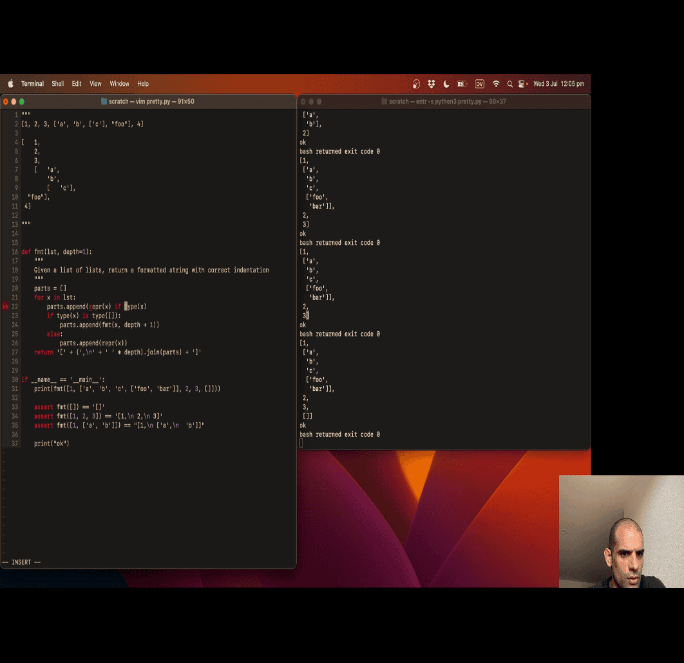


---

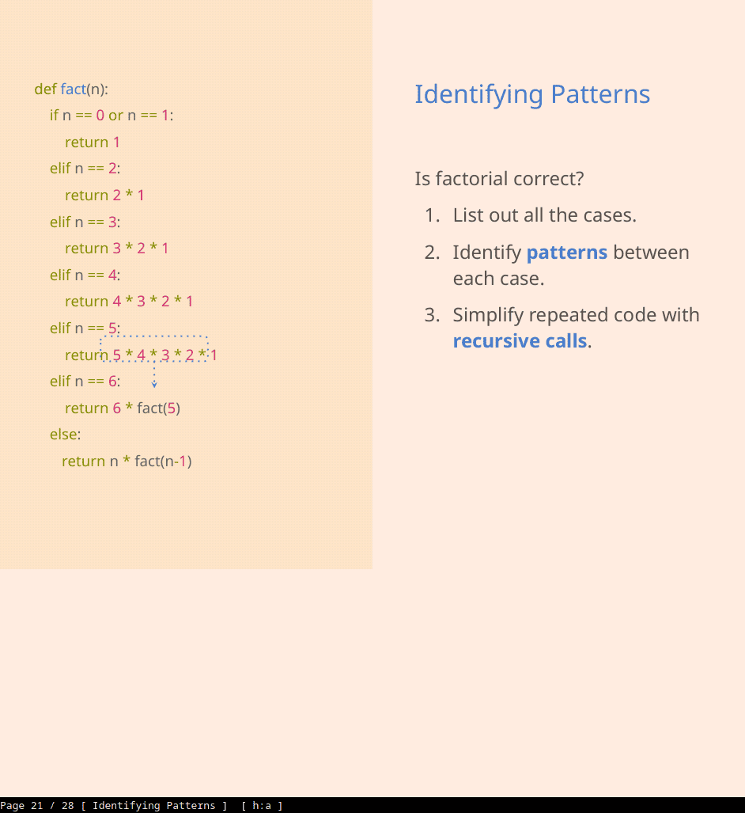

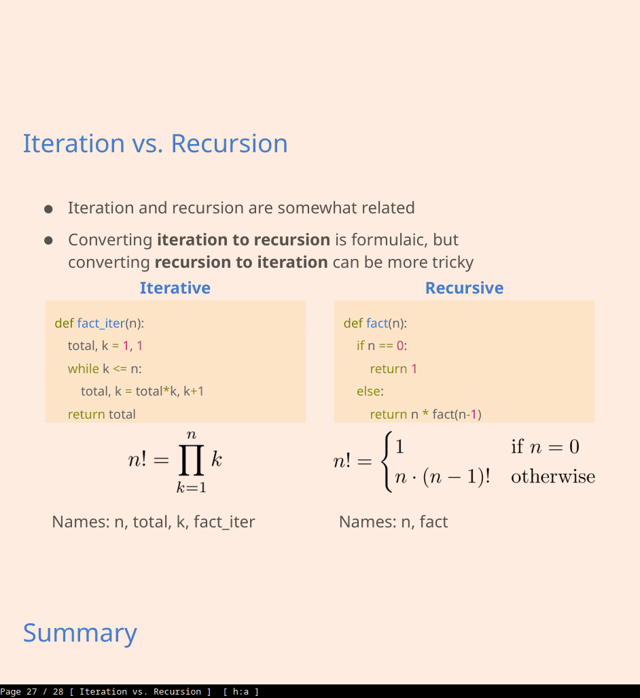

Let’s dive into understanding the recursive calls in your `fib` function and figure out where `f4: n = 2` comes from! I’ll guide you through the process step-by-step, using questions to help you trace the execution and build your intuition for recursion. Since you’re learning, I’ll keep it clear and focused.

### Step 1: Understand the `fib` Function

Here’s the Python code:

```python
def fib(n):
    if n == 0:
        return 0
    elif n == 1:
        return 1
    else:
        return fib(n - 2) + fib(n - 1)

fib(5)
```

This is a recursive implementation of the Fibonacci sequence, where:

- `fib(0) = 0`
- `fib(1) = 1`
- `fib(n) = fib(n-2) + fib(n-1)` for `n > 1`

So:

- `fib(2) = fib(0) + fib(1) = 0 + 1 = 1`
- `fib(3) = fib(1) + fib(2) = 1 + 1 = 2`
- `fib(4) = fib(2) + fib(3) = 1 + 2 = 3`
- `fib(5) = fib(3) + fib(4) = 2 + 3 = 5`

We’re calling `fib(5)`, and we need to trace the recursive calls to see where `f4: n = 2` comes from.

### Step 2: Trace the Call Stack

You’ve provided a snapshot of the call stack:

- `f1: fib(n=5)` (the initial call)
- `f2: fib(n=3)`
- `f3: fib(n=1)` → Returns `1`
- `f4: fib(n=2)`

Let’s trace `fib(5)` to see how we got here and answer your question: is `f4: n = 2` from `fib(n-2)` or `fib(n-1)`?

#### Start with `f1: fib(5)`

- `n = 5`, which is neither `0` nor `1`, so we hit the `else` branch.
- `return fib(5-2) + fib(5-1)` → `fib(3) + fib(4)`.

This creates two recursive calls:

- First call: `fib(3)` (this becomes `f2`).
- Second call: `fib(4)` (we’ll get to this later).

#### Move to `f2: fib(3)`

- `n = 3`, still not `0` or `1`, so `else` branch.
- `return fib(3-2) + fib(3-1)` → `fib(1) + fib(2)`.

Two more recursive calls:

- First call: `fib(1)` (this becomes `f3`).
- Second call: `fib(2)` (this becomes `f4`).

#### Now `f3: fib(1)`

- `n = 1`, matches `elif n == 1`.
- `return 1`.

This matches your snapshot: `f3` returns `1`. Now `f3` is done, and we go back to `f2: fib(3)`.

#### Back to `f2: fib(3)`

- We’ve computed `fib(1) = 1` (from `f3`).
- Next, we compute `fib(2)` (this is `f4`).
- So, `f2` will eventually return `fib(1) + fib(2)`.

#### Now `f4: fib(2)`

- `n = 2`, not `0` or `1`, so `else` branch.
- `return fib(2-2) + fib(2-1)` → `fib(0) + fib(1)`.

### Step 3: Answer the Question

You asked: is `f4: n = 2` from `fib(n-2)` or `fib(n-1)`?

Look at `f2: fib(3)`:

- It called `fib(3-2) = fib(1)` (which was `f3`).
- Then it called `fib(3-1) = fib(2)` (which is `f4`).

So, `f4: n = 2` comes from `fib(n-1)` in the context of `f2`, where `n = 3`. In other words:

- Inside `f2: fib(3)`, the two calls were `fib(3-2)` and `fib(3-1)`.
- `f4` is the second call, `fib(3-1)`, which evaluates to `fib(2)`.

### Step 4: Visualize the Call Tree

Let’s draw the call tree for `fib(5)` to make it clearer:

```
fib(5)  # f1
├── fib(3)  # f2
│   ├── fib(1)  # f3 → 1
│   └── fib(2)  # f4
│       ├── fib(0) → 0
│       └── fib(1) → 1
└── fib(4)
    ├── fib(2)
    │   ├── fib(0) → 0
    │   └── fib(1) → 1
    └── fib(3)  # This is f2 again, already computed
```

- `f1` calls `fib(3)` (`f2`) and `fib(4)`.
- `f2` calls `fib(1)` (`f3`) and `fib(2)` (`f4`).

So, `f4` (`fib(2)`) is the `fib(n-1)` call from `f2` where `n = 3`.

### Step 5: Continue the Trace (Optional)

Let’s finish `f4: fib(2)` to see what it returns:

- `fib(2) = fib(0) + fib(1)`
- `fib(0) = 0`
- `fib(1) = 1`
- So, `fib(2) = 0 + 1 = 1`.

Now back to `f2: fib(3)`:

- `fib(3) = fib(1) + fib(2)`
- `fib(1) = 1` (from `f3`)
- `fib(2) = 1` (from `f4`)
- So, `fib(3) = 1 + 1 = 2`.

Now back to `f1: fib(5)`:

- `fib(5) = fib(3) + fib(4)`
- `fib(3) = 2` (from `f2`)
- We’d need to compute `fib(4)` next, which follows the same pattern.

### Key Takeaway

- `f4: n = 2` comes from `fib(n-1)` in the call `fib(3)`, because `fib(3)` computes `fib(3-2) + fib(3-1)`, and `fib(3-1) = fib(2)` is `f4`.

Does this clear up where `f4` comes from? Want to trace `fib(4)` to see the rest of `fib(5)`? Or do you have another part of the call stack you’re stuck on?

---

Let’s dive into your question about why the code uses `trampoline(lambda: factorial_rec(10))` instead of just calling `factorial_rec(10)` directly. This ties into the concepts your teacher is trying to teach you, like tail recursion, stack safety, and the role of the `trampoline` function. Since you’re learning, I’ll break this down step-by-step with simple explanations, building on our previous discussion about this code. We’ll also focus on why `callable` is used in the `trampoline` function, as you asked earlier.

---

### Step 1: Recap the Code

Let’s quickly review the code to set the stage:

#### The `factorial_rec` Function

```python
def factorial_rec(n, acc=1):
    if n == 1:
        return acc
    return lambda: factorial_rec(n - 1, acc * n)
```

- **What it does**: This is a tail-recursive implementation of factorial, but instead of directly calling itself, it returns a **lambda** (a thunk) that represents the next step of the computation.
- **Example**: `factorial_rec(3)`:
  - `n = 3`, `acc = 1`: Returns `lambda: factorial_rec(2, 3)`
  - `n = 2`, `acc = 3`: Returns `lambda: factorial_rec(1, 6)`
  - `n = 1`, `acc = 6`: Returns `6`

#### The `trampoline` Function

```python
def trampoline(f):
    while callable(f):
        f = f()
    return f
```

- **What it does**: It repeatedly calls the thunk `f` (a function with no arguments) until `f` is no longer a callable (i.e., it’s a final value like an integer).
- **Key role of `callable`**: `callable(f)` checks if `f` is a function that can be called. In Python, `callable()` returns `True` for functions, lambdas, and methods, and `False` for values like integers or strings.

#### The Main Call

```python
print(trampoline(lambda: factorial_rec(10)))
```

- **Output**: `3628800` (which is `10!`).

---

### Step 2: Why Not Just Call `factorial_rec(10)` Directly?

You asked why the code doesn’t just do `print(factorial_rec(10))` instead of wrapping it in `trampoline`. Let’s try it and see what happens.

#### What Happens If You Call `factorial_rec(10)` Directly?

Let’s run `factorial_rec(10)` without the trampoline:

```python
result = factorial_rec(10)
print(result)
```

- **Output**: `<function factorial_rec.<locals>.<lambda> at 0x...>`
- **What’s happening?**:
  - `factorial_rec(10)` returns a lambda: `lambda: factorial_rec(9, 10)`.
  - It doesn’t compute the factorial—it just returns the first thunk in the chain of recursive calls.
  - To get the actual result, you’d need to call the lambda: `result()`, then call the next lambda, and so on, until you reach the final value (`3628800`).

Let’s try calling the lambda manually a few times:

```python
result = factorial_rec(10)  # lambda: factorial_rec(9, 10)
result = result()           # lambda: factorial_rec(8, 90)
result = result()           # lambda: factorial_rec(7, 720)
result = result()           # lambda: factorial_rec(6, 5040)
# ... and so on, 10 times ...
print(result)  # Eventually prints 3628800
```

- **Problem**: You’d need to call the lambda 10 times to get the final result. For `factorial_rec(1000)`, you’d need 1000 calls—impractical and error-prone.

#### Why Does This Happen?

The `factorial_rec` function is designed to be **tail-recursive**, but it uses a special technique:

- Instead of directly calling itself (which would use the call stack), it returns a **thunk** (a lambda with no arguments) that represents the next step of the computation.
- This is a way to avoid stack overflow in languages that don’t optimize tail recursion (like Python). In a language with tail-call optimization (TCO), like Scheme, the recursive calls would be optimized to not grow the stack. But Python doesn’t have TCO, so `factorial_rec` avoids direct recursion by returning thunks.

If you called `factorial_rec(10)` directly and it used normal recursion (without thunks), it would look like this:

```python
def factorial_rec_no_thunk(n, acc=1):
    if n == 1:
        return acc
    return factorial_rec_no_thunk(n - 1, acc * n)

print(factorial_rec_no_thunk(10))  # Works, outputs 3628800
```

- **But there’s a problem**: For large `n` (e.g., `factorial_rec_no_thunk(1000)`), Python’s call stack would grow with each recursive call, leading to a `RecursionError: maximum recursion depth exceeded`.

#### Why Use Thunks?

By returning a lambda instead of recursing directly, `factorial_rec` avoids growing the call stack. But this means the computation doesn’t happen until you call the lambda—and you need to keep calling the returned lambdas until you get the final result. That’s where `trampoline` comes in.

---

### Step 3: Why Use `trampoline`?

The `trampoline` function automates the process of calling these thunks:

```python
def trampoline(f):
    while callable(f):
        f = f()
    return f
```

- **How it works**:
  - `f` starts as `lambda: factorial_rec(10)`.
  - `callable(f)` is `True` (it’s a lambda), so `f = f()` → `factorial_rec(10)`.
  - `factorial_rec(10)` returns `lambda: factorial_rec(9, 10)`.
  - `callable(f)` is `True`, so `f = f()` → `factorial_rec(9, 10)`.
  - This continues until `factorial_rec(1, ...)` returns a number (`3628800`).
  - `callable(3628800)` is `False`, so `trampoline` returns `3628800`.

#### Why `callable`?

- `callable(f)` is the key to knowing when to stop:
  - If `f` is a function (like a lambda), `callable(f)` is `True`, and `trampoline` keeps going.
  - If `f` is a value (like an integer), `callable(f)` is `False`, and `trampoline` returns the value.
- Without `callable`, `trampoline` wouldn’t know when the computation is complete—it would try to call a non-callable value (e.g., `3628800()`), which would raise an error.

#### Why `lambda: factorial_rec(10)`?

The `lambda: factorial_rec(10)` in the main call is necessary because `trampoline` expects a thunk (a function with no arguments). If you passed `factorial_rec(10)` directly:

```python
print(trampoline(factorial_rec(10)))
```

- `factorial_rec(10)` returns a lambda, but `trampoline` would call it once and stop if the next step wasn’t wrapped in a lambda. The initial `lambda:` ensures `trampoline` starts with a callable.

---

### Step 4: What Is Your Teacher Trying to Teach You?

Your teacher is introducing several advanced concepts through this example, and the use of `trampoline` and `callable` ties them together. Let’s break it down:

#### 1. **Tail Recursion and Stack Safety**

- **Concept**: `factorial_rec` is written in a tail-recursive style:
  - The recursive call is the last thing the function does (it returns `lambda: factorial_rec(...)`).
  - Normally, recursion in Python would grow the call stack, leading to a `RecursionError` for large inputs (e.g., `factorial_rec(1000)` without thunks).
- **Lesson**: By returning thunks, `factorial_rec` avoids growing the stack. The `trampoline` function then “unwraps” these thunks in a loop, making the recursion stack-safe.
- **Why `callable`?**: It’s the mechanism to detect whether there’s more computation to do (i.e., another thunk to call) or if we’ve reached the final result.

#### 2. **Functional Programming Techniques**

- **Concept**: The use of thunks (lambdas) and a trampoline is a functional programming technique to handle recursion in a language without tail-call optimization (TCO).
  - In functional languages like Scheme (which you’ve explored with your `cascade` function), tail recursion is optimized by the compiler.
  - Python doesn’t have TCO, so the trampoline pattern simulates it.
- **Lesson**: Your teacher is showing you how to write recursive algorithms in a way that’s safe for languages like Python, using functional concepts like thunks and higher-order functions.
- **Why `callable`?**: It’s a way to work with higher-order functions (functions that return other functions), which is common in functional programming.

#### 3. **Understanding `callable` and Python’s Type System**

- **Concept**: `callable()` is a built-in Python function that checks if an object can be called like a function.
  - Examples:
    ```python
    def my_func(): pass
    print(callable(my_func))  # True
    print(callable(lambda: None))  # True
    print(callable(42))  # False
    print(callable("hello"))  # False
    ```
- **Lesson**: Your teacher is teaching you how to use `callable` to inspect objects at runtime, which is a form of **metaprogramming** (as we discussed earlier). It’s a way to write code that adapts to the type of data it’s working with.
- **Why `callable` in `trampoline`?**: It’s the key to knowing when the recursive computation is done—when `f` is no longer a function (thunk) but a final value.

#### 4. **Separation of Concerns**

- **Concept**: The code separates the recursive logic (`factorial_rec`) from the mechanism that executes it (`trampoline`).
- **Lesson**: This is a design pattern—separating the “what” (the factorial computation) from the “how” (executing the recursion safely). It makes the code more modular and reusable.
- **Why `trampoline`?**: Without it, you’d need to manually call each thunk, or rewrite `factorial_rec` to use a loop (like the `factorial` function). The trampoline abstracts away the execution, letting you focus on the recursive logic.

#### 5. **Comparing Iterative and Recursive Approaches**

- **Concept**: The code includes both `factorial` (iterative) and `factorial_rec` (recursive with trampolining).
- **Lesson**: Your teacher might be showing you that the same problem (computing a factorial) can be solved in different ways:
  - Iterative (`factorial`): Simple, stack-safe, but less “functional.”
  - Recursive with trampolining (`factorial_rec`): More functional, still stack-safe, but more complex.
- **Why both?**: To teach you the trade-offs between different programming styles.

---

### Step 5: Why Not Just Use `factorial`?

You might wonder: if `factorial` (the iterative version) is simpler and stack-safe, why bother with `factorial_rec` and `trampoline`? Good question! Here’s why:

- **Learning Functional Programming**: The `factorial_rec` and `trampoline` approach introduces functional programming concepts (tail recursion, thunks, higher-order functions) that are common in languages like Scheme, Haskell, or even JavaScript.
- **General Technique**: Trampolining isn’t just for factorials—it’s a general way to make any tail-recursive function stack-safe in Python. For example, you could use the same `trampoline` for a recursive tree traversal or a complex algorithm.
- **Conceptual Understanding**: Understanding how recursion works under the hood (and how to make it safe) is a valuable skill, especially if you work in languages with TCO or need to optimize recursive algorithms.

---

### Step 6: Try It Out

Let’s experiment to solidify your understanding. What if we try a different recursive function with the same `trampoline`?

#### Example: Sum of Numbers Recursively

```python
def sum_rec(n, acc=0):
    if n == 0:
        return acc
    return lambda: sum_rec(n - 1, acc + n)

print(trampoline(lambda: sum_rec(5)))  # Should compute 5 + 4 + 3 + 2 + 1 = 15
```

- **Trace**:
  - `sum_rec(5, 0)` → `lambda: sum_rec(4, 5)`
  - `sum_rec(4, 5)` → `lambda: sum_rec(3, 9)`
  - `sum_rec(3, 9)` → `lambda: sum_rec(2, 12)`
  - `sum_rec(2, 12)` → `lambda: sum_rec(1, 14)`
  - `sum_rec(1, 14)` → `lambda: sum_rec(0, 15)`
  - `sum_rec(0, 15)` → `15`
- **Output**: `15`

The `trampoline` function works for any tail-recursive function that returns thunks, showing its generality.

---

### Step 7: Final Thoughts

- **Why not `factorial_rec(10)` directly?** Because it returns a thunk (a lambda), not the final result. You’d need to manually call the thunk multiple times to get the answer, which is impractical. `trampoline` automates this process.
- **Why `callable`?** It’s the mechanism to determine whether there’s more computation to do (another thunk to call) or if we’ve reached the final result.
- **What your teacher is teaching**:
  1. Tail recursion and how to make it stack-safe in Python using thunks and trampolining.
  2. Functional programming concepts like higher-order functions and thunks.
  3. The use of `callable` for runtime type checking (a form of metaprogramming).
  4. Separation of concerns (recursive logic vs. execution mechanism).
  5. Comparing iterative and recursive approaches to the same problem.

Does this clarify why `trampoline` is needed and what your teacher is trying to teach? Want to try writing another recursive function (like a recursive Fibonacci) that uses the trampoline? Let me know!

---

Your teacher is trying to teach you about **tail recursion elimination** and **trampolining**, which are important concepts in **functional programming**, **compilers**, and **low-level programming (like assembly and OS development)**.

### 🔍 **What Are You Learning?**

1. **Recursive function calls consume stack space**
   - The `fib` function is implemented recursively using **lambda** (anonymous function).
   - Without optimization, recursive calls create **new stack frames**, which can lead to **stack overflow** if `n` is large.

2. **Tail recursion and the stack problem**
   - In a normal recursive function, each call adds a new frame to the call stack.
   - However, **tail recursion** (when the recursive call is the last operation) can, in theory, be optimized by the compiler/interpreter to avoid growing the stack.

3. **Trampolining eliminates deep recursion using iteration**
   - The `trampoline` function **continuously calls** the function until it returns a concrete value (not another callable).
   - This converts the recursive `fib` into an **iterative process** without consuming stack space.

### 🔥 **How Is This Related to Assembly & OS?**

- In **assembly language**, there are no automatic function calls or stack management (you handle them manually).
- In **operating systems**, **context switching, stack management, and recursion handling** are key concepts.
- Trampolining is an example of **continuation-passing style (CPS)**, which is used in **functional languages**, **compilers**, and **low-level system code** to avoid deep recursion.

### 🛠 **Breaking It Down Step-by-Step**

```python
def trampoline(f):
    while callable(f):  # If f is still a function (lambda), keep calling it
        f = f()
    return f  # Once f is a value, return it
```

- This keeps evaluating `fib(n)` **iteratively** instead of relying on deep recursive calls.

```python
def fib(n, a=0, b=1):
    if n == 0:
        return a  # Base case: return the computed Fibonacci number
    return lambda: fib(n - 1, b, a + b)  # Delay the recursion using lambda
```

- Instead of returning a number immediately, it **returns a function** (lazy evaluation).
- The function `trampoline` will repeatedly call it, effectively simulating a loop.

### 🏆 **Why Is This Useful?**

- It **avoids stack overflow** for large `n`, since `trampoline` turns recursion into iteration.
- Similar **concepts are used in OS design** to optimize function calls and manage process execution.
- **Tail-call optimization (TCO)** (not supported in Python, but common in languages like Scheme, Lisp, and functional programming in general).

### ✅ **Final Takeaway**

Your teacher is preparing you for **low-level stack management** and **functional programming concepts** that will be useful when working with **assembly, operating systems, and compilers**.

Do you want to see how this could be implemented in **assembly language**? 🚀

```python
def trampoline(f):
    # TODO
    while callable(f):
        f = f()
    return f


def factorial_rec(n, acc=1):
    if n == 1:
        return acc

    return factorial_rec(n - 1, acc * n)

for n in range(10):
    assert fib_iter(n) == trampoline(lambda: fib(n))

```

### **Tail Call Optimization (TCO) - Short Explanation**

**Tail Call Optimization (TCO)** is a technique where a function call is the **last operation** in a function, allowing the compiler/interpreter to **reuse the current stack frame** instead of creating a new one. This **prevents stack overflow** and improves efficiency.

### **Example (Without TCO - Normal Recursion)**

Each recursive call **adds a new stack frame**:

```python
def fact(n):
    if n == 1:
        return 1
    return n * fact(n - 1)  # New stack frame for each call

print(fact(5))  # Stack grows: fact(5) → fact(4) → fact(3) → ...
```

📌 **Problem:** Uses extra stack space → **Stack overflow for large `n`**

---

### **Example (With Tail Recursion - Eligible for TCO)**

The recursive call is the **last operation**, so the stack frame can be **reused**:

```python
def fact_tail(n, acc=1):
    if n == 1:
        return acc
    return fact_tail(n - 1, n * acc)  # No extra computation after the call
```

📌 **Benefit:** If TCO is supported, it runs in **constant stack space (O(1))**, avoiding stack growth.

---

### **Key Takeaways**

✅ **TCO eliminates extra stack frames**  
✅ **Improves performance for deep recursion**  
❌ **Python does NOT support TCO**, but languages like **Scheme, JavaScript (ES6+), and functional languages (Lisp, Haskell)** do.

## Would you like a **deeper explanation with assembly/machine-level details**? 🚀

No, **Tail Call Optimization (TCO) is NOT caching**—it’s a completely different concept.

### **Key Differences:**

| Feature              | Tail Call Optimization (TCO)                    | Caching (Memoization)                                     |
| -------------------- | ----------------------------------------------- | --------------------------------------------------------- |
| **Purpose**          | Saves stack space by reusing frames             | Speeds up computation by storing results                  |
| **How it works**     | Eliminates new stack frames in recursion        | Stores previously computed results to avoid recomputation |
| **Where it helps**   | Deep recursion (avoids stack overflow)          | Reducing redundant calculations in recursive functions    |
| **Example Use Case** | Factorial, Fibonacci (iterative-like recursion) | Fibonacci, dynamic programming problems                   |

---

### **Example of TCO (Not Caching)**

**Without TCO (Stack grows)**

```python
def fact(n):
    if n == 1:
        return 1
    return n * fact(n - 1)  # New stack frame each time
```

**With TCO (Same stack frame reused)**

```python
def fact_tail(n, acc=1):
    if n == 1:
        return acc
    return fact_tail(n - 1, n * acc)  # Tail call (no extra computation after call)
```

✅ If the language supports TCO, it **does NOT store previous results**—it just prevents stack growth.

---

### **Example of Caching (Memoization)**

Here, results are **stored and reused** instead of recomputing.

```python
cache = {}

def fib(n):
    if n in cache:
        return cache[n]  # Use stored result
    if n <= 1:
        return n
    cache[n] = fib(n - 1) + fib(n - 2)  # Save result for later
    return cache[n]
```

✅ **Speeds up computation**, but still uses recursion with multiple calls.

---

### **Final Takeaway:**

- **TCO** 🏆 = **Saves stack space** by eliminating unnecessary stack frames (not storing results).
- **Caching (Memoization)** 🚀 = **Saves computation time** by storing and reusing results.

They may **look similar** when adding an extra variable, but their **goal and mechanism are different**.

Would you like an example where TCO fails but caching works? 🚀

---

# high order function review:

Here’s a simple and clear markdown note to teach you the concept of **higher-order functions** in Python, based on the material from _Composing Programs_ (Section 1.6). I’ll break it down step-by-step with examples to make it easy to understand, assuming you’re new to this idea but familiar with basic Python functions.

---

# Higher-Order Functions in Python: Made Simple

**Higher-order functions** are functions that can:

- Take other functions as arguments, or
- Return functions as results.

They’re a powerful way to make your code more flexible and reusable by letting you work with functions like they’re building blocks. Let’s explore this idea step-by-step!

---

## 1. Why Higher-Order Functions?

Imagine you write functions to do similar tasks, like summing numbers in different ways:

```python
def sum_naturals(n):  # Sum of 1 + 2 + 3 + ...
    total, k = 0, 1
    while k <= n:
        total, k = total + k, k + 1
    return total

def sum_cubes(n):  # Sum of 1³ + 2³ + 3³ + ...
    total, k = 0, 1
    while k <= n:
        total, k = total + k * k * k, k + 1
    return total
```

These functions are almost the same except for the part that changes (`k` vs. `k * k * k`). Rewriting the same loop every time is boring and wasteful. Higher-order functions let us write **one general function** and swap out the changing part.

---

## 2. Functions as Arguments

Let’s make a general `summation` function that takes:

- `n`: the upper limit,
- `term`: a function that says what to add each time.

Here’s the code:

```python
def summation(n, term):
    total, k = 0, 1
    while k <= n:
        total, k = total + term(k), k + 1
    return total
```

Now, we can use it for different sums by passing different `term` functions:

- **Sum of naturals** (1 + 2 + 3 + ...):

  ```python
  def identity(x):
      return x
  print(summation(3, identity))  # 1 + 2 + 3 = 6
  ```

- **Sum of cubes** (1³ + 2³ + 3³ + ...):

  ```python
  def cube(x):
      return x * x * x
  print(summation(3, cube))  # 1 + 8 + 27 = 36
  ```

- **Sum for pi** (a series that approximates π):
  ```python
  def pi_term(x):
      return 8 / ((4 * x - 3) * (4 * x - 1))
  print(summation(100, pi_term))  # Approx. 3.14...
  ```

**Key Point**: We only wrote the loop once! By passing a function (`term`) as an argument, we reused the same code for different jobs.

---

## 3. Functions as General Tools

Higher-order functions can describe big ideas, not just specific tasks. For example, here’s an `improve` function that keeps guessing until it finds a good answer:

```python
def improve(update, close, guess=1):
    while not close(guess):
        guess = update(guess)
    return guess
```

- `update`: A function to improve the guess.
- `close`: A function to check if the guess is good enough.

Let’s use it to find the **golden ratio** (≈ 1.618), where `guess² ≈ guess + 1`:

```python
def golden_update(guess):
    return 1 / guess + 1

def square_close_to_successor(guess):
    return abs(guess * guess - (guess + 1)) < 0.001  # Close enough?

print(improve(golden_update, square_close_to_successor))  # ≈ 1.618
```

**Key Point**: `improve` doesn’t know it’s finding the golden ratio—it just follows the rules we give it with `update` and `close`.

---

## 4. Functions Inside Functions

Sometimes, we define helper functions inside another function. This keeps things tidy and lets the helpers use the outer function’s variables. For example, to find the square root of a number:

```python
def sqrt(a):
    def sqrt_update(x):
        return (x + a / x) / 2  # Average of x and a/x
    def sqrt_close(x):
        return abs(x * x - a) < 0.001  # Is x² close to a?
    return improve(sqrt_update, sqrt_close)

print(sqrt(16))  # 4.0
```

- `sqrt_update` and `sqrt_close` live inside `sqrt` and can use `a`.
- They’re only available inside `sqrt`, not outside.

**Key Point**: Nested functions “remember” the variables (like `a`) from where they were defined.

---

## 5. Returning Functions

Functions can return other functions. For example, `compose1` combines two functions into one:

```python
def compose1(f, g):
    def h(x):
        return f(g(x))
    return h

def square(x):
    return x * x
def add_one(x):
    return x + 1

square_then_add_one = compose1(add_one, square)
print(square_then_add_one(3))  # (3²) + 1 = 10
```

**Key Point**: `compose1` builds a new function that applies `g` first, then `f`.

---

## 6. Quick Functions with Lambda

A `lambda` expression makes a small, unnamed function in one line:

```python
# Instead of:
def square(x):
    return x * x

# You can write:
square = lambda x: x * x
print(square(3))  # 9
```

Use it with `summation`:

```python
print(summation(3, lambda x: x * x))  # 1 + 4 + 9 = 14
```

**Key Point**: Lambdas are handy for short, simple functions you don’t want to name.

---

## 7. Decorators: Fancy Function Wrappers

A **decorator** adds extra behavior to a function. Here’s a `trace` decorator that prints what the function does:

```python
def trace(fn):
    def wrapped(x):
        print(f"-> {fn.__name__}({x})")
        return fn(x)
    return wrapped

@trace
def triple(x):
    return 3 * x

triple(12)  # Prints: -> triple(12), then 36
```

**Key Point**: `@trace` wraps `triple` with extra printing without changing its code.

---

## 8. Putting It All Together

Higher-order functions let you:

- Pass functions as arguments (like `summation`).
- Return functions (like `compose1`).
- Use nested functions (like `sqrt`).
- Add behavior with decorators (like `trace`).

They make your code shorter, reusable, and more powerful. For example, here’s Newton’s method to find roots (like square roots):

```python
def newton_update(f, df):
    def update(x):
        return x - f(x) / df(x)
    return update

def find_zero(f, df):
    def near_zero(x):
        return abs(f(x)) < 0.001
    return improve(newton_update(f, df), near_zero)

def square_root(a):
    return find_zero(lambda x: x * x - a, lambda x: 2 * x)

print(square_root(64))  # 8.0
```

---

## 9. Why This Matters

- **Abstraction**: You can name big ideas (like “summation” or “improvement”) and use them anywhere.
- **Flexibility**: Swap functions in and out to solve different problems with the same code.
- **Power**: Python treats functions as “first-class” objects—you can pass them, return them, and store them like numbers or strings.

---

## 10. Try It Yourself!

1. Write a `summation` call to sum the squares from 1 to 5 (answer: 55).
2. Make a decorator that doubles the result of a function.
3. Use `compose1` to create a function that adds 2, then squares the result.

---

That’s it! Higher-order functions might feel tricky at first, but they’re just about using functions as tools to build smarter, cleaner code. Let me know if you want more examples!

---

# Recursion review

A **recursive function** is a function that calls itself to solve a problem by breaking it into smaller, simpler versions of the same problem. Unlike loops, which repeat code iteratively, recursion uses repeated function calls. This might sound tricky at first, but with examples, it becomes easier to grasp! Let’s dive in with a problem from _Composing Programs_: summing the digits of a number.

---

## Example Problem: Summing Digits

Suppose we want to write a function that sums the digits of a positive integer, like `18117`, where the result should be `1 + 8 + 1 + 1 + 7 = 18`. How do we solve this recursively?

In Python, we can use the modulo operator (`%`) and integer division (`//`) to break a number apart:

- `18117 % 10` gives `7` (the last digit).
- `18117 // 10` gives `1811` (all but the last digit).

The idea is: the sum of the digits of `18117` is the last digit (`7`) plus the sum of the digits of `1811`. This is a smaller version of the same problem! Here’s the recursive function:

```python
def sum_digits(n):
    """Return the sum of the digits of positive integer n."""
    if n < 10:  # Base case: a single digit
        return n
    else:       # Recursive case: break into smaller parts
        all_but_last = n // 10  # 1811
        last = n % 10           # 7
        return sum_digits(all_but_last) + last  # Recurse on 1811, add 7
```

### How It Works

Let’s trace `sum_digits(18117)`:

1. `n = 18117`: Not less than 10, so `all_but_last = 1811`, `last = 7`. Returns `sum_digits(1811) + 7`.
2. `n = 1811`: Not less than 10, so `all_but_last = 181`, `last = 1`. Returns `sum_digits(181) + 1`.
3. `n = 181`: Not less than 10, so `all_but_last = 18`, `last = 1`. Returns `sum_digits(18) + 1`.
4. `n = 18`: Not less than 10, so `all_but_last = 1`, `last = 8`. Returns `sum_digits(1) + 8`.
5. `n = 1`: Less than 10, so returns `1`.

Now, the calls “unwind”:

- `sum_digits(1)` returns `1`.
- `sum_digits(18)` returns `1 + 8 = 9`.
- `sum_digits(181)` returns `9 + 1 = 10`.
- `sum_digits(1811)` returns `10 + 1 = 11`.
- `sum_digits(18117)` returns `11 + 7 = 18`.

The result is `18`, which is correct!

---

## Anatomy of a Recursive Function

Recursive functions typically have two key parts:

- **Base case**: The simplest scenario where no further recursion is needed. For `sum_digits`, it’s when `n < 10` (a single digit).
- **Recursive case**: Where the function calls itself with a simpler input. For `sum_digits`, it’s breaking `n` into `all_but_last` and `last`, then recursing on `all_but_last`.

The magic of recursion lies in simplifying the problem with each call until the base case is reached.

---

## The Environment Model: How Python Handles Recursion

To understand _why_ this works, let’s peek under the hood using Python’s **environment model**. When `sum_digits(738)` is called:

1. A frame is created with `n = 738`.
   - `738 < 10` is false, so `all_but_last = 73`, `last = 8`.
   - Calls `sum_digits(73)` and waits for its result.
2. A new frame is created with `n = 73`.
   - `73 < 10` is false, so `all_but_last = 7`, `last = 3`.
   - Calls `sum_digits(7)` and waits.
3. A new frame is created with `n = 7`.
   - `7 < 10` is true, so returns `7`.
4. Back in the `n = 73` frame, `sum_digits(7)` returns `7`, so `7 + 3 = 10` is returned.
5. Back in the `n = 738` frame, `sum_digits(73)` returns `10`, so `10 + 8 = 18` is returned.

Each call creates a new frame, and the recursion “unwinds” as return values flow back up. This works because each recursive call uses a smaller number, eventually hitting the base case.

---

## Why Recursion Works

Even though `sum_digits` calls itself, it’s not an infinite loop because:

- Each call simplifies the problem (e.g., `738` to `73` to `7`).
- The base case stops the recursion.

This pattern—breaking a problem into smaller, identical subproblems—is the heart of recursion.

---

## Testing It Out

Here are some examples:

- `sum_digits(9)` returns `9` (base case).
- `sum_digits(18117)` returns `18`.
- `sum_digits(9437184)` returns `36` (9 + 4 + 3 + 7 + 1 + 8 + 4).
- `sum_digits(11408855402054064613470328848384)` returns `126`.

Try it yourself with any positive integer!

---

## Key Takeaways

- **Recursion** is a natural way to solve problems that can be divided into smaller, similar subproblems.
- A recursive function needs a **base case** to stop and a **recursive case** to keep breaking the problem down.
- Python handles recursion by creating new frames for each call, tracking the state until the base case is reached.

Recursion might feel like a leap of faith at first, but with practice, it becomes a powerful tool for elegant, concise code!

---

This explanation mirrors the style and content of Section 1.7 from _Composing Programs_, focusing on the `sum_digits` example while introducing the broader concept of recursive functions. Let me know if you’d like more examples or deeper clarification!

---

Refactor life refactor a convoluted object-oriented Game of Life implementation (1:23:50)

delete what is'nt really necessary from the ai generated code

---

learning section:

repl,

import itertools as it
x = it.some feacture of that module
and then test it yourself

dir(x)
help(x.yyy)

repl and test it it out

- usually human really learn thing when the thing isn't as they expected

- break your inception and evolve

1. what do you expect to see here before getting feedback (think before)
2.

- dis module is python library that allow you study in lower level

e.g. cursor -> try altering number, negative number, size, change part of the code and test it out

entr -s, run clear and date before to make it more clear to see

for c, man 3 thing that you want to search

e.g using gcc and nm to leanring c at the same time

- may be c3 here (cmu course)

> experimental learning -> (if the feedback loop is fast)

c > compiler is faster than rust so far

- if there is a lot of compile file, then use make or cmake
- make can take care of you

maybe debug and print is also a skill related to this fast feedback

- entr
- nm
- strace

- man 3 to look out what library is rand in using

- qman defitnitely help in this case

- lsof

- linux reference

---

Example: exploring node.js streams with strace

- strace -> linux command to look out what is going on (linux command)

- strace -> man page it , learn from man page, man 2 or man 7

- man socket and man bind is better than google

- use ps aux and grep that server.js and take a look of that pid info, dig it out

- ls -al /proc/pid/fd (file descriptor)
  - find fd mean in strace
    man socket() if you find strace
    man 2 socket
    man 2 bind , :: -> all , (1337) -> port
    man 2 listen
    qman for more info in man

- predict before test(think)
- plan before code(think, start from smaller problem)

- pure back the layout , read the source code from python (abstraction)
- start understanding c , interpretor work

---

python is stack based
bytes codes -> by way of loop , sequence of code

python -> c ceval.c
core of execution file in python

what is gonna happen in the code

`for (;;)` repeated loop
Switch

executor case py source code

---

- python bytecoda-interpreter

---

- vec object

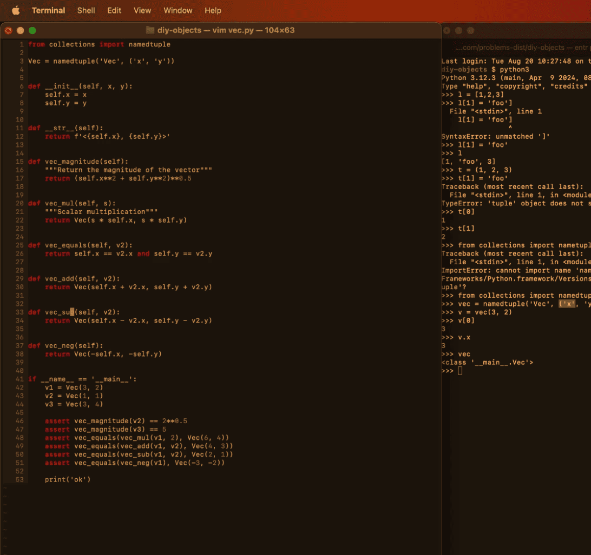

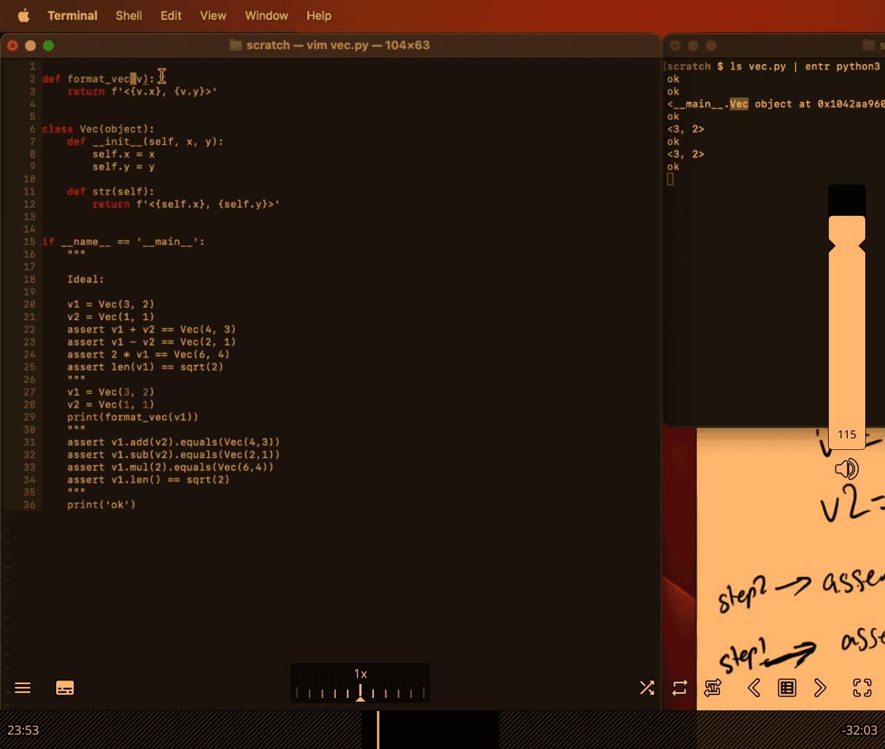

OOP is overated at somepoint, you can just use fuction name or C struct to make
it

- OOP is useful for making gui like usage like repeatly direction usage

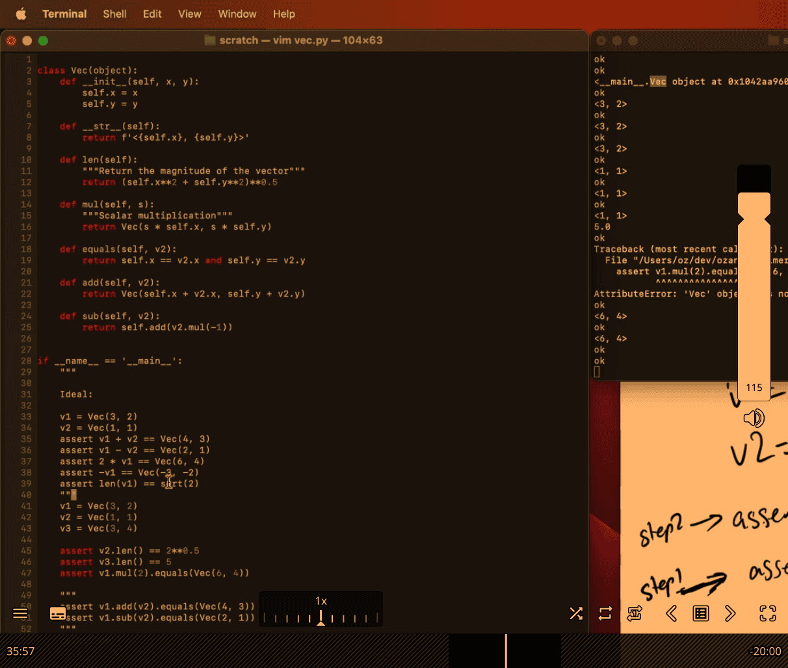

> tips , you can dir(3) -> variable to see which **str** you can use , help((3).**str**) etc

- help((3).**float**)

Your teacher is using the `Vec` class to teach you about **Object-Oriented Programming (OOP)** in Python, specifically focusing on how to create and work with **custom objects** (classes) to represent real-world concepts. In this case, the `Vec` class represents a 2D vector, which is a mathematical concept with x and y coordinates. Let’s break down what your teacher is likely trying to teach you and explain it in a simple way.

---

### What Your Teacher Is Trying to Teach

Your teacher is introducing you to key OOP concepts through the `Vec` class, including:

1. **Classes and Objects**: How to define a blueprint (class) for an object and create instances of it.
2. **Attributes**: How objects can store data (like `x` and `y` coordinates).
3. **Methods**: How objects can have behaviors (like calculating the magnitude or performing operations).
4. **Special Methods (Magic Methods)**: How to customize how objects behave with operators like `+`, `-`, `*`, or when printed.
5. **Operator Overloading**: How to define what happens when you use operators (like `+` or `==`) on your objects.
6. **Encapsulation**: Bundling data and methods that work on that data into a single unit (the `Vec` class).

The `Vec` class is a great example because it’s simple but shows how these concepts come together to model something practical (a 2D vector).

---

### Explanation of the Code in Simple Terms

Let’s go through the code step by step to understand what’s happening and why it’s useful.

#### 1. **Defining the Class**

```python
class Vec(object):
    def __init__(self, x, y):
        self.x = x
        self.y = y
```

- A **class** is like a blueprint for creating objects. Here, `Vec` is a blueprint for a 2D vector.
- The `__init__` method is a special method called when you create a new vector. It sets up the vector’s `x` and `y` coordinates.
- `self` refers to the object being created. `self.x` and `self.y` store the vector’s coordinates.
- Example: `v1 = Vec(3, 2)` creates a vector with `x = 3` and `y = 2`.

**What this teaches**: How to create a custom object and give it properties (data).

---

#### 2. **Printing the Object**

```python
def __str__(self):
    return f'<{self.x}, {self.y}>'
```

- The `__str__` method defines how the object looks when you print it.
- When you do `print(v1)`, it shows `<3, 2>` instead of something generic like `<__main__.Vec object>`.
- This makes the object easier to understand when you print it.

**What this teaches**: How to control how your object is displayed (a special method).

---

#### 3. **Calculating the Magnitude**

```python
def magnitude(self):
    """Return the magnitude of the vector"""
    return (self.x**2 + self.y**2)**0.5
```

- This is a regular method that calculates the vector’s magnitude (its length) using the Pythagorean theorem: \(\sqrt{x^2 + y^2}\).
- Example: For `v2 = Vec(1, 1)`, `v2.magnitude()` returns \(\sqrt{1^2 + 1^2} = \sqrt{2}\).
- The `assert v2.magnitude() == 2**0.5` in the tests confirms this works.

**What this teaches**: How to add behaviors (methods) to your object to do useful calculations.

---

#### 4. **Scalar Multiplication**

```python
def __mul__(self, s):
    """Scalar multiplication"""
    return Vec(s * self.x, s * self.y)
```

- The `__mul__` method defines what happens when you multiply a vector by a number (scalar) using `*`.
- Example: `v1 * 2` multiplies `v1`’s coordinates by 2, so `Vec(3, 2) * 2` gives `Vec(6, 4)`.
- The `assert v1 * 2 == Vec(6, 4)` confirms this.

**What this teaches**: How to customize the `*` operator for your object (operator overloading).

---

#### 5. **Comparing Vectors**

```python
def __eq__(self, v2):
    return self.x == v2.x and self.y == v2.y
```

- The `__eq__` method defines what happens when you check if two vectors are equal using `==`.
- Two vectors are equal if their `x` and `y` coordinates are the same.
- Example: `Vec(3, 2) == Vec(3, 2)` returns `True`.

**What this teaches**: How to define equality for your objects.

---

#### 6. **Adding and Subtracting Vectors**

```python
def __add__(self, v2):
    return Vec(self.x + v2.x, self.y + v2.y)

def __sub__(self, v2):
    return Vec(self.x - v2.x, self.y - v2.y)
```

- The `__add__` method defines vector addition with `+`. It adds the `x` and `y` coordinates of two vectors.
  - Example: `v1 + v2` for `v1 = Vec(3, 2)` and `v2 = Vec(1, 1)` gives `Vec(4, 3)`.
- The `__sub__` method defines vector subtraction with `-`. It subtracts the coordinates.
  - Example: `v1 - v2` gives `Vec(2, 1)`.

**What this teaches**: How to overload the `+` and `-` operators to work with your objects.

---

#### 7. **Negating a Vector**

```python
def __neg__(self):
    return Vec(-self.x, -self.y)
```

- The `__neg__` method defines what happens when you use the `-` operator on a single vector (like `-v1`).
- It flips the signs of the coordinates.
- Example: `-v1` for `v1 = Vec(3, 2)` gives `Vec(-3, -2)`.

**What this teaches**: Another example of operator overloading for unary operators.

---

#### 8. **Testing the Class**

```python
if __name__ == '__main__':
    v1 = Vec(3, 2)
    v2 = Vec(1, 1)
    v3 = Vec(3, 4)

    assert v2.magnitude() == 2**0.5
    assert v3.magnitude() == 5
    assert v1 * 2 == Vec(6, 4)
    assert v1 + v2 == Vec(4, 3)
    assert v1 - v2 == Vec(2, 1)
    assert -v1 == Vec(-3, -2)

    print('ok')
```

- This part creates some vectors and tests that all the methods work as expected using `assert` statements.
- If all tests pass, it prints `'ok'`. If any fail, an error is raised.
- This ensures the class behaves correctly.

**What this teaches**: How to test your code to make sure your class works as intended.

---

### Why Is This Useful?

Your teacher chose a 2D vector because it’s a simple but real-world example of how objects can represent something meaningful. Vectors are used in physics, graphics, and games to represent positions, velocities, or forces. By creating a `Vec` class, you learn how to:

- Bundle data (`x`, `y`) and behaviors (like `magnitude`, addition) into one object.
- Make your objects act like built-in Python types (using `+`, `*`, etc.).
- Write clean, reusable code that’s easy to understand and extend.

---

### Key OOP Concepts in This Example

Here’s how the code ties to OOP principles:

1. **Encapsulation**: The `Vec` class keeps the `x` and `y` coordinates and related methods together.
2. **Abstraction**: You can use the `Vec` class without worrying about how `magnitude` or addition is implemented.
3. **Custom Behavior**: Special methods (`__add__`, `__mul__`, etc.) let you define how your objects work with Python operators.
4. **Reusability**: You can create as many `Vec` objects as you want, and they all share the same behaviors.

---

### Try It Yourself

To solidify your understanding, try these exercises:

1. Create a new vector `v4 = Vec(0, 0)` and test what happens when you add it to `v1`.
2. Add a new method `dot_product(self, v2)` to calculate the dot product of two vectors (\(x_1 \cdot x_2 + y_1 \cdot y_2\)).
3. Modify the class to support division by a scalar (e.g., `v1 / 2`).

Example for the dot product:

```python
def dot_product(self, v2):
    return self.x * v2.x + self.y * v2.y
```

Then test it:

```python
v1 = Vec(3, 2)
v2 = Vec(1, 1)
print(v1.dot_product(v2))  # Should print 5 (3*1 + 2*1)
```

---

### Final Note

Your teacher is helping you learn how to think like a programmer by modeling a real-world concept (vectors) with code. The `Vec` class shows how Python’s OOP features let you create objects that are intuitive and powerful. Keep practicing by experimenting with the class, and you’ll get more comfortable with these ideas! If you have specific questions about the code or OOP, let me know.

---

- dir(object)

it seems you can't simply == your class to number

funny in python, seem can't len(your class) == to some nb, that mean you can't
def **len** , but rather def len only

e.g. v2.len() rather len(v2)

This is the old-style formatting, but still works

.

Summary Table
Method Example Code
str() "Hello my name is " + self.name + " and I am " + str(self.age)
f-string f"Hello my name is {self.name} and I am {self.age}"
format() "Hello my name is {} and I am {}".format(self.name, self.age)
% formatting "Hello my name is %s and I am %d" % (self.name, self.age)

---

`__eq__ -> ==`
`__mul__ -> * `
`__neg__` -> negative number

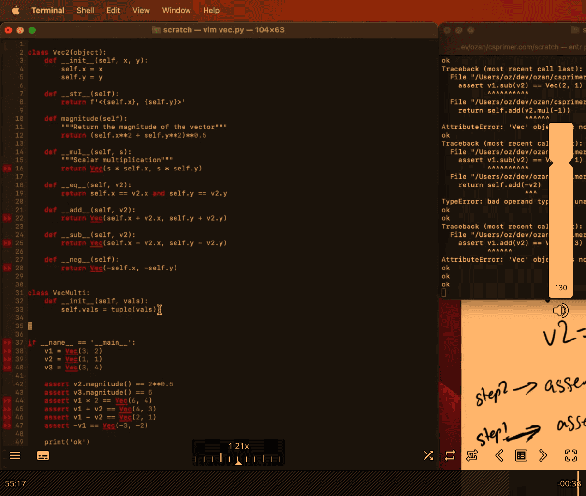

- you can do this or just Class VecMulti(tuple):

- or referencing :

```language

def __init(self,vals):
self.vals= tuple(vals)
```

[Getting Help | Effective Shell](https://effective-shell.com/part-1-transitioning-to-the-shell/getting-help/#the-online-cheatsheet)

python -> ipython repl
TS/nodejs -> repl -> deno or ijavascript

- [traefik/yaegi: Yaegi is Another Elegant Go Interpreter](https://github.com/traefik/yaegi) -> go repl

- [Compiler Explorer](https://godbolt.org/)

[milanglacier/yarepl.nvim: All-in-one REPL and TUI App management tool. Offering flexible interaction paradigms, project-level configs, aider-chat integration, and native dot-repeat.](https://github.com/milanglacier/yarepl.nvim?tab=readme-ov-file)

---

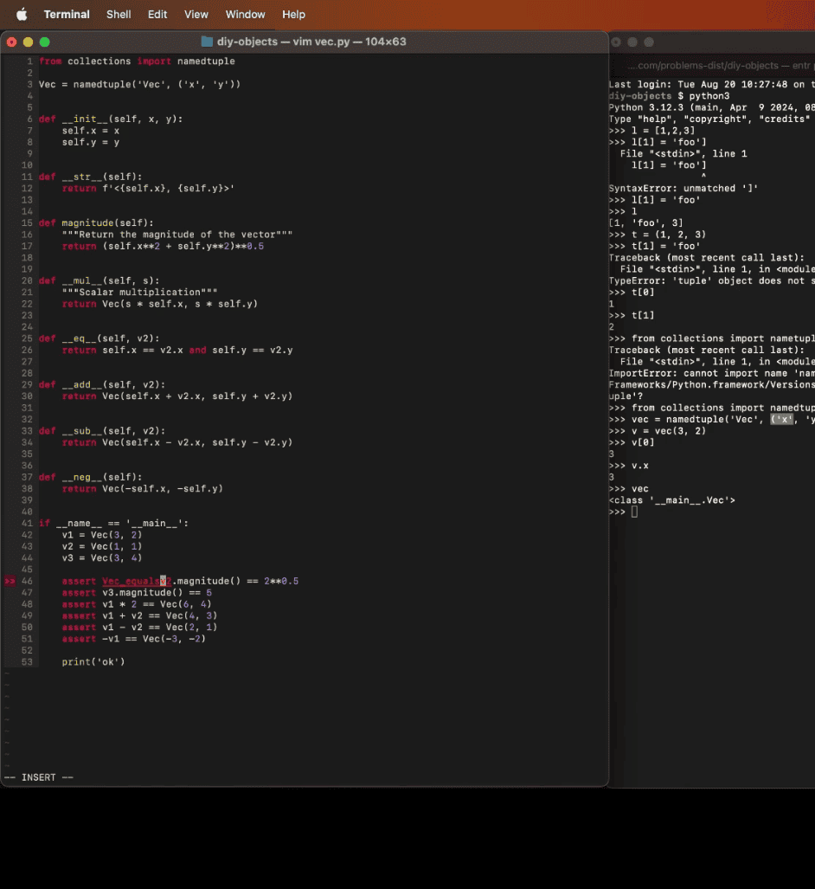

using collection import namedtuple
to replace **init**

then using Vec= namedtuple(xx) for Vec(iii) as Vec

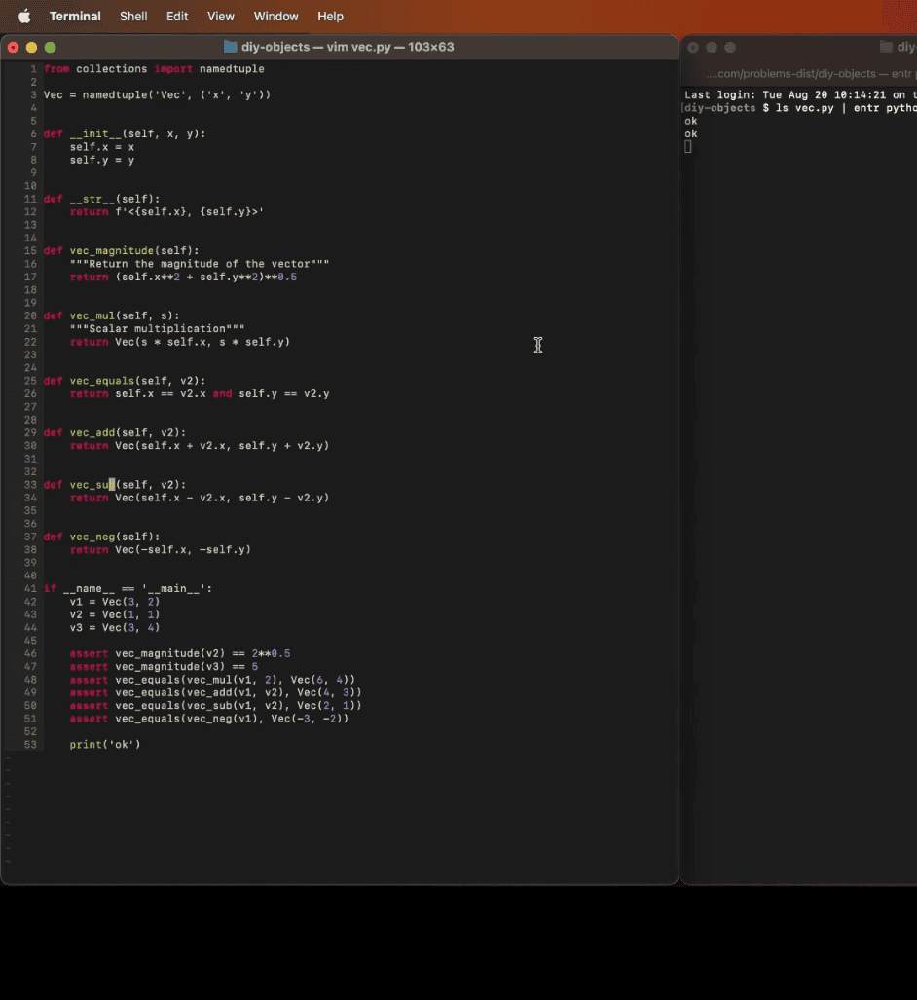

---

# CS primer point of view

[Jonathan Blow's home page](http://number-none.com/blow/john_carmack_on_inlined_code.html)

- depend on complexity rather than long or short
- factoring out if too complex
- know your tools well, like compiler , interpret
- train the skill of how to solve it
- community difference (cultural difference like emacs nvim, OOP versus C
  community)

[[2025-04-21]]

- like different view on ORM

- different view on pair programming( some prefer on e another)

- cpp is class with c

- garbage collection (gurantee will complete on time and just auto manage it)

- test driven or not(automatically test or not)

- could be good on either situation , with or without

- the key is not blindly trusting one way

- maybe depend on ecosystem and community

[[2025-04-21]]

- primer dont take 4 gang of design pattern as toolkit (self-help book like)
- design pattern is useful though

know your tools well is more important , architecture , compiler interpreter etc

- being able to reason what actually happen step by step
- write down sequence of instruction
- format , test , code review in a certain way

but code review is just picking at some time (taste)
someone who understand the system well can explicitly tell the better way, great
feedback

primer recommend book:

> anything that is assertive is wrong 🔥 always can be argue one way or other , so just
> don't trust thing that is general , assertive

[Software Design Book](https://web.stanford.edu/~ouster/cgi-bin/book.php)

- this book even have a chapter POV on clean code
- check his point with some great source codebase

- always contradict to one or other approach

- you can learn through the journey of achieving your goal though (swordsmanship)

- swordsmanship -> awareness -> whatever the means (self-awareness)
- pros and cons (vague standpoint though)

  api design, design pattern,
  similar to craftmanships [[20250321-essentialist---software-essentialist-2024-7|Essentialist - Software Essentialist 2024-7]]

- there isn't standard way to code

- i guess only my journey could tell the ans for myself, i prefer essentialist books lol (but he is mainly on web TS though)

---

- python interpreter
- ceval.c (soucrecode)

[rhettinger (Raymond Hettinger)](https://github.com/rhettinger)

- python maintainer (good instructor)

---

[Exploring the Power of Negative Space Programming — Double Trouble](https://double-trouble.dev/post/negativ-space-programming/)

- assert your way to test the program

---

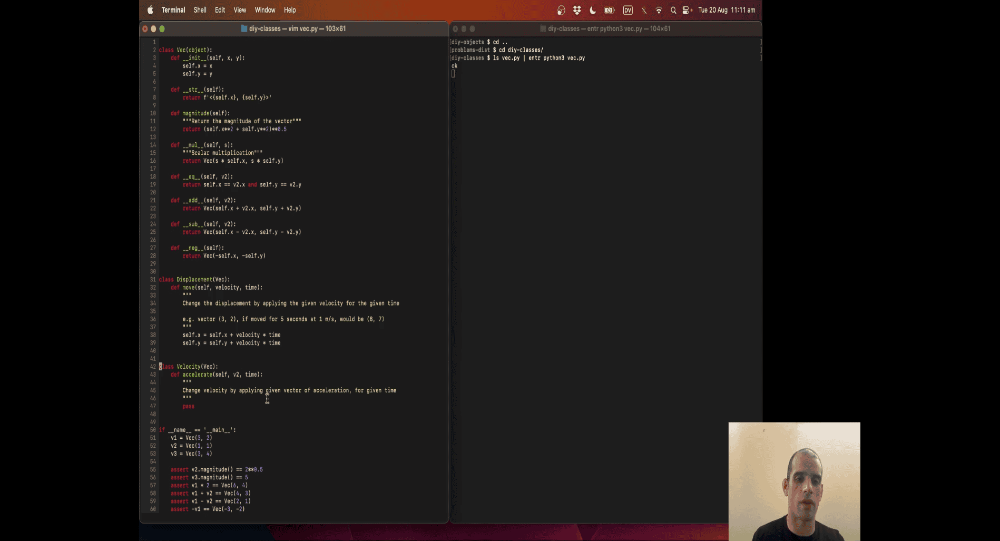

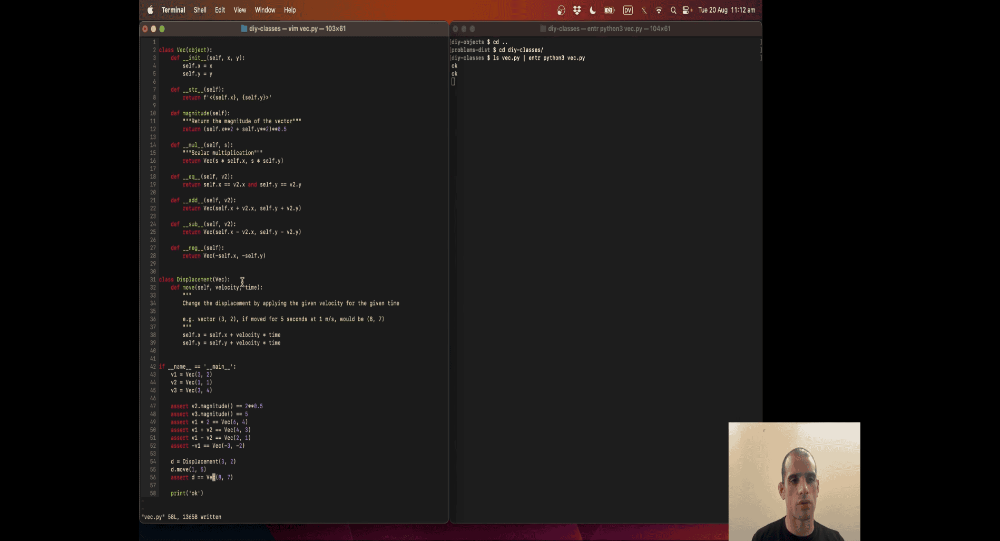

- adding d to test it

d = Displacement(3, 2)
d.move(1, 5)
assert d

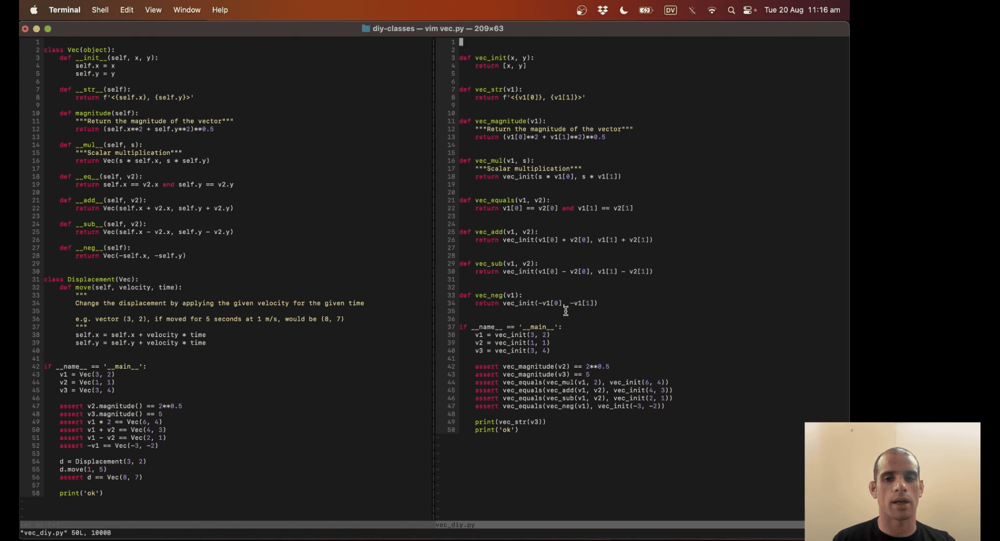

- two way of doing this, left and right

---

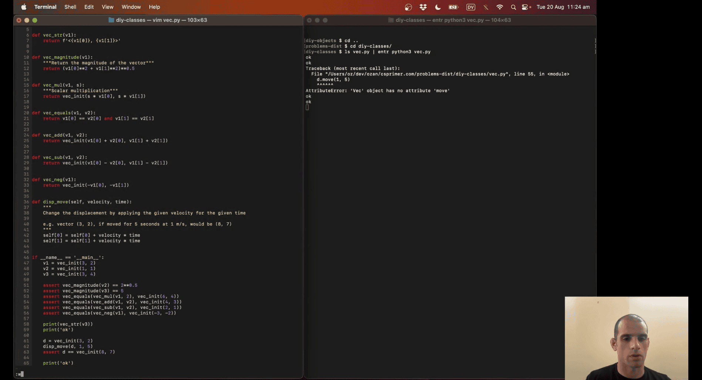
d = ver=init(3, 2)
disp_move(d,1,5) -> not using d.move, but put d (initator into fucntion)
assert d

- here is the difference with class and without class

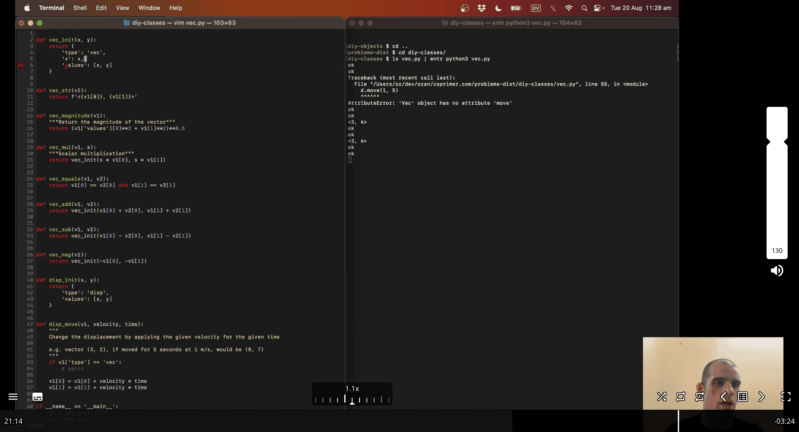

adding 'type': 'vec' etc
setting value = [x,y] , or 'x' : x,

---

I understand you want to see how a C programmer would use structs and macros to achieve functionality similar to Python inheritance, without using Python's inheritance mechanisms. Since you haven't specified a particular example of Python inheritance to translate, I'll assume you want a general demonstration of how C can emulate inheritance-like behavior using structs and macros, which is a common approach in C to mimic object-oriented programming.

In C, "inheritance" can be simulated by embedding a parent struct within a child struct (struct composition) and using macros or function pointers to achieve polymorphic behavior. Below, I'll create an example that mimics a simple inheritance hierarchy, similar to how you might have a base class and derived class in Python. For clarity, I'll model a "Vehicle" (parent) and "Car" (child) relationship, where the child extends the parent's properties and behavior. Macros will be used to simplify method calls or simulate shared behavior.

```c
#include <stdio.h>
#include <string.h>
#include <stdlib.h>

// Macro to access the parent struct from a child struct
#define TO_VEHICLE(child_ptr) (&((child_ptr)->vehicle))

// Vehicle "base class" struct
typedef struct {
    char model[50];
    int speed;
    void (*move)(void*); // Function pointer for polymorphic behavior
} Vehicle;

// Car "derived class" struct
typedef struct {
    Vehicle vehicle; // Embedded parent struct (composition)
    int num_doors;
} Car;

// Function to initialize a Vehicle
void vehicle_init(Vehicle* v, const char* model, int speed, void (*move)(void*)) {
    strncpy(v->model, model, sizeof(v->model) - 1);
    v->model[sizeof(v->model) - 1] = '\0';
    v->speed = speed;
    v->move = move;
}

// Vehicle's move implementation
void vehicle_move(void* self) {
    Vehicle* v = (Vehicle*)self;
    printf("%s is moving at %d km/h\n", v->model, v->speed);
}

// Function to initialize a Car
void car_init(Car* c, const char* model, int speed, int num_doors) {
    vehicle_init(TO_VEHICLE(c), model, speed, car_move); // Initialize parent part
    c->num_doors = num_doors;
}

// Car's move implementation (overrides Vehicle's)
void car_move(void* self) {
    Car* c = (Car*)self;
    printf("%s (Car with %d doors) is moving at %d km/h\n",
           TO_VEHICLE(c)->model, c->num_doors, TO_VEHICLE(c)->speed);
}

// Macro to simplify calling the move function
#define MOVE(obj) ((obj)->move((void*)(obj)))

int main() {
    // Create a Vehicle
    Vehicle v;
    vehicle_init(&v, "Generic Vehicle", 100, vehicle_move);

    // Create a Car
    Car c;
    car_init(&c, "Toyota", 120, 4);

    // Demonstrate polymorphic behavior
    MOVE(&v);           // Calls vehicle_move
    MOVE(TO_VEHICLE(&c)); // Calls car_move via Vehicle pointer

    return 0;
}
```
