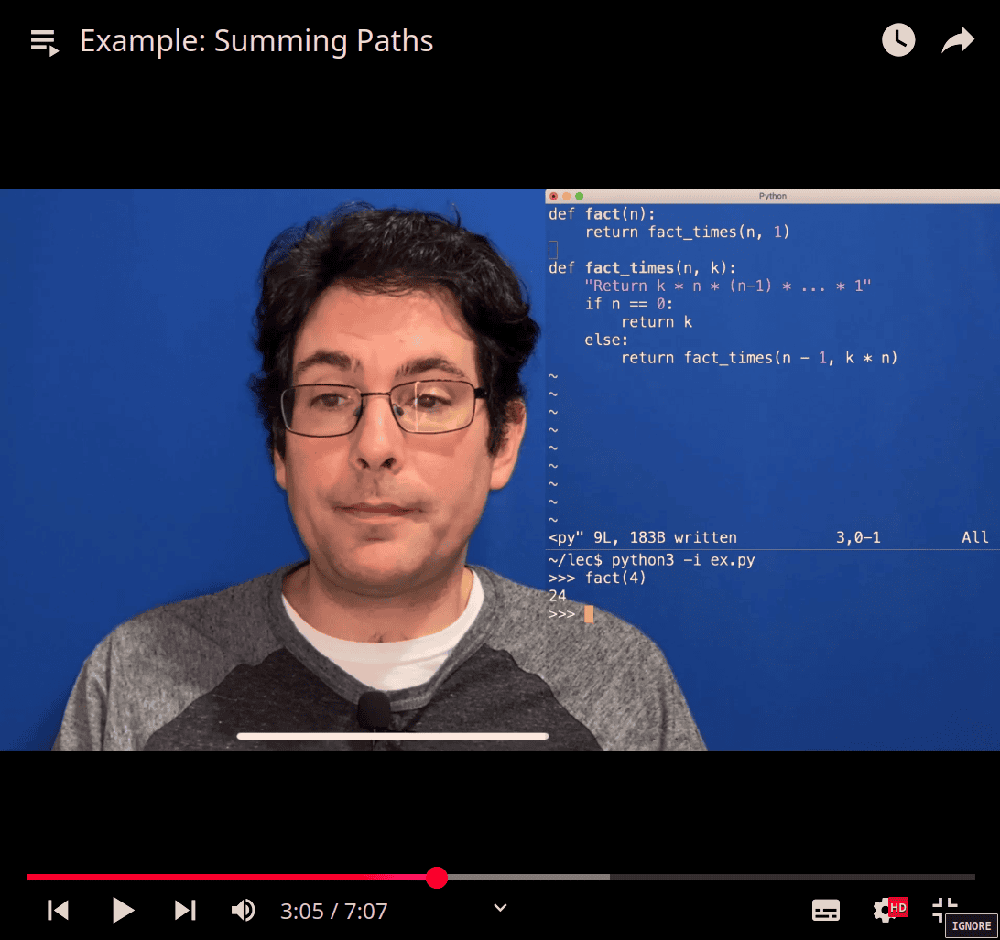

# cs61a-part2

[[1737418909-cs61a|cs61a]]
[COMPOSING PROGRAMS](https://composingprograms.netlify.app/)
[CS 61A Spring 2025](https://cs61a.org/)

# Tree


- it add 1 to all the node including the lable


- increment the leaves only


first print tree

```python
def print_tree(t, indent=0):
    print(' '*indent, label(t)) # could adding str() to label
    for b in branches(t):
        print_tree(b, indent + 1)
```

- fib_tree make it much easier to see the difference

---





```python
numbers = tree(3, [tree(4), tree(5, [tree(6)])])
haste = tree('h', [tree('a', [tree('s'),
                              tree('t')]),
                   tree('e')])

>>> haste
['h', ['a', ['s'], ['t']], ['e']]
>>> print_tree(haste)
 h
  a
   s
   t
  e
  >>> label(haste)
  'h'
  >>> branches(haste)
  [['a', ['s'], ['t']], ['e']]

```

- adding a function

```python

def print_sums(t, so_far):
    so_far = so_far + label(t)
    if is_leaf(t):
        print(so_far)
    else:
        for b in branches(t):
            print_sums(b, so_far)
  >>> numbers
  [3, [4], [5, [6]]]
  >>> print_sums(numbers,0)
  7
  14
  >>>
```

The expression `not branches(list)` will return:

- **`True`** → when `branches(list)` is an empty list (`[]`), meaning `list` has no branches (only a root).
- **`False`** → when `branches(list)` is **not** empty, meaning `list` has at least one branch.

### Example Scenarios:

```python
tree1 = [1]          # Only root, no branches
tree2 = [1, [2], [3]]  # Root with branches

print(not branches(tree1))  # True (empty branches)
print(not branches(tree2))  # False (has branches)
```

So, `is_leaf(tree)` will return `True` only when the tree has no branches.

- empty list -> false (TF game)
  


```python
>>> print_sums(numbers,0)
7
14
>>> numbers
[3, [4], [5, [6]]]
>>> print_sums(numbers,0)
7
14
>>> print_tree(numbers)
 3
  4
  5
   6

```

---


find total path to get the number total

- how many way to get the ans


---


- review :->

(a) -> variable -> 1

second(thing ) into a fuction: -> into return (y)

a -> y , so y = 1

g() call back parent fuction (a / 1)

lambda y:

```python
>>> a = 3
...
... def f(g):
...     a = 2
...     return lambda y: a* g(y)
... f(lambda y : a+y )(a)
...
12
>>>

(a) -> into another (variable)

  - indent -> trace
  last step is *2

```

---


- return None -> ending the fuction


- brute force


y = last ( variable )

search (f) -> anyfn that f(self) = y , if true = return x

---


- return None make a back to previous recurion fn 🤔
- damn , so that's why it print both case !!!!

<Each cascade frame is from a
different call to cascade.

-Until the Return value appears,
that call has not completed.

«Any statement can appear before
or after the recursive call.

## 

shorter version:

```python
def cascade(n):
    print(n)
    if n>10:
        cascade(n//10)
        print(n)
```

longer implemenation is more clear (base case, recursive case , so first one is
better)

now it is inverse cascade:


---


---

- Tree recursion


```python
>>> fib(0)
0
>>> fib(1)
1
>>> fib(3)
2
>>> fib(5)
5
>>> fib(6)
8
>>> fib(8)
21
>>>
  @trace
def fib(n):
    if n == 0:
        return 0
    elif n == 1:
        return 1
    else:
        return fib(n - 2) + fib(n - 1)


```

- using ucb trace.py to trace the recursion function 🤩🤩🤩

ucb python file:

```python

"""The UCB module contains functions specific to 61A projects at UC Berkeley."""

import code
import functools
import inspect
import re
import signal
import sys


def main(fn):
    """Call fn with command line arguments.  Used as a decorator.

    The main decorator marks the function that starts a program. For example,

    @main
    def my_run_function():
        # function body

    Use this instead of the typical __name__ == "__main__" predicate.
    """
    if inspect.stack()[1][0].f_locals['__name__'] == '__main__':
        args = sys.argv[1:] # Discard the script name from command line
        fn(*args) # Call the main function
    return fn

_PREFIX = ''
def trace(fn):
    """A decorator that prints a function's name, its arguments, and its return
    values each time the function is called. For example,

    @trace
    def compute_something(x, y):
        # function body
    """
    @functools.wraps(fn)
    def wrapped(*args, **kwds):
        global _PREFIX
        reprs = [repr(e) for e in args]
        reprs += [repr(k) + '=' + repr(v) for k, v in kwds.items()]
        log('{0}({1})'.format(fn.__name__, ', '.join(reprs)) + ':')
        _PREFIX += '    '
        try:
            result = fn(*args, **kwds)
            _PREFIX = _PREFIX[:-4]
        except Exception as e:
            log(fn.__name__ + ' exited via exception')
            _PREFIX = _PREFIX[:-4]
            raise
        # Here, print out the return value.
        log('{0}({1}) -> {2}'.format(fn.__name__, ', '.join(reprs), result))
        return result
    return wrapped


def log(message):
    """Print an indented message (used with trace)."""
    print(_PREFIX + re.sub('\n', '\n' + _PREFIX, str(message)))


def log_current_line():
    """Print information about the current line of code."""
    frame = inspect.stack()[1]
    log('Current line: File "{f[1]}", line {f[2]}, in {f[3]}'.format(f=frame))


def interact(msg=None):
    """Start an interactive interpreter session in the current environment.

    On Unix:
      <Control>-D exits the interactive session and returns to normal execution.
    In Windows:
      <Control>-Z <Enter> exits the interactive session and returns to normal
      execution.
    """
    # evaluate commands in current namespace
    frame = inspect.currentframe().f_back
    namespace = frame.f_globals.copy()
    namespace.update(frame.f_locals)

    # exit on interrupt
    def handler(signum, frame):
        print()
        exit(0)
    signal.signal(signal.SIGINT, handler)

    if not msg:
        _, filename, line, _, _, _ = inspect.stack()[1]
        msg = 'Interacting at File "{0}", line {1} \n'.format(filename, line)
        msg += '    Unix:    <Control>-D continues the program; \n'
        msg += '    Windows: <Control>-Z <Enter> continues the program; \n'
        msg += '    exit() or <Control>-C exits the program'

    code.interact(msg, None, namespace)
```

- with trace(ubc)

```python
>>> fib(0)
fib(0):
fib(0) -> 0
0
>>> fib(1)
fib(1):
fib(1) -> 1
1
>>> fib(2)
fib(2):
    fib(0):
    fib(0) -> 0
    fib(1):
    fib(1) -> 1
fib(2) -> 1
1
>>> fib(3)
fib(3):
    fib(1):
    fib(1) -> 1
    fib(2):
        fib(0):
        fib(0) -> 0
        fib(1):
        fib(1) -> 1
    fib(2) -> 1
fib(3) -> 2
2


```

---

- tree partitions


- counting 6, but max for using number 4


- spliting half

left = 6-4

right =

explore two possibilities:

- use at least one 4
- don't use any 4


Decomposing problem

- count_partitions(2, 4)

- count_partitions(6, 3)

---

again , at least 3 , don't use 3

finally , sum them all


```python
@trace
def count_partitions(n, m):
    if n == 0:
        return 1
    elif n < 0:
        return 0
    elif m == 0:
        return 0
    else:
        with_m = count_partitions(n - m, m)
        without_m = count_partitions(n, m - 1)
        return with_m + without_m

>>> count_partitions(2,4)
count_partitions(2, 4):
    count_partitions(-2, 4):
    count_partitions(-2, 4) -> 0
    count_partitions(2, 3):
        count_partitions(-1, 3):
        count_partitions(-1, 3) -> 0
        count_partitions(2, 2):
            count_partitions(0, 2):
            count_partitions(0, 2) -> 1
            count_partitions(2, 1):
                count_partitions(1, 1):
                    count_partitions(0, 1):
                    count_partitions(0, 1) -> 1
                    count_partitions(1, 0):
                    count_partitions(1, 0) -> 0
                count_partitions(1, 1) -> 1
                count_partitions(2, 0):
                count_partitions(2, 0) -> 0
            count_partitions(2, 1) -> 1
        count_partitions(2, 2) -> 2
    count_partitions(2, 3) -> 2
count_partitions(2, 4) -> 2
2

```

(4,6)

```python
1.  6 = 2 + 4
2.  6 = 1 + 1 + 4
3.  6 = 3 + 3
4.  6 = 1 + 2 + 3
5.  6 = 1 + 1 + 1 + 3
6.  6 = 2 + 2 + 2
7.  6 = 1 + 1 + 2 + 2
8.  6 = 1 + 1 + 1 + 1 + 2
9.  6 = 1 + 1 + 1 + 1 + 1 + 1

```


[(162) Lists - YouTube](https://www.youtube.com/watch?v=-Q45UcQ2XJk&list=PL6BsET-8jgYVfI7chdrXciKy8CP10tOcl)
