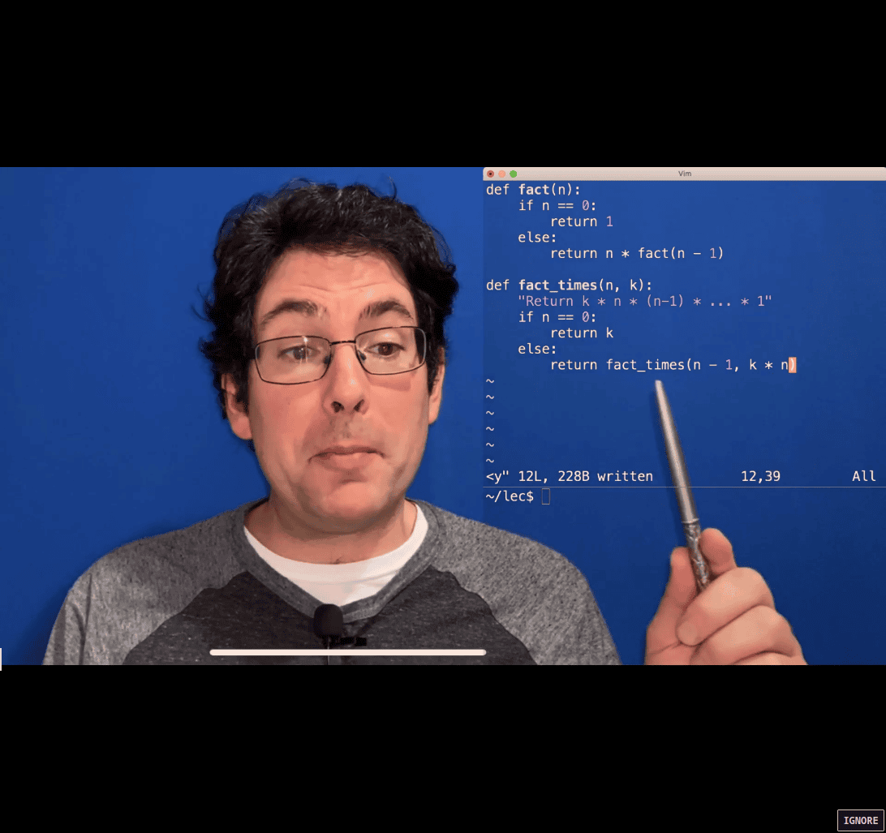

# cs61a-part2

[[1737418909-cs61a|cs61a]]
[COMPOSING PROGRAMS](https://composingprograms.netlify.app/)
[CS 61A Spring 2025](https://cs61a.org/)
question: [Cats | CS自学社区](http://www.learncs.site/docs/curriculum-resource/cs61a/cs61a_zh/project/cats)
ans:
[[2021 Spring] CS61A 学习笔记 索引 - ikventure - 博客园](https://www.cnblogs.com/ikventure/p/14984919.html) - quite good ans

# Tree


- it add 1 to all the node including the lable


- increment the leaves only


first print tree

```python
def print_tree(t, indent=0):
    print(' '*indent, label(t)) # could adding str() to label
    for b in branches(t):
        print_tree(b, indent + 1)
```

- fib_tree make it much easier to see the difference

---




```python
numbers = tree(3, [tree(4), tree(5, [tree(6)])])
haste = tree('h', [tree('a', [tree('s'),
                              tree('t')]),
                   tree('e')])

>>> haste
['h', ['a', ['s'], ['t']], ['e']]
>>> print_tree(haste)
 h
  a
   s
   t
  e
  >>> label(haste)
  'h'
  >>> branches(haste)
  [['a', ['s'], ['t']], ['e']]

```

- adding a function

```python

def print_sums(t, so_far):
    so_far = so_far + label(t)
    if is_leaf(t):
        print(so_far)
    else:
        for b in branches(t):
            print_sums(b, so_far)
  >>> numbers
  [3, [4], [5, [6]]]
  >>> print_sums(numbers,0)
  7
  14
  >>>
```

The expression `not branches(list)` will return:

- **`True`** ‚Üí when `branches(list)` is an empty list (`[]`), meaning `list` has no branches (only a root).
- **`False`** ‚Üí when `branches(list)` is **not** empty, meaning `list` has at least one branch.

### Example Scenarios:

```python
tree1 = [1]          # Only root, no branches
tree2 = [1, [2], [3]]  # Root with branches

print(not branches(tree1))  # True (empty branches)
print(not branches(tree2))  # False (has branches)
```

So, `is_leaf(tree)` will return `True` only when the tree has no branches.

- empty list -> false (TF game)
  


```python
>>> print_sums(numbers,0)
7
14
>>> numbers
[3, [4], [5, [6]]]
>>> print_sums(numbers,0)
7
14
>>> print_tree(numbers)
 3
  4
  5
   6

```

---


find total path to get the number total

- how many way to get the ans


---


- review :->

(a) -> variable -> 1

second(thing ) into a fuction: -> into return (y)

a -> y , so y = 1

g() call back parent fuction (a / 1)

lambda y:

```python
>>> a = 3
...
... def f(g):
...     a = 2
...     return lambda y: a* g(y)
... f(lambda y : a+y )(a)
...
12
>>>

(a) -> into another (variable)

  - indent -> trace
  last step is *2

```

---


- return None -> ending the fuction


- brute force


y = last ( variable )

search (f) -> anyfn that f(self) = y , if true = return x

---


- return None make a back to previous recurion fn 🤔
- damn , so that's why it print both case !!!!

<Each cascade frame is from a
different call to cascade.

-Until the Return value appears,
that call has not completed.

¬´Any statement can appear before
or after the recursive call.

## 

shorter version:

```python
def cascade(n):
    print(n)
    if n>10:
        cascade(n//10)
        print(n)
```

longer implemenation is more clear (base case, recursive case , so first one is
better)

now it is inverse cascade:


---


---

- Tree recursion


```python
>>> fib(0)
0
>>> fib(1)
1
>>> fib(3)
2
>>> fib(5)
5
>>> fib(6)
8
>>> fib(8)
21
>>>
  @trace
def fib(n):
    if n == 0:
        return 0
    elif n == 1:
        return 1
    else:
        return fib(n - 2) + fib(n - 1)


```

- using ucb trace.py to trace the recursion function 🤩🤩🤩

ucb python file:

```python

"""The UCB module contains functions specific to 61A projects at UC Berkeley."""

import code
import functools
import inspect
import re
import signal
import sys


def main(fn):
    """Call fn with command line arguments.  Used as a decorator.

    The main decorator marks the function that starts a program. For example,

    @main
    def my_run_function():
        # function body

    Use this instead of the typical __name__ == "__main__" predicate.
    """
    if inspect.stack()[1][0].f_locals['__name__'] == '__main__':
        args = sys.argv[1:] # Discard the script name from command line
        fn(*args) # Call the main function
    return fn

_PREFIX = ''
def trace(fn):
    """A decorator that prints a function's name, its arguments, and its return
    values each time the function is called. For example,

    @trace
    def compute_something(x, y):
        # function body
    """
    @functools.wraps(fn)
    def wrapped(*args, **kwds):
        global _PREFIX
        reprs = [repr(e) for e in args]
        reprs += [repr(k) + '=' + repr(v) for k, v in kwds.items()]
        log('{0}({1})'.format(fn.__name__, ', '.join(reprs)) + ':')
        _PREFIX += '    '
        try:
            result = fn(*args, **kwds)
            _PREFIX = _PREFIX[:-4]
        except Exception as e:
            log(fn.__name__ + ' exited via exception')
            _PREFIX = _PREFIX[:-4]
            raise
        # Here, print out the return value.
        log('{0}({1}) -> {2}'.format(fn.__name__, ', '.join(reprs), result))
        return result
    return wrapped


def log(message):
    """Print an indented message (used with trace)."""
    print(_PREFIX + re.sub('\n', '\n' + _PREFIX, str(message)))


def log_current_line():
    """Print information about the current line of code."""
    frame = inspect.stack()[1]
    log('Current line: File "{f[1]}", line {f[2]}, in {f[3]}'.format(f=frame))


def interact(msg=None):
    """Start an interactive interpreter session in the current environment.

    On Unix:
      <Control>-D exits the interactive session and returns to normal execution.
    In Windows:
      <Control>-Z <Enter> exits the interactive session and returns to normal
      execution.
    """
    # evaluate commands in current namespace
    frame = inspect.currentframe().f_back
    namespace = frame.f_globals.copy()
    namespace.update(frame.f_locals)

    # exit on interrupt
    def handler(signum, frame):
        print()
        exit(0)
    signal.signal(signal.SIGINT, handler)

    if not msg:
        _, filename, line, _, _, _ = inspect.stack()[1]
        msg = 'Interacting at File "{0}", line {1} \n'.format(filename, line)
        msg += '    Unix:    <Control>-D continues the program; \n'
        msg += '    Windows: <Control>-Z <Enter> continues the program; \n'
        msg += '    exit() or <Control>-C exits the program'

    code.interact(msg, None, namespace)
```

- with trace(ubc)

```python
>>> fib(0)
fib(0):
fib(0) -> 0
0
>>> fib(1)
fib(1):
fib(1) -> 1
1
>>> fib(2)
fib(2):
    fib(0):
    fib(0) -> 0
    fib(1):
    fib(1) -> 1
fib(2) -> 1
1
>>> fib(3)
fib(3):
    fib(1):
    fib(1) -> 1
    fib(2):
        fib(0):
        fib(0) -> 0
        fib(1):
        fib(1) -> 1
    fib(2) -> 1
fib(3) -> 2
2


```

---

- tree partitions


- counting 6, but max for using number 4


- spliting half

left = 6-4

right =

explore two possibilities:

- use at least one 4
- don't use any 4


Decomposing problem

- count_partitions(2, 4)

- count_partitions(6, 3)

---

again , at least 3 , don't use 3

finally , sum them all


```python
@trace
def count_partitions(n, m):
    if n == 0:
        return 1
    elif n < 0:
        return 0
    elif m == 0:
        return 0
    else:
        with_m = count_partitions(n - m, m)
        without_m = count_partitions(n, m - 1)
        return with_m + without_m

>>> count_partitions(2,4)
count_partitions(2, 4):
    count_partitions(-2, 4):
    count_partitions(-2, 4) -> 0
    count_partitions(2, 3):
        count_partitions(-1, 3):
        count_partitions(-1, 3) -> 0
        count_partitions(2, 2):
            count_partitions(0, 2):
            count_partitions(0, 2) -> 1
            count_partitions(2, 1):
                count_partitions(1, 1):
                    count_partitions(0, 1):
                    count_partitions(0, 1) -> 1
                    count_partitions(1, 0):
                    count_partitions(1, 0) -> 0
                count_partitions(1, 1) -> 1
                count_partitions(2, 0):
                count_partitions(2, 0) -> 0
            count_partitions(2, 1) -> 1
        count_partitions(2, 2) -> 2
    count_partitions(2, 3) -> 2
count_partitions(2, 4) -> 2
2

```

(4,6)

```python
1.  6 = 2 + 4
2.  6 = 1 + 1 + 4
3.  6 = 3 + 3
4.  6 = 1 + 2 + 3
5.  6 = 1 + 1 + 1 + 3
6.  6 = 2 + 2 + 2
7.  6 = 1 + 1 + 2 + 2
8.  6 = 1 + 1 + 1 + 1 + 2
9.  6 = 1 + 1 + 1 + 1 + 1 + 1

```


[(162) Lists - YouTube](https://www.youtube.com/watch?v=-Q45UcQ2XJk&list=PL6BsET-8jgYVfI7chdrXciKy8CP10tOcl)

[[777-decorator]]

---

digit[3] or getitem(digits, 3) -> same


- containers

```python
>>> digits=[1,8,2,8]
>>> 1 in digits
True
>>> 2 in digits
True
>>> 5 not in digits
True
>>> not(5 in digits)
True
>>> '1' == 1
False
>>> '1' in digits
False
>>> [1,8] in digits
False
>>> [1,2] in [3,[1,2],4]
True
>>> [1,2] in [3,[[1,2]],4]
False
>>>

```

---

- statements

```python
>>> def count(s, value):
...     total,index=0,0
...     while index<len(s):
...         element=s[index]
...         if element == value:
...             total = total +1
...         index=index+1
...     return total
...
>>> count([1,2,1,2,1],1)
3
# refactor into python prefer:
def count_new(s, value):
    total = 0
    for element in s:
        if element == value:
            total += 1
    return total
```


- unpack the pairs (only work in same length sequence)
  for x,y in pairs:
  if x==y:

- range:


- list(range())


for \_ in range(3):

- just loop 3 time

---

- list comprehensions


```python
>>> odds =[1,3,5,7,9]
>>> [x+1 ofr x in odds]
  File "<python-input-64>", line 1
    [x+1 ofr x in odds]
     ^^^^^^^
SyntaxError: invalid syntax. Perhaps you forgot a comma?
>>> [x+1 for x in odds]
[2, 4, 6, 8, 10]
>>> [x+2 for x in odds]
[3, 5, 7, 9, 11]
>>> [x**2 for x in odds]
[1, 9, 25, 49, 81]
>>> x**2 for x in odds
  File "<python-input-68>", line 1
    x**2 for x in odds
         ^^^
SyntaxError: invalid syntax
>>> [x**2 for x in odds]
[1, 9, 25, 49, 81]
>>> (x**2 for x in odds)
<generator object <genexpr> at 0x7a5e2cddcd40>
>>> list((x**2 for x in odds))
[1, 9, 25, 49, 81]
>>> list(x**2 for x in odds)
[1, 9, 25, 49, 81]
>>> [x**2 for x in list(x**2 for x in odds)]
[1, 81, 625, 2401, 6561]
>>> [x for x in odds if 25 %x ==0]
[1, 5]

## other list compre:
>>> def divisor(n):
...     return [1] + [x for x in range(2,n) if n%x==0]
...
>>> divisor(1)
[1]
>>> divisor(4)
[1, 2]
>>> divisor(9)
[1, 3]
>>> list(range(2,4))
[2, 3]
>>> list(range(2,9))
[2, 3, 4, 5, 6, 7, 8]
>>>
  ... def divisor(n):
...     return [1] + [x for x in range(2,n) if x%2==0]
  ... def divisor(n):
...     return [1] + [x for x in range(2,n+1) if x%2==0]

```

- range(2,n+1)


- `return s[0] + fn(s[1:])`
  adding the first element to the sum of the rest of the element

- normal recursion using n-1 etc , this just adjust the slice number

  tree recursion


similar to previous problem?:

```
def count_partitions(n, m):
    if n == 0:
        return 1
    elif n < 0:
        return 0
    elif m == 0:
        return 0
    else:
        with_m = count_partitions(n - m, m)
        without_m = count_partitions(n, m - 1)
        return with_m + without_m


```

- nope


---

next chapter :
[(162) Box-and-Pointer Notation - YouTube](https://www.youtube.com/watch?v=aSqOiUZg7kQ&list=PL6BsET-8jgYW50w7isVJS3YumstvFX1LY)

---

tree recusion dis:


The most important thing to remember about lists is that a non-empty list s can be split into its first element s[0] and the rest of the list s[1:].

```python
>>> s = [2, 3, 6, 4]
>>> s[0]
2
>>> s[1:]
[3, 6, 4]

using these to learn frist rather than append
```

sums(n,m)
n = total
m = max
return `[all list]`

q2

```python
def max_product(s):
    """Return the maximum product of non-consecutive elements of s.

    >>> max_product([10, 3, 1, 9, 2])   # 10 * 9
    90
    >>> max_product([5, 10, 5, 10, 5])  # 5 * 5 * 5
    125
    >>> max_product([])                 # The product of no numbers is 1
    1
    """


```

Good question! Let's break it down and understand why `s[1:] * max_product(s[1+2:])` is **incorrect**, while `non_first = max_product(s[1:])` is **correct**.

---

### **Understanding the "non-first" case**

The **goal of the "non-first" choice** is to **skip** the first element and find the best product from the **rest of the list**.

#### **Why is this wrong?**

```python
non_first = s[1:] * max_product(s[1+2:])
```

1. **Issue with Multiplication (`s[1:] * something`)**

   - `s[1:]` is **a list**, not a single number.
   - You cannot multiply a list by a number like this; it's a **type error**.

2. **Incorrect Skipping Logic**
   - `s[1+2:]` skips two elements from `s[1:]`, but the "non-first" case **only means skipping the first element**.
   - You should not force skipping another element in this case.

---

### **Why is this correct?**

```python
non_first = max_product(s[1:])
```

1. **It correctly skips only the first element**

   - The purpose of "non-first" is just to **ignore the first element** and continue processing the rest normally.
   - We pass `s[1:]` (everything except the first element) to `max_product()`, letting the function decide the best product from there.

2. **Recursive structure remains intact**
   - `max_product(s[1:])` naturally handles choosing whether to include elements at `s[1]` or not.
   - No need to manually skip more elements.

---

### **Example Breakdown**

#### Example: `s = [10, 3, 1, 9, 2]`

Let's see how each approach behaves.

##### **Your incorrect approach**

```python
non_first = s[1:] * max_product(s[1+2:])  # Incorrect!
```

- `s[1:] = [3, 1, 9, 2]`
- `max_product(s[1+2:]) = max_product([9, 2])`
- But `s[1:] * max_product([9, 2])` is invalid because `s[1:]` is a **list**, and we cannot multiply a list by a number.

##### **Correct approach**

```python
non_first = max_product(s[1:])
```

- We correctly pass `[3, 1, 9, 2]` into `max_product()`, letting it handle the computation recursively.

---

### **Final Takeaway**

- The **"first" case** involves multiplying because we actively pick an element.
- The **"non-first" case** just moves forward without multiplying, letting recursion handle it.
- **Don't manually skip extra elements for "non-first"; just call `max_product(s[1:])`.**

Does this explanation help? üòä

```python
# Official (alternative) version
return max(s[0] * max_product(s[2:]), s[1] * max_product(s[3:]))
```

### üîç Key Difference:

Instead of just **skipping the first element**, the official version tries **both**:

- Taking `s[0]` and skipping `s[1]`
- Taking `s[1]` and skipping `s[2]`

### ‚úÖ Why it's valid:

This version is **exploring more options**, not just one recursive path. It's still selecting **non-consecutive elements**, but now it considers:

- What if we start by skipping the first element, and **then** pick `s[1]`?

It might give a better product in some cases.

### 🧠 Summary:

- Your version is recursive and safe: `max(s[0]*..., max_product(s[1:]))`
- The alternative tries **both `s[0]` and `s[1]` as starting points**.

Both are valid; the official one explores a broader search space.

Want to see an example where this difference matters?

- official ans-> no need using +1, just `[0:] and [2:] & [1] and [3]` üî•

---

```python
def sums(n, m):
    """Return lists that sum to n containing positive numbers up to m that
    have no adjacent repeats.

    >>> sums(5, 1)
    []
    >>> sums(5, 2)
    [[2, 1, 2]]
    >>> sums(5, 3)
    [[1, 3, 1], [2, 1, 2], [2, 3], [3, 2]]
    >>> sums(5, 5)
    [[1, 3, 1], [1, 4], [2, 1, 2], [2, 3], [3, 2], [4, 1], [5]]
    >>> sums(6, 3)
    [[1, 2, 1, 2], [1, 2, 3], [1, 3, 2], [2, 1, 2, 1], [2, 1, 3], [2, 3, 1], [3, 1, 2], [3, 2, 1]]
    """
    if n < 0:
        return []
    if n == 0:
        sums_to_zero = []     # The only way to sum to zero using positives
        return [sums_to_zero] # Return a list of all the ways to sum to zero
    result = []
    for k in range(1, m + 1):
        result = result + [ ___ for rest in ___ if rest == [] or ___ ]
    return result
```


### üìå Line in Question:

```python
result = result + [[k] + rest for rest in sums(n - k, m) if rest == [] or rest[0] != k]
```

---

### 🧠 First, let’s understand the **goal**

We're trying to **build all possible lists** of numbers that:

- Add up to `n`
- Use only numbers `1` to `m`
- Have **no adjacent duplicates**

---

### üß± Break the line into smaller parts:

#### Part 1: The loop

```python
for rest in sums(n - k, m)
```

This is the **recursive part**.

- We already chose a number `k` (in a loop from `1` to `m`)
- So we subtract `k` from the target: `n - k`
- And we ask: _What are all the valid lists that sum to `n - k`?_
- Those results are stored in `rest`

So `rest` is a valid list **after we've already picked `k`**

---

#### Part 2: The condition

```python
if rest == [] or rest[0] != k
```

This is the **adjacent repeat check**.

- We don’t want to allow something like `[2, 2, 1]`
- So we check:
  - If `rest` is empty (`[]`) → OK, there’s nothing to compare
  - Otherwise: make sure `rest[0] != k`, so `k` isn’t repeated

#### ‚úÖ Example:

Say `k = 2` and `rest = [2, 1]`, then:

- `rest[0] == k` ‚Üí ‚ùå skip it (would give `[2, 2, 1]`, which has adjacent `2`s)

Say `rest = [1, 2]`:

- `rest[0] != k` ‚Üí ‚úÖ keep it (result would be `[2, 1, 2]`)

---

#### Part 3: The result building

```python
[[k] + rest ...]
```

Once we know `rest` is valid:

- We **add `k` to the front** of it ‚Üí `[k] + rest`
- That’s one of our valid result lists

---

#### Part 4: Append to final list

```python
result = result + ...
```

We're collecting all valid combinations, so we keep adding to `result`

---

### ‚úÖ Final Visual Summary:

For every number `k` from `1` to `m`:

- Get all valid sublists that sum to `n - k`
- For each one:
  - If it doesn’t start with `k`, then:
    - Add `k` in front
    - Save it in the final list

---

### üß™ Tiny Example:

`sums(3, 2)` — we want to find all valid lists of 1s and 2s that add up to 3, no adjacent repeats.

Here’s what would happen:

- Try `k = 1`

  - `n - k = 2`
  - Call `sums(2, 2)` ‚Üí maybe gives `[[2], [1, 1]]`
  - Check: can we put 1 in front?
    - `[1, 1]` ‚ùå skip (1 == 1)
    - `[2]` ‚úÖ keep ‚Üí `[1, 2]`

- Try `k = 2`
  - `n - k = 1`
  - Call `sums(1, 2)` ‚Üí maybe gives `[[1]]`
  - Can we put 2 in front?
    - `[1]` ‚úÖ ‚Üí `[2, 1]`

‚úÖ Final result: `[[1, 2], [2, 1]]`

---

Let me know if you'd like this rewritten as a for-loop version — sometimes that's easier to read than list comprehensions.

```python
sums(5, 3):
    sums(4, 3):
        sums(3, 3):
            sums(2, 3):
                sums(1, 3):
                    sums(0, 3):
                    sums(0, 3) -> [[]]
                    sums(-1, 3):
                    sums(-1, 3) -> []
                    sums(-2, 3):
                    sums(-2, 3) -> []
                sums(1, 3) -> [[1]]
                sums(0, 3):
                sums(0, 3) -> [[]]
                sums(-1, 3):
                sums(-1, 3) -> []
            sums(2, 3) -> [[2]]
            sums(1, 3):
                sums(0, 3):
                sums(0, 3) -> [[]]
                sums(-1, 3):
                sums(-1, 3) -> []
                sums(-2, 3):
                sums(-2, 3) -> []
            sums(1, 3) -> [[1]]
            sums(0, 3):
            sums(0, 3) -> [[]]
        sums(3, 3) -> [[1, 2], [2, 1], [3]]
        sums(2, 3):
            sums(1, 3):
                sums(0, 3):
                sums(0, 3) -> [[]]
                sums(-1, 3):
                sums(-1, 3) -> []
                sums(-2, 3):
                sums(-2, 3) -> []
            sums(1, 3) -> [[1]]
            sums(0, 3):
            sums(0, 3) -> [[]]
            sums(-1, 3):
            sums(-1, 3) -> []
        sums(2, 3) -> [[2]]
        sums(1, 3):
            sums(0, 3):
            sums(0, 3) -> [[]]
            sums(-1, 3):
            sums(-1, 3) -> []
            sums(-2, 3):
            sums(-2, 3) -> []
        sums(1, 3) -> [[1]]
    sums(4, 3) -> [[1, 2, 1], [1, 3], [3, 1]]
    sums(3, 3):
        sums(2, 3):
            sums(1, 3):
                sums(0, 3):
                sums(0, 3) -> [[]]
                sums(-1, 3):
                sums(-1, 3) -> []
                sums(-2, 3):
                sums(-2, 3) -> []
            sums(1, 3) -> [[1]]
            sums(0, 3):
            sums(0, 3) -> [[]]
            sums(-1, 3):
            sums(-1, 3) -> []
        sums(2, 3) -> [[2]]
        sums(1, 3):
            sums(0, 3):
            sums(0, 3) -> [[]]
            sums(-1, 3):
            sums(-1, 3) -> []
            sums(-2, 3):
            sums(-2, 3) -> []
        sums(1, 3) -> [[1]]
        sums(0, 3):
        sums(0, 3) -> [[]]
    sums(3, 3) -> [[1, 2], [2, 1], [3]]
    sums(2, 3):
        sums(1, 3):
            sums(0, 3):
            sums(0, 3) -> [[]]
            sums(-1, 3):
            sums(-1, 3) -> []
            sums(-2, 3):
            sums(-2, 3) -> []
        sums(1, 3) -> [[1]]
        sums(0, 3):
        sums(0, 3) -> [[]]
        sums(-1, 3):
        sums(-1, 3) -> []
    sums(2, 3) -> [[2]]
sums(5, 3) -> [[1, 3, 1], [2, 1, 2], [2, 3], [3, 2]]
[[1, 3, 1], [2, 1, 2], [2, 3], [3, 2]]
```

---

Let’s take an easy example:  
`üëâ sums(3, 2)`  
So:

- We want all combinations of 1s and 2s
- That sum to `3`
- And don’t have **adjacent repeats**

---

## 🔁 Step-by-step with simple loops

Let’s write the logic more clearly using regular loops:

```python
def sums(n, m):
    if n < 0:
        return []
    if n == 0:
        return [[]]  # Only one way to sum to zero

    result = []
    for k in range(1, m + 1):  # Try every number from 1 to m
        sublists = sums(n - k, m)  # Recursive call
        for rest in sublists:
            if rest == [] or rest[0] != k:  # No repeats
                result.append([k] + rest)   # Build the new list
    return result
```

---

## 🧠 What happens to `rest`?

Let’s trace `sums(3, 2)` step by step.

---

### First call: `sums(3, 2)`

Try `k = 1`:

- Call `sums(2, 2)`

---

### Second call: `sums(2, 2)`

Try `k = 1` again:

- Call `sums(1, 2)`

---

### Third call: `sums(1, 2)`

Try `k = 1`:

- Call `sums(0, 2)` ‚Üí returns `[[]]`
- Now we loop over `rest in [[]]`
  - `rest = []` ‚Üí ‚úÖ pass the check
  - Add `[1] + []` ‚Üí `[1]` ‚úÖ

Now `sums(1, 2)` ‚Üí has `[ [1] ]` so far.

Try `k = 2`:

- Call `sums(-1, 2)` ‚Üí returns `[]`  
  So done here.

Return: `sums(1, 2)` ‚Üí `[[1]]`

---

### Back to `sums(2, 2)`

Now we’re still handling `k = 1`, and `sums(1, 2)` returned `[[1]]`

We loop:

- `rest = [1]`
- Check: is `rest[0] != k`? ‚Üí `1 == 1` ‚ùå skip it!

Now try `k = 2`:

- Call `sums(0, 2)` ‚Üí returns `[[]]`

Loop:

- `rest = []` ‚Üí ‚úÖ
- Add `[2] + []` ‚Üí `[2]`

Return: `sums(2, 2)` ‚Üí `[[2]]`

---

### Back to `sums(3, 2)`

We’re at `k = 1`, and `sums(2, 2)` gave `[[2]]`

Loop:

- `rest = [2]` ‚Üí `2 != 1` ‚úÖ
- Add `[1] + [2]` ‚Üí `[1, 2]`

Now try `k = 2`:

- Call `sums(1, 2)` ‚Üí returned `[[1]]`

Loop:

- `rest = [1]` ‚Üí `1 != 2` ‚úÖ
- Add `[2] + [1]` ‚Üí `[2, 1]`

---

### ‚úÖ Final result of `sums(3, 2)`:

```
[[1, 2], [2, 1]]
```

---

## 🔄 How `rest` changes

It’s the result of the recursive call each time:

- `sums(0, 2)` ‚Üí `[[]]`
- `sums(1, 2)` ‚Üí `[[1]]`
- `sums(2, 2)` ‚Üí `[[2]]`
- `sums(3, 2)` builds on that to form `[1, 2]`, `[2, 1]`

Each time you add a number `k`, you get **smaller problems**, and `rest` is the **partial solution** to that smaller problem.

---

### TL;DR:

- `rest` is a **partial solution** from a recursive call
- You’re trying to build on `rest` by adding a new number `k` in front
- But you **skip** it if `rest[0] == k` to avoid adjacent repeats

---

Awesome — let’s visualize the recursive calls of `sums(3, 2)` as a **tree diagram** 🌲, so you can clearly see how the recursion works, how `rest` is built, and how adjacent repeats are avoided.

---

### üìå Problem: `sums(3, 2)`

We want to find all the **non-repeating adjacent** sequences of numbers `1` to `2` that **sum to 3**.

---

### üå≤ Tree of Recursive Calls

We'll show it like:

```
current_call (n)
├── try k = 1
│   └── recursive call: sums(n - 1, m)
└── try k = 2
    └── recursive call: sums(n - 2, m)
```

---

### Root: `sums(3, 2)`

```
sums(3, 2)
├── k = 1 → sums(2, 2)
│   ├── k = 1 → sums(1, 2)
│   │   ├── k = 1 → sums(0, 2) ✅ returns [[]]
│   │   └── k = 2 → sums(-1, 2) ❌ invalid
│   │   → builds: [1] + [] = [1] ✅
│   │   → return: [[1]]
│   └── k = 2 → sums(0, 2) ✅ returns [[]]
│       → builds: [2] + [] = [2] ✅
│   → Now from `sums(2, 2)` we have: [[2]], because [1] is invalid (adj repeat with prev 1)
│   → Back to `sums(3, 2)`, build: [1] + [2] = [1, 2] ✅
├── k = 2 → sums(1, 2)
│   ├── k = 1 → sums(0, 2) ✅ returns [[]]
│   │   → builds: [1] + [] = [1] ✅
│   └── k = 2 → sums(-1, 2) ❌ invalid
│   → Return: [[1]]
│   → Back to `sums(3, 2)`, build: [2] + [1] = [2, 1] ✅
```

---

### ‚úÖ Final Result:

From root `sums(3, 2)`, we got:

- `[1, 2]`
- `[2, 1]`

So:

```python
sums(3, 2) ‚Üí [[1, 2], [2, 1]]
```

---

### 🔁 And how `rest` changes:

| Call         | Returned `rest` | Built `[k] + rest` | Keep or Skip |
| ------------ | --------------- | ------------------ | ------------ |
| `sums(0, 2)` | `[[]]`          | `[1]`, `[2]`       | ‚úÖ           |
| `sums(1, 2)` | `[[1]]`         | `[1, 1]`, `[2, 1]` | ‚ùå, ‚úÖ       |
| `sums(2, 2)` | `[[2]]`         | `[1, 2]`           | ‚úÖ           |

---

Let me know if you want to go one level deeper (e.g., `sums(4, 2)` tree) or see it as a visual chart!

---

# Project2

Let’s analyze the provided implementation of the `choose` function (which seems to be equivalent to the `pick` function from your earlier question) and compare it to the approach we discussed. Then, I’ll explain why the author initializes `count = -1` and explore an alternative approach, highlighting the differences.

### Provided Implementation:

```python
def choose(paragraphs, select, k):
    """Return the Kth paragraph from PARAGRAPHS for which SELECT called on the
    paragraph returns true. If there are fewer than K such paragraphs, return
    the empty string.
    """
    count = -1
    for p in paragraphs:
        if select(p):
            count += 1
            if count == k:
                return p
    return ""
```

#### How It Works:

1. **Initialization:** `count = -1`
   - Starts the counter at `-1` instead of `0`.
2. **Loop:** Iterates over `paragraphs` directly (using `p` instead of indices).
3. **Condition:** When `select(p)` is `True`:
   - Increments `count` (from `-1` to `0` on the first valid paragraph, then `1`, etc.).
   - Checks if `count == k`. If true, returns the current paragraph `p`.
4. **Default Return:** If the loop ends (i.e., not enough valid paragraphs), returns `''`.

#### Testing with Example:

- `ps = ['short', 'really long', 'tiny']`
- `s = lambda p: len(p) <= 5`
- `k = 2`
  - `'short'`: `len = 5`, `True`, `count = -1 + 1 = 0` (not 2, continue)
  - `'really long'`: `len = 11`, `False`, `count` stays `0`
  - `'tiny'`: `len = 4`, `True`, `count = 0 + 1 = 1` (not 2, continue)
  - End: `count = 1`, fewer than `k = 2` valid paragraphs, returns `''`.

This matches the expected behavior.

---

### Alternative Approach (from Earlier):

Here’s the version we discussed previously:

```python
def pick(paragraphs, select, k):
    count = 0
    for i in range(len(paragraphs)):
        if select(paragraphs[i]):
            if count == k:
                return paragraphs[i]
            count += 1
    return ''
```

#### Differences:

1. **Starting Value of `count`:**

   - **Provided (`count = -1`):** Starts at `-1` and increments _before_ checking against `k`.
   - **Alternative (`count = 0`):** Starts at `0` and increments _after_ checking against `k`.

2. **Order of Operations:**

   - **Provided:** Increments `count` first, then checks if it equals `k`. This means `count` represents the index of the current valid paragraph _after_ incrementing.
   - **Alternative:** Checks `count == k` first, then increments. Here, `count` represents how many valid paragraphs have been seen _before_ the current one.

3. **Loop Style:**
   - **Provided:** Uses `for p in paragraphs` (direct iteration over elements).
   - **Alternative:** Uses `for i in range(len(paragraphs))` (iteration over indices).

---

### Why `count = -1`?

The choice of `count = -1` is a subtle but intentional design decision:

- **Logic:** By starting at `-1`, the first valid paragraph increments `count` to `0`, the second to `1`, and so on. When `count == k`, it’s naturally aligned with the 0-based index of the `k`th valid paragraph (e.g., `k = 0` is the 0th valid paragraph, `k = 1` is the 1st, etc.).
- **Simplicity:** This allows the increment and comparison to happen in one clean step inside the `if select(p)` block, avoiding an extra condition or adjustment elsewhere.
- **Example:**
  - `k = 0` (first valid paragraph):
    - `'short'`: `count = -1 + 1 = 0`, `0 == 0`, returns `'short'`.
  - `k = 1`:
    - `'short'`: `count = -1 + 1 = 0`, `0 != 1`, continue
    - `'tiny'`: `count = 0 + 1 = 1`, `1 == 1`, returns `'tiny'`.

If it started at `0` and incremented first, you’d need to adjust the comparison (e.g., `count - 1 == k`), which adds complexity.

---

### Another Way to Do It:

Here’s an alternative that avoids the `-1` trick by using a different structure:

```python
def choose(paragraphs, select, k):
    valid_paragraphs = [p for p in paragraphs if select(p)]  # Filter valid paragraphs
    return valid_paragraphs[k] if k < len(valid_paragraphs) else ''
```

#### How It Works:

1. **List Comprehension:** Creates a list of all paragraphs where `select(p)` is `True`.
2. **Indexing:** Returns the `k`th element if it exists, otherwise `''`.

#### Differences:

- **Efficiency:** Less efficient for large lists because it processes the entire list upfront, even if `k` is small (e.g., `k = 0`). The other versions stop as soon as they find the `k`th match.
- **Readability:** More concise and arguably easier to understand at a glance.
- **Memory:** Uses more memory by storing the filtered list, whereas the loop versions don’t.

#### Example:

- `ps = ['short', 'really long', 'tiny']`
- `s = lambda p: len(p) <= 5`
- `k = 2`
  - `valid_paragraphs = ['short', 'tiny']`
  - `len(valid_paragraphs) = 2`, `k = 2 >= 2`, returns `''`.

---

### Why `count = -1` vs. `count = 0`?

- **`count = -1`:** Aligns the increment with the index naturally, making the logic flow smoothly without extra adjustments. It’s a common pattern when you want the counter to match the current item’s position _after_ processing.
- **`count = 0`:** Requires incrementing after the check, which works but separates the “found it” logic from the counter update. It’s more intuitive if you think of `count` as “how many I’ve seen so far.”

Both are correct, but `count = -1` is slightly more elegant here because it avoids an extra line or condition. The list comprehension alternative trades elegance for simplicity but sacrifices early termination.

Does this clarify the differences and reasoning? Let me know if you’d like to explore further!

---

```python
def about(topic):
    """Return a select function that returns whether a paragraph contains one
    of the words in TOPIC.

    >>> about_dogs = about(['dog', 'dogs', 'pup', 'puppy'])
    >>> choose(['Cute Dog!', 'That is a cat.', 'Nice pup!'], about_dogs, 0)
    'Cute Dog!'
    >>> choose(['Cute Dog!', 'That is a cat.', 'Nice pup.'], about_dogs, 1)
    'Nice pup.'
    """
    assert all([lower(x) == x for x in topic]), 'topics should be lowercase.'
    # BEGIN PROBLEM 2
    "*** YOUR CODE HERE ***"
    def select(paragraph):
        words = set(split(lower(remove_punctuation(paragraph))))
        for x in topic:
            if x in words:
                return True
        return False
    return select
    # END PROBLEM 2
   # other method :
    def about2(text):
            text1 = remove_punctuation(text)
            text2 = split(text1)
            text2_low = [lower(x) for x in text2]

            subject_low = [lower(x) for x in subject]

            for i in subject_low:
                for j in text2_low:
                    if i == j:
                        return True
            return False
    return about2

```

---

    """Return the accuracy (percentage of words typed correctly) of TYPED
    when compared to the prefix of REFERENCE that was typed.

    >>> accuracy('Cute Dog!', 'Cute Dog.')
    50.0
    >>> accuracy('A Cute Dog!', 'Cute Dog.')
    0.0
    >>> accuracy('cute Dog.', 'Cute Dog.')
    50.0
    >>> accuracy('Cute Dog. I say!', 'Cute Dog.')
    50.0
    >>> accuracy('Cute', 'Cute Dog.')
    100.0
    >>> accuracy('', 'Cute Dog.')
    0.0
    unit reference/typed
    length
    saniterize
    """

```python
    a = len(typed_words)
    b = len(source_words)
    if  a == 0 and b == 0 :
        return 100.0
    elif a == 0 or b == 0 :
        return 0.0

    count = 0
    for i in range(0, a):
        if i+1 > b:
            break
        elif typed_words[i] == source_words[i]:
            count += 1
    return count * 100 / a

def accuracy(typed, reference):
    typed_words = split(typed)
    reference_words = split(reference)
    # BEGIN PROBLEM 3
    "*** YOUR CODE HERE ***"
    if len(typed_words) == 0 and len(source_words) == 0:
        return 100.0
    elif len(typed_words) == 0:
        return 0.0

    correct = 0
    for x, y in zip(typed_words, source_words):
        if x == y:
            correct += 1

    return correct / len(typed_words) * 100.0

    # END PROBLEM 3

```

- return correct / len(typed_words) \* 100.0

Let’s dive into comparing these two implementations of the `accuracy` function, analyze their differences, determine which one is "better" based on the problem requirements, and explain how `zip` works in the first solution. We’ll evaluate correctness, readability, and efficiency, and then tie it all back to the problem’s intent.

---

### Problem Recap:

- **Function:** `accuracy(typed, source)`
- **Purpose:** Calculate the percentage of words in `typed` that correctly match the corresponding words in the prefix of `source`.
- **Inputs:**
  - `typed`: A string that may contain typos.
  - `source`: A reference string without errors.
- **Output:** A float (0.0 to 100.0) representing the percentage of correctly typed words.
- **Assumptions:** `split` is a helper function (not shown) that splits a string into a list of words (e.g., `'Cute Dog!'` ‚Üí `['Cute', 'Dog!']`).

#### Test Cases:

- `accuracy('Cute Dog!', 'Cute Dog.')` ‚Üí `50.0` (1/2 words correct)
- `accuracy('A Cute Dog!', 'Cute Dog.')` ‚Üí `0.0` (no matches in prefix)
- `accuracy('cute Dog.', 'Cute Dog.')` ‚Üí `50.0` (1/2 correct, case-sensitive)
- `accuracy('Cute Dog. I say!', 'Cute Dog.')` ‚Üí `50.0` (1/2 correct in prefix)
- `accuracy('Cute', 'Cute Dog.')` ‚Üí `100.0` (1/1 correct)
- `accuracy('', 'Cute Dog.')` ‚Üí `0.0`
- `accuracy('', '')` ‚Üí `100.0`

---

### Solution 1: Using `zip`

```python
def accuracy(typed, source):
    typed_words = split(typed)
    reference_words = split(source)  # Note: 'reference_words' should be 'source_words'
    if len(typed_words) == 0 and len(reference_words) == 0:
        return 100.0
    elif len(typed_words) == 0:
        return 0.0

    correct = 0
    for x, y in zip(typed_words, reference_words):
        if x == y:
            correct += 1

    return correct / len(typed_words) * 100.0
```

#### How It Works:

1. **Base Cases:**
   - If both `typed` and `source` are empty ‚Üí `100.0`.
   - If `typed` is empty but `source` isn’t → `0.0`.
2. **Main Logic:**
   - Uses `zip` to pair words from `typed_words` and `reference_words` (should be `source_words`—a naming inconsistency).
   - Counts matches with `correct`.
   - Returns `(correct / len(typed_words)) * 100`.

#### How `zip` Works:

- `zip(typed_words, source_words)` creates an iterator of tuples, pairing elements from both lists up to the length of the shorter list.
- Example:
  - `typed_words = ['Cute', 'Dog!']`
  - `source_words = ['Cute', 'Dog.']`
  - `zip` ‚Üí `[('Cute', 'Cute'), ('Dog!', 'Dog.')]`
  - If `typed_words = ['A', 'Cute', 'Dog!']` and `source_words = ['Cute', 'Dog.']`, `zip` ‚Üí `[('A', 'Cute'), ('Cute', 'Dog.')]`.
- `for x, y in zip(...)` unpacks each pair, comparing `x` (from `typed`) and `y` (from `source`).

#### Pros:

- **Concise:** `zip` handles pairing automatically.
- **Readable:** The intent (comparing corresponding words) is clear.

#### Cons:

- **Naming Bug:** Uses `reference_words` internally but `source_words` should be consistent with the parameter `source`.
- **Incomplete Base Case:** Doesn’t check `len(source_words) == 0` when `typed_words` isn’t empty, which could lead to division by zero or incorrect behavior if `source` is empty but `typed` isn’t.

---

### Solution 2: Using Index-Based Loop

```python
def accuracy(typed, source):
    typed_words = split(typed)
    source_words = split(source)
    a = len(typed_words)
    b = len(source_words)
    if a == 0 and b == 0:
        return 100.0
    elif a == 0 or b == 0:
        return 0.0

    count = 0
    for i in range(0, a):
        if i + 1 > b:
            break
        elif typed_words[i] == source_words[i]:
            count += 1
    return count * 100 / a
```

#### How It Works:

1. **Base Cases:**
   - Both empty ‚Üí `100.0`.
   - Either empty ‚Üí `0.0` (covers `typed` empty or `source` empty).
2. **Main Logic:**
   - Loops over indices of `typed_words` (up to `a`).
   - Checks if index `i` exceeds `source_words` length (`b`) to avoid index errors.
   - Compares words at matching indices, increments `count` for matches.
   - Returns `(count / a) * 100`.

#### Pros:

- **Robust Base Case:** Handles all empty scenarios explicitly.
- **Prefix Focus:** Stops comparing when `source_words` runs out, aligning with “prefix of `source`” requirement.

#### Cons:

- **Verbose:** Manual index checking is less elegant than `zip`.
- **Potential Confusion:** `i + 1 > b` could be written as `i >= b` for clarity (since `i` is 0-based).

---

### Key Differences:

1. **Handling `source` Shorter than `typed`:**

   - **Zip:** Automatically stops at the shorter list. If `source_words` is shorter, it ignores extra `typed_words`, which aligns with “prefix of `source`”.
   - **Index:** Explicitly breaks when `i >= b`, achieving the same result.

2. **Base Case Completeness:**

   - **Zip:** Misses `len(source_words) == 0` when `typed_words` isn’t empty (e.g., `'Cute'` vs. `''`). This should return `0.0`, but it attempts division by zero or incorrect logic.
   - **Index:** Covers all cases with `a == 0 or b == 0`.

3. **Style:**
   - **Zip:** More Pythonic, leveraging built-in tools.
   - **Index:** More manual, but explicit.

---

### Which is Better?

- **Correctness:** Solution 2 (Index) is more robust due to its complete base case handling. Solution 1 (Zip) has a bug when `source` is empty but `typed` isn’t, potentially causing runtime errors or incorrect results unless fixed.
- **Readability:** Solution 1 (Zip) wins for conciseness and elegance, assuming the base case is corrected.
- **Efficiency:** Both are O(min(n, m)) where `n = len(typed_words)`, `m = len(source_words)`, so no significant difference.

#### Fixed Zip Version:

```python
def accuracy(typed, source):
    typed_words = split(typed)
    source_words = split(source)
    if len(typed_words) == 0 and len(source_words) == 0:
        return 100.0
    if len(typed_words) == 0 or len(source_words) == 0:
        return 0.0
    correct = 0
    for x, y in zip(typed_words, source_words):
        if x == y:
            correct += 1
    return correct / len(typed_words) * 100.0
```

- Adds `len(source_words) == 0` check.
- Now fully correct and more readable than the index version.

---

### Conclusion:

- **Best Choice:** The fixed `zip` version is better because it’s:
  - **Correct:** Handles all edge cases.
  - **Readable:** Uses Python’s `zip` for a clean, idiomatic solution.
  - **Maintainable:** Less prone to manual errors like index mismanagement.
- **Why `zip` Works Well Here:** It naturally aligns with comparing two sequences positionally up to the shorter length, perfectly matching the “prefix of `source`” requirement.

Let me know if you’d like to explore further or test more edge cases!

---

```python
def wpm(typed, elapsed):
    """Return the words-per-minute (WPM) of the TYPED string.

    Arguments:
        typed: an entered string
        elapsed: an amount of time in seconds

    >>> wpm('hello friend hello buddy hello', 15)
    24.0
    >>> wpm('0123456789',60)
    2.0
    """
    assert elapsed > 0, "Elapsed time must be positive"
    # BEGIN PROBLEM 4
    "*** YOUR CODE HERE ***"
    length = len(typed)
    rate = 60 / elapsed
    return length * rate / 5
    # END PROBLEM 4

```

Let’s dive into these two implementations of the `autocorrect` function, break down their concepts, and compare how they solve the same problem in different ways. I’ll explain the logic behind each approach, highlight their strengths and weaknesses, and clarify why they both work (or don’t) for the given test cases. This will help you understand the problem-solving strategies and trade-offs involved.

---

### Problem Recap

- **Goal:** Return the word from `word_list` (or `valid_words`) with the smallest difference from `typed_word`, as measured by `diff_function`. If the smallest difference exceeds `limit`, return `typed_word`. If multiple words tie for the smallest difference, return the first one in the list.
- **Inputs:**
  - `typed_word`: A string (e.g., `"hwllo"`).
  - `word_list`/`valid_words`: A list of strings (e.g., `["butter", "hello", "potato"]`).
  - `diff_function`: A function returning a number representing the difference between two words.
  - `limit`: A number (e.g., `20`).
- **Test Cases:**
  - `autocorrect("hwllo", ["butter", "hello", "potato"], ten_diff, 20)` ‚Üí `'butter'`
  - `autocorrect("tosting", ["testing", "asking", "fasting"], first_diff, 10)` ‚Üí `'testing'`

---

### Solution 1: Iterative with Early Initialization

```python
def autocorrect(typed_word, word_list, diff_function, limit):
    min_diff = limit + 1
    best_word = typed_word

    for word in word_list:
        if word == typed_word:
            return typed_word

        diff = diff_function(typed_word, word, limit)

        if min_diff > abs(diff):
            min_diff = abs(diff)
            best_word = word

    return typed_word if min_diff > limit else best_word
```

#### Concept Explained:

- **Initialization:**
  - `min_diff = limit + 1`: Starts higher than `limit` so that if no word is better, `typed_word` is returned by default.
  - `best_word = typed_word`: Pre-sets the fallback return value, avoiding extra logic later.
- **Early Exit:**
  - `if word == typed_word`: If the exact word is in `word_list`, return it immediately. This optimizes for the case where no correction is needed.
- **Loop Logic:**
  - Computes `diff` for each word using `diff_function`.
  - Uses `abs(diff)` to handle potential negative differences (though test cases suggest non-negative outputs).
  - Updates `min_diff` and `best_word` if the new `diff` is smaller (using `>` ensures the first tied word is kept).
- **Final Decision:**
  - Ternary expression: Returns `typed_word` if `min_diff > limit`, otherwise `best_word`.

#### How It Works with Test Cases:

1. **`"hwllo"`, `["butter", "hello", "potato"]`, `ten_diff`, `20`:**
   - `min_diff = 21`, `best_word = "hwllo"`.
   - `"hwllo" not in list`, no early return.
   - `diff(butter) = 10`, `21 > 10`, `min_diff = 10`, `best_word = "butter"`.
   - `diff(hello) = 10`, `10 > 10` is false (tie), no update.
   - `diff(potato) = 10`, no update.
   - `10 ≤ 20`, return `"butter"`.
2. **`"tosting"`, `["testing", "asking", "fasting"]`, `first_diff`, `10`:**
   - `min_diff = 11`, `best_word = "tosting"`.
   - `"tosting" not in list"`.
   - `diff(testing) = 0`, `11 > 0`, `min_diff = 0`, `best_word = "testing"`.
   - `diff(asking) = 1`, `0 > 1` is false.
   - `diff(fasting) = 1`, no update.
   - `0 ≤ 10`, return `"testing"`.

#### Key Concept:

- **Single Pass with Default:** It iterates once, updating the best candidate only when a strictly smaller difference is found, and defaults to `typed_word` if the limit is exceeded. The `abs(diff)` adds flexibility for diff functions that might return negatives.

---

### Solution 2: List Comprehension with Index Lookup

```python
def autocorrect(typed_word, valid_words, diff_function, limit):
    if typed_word in valid_words:
        return typed_word
    diff_list = [diff_function(typed_word, word, limit) for word in valid_words]
    if min(diff_list) > limit:
        return typed_word
    else:
        return valid_words[diff_list.index(min(diff_list))]
```

#### Concept Explained:

- **Early Exit:**
  - `if typed_word in valid_words`: Similar to Solution 1, returns `typed_word` if it’s already valid.
- **Compute All Differences:**
  - `diff_list = [diff_function(...)]`: Uses a list comprehension to create a list of differences for all words in `valid_words`.
- **Find Minimum and Decide:**
  - `min(diff_list)`: Finds the smallest difference.
  - If `min > limit`, returns `typed_word`.
  - Otherwise, uses `diff_list.index(min(diff_list))` to find the first word with that minimum difference and returns it from `valid_words`.

#### How It Works with Test Cases:

1. **`"hwllo"`, `["butter", "hello", "potato"]`, `ten_diff`, `20`:**
   - `"hwllo" not in list"`.
   - `diff_list = [10, 10, 10]`.
   - `min(diff_list) = 10`, `10 ≤ 20`.
   - `diff_list.index(10) = 0` (first occurrence), return `"butter"`.
2. **`"tosting"`, `["testing", "asking", "fasting"]`, `first_diff`, `10`:**
   - `"tosting" not in list"`.
   - `diff_list = [0, 1, 1]`.
   - `min(diff_list) = 0`, `0 ≤ 10`.
   - `diff_list.index(0) = 0`, return `"testing"`.

#### Key Concept:

- **Batch Processing:** Computes all differences upfront, then processes them with built-in functions (`min` and `index`). It relies on Python’s list operations to handle ties (first occurrence by default).

---

### Comparison of Concepts

#### 1. **Approach to Finding the Minimum**

- **Solution 1 (Iterative):**
  - Tracks the minimum difference incrementally in a single loop.
  - Updates `best_word` only when a strictly smaller difference is found (`>`).
  - Pros: Memory-efficient (no extra list), stops updating once the minimum stabilizes.
  - Cons: Slightly more manual logic.
- **Solution 2 (List Comprehension):**
  - Computes all differences into a list, then finds the minimum and its index.
  - Pros: Cleaner, leverages Python’s built-ins.
  - Cons: Uses more memory (stores `diff_list`), less efficient for large lists.

#### 2. **Handling Ties**

- Both satisfy “return the one closest to the front”:
  - **Solution 1:** Uses `<` (not `<=`), so ties don’t overwrite `best_word`, keeping the first.
  - **Solution 2:** `index(min())` returns the first occurrence of the minimum naturally.

#### 3. **Limit Check**

- **Solution 1:** Integrates it into the return logic with a pre-set default (`typed_word`).
- **Solution 2:** Explicitly checks `min(diff_list) > limit`, more declarative.

#### 4. **Early Exit**

- Both check if `typed_word` is in the list, optimizing for exact matches.

#### 5. **Use of `abs`**

- **Solution 1:** Applies `abs(diff)` to handle potential negative differences.
- **Solution 2:** Assumes non-negative differences (test cases support this).
- **Note:** Test cases (`ten_diff`, `first_diff`) return non-negative values, so `abs` isn’t strictly necessary but adds robustness.

---

### Which is Better?

- **Correctness:**
  - Both work for the test cases.
  - Solution 1’s `abs(diff)` is overkill here but safer for untested `diff_function`s.
- **Efficiency:**
  - **Solution 1:** O(n) time, O(1) space (n = len(word_list)).
  - **Solution 2:** O(n) time for list creation, O(n) space for `diff_list`, plus O(n) for `index`, totaling O(n) time but higher memory.
  - Winner: Solution 1 for large lists.
- **Readability:**
  - **Solution 1:** More explicit, but requires understanding the initialization trick (`limit + 1`).
  - **Solution 2:** More concise and Pythonic, easier to read at a glance.
  - Winner: Solution 2 for clarity.
- **Maintainability:**
  - Solution 2’s list comprehension is easier to modify (e.g., for debugging or adding conditions).

#### Verdict:

- **Solution 2** is better for small lists and readability, aligning with Python’s style.
- **Solution 1** is preferable for performance with large lists or memory constraints.

---

### Conceptual Takeaway

- **Iterative (Solution 1):** “Build the answer as you go.” Good for control and efficiency.
- **Declarative (Solution 2):** “Compute everything, then decide.” Good for simplicity and leveraging Python’s tools.

Both embody the core idea: minimize difference, respect the limit, and prioritize the first tie. Your choice depends on context (e.g., list size, coding style preference). Does this clarify the concepts? Let me know if you want to explore further!

---

extra info about diff

```py
>>> def length_diff(w1, w2, limit):
...     return min(limit + 1, abs(len(w2) - len(w1)))
>>> length_diff('mellow', 'cello', 10)
1
>>> length_diff('hippo', 'hippopotamus', 5)
6
```
