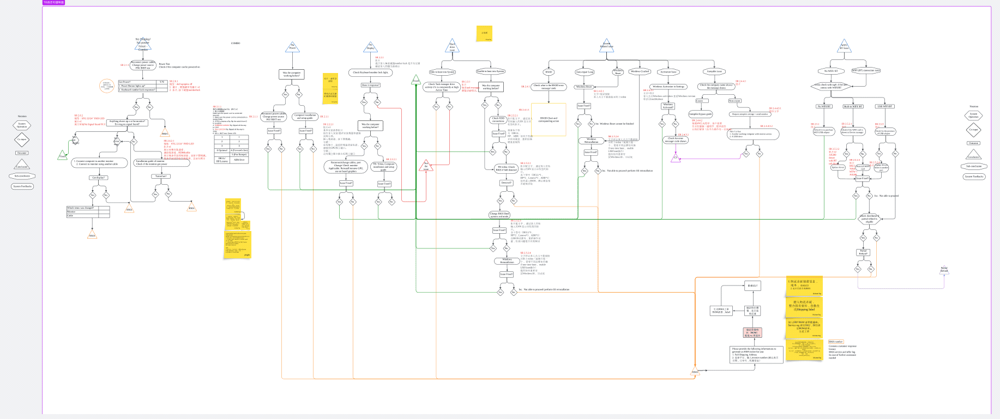
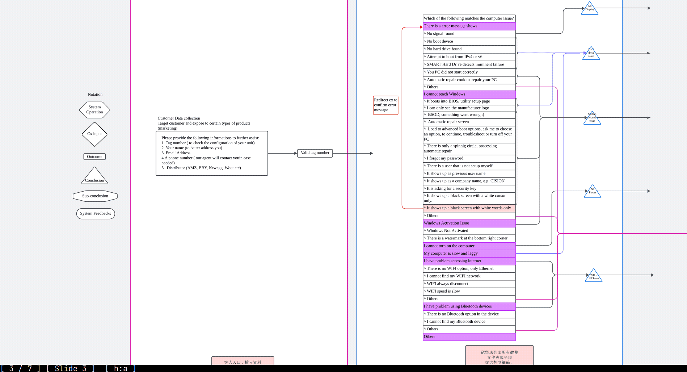
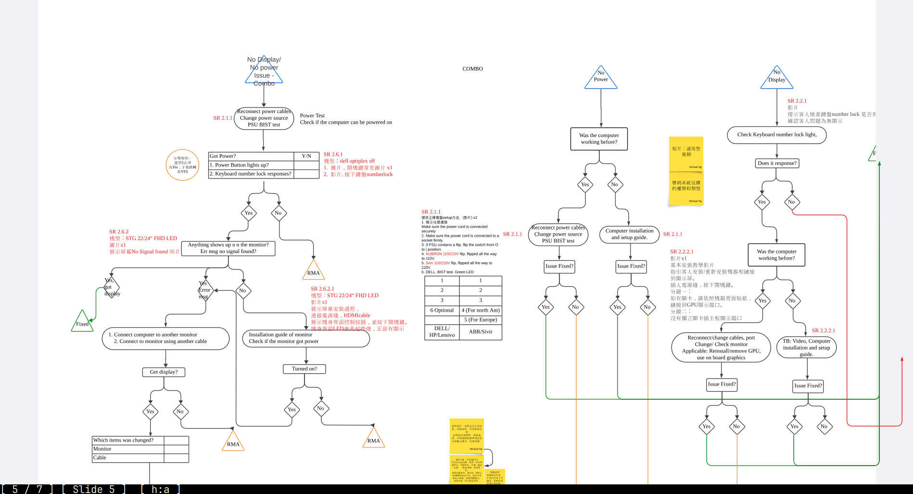
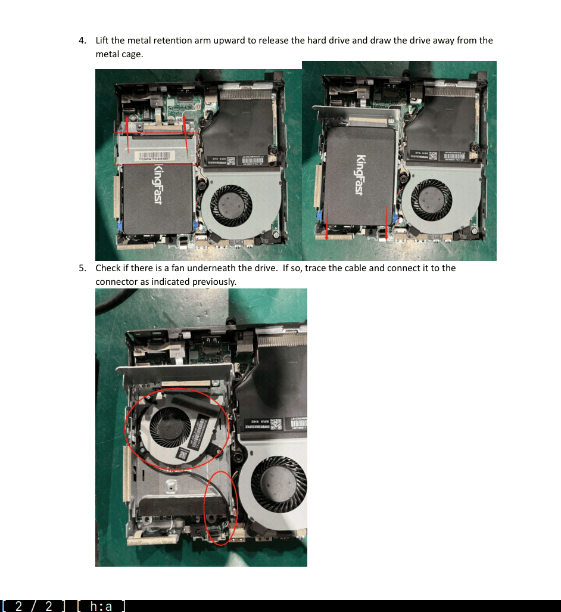
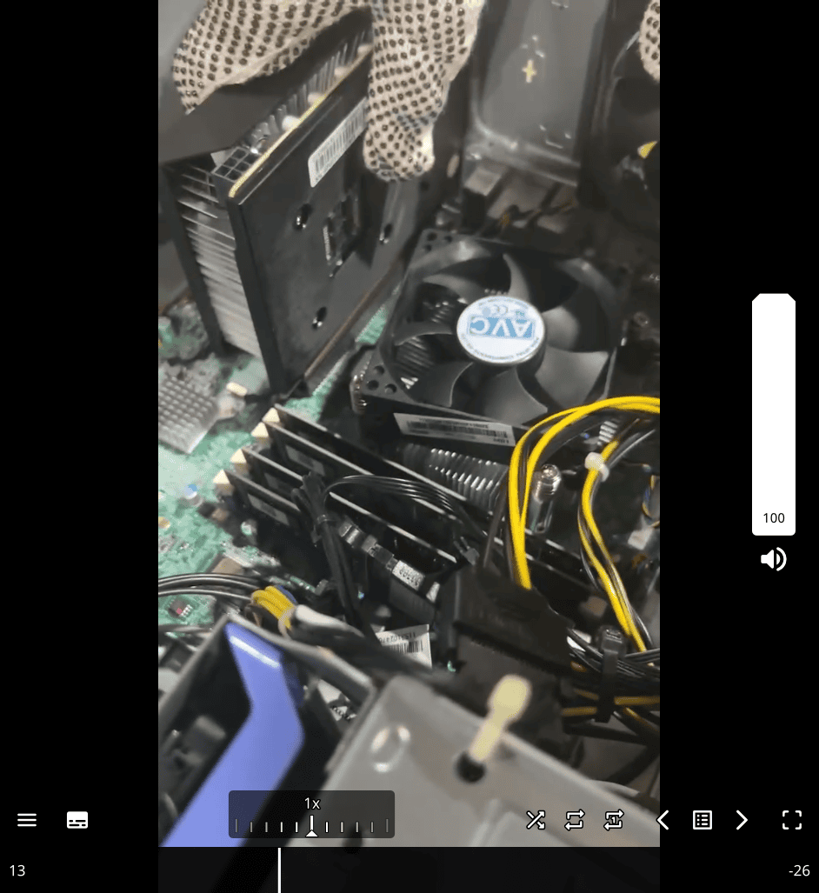
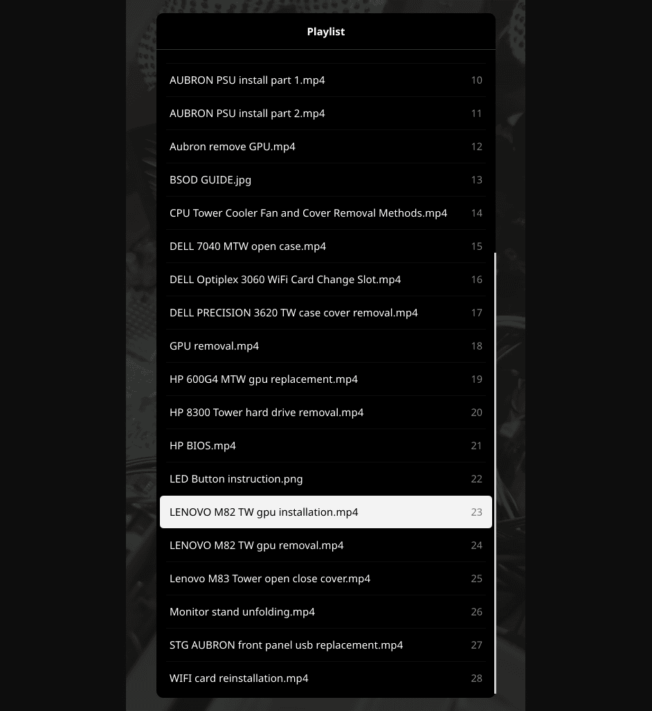
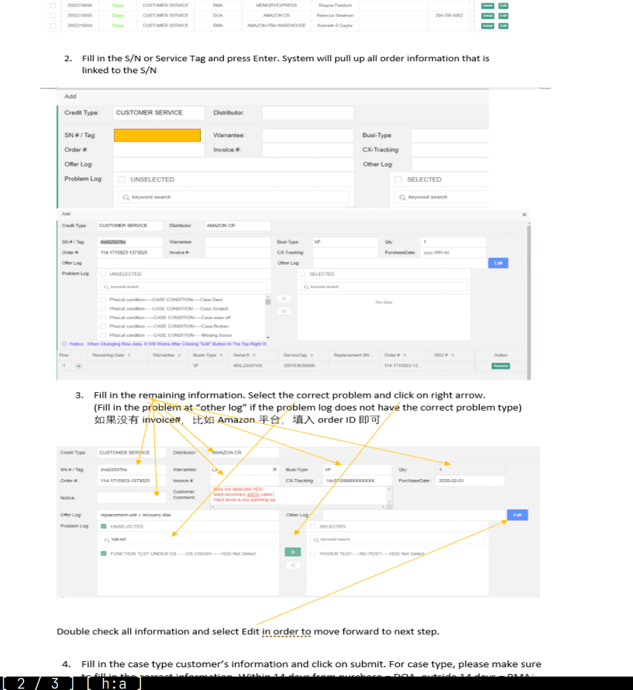
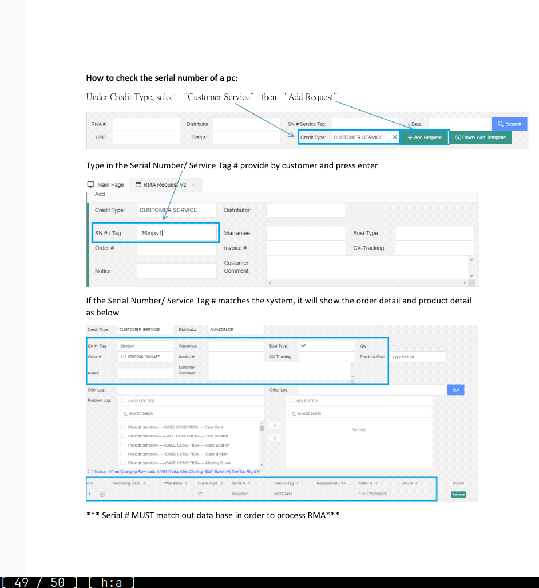

# it-support-experience

- Provided technical support for both hardware and software issues, ensuring minimal downtime for users.
- Handled ERP-related tasks, including processing RMAs, inventory checks, and managing internal communications via email.
- Generated and reviewed detailed reports to ensure data accuracy and inventory consistency.
- Conducted in-depth product analysis using SQL and Excel to identify specific component details (e.g., CPU type, motherboard version).

- Start from the most fundamental/most common case
  - it save times and kind of standardize the working procedure

- then look for according files (like bios, manual from specifics model)

Like:

# Big TB area(Troubleshooting)

### **1/CPU Fault:**

- **Symptoms:**
  - No display on boot, screen flickering, system crashes, blue screen.
  - System keeps restarting automatically.
  - Alarm sounds.
  - Program crashes.
  - Frequent crashes.
  - Overheating.

### **CPU Fault Troubleshooting:**

1.  **Hardware Testing:**

    - Since the motherboard and CPU cannot be cross-tested, prioritize troubleshooting other hardware issues first.

2.  **Check the Cooling System:**

    - Regularly clean the dust from the heat sink and ensure the CPU fan is working properly.

---

### **2/ Motherboard Fault:**

- **Symptoms:**
  - Computer won't power on.
  - System instability.
  - Hardware devices not recognized.
  - Boot-up self-test error messages.
  - Flashing indicator lights on the motherboard.
  - Suspected physical damage to the motherboard.
  - CMOS battery replacement doesn’t resolve the issue (system still loses information).
  - Problems persist even after replacing memory or graphics card.
  - Missing drivers.
  - Beep codes on startup (e.g., HP: one long and one short beep, Lenovo: rapid beeping, Dell: no sound, AIO: no sound).

### **Motherboard Fault Troubleshooting:**

1.  **Hardware Testing:**

    - Since the motherboard and CPU cannot be cross-tested, prioritize troubleshooting other hardware issues first.

2.  **Cleaning Method:**

    - Use compressed air or a hairdryer with cool air (avoid using a brush) to gently blow dust off the motherboard.
    - Reconnect and reseat any motherboard connections.

3.  **Visual Inspection:**

    - Carefully examine the motherboard for any burnt, deformed, or detached components, or any areas showing abnormal discoloration.

### **3/Memory Fault:**

- **Symptoms:**
  - The computer powers on (lights and fans are working), but there is no display / black screen.
  - Any electronic component can potentially cause boot failure due to issues such as poor contact.
  - Artifacts on the screen (irregular / random patterns).
  - System crashes, blue screen.
  - Boot loops (repeated restarts), applicable to new machines (AIO and gaming PCs).
  - System instability, poor compatibility, system errors (e.g., error messages from specific software or overall system lag).

### **Memory Fault Troubleshooting:**

1.  **Reseat the Memory Module:**
    - Remove and reinsert the memory stick (ensure it does not touch the contacts directly).
2.  **Gold Finger Oxidation:**
    - **Cleaning:** Use an eraser, alcohol, and a dry towel to gently clean the gold fingers (the contact points on the memory module).
3.  **Cross-Testing Memory (If multiple sticks are present):**
    - If you have two or more memory modules, test them by swapping their slots.
    - Steps:
      1.  Turn off the computer and unplug the power cable.
      2.  Remove one memory stick.
      3.  Power on the computer and check if the system operates normally. Verify if blue screens or crashes continue.
      4.  If problems persist, test the other memory stick or alternate between them to identify the faulty module.
4.  **If Only One Memory Stick:**
    - Clean the gold fingers or try inserting it into a different memory slot.

**Memory Stick Troubleshooting Steps:**

1.  Power off and open the chassis.
    - Disconnect the power and remove the side panel or glass cover.
2.  Remove the memory stick, gently clean it with an eraser or towel.
3.  Reinsert the memory stick and power on the system to check if it resolves the issue.
4.  If the issue persists, swap slots or try a different stick.

---

### **4/ Graphics Card Fault:**

- **Symptoms:**
  - Artifacts on the screen (regular patterns).
  - Flickering screen.
  - No display on boot.
  - No response on boot (electronic short circuit).
  - Error with the graphics card on startup.

### **Graphics Card Troubleshooting:**

1.  **Clean the Gold Fingers:**
    - Power off the computer, open the chassis, and remove the graphics card.
    - Clean the gold fingers with an eraser or dry cloth.
    - Reinstall the card and secure it in place.
2.  **Reconnect and Test:**
    - Power on the system and check if the issue persists.

---

### **5/ Hard Drive Fault:**

- **Symptoms:**
  - System crashes, blue screen.
  - Unable to boot into the system (YouTube videos not working).
  - Boot errors indicating hardware problems (e.g., issues with fans or graphics card).
  - No system detected (e.g., no boot found, often due to missing hard drive).
  - System freezes at BIOS, keyboard unresponsive.
  - Slow read/write speeds or abnormal sounds (common in refurbished machines or mechanical hard drives).

### **Hard Drive Troubleshooting:**

1.  **Check Hardware Connections:**

    - Ensure the hard drive is correctly connected to the computer, including data and power cables. For external drives, try changing USB ports or cables.

2.  **Restart the Computer:**

    - A simple restart can sometimes resolve temporary hardware or software conflicts.

3.  **Software Troubleshooting:**

    - Ensure the operating system is running properly and update drivers as needed.
    - Use Disk Management in Windows to check the hard drive status and perform necessary actions.

4.  **Disk Management Tool:**

    - Use Windows Disk Management (WIN+X) to check the drive’s status, and if necessary, partition or format the drive.

---

### **6/ Power Supply Fault:**

- **Symptoms:**
  - Computer does not power on.
  - Unstable restarts or shutdowns.
  - No response on boot.

### **Power Supply Troubleshooting:**

1.  **Check Power Cable Connection:**

    - Make sure the power cable is securely plugged in and check for damage or poor connection.

2.  **Power Indicator Lights:**

    - Verify if the power indicator light on the front of the chassis is on to confirm power supply is working.

3.  **Check Power Switch Setting:**

    - Ensure the power switch is set to the correct position (for 110v or 220v).

4.  **Voltage Check:**

    - If the voltage is not set correctly, it can cause issues like:
      - Device failing to start or shutting down immediately.
      - Unstable operation or crashes.
      - Slow system performance or program crashes.
      - Risk of electrical hazards (burning, explosions).

---

### **7/ Monitor Fault:**

- **Symptoms:**
  - Artifacts on the screen, flickering, or black screen.
  - No response on boot.

### **Monitor Troubleshooting:**

1.  **Check Display Indicators:**

    - Ensure the power indicator and the screen light up. Verify the power cable and switch are intact and properly connected.

2.  **Test Display Settings:**

    - After turning on the system, adjust the resolution and display settings via the system settings to default values.

3.  **Cross-Test the Monitor:**

    - Disconnect the monitor, restart it, and check if it runs its self-test.
    - Update or reinstall the graphics card drivers if necessary.

---

### **8/ CMOS Battery Fault:**

- **Symptoms:**
  - No response on boot (due to overvoltage protection).
  - Automatic boot on power connection without pressing the power button.
  - System time resets when the power is unplugged.

### **CMOS Battery Troubleshooting:**

1.  **Check CMOS Battery Status:**
    - Disconnect the power, wait for 10-30 seconds, then reconnect. If the system time resets or the machine powers on automatically, the CMOS battery may need replacing.

---

### **9/ Video Cable Fault:**

- **Symptoms:**
  - No display on boot.
  - Flickering or artifacting on the screen.

### **Video Cable Troubleshooting:**

1.  **Check the Cable Condition:**
    - Verify that the video cable is not damaged or loose.
2.  **Change the Cable Type:**
    - Try swapping between different video cable types (e.g., VGA, HDMI, DisplayPort) and ensure the connection is secure.
3.  **Check Cable Version:**
    - Make sure the video cable supports the necessary version for your monitor and graphics card.

---

- follow the mindmap or excel common issue
- if can't be fixed, doing RMA return merchandise authorization in ERP system
- ERP procedure -> template email -> finish

---

## ERP experience:

- handling Canada , USA, EU case, including generating report, making RMA return
  merchandise authorization, Sales report, Checking goods and replying email.

---

## Sound Fix

1. Press the WinKey+X, a menu should pop up on the lower left side of the screen. Select "Device Manager". 2. In the Device Manager, under "Sound, video and game controllers", uninstall every device you see under that category. Once you have uninstalled everything. Restart the computer. 3. As the computer is restarting, hold down F10. This should get you into the computer setup screen. If it doesn't you will have to restart the computer again once you reach the login screen. 4. In the BIOS menu, File > Apply Defaults and Exit > F10=Yes 5. When you login and reach the desktop, the drivers should be automatically downloaded and reset. 6. If you the sound issues persists, continue on to the next step. 7. At the login screen. Hold down the shift key, and select restart. Do not let go of the shift key. 8. You may left go of the shift key when you reach a blue menu. At this menu select Troubleshoot > Reset this PC > Keep my files > Select account name and enter password > Reset. After the process it complete you should be back at the login screen. Please let us know if these methods were able to resolve the issue. If not, we will have to process a RMA to cross-ship a replacement unit. Regards, AST Customer Support

**legacy driver**, which is a term used for older software drivers that were designed for hardware from previous generations. Legacy drivers are often intended to support outdated devices or systems that may not be fully compatible with modern hardware or software updates.

---

## Realtek sound issue

[Realtek HD Audio Manager Not Working or Showing on Windows 11/10 FIX [Tutorial] - YouTube](https://www.youtube.com/watch?v=DTVZPTe65qE)
If your drivers are corrupted or not properly installed, your Realtek Audio Manager can malfunction. However, there’s a way to fix this problem.

show hidden devices from view
update driver of hidden sound, add legacy driver -> sound, video and gaming.

didn't tried but could be useful

[How to Install Realtek HD Audio Driver on Windows 11/10 & Lower - YouTube](https://www.youtube.com/watch?v=Pn50nxNd_38) msi setting as well

browser the driver locally

if old mechine ,

- it could be legacy driver issue.

[How to install Legacy Driver on Windows 10 - YouTube](https://www.youtube.com/watch?v=oyL9jGhuuX8&ab_channel=IgoroTech)

## no display

- check power, elecitity
- **search for the cx got internal graphical card, make sure cx are using gpu dp port rather than internal vga (blue) port for displaying**
- if it is new mechine, there is highly that the mechine is fine
- seldom case: bios didn't enable the port
- sometime, company provide hdmi to dp port , or hdmi to hdmi with dp adapter etc

Case 2 , if the pc got internal gpu card ,
extract the gpu card (external) and use internal card to determine weather it is the problem of our graphic card

- if the monitor is ok, it is mostly likely 90% the issue of gpu card, L4 gpu to cx

## Black screen

- date of time ..., date of datem, -> cmos battery running out of battery
- no ram, -> error message when booting the pc
- hard disk? -> bios detect the hard disk or not
- fans -> rear fans is actually in the front fans

## USB

- suggest client use another port first
- some product (can't detect the usb port, built in motherboard -> L2,
- newest product like 6 version usually port connected to motherboard , can't seperately fix it
- if using for a while , just demaged in the front usb port rather than in motherboard -> only the front usb port

## Graphical card

- if the pc got the graphical card while also having the internal vidow card -> vga wont' work -> no display

## Stuck at ping (just at the moment)-> (offline account)

[No Microsoft Account Needed: How to Set Up Windows With a Local Account | PCMag](https://www.pcmag.com/how-to/how-to-set-up-microsoft-windows-with-local-account)
File: How to Create an Offline account.pdf

[Set up Windows 11 without internet - oobe\bypassnro - Microsoft Community](https://answers.microsoft.com/en-us/insider/forum/all/set-up-windows-11-without-internet-oobebypassnro/4fc44554-b416-4ecb-8961-6f79fd55ae0f)

## Reset Window

[The User Profile Service failed the sign in User profile cannot be loaded in Windows 10 / 11 - Fix ✅ - YouTube](https://www.youtube.com/watch?v=hJ0fefP2ffU)

[How To Reset Windows 10 From The Login Screen - YouTube](https://www.youtube.com/watch?v=Iwvo0cgldlw)

Follow the ms guide , auto installing bootable window

making sure the usb is bootable , bios setting etc

nfts is better format for usb format

Reset guideline,

Focusing on founding the issue only , don't go for the solution. just give bunch of the solution email.

Currently, I don't have any solution according to your case, I will send you the email with the better solution.
Or, I will have to talk with other technical team for further guildline and instruction, I will call you back in 10 minutes, is it ok?

## Reset BCD in the window through command line

[How to Rebuild the BCD in Windows](https://www.lifewire.com/how-to-rebuild-the-bcd-in-windows-2624508)

## reinstall window

Checklist 1. USB drive 8GB or larger capacity 2. Access to a functioning computer 3. Access to the internet

[How to Install Windows 10 from a USB Flash Drive - YouTube](https://www.youtube.com/watch?v=SKbR6XT7fcA&t=236s)

### Reinstall window without software or bootable media using only command line

[2024 Reset Windows 10 Password without Software or Bootable Media using only Command Line - YouTube](https://www.youtube.com/watch?v=4ZhA0C2YVw0)
