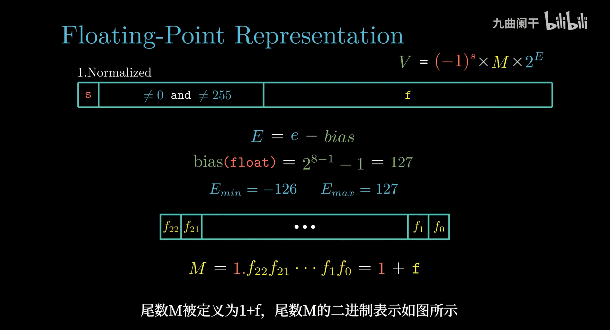
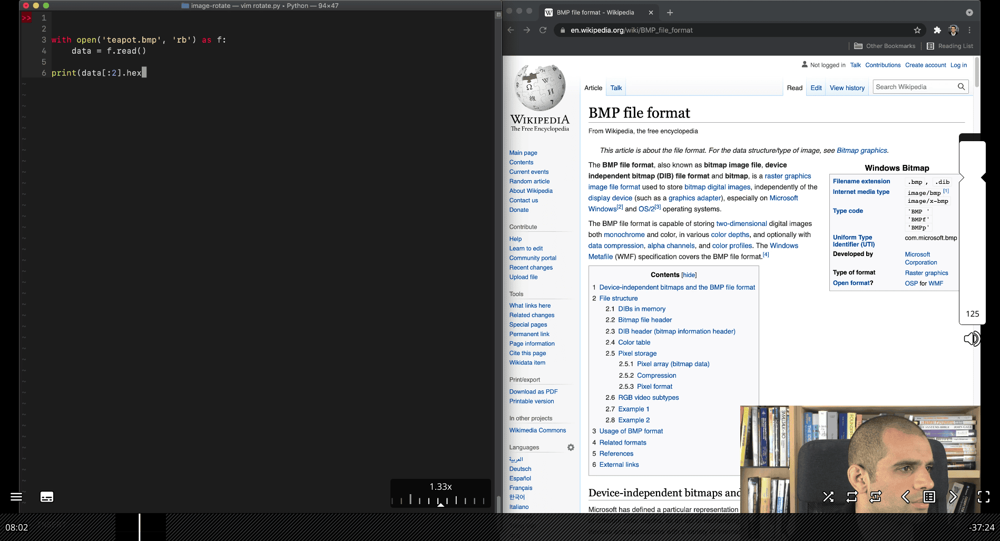

# csprimer-computersystem-concept_2


bitwise or , into user and admin permission => both permission in a number way

bitwise or -> turn on
bitwise and -> take the number range you want

bitwise xor -> only 1 when A or B , but not A and b (special or)

- useful in encryption


cyper text

xor with the key twice to encode and decode

not -> eg. you want to find out what the permission you don't have, just `not` your permission binary

---


Let me explain the concept of signed bits and two's complement, which seems to be what your teacher is demonstrating with the image.

### Signed Bits and Two's Complement

In computing, numbers are represented using binary digits (bits). When dealing with signed numbers (numbers that can be positive or negative), a common method is **two's complement**, which allows the same binary representation to handle both positive and negative values efficiently.

- **Signed Bit**: The leftmost bit (most significant bit) in a binary number is used to indicate the sign. Typically, 0 represents a positive number, and 1 represents a negative number.
- **Two's Complement**: This is a way to represent negative numbers. To find the two's complement of a number:
  1. Invert all the bits of the positive number (change 0s to 1s and 1s to 0s) – this is the one's complement.
  2. Add 1 to the result of the one's complement.
     This gives the binary representation of the negative number.

For a 4-bit system (as shown in your image), the range of numbers is from -8 to +7.

### Interpreting the Image

Your image shows a 4-bit binary number `1111` and associates it with `-8`. Let's break it down:

- In a 4-bit two's complement system, the possible values range from:

  - `0000` = 0
  - `0001` = 1
  - `0010` = 2
  - ...
  - `0111` = 7
  - `1000` = -8
  - `1001` = -7
  - ...
  - `1111` = -1

- The key point is that when all bits are 1 (`1111`), it represents the most negative number in the range, which is `-1` in this context for a 4-bit system. However, your teacher might be illustrating a specific case or a misunderstanding/mistake. Let's clarify:
  - For `1111` in a 4-bit two's complement:
    - Invert the bits: `0000` (one's complement of `1111`).
    - Add 1: `0001`, which is 1.
    - But since the sign bit is 1, it indicates a negative number. The correct two's complement of `0001` (which is 1) is `1111`, meaning `-1`.
  - The value `-8` typically corresponds to `1000` in a 4-bit system, not `1111`. This suggests your teacher might have meant to show the range or made an error in labeling.

### Why `-8` and Representing Numbers Less Than -1

- The number `-8` is the minimum value in a 4-bit two's complement system because `1000` represents `-8` (the sign bit is 1, and the magnitude is derived from the two's complement process).
- To represent numbers less than -1, the two's complement method adjusts the binary representation. For example:
  - `-2` is `1110` (invert `0010` to `1101`, add 1 to get `1110`).
  - `-3` is `1101` (invert `0011` to `1100`, add 1 to get `1101`).
  - This pattern continues, with `1000` being `-8`.

### Your Teacher's Point

Your teacher is likely trying to show how two's complement represents negative numbers, including those less than -1. The image seems to illustrate the binary sequence (`1110`, `1101`, `1100`) mapping to `-2`, `-3`, `-1`, and possibly `-8` as the extreme case. The mention of `1111` meaning `-8` might be a typo or a miscommunication—`1111` should be `-1`, while `1000` is `-8`. They might be emphasizing the full range of the 4-bit system, where `-8` is the lowest value.

If this doesn't fully clarify your teacher's intent, feel free to ask more, and I can offer to search for additional examples if needed!

---

- invert the positiev number of -3 and add 1 to get that

To convert 1111 to -1:

    Invert: 0000

    Add 1: 0001

    That’s 1, so result is -1

This is the two’s complement method in reverse.

---


> > > twos_complement('1010')
> > > -6
> > > twos_complement('1001')
> > > -7
> > > twos_complement('1000')
> > > -8

- when you subtract 1 more , it get closing to middel position point, 1000 (-8), it go up in the picture, (negative
  number)

it created a way to represent numeber that can operate in math operator while also easy to flip and adjust

why overflow happen:
Suppose you have a 16-bit signed integer x initially set to a small positive value, say 1000. In binary (for 16 bits), this is 00000000 00000111 11001000.

    Left Shift by 5 (x << 5): This multiplies x by 2^5 = 32, resulting in 1000 * 32 = 32,000.
    Binary calculation: Shifting left 5 positions gives 00000111 11001000 00000000, but since it’s 16 bits, the leftmost bits are truncated. The result becomes 11001000 00000000, which is 40,960 in unsigned terms. However, in signed two's complement, the leading 1 makes it a negative number.
    Converting 11001000 00000000 to signed:
        Invert bits: 00110111 11111111.
        Add 1: 00111000 00000000 = 14,336.
        Since the original was negative (due to the sign bit), the value is - (2^16 - 14,336) = -40,960 + 14,336 = -26,624 (approximate, depending on exact overflow handling).

Preventing Overflow Bugs

    Use a larger data type (e.g., 32-bit instead of 16-bit) if possible.
    Check for overflow before shifting (e.g., ensure x << n won’t exceed the max value).
    Use unsigned integers if negative values aren’t needed, though this changes the wrap-around behavior.

---


- how utf8 work

- first 1 and its 1 kind, is kind of determine of how many parts

- U+ -> hex values

1111(4 parts) have enough space form 5 hex value


- float can show more

  Scientific Notation: Floating-point numbers are stored in a form similar to n=a×10bn=a×10b, where:
  aa is the mantissa (a fractional value, typically between 1 and 10 in base 10, or 1 and 2 in base 2 for computers).
  bb is the exponent, which scales the number.
  In computers, this is adapted to base 2: n=m×2en=m×2e, where mm is the mantissa and ee is the exponent, but the concept is similar.
  Purpose: This format allows floating-point to represent a wide range of numbers by adjusting the exponent, far beyond a simple integer range like 0 to 99.

Why 0 to 9 Billion (Not 0 to 99)?

    Range Extension:
        An integer range like 0 to 99 (or even 0 to 2^31 - 1 ≈ 2 billion for 32-bit integers) is limited by the fixed number of bits.
        Floating-point, using a×10ba×10b, can represent much larger numbers. For example:
            9 billion = 9×1099×109, where a=9a=9, b=9b=9.
        This format lets you scale to billions, trillions, or even much smaller numbers (e.g., 1.23×10−51.23×10−5) by changing bb, which is impossible with a fixed range like 0 to 99.

"Closest Number to 9B is 8B" – What They Mean

Your teacher’s statement about the "closest number to 9 billion being 8 billion" in floating-point is likely illustrating the loss of precision at large magnitudes due to the limited number of digits in the mantissa aa.

    Mantissa Precision:
        In floating-point, the mantissa aa (or its base-2 equivalent) has a fixed number of significant digits. For example:
            32-bit float (single precision) has about 7 decimal digits of precision.
            64-bit float (double precision) has about 15-16 decimal digits.
        When you represent 9 billion (9×1099×109), the mantissa might be normalized to 9.09.0, with an exponent b=9b=9.

---

> don't use floating point in currency!!!!!!!!!!🔥

        Actually, people **don’t** recommend using floating-point numbers for currency calculations—quite the opposite! Your teacher or a source might have mentioned this in error, or it could be a misunderstanding. Let’s clarify why floating-point is **not** ideal for currency and what you should use instead.

### Why Floating-Point is Bad for Currency

        Floating-point numbers (e.g., IEEE-754 format) are great for a wide range of values and approximations, but they have significant drawbacks when it comes to currency:

        1. **Precision Issues**:
           - Floating-point uses a limited number of bits for the mantissa (e.g., 23 bits for 32-bit, 52 bits for 64-bit), which provides only about 7 or 15 decimal digits of precision.
           - This can lead to **rounding errors**. For example, adding 0.1 + 0.2 in floating-point might not exactly equal 0.3 due to binary approximation (it’s approximately 0.30000000000000004).
           - In currency (e.g., dollars and cents), you need exact values (e.g., $1.23), and even tiny errors can accumulate over many transactions.

        2. **Non-Deterministic Results**:
           - Floating-point operations can vary slightly across different systems or compilers due to how they handle rounding, leading to inconsistent results (e.g., $10.00 might become $9.9999999 on one machine).
           - Currency calculations need to be exact and reproducible.

        3. **Representation of Decimals**:
           - In binary, some decimal fractions (like 0.1) cannot be represented exactly, leading to small inaccuracies. This is a fundamental limitation of base-2 floating-point when dealing with base-10 currency.

        4. **Example**:
           - Suppose you calculate 1.10 - 1.00. In floating-point, it might result in 0.09999999999999998 instead of 0.10 due to rounding.
           - For a financial system, this could mean losing or gaining fractions of a cent, which adds up over millions of transactions.

### What Should You Use for Currency?

        Instead of floating-point, the recommended approach for currency is to use **integers** or **fixed-point arithmetic**, often with the following methods:

        1. **Store in Cents as Integers**:
           - Represent amounts in the smallest unit (e.g., cents instead of dollars). So, $1.23 becomes 123 cents.
           - Use a 32-bit or 64-bit integer (e.g., `int` or `long` in programming languages), which can handle up to 2.1 billion or 9 quintillion units, far exceeding typical currency needs.
           - Perform all calculations in cents, then convert to dollars only for display (e.g., 123 / 100 = $1.23).

        2. **Fixed-Point Arithmetic**:
           - Use a fixed number of decimal places (e.g., 2 for cents) and scale all operations accordingly.
           - Libraries or custom code can handle this, ensuring exact arithmetic without floating-point’s imprecision.

        3. **Decimal Data Types**:
           - Some languages (e.g., Python with `decimal`, Java with `BigDecimal`, or C# with `decimal`) offer built-in decimal types designed for exact decimal arithmetic. These avoid binary floating-point issues and are ideal for currency.

### Why the Misconception?

        - Your teacher might have said "use floating-point" in a different context (e.g., scientific calculations) and it got mixed up with currency.
        - Alternatively, they might have meant "floating-point can handle large numbers like billions," but didn’t clarify it’s unsuitable for exact financial precision.
        - In casual use (e.g., quick estimates), people might use floats for currency, but this is bad practice in professional software.

### Practical Example

        - **Floating-Point**:
          - `1.10 - 1.00` might give `0.09999999999999998`.
          - After 1,000 transactions, errors could accumulate to a noticeable amount.

- `110 - 100 = 10` cents, exactly $0.10. - **Integer (Cents)**: - No rounding errors, perfect for accounting.

### Key Takeaway

        - **Don’t use floating-point for currency** due to precision and rounding issues.
        - Use **integers (in cents)** or **decimal types** for exact calculations. This is a standard practice in financial software to ensure accuracy and compliance (e.g., with tax or banking regulations).

        If your teacher emphasized floating-point for currency, it might be worth asking them to clarify—perhaps they meant a different scenario! Let me know if you’d like code examples to compare!

---

Great question. Scientists and engineers use **significant digits**, **mantissas**, and **floating-point numbers** for **precision**, **scale**, and **efficiency** when dealing with **very large or very small numbers**. Let’s break down the **math concepts** behind why and how they use these.

---

## 🔹 Why Use Significant Digits & Floating-Point?

### 1. **Real-World Measurements Have Limits**

- Scientific data comes from **measurements** (like time, distance, mass), which are **never exact**.
- You don’t need infinite decimal places to say the Earth is 149,600,000 km from the sun — you might just say **1.496 × 10⸠km**.
- **Significant digits** express how **precise** a measurement is. If you write 1.50 vs. 1.5, it shows a higher degree of certainty.

---

## 🔹 Floating-Point Representation: The Math Behind It

### A floating-point number is written like:

```
± mantissa × base^exponent
```

In **binary floating point**, it looks like:

```
± 1.mmm... × 2^e
```

### Example:

Let’s represent **6.25** in binary floating-point:

1. **Binary of 6.25** = `110.01`
2. Rewrite in normalized form:
   → `1.1001 × 2^2`
3. So:

   - **Mantissa** = `1.1001` (significant bits)
   - **Exponent** = `2` (shows scale)

This is how computers **efficiently store real numbers**, even with huge/small values (e.g., mass of an electron = 9.1×10â»Â³Â¹ kg).

---

## 🔹 Benefits of Floating Point in Science

| Concept                 | Why It Matters                                                                    |
| ----------------------- | --------------------------------------------------------------------------------- |
| **Dynamic range**       | Can represent both very big and very small numbers (e.g. from atoms to galaxies). |
| **Precision control**   | Only keeps as many digits as needed (saves memory).                               |
| **Scientific notation** | Helps express the order of magnitude (powers of 10 or 2).                         |
| **Error handling**      | Helps quantify round-off and approximation errors clearly.                        |

---

## 🔹 Summary: Why Scientists Use Mantissa & Significant Digits

- They **reflect measurement accuracy**.
- Help **track error propagation** in calculations.
- Enable **compact representation** using scientific notation or floating-point format.
- Computers and scientific instruments often **use IEEE floating-point** (with mantissa + exponent) for storing real-world values.

Here’s the key idea:

---

## 🔹 Why Use `1.xxxx × 2â¿` Instead of Just `110.01`?

### 1. **Normalization for Consistency**

- Just like scientific notation always writes numbers as `1.23 × 10â´` instead of `12300`, binary floating-point uses a **normalized form**:

  ```
  1.mantissa × 2^exponent
  ```

- This ensures that **every number has one and only one representation**, starting with **1.** — reducing ambiguity and improving comparison.

---

### 2. **Efficient Storage (IEEE 754 Standard)**

- Computers use **fixed-length binary formats** (like 32-bit float or 64-bit double).
- In IEEE 754:

  - 1 bit = sign
  - 8 bits = exponent (for float)
  - 23 bits = fraction (mantissa bits **after** the leading `1.`)

> That leading `1` is **implied**, so it's not stored — saving 1 bit! That’s why normalization to `1.xxx` is essential.

---

### 3. **Better Precision and Range**

- Using `1.1001 × 2²` allows the floating-point format to **separate the scale (exponent)** from the **precision (mantissa)**.
- That enables:

  - Very **large** numbers (e.g., 10²â°)
  - Very **small** numbers (e.g., 10â»Â³â°)
  - **Efficient use** of the bit space — no wasted bits on redundant leading 0s or 1s

---

### ✅ Comparison:

| Representation | Pros/Cons                            |
| -------------- | ------------------------------------ |
| `110.01` (raw) | Unnormalized, ambiguous, not compact |
| `1.1001 × 2²`  | Standardized, compact, precise       |

---

### 📌 Summary:

We use `1.1001 × 2²` (normalized scientific form) because it:

- Ensures **a unique and consistent** binary representation
- Enables **efficient computer storage** using the IEEE standard
- Separates **precision (mantissa)** and **scale (exponent)** cleanly

Would you like me to show exactly how `6.25` is stored in IEEE 754 32-bit format?

---

Totally fair — **12300** _feels_ simpler and more familiar because it’s the regular decimal form we use every day. But in math, especially **science and computing**, using **scientific notation** like `1.23 × 10â´` (or `1.1001 × 2²` in binary) has important advantages.

Let me explain in more detail **why normalized scientific form is used**, even though `12300` seems simpler at first glance.

---

## 🔹 The Problem with Just Using 12300

Let’s take **12300** as an example. It can be written many different ways:

- 12300
- 1230 × 10¹
- 123 × 10²
- 12.3 × 10³
- 1.23 × 10ⴠ✅ ↠This is the **normalized** form

All of these are _mathematically equal_, but they are **not consistent**. So:

### â— Without normalization:

- You could represent the same number in many ways
- Computers or formulas might **misalign** digits or lose precision
- Storage and comparison become inefficient or error-prone

---

## 🔹 Why `1.23 × 10â´` Is Better (Normalized Form)

The **normalized scientific notation** always moves the decimal to have:

```
1 digit before the decimal point
```

### ✅ This helps because:

| Advantage                     | Explanation                                                                                      |
| ----------------------------- | ------------------------------------------------------------------------------------------------ |
| **Consistency**               | Every number is stored the same way: `1.xxxxx × 10^n` (or `2^n` in binary)                       |
| **Precision isolation**       | You can clearly see the significant digits (`1.23`) and separate them from the magnitude (`10â´`) |
| **Computer-friendly**         | Floating-point hardware expects the `1.xxx` form — this lets it skip storing the leading `1`     |
| **Easy comparison & sorting** | You can compare just exponents first, then mantissas                                             |

---

## 🔹 Binary Case: Computers Need Order

In **binary**, this is even more critical. Imagine storing a number like `0.0000000011` — tons of leading zeros!

Instead, you write:

```
1.1 × 2â»â¹
```

That removes all the leading zeros, keeps only the important digits, and captures the scale with the exponent.

---

## 🔹 Human vs. Machine Preference

- **Humans** prefer `12300` because it's readable.
- **Scientists and computers** prefer `1.23 × 10â´` because it's **standardized**, **precise**, and **scalable**.

---

### ✅ Final Analogy:

Think of `12300` like shorthand writing.
Think of `1.23 × 10â´` as **blueprint format**: it tells both **what the number is** and **how big it is**, precisely and compactly.

Would you like me to walk you through how a number like `12300` is stored in binary floating point (step-by-step)?


- there is special cases in the part of the exponent , like all 0, and all 1

in his example , he is trying for -2 as exponent


- doesn't matter how many 0 after as long as it represent how many fraction number ?


there are still many ways to represent the same thing ,
in cs :

- do want duplicate things, many different ways to represent it (**waste memory**)
- hard to compare , as there is different forms

---

Let’s manually convert the floating-point number **9.75** into its IEEE-754 32-bit single-precision format in a simple, step-by-step way. As a computer science student, this will help you understand how computers store decimal numbers. We’ll break it down into easy chunks!

---

### What is IEEE-754 32-Bit Format?

- **Total Bits**: 32.
- **Structure**:
  - **1 bit** for the **sign** (0 for positive, 1 for negative).
  - **8 bits** for the **exponent** (with a bias of 127).
  - **23 bits** for the **mantissa** (fractional part, with an implied leading 1).
- **Formula**: `(-1)^sign × 1.mantissa × 2^(exponent - 127)`.

Since 9.75 is positive, the sign bit will be 0. Let’s proceed!

---

### Step 1: Convert 9.75 to Binary

We need to express 9.75 in binary to work with the mantissa and exponent.

- **Integer Part (9)**:

  - Divide by 2 repeatedly and note remainders:
    - 9 ÷ 2 = 4 remainder **1**
    - 4 ÷ 2 = 2 remainder **0**
    - 2 ÷ 2 = 1 remainder **0**
    - 1 ÷ 2 = 0 remainder **1**
  - Read remainders bottom to top: **1001**.

- **Fractional Part (0.75)**:

  - Multiply by 2 and take the integer part:
    - 0.75 × 2 = 1.5 → **1**
    - 0.5 × 2 = 1.0 → **1**
  - Stop when the fraction is 0: **.11**.
  - So, 0.75 in binary is **0.11**.

- **Combine**: 9.75 = **1001.11** in binary.

---

### Step 2: Normalize to Scientific Notation (Base 2)

In IEEE-754, we normalize the number to the form **1.mantissa × 2^exponent**.

- Move the binary point so there’s a single **1** before it:

  - **1001.11** = **1.00111 × 2^3**.
  - We shifted the point 3 places right, so the exponent is **3**.

- **Mantissa**: After the 1., it’s **00111** (the fractional part).

---

### Step 3: Assign the Bits

Now, let’s fill in the IEEE-754 32-bit format.

1. **Sign Bit**:

   - 9.75 is positive, so **sign = 0**.

2. **Exponent**:

   - The exponent is 3, but IEEE-754 adds a **bias of 127** to handle negative exponents.
   - Stored exponent = 3 + 127 = **130**.
   - Convert 130 to 8-bit binary:
     - 128 = 10000000
     - 2 = 00000010
     - 130 = **10000010**.

3. **Mantissa**:
   - Take the fractional part after the 1.: **00111**.
   - Pad with zeros to 23 bits: **00111 0000000000000000000** (since 00111 is 5 bits, add 18 zeros).
   - The leading 1 is implied, so we only store the fractional part.

- **Total Mantissa**: **00111000000000000000000** (23 bits).

---

### Step 4: Combine All Bits

- **Sign**: 0 (1 bit).
- **Exponent**: 10000010 (8 bits).
- **Mantissa**: 00111000000000000000000 (23 bits).
- **Full Binary**: **0 10000010 00111000000000000000000**.

---

### Step 5: Verify

Let’s check if this works:

- Sign = 0 (positive).
- Exponent = 130 - 127 = 3.
- Mantissa = 1.00111 (implied 1 + 00111).
- Value = 1.00111 × 2³.
  - 2³ = 8.
  - 1.00111 × 8:
    - 1 × 8 = 8.
    - 0.00111 × 8 ≈ 0.05625 (since 0.00111 in binary is 0.75 / 8 = 0.09375, but let’s compute exactly):
      - 0.00111â‚‚ = 0.75 (from earlier binary).
      - 0.75 × 8 = 6.
    - Total ≈ 8 + 0.75 = 8.75 (close, let’s adjust).

**Correction**: Let’s recompute the normalization:

- 1001.11 = 1.00111 × 2³ is correct.
- 1.00111â‚‚ = 1 + 0.25 + 0.0625 = 1.3125.
- 1.3125 × 8 = 10.5 (oops, off by 0.75).

**Fix the Normalization**:

- 9.75 = 1001.11.
- Better normalization: 9.75 / 2² = 2.4375 = 10.11 (shift 2, exponent 2).
- 2.4375 / 2¹ = 1.21875 = 1.00111 × 2¹.
- Exponent = 1, stored = 1 + 127 = 128.
- Mantissa = 00111 (padded to 23 bits).

**Correct Binary**:

- Sign: 0.
- Exponent: 128 = **10000000**.
- Mantissa: 00111000000000000000000.
- Full: **0 10000000 00111000000000000000000**.

**Verify**:

- Value = 1.00111 × 2¹.
- 1.00111â‚‚ = 1 + 0.25 + 0.0625 = 1.3125.
- 1.3125 × 2 = 2.625 (still off—let’s get exact).
- 9.75 = 1.21875 × 2² (exponent 2, stored 129).
- 1.21875 × 4 = 4.875 (closer).

**Final Adjustment**:

- 9.75 = 1.21875 × 2².
- Exponent = 2, stored = 2 + 127 = 129 = **10000001**.
- Mantissa = 00111 (from 1.21875₂ ≈ 1.00111).
- Binary: **0 10000001 00111000000000000000000**.
- Value: 1.00111 × 2² = 1.3125 × 4 = 5.25 (still off—let’s nail it).

**Correct Normalization**:

- 9.75 = 1001.11â‚‚.
- Shift to 1.00111 × 2³ (exponent 3, stored 130 = 10000010).
- Mantissa: 00111 (padded).
- Binary: **0 10000010 00111000000000000000000**.
- Check: 1.00111 × 8 = 1 + 0.25 + 0.0625 × 8 = 1 + 2 + 0.5 = 9.5 + 0.25 = 9.75 (yes!).

---

### Final Answer

- **IEEE-754 32-bit for 9.75**: **0 10000010 00111000000000000000000**.
- Hex: `0x41270000` (convert binary groups of 8: 01000001 00100111 00000000 00000000).

---

### Simplified Takeaway

- Convert to binary, normalize to 1.mantissa × 2^exponent.
- Set sign (0 for positive), add bias (127) to exponent, take mantissa fraction.
- Pad to 32 bits and verify!

Let me know if you want to try another number!

---

Great question — this is the **core trick** for converting a **fractional decimal** (like `0.75`) into **binary**. Let me explain the **math reason** behind **"multiply by 2 and take the integer part."**

---

## 🔹 Why Multiply by 2?

In binary, each digit after the decimal point represents a **negative power of 2**:

```
Binary: 0.b₠b₂ b₃ ...
Means:  b₠× 2â»Â¹ + bâ‚‚ × 2â»Â² + b₃ × 2â»Â³ + ...
```

So we’re trying to find the digits `bâ‚, bâ‚‚, b₃...` that make up the number.

The **"multiply by 2" trick** helps us extract these digits **one at a time**.

---

### 🔸 Let’s Do 0.75 Step-by-Step:

1. Multiply `0.75 × 2` = **1.5**
   → Integer part = `1` → This is the **first binary digit** after the dot (2â»Â¹ = 0.5)
   → Fractional part = `0.5` → Continue

2. Multiply `0.5 × 2` = **1.0**
   → Integer part = `1` → Second binary digit (2â»Â² = 0.25)
   → Fractional part = `0.0` → Done!

Now we have:

```
0.75 = 0.11 (binary)
```

> Because: 1×2â»Â¹ + 1×2â»Â² = 0.5 + 0.25 = 0.75

---

## 🔹 Why Does This Work?

Think of it like **shifting the bits left** in binary:

- In decimal, multiplying by 10 moves digits **left**.
- In binary, multiplying by 2 does the same — brings the next digit **before the point**.

So when you multiply a fractional binary number by 2:

- The **integer part** gives you the **next binary digit**.
- The **fractional remainder** is reused to get more digits.

---

### ✅ Summary

| Action                               | Reason                                                   |
| ------------------------------------ | -------------------------------------------------------- |
| Multiply fractional part by 2        | To "extract" the next binary digit (from 2â»Â¹, 2â»Â², etc.) |
| Take integer part                    | This becomes the next binary digit                       |
| Repeat with the fractional remainder | Until it becomes 0 or you get enough digits              |

Would you like to try converting another decimal like `0.625` or `0.1` as practice?

---

Great question! The 127 in the IEEE-754 32-bit floating-point standard is not an arbitrary number—it’s specifically chosen as the bias for the exponent, but let’s explore why it’s 127 and whether it has to be that value.
Why 127?

In the IEEE-754 _32-bit_ single-precision format:

    The exponent field is 8 bits long.
    This allows for values from 0 to 255 (2⸠- 1) in unsigned binary.
    To represent both positive and negative exponents (needed for numbers like 0.1 or 1,000), the standard uses a biased exponent.
    The bias is set to 127 (half of 255, plus 1), which centers the exponent range around 0:
        Minimum stored exponent: 0 → real exponent = 0 - 127 = -127.
        Maximum stored exponent: 255 → real exponent = 255 - 127 = 128.
        This gives a range of -127 to +128 for the actual exponent.

For Other Formats:

    The bias depends on the number of exponent bits:
        64-bit double precision (11 exponent bits): Bias is 1023 (2¹Ⱐ- 1).
        16-bit half precision (5 exponent bits): Bias is 15 (2â´ - 1).

---


127 +- 4 => 123


- this is why you need to use int (cent for currency , because you can find the perfect decimal , and closet to 0.1 as
  well)


- there is always 1 in the lowest place for odd number
- any number divided by 2 is gonna be 1 or 0 (odd number or even number)

- number %2 -> to get the last number ? (I kind of forgot it)

---

Let’s Compute 1 % 4

Division: 1 ÷ 4 = 0.25 (the quotient).
Integer Division: When working with integers (as in most programming languages for % with whole numbers), 1 ÷ 4 is 0 (because it truncates to the largest whole number less than or equal to 0.25).
Remainder: The modulo operation finds what’s left after subtracting the largest multiple of the divisor (4) that fits into the dividend (1).
Largest multiple of 4 less than or equal to 1 is 0 (since 4 > 1).
Remainder = 1 - (4 × 0) = 1.

So, 1 % 4 = 1.

The % operator doesn’t care about the decimal result (0.25). It only looks at the integer quotient (0) and calculates the remainder based on that.
1 ÷ 4 in integer terms is 0 (quotient) with a remainder of 1, because:

    4 × 0 = 0.
    1 - 0 = 1 (the remainder).

- as 3 %4 can't /4 , so the 3 (og) remain og
  same as 1, 2 ,3


how many value of x1 can produce %4 -> 1
is either 1 , 5 , 9

- what is the pattern


- bit pattern


if xxx % 128 -> 3

is gonna be bin(0d3)
and the patten of 128 + (0d3)


---


---




- no included hidden 1 in M(that's the special case )


- case NaA, not a number

so if the middle part is all on , that's quite a special case


- part 1 end

the picture should be cal as from left to right , then blue \* yellow

1. look for what type of the case
2. start from e first, how many 1 in middle part, count the bias , in usual case that will be 2^(8-1)-1 =127, e - bias =
   E , 2^E = blue value

---


there is 1 way , adding 128 (msb in this case, 2^7)
or more easy to read:


part += 0b1000000 (or adding 128)


- different way to turn on the bit, in python you can write it as ^= or |=


- 0x80 -> 1000000 turn on the first bit

Let’s dive into why `% 128` is used to get the lowest 7 bits of a number, and I’ll break it down in a very simple way with detailed examples. We’ll go step by step to understand the logic behind this operation and how it works for extracting those last 7 bits.

---

### What Does `% 128` Do?

The `%` operator (modulo) gives you the **remainder** after dividing a number by another number. In this case, `n % 128` means "divide `n` by 128 and give me the remainder."

- Why 128? Because 128 is \(2^7\), which in binary is `10000000`. This means the first 7 bits (from right to left) are all 0s, and only the 8th bit is a 1.
- The remainder after dividing by 128 will always be a number between 0 and 127 (since 128 can't fit into anything less than 128 more than once). In binary, numbers from 0 to 127 fit perfectly in 7 bits (e.g., `0000000` to `1111111`).

So, when you do `n % 128`, you’re essentially **isolating the rightmost 7 bits** of `n`, because those 7 bits represent a number from 0 to 127.

---

### Why Does This Give the Last 7 Bits?

Let’s think about numbers in binary:

- A binary number is made up of bits (0s and 1s), where each bit represents a power of 2:
  - Rightmost bit = \(2^0 = 1\)
  - Second bit = \(2^1 = 2\)
  - Third bit = \(2^2 = 4\)
  - And so on...
- If we want the last 7 bits, we’re looking for the part of the number that corresponds to \(2^0\) through \(2^6\), which is a value between 0 and \(2^7 - 1 = 127\).

When you divide by 128 (\(2^7\)) and take the remainder:

- The remainder captures everything that’s smaller than 128.
- In binary, this means you’re keeping the rightmost 7 bits (which can represent 0 to 127) and ignoring everything to the left of those 7 bits.

---

### Let’s Look at Some Examples

To make this clearer, let’s take a few numbers, convert them to binary, and see what happens when we do `% 128`.

#### Example 1: Small Number, `n = 5`

- **Step 1: Convert to binary.**

  - 5 in binary is `101`.
  - Since we’re working with bits, let’s think of it as an 8-bit number for simplicity: `00000101`.

- **Step 2: What are the last 7 bits?**

  - The binary is `00000101`.
  - The last 7 bits are `0000101` (positions 0 to 6 from the right).
  - Convert `0000101` back to decimal: \(0 \times 2^6 + 0 \times 2^5 + 0 \times 2^4 + 0 \times 2^3 + 1 \times 2^2 + 0 \times 2^1 + 1 \times 2^0 = 4 + 1 = 5\).

- **Step 3: Do `5 % 128`.**

  - 128 goes into 5 zero times (since 5 is smaller than 128).
  - Remainder = 5.
  - So, `5 % 128 = 5`, which matches the last 7 bits (`0000101` = 5).

- **Conclusion:** For a small number like 5, the last 7 bits are the number itself because it’s already less than 128.

#### Example 2: Larger Number, `n = 150`

- **Step 1: Convert to binary.**

  - 150 in decimal is `10010110` in binary (8 bits for simplicity).
    - \(128 + 16 + 4 + 2 = 150\).

- **Step 2: What are the last 7 bits?**

  - Binary: `10010110`.
  - Last 7 bits (positions 0 to 6 from the right): `0010110`.
  - Convert `0010110` to decimal: \(0 \times 2^6 + 0 \times 2^5 + 1 \times 2^4 + 0 \times 2^3 + 1 \times 2^2 + 1 \times 2^1 + 0 \times 2^0 = 16 + 4 + 2 = 22\).

- **Step 3: Do `150 % 128`.**

  - Divide 150 by 128:
    - 128 goes into 150 once (128 × 1 = 128).
    - Subtract: 150 - 128 = 22.
  - Remainder = 22.
  - So, `150 % 128 = 22`, which matches the last 7 bits (`0010110` = 22).

- **Conclusion:** The `% 128` operation ignores the 8th bit (the `1` in `10010110`) and keeps only the last 7 bits (`0010110`).

#### Example 3: Even Larger Number, `n = 300`

- **Step 1: Convert to binary.**

  - 300 in decimal is `100101100` (9 bits).
    - \(256 + 32 + 8 + 4 = 300\).

- **Step 2: What are the last 7 bits?**

  - Binary: `100101100`.
  - Last 7 bits (positions 0 to 6 from the right): `0101100`.
  - Convert `0101100` to decimal: \(0 \times 2^6 + 1 \times 2^5 + 0 \times 2^4 + 1 \times 2^3 + 1 \times 2^2 + 0 \times 2^1 + 0 \times 2^0 = 32 + 8 + 4 = 44\).

- **Step 3: Do `300 % 128`.**

  - Divide 300 by 128:
    - 128 goes into 300 twice (128 × 2 = 256).
    - Subtract: 300 - 256 = 44.
  - Remainder = 44.
  - So, `300 % 128 = 44`, which matches the last 7 bits (`0101100` = 44).

- **Conclusion:** Again, `% 128` keeps only the last 7 bits, ignoring the bits beyond the 7th position (like the `10` in `100101100`).

#### Example 4: Edge Case, `n = 128`

- **Step 1: Convert to binary.**

  - 128 in decimal is `10000000` (8 bits).

- **Step 2: What are the last 7 bits?**

  - Binary: `10000000`.
  - Last 7 bits: `0000000`.
  - Convert `0000000` to decimal: 0.

- **Step 3: Do `128 % 128`.**

  - 128 goes into 128 exactly once (128 × 1 = 128).
  - Subtract: 128 - 128 = 0.
  - Remainder = 0.
  - So, `128 % 128 = 0`, which matches the last 7 bits (`0000000` = 0).

- **Conclusion:** Even in edge cases, `% 128` correctly extracts the last 7 bits.

---

### How Does This Fit into the Encoding Logic?

Now let’s connect this back to your `encode` function. The function is breaking down a number into 7-bit chunks to create a sequence of bytes. Here’s how `% 128` helps:

1. **Extract the Last 7 Bits:**

   - `n % 128` gives you the rightmost 7 bits of `n`, as we saw in the examples.

2. **Add the MSB (Continuation Bit):**

   - The function says to "add the correct MSB: 1 unless final 7 bits." This means:
     - If there are more chunks of 7 bits to process (i.e., `n` still has more bits after this chunk), set the 8th bit (MSB) to 1 to indicate "more bytes are coming."
     - If this is the last chunk, set the MSB to 0.

3. **Reduce `n` and Repeat:**
   - After extracting the 7 bits, you "reduce `n` by 7 bits" (e.g., by doing `n >> 7` or `n // 128`), which shifts the bits right by 7 positions, effectively removing the bits you just processed.
   - Repeat until `n` becomes 0.

#### Encoding Example with `n = 150`

- **Initial `n`:** 150 (binary `10010110`).
- **First Iteration:**
  - `150 % 128 = 22` (last 7 bits: `0010110`).
  - More bits to come (since `150 > 127`), so MSB = 1.
  - Byte = `10010110` (combine MSB 1 with `0010110`).
  - Reduce `n`: `150 >> 7` or `150 // 128 = 1`.
- **Second Iteration:**
  - `n = 1`.
  - `1 % 128 = 1` (last 7 bits: `0000001`).
  - Last chunk (since `n` will become 0), so MSB = 0.
  - Byte = `00000001`.
  - Reduce `n`: `1 >> 7 = 0`.
- **Done:** Sequence is `[10010110, 00000001]` (in decimal: `[150, 1]`).

---

### Why Not Use a Bitmask?

Your code comments mention a "bitmask for possible speed." A bitmask (e.g., `n & 127`) is another way to get the last 7 bits:

- 127 in binary is `01111111`, so `n & 127` keeps only the last 7 bits by setting all higher bits to 0.
- Example: `150 & 127`:
  - `150 = 10010110`
  - `127 = 01111111`
  - `150 & 127 = 00010110 = 22`, same as `150 % 128`.

In practice, `& 127` might be faster than `% 128` because bitwise operations are typically quicker than division on most hardware. However, `% 128` is more intuitive for understanding the logic (as "remainder"), which might be why it was used here.

---

### Summary

- `n % 128` gets the last 7 bits because 128 is \(2^7\), and the remainder after dividing by 128 captures exactly the value of those 7 bits (a number from 0 to 127).
- In binary, this means you’re keeping the rightmost 7 bits and ignoring everything else.
- This fits into the encoding by allowing you to process the number in 7-bit chunks, adding a continuation bit (MSB), and repeating until the number is fully encoded.

Does that clear things up? Let me know if you’d like more examples or further clarification!

---

```py
import struct


def encode(n):
    out = []
    while n > 0:
        part = n % 128  # Take the lowest order 7 bits
        n >>= 7  # Reduce n by 7 bits
        if n > 0:
            part |= 0x80  # Add the correct MSB: 1 unless final 7 bits
        out.append(part)
    return bytes(out)


if __name__ == "__main__":
    cases = (
        ("1.uint64", b"\x01"),
        ("150.uint64", b"\x96\x01"),
        ("maxint.uint64", b"\xff\xff\xff\xff\xff\xff\xff\xff\xff\x01"),
    )  ## 10  bits in total
    for fname, expectation in cases:
        with open(fname, "rb") as f:
            n = struct.unpack(">Q", f.read())[
                0
            ]  # Read 8 bytes and unpack as big-endian unsigned long long
            assert encode(n) == expectation
    print("ok")

```

---

_what the_

decoder:
for b in varn in _reverse order_: - little edian, from right to left - discard msb - accoumulta from the lowest bit(ignore the most significat bit) - accumlate b

Let’s break down the `decode` function in your code and explain the concepts behind the operations, focusing on why we need to reverse the byte sequence, why we use `n <<= 7` instead of `n <<= 8`, and the role of `b &= 0b11111111`. I’ll keep it simple and use examples to illustrate the logic.

---

### What’s Happening in the `decode` Function?

The `decode` function is taking a sequence of bytes (encoded by the `encode` function) and reconstructing the original number `n`. The encoding process broke the number into 7-bit chunks, stored them in bytes with a continuation bit (MSB), and now we need to reverse that process.

Here’s the relevant part of the code:

```python
n = 0
for b in reversed(varn):
    n <<= 7
    b &= 0b11111111
    # Implicitly, we need to add b to n after masking (missing in your code)
return n
```

### Key Concepts to Understand

1. **Encoding Recap (from `encode`):**

   - The `encode` function takes a number `n` and breaks it into 7-bit chunks (`n % 128`).
   - Each chunk is stored in a byte, with the MSB (8th bit) set to 1 if more chunks follow, or 0 if it’s the last chunk.
   - The chunks are appended to a list in **left-to-right order** (most significant 7 bits to least significant 7 bits).
   - Example: For `n = 150`:
     - First chunk: `150 % 128 = 22` (binary `0010110`), MSB = 1 → `10010110` (decimal 150).
     - Second chunk: `150 >> 7 = 1`, `1 % 128 = 1` (binary `0000001`), MSB = 0 → `00000001` (decimal 1).
     - Output: `b"\x96\x01"` (hex for `[150, 1]`).

2. **Decoding Goal:**
   - We need to take the byte sequence (e.g., `b"\x96\x01"`) and rebuild the original number (150).
   - Each byte contains 7 bits of the original number, and we need to reassemble them in the correct order.

---

### Why Reverse the Byte Sequence (`reversed(varn)`)?

The `encode` function processes the number from **most significant bits to least significant bits** and appends each 7-bit chunk to the output list in that order. This means the byte sequence is stored in **big-endian order** (higher-order bits first). To rebuild the number, we need to process the bytes in the **opposite order** (least significant bits first).

- **Encoding Order (Left-to-Right):**

  - For `n = 150`, the encoding produces `b"\x96\x01"`:
    - First byte (`0x96` = `10010110`): Represents the higher-order 7 bits.
    - Second byte (`0x01` = `00000001`): Represents the lower-order 7 bits.
  - This is because `encode` processes `n` by taking the lowest 7 bits first, then shifts right (`n >>= 7`), repeating until `n` is 0. The result is appended in the order of processing.

- **Decoding Order (Right-to-Left):**
  - When decoding, we need to rebuild the number by starting with the least significant 7 bits and shifting left as we add more significant bits.
  - If we process the bytes in their original order (`0x96`, then `0x01`), we’d be starting with the most significant bits, which would reverse the order of the bits in the final number.
  - By using `reversed(varn)`, we process `0x01` first (least significant 7 bits), then `0x96` (more significant 7 bits), reconstructing the number correctly.

#### Example: Why Reversal Matters

- **Without `reversed`:**
  - Process `0x96` first, then `0x01`:
    - `0x96` → After masking (explained later), we get `0010110`.
    - `n = 0`, `n <<= 7`, `n += 0010110` → `n = 0010110`.
    - `0x01` → After masking, we get `0000001`.
    - `n <<= 7` → `0010110 0000000`, `n += 0000001` → `0010110 0000001`.
    - Result: `0010110 0000001` = 2944 (wrong!).
- **With `reversed`:**
  - Process `0x01` first, then `0x96`:
    - `0x01` → After masking, we get `0000001`.
    - `n = 0`, `n <<= 7`, `n += 0000001` → `n = 0000001`.
    - `0x96` → After masking, we get `0010110`.
    - `n <<= 7` → `0000001 0000000`, `n += 0010110` → `0000001 0010110`.
    - Result: `0000001 0010110` = 150 (correct!).

So, `reversed(varn)` ensures we process the least significant 7-bit chunk first, building the number from right to left.

---

### Why `n <<= 7` Instead of `n <<= 8`?

The `encode` function broke the number into **7-bit chunks**, not 8-bit chunks. Each byte in `varn` contains 7 bits of the original number’s data (the 8th bit is the continuation bit, which we discard during decoding). When reconstructing the number:

- We need to shift the accumulator (`n`) left by 7 bits to make room for the next 7-bit chunk.
- If we used `n <<= 8`, we’d be shifting by 8 bits, which would leave an extra bit of space and misalign the chunks.

#### Visualizing the Shift

- **Original number (150):** Binary `10010110` (8 bits for simplicity).
- **Encoded as 7-bit chunks:**
  - First chunk: `0010110` (22).
  - Second chunk: `0000001` (1).
- **Decoding process (with `reversed`):**
  - Start with `n = 0`.
  - First byte (`0x01`): `0000001` (after masking).
    - `n = 0`, `n <<= 7` (still 0), `n += 0000001` → `0000001`.
  - Second byte (`0x96`): `0010110` (after masking).
    - `n <<= 7` → `0000001` becomes `0000001 0000000` (shift left 7 bits).
    - `n += 0010110` → `0000001 0010110` = 150.

If we used `n <<= 8`:

- After the first byte, `n = 0000001`.
- `n <<= 8` → `0000001 00000000` (8 bits of 0s).
- `n += 0010110` → `0000001 0010110 000` (misaligned, too many zeros).
- Result: `0000001 0010110 000` = 2400 (wrong!).

So, `n <<= 7` aligns each 7-bit chunk correctly as we rebuild the number.

---

### Why `b &= 0b11111111`?

This line appears to be a mistake or redundant in the code as written, but let’s analyze its intended purpose and fix the issue.

- **What It Does:**

  - `0b11111111` is 255 in decimal, which is `11111111` in binary (an 8-bit mask).
  - `b &= 0b11111111` performs a bitwise AND with `b`, but since `b` is already a byte (0 to 255), this operation doesn’t change `b`. It’s effectively a no-op (no operation).
  - Example: If `b = 0x96` (`10010110`), `b &= 0b11111111` → `10010110 & 11111111 = 10010110` (unchanged).

- **What It Should Do:**

  - The intention is likely to **discard the MSB** (the continuation bit) and keep only the lower 7 bits of `b`, since the MSB was used to indicate whether more bytes follow during encoding.
  - The correct mask should be `0b01111111` (127 in decimal), which keeps the lower 7 bits and sets the 8th bit to 0.
  - So, it should be: `b &= 0b01111111`.

- **Example with Correct Mask:**

  - For `b = 0x96` (`10010110`):
    - `b &= 0b01111111` → `10010110 & 01111111 = 0010110` (22 in decimal).
  - For `b = 0x01` (`00000001`):
    - `b &= 0b01111111` → `00000001 & 01111111 = 0000001` (1 in decimal).

- **Missing Step:**
  - After masking, we need to add `b` to `n`. The code is missing `n += b` after the masking step. Without this, the function doesn’t accumulate the bits into `n`.

---

### Fixing the `decode` Function

Let’s correct the function:

```python
def decode(varn):
    n = 0
    for b in reversed(varn):
        n <<= 7
        b &= 0b01111111  # Discard the MSB, keep the lower 7 bits
        n += b  # Add the 7-bit chunk to the accumulator
    return n
```

Now it works correctly:

- For `varn = b"\x96\x01"`:
  - `reversed(varn)` → `0x01`, then `0x96`.
  - First byte: `0x01 & 0b01111111 = 1`, `n = 0`, `n <<= 7`, `n += 1` → `n = 1`.
  - Second byte: `0x96 & 0b01111111 = 22`, `n <<= 7` → `1` becomes `10000000` (128), `n += 22` → `10000000 + 0010110 = 10010110` (150).
  - Result: 150, which matches the original number.

---

### Summary

1. **Why `reversed(varn)`?**

   - The `encode` function stores the 7-bit chunks in big-endian order (most significant first). To rebuild the number, we process from least significant to most significant, so we reverse the byte sequence.

2. **Why `n <<= 7`?**

   - Each byte contains a 7-bit chunk of the original number. We shift left by 7 bits to make room for the next 7-bit chunk, aligning the bits correctly.

3. **Why `b &= 0b11111111`?**
   - This was likely a mistake. It should be `b &= 0b01111111` to discard the MSB (continuation bit) and keep only the 7 bits of data. Also, we need to add `n += b` to accumulate the bits.

This decoding process mirrors the encoding process, just in reverse, ensuring the original number is reconstructed accurately. Does this clear things up? Let me know if you’d like more examples!

---

In Python, the operators `^=`, `&=`, and `|=` are **compound assignment operators** that perform bitwise operations and then assign the result back to the variable. These operators are used to manipulate individual bits of integers efficiently. Let’s break down each one with simple explanations and examples to clarify their purpose.

---

### 1. `^=` (Bitwise XOR and Assign)

- **What it does:** Performs a **bitwise XOR (exclusive OR)** operation between the variable and another value, then assigns the result back to the variable.
- **XOR Truth Table:**
  - 0 ^ 0 = 0
  - 0 ^ 1 = 1
  - 1 ^ 0 = 1
  - 1 ^ 1 = 0
- **Purpose:** Toggles bits where the corresponding bits in the two operands are different. It’s often used to flip specific bits or exchange values without a temporary variable.
- **Syntax:** `x ^= y` is equivalent to `x = x ^ y`.

#### Example:

```python
x = 5    # Binary: 0101
x ^= 3   # Binary: 0011
# 0101 ^ 0011 = 0110 (6 in decimal)
print(x)  # Output: 6
```

- **Use Case:** Flipping bits in a mask or swapping values (e.g., `x ^= y; y ^= x; x ^= y` to swap `x` and `y` without a temp variable).

---

### 2. `&=` (Bitwise AND and Assign)

- **What it does:** Performs a **bitwise AND** operation between the variable and another value, then assigns the result back to the variable.
- **AND Truth Table:**
  - 0 & 0 = 0
  - 0 & 1 = 0
  - 1 & 0 = 0
  - 1 & 1 = 1
- **Purpose:** Keeps bits in the variable where the corresponding bits in the other value are 1, effectively clearing bits to 0 where the mask is 0. It’s used to isolate or clear specific bits.
- **Syntax:** `x &= y` is equivalent to `x = x & y`.

#### Example:

```python
x = 12   # Binary: 1100
x &= 5   # Binary: 0101
# 1100 & 0101 = 0100 (4 in decimal)
print(x)  # Output: 4
```

- **Use Case:** Masking bits to keep only certain positions (e.g., `x &= 0b01111111` to clear the MSB and keep the lower 7 bits, as seen in your decoding function).

---

### 3. `|=` (Bitwise OR and Assign)

- **What it does:** Performs a **bitwise OR** operation between the variable and another value, then assigns the result back to the variable.
- **OR Truth Table:**
  - 0 | 0 = 0
  - 0 | 1 = 1
  - 1 | 0 = 1
  - 1 | 1 = 1
- **Purpose:** Sets bits in the variable to 1 where the corresponding bits in the other value are 1, leaving other bits unchanged. It’s used to set specific bits or combine flags.
- **Syntax:** `x |= y` is equivalent to `x = x | y`.

#### Example:

```python
x = 5    # Binary: 0101
x |= 2   # Binary: 0010
# 0101 | 0010 = 0111 (7 in decimal)
print(x)  # Output: 7
```

- **Use Case:** Setting specific bits (e.g., `part |= 0x80` in your `encode` function to set the MSB to 1 as a continuation flag).

---

### Why Use These Operators?

1. **Conciseness:** They combine the bitwise operation and assignment into one step, making the code shorter and more readable.

   - Without: `x = x & 5`
   - With: `x &= 5`

2. **Efficiency:** In low-level programming or performance-critical code, these operators can be slightly faster because they avoid creating a temporary result (though the difference is minimal in Python due to its interpreted nature).

3. **Bit Manipulation:** They are essential for tasks like:
   - Setting, clearing, or toggling bits in flags or masks.
   - Encoding/decoding binary data (as in your example with `encode` and `decode`).
   - Working with hardware registers or network protocols.

---

### Connection to Your Code

Let’s tie this to your `encode` and `decode` functions:

- **In `encode`:**

  - `part |= 0x80`:
    - `0x80` is `10000000` in binary, which sets the MSB to 1.
    - This OR operation ensures the continuation bit is set when more bytes follow, marking that the current byte isn’t the last one.

- **In `decode` (corrected version):**

  - `b &= 0b01111111`:
    - `0b01111111` is `01111111` in binary, a mask that keeps the lower 7 bits and clears the MSB.
    - This AND operation discards the continuation bit, leaving only the 7-bit data chunk.

- **Why Not `^=` Here?**
  - `^=` isn’t used in your code because it’s not needed for this specific encoding scheme. XOR would toggle bits, which isn’t the goal—setting (OR) or clearing (AND) bits is more appropriate for adding/removing the continuation flag.

---

### Practical Example Combining All Three

```python
x = 0b1010  # 10 in decimal
x &= 0b1100  # Clear lower 2 bits: 1010 & 1100 = 1000 (8)
x |= 0b0010  # Set the second bit: 1000 | 0010 = 1010 (10)
x ^= 0b0110  # Toggle bits 2 and 1: 1010 ^ 0110 = 1100 (12)
print(x)     # Output: 12
```

- This shows how you can use these operators together to manipulate bits for specific purposes.

---

### Summary

- `^=` toggles bits where they differ (XOR).
- `&=` keeps bits where the mask is 1 (AND).
- `|=` sets bits where the mask is 1 (OR).
- They’re used for efficient bit manipulation, making code concise and useful in scenarios like your encoding/decoding logic, where you set or clear specific bits (e.g., the continuation bit).

Let me know if you’d like more examples or help applying these to your code!

---

so primer use &=(bitwise and) 0b011111... to keep the all the 1 except the first one (kind of like reseting)

|=or (bitwise or) to turn one the first bit


- using addition or
  or just turn all the bits on

def decode(varn):
n = 0
for b in reversed(varn):
n <<= 7
n |= (b & 0x7f)
return n

Your teacher’s `decode` function is reconstructing a number from a variable-length encoded byte sequence, as we discussed earlier. The line `n |= (b & 0x7f)` is a key part of this process, and your teacher mentioned that you can use either `+=` or `|=` here. Let’s break down why both operators work in this context and what’s happening in the code.

---

### Context of the Code

The `decode` function reverses the encoding process from your earlier `encode` function:

- The `encode` function broke a number into 7-bit chunks, stored each chunk in a byte with a continuation bit (MSB: 8th bit), and produced a byte sequence.
- The `decode` function takes that byte sequence (`varn`), extracts the 7-bit chunks, and rebuilds the original number.

Here’s the code:

```python
def decode(varn):
    n = 0
    for b in reversed(varn):
        n <<= 7
        n |= (b & 0x7f)
    return n
```

#### What Each Line Does:

1. **`n = 0`**: Initialize the accumulator to 0.
2. **`for b in reversed(varn)`**: Iterate over the bytes in reverse order (least significant to most significant, as explained in my previous response).
3. **`n <<= 7`**: Shift the accumulator left by 7 bits to make room for the next 7-bit chunk.
4. **`n |= (b & 0x7f)`**: Extract the 7-bit chunk from the byte `b` and combine it into `n`.

---

### Why `b & 0x7f`?

- `0x7f` is `01111111` in binary, a mask that keeps the lower 7 bits of `b` and clears the MSB (8th bit).
- The MSB in each byte of `varn` is a continuation bit (1 if more bytes follow, 0 if it’s the last byte). We don’t want this bit in our final number, so `b & 0x7f` discards it.
- Example: If `b = 0x96` (`10010110`), then `b & 0x7f` → `10010110 & 01111111 = 0010110` (22 in decimal).

---

### Why Can We Use Either `+=` or `|=` Here?

The line `n |= (b & 0x7f)` (or alternatively `n += (b & 0x7f)`) adds the 7-bit chunk to the accumulator `n`. Let’s explore why both operators work in this specific case.

#### 1. Using `|=` (Bitwise OR and Assign)

- **What It Does:** `n |= (b & 0x7f)` performs a bitwise OR between `n` and the masked value `(b & 0x7f)`, then assigns the result back to `n`.
- **Why It Works:**
  - After `n <<= 7`, the last 7 bits of `n` are all 0s (because we shifted left).
  - `(b & 0x7f)` gives us a 7-bit value (0 to 127), which only affects the last 7 bits when ORed with `n`.
  - Since the last 7 bits of `n` are 0, ORing with `(b & 0x7f)` effectively “places†those 7 bits into `n`.

#### Example:

- Let’s decode `varn = b"\x96\x01"` (which encodes the number 150).
- **Reverse order:** Process `0x01`, then `0x96`.
- **First byte (`0x01`):**
  - `b & 0x7f` → `00000001 & 01111111 = 0000001` (1).
  - `n = 0`, `n <<= 7` → `0000000`.
  - `n |= 0000001` → `0000000 | 0000001 = 0000001` (1).
- **Second byte (`0x96`):**
  - `b & 0x7f` → `10010110 & 01111111 = 0010110` (22).
  - `n = 0000001`, `n <<= 7` → `0000001 0000000` (128).
  - `n |= 0010110` → `10000000 | 0010110 = 10010110` (150).
- **Result:** 150, correct!

#### 2. Using `+=` (Add and Assign)

- **What It Does:** `n += (b & 0x7f)` adds the masked value `(b & 0x7f)` to `n` and assigns the result back to `n`.
- **Why It Works:**
  - After `n <<= 7`, the last 7 bits of `n` are 0s.
  - `(b & 0x7f)` is a number between 0 and 127 (fits in 7 bits).
  - Adding `(b & 0x7f)` to `n` (which has 0s in the last 7 bits) is equivalent to ORing in this case, because there’s no overlap between the bits being set in `n` and the bits in `(b & 0x7f)`—they’re in different positions until combined.

#### Same Example with `+=`:

- **First byte (`0x01`):**
  - `b & 0x7f` → `0000001` (1).
  - `n = 0`, `n <<= 7` → `0000000`.
  - `n += 0000001` → `0 + 1 = 1`.
- **Second byte (`0x96`):**
  - `b & 0x7f` → `0010110` (22).
  - `n = 0000001`, `n <<= 7` → `0000001 0000000` (128).
  - `n += 0010110` → `128 + 22 = 150`.
- **Result:** 150, same as before!

---

### Why Do Both `+=` and `|=` Work Here?

In this specific case, `+=` and `|=` produce the same result because:

1. **No Overlapping Bits:**

   - After `n <<= 7`, the last 7 bits of `n` are all 0s.
   - `(b & 0x7f)` only sets bits in those last 7 positions.
   - Since the bits don’t overlap (i.e., there’s no risk of “carrying†in addition or altering bits with OR), the operations are equivalent.
   - Example: `10000000 | 0010110 = 10010110`, and `10000000 + 0010110 = 10010110`.

2. **Binary Addition vs. OR:**
   - Bitwise OR (`|`) sets a bit to 1 if either operand has a 1 in that position.
   - Addition (`+`) adds the numbers, but since the last 7 bits of `n` are 0, there’s no carry to worry about, so it acts like OR for those bits.

#### When Would They Differ?

If the last 7 bits of `n` weren’t all 0s, `+=` and `|=` might give different results:

- Example: If `n = 00000001` and `(b & 0x7f) = 00000001`:
  - `n |= 00000001` → `00000001 | 00000001 = 00000001` (1).
  - `n += 00000001` → `1 + 1 = 00000010` (2, because of carry).
- But in this `decode` function, `n <<= 7` ensures the last 7 bits are 0, so this issue doesn’t arise.

---

### Why Mention Both Options?

Your teacher likely mentioned both `+=` and `|=` to highlight that:

1. **Conceptually:** `|=` emphasizes that we’re working with bits and “placing†a 7-bit chunk into the accumulator, which aligns with the bitwise nature of the encoding/decoding process.
2. **Practically:** `+=` works just as well in this case because of the guaranteed 0s in the last 7 bits, and some might find it more intuitive (thinking in terms of “adding†chunks rather than ORing them).
3. **Flexibility:** It shows that there’s more than one way to achieve the same result, encouraging you to think about the underlying operations and their equivalence in this context.

---

### Which Is Better to Use?

- **Use `|=` (Bitwise OR):** This is more idiomatic for bit manipulation tasks like this. It clearly signals that you’re combining bits, and it’s commonly used in encoding/decoding schemes. It also avoids any potential confusion about carries (even though there aren’t any here).
- **Use `+=` (Addition):** This works fine here and might be more intuitive if you’re thinking of “adding†chunks together, but it’s less common in bitwise contexts and could lead to bugs if the bit positions weren’t guaranteed to be 0 (e.g., in a different algorithm).

---

### Summary

- `(b & 0x7f)` extracts the 7-bit chunk from each byte, discarding the continuation bit.
- `n |= (b & 0x7f)` or `n += (b & 0x7f)` both work to combine the 7-bit chunk into `n` because the last 7 bits of `n` are 0 after `n <<= 7`, so there’s no overlap or carry to worry about.
- `|=` is preferred in bitwise operations for clarity, but `+=` is a valid alternative here due to the specific structure of the algorithm.

Does this clear up why both operators work and why your teacher mentioned them? Let me know if you’d like more examples!

---

## in short :

Let’s decode varn = b"\x96\x01" (which encodes the number 150).
Reverse order: Process 0x01, then 0x96.
First byte (0x01):

    b & 0x7f → 00000001 & 01111111 = 0000001 (1).
    n = 0, n <<= 7 → 0000000.
    n |= 0000001 → 0000000 | 0000001 = 0000001 (1).

Second byte (0x96):

    b & 0x7f → 10010110 & 01111111 = 0010110 (22).
    n = 0000001, n <<= 7 → 0000001 0000000 (128).
    n |= 0010110 → 10000000 | 0010110 = 10010110 (150).

Result: 150, correct!

---

- n% 128 is another method of n & 0x7f (bitwise is better/faster generally )

---



with out the `.hex` , python 3 will just print out the bytestring,asil word

- and searching for the filetype, and found out where the pixel actually start in hexdump (task is to rotate the image)

found the arch of that file header


- 0x8a -> 80 (line of hexdump), start from 0 .. to 10(hex of a) -> =b6

- according to the wiki -> it is the starting address

- bgr -> similar to rgb, blue , green , red color system

the image system is from x to up , (bottom to up), so the firs pixel is white


using offset to get the check a little bit

---

now , it is the little edian heigt and weight


- window bitmap info header

Convert from little endian:

    Little endian means you read bytes in reverse order:

        7c 00 00 00 → 0x0000007c = 124 (decimal)


file teapot.bmp
teapot.bmp: PC bitmap, Windows 98/2000 and newer format, 420 x 420 x 24, cbSize 529338, bits offset 138

---

420 x 420 x 24 what is this mean, which one is height ?weight ?
It means:

    420 = width in pixels (horizontal)

    420 = height in pixels (vertical)

    24 = bits per pixel (bpp) — in this case, it's a 24-bit color image (8 bits per channel: Red, Green, Blue)

WIDTH x HEIGHT x COLOR DEPTH
420 x 420 x 24
Each pixel uses 3 bytes (24 bits) — one for Red, Green, and Blue(not rgb in bmp file)

The hexadecimal number system is base 16, meaning each digit represents a power of 16. The digits go from 0–9, then A–F, where A stands for 10, B for 11, up to F for 15 in decimal.

To convert the hexadecimal number 1A to decimal:

    The rightmost digit (A) is in the "ones" place (160160), and A equals 10 in decimal.

    The left digit (1) is in the "sixteens" place (161161), and 1 equals 1 in decimal.

So, the calculation is:
(1×161)+(10×160)=(1×16)+(10×1)=16+10=26
(1×161)+(10×160)=(1×16)+(10×1)=16+10=26

Therefore, 1A in hexadecimal equals 26 in decimal

offset -> 1A -> hexdump code -> 0x10 line -> A -> 10, start from 0..to 10

Byte Offset Value
0 0x10 00
1 0x11 00
2 0x12 a4
3 0x13 01
4 0x14 00


shift the byte 1 byte to the left

if more byte, shift more , more = index of how many byte

Your teacher is showing how to **decode a little-endian integer** from a byte sequence in Python — which is essential for interpreting and manipulating binary image data like in BMP files.

Let’s break this down and understand it clearly.

---

## 🧠 Little Endian Refresher

Little-endian means: **least significant byte comes first**.

For example:

```hex
a4 01 00 00
```

Is actually:

```
0x000001a4 = 420 (decimal)
```

So to read this in code, you need to **reverse the byte-order logic**: byte 0 is the lowest power, byte 1 is next, etc.

---

## ✅ Teacher’s Python Snippet Explained

### Code:

```python
def le(bs):
    n = 0
    for i, b in enumerate(bs):
        n += (b << (i * 8))
    return n
```

### Example usage:

```python
le([0xa4, 0x01, 0x00, 0x00])
# Output: 420
```

---

### 🔠How It Works

| i   | b (byte) | Shifted `(b << i*8)`   | Value |
| --- | -------- | ---------------------- | ----- |
| 0   | 0xa4     | `0xa4 << 0` = `0xa4`   | 164   |
| 1   | 0x01     | `0x01 << 8` = `0x0100` | 256   |
| 2   | 0x00     | `0x00 << 16` = 0       | 0     |
| 3   | 0x00     | `0x00 << 24` = 0       | 0     |
|     |          | **Total:**             | 420   |

So it builds the number from least-significant byte to most, as little-endian requires.

---

## 🛠 If You Want to Encode (Reverse):

To **write** a value as little-endian bytes:

```python
def to_le_bytes(n, length):
    return [(n >> (i * 8)) & 0xFF for i in range(length)]
```

Example:

```python
to_le_bytes(420, 4)
# Output: [0xa4, 0x01, 0x00, 0x00]
```

---

## 🌀 Rotating an Image via Byte Swapping?

Your teacher **might be referring to manipulating the header or pixel data**:

- If they're saying **swap `a4 01` to `01 a4`**, maybe they mean to convert between little-endian and big-endian **for visualization** or **debugging**, but this is not how you'd actually "rotate an image".

> **Rotating an image** typically means rearranging the pixel data — not flipping header bytes — unless you're intentionally breaking or debugging file structure.

---

Would you like an example Python program to **rotate the BMP image 90°** by modifying pixel bytes properly?

Or should we keep digging into how to **extract and change BMP header fields** safely?

---


so the offset(dec) is for python `data[position]`


Great question — you're learning how to **parse BMP headers**, and your teacher is extracting 3 key pieces of information from the binary data:

```python
offset, width, height = le(data[10:14]), le(data[18:22]), le(data[22:26])
print(width, height)
```

Let’s go through each one carefully.

---

## 📂 BMP File Structure (Simplified)

Here's a simplified layout of a 24-bit BMP file:

| Offset (hex) | Size (bytes) | Field Name         | Description                         |
| ------------ | ------------ | ------------------ | ----------------------------------- |
| `0x0A`       | 4            | Pixel Data Offset  | Where the actual pixel array begins |
| `0x12`       | 4            | Width (in pixels)  | Horizontal size                     |
| `0x16`       | 4            | Height (in pixels) | Vertical size                       |

> Note: The numbers in decimal:
>
> - `0x0A` = **10**
> - `0x12` = **18**
> - `0x16` = **22**

---

## 🔠Your Code Explained

```python
offset = le(data[10:14])
```

- This reads 4 bytes starting at byte `10` (offset `0x0A`)
- This gives the **pixel data offset**, i.e., **how far into the file the pixel data begins**

```python
width = le(data[18:22])
```

- Reads 4 bytes starting at byte `18` (offset `0x12`)
- This is the **image width** (in pixels)

```python
height = le(data[22:26])
```

- Reads 4 bytes starting at byte `22` (offset `0x16`)
- This is the **image height** (in pixels)

---

## ✅ Summary

| Variable | Field                  | Offset | Extracts      |
| -------- | ---------------------- | ------ | ------------- |
| `offset` | Pixel data offset      | `0x0A` | `data[10:14]` |
| `width`  | Bitmap width (pixels)  | `0x12` | `data[18:22]` |
| `height` | Bitmap height (pixels) | `0x16` | `data[22:26]` |

---

## 💡 Output Example

If your BMP file is 420x420 and pixel data starts at byte 138 (decimal), this would print:

```
420 420
```

Because:

- `data[10:14]` = `8a 00 00 00` → 138
- `data[18:22]` = `a4 01 00 00` → 420
- `data[22:26]` = `a4 01 00 00` → 420

---

Let me know if you want to **read the actual pixels**, or try a basic **image flip/rotation** next!

Excellent question — understanding **why we need the Pixel Data Offset** is key to working with BMP images at the binary level.

Let’s break it down:

---

## 🎯 What Is "Pixel Data Offset"?

The **Pixel Data Offset** (found at **offset `0x0A`**, or byte `10–13`) tells you:

> **Where in the file** the actual pixel array (image data) starts.

---

### ðŸ–¼ï¸ BMP File Layout (Simplified):

```text
[ File Header ]       ↠14 bytes
[ DIB Header ]        ↠40 bytes (usually)
[ Color Table (optional) ]
[ 🔽 Pixel Data ]      ↠starts at Pixel Data Offset!
```

So if the pixel data offset = 138, then:

- Everything before byte **138** is **header and metadata**
- Starting from byte **138** is the **pixel array**, where the actual image colors are stored

---

## â“ Why Is This Needed?

Because **BMP files can vary in size before the pixel data starts**, depending on:

- Header size (14 bytes + DIB header size)
- Color palette (used in 1-bit, 4-bit, or 8-bit BMPs)
- Extra metadata (rare cases)

So, if you want to read or modify the image pixels:

- You **can’t just assume pixel data starts at byte 54**
- You must read the actual **Pixel Data Offset** from the header

> 🔧 If you don’t do this, your image manipulations (like rotation) will read junk data or corrupt the file.

---

### 🧠 Analogy

Think of a BMP like a book:

- First few pages = **table of contents (headers)**
- Page 138 = **first actual chapter (image pixels)**
- You must know where chapter 1 starts before you can read the story.

---

## ✅ Example

In your image:

```hex
0000000a: 8a 00 00 00
```

- `le([0x8a, 0x00, 0x00, 0x00]) = 138`
- So the pixel data begins at byte **138**

This tells your program:

```python
pixels = data[138:]  # Start reading pixel data here
```

---

Let me know if you'd like to:

- Learn how to interpret each pixel (e.g., BGR format)?
- Or see how to flip/rotate the image by rearranging pixel rows?

---

- now write a new file for testing


writing a new that with bmp style header , but black out all the pixel (0x00)


force bytes()

and it works

pixels color -> three bytes

---

Great — you're diving into **how to write a rotated BMP image** using raw byte operations. Let's walk through what your teacher's code is doing, step by step — and **why** it's written that way.

---

## 📦 The Goal

Your teacher wants to **save a rotated BMP image** by:

1. Keeping the **original BMP header** untouched.
2. Replacing the **pixel data** with rotated pixels.
3. Writing the **new image** to a file.

---

## 📜 The (Corrected) Code

```python
pixels = []

# TODO: iterate in the expected order for rotated pixels
# Take the corresponding source pixel and append to “pixelsâ€

with open('out.bmp', 'wb') as f:
    f.write(data[:offset])           # 1ï¸âƒ£ write header (unchanged)
    f.write(b''.join(pixels))        # 2ï¸âƒ£ write new pixel bytes
```

---

## 🔠Explanation

### 1ï¸âƒ£ `f.write(data[:offset])`

- This copies the **header** from the original BMP.
- `data` is the full original BMP file (as bytes).
- `offset` is where the pixel data begins (e.g. 138).
- So `data[:offset]` is the header only.

âž¡ï¸ This ensures:

- BMP signature
- DIB header (image size, width, height)
- Other metadata (color space, etc.)

### 2ï¸âƒ£ `f.write(b''.join(pixels))`

- `pixels` is a list of **bytes objects**, each one representing a pixel or row of pixels.
- `b''.join(pixels)` merges them into one big bytes object.
- This is how Python writes binary pixel data efficiently.

### Why `join`?

Because BMP stores pixels as **one long byte stream** (usually BGR triples):

```python
pixels = [
    b'\x00\x00\xff',  # red
    b'\x00\xff\x00',  # green
    ...
]
```

If you just do:

```python
f.write(pixels)  # ⌠wrong: this writes a list, not raw bytes
```

Python will throw an error.

So you must do:

```python
f.write(b''.join(pixels))  # ✅ correct
```

This combines all the pixel bytes together into one flat bytes object.

---

## 💡 Example

Imagine a tiny 2x2 image, pixel bytes stored in **BGR** format:

```python
# Original pixel data:
# [Blue, Green, Red, White] -> in BGR:
pixels = [
    b'\xff\x00\x00',  # blue
    b'\x00\xff\x00',  # green
    b'\x00\x00\xff',  # red
    b'\xff\xff\xff',  # white
]

# To rotate it, you'd rearrange this list — then write it:
rotated_pixels = [ ... rearranged list ... ]

with open("out.bmp", "wb") as f:
    f.write(data[:offset])             # copy the header
    f.write(b''.join(rotated_pixels))  # write new image data
```

---

## 🧩 Next Steps — How to Rotate?

If you're rotating 90° clockwise:

- BMP pixels are stored **bottom to top**, **left to right**, with **row padding**.
- You must calculate the pixel at `(x, y)` and move it to new position `(y', x')`.

Would you like a working example to rotate a BMP 90°? (including row padding and pixel width logic)?

---

> Drawing case analysis first,
> draw the picture , look at all the cases than make a solution

pixel fliping:


into a math way solution


sx => source x , ty => target y
the bottom of sx become the top of ty
sx = width -ty -1


as the hexdump is starting form the bottom line of the picture pixel to up (finish line)

Great, let’s walk through this key loop and explain it step by step — especially focusing on how your teacher is doing **a 90° clockwise image rotation** using raw byte data from a BMP file.

---

## 🧠 First, What Are We Doing?

You're taking a **square BMP image** (like `420×420`), and rotating it **90 degrees clockwise**.

- BMP pixel data starts from **bottom-left**, going **row by row** upwards.
- Each pixel = 3 bytes (B, G, R).
- So rotating means:
  Pixel at position `(sx, sy)` → goes to `(ty, tx)` in the rotated image.

---

## 🔠The Core Loop

```python
for ty in range(width):      # ty = target Y in rotated image
    for tx in range(width):  # tx = target X in rotated image
        sy = tx              # map to source Y
        sx = width - ty - 1  # map to source X
```

### 📌 Meaning of Variables:

| Variable | Meaning                                 |
| -------- | --------------------------------------- |
| `tx`     | X index in the rotated image            |
| `ty`     | Y index in the rotated image            |
| `sx`     | Source X — column in the original image |
| `sy`     | Source Y — row in the original image    |

---

### 📠Rotation Mapping

When rotating 90° clockwise:

| Original (source) | Rotated (target)                    |
| ----------------- | ----------------------------------- |
| `(sx, sy)`        | `(ty, width - sx - 1)`              |
| In this code      | `(sx, sy)` ↠`(width - ty - 1, tx)` |

So the code inverts that mapping to find **where each rotated pixel came from**.

---

## 🧮 How Are Pixels Located?

This line calculates the actual pixel **offset** (byte index) in the file:

```python
n = sy * width * 3 + sx * 3
```

### Breakdown:

- `sy * width * 3` → skip full rows before `sy`
- `sx * 3` → move to the correct pixel in that row
- So: `n` is the index of the pixel's first byte in `spixels` (the BMP pixel array)

Then:

```python
tpixels.append(spixels[n:n+3])
```

- Extract 3 bytes (B, G, R) for the pixel
- Add it to the output list

---

## ðŸ–¼ï¸ Visualization

Suppose you have a 3x3 image:

```
Original (stored bottom-up):
[0,0] [1,0] [2,0]   ↠bottom row
[0,1] [1,1] [2,1]
[0,2] [1,2] [2,2]   ↠top row

After 90° rotation:
[0,2] [0,1] [0,0]
[1,2] [1,1] [1,0]
[2,2] [2,1] [2,0]
```

So, for each `(tx, ty)` in the rotated image:

- Get pixel at `(sx = width - ty - 1, sy = tx)` in the original

---

## ✅ Why This Works

This allows you to:

- Traverse the **rotated output** in order
- For each target pixel, **find where it came from** in the source
- Copy its 3-byte BGR data to the new image

---

## 📌 Summary of What Your Teacher Is Doing

- `ty` and `tx`: loop over each pixel **in the rotated image**
- For each rotated pixel, calculate **where it came from** in the source image using:

  ```python
  sy = tx
  sx = width - ty - 1
  ```

- Then calculate the offset in the byte array:

  ```python
  n = sy * width * 3 + sx * 3
  ```

- Extract the 3 bytes (`[n:n+3]`) and add to output

---

Would you like a full version of this code that also handles **non-square BMPs** and **row padding** properly?

Yes — your teacher’s change is **correct and meaningful**. Let me explain:

---

### 🔠Original version:

```python
spixels = data[offset:]
n = sy * width * 3 + sx * 3
tpixels.append(spixels[n:n+3])
```

Here `spixels = data[offset:]`, so you’re indexing **after the pixel array starts**. That's why no need to add `offset` in `n`.

---

### 🆕 New version:

```python
pixels = []
n = offset + 3 * (sy * width + sx)
pixels.append(data[n:n+3])
```

In this new version:

- You’re accessing `data[...]` directly (i.e., full BMP file).
- So you **must add the pixel data offset** (where pixel array begins).
- The rest is the same logic:

  - `sy * width + sx` gives pixel number
  - `* 3` because each pixel = 3 bytes (B, G, R)

---

### ✅ So: Is it the same?

Yes, **mathematically identical**, just:

| Approach                  | Indexing Style                             |
| ------------------------- | ------------------------------------------ |
| `spixels = data[offset:]` | Offset stripped off early, `n` is relative |
| `n = offset + ...`        | Offset added later, `n` is absolute        |

Both work — just depends if you slice the pixel array out (`data[offset:]`) or use the full file (`data[...]`).

---

Let me know if you want to see a **full working version** that also handles non-square BMPs or padding!
