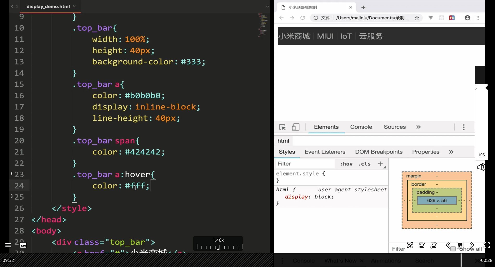

# 777-python-frontend

even in frontend, MS control -> IE , **conflict in interest in MS** -> blocking JS community (the one the control the
version), probably because MS donate a lot of money?

therefor -> react, vue -> build on top of js abstraction, bunchs of dependence , unnessary complexity , new js tools
come up

- web component
- htmx
- svelte


---


block tag , inline tag

inline tag: a , span , img

div -> blank block -> for css

- as html is made from tag to tag <> <> , if you don't want the parent tag <> , adding <div> as blog</div>
  <span> is the different, it is not a blog, don't <br> (J in vim)

HTML Links - The target Attribute

By default, the linked page will be displayed in the current browser window. To change this, you must specify another target for the link.

The target attribute specifies where to open the linked document.

The target attribute can have one of the following values:

    _self - Default. Opens the document in the same window/tab as it was clicked
    _blank - Opens the document in a new window or tab
    _parent - Opens the document in the parent frame
    _top - Opens the document in the full body of the window

`<a href="https://www.w3schools.com/" target="_blank">Visit W3Schools!</a>`

- you can also add title="" within the tag
  href="" (blank) => refresh the website
  href="#" (#) => not refreshing (doing null)

```

```

---

Client request to sever

- url address
- hyprlink
- form
- ajax

AJAX is a developer's dream, because you can:

    Read data from a web server - after the page has loaded
    Update a web page without reloading the page
    Send data to a web server - in the background

---

adding achor -> like md toc -> adding div id="c1" , <a href="#(your div id)"

- remember div tag will have auto , line break, if you want inline, use span

img src , title -> mouse pop up tag, alt -> alternative title (if not , then use title)

- width
- height
- border
- title

modern days use css more fore above

adding a href in img tag -> for creating link in picture

unorder list: ul

list : li

<ul>
    li

</ul>

order list: ol

- for each list, adding li tag per list

ul tag can adding attribute:
type ="square" , style unorder list , changing the shape (but usually css to do that )

---

table tag
row first tr -> table row
table data : td


three data all in one row

attribute:
border -> size of each data frame


- how to mearge column -> increase that unit row -> how many row it need to cover it all
  `<td rowspan=3></td>`
  colspan


css -> replace above all
cellpading -> making it look more center per each table
cellspacing -> making out circle spacing


`<form></form>`

- action , method(get,post), enctype

content_type(post) / enctype(html):
url or json
application/x-www-form-urlencoded

if need to post large files like image, need 'multipart/form-data'


- could select json file

input tag
type = "text"
type = "password"

method="get", key points is setting action

- type = "submit" -> adding p tag for line break

simple python sever:


- from tag action -> 127.0.0.1

---

still not receiving data from the sever , why?


missing assign varible(memory ?)

- without name= "xx", data are not gonna send

because get , url has to work like ?k1=xx&k2=yy in post /get motion in sever

json alse need this name

get -> not safe (url show the date in the url)

- so in general we use post rather than get

adding link rel ="icon" href=xxx > for creating tab icon

---

# form input type

Here are the different input types you can use in HTML:

- `<input type="button">`
- `<input type="checkbox">`
- `<input type="color">`
- `<input type="date">`
- `<input type="datetime-local">`
- `<input type="email">`
- `<input type="file">`
- `<input type="hidden">`
- `<input type="image">`
- `<input type="month">`
- `<input type="number">`
- `<input type="password">`
- `<input type="radio">`
- `<input type="range">`
- `<input type="reset">`
- `<input type="search">`
- `<input type="submit">`
- `<input type="tel">`
- `<input type="text">`
- `<input type="time">`
- `<input type="url">`
- `<input type="week">`


name="aea", value=""

checked="checked" -> default checked option

could shorten as `checked type="checkbox"` within input tag


name="hobby" could selected both in checkbox type

type radio -> name couldn't be the same, no repeated selection

- it force it to be one option to select only


- still need to set value

why the name in habit is the same? for backend lookup

---

# css


- there css comment way and html comment way


common way:
css folder , index.css


`<link rel="stylesheet" type="text/css" href="css/index.css">` inside header tag

css external and top css is the best , as it is easier to maintain , better to read

top side css drawback: bad for multiple html files to made css style

inside p tag inside body + top css , html will use inside css style first

- the pirority: inside css > top css > external css file (but the html will follow line by line first)
  the last line from top css in header tag will gonna overwrite the css style


->`# as id {}` same as markdown

<span class="active", (_unlike id , class can be repeated_)


oop in class, green , class="aaa bbb ccc" , three different class


code is smaller


- under div tag p tag style css


- all div a tag apply this css

not only tag can be using this, you can also using id a , class a


- combo grammar, h3,span{setting:1;}


Intersection grammar -> .active (2 interacting parts )

- nope, .active -> just mean class name


- this is the intersection grammar ,
  h2.active{}


h2:hover -> mouse holding position css
h1:visited(clicked), h1:link(not yet clicked) , h1:active


div>p, (only his son)

---


- adding !important for enhancing priority


after `,` , is fallback font, backup font if first isn't installed in the user side

---


px -> absolute font size


- colour


text decoration


2em = `2*px`

- line-height:


- if the line-height is smaller <= than the font size, the font will not stay in center (line-height) font overflow

- letter-spacing: 5px; useful for chinese font as well , letter space control
  word-spacing: 10px

- text-align: center;

---

- inline-block -> img and input tag
  


block => fill all the way from left to right , aka line break

> chrome tools should look from bottom to top as the code from user is up to down (sequence)


width: 200px -> , o.g. is 100% same from body tag


inline don't have much height to adjust, no room to set

- tag of {a , span , strong , em}


input and img

---

# display

like change the data type


setting block into inline

- display:none; -> hidden


- using display to change the type


line-height= height -> to make it make center (| height)


- line-height= height -> to make it make center (| height center)


- display:inline-block -> real | height center 🔥
  more easy for user to click, us



- hover -> feature

---

# css box


- padding-top: 50px -> kind of make it indent away from top


- 20x40 -> (up or down) x ( left or right ) according to chrome picture

all pattern:


---

border


specific border-width

- need to set detail unit unless it is not visible

pattern is same as above padding


- 12 cirle pattern for numbering

- border usage -> new product showing etc


1.set default to 0 2. adding new class 3. css border -> better input style

if you want to making object indent ->setting padding-left:10px;

- but it will increase the overall width:20px, so you need to decrease the width from 200 to 180px

- hover -> highlight when mouse moved it
- .classname:hover{}

---

margin
box to box distance


| height of margin in css, the smaller one will be combined in to o.g larger one , in this case , the middle will have
100px rather than 100+30px

video up to 43

---


previous dominent , jquery -> react /vue -> new comming up

based on the library and code, react and vue still the main steam


- Htmx+Tailwind CSS 非常的舒服可以無腦讓AI來當工具人(comment)

當然是 WASM + WebGL/WebGPU 。
回歸 native app 的開發，browser 只是虛擬機OS，任何 language 都能做 web前端。
反正都是自己 render，自然有無限種路線，GUI framework 大亂鬥時代。
只要再等10年 :P

特别是有了AI之后，这种轻量级、理解成本低的方案，用得特别舒服。


