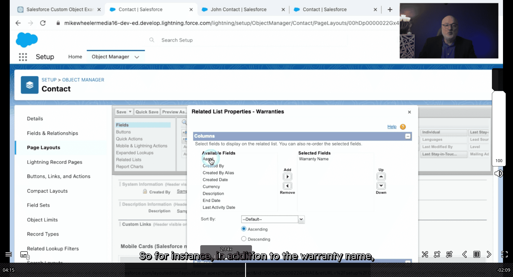
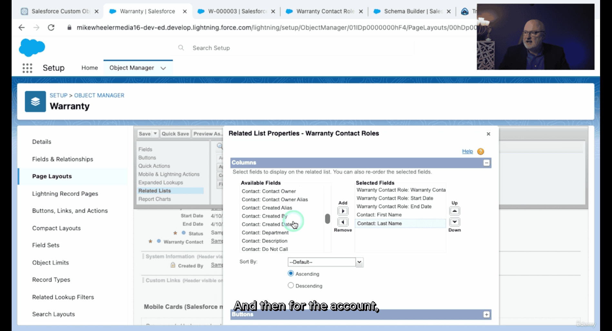
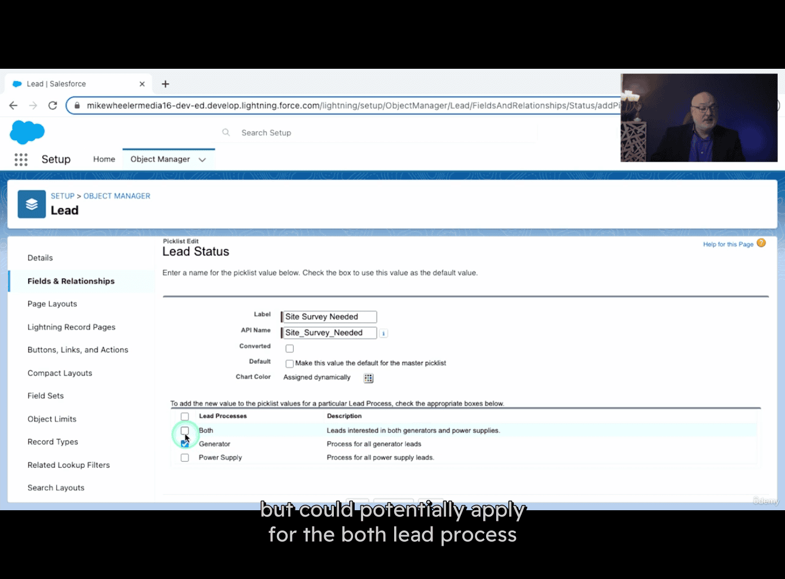

# 777-salesforce

[[20250508-777-prompt-salesforce]]

Schema Builder can make you directly adding attribute into the object(customized object)

- gui, mindmap
- view object manager right click as well (feature)

- but you still to make it manually make it visible for user , by drag and drop , kind of like make \_\_object to

- there is another visible setting require to make (field setting) , user + field visible -> really visible in profile

- use Fields & Relationships to check the basic unit / attribute for understanding

using gpt to suggesting which field do we need to create

e.g. Fields: Warranty Name, Description, Warranty Provider, Start Date, End Date, Warranty Status, Asset.

Q:For the Warranty Management Object, tell me more about the Warranty Provider field. Could that Warranty Provider field be related to the Account object? If so, should I make that a Lookup Relationship or a Master-Detail Relationship?

master-detail relationship -> mean that child object need their parent object created first

Q:For the Warranty Status field, should that be a picklist field? And if so, what are 4 or 5 good example status designations that | should include as options?

- in sales force you cant' create master detail relationship field if you have alread created records(like contact,(phone,
  address , email)), you need to created look up and then flip it to be master detail relationship

  - not adding related list in this case

- in view mode , selet new created field , pick existed contact and apply to all view list unit

once you apply to previous data, now you can flip it to master detail relationship

- enable re-parenting, (like change the contact)

now adding to it to page layout(front end) by using Lightning App Builder -> details -> contact layout -> it will jump
to object manager page layout

- adding more features on that (more info)

- adding to not only contact page , but also account page (repeated adding frontend like notion page)

---

# Junction objects

- allow you create many many relationship

Q: apply to our case , what can be ^^ in our case:
mulitiple contact that responsible for different roles -> junction objects

it created from backend and make it visable in the graph

bulking add roles from gpt in setup ->object manager

- and change the data type from text to auto number
  - so there isn't text need to be input , but auto number instead

the usage :

more detail can be picked as junction objects did that

---

when deleting the field, affecting:

- page layout
- automation
- reporting

make sure to do data export , backup first, better checked in mindmap as well

# record types

- objects are nouns, record types is adj

- it will increased add a level or layer of complexity.

vendor, clinet , provider etc

- you can created different page layout for different type of record types

- there is affect on enabling visible for both record types accounts

master account (_prospect_ account, default maybe -> showing how many profit)

make default optin page also same as above

---

that is why he is leaving a blink option above section

mind map for complex cases

now he change the correct name, so previous setup is easy for he locating which page

not giving purchase list in previous section so that now not allowing to pick that

- controling pick list and page layout, micro management ?

---

- login as test accont

- it auto as New Account: Warranty Provider, as he only got one record type

---

changing current non- warranty provider to warraty provider

- adding record type in front end

account page -> front end again

- adding warranty page look up list

- warranty page -> edit object -> field & relationship -> add look up -> option

---

asking gpt for useful formula

---

# Sales

campaign Hierarchy

responeses

- analysis on effectivness and return of investment

- custom links -> view capagin influence report

open leads -> potential customer ?

creation leads

Once a Lead is qualified, it can be converted into an account, contact, and Opportunity record in Salesforce, allowing sales reps to continue track managing the customer relationship as it progresses through the sales pipeline.

phone -> working
phone inquiry

annual revenue
address
product interest
which series, which type

logged a call (new lead)

---

lead form , cx doing themselves

- web-to-lead form

- less is more in lead online form

use gpt -> customerize web-to-lead form css

mordern , responsive style

---

lead settigns

lead assignement rules

- leads action once you created a lead

apex trigger

---

business anylsis
by gathering information on theier time frame, budget , product , service

---

details , -> log a call -> comment ->save->edit ->pohne -> lead salesfroc

lead source-> setting

rating -> hot -> fastest to close

primary -> this company or division of company

head into -> sales departemnt

convert lead ->

Topic - (dash) what opportunity of the name

- account + contact + opportunity

- some the data might loss during the conversion process

because some field in lead is customemized field for oppurtunity(other departement)

- aka custom to custom field mapping

backend ->

if none fields , then created one

so as contact, account

- you also need to think which field from lead page should be mapping to contact? or other

seacch the unique field first -> think -> make customerize field for according department

cant' make customer field to standard field - only standard to standard

text -> SIC-Code

back to lead add and adding lead fields

- prove all field have their own place

hidden css type -> go the website once submited web-lead -form

hidden input for lead_source to value Web (the one setting you have done on leads page)

- so its will recevie new form with a correct web (source of lead)

- asking gpt to use bootstrap (css tools lol)

- use replit to test it

gpt actually can give email validation feature

---

# lead queue

if there is different teams based on product interest , could give queues basen on that

emails to this group

---

another queue (product line)
object -> lead -> member -> user

---

lead asm rules

lead: country eq usa, usa united sta,etc -> assign to mike Wheeler

- criteria are met or making a formula

bug appears, no checkbox here

- make sure lead asm checkbox is setto be show

session setting

fixed the bug

- lead history in front end

- seting history tracking in lead in object manager

- lead owner

- page layouts , help you to trouble shoot

- switch to salesforce classic to ensure no bugs

---

lead process

power supply

lead process name : both

it show your thoughful case that it could happen both

new lead record type

this time lead(marketing) layout

- generator

---

T:- add additional values

T:reordering these vaules (pickp)

- reorder button

- status bar (progress bar) (so the order matter in these case)

- industry, product interest

---

adding new option

upto c3.16
