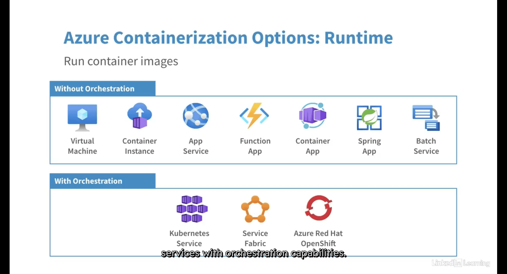
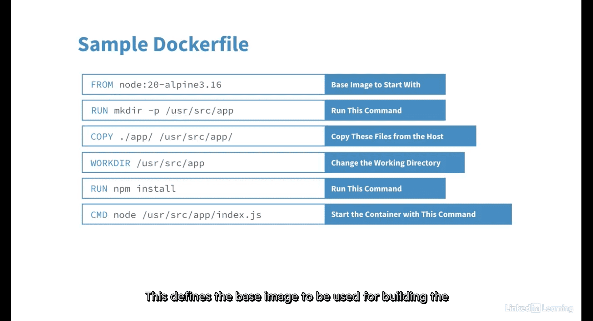
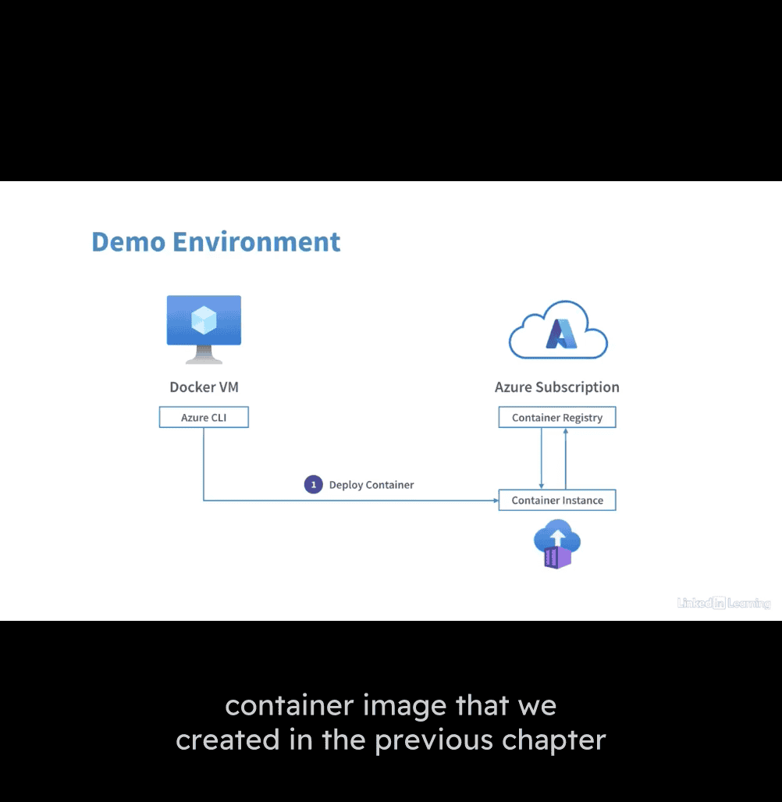

# 777-azure-learning

- az-104 study : [[20250516-777-azure-notes]]




generally , resource group -> login in your azure ac -> VM in brower -> powershell admin -> choco install docker-desktop -y

- restart and check




Image Efficiency Principles
Choose an appropriate base (light weight)
Avoid unnecessary packages ()
Adopt container modularity (single function maybe)
Avoid including application data (secrets and token)


Azure Container Registry (ACR)


# ACR Image flow


### Create a new DOTNET core project

```
dotnet --list-sdks
dotnet --list-runtimes

mkdir dotnet-projects
cd .\dotnet-projects\
dotnet new mvc -o containerapp
cd .\containerapp\
ls
code .
```

### Install the Visual Studio Code extensions (C# and Docker)

```
VS Code → Extensions → Search for C# → Install the extension

VS Code → Extensions → Search for Docker → Install the extension
```

### Containerize the application

```
VS Code → F1 → Docker: Add docker files to workspace
.NET: ASP.NET Core
Linux
80,443 → Enter
Include optional Docker Compose files?: No

Review Dockerfile
Right click Dockerfile → Build image
```

### Test the containerized app locally

```
Go back to PowerShell:

docker image ls
docker run --detach --publish 80:80 containerapp
docker container ls

start chrome http://localhost:80

docker container stop <container_id>
```

### Create a container registry using the Azure CLI

```
az login

$group = "DockerOnAzureCourse-HOL-RG"
$location = "eastus"
$random = Get-Random
$acrname = "doazacr$random"

az group create --resource-group $group --location eastus
az acr create --resource-group $group --name $acrname --sku Basic --admin-enabled true
```

### View the repositories and images in the registry

- It should be empty as we are yet to create a repository or push an image to the registry

```
az acr repository list --name $acrname
```

### Upload the containerized app to the registry

```
# Before pushing and pulling container images, we must log in to the registry
# For this, we need our registry login server address, username and password

$acrloginserver = $(az acr show --name $acrname --query loginServer)
$acrusername = az acr credential show --name $acrname --query username
$acrpassword = az acr credential show --name $acrname --query 'passwords[0].value'

echo $acrloginserver
echo $acrusername
echo $acrpassword

# Log in to registry using Docker
docker login "$acrloginserver" --username $acrusername --password $acrpassword

# Tag the image
docker tag containerapp:latest $acrloginserver/containerapp:latest
docker image ls

# Push the image
docker push $acrloginserver/containerapp:latest
```

### Verify the image in the registry

```
az acr repository list --name $acrname

az acr repository show --name $acrname --repository containerapp

az acr manifest list-metadata $acrloginserver/containerapp
```


---

# Demonstration: Push a Container Image to Azure Container Registry


### Create a container registry using the Azure CLI

```
az login

$group = "DockerOnAzureCourse-HOL-RG"
$location = "eastus"
$random = Get-Random
$acrname = "doazacr$random"

az group create --resource-group $group --location eastus
az acr create --resource-group $group --name $acrname --sku Basic --admin-enabled true
```

### View the repositories and images in the registry

- It should be empty as we are yet to create a repository or push an image to the registry

```
az acr repository list --name $acrname
```

### Upload the containerized app to the registry

```
# Before pushing and pulling container images, we must log in to the registry
# For this, we need our registry login server address, username and password

$acrloginserver = $(az acr show --name $acrname --query loginServer)
$acrusername = az acr credential show --name $acrname --query username
$acrpassword = az acr credential show --name $acrname --query 'passwords[0].value'

echo $acrloginserver
echo $acrusername
echo $acrpassword

# Log in to registry using Docker
docker login "$acrloginserver" --username $acrusername --password $acrpassword

# Tag the image
docker tag containerapp:latest $acrloginserver/containerapp:latest
docker image ls

# Push the image
docker push $acrloginserver/containerapp:latest
```

### Verify the image in the registry

```
az acr repository list --name $acrname

az acr repository show --name $acrname --repository containerapp

az acr manifest list-metadata $acrloginserver/containerapp
```


---

# Automating Container Builds Using Azure DevOps


azure devops -> projects -> repo url


- after git push


azure pipline:


- make another image name for easier to distinguish

yaml file


### Pre-Requisites

- Azure SubScription
- Azure DevOps Organization

### Create an Azure DevOps Project

1. Azure DevOps Console → New project
   **`Project Name`**: containerapp
   **`Visibility`**: Private
   **`Create`**

2. Azure DevOps Console → containerapp (Project) → Repos → Clone to your computer → Copy URL

### Initialize git and push code to the remote repository

```
git init
git remote add origin <repo_url>
git remote -v
git config --global user.name "<name>"
git config --global user.email "<email>"

git status
git add .
git commit -m "added dotnet mvc template"
git push --set-upstream origin master
git status
```

### Create and run pipeline

- Azure DevOps Console → containerapp → Pipelines → Create pipeline

  - **`Where is your code?`**: Azure Repos Git → containerapp
  - **`Configure your pipeline`**: Docker - Build and push an image to Azure Container Registry → Select your Azure subscription → Continue

- **`Container registry`**: doazacr\***\*\*\*\***
- **`Image Name`**: containerappdevops
- **`Dockerfile`**: $(Build.SourcesDirectory)/Dockerfile
- Validate and configure

- Review pipeline

- Save and run → Save and run

- Select and monitor Build job

### Review the container image in the registry

- Azure Portal → Container registries → doazacr**\*\*\*** → Services → Repositories → containerappdevops

---

# Update image automatically

- Review the Pipeline Trigger and Container Registry
  

  `trigger:
    - master| I
`

### Review the pipeline trigger and container registry

1. Azure DevOps Console → containerapp → Pipelines → containerapp → Edit

- Review the trigger

2. Azure Portal → Container registries → doazacr**\*\*\*** → Services → Repositories → containerappdevops

- Review the tags

### Make code changes locally and push to the remote repository

1. VS Code → Views → Home → Index.cshtml

- Change "Welcome" to "Docker on Azure Course"
- Commit → Message: "modified header" → Commit → Would you like to stage all changes: Yes → Sync changes
- This action will pull and push commits from and to "origin/master": OK

### Review the pipeline run

1. Azure DevOps Console → containerapp → Pipelines → Runs → Create pipeline

### Confirm the updated container image in the registry

1. Azure Portal → Container registries → doazacr**\*\*\*** → Services → Repositories → containerappdevops

- Review the tags

---

# Deploy a container to ACI using Azure CLI



## Deploy a container to ACI using Azure CLI

### Get the credentials of the container registry

```
$group = "DockerOnAzureCourse-HOL-RG"
$location = "eastus"

$acrname = $(az acr list --resource-group $group --query [0].name --output tsv)

$acrloginserver = $(az acr show --name $acrname --query loginServer)
$acrusername = $(az acr credential show --name $acrname --query username)
$acrpassword = $(az acr credential show --name $acrname --query 'passwords[0].value')
```

### Generate a random name for the container instance

```
$random = Get-Random
$acidnsname = "containerapp$random"
```

### Deploy the container instance using Azure CLI

```
az container create --resource-group $group --name "containerapp-aci" --image "$acrloginserver/containerapp:latest" --dns-name-label "$acidnsname" --ports 80 --cpu 2 --memory 4 --registry-username $acrusername --registry-password $acrpassword
```

### Validate that the container app is running

```
$acifqdn = $(az container show --resource-group $group --name "containerapp-aci" --query ipAddress.fqdn --output tsv)

start chrome http://$acifqdn
```

---

## Deploy a container to ACI using Azure CLI

### Get the credentials of the container registry

```
$group = "DockerOnAzureCourse-HOL-RG"
$location = "eastus"

$acrname = $(az acr list --resource-group $group --query [0].name --output tsv)

$acrloginserver = $(az acr show --name $acrname --query loginServer)
$acrusername = $(az acr credential show --name $acrname --query username)
$acrpassword = $(az acr credential show --name $acrname --query 'passwords[0].value')
```

### Install/Upgrade the Azure Container Apps extension for Azure CLI

- The extension is in preview

```
az extension add --name containerapp --upgrade
```

### Deploy the container app

```
az containerapp up --name "containerapp-aca" --resource-group $group --location $location --environment 'container-apps' --image "$acrloginserver/containerapp:latest" --target-port 80 --ingress external --registry-username $acrusername --registry-password $acrpassword
```

### Validate that the container app is running

```
$acafqdn = $(az containerapp show --resource-group $group --name "containerapp-aca" --query properties.configuration.ingress.fqdn --output tsv)

start chrome http://$acafqdn
```

---

# Solution Automate container deployment to ACI using Azure DevOps

### Pre-Requisites

- Azure SubScription
- Azure DevOps Organization

### Modify the pipeline to include a deployment stage

1. Azure DevOps Console → project → containerappdevops → Pipelines → containerappdevops → Edit

2. Add a new stage

```
- stage: Deploy
  displayName: Deployment stage
  jobs:
  - job: Deploy
    displayName: Deploy
    pool:
      vmImage: $(vmImageName)
    steps:
    - task: AzureCLI@2
      inputs:
        azureSubscription: '<YOUR SUBSCRIPTION DETAILS>'
        scriptType: 'bash'
        scriptLocation: 'inlineScript'
        inlineScript: |
          group="DockerOnAzureCourse-HOL-RG" location="eastus"

          acrname=$(az acr list --resource-group $group --query [0].name --output tsv)

          acrloginserver=$(az acr show --name $acrname --query loginServer --output tsv)
            acrusername=$(az acr credential show --name $acrname --query username --output tsv)
          acrpassword=$(az acr credential show --name $acrname --query 'passwords[0].value' --output tsv)

          random=$RANDOM
          acidnsname="containerappdevops$random"

          # Retry logic
          max_retries=5
          retries=0
          while [ $retries -lt $max_retries ]; do
            # Create the container
              az container create --resource-group $group --name "containerappdevops-aci" --image "$acrloginserver/containerappdevops:$(tag)" --dns-name-label "$acidnsname" --ports 80 --cpu 2 --memory 4 --registry-username $acrusername --registry-password $acrpassword

              # Check if the container creation was successful
              if [ $? -eq 0 ]; then
                break
              fi

              # Check the status of the container
              status=$(az container show --resource-group $group --name "containerappdevops-aci" --query "instanceView.state" --output tsv)

              # If the container is transitioning, wait and retry
              if [ "$status" == "Transitioning" ]; then
                echo "Container is transitioning. Waiting for 30 seconds before retrying..."
                sleep 30
                retries=$((retries+1))
              else
                # If there's another error, exit the loop
                break
              fi
            done

            if [ $retries -eq $max_retries ]; then
              echo "Failed to create the container after $max_retries attempts."
              exit 1
            fi

```

---

# Network

### Set variables

```
$group = "DockerOnAzureCourse-HOL-RG"
$location = "eastus"
$vnet = "DOAz-VNet"
```

### Create vNet and subnet

```
az network vnet create -n $vnet -g $group --address-prefix 10.1.0.0/16 --subnet-name "vm-subnet" --subnet-prefix 10.1.1.0/24
az network vnet subnet create -n "aci-subnet" --address-prefixes 10.1.2.0/24 -g $group --vnet-name $vnet
```

### Deploy a virtual machine into a subnet

```
az vm create -g $group -n LinuxVM --image UbuntuLTS --admin-username "azureuser" --generate-ssh-keys --vnet-name $vnet --subnet vm-subnet --size Standard_D2s_v3

az vm open-port --port 22 --resource-group $group --name LinuxVM
```

### Deploy a container instance into a subnet

```
$random = Get-Random
$aciname = "nginxcontainer$random"

az container create --resource-group $group --name $aciname --image nginx --vnet $vnet --subnet aci-subnet --ports 80 443
```

### Verify private access to the container instance

```
* Get the container instance private IP
$aciIP = $(az container show --resource-group $group --name $aciname --query ipAddress.ip -o tsv)

echo $aciIP # Make a note of this IP address

* Get the VM's public IP and connect to it
$LinuxVM = $(az vm show -d --resource-group $group --name LinuxVM --query publicIps -o tsv)

echo $LinuxVM

ssh azureuser@$LinuxVM

* Connect to the container instance privately
curl http://<container_private_IP>

* Exit from the VM
exit
```

### Set variables

```
$group = "DockerOnAzureCourse-HOL-RG"
$location = "eastus"
$vnet = "DOAz-VNet"
$acisubnet = "aci-subnet"
$acisubnetnsg = "aci-subnet-nsg"
```

### Create a Network Security Group (NSG)

```
az network nsg create --name $acisubnetnsg --resource-group $group --location $location
```

### Create a NSG rule to block inbound traffic on port 80

```
az network nsg rule create --name "Block-Inbound-HTTP" --nsg-name $acisubnetnsg --priority 1000 --resource-group $group --access Deny --source-address-prefixes "*" --source-port-ranges "*" --destination-address-prefixes "*" --destination-port-ranges "80" --protocol Tcp --direction Inbound
```

### Attach the NSG to the ACI subnet

```
az network vnet subnet update -g $group -n $acisubnet --vnet-name $vnet --network-security-group $acisubnetnsg
```

### Validate security rules

```
* Get the VM's public IP and connect to it
$LinuxVM = $(az vm show -d --resource-group $group --name LinuxVM --query publicIps -o tsv)

echo $LinuxVM

ssh azureuser@$LinuxVM

* Attempt to connect to the container instance privately (this should fail)
curl http://<container_private_IP>

* Exit from the VM
exit
```

## Challenge solution: Limit container outbound access

### Verify outbound connectivity on port 80

```
az container exec -g $group --name $aciname --container-name $aciname --exec-command "/bin/bash"

curl http://www.google.com

exit
```

### Set variables

```
$group = "DockerOnAzureCourse-HOL-RG"
$location = "eastus"
$vnet = "DOAz-VNet"
$acisubnet = "aci-subnet"
$acisubnetnsg = "aci-subnet-nsg"
```

### Create a NSG rule to block outbound traffic on ports 80 and 443

```
az network nsg rule create --name "Block-Outbound-HTTP-HTTPS" --nsg-name $acisubnetnsg --priority 1000 --resource-group $group --access Deny --source-address-prefixes "*" --source-port-ranges "*" --destination-address-prefixes "*" --destination-port-ranges 80, 443 --protocol Tcp --direction Outbound
```

### Verify NSG effectiveness (Wait for some minutes )

```
az container exec -g $group --name $aciname --container-name $aciname --exec-command "/bin/bash"

curl http://www.google.com

exit
```
