<!--toc:start-->

- [csprimer-computersystem-concept3](#csprimer-computersystem-concept3)
- [Programming C](#programming-c)
  - [Explanation:](#explanation)
  - [Example:](#example)
  - [🔢 What is `0xffffffff`?](#🔢-what-is-0xffffffff)
  - [🧠 Signed vs Unsigned Int in C](#🧠-signed-vs-unsigned-int-in-c)
  - [⚙️ Two's Complement Concept](#️-twos-complement-concept)
  - [✅ Why `0xffffffff` = -1 in signed int](#why-0xffffffff-1-in-signed-int)
  - [🚫 Why the Loop Breaks](#🚫-why-the-loop-breaks)
  - [Summary](#summary)
  - [🔍 What does it do?](#🔍-what-does-it-do)
  - [🔥 Why is it faster?](#🔥-why-is-it-faster)
    - [Previous method:](#previous-method)
    - [New method:](#new-method)
  - [🧠 Example: `n = 0b10110000`](#🧠-example-n-0b10110000)
  - [💡 Why `n & (n - 1)` clears the lowest set bit?](#💡-why-n-n-1-clears-the-lowest-set-bit)
  - [Summary:](#summary)
  - [🧠 What is `popcnt`?](#🧠-what-is-popcnt)
  - [✅ Why your teacher used `-march=native` and `-O3`](#why-your-teacher-used-marchnative-and-o3)
  - [🧩 What does the assembly mean?](#🧩-what-does-the-assembly-mean)
  - [🚀 Summary](#🚀-summary)
  - [🧠 The Core Idea: Parallel Byte Aggregation](#🧠-the-core-idea-parallel-byte-aggregation)
  - [⚡ Example: Parallel 16-bit Pairing](#example-parallel-16-bit-pairing)
  - [🚀 In SIMD Hardware:](#🚀-in-simd-hardware)
  - [🧪 Summary:](#🧪-summary)
  - [🧰 Python can't _truly_ do this in parallel, but...](#🧰-python-cant-truly-do-this-in-parallel-but)
    - [🧠 What Is a Divide and Conquer Algorithm?](#🧠-what-is-a-divide-and-conquer-algorithm)
    - [✅ Classic Examples](#classic-examples)
    - [🧮 For Byte Summing?](#🧮-for-byte-summing)
    - [👇 In simple Python example:](#👇-in-simple-python-example)
    - [Script Breakdown](#script-breakdown)
    - [Example Usage](#example-usage)
    - [Why It Can Be Used for Speed Testing (Profiling)](#why-it-can-be-used-for-speed-testing-profiling)
    - [How It Acts Like a Profiler](#how-it-acts-like-a-profiler)
    - [Example Scenario](#example-scenario)
    - [Limitations](#limitations)
    - [Improvements for Better Profiling](#improvements-for-better-profiling)
    - [Conclusion](#conclusion)
    - [Overview of the Program](#overview-of-the-program)
    - [Code Breakdown](#code-breakdown)
      - [1. **Header Files**](#1-header-files)
      - [2. **The `ispangram` Function**](#2-the-ispangram-function)
      - [3. **The `main` Function**](#3-the-main-function)
    - [How It Fits with the Bash Script](#how-it-fits-with-the-bash-script)
    - [Key C Concepts for Beginners](#key-c-concepts-for-beginners)
    - [Example: Completing `ispangram`](#example-completing-ispangram)
    - [Running the Program](#running-the-program)
    - [Sample Run](#sample-run)
    - [Why This Code?](#why-this-code)
    - [Next Steps](#next-steps)
- [the different C compiler , gcc vs clang](#the-different-c-compiler-gcc-vs-clang)
  - [Key Features of `<stdint.h>`](#key-features-of-stdinth)
    - [1. Arrays and Pointers in C](#1-arrays-and-pointers-in-c)
    - [2. Array Indexing: `arr[3]`](#2-array-indexing-arr3)
    - [3. Pointer Arithmetic: `*(arr + 3)`](#3-pointer-arithmetic-arr-3)
    - [4. Why `arr[3]` == `*(arr + 3)`?](#4-why-arr3-arr-3)
    - [5. Example from Your Code](#5-example-from-your-code)
    - [6. What Your Teacher Is Teaching](#6-what-your-teacher-is-teaching)
    - [7. Key Takeaways](#7-key-takeaways)
    - [8. A Visual Explanation](#8-a-visual-explanation)
    - [9. Practice to Reinforce](#9-practice-to-reinforce)
    - [1. Preprocessor Directives](#1-preprocessor-directives)
    - [2. Conditional Compilation](#2-conditional-compilation)
    - [3. The Role of the `DEBUG` Macro](#3-the-role-of-the-debug-macro)
    - [4. The `fprintf(stderr, "error\n")` Line](#4-the-fprintfstderr-errorn-line)
    - [5. Why This Matters](#5-why-this-matters)
    - [6. Fixing the Code](#6-fixing-the-code)
    - [7. How `DEBUG` Is Set](#7-how-debug-is-set)
    - [8. Example Compilation Scenarios](#8-example-compilation-scenarios)
    - [9. Broader Lesson](#9-broader-lesson)
    - [10. Practice to Reinforce](#10-practice-to-reinforce)
    - [11. Connection to Pointers (from Your Previous Question)](#11-connection-to-pointers-from-your-previous-question)
    - [1. Overview of Structs in C](#1-overview-of-structs-in-c)
      - [Key Characteristics:](#key-characteristics)
      - [Why Structs Are Useful:](#why-structs-are-useful)
    - [2. Key Concepts Your Teacher Is Teaching](#2-key-concepts-your-teacher-is-teaching)
      - [a) Creating and Accessing Structs](#a-creating-and-accessing-structs)
      - [b) Structs and Pointers](#b-structs-and-pointers)
      - [c) Memory Layout and Alignment](#c-memory-layout-and-alignment)
      - [d) Arrays of Structs](#d-arrays-of-structs)
      - [e) Passing Structs to Functions](#e-passing-structs-to-functions)
    - [3. Memory Address Calculation: `0x7ffe6b1f9ea0` to `0x7ffe6b1f9eb8`](#3-memory-address-calculation-0x7ffe6b1f9ea0-to-0x7ffe6b1f9eb8)
      - [Step-by-Step Calculation:](#step-by-step-calculation)
      - [Lesson:](#lesson)
    - [4. Broader Lessons from Your Teacher](#4-broader-lessons-from-your-teacher)
      - [Connection to Previous Questions:](#connection-to-previous-questions)
    - [5. Practice to Reinforce](#5-practice-to-reinforce)
    - [6. Key Takeaways](#6-key-takeaways)
    - [Context Setup](#context-setup)
    - [1. `(int*)b2.value`](#1-intb2value)
    - [2. `*(int*)b2.value`](#2-intb2value)
    - [Key Difference](#key-difference)
    - [Why This Happens](#why-this-happens)
    - [Correct Approach](#correct-approach)
    - [Summary](#summary)
  - [🧠 What Your Teacher Is Teaching:](#🧠-what-your-teacher-is-teaching)
  - [🔍 Stack Memory Layout (Key Idea)](#🔍-stack-memory-layout-key-idea)
    - [Example:](#example)
  - [💥 Why Overwriting Happens:](#💥-why-overwriting-happens)
    - [1. **Arrays don’t have bounds checking in C**](#1-arrays-dont-have-bounds-checking-in-c)
    - [2. **Memory is Reused on the Stack**](#2-memory-is-reused-on-the-stack)
    - [3. **No Protection or Warning**](#3-no-protection-or-warning)
  - [✅ What Your Teacher’s Trying to Teach:](#what-your-teachers-trying-to-teach)
  - [🧪 Why This Is “A Small Chance” Case](#🧪-why-this-is-a-small-chance-case)
  - [🧠 Takeaway Message:](#🧠-takeaway-message)
  - [📦 What Is the Stack?](#📦-what-is-the-stack)
  - [📐 Key Characteristics of the Stack](#📐-key-characteristics-of-the-stack)
  - [🧱 Stack Frame Layout (per function call)](#🧱-stack-frame-layout-per-function-call)
  - [🧪 Example: Stack Frame Visualization](#🧪-example-stack-frame-visualization)
  - [🤯 Why Memory Bugs Happen](#🤯-why-memory-bugs-happen)
  - [🎯 What Your Teacher Is Demonstrating](#🎯-what-your-teacher-is-demonstrating)
  - [🛡️ Tools to Catch These Bugs](#🛡️-tools-to-catch-these-bugs)
  - [👣 Summary](#👣-summary)
  - [🧠 What Is `$rsp`?](#🧠-what-is-rsp)
  - [🔍 What Does This Do?](#🔍-what-does-this-do)
    - [1. `mem read $rsp`](#1-mem-read-rsp)
    - [2. `mem read $rsp - 32`](#2-mem-read-rsp-32)
  - [📐 Why It’s Useful](#📐-why-its-useful)
    - [✅ 1. **Find Function Arguments, Locals, and Return Addresses**](#1-find-function-arguments-locals-and-return-addresses)
    - [✅ 2. **Catch Bugs or Corruptions**](#2-catch-bugs-or-corruptions)
    - [✅ 3. **Manually Reconstruct the Stack Frame**](#3-manually-reconstruct-the-stack-frame)
  - [🔧 Try It Yourself](#🔧-try-it-yourself)
  - [🧭 Summary](#🧭-summary)
  - [🧠 1. `int x = 5;` → What happens?](#🧠-1-int-x-5-what-happens)
  - [📦 2. What about `&x` (the address of x)?](#📦-2-what-about-x-the-address-of-x)
  - [🧠 3. Visualizing `x`, `y`, and `z`](#🧠-3-visualizing-x-y-and-z)
  - [📍 Why This Matters](#📍-why-this-matters)
  - [🔄 Address Arithmetic Note](#🔄-address-arithmetic-note)
  - [✅ TL;DR](#tl-dr)
  - [🔍 What is a `void*`?](#🔍-what-is-a-void)
  - [❌ Pointer Arithmetic Is Not Allowed on `void*` (in C)](#pointer-arithmetic-is-not-allowed-on-void-in-c)
    - [🛑 In **C**:](#🛑-in-c)
    - [✅ In **GNU C extensions** or **C++**, some compilers may allow it:](#in-gnu-c-extensions-or-c-some-compilers-may-allow-it)
  - [🧠 Why Cast to `char*` or `uint8_t*`?](#🧠-why-cast-to-char-or-uint8t)
  - [✅ Summary](#summary)
    - [👀 Example Demo:](#👀-example-demo)
  - [🔁 What Is a Cast?](#🔁-what-is-a-cast)
    - [✅ Example 1: Simple cast (numeric)](#example-1-simple-cast-numeric)
  - [🧠 Two Main Kinds of Casts](#🧠-two-main-kinds-of-casts)
    - [1. ✅ **Value casts** (like `int → float`, or `char → int`)](#1-value-casts-like-int-float-or-char-int)
    - [2. 🔧 **Pointer casts** (like `void* → int*`, or `char* → void*`)](#2-🔧-pointer-casts-like-void-int-or-char-void)
  - [⚠️ Why Casts Are Powerful (and Dangerous)](#️-why-casts-are-powerful-and-dangerous)
    - [Example: memory reinterpretation](#example-memory-reinterpretation)
  - [🧰 Common Use Cases](#🧰-common-use-cases)
  - [👎 What You **Should Not** Do](#👎-what-you-should-not-do)
    - [Example: invalid pointer cast](#example-invalid-pointer-cast)
  - [🧠 Cast vs Implicit Conversion](#🧠-cast-vs-implicit-conversion)
  - [🎯 TL;DR Summary](#🎯-tldr-summary)
    - [🧠 WHAT IS HE TEACHING?](#🧠-what-is-he-teaching)
    - [🔍 Image Context Breakdown](#🔍-image-context-breakdown)
      - [Top:](#top)
      - [Bottom:](#bottom)
    - [🎯 What is `p1`, and Why is `q` a Pointer-to-Pointer?](#🎯-what-is-p1-and-why-is-q-a-pointer-to-pointer)
      - [🧩 The key logic:](#🧩-the-key-logic)
    - [💡 Why is this confusing to many?](#💡-why-is-this-confusing-to-many)
    - [✅ Summary](#summary)
    - [🔧 Real-world example: Allocating memory](#🔧-real-world-example-allocating-memory)
  - [🧠 What Is `void **`?](#🧠-what-is-void)
  - [✅ Real Use Case: Generic Memory Setters](#real-use-case-generic-memory-setters)
  - [🧩 Applying to Your Teacher’s Diagram](#🧩-applying-to-your-teachers-diagram)
  - [🚨 Why Is This Confusing?](#🚨-why-is-this-confusing)
  - [🧠 What’s the Takeaway?](#🧠-whats-the-takeaway) - [🧠 Part 1: What Does `void* arr;` Mean?](#🧠-part-1-what-does-void-arr-mean) - [🔁 Now What If You Use `void** arr;`?](#🔁-now-what-if-you-use-void-arr) - [✅ Your Case: Dynamic Array (Generic)](#your-case-dynamic-array-generic) - [📦 Example Use Case](#📦-example-use-case) - [`void* arr` (raw block of memory):](#void-arr-raw-block-of-memory) - [`void** arr` (array of pointers):](#void-arr-array-of-pointers) - [🔧 So What Is Your Teacher Trying to Do?](#🔧-so-what-is-your-teacher-trying-to-do) - [🔍 Final Analogy](#🔍-final-analogy)
  <!--toc:end-->

[777-computer-science-nodejs](20250829-777-computer-science-nodejs.md)

[csprimer-computersystem-concept5](20250919-csprimer-computersystem-concept5.md)


# csprimer-computersystem-concept3

[NASM Tutorial](https://cs.lmu.edu/~ray/notes/nasmtutorial/)
[hackclub/some-assembly-required: 📖 An approachable introduction to Assembly.](https://github.com/hackclub/some-assembly-required?tab=readme-ov-file)
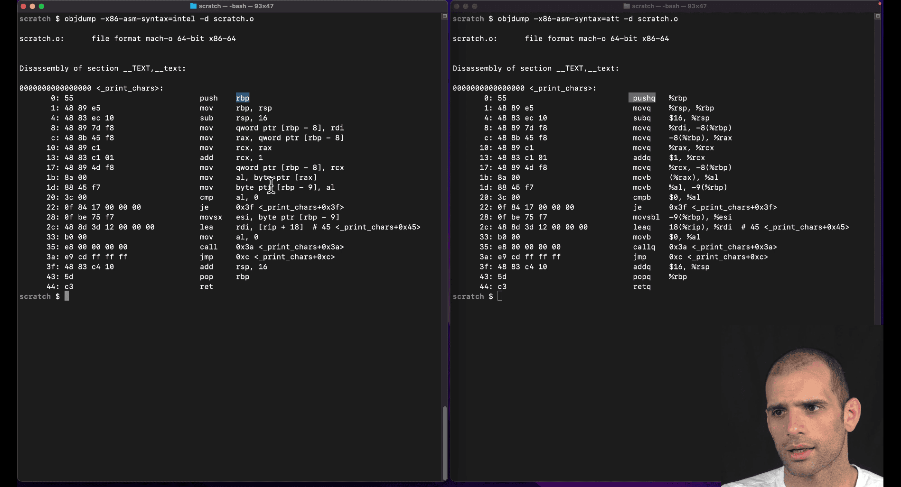

- there is two common x64 , inter and att (linux prefer)
  push -> pushq -> push to queue

att:
movq , movb (b for byte), bl -> long byte

movq , q for qute word quart word -> 64 bit -> quart of 64 , 16

- subq:
  substracting 16 from %rsp

- operator order is difference btw att and intel

- look at the construction

one text section , loaded in the memory

---

# Programming C

learn x in y minutes
[C, Go - Hyperpolyglot](https://hyperpolyglot.org/c)
read c code , linux source code

- high level of struct
- compile , c knowledge with machine

hello world in c :

int main() {} -> why int a linux culture -> 0 mean successful like
work && run bash order

if return 1; -> not , it will not run as successful, can && after

return -1 -> assertion fail -> fail reminder in terminal

int bitcount(int n) {
int count = 0;
while (n){

}
}

in c , 0 mean true , 1 -> false

- don't have boolean in c , so using `while(n)-> keep runing while n is not 0`

`n & 0x01` is a **bitwise AND** operation that checks whether the **least significant bit (LSB)** of `n` is `1` or `0`.

### Explanation

- `0x01` is hexadecimal for `00000001` in binary.
- `n & 0x01` compares `n` with `00000001` using bitwise AND:
  - If the LSB of `n` is `1`, the result is `1`.
  - If the LSB is `0`, the result is `0`.

### Example

```cpp
n = 5;          // binary: 0101
n & 0x01 = 1    // because the LSB is 1
```

This is commonly used to count the number of `1`s in a binary number (also known as the Hamming weight or population count).

---

**Also, your function is missing a return statement.** Here's the corrected version:

```cpp
int bitcount(int n) {
  int count = 0;
  while (n) {
    if (n & 0x01) {
      count += 1;
    }
    n >>= 1;
  }
  return count;
}
```

Let me know if you want a version that’s more efficient.

as there is only 1 and 0 out there , so if there is 1 in the lsb , least significant bit -> shift right until 0

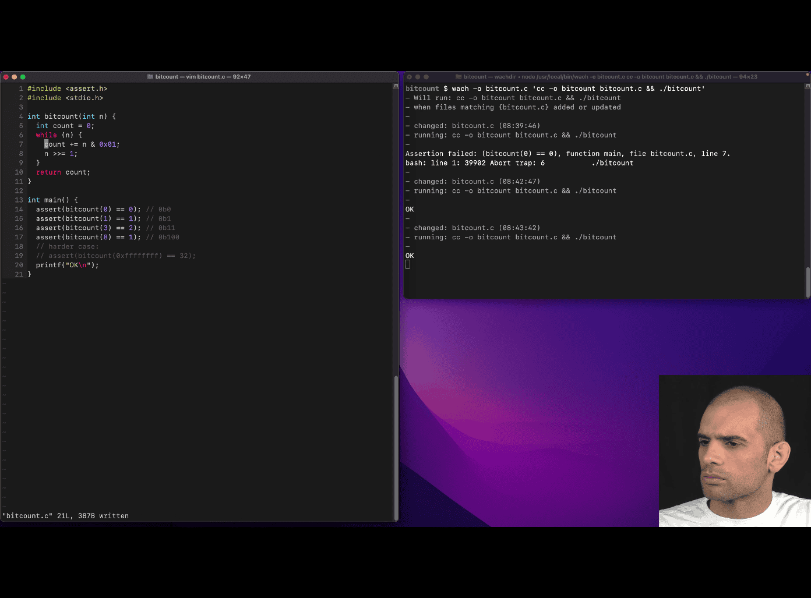

int bitcount(int n) {
int count = 0;
while (n) {
count += n & 0x01;
n >>= 1;
}
return count;
}

- refactor
  as 0 dont affect count, add them all in here lol

  ```c
  int main() {
  assert(bitcount(0) == 0);
  assert(bitcount(1) == 1);
  assert(bitcount(3) == 2);
  assert(bitcount(8) == 1);
  // harder case:
  assert(bitcount(0xffffffff) == 32);
  printf("OK\n");
  }

  ```

assert(bitcount(0xffffffff) == 32); this break the while(n) loop , so the n != 0 for 0xffffffff

---

### 🔢 What is `0xffffffff`?

In binary, `0xffffffff` is:

```
11111111 11111111 11111111 11111111  // 32 bits
```

That’s **all bits set to 1** — which equals `4294967295` in **unsigned** interpretation.

---

### 🧠 Signed vs Unsigned Int in C

- `int` is **signed** (can represent negative and positive numbers).
- It uses **two's complement** representation to handle negatives.

---

### ⚙️ Two's Complement Concept

In **two's complement**, the **highest bit (leftmost bit)** is the **sign bit**:

- `0xxxxxxxxxxxxxxxxxxxxxxxxxxxxxxx` → positive
- `1xxxxxxxxxxxxxxxxxxxxxxxxxxxxxxx` → negative

To get the negative value of a binary number:

1. Invert all the bits
2. Add 1

So in 32-bit signed `int`:

- `0x00000001` → 1
- `0x7fffffff` → 2,147,483,647 (max signed int)
- `0x80000000` → -2,147,483,648 (min signed int)
- `0xffffffff` → **-1**

---

### ✅ Why `0xffffffff` = -1 in signed int

Let’s apply two’s complement:

- `0xffffffff` = `11111111 11111111 11111111 11111111`
- Invert: `00000000 00000000 00000000 00000000`
- Add 1: `00000000 00000000 00000000 00000001` → that's `1`
- So original = `-1`

Hence, `0xffffffff` is interpreted as **-1** in a signed `int`.

---

### 🚫 Why the Loop Breaks

Right-shifting signed -1:

- `-1 >> 1` → still `-1`, because the sign bit (`1`) is preserved.
- So `n` never becomes `0`, and `while (n)` becomes **infinite loop**.

---

### Summary

| Hex          | Binary (32-bit)                       | Interpreted as              |
| ------------ | ------------------------------------- | --------------------------- |
| `0xffffffff` | `11111111 11111111 11111111 11111111` | `-1` (signed int)           |
|              |                                       | `4294967295` (unsigned int) |

So: **same bits, different meaning depending on signed vs unsigned.**

Let me know if you'd like a visual to reinforce this!

---

int bitcount(unsigned n) {
int count = 0;
while (n) {
count += n & 0x01;
n >>= 1;
}
return count;
}

int n -> unsigned -> fixed

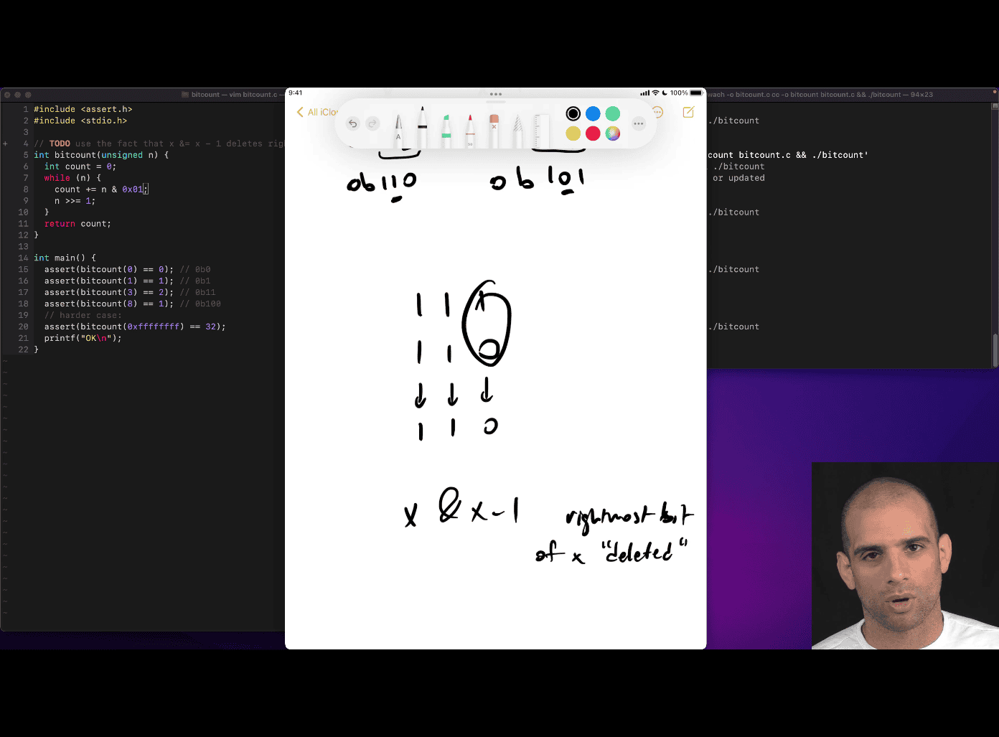

---

before using belew , it loop 32 times for case 0xfff ... == 32

- x & x-1 -> deleted the rightmost bit of x _using bitwise &_

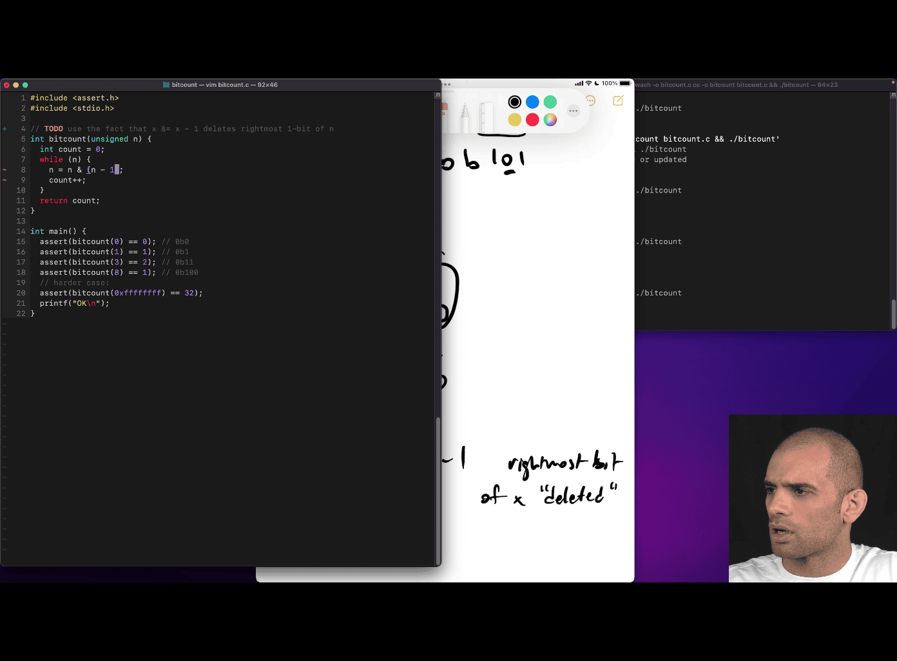
Excellent question — this is a classic bit manipulation trick often called **Brian Kernighan’s Algorithm**.

---

### 🔍 What does it do?

This line:

```c
n &= (n - 1);
```

**clears the lowest set bit** (the rightmost `1`) in `n`.

Each time this happens, we increment `count`.

So instead of looping through **all 32 bits**, we loop only through the **number of set bits**.

---

### 🔥 Why is it faster?

Let’s compare with your previous method:

#### Previous method

```c
while (n) {
  count += n & 1;
  n >>= 1;
}
```

- Always does **up to 32 iterations**, checking each bit one-by-one.

#### New method

```c
while (n) {
  n &= (n - 1);
  count++;
}
```

- Does **only as many iterations as there are 1s** in `n`.

---

### 🧠 Example: `n = 0b10110000`

Set bits: 3
Old loop → 8 iterations
New loop → 3 iterations ✔️

---

### 💡 Why `n & (n - 1)` clears the lowest set bit?

Let’s take an example:

```
n       =  0b10110000
n - 1   =  0b10101111
---------------------
n & (n-1)= 0b10100000   ← rightmost 1 cleared
```

So each iteration **removes one 1**, getting us closer to `0` faster.

---

### Summary

| Method       | Iterations Needed              | Performance Benefit    |
| ------------ | ------------------------------ | ---------------------- |
| `n >>= 1`    | Up to 32                       | Slower for sparse bits |
| `n &= (n-1)` | Only set bits (Hamming weight) | Faster overall         |

Your teacher’s version is **more efficient**, especially when `n` has **few set bits**. It's a smart use of bitwise logic.

---

advanced C :
compiler ->

pop count (compiler) population count

cc -O3 -fomit-frame-pointer -march=native -c bitcount.c

objdump -d bitcount.o

---

### 🧠 What is `popcnt`?

- `popcnt` is a **CPU instruction** that counts the number of `1` bits (set bits) in a binary number.
- It's built into modern CPUs (like Intel and AMD).
- It’s extremely fast — much faster than any loop.

> Think of it as a "hardware-accelerated bitcount."

---

### ✅ Why your teacher used `-march=native` and `-O3`

- `-O3`: Tells the compiler to **fully optimize** the code.
- `-march=native`: Allows the compiler to use **CPU-specific features**, like `popcnt`.

So when the compiler sees your function:

```c
int bitcount(unsigned n) {
  int count = 0;
  while (n) {
    n &= (n-1);
    count++;
  }
  return count;
}
```

Instead of compiling a loop, it says:

> “Oh! This is just a popcount — I’ll replace it with the **`popcnt`** instruction.”

---

### 🧩 What does the assembly mean?

```
0: 31 c0           xor    %eax, %eax       // set EAX = 0 (clear return value register)
2: f3 0f b8 c7     popcnt %edi, %eax       // EAX = popcount(EDI)
6: c3              ret                     // return
```

Let’s break it down:

| Assembly            | Meaning                                     |
| ------------------- | ------------------------------------------- |
| `xor %eax, %eax`    | Clear the `eax` register (set to 0)         |
| `popcnt %edi, %eax` | Count bits in `edi` and put result in `eax` |
| `ret`               | Return from function                        |

**Registers:**

- `%edi`: where the first argument (`unsigned n`) is passed (in 64-bit calling convention).
- `%eax`: where the return value is stored.

---

### 🚀 Summary

- The compiler **recognized** your bitcount function and replaced it with a single fast `popcnt` CPU instruction.
- This is only possible with **optimization flags** (`-O3 -march=native`) and on CPUs that support `popcnt`.

So this is your teacher showing you:

> _"Writing clever code is cool, but modern compilers and CPUs can do even better!"_

Let me know if you want a visual of how registers or `popcnt` work internally.

---

adding inline compiler wtf

`#include <nmintrin.h>`

\_\_builtin_popcount(n) Counts 1-bits efficiently
<nmmintrin.h> Enables SSE4.2 intrinsics like popcnt
Replaces manual loop Cleaner, faster, compiler-optimized

- using mechine code instruction -> more optimize

as it is usign mechine instruction , not all computer have popcount , so if compile didn't set to march = native , it
will just use other assembly way

no loop in in the assembly

primer suggesting this book:

> Hacker's Delight

[[20250513-777-csbooks-hackers-delight|777-csbooks-hackers-delight]]

there is counting tips about bitw

Parallel way to count the bit from pair

32 -> 16 -> 4 -> 2
pair 2 bit and sum

I am not gpt genthis right in below

Ah! If your teacher mentioned that the algorithm allows you to "run in **parallel**," then he’s likely referring to an approach inspired by **SIMD-style** or **parallel prefix sum** techniques.

---

## 🧠 The Core Idea: Parallel Byte Aggregation

When decoding a multi-byte little-endian number (e.g. `a4 01 00 00`), the normal method is **sequential**:

```python
value = b[0] + (b[1] << 8) + (b[2] << 16) + (b[3] << 24)
```

This is inherently sequential because each shift depends on the byte's position.

But with **parallel processing**, you can:

- Split the bytes into **groups (e.g. 2-byte chunks)**
- Perform operations on those chunks **in parallel**
- Combine the partial results later

---

## ⚡ Example: Parallel 16-bit Pairing

Let’s say you have 4 bytes:

```
bs = [a4, 01, 00, 00]
```

Instead of:

```python
a4 + 01 << 8 + 00 << 16 + 00 << 24
```

You could do:

1. Group into 2-byte chunks:

   ```
   chunk1 = a4 01  => little-endian: 0x01a4
   chunk2 = 00 00  => 0x0000
   ```

2. Then compute:

   ```python
   value = chunk1 + (chunk2 << 16)
   ```

You’re now doing **fewer additions**, and this structure can be **parallelized** in low-level or SIMD hardware (e.g., SSE/AVX).

---

## 🚀 In SIMD Hardware

On CPUs that support SIMD (like Intel with AVX), operations like "multiply and accumulate" or "shift and add" on multiple 16- or 32-bit integers **can be vectorized**, meaning done in **parallel registers**.

Even in GPU programming (CUDA, OpenCL), this matters.

---

## 🧪 Summary

Your teacher is hinting at an **algorithm that makes endian conversion more parallel-friendly**:

| Feature                            | Explanation                             |
| ---------------------------------- | --------------------------------------- |
| ✅ Break into 2-byte chunks        | Reduces loop iterations                 |
| ✅ SIMD-friendly                   | You can shift/add in **parallel lanes** |
| ✅ More efficient for large arrays | Works well in image or video data       |
| ✅ CPU/GPU optimization            | Used in compilers and video codecs      |

---

## 🧰 Python can't _truly_ do this in parallel, but

You could simulate the logic and understand how it reduces dependency per byte.

Want me to show you this idea with an example that compares **standard vs 2-byte parallel-style** summing in Python?

---

Ah! You’re thinking of **Divide and Conquer** algorithms. (That's the correct spelling 😊)

---

### 🧠 What Is a Divide and Conquer Algorithm?

**Divide and Conquer** is a strategy to solve complex problems by:

1. **Divide** — Breaking the problem into smaller subproblems.
2. **Conquer** — Solving each subproblem **recursively** (or in parallel).
3. **Combine** — Merging the solutions of subproblems to get the final answer.

---

### ✅ Classic Examples

| Problem                              | How Divide & Conquer Works                                                   |
| ------------------------------------ | ---------------------------------------------------------------------------- |
| **Merge Sort**                       | Divide the array, sort both halves recursively, then merge the sorted halves |
| **Quick Sort**                       | Partition the array, then sort left and right parts recursively              |
| **Binary Search**                    | Divide search space in half each time                                        |
| **Fast Fourier Transform (FFT)**     | Split signals, apply FFT recursively, then combine frequency results         |
| **Matrix Multiplication (Strassen)** | Break matrix into quadrants, multiply submatrices recursively                |

---

### 🧮 For Byte Summing?

Yes — your teacher might be suggesting a **Divide and Conquer approach to summing bytes**, like:

- Pair 2 bytes together and form small integers
- Sum pairs recursively
- Combine results

This lets you **parallelize** the summing, especially if:

- You're reading huge binary files
- You're processing pixels or data blocks
- You're optimizing for SIMD/CPU threads

---

### 👇 In simple Python example

```python
def le_dc(bs):  # Divide and Conquer for little-endian bytes
    if len(bs) == 1:
        return bs[0]
    mid = len(bs) // 2
    left = le_dc(bs[:mid])
    right = le_dc(bs[mid:])
    return left + (right << (8 * mid))
```

Same result as the loop-based method, but this can be done **in parallel** in theory, because `left` and `right` are independent until the final shift + add.

---

Would you like a visual animation or simple diagram of how this divide-and-conquer version works compared to normal summing?

- primer mention :
  What Is a Divide and Conquer Algorithm?

Divide and Conquer is a strategy to solve complex problems by:

Divide — Breaking the problem into smaller subproblems.

Conquer — Solving each subproblem recursively (or in parallel).

Combine — Merging the solutions of subproblems to get the final answer.

---

Let’s break down the provided Bash script and explain its functionality, focusing on how it can be used for speed testing (profiling) in a Unix environment.

### Script Breakdown

```bash
#!/usr/bin/env bash
```

- **Shebang**: Specifies that the script should be executed using the Bash interpreter found in the user's environment path. Using `/usr/bin/env bash` ensures portability across systems where Bash might be installed in different locations.

```bash
set -euo pipefail
```

- **Shell Options**:
  - `-e`: Exits immediately if any command fails (non-zero exit status).
  - `-u`: Treats unset variables as errors and exits.
  - `-o pipefail`: Ensures that a pipeline fails if any command in the pipeline fails, not just the last one.
- **Purpose**: These settings make the script robust by catching errors early and preventing unexpected behavior.

```bash
IFS=$'\n\t'
```

- **Internal Field Separator (IFS)**: Sets the field separator to newline (`\n`) and tab (`\t`). This controls how Bash splits words during command substitution and loops, ensuring that spaces in input/output are preserved correctly.
- **Purpose**: Prevents issues when handling file contents or arguments with spaces.

```bash
trap "kill 0" SIGINT
```

- **Trap**: Sets up a signal handler for `SIGINT` (e.g., when the user presses `Ctrl+C`). The command `kill 0` sends the signal to all processes in the current process group, effectively terminating the script and any child processes it spawned.
- **Purpose**: Ensures clean termination of the script and its subprocesses when interrupted.

```bash
if [[ "$#" < 1 ]]; then
    echo "Usage: ./test.sh cmd" >&2
    exit 1
fi
```

- **Argument Check**:
  - `$#`: Number of command-line arguments passed to the script.
  - If fewer than 1 argument is provided, it prints a usage message to stderr (`>&2`) and exits with status `1` (indicating an error).
- **Purpose**: Ensures the script is called with at least one argument (the command to test).

```bash
diff <(cat cases.txt | eval "(time $@)") pangrams.txt
```

- **Main Command**:
  - `cat cases.txt`: Reads the contents of `cases.txt` (presumably a file containing test inputs, such as strings or pangrams).
  - `|`: Pipes the output of `cat cases.txt` to the next command.
  - `eval "(time $@)"`:
    - `$@`: Represents all command-line arguments passed to the script (e.g., `python3 some_script.py`).
    - `time`: A Unix utility that measures the execution time of the command that follows.
    - `eval`: Evaluates the string `(time $@)` as a command. This allows the script to run the user-provided command (e.g., `python3 some_script.py`) with the `time` command prepended, measuring its execution time.
    - The parentheses `(...)` in the `eval` ensure that the `time` output (timing statistics) is captured along with the command’s output.
  - `<(...)`: Process substitution. The output of the command inside `<(...)` (i.e., the output of `cat cases.txt | eval "(time $@)"`) is treated as a temporary file.
  - `diff`: Compares the output of the command (from process substitution) with the contents of `pangrams.txt` (presumably a file containing expected outputs).
- **Purpose**: Runs the specified command with input from `cases.txt`, measures its execution time, and compares its output to `pangrams.txt` to verify correctness.

### Example Usage

The script is invoked as:

```bash
./test.sh python3 some_script.py
```

- **What Happens**:
  1. The script checks that at least one argument (`python3 some_script.py`) is provided.
  2. It reads `cases.txt` (e.g., containing test inputs like pangrams).
  3. It pipes these inputs to the command `time python3 some_script.py`.
  4. The `time` command measures how long `python3 some_script.py` takes to process the inputs.
  5. The output of `python3 some_script.py` (plus the `time` command’s timing statistics) is compared to `pangrams.txt` using `diff`.
  6. If the outputs match, `diff` produces no output (indicating success). If they differ, `diff` shows the differences, and the script fails (due to `set -e`).

### Why It Can Be Used for Speed Testing (Profiling)

The script facilitates speed testing in a Unix environment for the following reasons:

1. **Use of `time` Command**:
   - The `time` utility measures the execution time of the provided command (`$@`), reporting metrics such as:
     - **Real time**: Total wall-clock time from start to finish.
     - **User time**: CPU time spent in user mode.
     - **System time**: CPU time spent in kernel mode.
   - These metrics are included in the output, allowing the user to assess the performance of the command (e.g., `python3 some_script.py`).

2. **Input/Output Testing**:
   - The script feeds test inputs from `cases.txt` to the command and compares the output to `pangrams.txt`. This ensures that performance is measured while verifying correctness.
   - By testing with a standardized set of inputs, the script provides a consistent benchmark for comparing the speed of different implementations or optimizations.

3. **Automation and Reusability**:
   - The script automates the process of running a command, measuring its time, and verifying its output. This is ideal for profiling multiple runs or comparing different programs (e.g., different Python scripts or algorithms).
   - The use of `$@` allows the script to work with any command, making it flexible for testing various executables or scripts.

4. **Error Handling**:
   - The `set -euo pipefail` and `trap` ensure that the script fails gracefully on errors or interruptions, making it reliable for repeated profiling runs.
   - If the command fails or produces incorrect output, the script exits with an error, alerting the user to issues that might affect performance measurements.

5. **Unix Environment Integration**:
   - The script leverages Unix tools (`time`, `diff`, `cat`, process substitution) to create a lightweight, portable profiling setup without requiring specialized profiling software.
   - It fits naturally into a Unix workflow, where piping, redirection, and file-based input/output are common.

### How It Acts Like a Profiler

While not a full-fledged profiler (e.g., it doesn’t provide detailed function-level timing or memory usage like `gprof` or `valgrind`), the script serves as a simple performance testing tool by:

- **Measuring Execution Time**: The `time` command provides high-level timing metrics, which are useful for comparing the overall performance of different programs or versions of a program.
- **Standardized Testing**: By using fixed input (`cases.txt`) and expected output (`pangrams.txt`), it ensures fair comparisons across runs.
- **Correctness Verification**: The `diff` command ensures that performance is measured only for correct outputs, preventing misleading results from faulty implementations.
- **Ease of Use**: It simplifies the process of running timed tests, making it accessible for quick benchmarking during development or teaching.

### Example Scenario

Suppose `cases.txt` contains a list of pangrams (sentences using every letter of the alphabet), and `some_script.py` is a Python script that processes these inputs (e.g., checks if they are pangrams). The script:

1. Runs `python3 some_script.py` with inputs from `cases.txt`.
2. Measures how long it takes using `time`.
3. Compares the script’s output to `pangrams.txt` to ensure correctness.
4. Outputs the `time` statistics (e.g., `real 0m0.123s`, `user 0m0.100s`, `sys 0m0.020s`) alongside any `diff` results.

If you modify `some_script.py` (e.g., optimize the algorithm), you can re-run `./test.sh python3 some_script.py` to compare the new timing results, effectively profiling the impact of your changes.

### Limitations

- **Coarse-Grained Profiling**: The `time` command provides only high-level metrics, not detailed insights into function calls or resource usage.
- **Single Run**: The script runs the command once per invocation. For more accurate profiling, you’d need to run it multiple times and average the results (e.g., using a loop or external tools like `hyperfine`).
- **Output Handling**: The `time` output is included in the `diff`, which might cause issues if `pangrams.txt` doesn’t account for it. You may need to filter out timing stats for clean output comparison.
- **Input Dependency**: The script assumes `cases.txt` and `pangrams.txt` exist and are correctly formatted.

### Improvements for Better Profiling

To enhance its profiling capabilities, you could:

1. **Filter `time` Output**: Redirect `time`’s stderr (where timing stats are printed) to a separate file or display it without affecting `diff`.

   ```bash
   diff <(cat cases.txt | eval "$@" 2>/dev/null) pangrams.txt; time "$@"
   ```

2. **Multiple Runs**: Wrap the command in a loop to average timings over multiple executions.
3. **Use `hyperfine`**: Replace `time` with a tool like `hyperfine` for more robust benchmarking with statistical analysis.
4. **Verbose Output**: Add logging to display timing results explicitly, even if `diff` succeeds.

### Conclusion

The script is a lightweight, Unix-style tool for running a command with test inputs, measuring its execution time, and verifying its output. It acts as a basic profiler by leveraging the `time` command to provide performance metrics and `diff` to ensure correctness. Its simplicity, combined with Unix’s powerful tooling, makes it effective for quick speed testing in a classroom or development context, particularly for comparing the performance of different scripts or algorithms in a Unix environment.

---

diff <( cat cases.txt| time python find_pangrams.py ) pangrams.txt
python find_pangrams.py 0.07s user 0.02s system 100% cpu 0.094 total

./test.sh python3 find_pangrams.py

real 0m0.090s
user 0m0.073s
sys 0m0.016s

- the script is making a difference even it is a same command

---

I’ll explain the provided C code step-by-step, assuming you have no prior experience with C. The code is a program that reads lines from standard input (e.g., the terminal or a piped file) and checks if each line is a pangram (a sentence containing every letter of the alphabet). If a line is a pangram, it prints the line. Let’s break it down clearly and concisely, introducing C concepts as we go.

---

### Overview of the Program

- **Purpose**: The program reads input lines, checks if each is a pangram using the `ispangram` function, and prints the line if it is a pangram. It also handles errors and cleans up memory.
- **Key Components**:
  - A function `ispangram` (incomplete) to check if a string is a pangram.
  - A `main` function that reads input lines and processes them.
- **Input/Output**:
  - Input: Lines from standard input (e.g., typed in the terminal or piped from a file like `cases.txt`).
  - Output: Prints pangram lines to standard output and an "ok" message to standard error when done.

---

### Code Breakdown

#### 1. **Header Files**

```c
#include <stdbool.h>
#include <stdio.h>
#include <stdlib.h>
```

- **What are headers?** In C, `#include` imports libraries (collections of functions and types) that your program needs.
- **Details**:
  - `<stdbool.h>`: Provides the `bool` type (`true` or `false`). Without this, C doesn’t have a built-in boolean type (it uses integers: `0` for false, non-zero for true).
  - `<stdio.h>`: Provides input/output functions like `printf` (print to console) and `getline` (read input).
  - `<stdlib.h>`: Provides memory management functions like `malloc` and `free`, and other utilities like `exit`.

#### 2. **The `ispangram` Function**

```c
bool ispangram(char *s) {
  // TODO implement this!
  return false;
}
```

- **What it does**: This function is supposed to check if a string `s` is a pangram but is incomplete (it always returns `false`).
- **Key Concepts**:
  - **Function Declaration**:
    - `bool`: The return type, meaning the function returns `true` or `false`.
    - `ispangram`: The function name.
    - `char *s`: The parameter, a pointer to a string. In C, strings are arrays of characters (`char`), and `char *` points to the first character.
  - **Strings in C**: A string is an array of characters ending with a null character (`\0`). For example, the string `"hello"` is stored as `['h', 'e', 'l', 'l', 'o', '\0']`.
  - **Placeholder Implementation**: The `return false` is a stub, meaning the function isn’t implemented yet. A real implementation would check if `s` contains all 26 letters (ignoring case, spaces, and punctuation).

- **What a real `ispangram` might do**:
  - Convert the string to lowercase.
  - Track which letters (a–z) appear using a boolean array or bitmask.
  - Ignore non-letter characters (spaces, numbers, punctuation).
  - Return `true` if all 26 letters are present, `false` otherwise.

#### 3. **The `main` Function**

```c
int main() {
```

- **What is `main`?**: The `main` function is the entry point of a C program. When you run the program, execution starts here.
- **Return Type**: `int` means `main` returns an integer to the operating system (usually `0` for success, non-zero for errors). This code doesn’t explicitly return a value, which is okay in modern C (it assumes `return 0`).

```c
  size_t len;
  ssize_t read;
  char *line = NULL;
```

- **Variable Declarations**:
  - `size_t len`: `size_t` is an unsigned integer type (e.g., `unsigned long`) used for sizes (like string lengths). Here, it’s initialized to an undefined value (we’ll use it with `getline`).
  - `ssize_t read`: `ssize_t` is a signed integer type (e.g., `long`) used for sizes or error codes. It stores the number of characters read by `getline`.
  - `char *line = NULL`: `line` is a pointer to a string (initially set to `NULL`, meaning it points to nothing). It will hold each input line.
- **Why `NULL`?**: In C, pointers must be initialized to avoid pointing to random memory. `NULL` indicates the pointer isn’t yet assigned.

```c
  while ((read = getline(&line, &len, stdin)) != -1) {
```

- **Reading Input with `getline`**:
  - `getline(&line, &len, stdin)`: A function from `<stdio.h>` that reads a line from `stdin` (standard input, e.g., keyboard or piped file).
    - `&line`: Passes the address of the `line` pointer. `getline` may allocate or reallocate memory for `line` to store the input.
    - `&len`: Passes the address of `len`. `getline` sets `len` to the size of the allocated buffer.
    - `stdin`: A file stream representing standard input.
  - **Return Value**: `getline` returns the number of characters read (including the newline `\n`) or `-1` if it reaches the end of input (EOF) or an error occurs.
  - **Assignment in Loop**: `read = getline(...)` stores the return value in `read`.
  - **Loop Condition**: The `while` loop continues as long as `read != -1` (i.e., there’s more input to read).

- **How `getline` Works**:
  - If `line` is `NULL` or the buffer is too small, `getline` allocates or resizes memory for `line`.
  - It reads characters until it hits a newline (`\n`) or EOF, storing the line in `line` (including the `\n`).
  - It updates `len` to reflect the buffer size and returns the number of characters read.

```c
    if (ispangram(line))
      printf("%s", line);
```

- **Processing Each Line**:
  - `ispangram(line)`: Calls the `ispangram` function with the current line. Since `ispangram` is incomplete, it always returns `false`, so nothing is printed yet.
  - `printf("%s", line)`: If `ispangram` returns `true`, this prints the line to standard output (`stdout`). The `%s` format specifier is for strings.
  - **Note**: The line includes the trailing `\n` (from `getline`), so `printf` preserves it, ensuring each pangram is printed on a new line.

```c
  if (ferror(stdin))
    fprintf(stderr, "Error reading from stdin");
```

- **Error Checking**:
  - `ferror(stdin)`: Checks if an error occurred while reading from `stdin` (e.g., a file read error).
  - `fprintf(stderr, ...)`: Prints an error message to standard error (`stderr`), a separate output stream for errors (distinct from `stdout`).
  - **Why `stderr`?**: Errors are sent to `stderr` so they can be separated from normal output (e.g., when redirecting output to a file).

```c
  free(line);
```

- **Memory Cleanup**:
  - `free(line)`: Deallocates the memory allocated by `getline` for `line`. In C, you must manually free dynamically allocated memory to avoid memory leaks.
  - **Why needed?**: `getline` allocates memory for `line` (if `NULL` or too small). Failing to free it would leak memory.

```c
  fprintf(stderr, "ok\n");
```

- **Final Message**: Prints "ok" (with a newline) to `stderr` to indicate the program completed.
- **Why `stderr`?**: Likely to separate status messages from the actual output (pangrams), which go to `stdout`.

---

### How It Fits with the Bash Script

From your previous question, the Bash script (`test.sh`) runs this program with input from `cases.txt` and compares its output to `pangrams.txt`. Here’s how they connect:

- **Input**: The Bash script pipes `cases.txt` (e.g., a list of test strings) to the C program’s `stdin`.
- **Processing**: The C program reads each line, checks if it’s a pangram (once `ispangram` is implemented), and prints pangram lines to `stdout`.
- **Output Comparison**: The Bash script uses `diff` to compare the C program’s output (pangram lines) to `pangrams.txt` to verify correctness.
- **Timing**: The Bash script’s `time` command measures how long the C program takes, useful for profiling.

For example, if `cases.txt` contains:

```
The quick brown fox jumps over the lazy dog
Hello world
A pangram is fun
```

And `pangrams.txt` contains only the pangram:

```
The quick brown fox jumps over the lazy dog
```

The C program (with a working `ispangram`) would print only the first line, and `diff` would check if it matches `pangrams.txt`.

---

### Key C Concepts for Beginners

Here’s a quick primer on C concepts in this code, since you’re new to C:

1. **Pointers (`*`)**:
   - A pointer is a variable that stores a memory address. `char *line` points to a string’s first character.
   - `&variable` gets the address of a variable, used to modify `line` and `len` in `getline`.

2. **Memory Management**:
   - C doesn’t have automatic garbage collection. You allocate memory (e.g., `getline` does this) and must free it with `free`.
   - Failing to `free` causes memory leaks.

3. **Standard Input/Output**:
   - `stdin`: Where input comes from (keyboard, file, or pipe).
   - `stdout`: Where normal output goes (console or file).
   - `stderr`: For error messages or status.

4. **Strings**:
   - Strings are `char` arrays ending with `\0`.
   - Functions like `printf` and `getline` handle strings via `char *`.

5. **Types**:
   - `size_t`: Unsigned integer for sizes (e.g., buffer lengths).
   - `ssize_t`: Signed integer for sizes or error codes (e.g., `getline`’s return).
   - `bool`: Boolean type (`true` or `false`) from `<stdbool.h>`.

---

### Example: Completing `ispangram`

Since `ispangram` is incomplete, here’s a simple implementation to make the program functional:

```c
bool ispangram(char *s) {
  bool letters[26] = {false}; // Track a-z
  for (int i = 0; s[i] != '\0'; i++) {
    char c = s[i];
    // Convert to lowercase and check if it's a letter
    if (c >= 'A' && c <= 'Z') c = c + ('a' - 'A');
    if (c >= 'a' && c <= 'z') {
      letters[c - 'a'] = true; // Mark letter as seen
    }
  }
  // Check if all letters are present
  for (int i = 0; i < 26; i++) {
    if (!letters[i]) return false;
  }
  return true;
}
```

- **How it works**:
  - Creates a boolean array to track letters a–z.
  - Iterates through the string `s`.
  - Converts uppercase to lowercase (e.g., `'A'` to `'a'`) and ignores non-letters.
  - Marks each letter’s index (e.g., `'a'` → index 0, `'b'` → index 1) as `true`.
  - Returns `true` only if all 26 letters were seen.

---

### Running the Program

1. **Compile**:
   Save the code as `pangram.c` and compile it with `gcc`:

   ```bash
   gcc -o pangram pangram.c
   ```

   This creates an executable named `pangram`.

2. **Run Manually**:

   ```bash
   ./pangram
   ```

   Type lines (e.g., “The quick brown fox jumps over the lazy dog”), and press Ctrl+D (EOF) when done. Pangrams will be printed.

3. **With the Bash Script**:
   If `cases.txt` exists, run:

   ```bash
   ./test.sh ./pangram
   ```

   This pipes `cases.txt` to the program, times it, and compares output to `pangrams.txt`.

---

### Sample Run

**Input (`cases.txt`)**:

```
The quick brown fox jumps over the lazy dog
Hello world
```

**With `ispangram` implemented**:

- The program reads each line.
- Checks if it’s a pangram (only the first line is).
- Prints: `The quick brown fox jumps over the lazy dog`
- Prints to `stderr`: `ok`

**Bash Script Output**:

- If `pangrams.txt` matches the output, `diff` shows nothing (success).
- `time` shows execution time (e.g., `real 0m0.010s`).

---

### Why This Code?

This code is likely part of a programming assignment (as hinted by your teacher’s Bash script). It teaches:

- Reading input in C (`getline`).
- String processing (`ispangram`).
- Memory management (`free`).
- Error handling (`ferror`).
- Integration with Unix tools (via `stdin`/`stdout`).

---

### Next Steps

1. **Try Implementing `ispangram`**: Use the example above or experiment with your own logic.
2. **Test It**: Create a `cases.txt` with pangrams and non-pangrams, and use the Bash script to test.
3. **Learn More C**:
   - Practice with pointers (`*`, `&`).
   - Explore string functions in `<string.h>` (e.g., `strlen`, `strtolower`).
   - Read about `getline` and dynamic memory in C.

If you have questions about specific parts or want help with `ispangram`, let me know!

---

# the different C compiler , gcc vs clang

- [Compiler Explorer](https://godbolt.org/)
  can show clang and gcc result at the same time

- [The Architecture of Open Source Applications (Volume 1)LLVM](https://aosabook.org/en/v1/llvm.html)
  AOSA book

llvm got more reusable tools

rust -> write a front end llvm -> easy to use and build cross different os env

---

Type definitions and literals in C

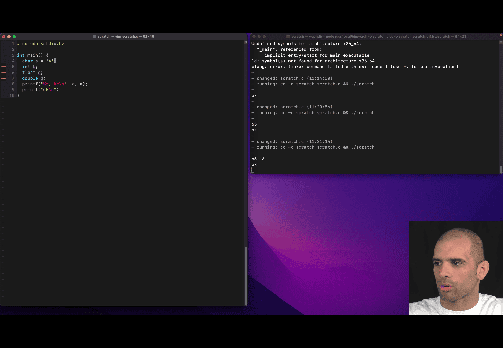

include <stdio.h>
printf ("%d, %c\n", a, a) ; -> this print the same a in different format
c -> character

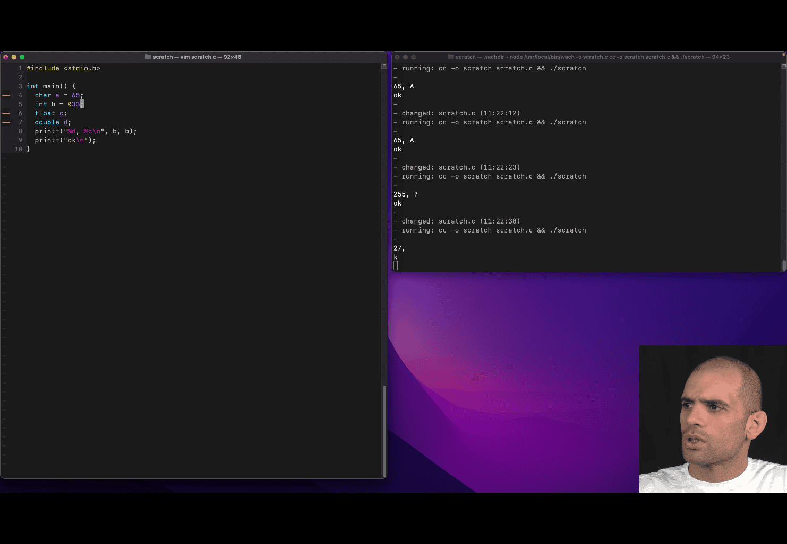
int b 033; -> octal
can't do 0b11 in c , but compiler will do that for you

"%f\n", c (float, 0.3)

long int e = 20L; ("L"-> imply this is a L (long) )

long e = 20L; (skip the "int" if using L)

short int f = 5;
short f = 5; (still make sure)

long and short is mechine related

short < = to int

int < = to long

The number of bits used by a normal `int` type in C is not fixed by the standard but has a required minimum size and commonly used sizes depending on the platform.

- **Minimum size:** The C standard specifies that `int` must be at least 16 bits [2 bytes](1)[2][5][6].
- **Common actual sizes:** On most modern systems, `int` is typically 32 bits (4 bytes), but it can also be 16 bits on some older or embedded systems[2][3][4][5][6].
- **Platform-dependent:** The exact size of `int` depends on the compiler and the hardware architecture. To find the size on your specific system, you can use the `sizeof(int)` operator in C code[2][5].

**Summary Table**

| Type | Minimum bits (C standard) | Common sizes |
| ---- | ------------------------- | ------------ |
| int  | 16                        | 16 or 32     |

**Key points:**

- `int` must be at least 16 bits, but is usually 32 bits on modern computers[1][2][4][5][6].
- The size is chosen to match what is most efficient for the target processor[1].
- Always check with `sizeof(int)` if you need to know the exact size on your platform[2][5].

**Example C code to check size:**

```c
printf("int is %zu bytes\n", sizeof(int));
```

In summary, a normal `int` in C is at least 16 bits, but is most commonly 32 bits on contemporary systems

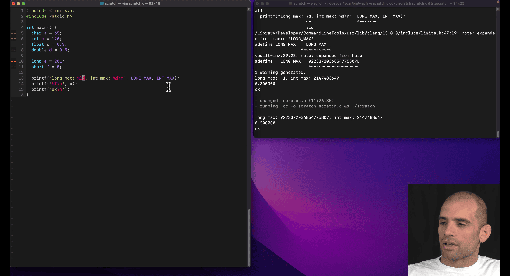
%ld -> long digit, %d -> max int
include <limits.h> -> show the limits

---

unsigned g ; and givin bits to variable

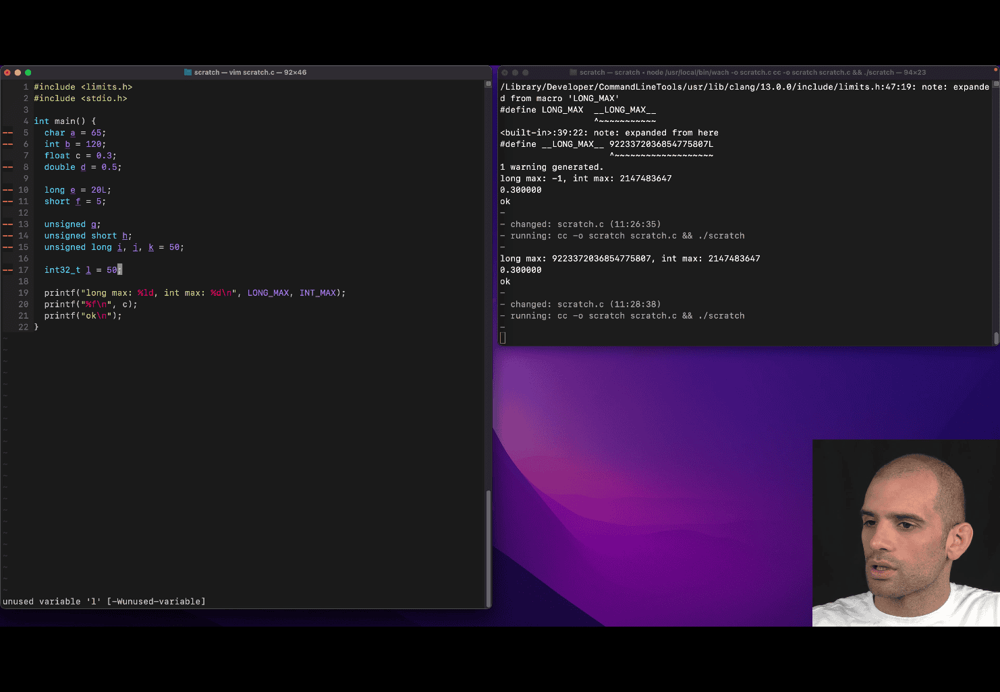

# include <stdint.h>

int32_t l = 50;

## Key Features of `<stdint.h>`

1. **Fixed-Width Integer Types**

   Provides types like `int8_t`, `int16_t`, `int32_t`, `int64_t` (signed) and `uint8_t`, `uint16_t`, `uint32_t`, `uint64_t` (unsigned).

   These types guarantee the exact number of bits, regardless of the platform.

2. **Minimum and Fastest Integer Types**

   Defines types like `int_least8_t`, `int_least16_t`, etc., which guarantee at least the specified width.

   Defines types like `int_fast8_t`, `int_fast16_t`, etc., which are the fastest types with at least the specified width.

3. **Maximum Integer Types**

   `intmax_t` and `uintmax_t` represent the largest signed and unsigned integer types supported by the implementation.

4. **Macros for Limits**

   Macros such as `INT32_MAX`, `UINT8_MAX`, etc., provide the maximum and minimum values for each type.

---

Loop syntax in C

```c
  // int n = 5;
  for (int m = 5; m > 0; m--) {
    printf("%d\n", m);
  }
```

is same as
`for (int m = 5; m; m--) {`

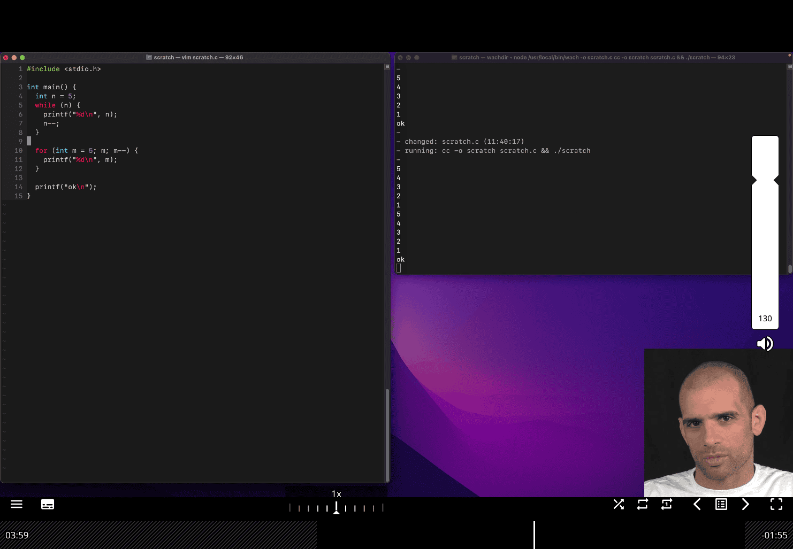

same logic -> all place in one place then use for loop

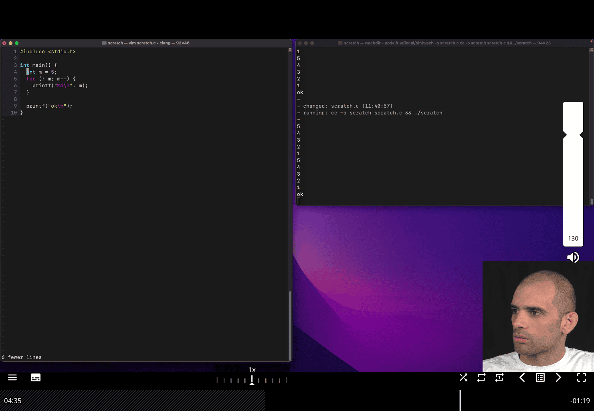

you don have to initate in the for loop statment
s

```c
for loop in while like:
for (;;){

}
for (;m;;){}

```

- `for(;;){}` -> `while (1){}`

do while (in end )

---

- What is the effect of the compiler optimization level flag?

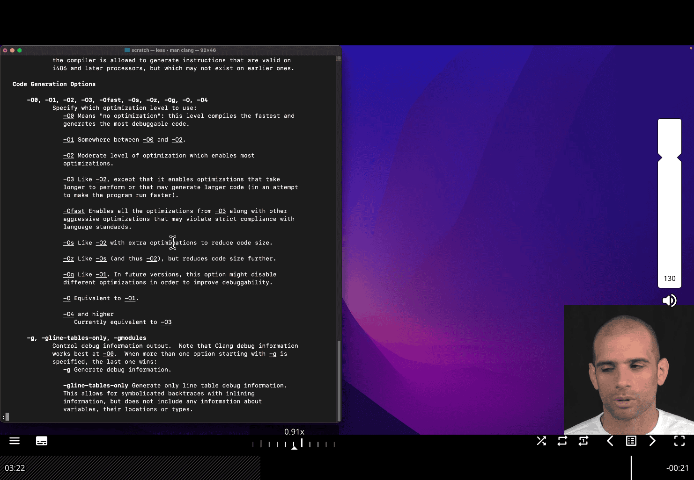

- sometime you may prefer other one , for debugging and readability e.g O1 maybe

e.g in unix , you don't want run all the optimization and just use the thing in the development

---

- What is a register?


cc -O1 -g -o inc inc.c
using lldb ./inc

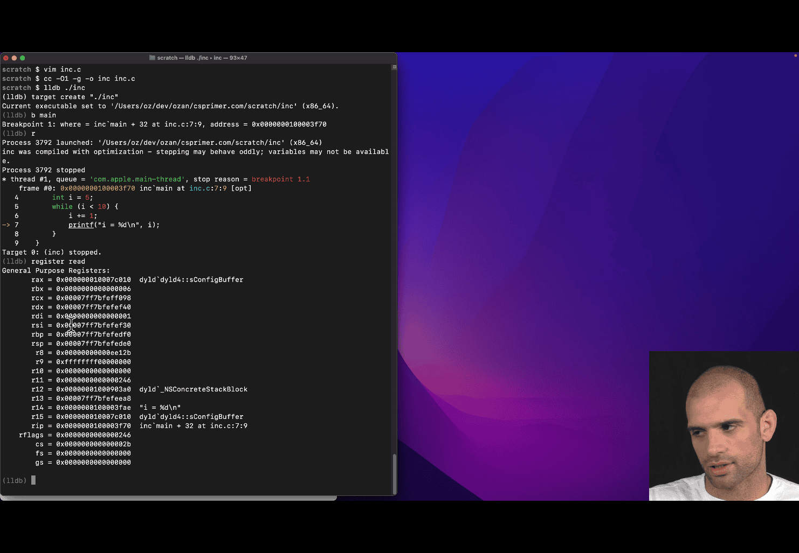

rbx -> compiler chosen to store the value of "i"

reg re -> short form of register read

reg re rbx

and apply format function to help reading

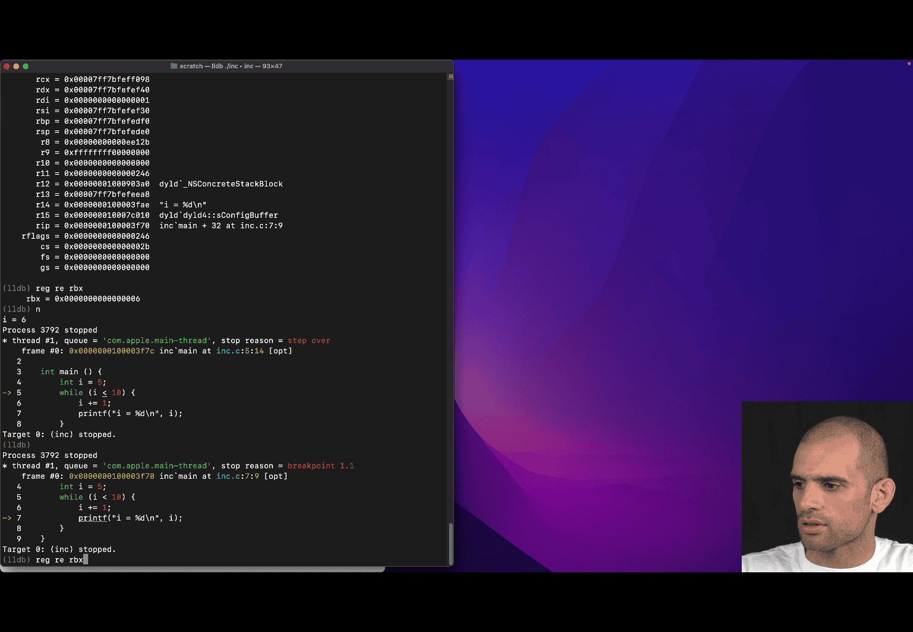

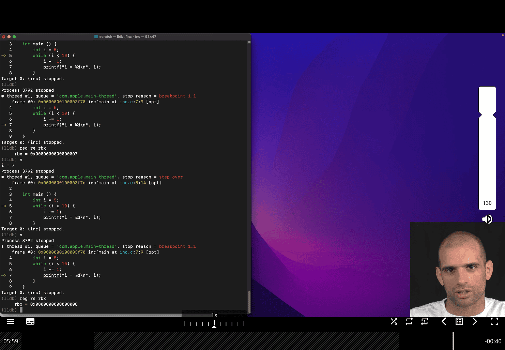

this is useful skill to check what is going on register, and register is run faster than ram

---

- Overview of pointers and arrays in C

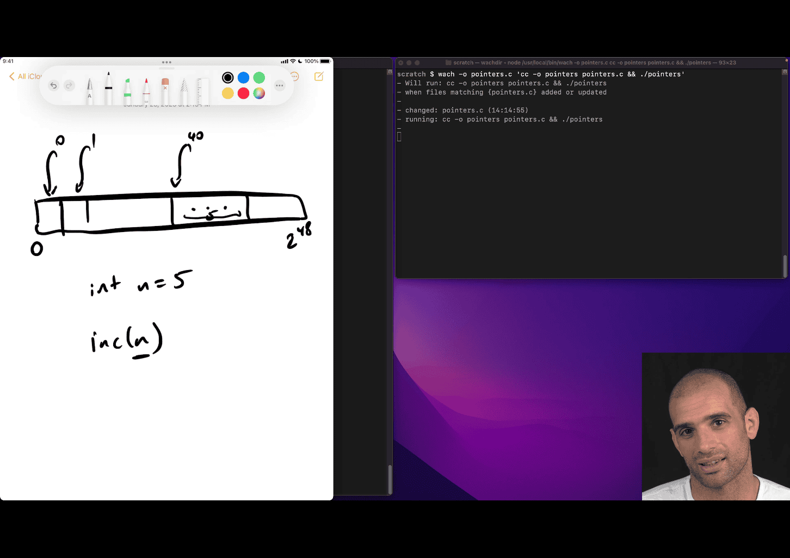

- need to pass the address to really change the value in that n = value location

inc (&n)

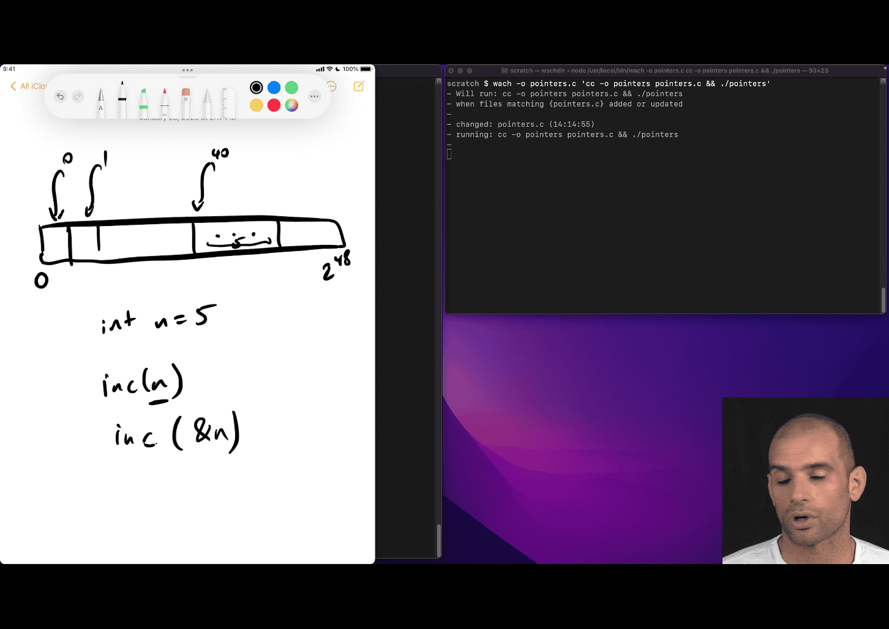
location is 40 in that cases

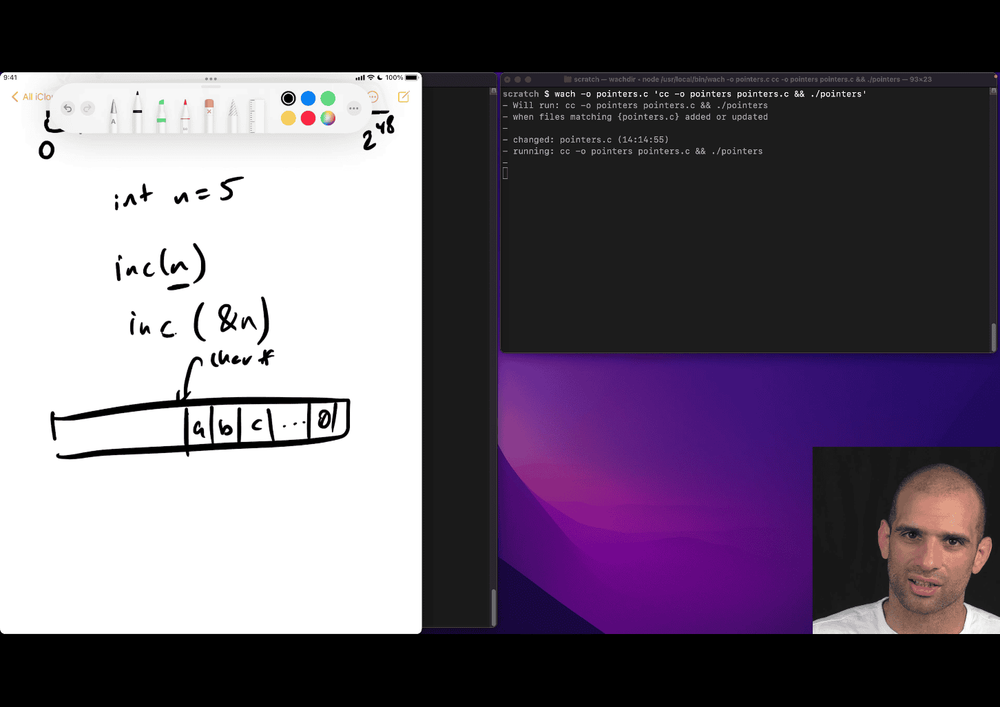

char \* -> inc(the address) then get a , inc one more -> b

last 0 -> imply it is the end

other reason, two return value e.g. need address

```c

#include <stdio.h>


int main() {
int n = 5;

    printf("*n = %d, &n = %p\n", n, (void*)&n);
    return 0;

}
```

```c
#include <stdio.h>

int main() {
  int n = 5;
  int *p = &n;

  // printf("n = %d, &n = %p\n", n, (void *)&n);
  printf("n = %d, &n = %p\n", n, p);
}

```

- same thing , `*p` is just reminder as int pointer, more like `int* p`

- `int foo = *p;` -> \* is a pointer , follow the pointer p -> get the value-> that's foo (Dereferencing)

- Dereferencing

array are syntax for pointer

array -> starting location of a thing, need type etc

`int arr[10];`
`printf("%p",arr)` %p -> pointer

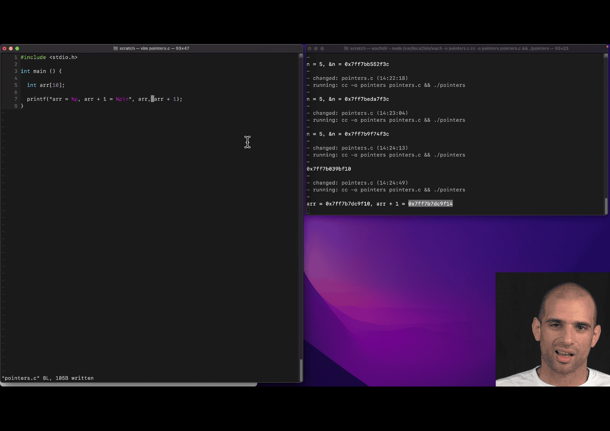

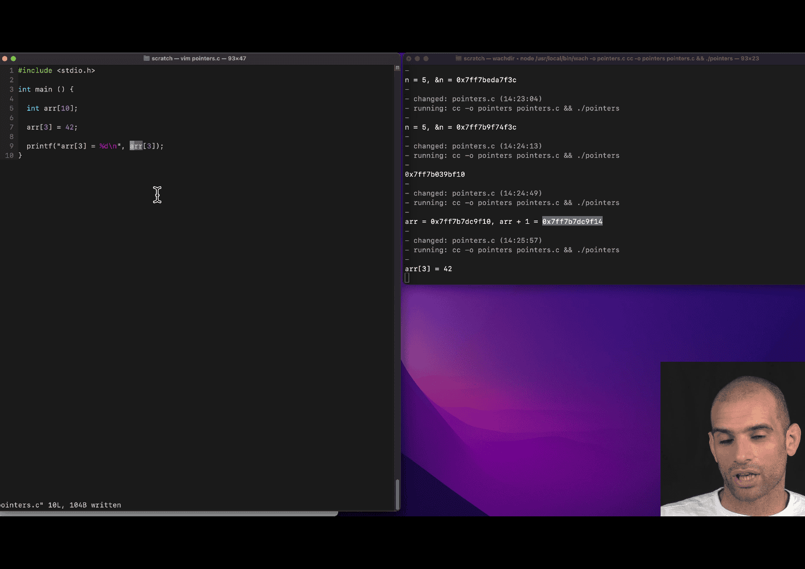

take the pointer of `arr[3]`-> return 42

deference => `*()`

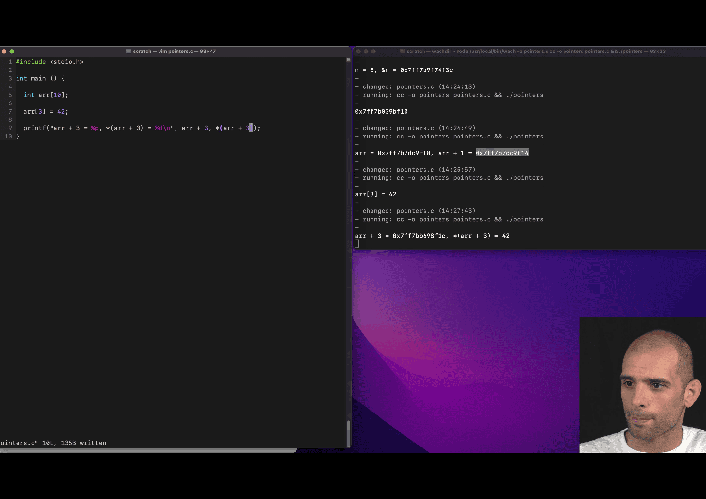

- deference => `*()`

```c
#include <stdio.h>
int main() {
    int arr[16];

    arr[3] = 42;

    printf("*arr + 3 = %p, *(arr + 3) = %d\n", arr + 3, *(arr + 3));
    return 0;
}
```

Your teacher is introducing you to the concept of **pointers** in C and how array indexing relates to pointer arithmetic. Let’s break down the key idea behind `arr[3]` being equivalent to `*(arr + 3)`.

### 1. Arrays and Pointers in C

In C, an **array** (like `int arr[16]`) is closely related to pointers. When you declare an array, the name `arr` represents the **base address** of the array, which is the memory address of the first element (`arr[0]`). This means `arr` is effectively a **pointer** to the starting point of the array in memory.

Each element in the array is stored in **contiguous memory locations**, and the size of each element depends on the data type (e.g., `int` is typically 4 bytes on most systems).

### 2. Array Indexing: `arr[3]`

When you write `arr[3]`, you’re accessing the element at index 3 of the array. This is a convenient syntax for accessing elements, but under the hood, C uses **pointer arithmetic** to locate the memory address of `arr[3]`.

### 3. Pointer Arithmetic: `*(arr + 3)`

The expression `*(arr + 3)` is the pointer-based equivalent of `arr[3]`. Let’s break it down:

- `arr` is the base address of the array (a pointer to `arr[0]`).
- `arr + 3` performs **pointer arithmetic**. It calculates the memory address of the element that is 3 positions beyond the base address. Since each `int` takes up a fixed number of bytes (e.g., 4 bytes), `arr + 3` points to the address of `arr[3]`.
- The `*` operator **dereferences** the pointer, meaning it retrieves the value stored at the address `arr + 3`. So, `*(arr + 3)` gives you the value of `arr[3]`.

### 4. Why `arr[3]` == `*(arr + 3)`?

In C, the array indexing syntax `arr[i]` is **syntactic sugar** for `*(arr + i)`. This means:

- `arr[3]` is exactly the same as `*(arr + 3)`.
- Both expressions compute the address of the element at index 3 and retrieve its value.

This equivalence exists because arrays are implemented as pointers in C, and the indexing operation is just a shorthand for pointer arithmetic and dereferencing.

### 5. Example from Your Code

In your code:

```c
int arr[16];
arr[3] = 42;
printf("*arr + 3 = %p, *(arr + 3) = %d\n", arr + 3, *(arr + 3));
```

- `arr + 3` computes the **memory address** of `arr[3]`. The `%p` format specifier prints this address (e.g., some hexadecimal value like `0x7ffee4a0c0c`).
- `*(arr + 3)` dereferences that address to get the value stored there, which is `42` (since you set `arr[3] = 42`). The `%d` format specifier prints this value.

### 6. What Your Teacher Is Teaching

Your teacher is emphasizing that:

- Arrays and pointers are deeply connected in C.
- Array indexing (`arr[i]`) is just a convenient way to perform pointer arithmetic (`*(arr + i)`).
- Understanding pointer arithmetic is key to mastering pointers, as it shows how C navigates memory to access array elements.
- By using `*(arr + 3)`, you’re directly manipulating memory addresses, which is what C is doing behind the scenes when you write `arr[3]`.

### 7. Key Takeaways

- `arr[3]` and `*(arr + 3)` are equivalent ways to access the same element.
- `arr + 3` gives you the **address** of `arr[3]`.
- `*(arr + 3)` dereferences that address to get the **value** (e.g., `42`).
- This concept is fundamental to understanding pointers, memory management, and how arrays work in C.

### 8. A Visual Explanation

Imagine the array `arr` in memory (assuming `int` is 4 bytes):

```
Index:     arr[0]  arr[1]  arr[2]  arr[3]  ...
Address:   1000    1004    1008    1012    ...
Value:     ?       ?       ?       42      ...
```

- `arr` points to address `1000` (base address).
- `arr + 3` points to address `1012` (base + 3 \* sizeof(int)).
- `*(arr + 3)` retrieves the value at address `1012`, which is `42`.
- `arr[3]` does the same thing but with simpler syntax.

### 9. Practice to Reinforce

To solidify this, try experimenting with your code:

- Print `arr[3]` and `*(arr + 3)` to confirm they’re identical.
- Print the addresses `&arr[3]` and `(arr + 3)` to see they point to the same location.
- Try accessing other indices (e.g., `arr[5]` vs. `*(arr + 5)`) to build intuition.

```c

#include <stdio.h>

int main() {
  int arr[16];
  arr[3] = 42;
  arr[5] = 99;

  printf("arr[3] = %d\n", arr[3]);
  printf("*(arr + 3) = %d\n", *(arr + 3));
  printf("pointer of arr3 = %p\n", &arr);
  printf("&arr[3] = %p\n", (void *)&arr[3]);
  printf("arr + 3 = %p\n", (void *)(arr + 3));

  printf("arr[5] = %d\n", arr[5]);
  printf("*(arr + 5) = %d\n", *(arr + 5));
  printf("pointer of arr5 = %p\n", &arr);
  printf("&arr[5] = %p\n", (void *)&arr[5]);
  printf("arr + 5 = %p\n", (void *)(arr + 5));

  return 0;
// > gcc -O1 -g -o demo demo.c && ./demo
// arr[3] = 42
// *(arr + 3) = 42
// pointer of arr3 = 0x7ffd0753f1d0
// &arr[3] = 0x7ffd0753f1dc
// arr + 3 = 0x7ffd0753f1dc
// arr[5] = 99
// *(arr + 5) = 99
// pointer of arr5 = 0x7ffd0753f1d0
// &arr[5] = 0x7ffd0753f1e4
// arr + 5 = 0x7ffd0753f1e4
}

```

arr points to address 1000 (base address).
arr + 3 points to address 1012 (base + 3 _sizeof(int)).
_(arr + 3) retrieves the value at address 1012, which is 42.
arr[3] does the same thing but with simpler syntax.

---

- The C pre-processor, macros and conditional inclusion


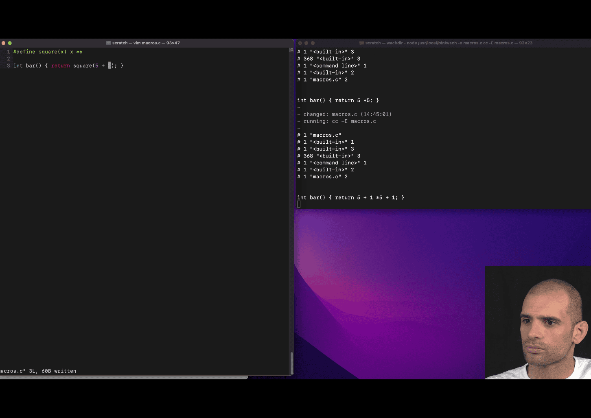

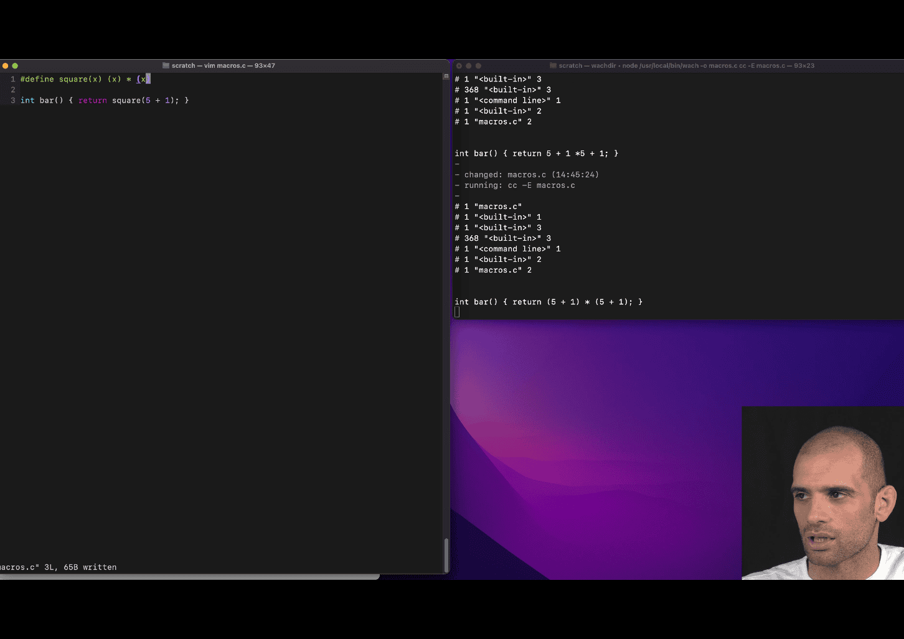

- `#define square(x) (x)*(x)`

text replacement feature before compiler

include is also is part of this

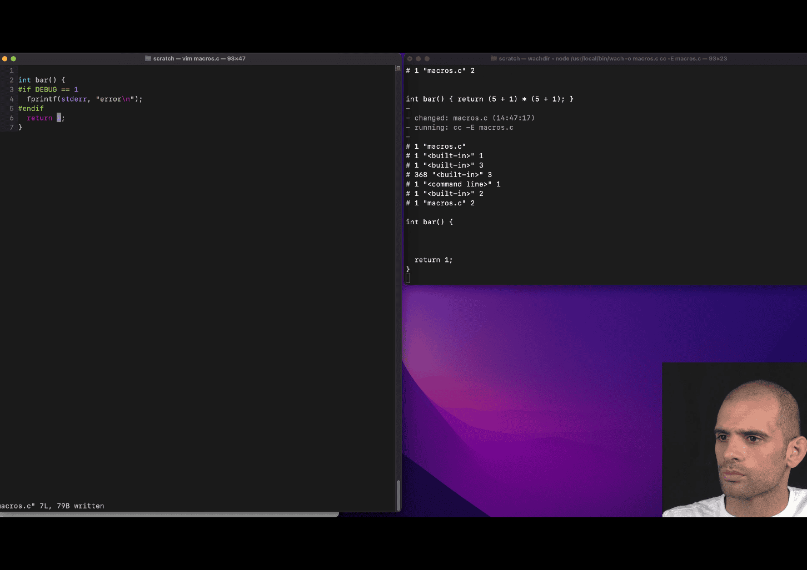

Your teacher is introducing you to **conditional compilation** in C using **preprocessor directives** like `#if`, `#endif`, and likely the concept of **macros** (e.g., `DEBUG`). The code snippet you provided has a few issues (e.g., syntax errors), but I’ll interpret it as a teaching example and explain the key concepts based on the corrected version:

```c
int bar() {
    #if DEBUG == 1
        fprintf(stderr, "error\n");
    #endif
    return 1;
}
```

Let’s break down what your teacher is trying to teach you.

### 1. Preprocessor Directives

The C preprocessor is a tool that processes your code **before** it is compiled. It handles directives starting with `#`, such as `#if`, `#endif`, `#define`, etc. In this example:

- `#if DEBUG == 1` checks whether the macro `DEBUG` is defined and has the value `1`.
- `#endif` marks the end of the conditional block.
- The code inside the `#if` block (i.e., `fprintf(stderr, "error\n");`) is **only included in the compiled program** if the condition `DEBUG == 1` is true.

### 2. Conditional Compilation

Conditional compilation allows you to include or exclude parts of your code based on certain conditions. This is useful for:

- **Debugging**: Including debug-specific code (like error messages) only when a debug mode is enabled.
- **Portability**: Including different code for different platforms or configurations.
- **Feature toggling**: Enabling or disabling features without changing the source code.

In this case:

- If `DEBUG` is defined as `1` (e.g., via a `#define DEBUG 1` or a compiler flag like `-DDEBUG=1`), the `fprintf(stderr, "error\n");` line will be included in the compiled program, printing "error" to the standard error stream.
- If `DEBUG` is not defined or has a different value (e.g., `0`), the `fprintf` line is **excluded** from the compiled program, as if it were never written.

### 3. The Role of the `DEBUG` Macro

The `DEBUG` macro is a common convention in C programming. It’s typically used to control whether debug-related code (like logging or error messages) is included. Your teacher is showing you how to:

- Use a macro to toggle debug output.
- Conditionally compile code based on whether debugging is enabled.

For example:

- During development, you might set `DEBUG` to `1` to include diagnostic messages.
- In production, you might set `DEBUG` to `0` (or leave it undefined) to exclude these messages, making the program leaner and avoiding unnecessary output.

### 4. The `fprintf(stderr, "error\n")` Line

This line uses `fprintf` to print "error" to `stderr` (the standard error stream), which is typically used for error messages or diagnostics. The `\n` ensures a newline for clean output. This is a simple example of debug output that might help you diagnose issues during development.

### 5. Why This Matters

Your teacher is teaching you how to write **flexible code** that can behave differently depending on the build configuration. This is a powerful technique because:

- You can add debug code without worrying about it appearing in the final product.
- You can control program behavior (e.g., enabling/disabling features) using compiler flags or macro definitions.
- It introduces you to the **preprocessor**, which is a fundamental part of C programming.

### 6. Fixing the Code

The code you provided has a few issues:

- The `®` character and `tendif` are likely typos. The correct directive is `#endif`.
- The stray `3` at the end is invalid and would cause a syntax error.

The corrected version (as shown above) is a minimal function that:

- Conditionally prints "error" to `stderr` if `DEBUG` is `1`.
- Always returns `1`.

### 7. How `DEBUG` Is Set

The `DEBUG` macro can be defined in several ways:

- **In the code**: Using `#define DEBUG 1` before the `#if` directive.
- **Via the compiler**: Passing a flag like `-DDEBUG=1` when compiling (e.g., `gcc -DDEBUG=1 program.c`).
- **In a build system**: Tools like `make` or CMake can set macros based on build configurations.

For example, if you compile with `DEBUG` set to `1`, the compiled program includes the `fprintf` call. If you compile without `DEBUG` or with `DEBUG` set to `0`, the `fprintf` is omitted.

### 8. Example Compilation Scenarios

Assume the corrected code:

```c
#include <stdio.h>
#define DEBUG 1
int bar() {
    #if DEBUG == 1
        fprintf(stderr, "error\n");
    #endif
    return 1;
}
int main() {
    bar();
    return 0;
}
```

- **With `DEBUG == 1`**: Running the program prints "error" to `stderr` and returns `1` from `bar()`.
- **With `DEBUG == 0`** (change `#define DEBUG 0`): The `fprintf` line is excluded, so nothing is printed, but `bar()` still returns `1`.

If you compile without defining `DEBUG` (e.g., remove the `#define`), the `#if DEBUG == 1` condition is false (since `DEBUG` is undefined and treated as `0` in preprocessor arithmetic), so the `fprintf` is excluded.

### 9. Broader Lesson

Your teacher is likely building on this to teach you:

- **Modular code**: Use preprocessor directives to make code adaptable to different scenarios.
- **Debugging techniques**: Conditionally include diagnostic output to troubleshoot issues.
- **Preprocessor mechanics**: Understand how the preprocessor manipulates code before compilation.
- **Real-world practices**: Conditional compilation is widely used in professional C projects (e.g., in libraries, operating systems, or embedded systems).

### 10. Practice to Reinforce

To deepen your understanding:

- Try compiling the code with and without `DEBUG` defined (e.g., using `-DDEBUG=1` or `-DDEBUG=0` with `gcc`).
- Modify the `#if` condition to check other values (e.g., `#if DEBUG == 2`) and observe the behavior.
- Add more debug output (e.g., print a variable’s value) inside the `#if` block.
- Experiment with other preprocessor directives like `#ifdef DEBUG` (checks if `DEBUG` is defined, regardless of its value) or `#else` to handle alternative cases.

### 11. Connection to Pointers (from Your Previous Question)

If this lesson follows your previous question about pointers (`arr[3]` vs. `*(arr + 3)`), your teacher might be systematically introducing you to core C concepts:

- **Pointers**: How memory is accessed and manipulated.
- **Preprocessor**: How code is conditionally included before compilation.
- These are foundational for writing efficient, flexible, and debuggable C programs.

If you have more questions about this code, the preprocessor, or how it ties into pointers, let me know!

---

```py
#!/usr/bin/env python3

# hex_diff.py – compute the difference between two hex values (provided as strings)
# usage: python hex_diff.py "0x7ffd0753f1d0" "0x7ffd0753f1dc"

import sys

if __name__ == "__main__":
    if len(sys.argv) != 3:
        print("usage: python hex_diff.py <hex1> <hex2>")
        sys.exit(1)
    try:
        hex1 = int(sys.argv[1], 16)
        hex2 = int(sys.argv[2], 16)
        diff = abs(hex2 - hex1)
        print("Difference (decimal):", diff)
        print("Difference (hex):", hex(diff))
    except ValueError as e:
        print("Error: invalid hex value –", e)


```

easy way to diff the hex vaule

```c
#include <stdio.h>

/* Define a debug flag. Set to 0 to disable debug output. */
#define DEBUG 1

/* A debug macro that prints a message (using do-while(0) for safety). */
#define DEBUG_PRINT(msg)                                                       \
  do {                                                                         \
    if (DEBUG)                                                                 \
      fprintf(stderr, "DEBUG: %s\n", (msg));                                   \
  } while (0)

/* A utility macro to compute the minimum of two values. */
#define MIN(a, b) ((a) < (b) ? (a) : (b))

/* Define a platform flag (e.g., PLATFORM_WINDOWS) for conditional compilation.
 */
#define PLATFORM_WINDOWS 1
#define PLATFORM_LINUX 0

/* Conditional compilation block: define CLEAR_SCREEN based on the platform. */
#if PLATFORM_WINDOWS
#define CLEAR_SCREEN "cls"
#elif PLATFORM_LINUX
#define CLEAR_SCREEN "clear"
#else
#define CLEAR_SCREEN ""
#endif

int main() {
  /* Demonstrate debug macro. */
  DEBUG_PRINT("Starting program.");

  /* Demonstrate utility macro MIN. */
  int a = 5, b = 3;
  printf("MIN(%d, %d) = %d\n", a, b, MIN(a, b));

  /* Demonstrate conditional compilation (e.g., clearing the screen). */
  printf("Clearing screen (using CLEAR_SCREEN macro)...\n");
  /* Uncomment the next line to actually clear the screen (requires stdlib.h).
   */
  /* system(CLEAR_SCREEN); */

  DEBUG_PRINT("Program finished.");
  return 0;
}


```

```
#define DEBUG_PRINT(msg)                                                       \
  do {                                                                         \
    if (DEBUG)                                                                 \
      fprintf(stderr, "DEBUG: %s\n", (msg));                                   \
  } while (0)

```

this make the debug fuction happen, debug 1 -> enable it , 0 disable

- convince

---

- A brief overview of structs in C

group all kind of variable

object without method

struct will ofter use the concept of pointer

when you use struct inside fucnction like arg , or return
large struct will be copy on stack and it will take time and space

```c
#include <stdio.h>

struct user {
  int age;
  short postcode;
  char *name; // char pointer , struct will user struct int 8 byte pointer field
};

int main() {
  struct user u = {25, 10000, "Bob"};
  struct user u2 = {17, 20000, "Alice"};
  struct user u3 = {17, 20000, "Peter"};
  struct user *p = &u3;

  printf("%s is %d years old\n", u.name, u.age);
  printf("%s is %d years old\n", u2.name, u2.age);
  // printf("%s is %d years old\n", p.name); -> this won't work
  printf("%s is %d years old\n", (*p).name, (*p).age);
  printf("%s is %d years old\n", p->name, p->age);
  printf("ok\n");
}

```

generally, struct is gonna be lay out continuely without space in the order you specific , one thing is about alignment

```c
#include <stdio.h>

struct user {
  int age;        // 4 bytes
  short postcode; // 2bytes
  char *name; // char pointer , struct will user struct int 8 byte pointer field
};

int main() {
  struct user u = {25, 10000, "Bob"};
  struct user u2 = {17, 20000, "Alice"};
  struct user u3 = {17, 20000, "Peter"};
  struct user *p = &u3;

  printf("%s is %d years old\n", u.name, u.age);
  printf("%s is %d years old\n", u2.name, u2.age);
  // printf("%s is %d years old\n", p.name); -> this won't work
  printf("%s is %d years old\n", (*p).name, (*p).age);
  printf("%s is %d years old\n", p->name, p->age);
  printf("ok\n");
  printf(" this is the address of %p %p %p %p\n ", &u, &(u.age), &(u.postcode),
         &(u.name));
}

// Bob is 25 years old
// Alice is 17 years old
// Peter is 17 years old
// Peter is 17 years old
// ok
//  this is the address of 0x7ffdb4a3d1b0 0x7ffdb4a3d1b0 0x7ffdb4a3d1b4
//  0x7ffdb4a3d1b8
//  %

```

```c
  struct user users[2] = {{1, 10000, "foo"}, {2, 10001, "bar"}};
  printf("%s is %d years old\n", users[1].name, users[1].age);


```

c is need to be able to these kind of array in a constant time
muiltiple dimensional arrays in c

struct is always in a certain size

```c
  printf("One struct is %lu bytes\n", sizeof(struct user));

```

```c
  printf("users array is at %p, \"%s\" is located at %p\n", users,
         users[1].name, &users[1].name);


```

explain how to count 0x7ffe6b1f9ea0 to 0x7ffe6b1f9eb8

users array is at 0x7ffe6b1f9ea0, "bar" is located at 0x7ffe6b1f9eb8

---

Your teacher is introducing you to **structs** in C, a fundamental concept for grouping related data, and tying it to other key ideas like **pointers**, **memory layout**, **arrays**, and **memory alignment**. The code snippets and notes you provided illustrate how structs work, their memory organization, and practical considerations like accessing fields or managing large structs. Below, I’ll explain the concept of structs based on your teacher’s examples, address the memory address calculation (e.g., from `0x7ffe6b1f9ea0` to `0x7ffe6b1f9eb8`), and clarify the key lessons your teacher is emphasizing. I’ll keep it concise, practical, and focused on your current learning level, building on your prior questions about pointers and macros.

---

### 1. Overview of Structs in C

A **struct** (short for structure) in C is a user-defined data type that groups variables of different types into a single unit. Think of it as an "object without methods" (as your teacher noted), where you bundle related data together.

#### Key Characteristics

- **Grouping Variables**: A struct combines different types (e.g., `int`, `short`, `char*`) into one cohesive type.

  ```c
  struct user {
      int age;        // 4 bytes
      short postcode; // 2 bytes
      char *name;     // 8 bytes (pointer on 64-bit systems)
  };
  ```

- **Contiguous Memory Layout**: Struct fields are laid out in memory **sequentially** in the order declared, though **alignment** (padding) may add extra bytes for efficiency.
- **Fixed Size**: Each struct instance has a predictable size, determined by its fields and alignment (e.g., `sizeof(struct user)`).
- **No Methods**: Unlike objects in languages like C++ or Java, C structs only hold data, not functions.
- **Pointers and Structs**: Structs are often used with pointers for efficiency, especially when passing to functions or returning from them, to avoid copying large data.

#### Why Structs Are Useful

- Organize related data (e.g., a `user` with `age`, `postcode`, and `name`).
- Enable arrays of structs for constant-time access (like `users[1]`).
- Support complex data structures (e.g., linked lists, trees) when combined with pointers.

---

### 2. Key Concepts Your Teacher Is Teaching

Your teacher’s code and notes emphasize several critical aspects of structs, which I’ll explain using the provided examples.

#### a) Creating and Accessing Structs

You can create struct instances and access their fields using the dot (`.`) operator:

```c
struct user u = {25, 10000, "Bob"};
printf("%s is %d years old\n", u.name, u.age); // Bob is 25 years old
```

- **Initialization**: `u` is initialized with values for `age`, `postcode`, and `name` in the order declared.
- **Dot Operator (`.`)**: Access fields directly (e.g., `u.name`).

#### b) Structs and Pointers

Structs are often used with pointers to avoid copying large data. You access fields through a pointer using:

- **Dereference (`*`)**: `(*p).name` dereferences the pointer `p` and accesses the `name` field.
- **Arrow Operator (`->`)**: `p->name` is a shorthand for `(*p).name`.

```c
struct user u3 = {17, 20000, "Peter"};
struct user *p = &u3;
printf("%s is %d years old\n", (*p).name, (*p).age); // Peter is 17 years old
printf("%s is %d years old\n", p->name, p->age);    // Peter is 17 years old
```

- **Why `p.name` Fails**: `p` is a pointer, not a struct, so `p.name` is invalid. You must dereference (`(*p).name`) or use `->` (`p->name`).
- **Lesson**: Pointers are common with structs for efficiency and flexibility, especially in functions or dynamic memory allocation.

#### c) Memory Layout and Alignment

Struct fields are laid out **contiguously** in memory, but **alignment** may add padding to ensure fields align with memory boundaries (e.g., 4-byte or 8-byte boundaries for performance).

```c
struct user {
    int age;        // 4 bytes
    short postcode; // 2 bytes + 2 bytes padding (to align next field)
    char *name;     // 8 bytes
};
```

- **Size Calculation**:
  - `int age`: 4 bytes.
  - `short postcode`: 2 bytes, but compilers often add 2 bytes of padding to align the next field (`name`) on an 8-byte boundary (common on 64-bit systems).
  - `char *name`: 8 bytes (pointer size on 64-bit systems).
  - **Total**: `4 + 2 + 2 + 8 = 16 bytes` (confirmed with `sizeof(struct user)`).
- **Example Output**:

  ```c
  printf("One struct is %lu bytes\n", sizeof(struct user)); // One struct is 16 bytes
  ```

- **Memory Addresses**:

  ```c
  printf("this is the address of %p %p %p %p\n", &u, &(u.age), &(u.postcode), &(u.name));
  // Output: 0x7ffdb4a3d1b0 0x7ffdb4a3d1b0 0x7ffdb4a3d1b4 0x7ffdb4a3d1b8
  ```

  - `&u` and `&(u.age)` are the same (base address of the struct).
  - `&(u.postcode)` is at `0x7ffdb4a3d1b4` (base + 4 bytes).
  - `&(u.name)` is at `0x7ffdb4a3d1b8` (base + 4 + 2 + 2 = 8 bytes).

- **Lesson**: Structs are laid out sequentially, but padding ensures alignment, affecting the total size and field offsets.

#### d) Arrays of Structs

Structs can be stored in arrays, allowing constant-time access with indexing:

```c
struct user users[2] = {{1, 10000, "foo"}, {2, 10001, "bar"}};
printf("%s is %d years old\n", users[1].name, users[1].age); // bar is 2 years old
```

- **Memory Layout**:
  - `users[0]` starts at the array’s base address (e.g., `0x7ffe6b1f9ea0`).
  - `users[1]` is at `base + sizeof(struct user)` (e.g., `0x7ffe6b1f9ea0 + 16 = 0x7ffe6b1f9eb0`).
- **Constant-Time Access**: `users[i]` computes the address as `base + i * sizeof(struct user)`, enabling fast access.
- **Lesson**: Arrays of structs are efficient for managing collections of structured data.

#### e) Passing Structs to Functions

Your teacher noted that passing large structs to functions or returning them copies the entire struct onto the stack, which is slow and memory-intensive:

```c
void print_user(struct user u) {
    printf("%s is %d years old\n", u.name, u.age);
}
```

- **Problem**: `u` is copied (16 bytes for `struct user`), which is inefficient for large structs.
- **Solution**: Pass a pointer instead:

```c
void print_user(struct user *u) {
    printf("%s is %d years old\n", u->name, u->age);
}
```

- **Why**: Only the pointer (8 bytes) is copied, and `->` accesses fields efficiently.
- **Lesson**: Use pointers to structs in functions to save time and space.

---

### 3. Memory Address Calculation: `0x7ffe6b1f9ea0` to `0x7ffe6b1f9eb8`

Your teacher’s example shows:

```
users array is at 0x7ffe6b1f9ea0, "bar" is located at 0x7ffe6b1f9eb8
```

x python hex_diff.py "0x7ffe6b1f9ea0" "0x7ffe6b1f9eb8"
Difference (decimal): 24
Difference (hex): 0x18

This refers to the address of the `users` array and the address of `users[1].name` (the `name` field of `users[1]`). Let’s calculate the difference and explain why it’s `0x7ffe6b1f9eb8`.

#### Step-by-Step Calculation

1. **Array Base Address**:
   - `users` is at `0x7ffe6b1f9ea0`.
   - `users[0]` starts at `0x7ffe6b1f9ea0`.
   - `users[1]` starts at `0x7ffe6b1f9ea0 + sizeof(struct user) = 0x7ffe6b1f9ea0 + 16 = 0x7ffe6b1f9eb0`.

2. **Struct Layout**:
   - Inside `users[1]`:
     - `age`: 4 bytes (offset 0: `0x7ffe6b1f9eb0`).
     - `postcode`: 2 bytes + 2 bytes padding (offset 4: `0x7ffe6b1f9eb4`).
     - `name`: 8 bytes (offset 8: `0x7ffe6b1f9eb8`).
   - `&users[1].name` is at `users[1] base + 8 = 0x7ffe6b1f9eb0 + 8 = 0x7ffe6b1f9eb8`.

3. **Hex Arithmetic**:
   - `0x7ffe6b1f9ea0` (array base).
   - Add `16` (0x10 in hex) for `users[1]`: `0x7ffe6b1f9ea0 + 0x10 = 0x7ffe6b1f9eb0`.
   - Add `8` (offset of `name`): `0x7ffe6b1f9eb0 + 0x8 = 0x7ffe6b1f9eb8`.
   - **Result**: `0x7ffe6b1f9eb8`, matching `&users[1].name`.

4. **Why This Matters**:
   - The difference (`0x7ffe6b1f9eb8 - 0x7ffe6b1f9ea0 = 0x18` or 24 bytes) shows:
     - 16 bytes for `users[0]` (entire `struct user`).
     - 8 bytes to reach the `name` field in `users[1]`.
   - This demonstrates how structs and arrays are laid out in memory, with predictable offsets.

#### Lesson

- Struct fields have fixed offsets, determined by their order and alignment.
- Arrays of structs are contiguous, with each element offset by `sizeof(struct)`.
- Pointer arithmetic (e.g., `users + 1`) computes addresses based on `sizeof(struct user)`.

---

### 4. Broader Lessons from Your Teacher

Your teacher is building a foundation for understanding how C manages data and memory:

- **Structs as Data Containers**: Group related data for clarity and organization.
- **Memory Layout**: Structs are contiguous, but alignment adds padding, affecting size and field offsets.
- **Pointers and Efficiency**: Use pointers to structs for functions, dynamic allocation, or large data to avoid copying.
- **Arrays and Constant-Time Access**: Struct arrays enable fast, indexed access, critical for data structures.
- **Practical Considerations**: Understand memory addresses and sizes (`sizeof`) for debugging and optimization.

#### Connection to Previous Questions

- **Pointers**: Your earlier question about `arr[3]` vs. `*(arr + 3)` ties to structs. Struct arrays (`users[i]`) use similar pointer arithmetic, and `->` is a pointer-based access method.
- **Macros**: You could use macros to simplify struct operations, e.g.:

  ```c
  #define PRINT_USER(u) printf("%s is %d years old\n", (u)->name, (u)->age)
  ```

  This works for both `PRINT_USER(&u)` and `PRINT_USER(p)`.

---

### 5. Practice to Reinforce

To solidify these concepts:

- **Size and Alignment**: Use `sizeof` to check the size of different structs. Reorder fields (e.g., `char*`, `int`, `short`) and observe padding changes.
- **Pointer Access**: Write a function that takes a `struct user*` and prints its fields using `->`.
- **Array Iteration**: Loop over a `struct user` array and print all users.

  ```c
  for (int i = 0; i < 2; i++) {
      printf("%s\n", users[i].name);
  }
  ```

- **Address Arithmetic**: Print addresses of all fields in `users[0]` and `users[1]` to confirm offsets.
- **Dynamic Allocation**: Create a `struct user` dynamically with `malloc` and access it via a pointer.

---

### 6. Key Takeaways

- **Structs** group variables into a single type, laid out contiguously with possible padding for alignment.
- **Pointers** are essential for efficient struct handling (e.g., `->`, passing to functions).
- **Arrays of structs** enable fast access and are stored contiguously.
- **Memory Layout**: Understand `sizeof`, field offsets, and alignment for debugging and optimization.
- **Practical Use**: Structs are the backbone of complex data structures and real-world C programs.

If you want more examples, clarification on alignment, or help with a specific struct-related task (e.g., multi-dimensional arrays, dynamic allocation), let me know!

```c
#include <stdio.h>

// Define a simple struct to represent a student
struct student {
  int id;      // 4 bytes
  short grade; // 2 bytes + 2 bytes padding
  char *name;  // 8 bytes on 64-bit systems
}; // Total: 16 bytes

int main() {
  // Create an array of 2 students
  struct student students[2] = {{1001, 85, "Alice"}, {1002, 92, "Bob"}};

  // Print the size of the struct and array
  printf("Size of struct student: %lu bytes\n", sizeof(struct student));
  printf("Size of students array: %lu bytes\n", sizeof(students));

  // Print base address of array and first student
  printf("\nArray base address: %p\n", (void *)students);
  printf("First student address: %p\n", (void *)&students[0]);

  // Access using array notation
  printf("\nUsing array notation:\n");
  printf("Student 1: %s (ID: %d, Grade: %d)\n", students[0].name,
         students[0].id, students[0].grade);

  // Access using pointer notation
  struct student *ptr = &students[1];
  printf("\nUsing pointer notation:\n");
  printf("Student 2: %s (ID: %d, Grade: %d)\n", ptr->name, ptr->id, ptr->grade);

  // Show field addresses for first student
  printf("\nField addresses for first student:\n");
  printf("id field: %p\n", (void *)&students[0].id);
  printf("grade field: %p\n", (void *)&students[0].grade);
  printf("name field: %p\n", (void *)&students[0].name);

  return 0;
}
// Size of struct student: 16 bytes
// Size of students array: 32 bytes
//
// Array base address: 0x7ffc5859c1d0
// First student address: 0x7ffc5859c1d0
//
// Using array notation:
// Student 1: Alice (ID: 1001, Grade: 85)
//
// Using pointer notation:
// Student 2: Bob (ID: 1002, Grade: 92)
//
// Field addresses for first student:
// id field: 0x7ffc5859c1d0
// grade field: 0x7ffc5859c1d4
```

- think before putting struct in functino , depends on situation

---

- The generic pointer (void \*) in C (16:21)

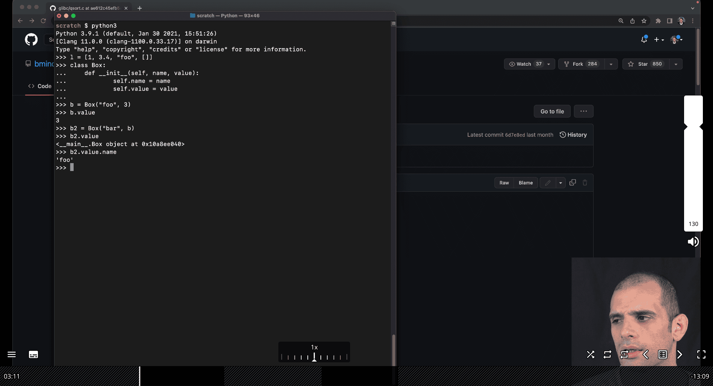

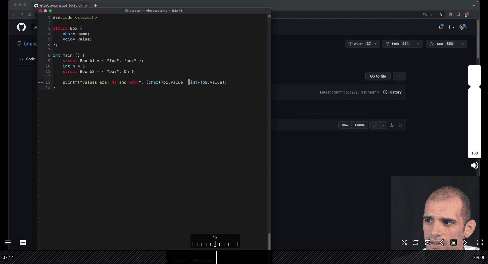
To address your question, let's assume that the context is translating the Python `Box` class scenario into C, where `b2` is an object (or struct) similar to the Python example, and we are dealing with pointers and type casting. In C, `b2.value` would likely be a pointer or a field in a struct, and you're asking about the expressions `*(int*)b2.value` and `(int*)b2.value`. Let's break this down clearly.

### Context Setup

Assume we have a C struct analogous to the Python `Box` class:

```c
typedef struct Box {
    char* name; // String for the name
    void* value; // Generic pointer for the value (to mimic Python's flexibility)
} Box;
```

Suppose:

- `b` is a `Box` struct with `name = "foo"` and `value` pointing to an integer (e.g., `3`).
- `b2` is a `Box` struct with `name = "bar"` and `value` pointing to `b` (i.e., `b2.value` holds the address of the `Box` struct `b`).

Example initialization:

```c
Box b = {"foo", malloc(sizeof(int))}; // Allocate memory for an int
*(int*)b.value = 3; // Store 3 in the allocated memory

Box b2 = {"bar", &b}; // b2.value points to b
```

Now, let's evaluate the expressions `*(int*)b2.value` and `(int*)b2.value`.

### 1. `(int*)b2.value`

- **What it does**: This is a **type cast** of `b2.value` to a pointer to an integer (`int*`).
- **Explanation**:
  - `b2.value` is a `void*` (in our struct definition), which holds the address of the `Box` struct `b`.
  - Casting it to `int*` with `(int*)b2.value` tells the compiler to treat the address stored in `b2.value` as if it points to an integer.
  - The result is an `int*` (a pointer to an integer), but it does **not** dereference the pointer—it simply reinterprets the address.
- **Value**: The address of `b` (i.e., `&b`), but now typed as `int*` instead of `void*`.
- **Correctness**: This cast is generally unsafe because `b2.value` points to a `Box` struct, not an integer. Treating the starting address of a `Box` struct as an `int*` could lead to undefined behavior if you try to use it, as the memory layout of a `Box` struct (starting with a `char*` for `name`) is not the same as an `int`.

### 2. `*(int*)b2.value`

- **What it does**: This expression first casts `b2.value` to an `int*` (as above) and then **dereferences** the resulting pointer to access the integer value at that address.
- **Explanation**:
  - As with `(int*)b2.value`, `(int*)b2.value` casts `b2.value` (which is `&b`) to an `int*`.
  - The `*` operator then tries to dereference this `int*` to retrieve the integer value at the address `&b`.
  - Since `&b` is the address of a `Box` struct, dereferencing it as an `int` assumes the first `sizeof(int)` bytes of the `Box` struct represent an integer, which is incorrect and leads to **undefined behavior**.
- **Value**: The result is undefined because the memory at `&b` contains a `Box` struct (starting with a `char*` for `name`), not an integer. The program might crash, return garbage data, or behave unpredictably.
- **Correctness**: This operation is invalid in this context because `b2.value` points to a `Box` struct, not an integer.

### Key Difference

- **`(int*)b2.value`**:
  - Returns a **pointer** (`int*`) by casting `b2.value` to an `int*`.
  - It does not access the memory at that address; it only changes the type of the pointer.
  - Result: The address `&b`, typed as `int*`.
  - Use case: You might use this if you need to pass the address to a function expecting an `int*`, but in this case, the cast is unsafe unless `b2.value` actually points to an integer.

- **`*(int*)b2.value`**:
  - **Dereferences** the casted pointer to access the value at the address.
  - Attempts to interpret the memory at `&b` as an integer, which is invalid in this context and causes undefined behavior.
  - Result: Undefined (likely garbage or a crash).
  - Use case: This would only be valid if `b2.value` pointed to an actual integer, which it does not in this scenario.

### Why This Happens

In the Python example, `b2.value` is the `Box` object `b`, and `b2.value.name` accesses `b`'s `name` field (`"foo"`). In C, `b2.value` is a pointer to the `Box` struct `b`. If you want to access `b`'s `name` field in C, you would use:

```c
((Box*)b2.value)->name
```

This casts `b2.value` to a `Box*` (since it points to a `Box` struct) and accesses the `name` field, which would return `"foo"`.

However, both `(int*)b2.value` and `*(int*)b2.value` are incorrect in this context because they assume `b2.value` points to an integer, when it actually points to a `Box` struct.

### Correct Approach

If you intended to access the integer value stored in `b.value` (i.e., `3`), you would need to:

1. Cast `b2.value` to a `Box*` to access the `Box` struct `b`.
2. Then access `b.value` and cast _that_ to an `int*` to get the integer.

For example:

```c
*(int*)((Box*)b2.value)->value
```

- `b2.value` is `&b` (a `void*` pointing to a `Box`).
- `(Box*)b2.value` casts it to a `Box*`.
- `((Box*)b2.value)->value` accesses `b.value`, which is a `void*` pointing to an integer.
- `(int*)((Box*)b2.value)->value` casts `b.value` to an `int*`.
- `*(int*)((Box*)b2.value)->value` dereferences to get the integer `3`.

### Summary

- `(int*)b2.value`: Casts `b2.value` to an `int*`, giving a pointer to `&b` typed as `int*`. Unsafe in this context.
- `*(int*)b2.value`: Dereferences the casted pointer, attempting to read an integer from `&b`, which causes undefined behavior.
- To access `b`'s `name` (`"foo"`) in C, use `((Box*)b2.value)->name`.
- To access `b`'s `value` (`3`), use `*(int*)((Box*)b2.value)->value`.

If you have a specific C code snippet or further details about the struct definition, I can refine this explanation!

- [Dereference Pointer in C | GeeksforGeeks](https://www.geeksforgeeks.org/dereference-pointer-in-c/)

---

The Correct Way to Get the Value 3

Here’s the safe way to get the 3 out of the nested structure:

_(int_)((Box\*)b2.value)->value

Let's walk through it:

    b2.value → points to b

    (Box*)b2.value → cast it back to a pointer to Box

    ((Box*)b2.value)->value → go into that Box, get its value field (which points to the int 3)

    (int*)... → cast that to an int*

    *... → dereference it to get the value 3

💡 Final Analogy

Imagine:

    b2 is a box holding another box (b)

    b holds a slip of paper with the number 3

    To get 3, you must:

        Open b2 → find b

        Open b → find the paper

        Read the paper → get 3

In code:
`*(int*)((Box*)b2.value)->value` -> this is for python example in c, point to another object value in c using
dereference and pointer and value type

---

A brief tour of LLDB (33:26)
useful skils debugging

- thinking about program execution , how this change my program state, memory change , machine change, no bug to hide

stepping through and be patient

super power

print statement can also do that, debuging he mentioned here is more like a step by step

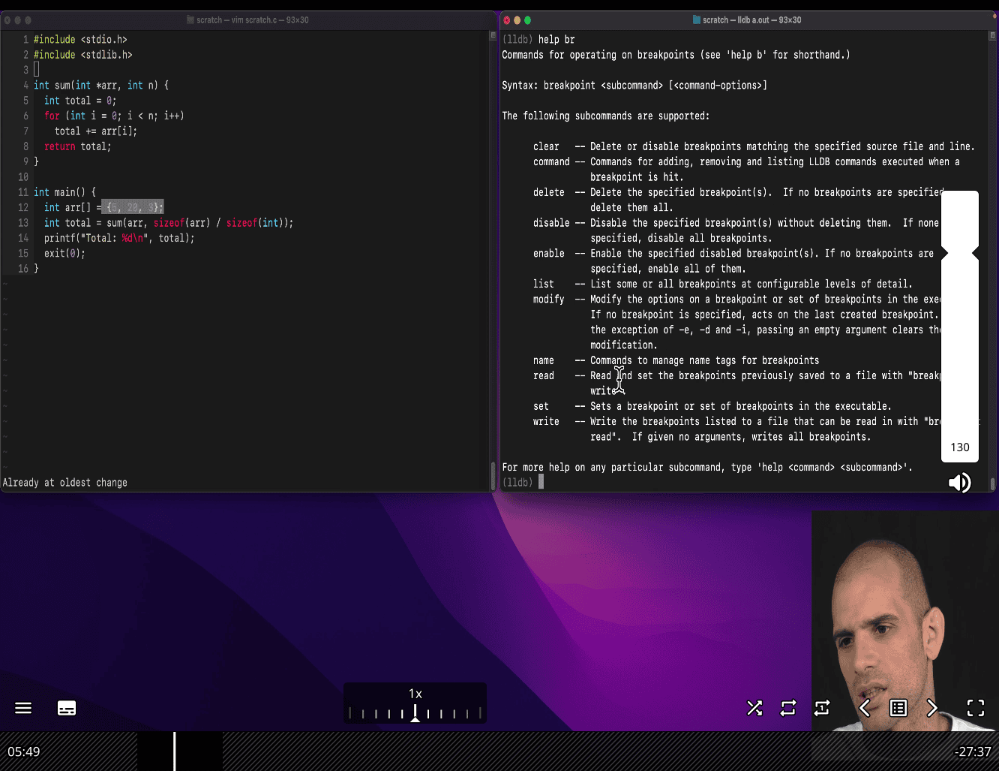
using lldb -> inside -> help -> help br

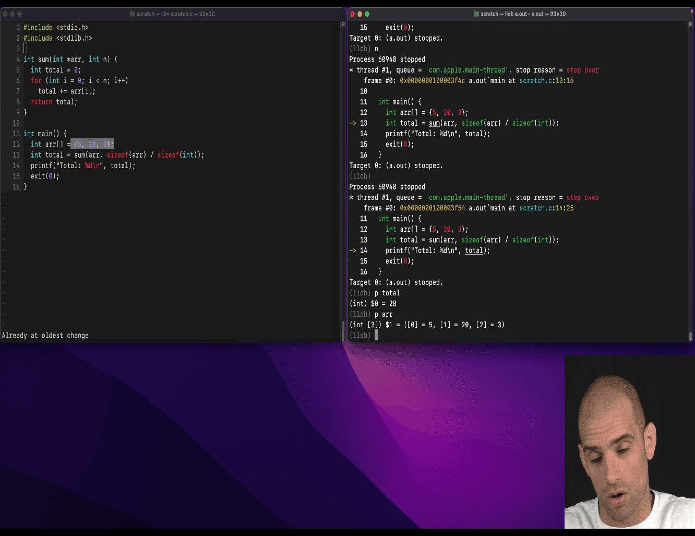

break point main
p ->print
fr select -> show current select framework

fr v -> show all the variable in the current frame

r -> rerun

s -> step -> more detail dig in

step & print -> loop n times
display total -> step until stop hook
disassemble (dis -f (frame))

- dis -f -m(map)

reg(register ) re (read) eax

where you are in the stack:
bt (backtrace)

- tracking what frame you on
- checking other frame as well

power tool -> need practice

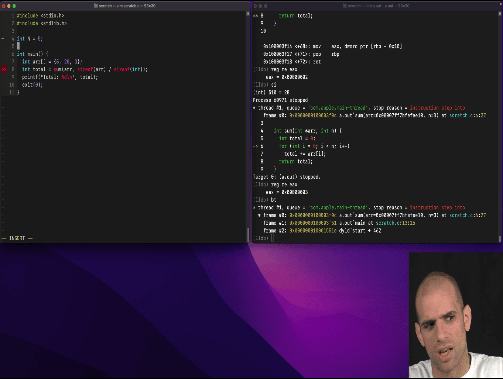

- global variable -> lldb -> look for memory

where N is being change

watchpoint

w s v N, (watchpoint set variable 'N')

c (continue until another breakpoint or watchpoint)

most of the time you won't know seting watchpoint in specific variable name but more in memory , changes?

e.g. expression, memory
Notes on LLDB Watchpoints

Watchpoints only work on variables that are in memory—not registers or optimized-out variables.

They’re limited in number (hardware-supported).

May cause performance issues if the variable is frequently modified.

Great — you're digging into the **core point your teacher is trying to make**, which is **understanding why buffer overflows overwrite other variables on the stack**. Let's explain **exactly why this overwriting happens**, and why it's so dangerous and subtle.

---

## 🧠 What Your Teacher Is Teaching

> **How stack memory works, and how writing beyond bounds (like `arr[4]`) can overwrite nearby variables like `f.a` or `f.b`.**

---

## 🔍 Stack Memory Layout (Key Idea)

When your program runs, **local variables** like `arr` and `f` are stored on the **stack** in memory.
The stack is a **contiguous block of memory**, and the compiler decides how variables are laid out.

### Example

You wrote:

```c
struct foo f = {1, 2};       // 8 bytes (2 ints)
int arr[] = {5, 20, 3};      // 12 bytes (3 ints)
```

- `arr[0]` is at address `0x308`
- `arr[1]` is at `0x30c`
- `arr[2]` is at `0x310`
- `arr[3]` is undefined
- `arr[4]` is at **`0x318`**

But `f` starts at `0x314`!

So:

```text
0x308: arr[0]
0x30c: arr[1]
0x310: arr[2]
0x314: f.a   👈 gets overwritten!
0x318: f.b   👈 you're writing 90 here!
```

> That means **`arr[4] = 90` actually writes to `f.b`**, possibly even smashing `f.a` in some compiler configurations.

---

## 💥 Why Overwriting Happens

### 1. **Arrays don’t have bounds checking in C**

C just lets you do:

```c
arr[4] = 90;
```

Even though the array only has 3 elements, C doesn’t stop you.
It simply computes:

```c
*(arr + 4) = 90;  // Writes 90 to memory 16 bytes after arr[0]
```

---

### 2. **Memory is Reused on the Stack**

Variables like `arr` and `f` are laid out **next to each other** in memory, like:

```text
[ arr[0] ][ arr[1] ][ arr[2] ][ maybe padding ][ f.a ][ f.b ]
```

If you write beyond `arr`, you literally write into the space used by `f`.

---

### 3. **No Protection or Warning**

Unless you use tools like AddressSanitizer, C won’t warn you or protect you.

---

## ✅ What Your Teacher’s Trying to Teach

> When you write out of bounds (`arr[4] = 90`), you’re **not just "doing something wrong"**, you’re **potentially corrupting another variable**.
> Even worse — sometimes this works “fine” and you won’t notice. That makes it **harder to debug** and **dangerous in real systems**.

---

## 🧪 Why This Is “A Small Chance” Case

Because the memory layout on the stack **depends on the compiler**, **optimization settings**, and **how variables are arranged**:

- Maybe `f` comes **after** `arr` (like in your case)
- Maybe `f` comes **before** `arr` (no overwrite)
- Maybe there's **padding** (nothing gets hit)
- Maybe `f.a` or `f.b` gets corrupted

> So whether `arr[4] = 90` overwrites `f.a` is a **coincidence of stack layout** — that’s why your teacher said “small chance”.

---

## 🧠 Takeaway Message

**C lets you shoot yourself in the foot.** Writing outside of an array:

- Corrupts nearby variables
- Is invisible unless you're looking carefully
- Creates dangerous, hidden bugs

That’s why this example is so important. He’s teaching you to **respect memory boundaries**, and **understand how the stack works**, not just memorize rules.

---

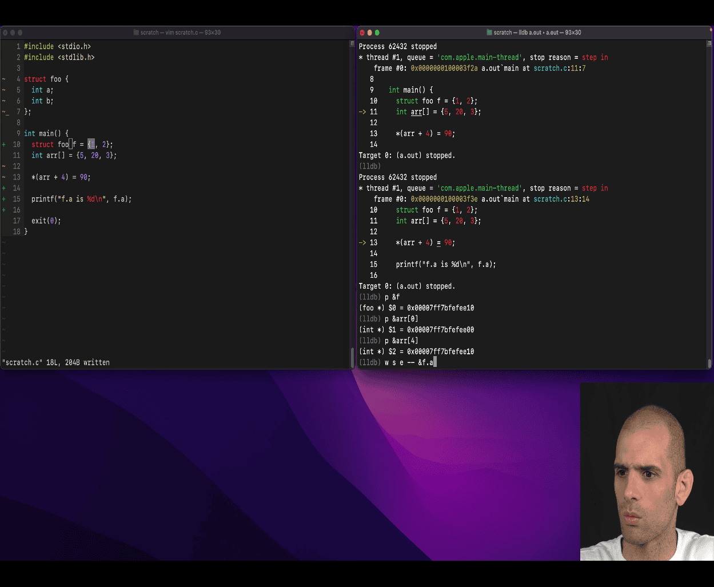
watch that located of memory by anyone who change /write it

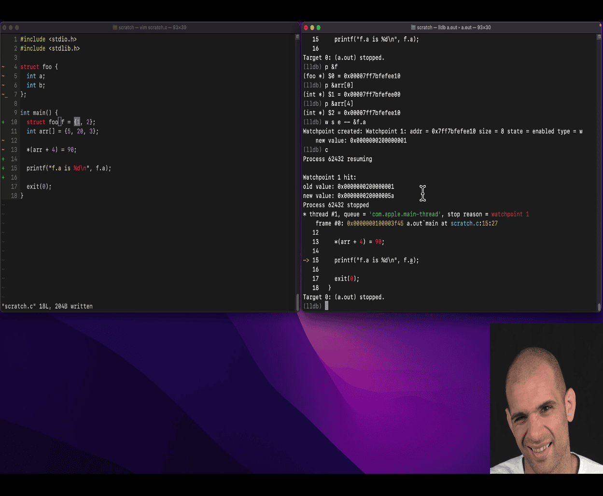

without lldb -g , still using lldb to reverse'eng:

using reg re and regsiter read -all

list main
list

stack more info:

---

## 📦 What Is the Stack?

The **stack** is a **region of memory** used for:

- Function call bookkeeping
- Local variables
- Passing function arguments

It’s called a **"stack"** because it behaves like a stack data structure: **Last In, First Out (LIFO)**.

---

## 📐 Key Characteristics of the Stack

| Feature            | Description                                                                   |
| ------------------ | ----------------------------------------------------------------------------- |
| **Grows downward** | Stack starts at high memory and grows to lower memory addresses               |
| **Fast**           | Access to stack memory is very fast (compared to heap)                        |
| **Automatic**      | Allocated automatically when a function is called, cleaned up when it returns |
| **Contiguous**     | Memory for each function is laid out in a single, continuous region           |

---

## 🧱 Stack Frame Layout (per function call)

When you call a function, the program creates a **stack frame**.
Each stack frame contains:

1. Return address (where to return after function ends)
2. Saved registers (e.g., base pointer)
3. Local variables
4. Function arguments (sometimes passed in registers instead)

---

## 🧪 Example: Stack Frame Visualization

Let’s say you have this:

```c
int main() {
    int a = 1;
    int b = 2;
    int arr[3] = {5, 10, 15};
    return 0;
}
```

A simplified view of the stack (assuming no padding) might look like this:

```
Stack (grows downward)
-------------------------
| arr[2]      = 15       | ← lower memory
| arr[1]      = 10       |
| arr[0]      = 5        |
| b           = 2        |
| a           = 1        |
-------------------------
↑ high memory
```

But **this order is chosen by the compiler**. It could also be:

```
| a           = 1        |
| b           = 2        |
| arr[0]      = 5        |
| arr[1]      = 10       |
| arr[2]      = 15       |
```

Or with **padding** for alignment (e.g., 8-byte alignment on 64-bit systems), it could look different.

---

## 🤯 Why Memory Bugs Happen

Because the compiler decides the order of local variables, if you write **beyond the bounds of `arr`**, like:

```c
arr[3] = 999;
```

You're writing into **whatever is laid out after `arr`**, which could be `b`, `a`, or some saved register or return address — **corrupting the program**.

---

## 🎯 What Your Teacher Is Demonstrating

Your teacher wants you to **understand that:**

1. **Variables are not isolated boxes**. They live side-by-side on the stack.
2. **Array bounds aren’t checked in C**, so writing beyond the end affects what comes after it.
3. **The compiler controls layout**, so bugs might not show every time (which makes them dangerous).
4. **Memory corruption can be subtle**, and is often **only caught by debugging tools** like LLDB or ASan.

This is especially important if you plan to do:

- Systems programming
- Embedded programming
- Security (buffer overflows = exploits!)
- Debugging mysterious crashes

---

## 🛡️ Tools to Catch These Bugs

- `valgrind` — detects invalid memory access
- `AddressSanitizer` (`-fsanitize=address`)
- `lldb` watchpoints or stepping
- Compiler warnings: `-Wall -Wextra -Werror`

---

## 👣 Summary

- The **stack is a contiguous, compiler-managed memory block** used for local variables and function calls.
- Local variables are **laid out adjacent to each other**, so an out-of-bounds write can **corrupt another variable**.
- This is **undefined behavior**, and your program might silently break, crash, or leak data.
- Your teacher is helping you build **intuition** about memory layout — a critical foundation for good C programming and debugging.

---

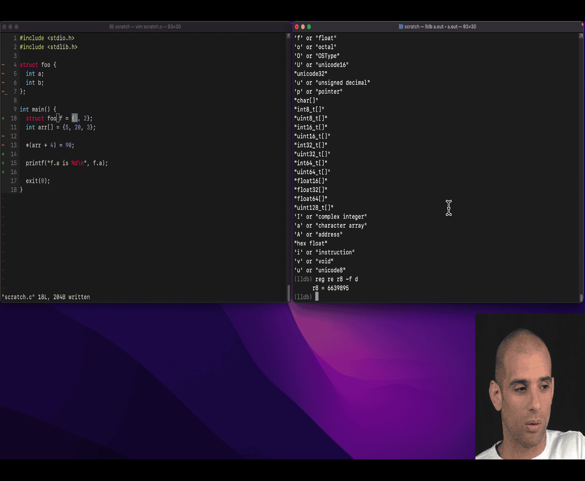
reg re r8 -f d (format ) as d (decimal )

reg re rsp (stack) using this as memory read

mem read $rsp

mem read $rsp-32

Yes — your teacher is absolutely right:
Using commands like

```bash
mem read $rsp
mem read $rsp - 32
```

is **very useful**, especially when you're inspecting the **stack frame** during debugging or reverse engineering.

Let’s break down exactly what’s going on and **why this is powerful**.

---

## 🧠 What Is `$rsp`?

`$rsp` is the **stack pointer register** on x86_64 systems.

- It **points to the top of the stack** (the most recent function call’s stack frame).
- Stack memory typically grows **downward** (from high addresses to low addresses).

---

## 🔍 What Does This Do?

### 1. `mem read $rsp`

> 🔎 This reads and dumps memory **starting at the current stack pointer**.

You’re looking at:

- Local variables (if they're close to the top)
- Return addresses
- Saved registers

---

### 2. `mem read $rsp - 32`

> 🔎 This reads memory **just above the stack pointer** (i.e., from earlier in memory).

This is helpful because:

- Some local variables are placed **above** the current `$rsp` value (because the compiler might allocate space before moving the stack pointer).
- It lets you look into the **"past"** stack content — maybe even caller function info.

---

## 📐 Why It’s Useful

### ✅ 1. **Find Function Arguments, Locals, and Return Addresses**

Inspect stack memory around `$rsp` to see how things are laid out:

```text
       ^ higher addresses (older data)
       |
       | [ arr[2] ]
       | [ arr[1] ]
       | [ arr[0] ]
       | [ saved rbp ]
$RSP → | [ return address ]
       v lower addresses
```

You can trace:

- Where variables live in memory
- What values are passed
- What got overwritten (e.g. by buffer overflow)

---

### ✅ 2. **Catch Bugs or Corruptions**

Imagine you accidentally write `arr[10] = 99;`

Then use:

```bash
mem read $rsp
mem read $rsp - 32
```

You might **see what was overwritten** — even if it’s outside your declared array.

---

### ✅ 3. **Manually Reconstruct the Stack Frame**

Without debug symbols, this is your way of reconstructing:

- What’s on the stack
- What values correspond to which variables
- Which values might be function arguments or return addresses

This is why reverse engineers and security researchers do this all the time.

---

## 🔧 Try It Yourself

Write a C program:

```c
#include <stdio.h>
void foo(int x) {
    int a = 5;
    int b = 10;
    int arr[3] = {1, 2, 3};
    a = 100; // Change a to see it in stack
    b = 200;
    arr[0] = 11;
    arr[1] = 22;
    arr[2] = 33;
    printf("Done\n"); // Set a breakpoint here
}

int main() {
    foo(999);
    return 0;
}
```

Compile **without `-g`**, run LLDB, break at `foo`, and try:

```bash
(lldb) reg read rsp
(lldb) mem read $rsp
(lldb) mem read $rsp - 32
(lldb) mem read $rsp + 32
```

You’ll start **seeing values match your variables** — and really understand the stack.

---

## 🧭 Summary

- `$rsp` points to top of the stack.
- `mem read $rsp` shows you current stack contents.
- `mem read $rsp - 32` shows you memory **above** the stack (older values or locals).
- It's a **powerful technique** for inspecting function state, catching overflows, and reverse engineering.

You're learning **how to inspect programs like a CPU debugger** or hacker. Keep going — this is foundational knowledge for systems programming, debugging, and security.

Would you like a simple visual diagram showing how stack variables are laid out relative to `$rsp`?

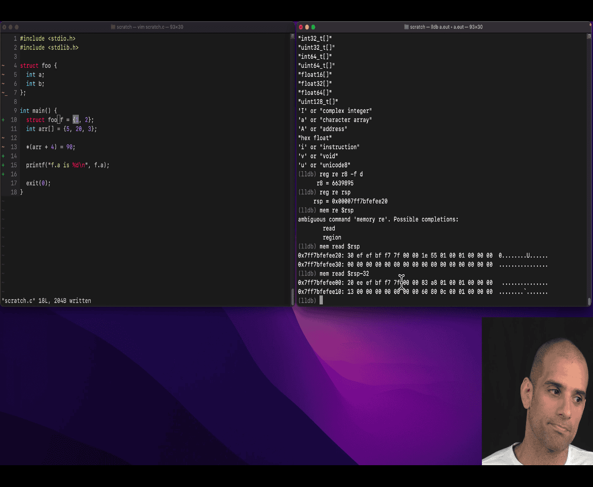

- this is actually funny, I want to learn it later

---

Helping Jessica understand void\*\* (39:35)

steps -> to get the value

int x = 5;
-> x -> 5, x -> memory address -> contain value 5 in hex
32 bits

int `*y` = &x; pointer -> address of x (aka referencing)
and there is a value , the value is y (on the stack (register))

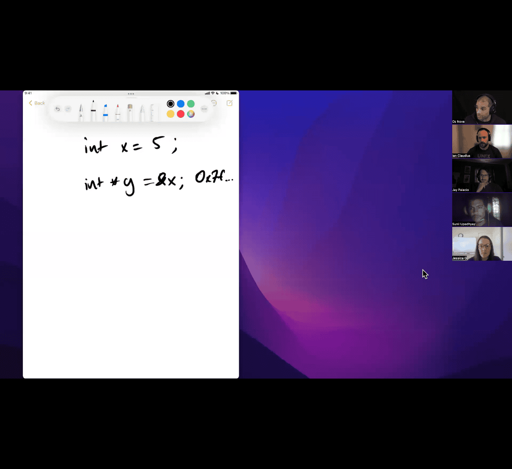
y:

- 64 bits values ->

int \*\*z = &y; OR &(&x); -> same (type decoration) (two derefercing)

int d = \*\*z; ? asking

int e = \*\*(&&x);

adding 1 to a adderss -> get you another address(refercen to a int),
adding 1 to a int -> get the number

- one is 64bits , another is 32bits

beware of the type mismatch,

Let’s break it down in **clear steps**:

---

## 🧠 1. `int x = 5;` → What happens?

When you declare:

```c
int x = 5;
```

You are:

- Creating a variable `x`
- Storing the **value `5`** in it
- The value `5` is of type `int`, which is typically **32 bits (4 bytes)** on modern systems (even 64-bit ones)

✅ So:
**The value** of `x` is `5` → `int` → 32 bits

---

## 📦 2. What about `&x` (the address of x)?

When you write:

```c
int *y = &x;
```

You’re saying:

- "Let me store the **address of `x`** in a pointer `y`"
- This **address** (like `0x7ffeefbff4ac`) is a **memory location**
- On a **64-bit system**, **addresses are 64 bits (8 bytes)**

✅ So:
**The address** of `x` is a 64-bit value
**The pointer `y`** is also a 64-bit variable (it holds a memory address)

---

## 🧠 3. Visualizing `x`, `y`, and `z`

```c
int x = 5;      // x = 5
int *y = &x;    // y = address of x
int **z = &y;   // z = address of y
```

Now, let’s walk through this:

| Variable | Type    | Value          | Size    |
| -------- | ------- | -------------- | ------- |
| `x`      | `int`   | `5`            | 32 bits |
| `y`      | `int *` | address of `x` | 64 bits |
| `z`      | `int**` | address of `y` | 64 bits |

---

## 📍 Why This Matters

- **Integers** like `x` are values: 32 bits.
- **Pointers** like `y`, `z` are memory addresses: 64 bits.

The **C type system** enforces that when you dereference something, you know **what type it points to**.

```c
*y     // means: get the int stored at the address y points to
**z    // means: get the int stored at the address that z points to, which itself points to another address (y)
```

---

## 🔄 Address Arithmetic Note

You mentioned:

> Adding 1 to an address gives you the address of the next value (in that type)

Yes! That’s **pointer arithmetic**.

For example:

```c
int *p = &x;
p + 1     // moves forward by 4 bytes (size of int)
```

Because `p` is an `int*`, `p + 1` means "skip one int" = +4 bytes.

If it were a `double*`, `p + 1` would mean +8 bytes (size of `double`).

---

## ✅ TL;DR

| Concept         | Explanation                                |
| --------------- | ------------------------------------------ |
| `int x = 5;`    | Stores a 32-bit value (on most systems)    |
| `&x`            | Gives you the 64-bit memory address of `x` |
| `int *y = &x;`  | Pointer `y` stores a 64-bit address        |
| `int **z = &y;` | Pointer-to-pointer `z` stores y's address  |

So:

- **Value (`x`) = 32 bits**
- **Address of x (`&x`) = 64 bits on 64-bit systems**

This distinction between **value** and **address** is fundamental in C.

---

void pointer +1 will get you very next address

> **"Void pointer +1 will get you very next address, generic pointer"**

This is a **deep concept in C** involving `void*` (a generic pointer), and how pointer arithmetic works.

---

## 🔍 What is a `void*`?

In C:

```c
void *p;
```

This is a **generic pointer** — it can **point to any type**, but the compiler **doesn’t know the size** of the thing it's pointing to.

For example:

```c
int x = 5;
void *p = &x;   // ok: p points to an int, but compiler doesn't know that
```

✅ `void*` is often used in:

- Memory functions like `malloc`
- Data structures like linked lists
- APIs that work with many types

---

## ❌ Pointer Arithmetic Is Not Allowed on `void*` (in C)

Your teacher said:

> “void pointer + 1 will get you very next address”

That’s only **partially true**, and it depends on the language:

### 🛑 In **C**

```c
void *p = malloc(10);
p = p + 1;   // ❌ Error: arithmetic on a pointer to void is not allowed
```

- Why? Because **C doesn't know the size of a `void`**, so it **can’t calculate `p + 1`**
- You need to **cast** the pointer first:

```c
p = (char *)p + 1;   // ✅ now it works — moves 1 byte forward
```

### ✅ In **GNU C extensions** or **C++**, some compilers may allow it

- `p + 1` is treated like adding 1 **byte**
- This is **non-standard**, but that's what your teacher might mean when they say **"get next address"**

---

## 🧠 Why Cast to `char*` or `uint8_t*`?

If you want to move byte-by-byte:

```c
void *p = malloc(100);
char *cp = (char *)p;
cp = cp + 1;  // ✅ move 1 byte
```

Or:

```c
uint8_t *bp = (uint8_t *)p;
bp += 5;      // move 5 bytes
```

---

## ✅ Summary

| Concept                    | Explanation                                                                          |
| -------------------------- | ------------------------------------------------------------------------------------ |
| `void*`                    | Generic pointer to unknown type                                                      |
| Cannot do `void* + 1` in C | Compiler doesn’t know the size of the pointed-to type                                |
| Cast to `char*` to do math | Moves 1 byte at a time                                                               |
| `p + 1` after cast         | Advances 1 byte (for `char*`), 4 bytes for `int*`, etc.                              |
| Your teacher’s point       | Adding 1 to a casted `void*` gives you the **next memory address**, **byte by byte** |

---

### 👀 Example Demo

```c
#include <stdio.h>
#include <stdlib.h>

int main() {
    void *p = malloc(10);
    printf("Original: %p\n", p);

    // Cast to char* to do arithmetic
    void *q = (char *)p + 1;
    printf("After +1: %p\n", q);

    free(p);
    return 0;
}
```

This will print two addresses, 1 byte apart.

---

Absolutely! Casting is a **core concept in C**, and it’s essential for low-level control and understanding how C manages memory and types.

---

## 🔁 What Is a Cast?

**Casting** in C means **explicitly converting a value from one type to another**.

You do this using this syntax:

```c
(new_type) value
```

---

### ✅ Example 1: Simple cast (numeric)

```c
int a = 10;
int b = 3;
float result = (float)a / b;
```

- `a / b` would normally do integer division: `10 / 3 = 3`
- But `(float)a` converts `a` to 10.0
- So `(float)a / b` becomes `10.0 / 3` = `3.333...`

👉 **Why cast here?** To get _floating point_ division.

---

## 🧠 Two Main Kinds of Casts

### 1. ✅ **Value casts** (like `int → float`, or `char → int`)

Used for arithmetic or formatting:

```c
int a = 65;
char c = (char)a;  // c now holds 'A'
```

### 2. 🔧 **Pointer casts** (like `void* → int*`, or `char* → void*`)

Used when working with memory:

```c
void *p = malloc(sizeof(int));
int *ip = (int *)p;  // now you can dereference it like an int*
```

👉 You tell the compiler:

> “Hey, trust me — this memory is actually of type `int*`.”

---

## ⚠️ Why Casts Are Powerful (and Dangerous)

C gives you **low-level control**, but **you must be careful**.

### Example: memory reinterpretation

```c
float pi = 3.14;
int *hack = (int *)&pi;
printf("%x\n", *hack);  // view raw bits of float as an int
```

- Here, you’re reinterpreting the memory of `pi` as if it’s an `int`
- Useful in systems, hardware, and networking — but dangerous if misused

---

## 🧰 Common Use Cases

| Use Case                        | Example                         |
| ------------------------------- | ------------------------------- |
| Prevent integer division        | `(float)a / b`                  |
| Pointer type conversion         | `(int *)void_ptr`               |
| Byte-wise memory access         | `(char *)array + i`             |
| Type punning / bit manipulation | `(int *)&float_var`             |
| Casting away `const` (rare)     | `(int *) (uintptr_t) const_ptr` |

---

## 👎 What You **Should Not** Do

### Example: invalid pointer cast

```c
float pi = 3.14;
int *ip = (int *)&pi;      // not safe: breaks strict aliasing
```

This may work **on your machine**, but **it's undefined behavior** in C.

✅ Safer way: use `memcpy()` to extract raw bytes.

---

## 🧠 Cast vs Implicit Conversion

C sometimes **auto-converts types**, like:

```c
int x = 10;
float y = x;   // auto-cast to float
```

But you cast **manually** when:

- You need precision
- You deal with raw memory or void pointers
- You want to override default behavior

---

## 🎯 TL;DR Summary

| Concept | Explanation                                                 |
| ------- | ----------------------------------------------------------- |
| Cast    | Explicitly convert a value to another type                  |
| Syntax  | `(new_type) value`                                          |
| Why     | Fix type mismatches, enable memory tricks, control behavior |
| Risks   | You bypass type safety — can cause bugs or crashes          |

---

Would you like a visual diagram of how pointer casting affects memory interpretation?

pointer attacking -> make it larger bits

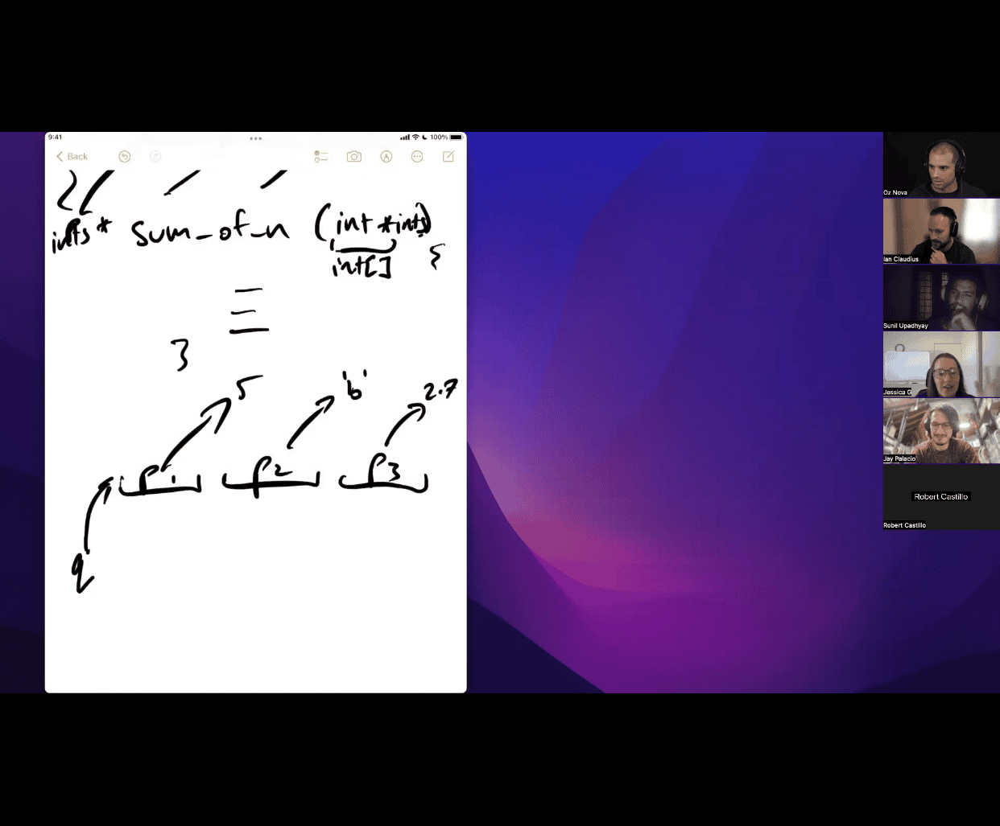

Great question — your teacher is definitely trying to explain a concept that trips up a lot of learners: **pointers to pointers** (especially `void **` or `int **`) and how **function parameters work** when you're modifying data through multiple layers of indirection.

---

### 🧠 WHAT IS HE TEACHING?

Your teacher is teaching **pointer-to-pointer logic**, likely in the context of:

1. Passing an array of pointers (e.g., `char *argv[]` or `int *p[]`)
2. Dynamic memory allocation
3. Understanding why you need `T **` when you want to **modify a pointer itself** inside a function

---

### 🔍 Image Context Breakdown

Let’s interpret the image step by step:

#### Top

```
int ** → sum_of_n((int **)int1)
```

- Looks like a function is accepting an `int **` parameter.
- He may be simulating the signature: `int sum_of_n(int **arr)` (or `int sum_of_n(int *arr[])`)
- The `(int **)int1` indicates **a cast**, forcing something to be treated as an `int**`.

#### Bottom

```
q → p1 → 3
     p2 → 5
     p3 → 6
```

Looks like:

```c
int a = 3, b = 5, c = 6;
int *p1 = &a;
int *p2 = &b;
int *p3 = &c;
int *arr[] = {p1, p2, p3};
int **q = arr; // q points to p1
```

So `q` is `int **`, pointing to an array of `int *`.

---

### 🎯 What is `p1`, and Why is `q` a Pointer-to-Pointer?

#### 🧩 The key logic

- `p1` is `int *` → it holds the address of an `int` (like `&a`)
- `arr` is an array of `int *` → e.g., `{p1, p2, p3}`
- `q` is a pointer to the array — so its type is `int **`

> Because `q` points to `p1`, and `p1` points to `3`, `q` is **two levels of indirection** away from `3`.

So:

```c
**q == *p1 == 3
```

---

### 💡 Why is this confusing to many?

Because it's easy to mix up:

| Expression | Meaning                  | Type     |
| ---------- | ------------------------ | -------- |
| `x`        | variable (e.g., `int x`) | `int`    |
| `&x`       | address of x             | `int *`  |
| `*p`       | dereference once         | `int`    |
| `**q`      | dereference twice        | `int`    |
| `q`        | pointer to pointer       | `int **` |

---

### ✅ Summary

- `p1` is of type `int *`
- `q` is of type `int **` — a pointer to `p1`
- You need a `**` (pointer to pointer) when you want to pass a pointer **by reference** (like changing what a pointer points to)
- This is a **common source of bugs/confusion**, especially when doing dynamic allocation or pointer array manipulation

---

### 🔧 Real-world example: Allocating memory

```c
void make_array(int **p) {
    *p = malloc(sizeof(int) * 10); // modify the original pointer
}
```

This works because you’re passing an `int **` — a pointer to the original pointer. Inside the function, `*p = ...` updates the actual pointer that the caller sees.

---

> **`q` is a `void **` (pointer to a void pointer)\*\*

This is a classic topic in **generic programming and memory manipulation in C**, and it’s very useful to understand **how and why you'd use `void **`instead of`int **`or`char **`\*\*.

---

## 🧠 What Is `void **`?

- `void *` → a generic pointer, it can point to any data type (e.g., `int`, `float`, `char`, etc.)
- `void **` → a pointer to a `void *`, or in simpler terms: **a reference to a generic pointer**

This means:

- `void *p` → holds the address of **some data**
- `void **q = &p` → holds the address of the pointer `p`

---

## ✅ Real Use Case: Generic Memory Setters

Imagine a function like:

```c
void set_pointer(void **target, void *value) {
    *target = value;
}
```

You can call it like this:

```c
int x = 5;
void *p = NULL;

set_pointer(&p, &x);
// now p points to x
```

This is **generic**, because you're not tied to `int **` or `char **` — you're using **`void **`** to work with **any pointer-to-pointer\*\* setup.

---

## 🧩 Applying to Your Teacher’s Diagram

Let’s say your teacher has something like this:

```c
int a = 3, b = 5, c = 6;
int *p1 = &a;
int *p2 = &b;
int *p3 = &c;

void *arr[] = {p1, p2, p3};   // array of void* pointers (generic pointers)
void **q = arr;               // pointer to a void pointer
```

- `arr` is of type `void *[3]` → array of generic pointers
- `q` is `void **` → can be used to access and manipulate any of those pointers

So:

```c
(int *)q[0] → is same as (int *)p1 → points to a
*(int *)q[0] → dereferences to value of a (3)
```

---

## 🚨 Why Is This Confusing?

Because with `void *`, **you can’t dereference directly** — the compiler doesn’t know what data size/type it’s pointing to.

You always need to **cast** before dereferencing:

```c
*(int *)q[0]    // cast void * to int *, then dereference
```

That’s what your teacher is likely trying to highlight.

---

## 🧠 What’s the Takeaway?

- `void **` lets you pass a **pointer to any pointer** (generic and flexible)
- It’s used when you need to:
  - Pass a pointer and allow the function to modify it
  - Work with multiple pointer types generically (e.g., in `qsort`, callbacks, allocators)

- You **must cast** when dereferencing `void *` or `void **` to access the actual value

---

Would you like a visual explanation of `void *`, `void **`, and how dereferencing works step by step in memory?

---

You're doing **a dynamic array in C**, and your teacher is saying:

> ❗️"Change `void* arr;` to `void** arr;`"

Let’s break this down step by step and **learn why**.

---

### 🧠 Part 1: What Does `void* arr;` Mean?

This means `arr` is a **generic pointer**, and it can point to:

- an `int*`, `char*`, `float*` — **a single element or the beginning of an array**

But `void*` is **just one pointer**.

If you write:

```c
void* arr = malloc(10 * sizeof(int));
```

You are allocating space for 10 integers, but:

- `arr` is still a single pointer
- You must cast it to `(int*)` to use it

So `arr` can point to a block of memory holding **`int`s**, **`char`s**, etc.

---

### 🔁 Now What If You Use `void** arr;`?

Now `arr` is a **pointer to a pointer**, which means:

- You can store **multiple pointers inside** (like a table of pointers)
- Useful for things like:
  - dynamic arrays of strings
  - dynamic arrays of pointers to structs
  - generic containers

For example:

```c
void** arr = malloc(10 * sizeof(void*));
arr[0] = malloc(sizeof(int));  // first element
arr[1] = malloc(sizeof(float));  // second element
```

You can store **anything** in each slot, but:

- each `arr[i]` is a `void*` pointing to data
- `arr` itself is a `void**` pointing to those `void*`s

---

### ✅ Your Case: Dynamic Array (Generic)

If you want a **dynamic array of values** like `int[]`, then `void* arr` is fine, because it’s one block of memory:

```c
void* arr = malloc(N * sizeof(int));
```

But if your goal is to store **pointers to things** (e.g., `int*`, `char*`, `struct*`), then you need:

```c
void** arr = malloc(N * sizeof(void*));
```

---

### 📦 Example Use Case

#### `void* arr` (raw block of memory)

```c
typedef struct {
    int size;
    void* arr;
} DA;

DA* da = malloc(sizeof(DA));
da->arr = malloc(10 * sizeof(int));     // raw data buffer
((int*)da->arr)[0] = 42;                 // cast to access
```

#### `void** arr` (array of pointers)

```c
typedef struct {
    int size;
    void** arr;
} DA;

DA* da = malloc(sizeof(DA));
da->arr = malloc(10 * sizeof(void*));   // array of generic pointers
da->arr[0] = malloc(sizeof(int));       // store pointer to int
*(int*)(da->arr[0]) = 42;               // store value through pointer
```

This version lets each element be its own pointer (could point to strings, structs, etc.)

---

### 🔧 So What Is Your Teacher Trying to Do?

Your teacher might want to:

- Make a dynamic array that can store **any type of pointer** (generic)
- Allow each slot in the array to point to a **separate object**
- Give students flexibility in working with different data structures

So:

```c
void** arr;
```

Means: “an array of generic pointers”

---

### 🔍 Final Analogy

| Type     | Meaning                              | Use Case                      |
| -------- | ------------------------------------ | ----------------------------- |
| `int*`   | pointer to int                       | single int or int array       |
| `void*`  | generic pointer to **one block**     | single buffer                 |
| `void**` | pointer to a pointer (array of ptrs) | dynamic array of any pointers |

---

Would you like me to build a working code example showing the difference between `void*` vs `void**` in a dynamic array?

[[20250303-programming-c]]

[[777-floating-point-binary]]

---
