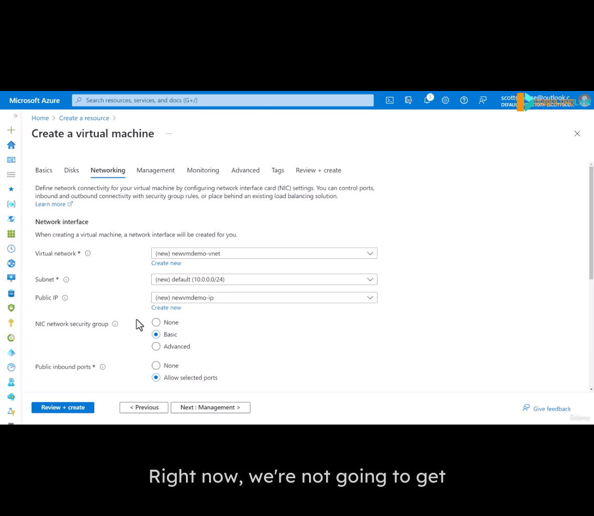
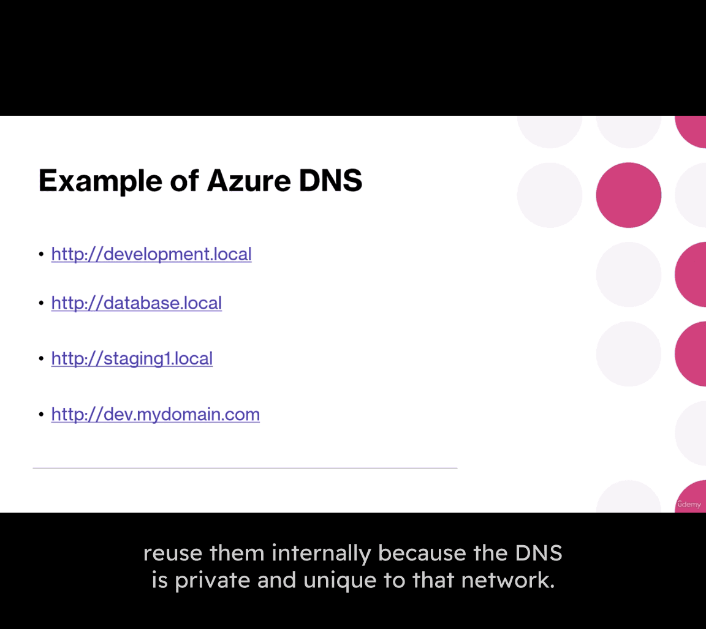
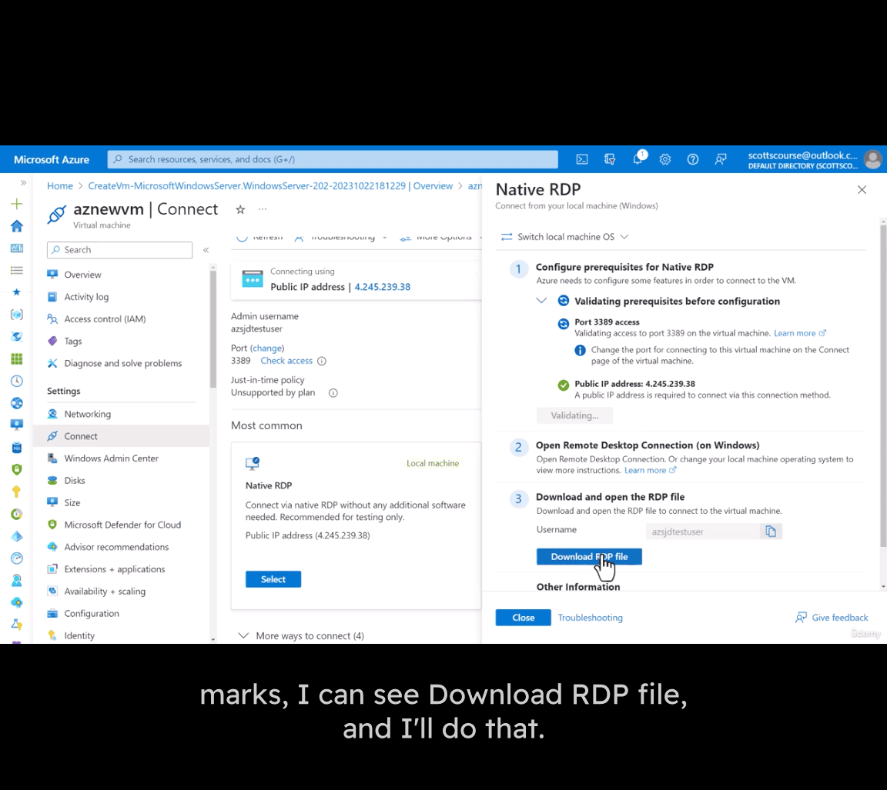
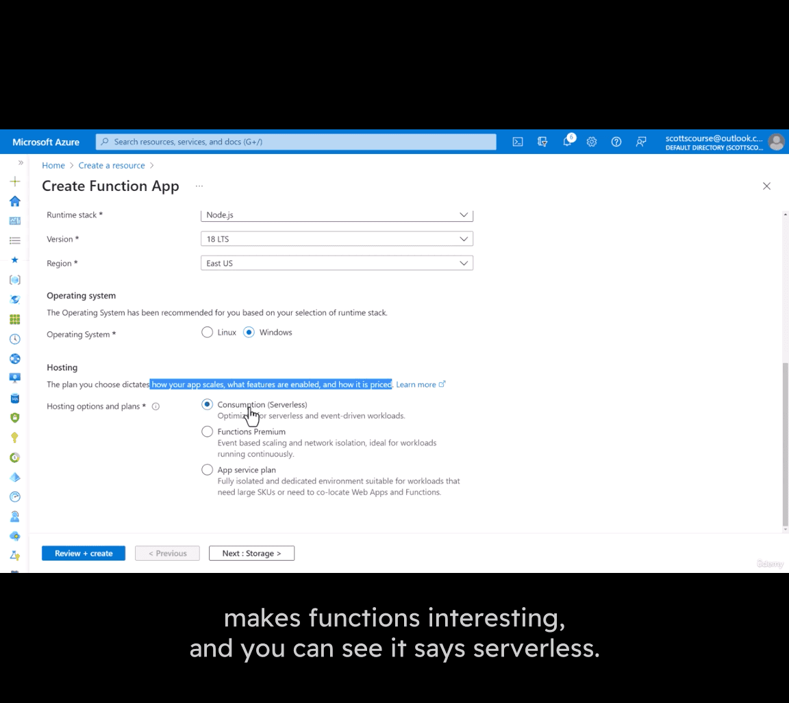
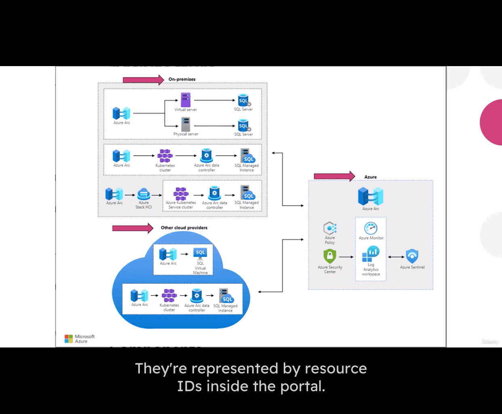

# 777-azure-notes

[[2025-05-17]]
az - 900

The ability to rent computing resources - on demand

- Windows and Linux Servers
- Unlimited File Storage
- Databases
- Message Queues
- Content Delivery Network
- Batch Processing Jobs

window server or linux server

- may be can dig up is MS learn CS curses
- linkedin as well [[2025-05-16]] , search from whatsapp

VM size ->

window -> username -> password

public inbound ports -> Allow selected pors

- RDP (3389)

if linux -> ssh(22) , rdp (window) 3389 ,
if web -> https(443) , http (80)

Al traffic from the internet will be blocked by default. You will be able to change inbound port rules in the VM > Networking page.

licensing -> window , there is azure hybrid benefit

Would you like to use an existing Windows Server license -> window licensing that azure include -> if owned, ==> save
cost

ssd choice

---

- network

- inbound ports
- deleted public IP and NIC when VM is deleted
- enable accelerated networking

- load balancing 🔥

management
Microsoft Defender for Cloud

auto-shutdown
time and time zone , notification before shutdown

backup policy , subtype:

- window update option as well

---

IIS extension 🤔

Special choice -> dedicated host

- metadata from that VM , name , phone number in case of emergency

- pricing day , even priced by the hour, but it is actually charged for a second

deploy now for about 1-2 minutes

- can be scripted to created a VM

connect from MS azure , or RDP as well

---

- cloud concept

"The cloud is just someone eles's computer"

pay for what you use , few hours ->

portal.azure.com

web app -> is the abstraction above VM

Function App -> run small code in the cloud without a server

Logic App -> a workflow; perform a series of steps
e.g. connect 2 computer together , event triggers auto chagne things in logic diagram

Different OS supported

pass text to Azure -> Translator

Natural Language processing -> hand written text (Language Understanding)

Compute -> create your own mechine learning -> **container**
[Managed Kubernetes Service (AKS) | Microsoft Azure](https://azure.microsoft.com/en-us/products/kubernetes-service)
azure quantum as well

Analytics -> Datawarehouse
Azure Synapse Analytics -> real time processing of large amounts of data

Database -> SQL , mongo db , oracle as well

- there is marketplace db as well (other than MS service)

---

# Shared Responsibility Model

hands on some responsibility to Azure

updates to OS, firewalls , physical aspect -> azure

- web app:

user info still be on your hands

- cloud or Saas Responsibility:

e.g. office 365 -> you don't have application control yourself , shift your work like OS , network , firewall , application to Azure

- public cloud -> Azure
  Azure owns the hardware, on their network and infrastructure

- Private cloud ->  
  “The private cloud is defined as computing services offered either over the Internet or a private internal network and only to select users instead of the general public.”

e.g. government cloud -> private cloud

- Looks and acts like a cloud, except customer owns or leases or has exclusive access to the hardware

- hybird cloud
  “A hybrid cloud is a computing environment that combines a private cloud with a public cloud.”

- local database
  - if needed more storage then can be access to cloud database
  - scale if needed

public -> cx can sign up themself
private -> needed invite

---

# Cloud Pricing

- Difficult to predict your monthly bill
- Difficult to understand in advance what a
  service will really cost

* Possibility for big savings but you lose predictability

Difference from month to month, not fixed charge
range(min, max)

e.g. cost of a VM

- region cost , CA or Usa
- OS price

cpu , ram , premium or standard ssd etc

backup plan , reservation plan

MS support cost money as well

database price

Free services:

- some are free with certain limit

pay for time -> e.g.VM

- Pay for GB
  Usually you pay for any data storage used

Fairly cheap - $0.02 per GB per month

- Also pay for network traffic to/from other regions, or to the Internet , cross broader money

traiffic inbond is free , MS dont' mind sending to them
e.g 5gb free tier for traffic

- Operation fee

In addition to paying for storage space, and bandwidth, you can also be charged per operation
Operations are read, write, list, delete

Pay per message, pay per query to a database, etc.

Usually very cheap per operation

[Pricing Calculator | Microsoft Azure](https://azure.microsoft.com/en-us/pricing/calculator/)

- VM pricing details page

  - it doesn't include additional storage beyond the temporary storage
  - network cost like that as well

- pricing calculator

add the service all in your cart , e.g. bandwidth , ip address, VM, load balancer

save it or share with your coworkers

---

Capital Expenses (CapEx) vs Operating Expenses (OpEx).mp4

capital expenses, -> big investment

- physical assets
- property, building and gear
- can be re-sell / re use
- government -> depreciation of a percentage(10-30%) a a deduction on your taxes

operating expenses

- Expenses incurred through normal operations
- The cost to do business
- Rent, payroll, insurance, R&D, marketing
- 100% of expenses can be deducted against revenue, reducing the tax owing in a year

---

- Operating expenses are sometimes preferable
  to capital expenses because OpEx reduces your
  taxes owing this year (require little investment up front and can be scale with revenue)

- CapEx takes several years (decade) to get that
  value back from taxes owing (big inv up front and hope will earn back more in later)

---

1. High Availability Benefit of Cloud Computing
   hardware changing , hardware failure

- network, power , natural disasters, cyber attacks, software bugs
- _poor scaling / architecture design()_

- **Gradual deployment strategy**
  - 1-10-100-etc
  - testing and monitoring of devos
  - easy rollback plan
  - automation
  - frequent deployment

---

# Study Notes: Cloud Computing Scalability

## 1. What is Scalability?

- **Definition**: The ability of a system to accommodate increasing or decreasing demand by adding or removing resources (e.g., servers, CPU, memory).
- **Key Idea**: The system is designed to handle changes in resource allocation without requiring major software or system design changes.
- **Distinction from Elasticity**: Scalability is the _ability_ to scale; elasticity is often used to describe the _automation_ of scaling resources up or down based on demand.

## 2. Benefits of Scalability

- **Adapt to Changing Usage Patterns**: Handle fluctuations in traffic (high, low, medium) without application failure or redesign.
- **Handle Peak Loads**: Accommodate significantly increased traffic during specific periods (e.g., holiday shopping for e-commerce, tax season for accounting systems, class registration for schools).
- **No Need for Constant Over-Provisioning**: Avoids having excessive server capacity during low-traffic periods.

## 3. Types of Scaling

### a) Vertical Scaling (Scaling Up / Scaling Down)

- **Definition**: Increasing or decreasing the resources of a _single server_ (e.g., adding more CPU, RAM, or faster CPU).
- **Cloud Advantage**: Easier to do in the cloud (requesting a larger instance type) than with physical hardware.
- **Pros**:
  - Simpler to implement for single-server applications.
- **Cons**:
  - **Upper Limit**: There's a maximum size for any single server instance (e.g., Azure's 96 CPU, 384GB RAM example).
  - **No Availability Improvement**: Scaling up a single server doesn't inherently make the system more highly available if that single server fails.
  - May involve downtime for resizing.

### b) Horizontal Scaling (Scaling Out / Scaling In)

- **Definition**: Adding more servers to a pool of resources (scaling out) or removing servers from the pool (scaling in).
- **Example**: Going from 4 servers to 8 servers to double capacity.
- **Pros**:
  - **Virtually No Limit**: Can scale to a very large number of servers, even across regions.
  - **Potential for Improved Availability**: If one server fails, others can handle the load (requires proper design, e.g., load balancers).
- **Cons**:
  - **Increased Design Complexity**: Applications need to be designed to run across multiple servers (e.g., stateless or manage state externally). Often requires load balancers.

## 4. Scalability and Cost

- **Direct Impact**: Scaling up (bigger server) or scaling out (more servers) generally increases costs linearly.
  - Doubling CPUs often doubles server cost.
  - Adding more servers increases cost proportionally.
- **Cost Reduction**: The ability to scale _down_ or scale _in_ allows for cost reduction during periods of low demand.
- **Zero Waste / Optimization**:
  - Cloud scaling allows provisioning resources for _current needs_ rather than over-provisioning for predicted future peaks (common in self-hosted environments).
  - Reduces computing waste by not paying for unused capacity.

## 5. Scalability vs. Application Failure

- Systems have a maximum capacity. Exceeding this leads to application failure.
- Scalability allows increasing this max capacity by adding resources, thus delaying or preventing application failure under increased load.
- Ideally, a system can scale up to meet peak demand and then scale down as demand decreases.

## 6. Related Concept: Elasticity

- Elasticity often refers to the _automation_ of scaling – automatically adding/removing resources in response to demand. This will be explored in more detail separately.

---

some business day / black friday -> have traffic that fluctuates ,
e.g. schol registration are busy in sep, tax systems are busy in april

---

# Study Notes: Cloud Computing Elasticity

## 1. What is Elasticity?

- **Definition**: The ability of a system to _quickly and easily_ scale up or scale down the amount of resources it uses, depending on changing demand.
- **Key Differentiator from Scalability**: While scalability means a system _can_ be scaled (often manually), elasticity implies an _automated_ or near-automated ability to grow and shrink resources.
- **Analogy**: Like a rubber band, it expands when needed and contracts when not.
- **Core Component**: Involves some form of automation for adding/removing resources.

## 2. How Elasticity Works: Auto-Scaling

- **Auto-Scaling**: A common term for the mechanism that enables elasticity.
- **Process**:
  1.  **Monitoring**: The system monitors specific metrics (e.g., CPU utilization, memory usage, queue length).
  2.  **Thresholds**: Pre-defined thresholds trigger scaling actions.
      - Example: If CPU utilization > 70% for 5 consecutive minutes, add a server.
  3.  **Adding Resources (Scaling Out/Up)**: When a threshold indicating high demand is met, additional computing resources are automatically added.
  4.  **Removing Resources (Scaling In/Down)**: Conversely, when demand drops and metrics fall below a certain limit, resources are automatically shut down or removed.

## 3. Benefits of Elasticity

- **Efficiency**: Resources are used more efficiently as they match demand closely.
- **Cost-Effectiveness**:
  - Reduces "waste" – paying for computing resources that are not fully used (e.g., half-full storage, idle servers).
  - Avoids over-provisioning common in self-hosted environments.
- **Optimized Resource Utilization**: Minimizes the gap between provisioned capacity and actual usage.
- **Improved Performance/Availability**:
  - Can dynamically increase capacity to meet peak user demand, preventing slowdowns or application failures.
  - Allows for a potentially higher maximum capacity during peak times because resources are only paid for during that short period.

## 4. Elasticity vs. Traditional Over-Provisioning

- **Self-Hosted/Fixed Capacity**:
  - Requires planning months in advance (e.g., 6-12 months).
  - Leads to **over-provisioning** resources to anticipate future growth.
  - Results in a maximum capacity that is often much higher than current needs, leading to waste.
  - Even with over-provisioning, the maximum capacity can eventually be reached, leading to service degradation or failure until more resources can be manually added (which takes time).
- **Elastic Cloud Systems**:
  - Dynamically adjust capacity to meet current demand.
  - Reduces the need to predict far-future needs and pay for idle resources.

## 5. Dynamic Capacity and User Demand

- **Visualized**:
  - As user demand fluctuates (up and down), an elastic system's capacity dynamically scales higher or lower to match that demand closely.
  - The system monitors demand and ensures there's always enough capacity to avoid turning users away or causing slowness.
- **Minimizing Waste**: The area between the actual user demand curve and the provisioned capacity curve represents potential waste. Elasticity aims to keep this "wasted resource" area as small as possible.

## 6. Elasticity vs. Fixed Capacity Failure Point

- **Fixed Capacity**: If user demand exceeds a fixed, non-elastic capacity, the system reaches a "point of failure" where it can no longer serve all users effectively.
- **Elastic Capacity**: By auto-scaling, the system can often avoid this failure point by increasing resources, potentially making it cheaper in the long run than having a fixed capacity that doesn't fully capture peak demand (and thus loses business or user satisfaction).

---

relationship btw capacity and user demand diagram

- right hand side is wasted resources

i think the most useful feature is auto scaling once the accident happen -> site relatability

---

# Study Notes: Cloud Computing Reliability

## 1. What is Reliability?

- **Definition**: The ability of a system to recover from failures and continue to function as expected.
- **Goal**: Provide high-quality, consistent service to users, even when underlying issues occur.
- **Relationship to Other Concepts**:
  - **Availability**: System is running and accessible when needed.
  - **Predictability**: System behaves consistently.
  - Reliability contributes to both availability and predictability.

## 2. Why is Reliability Important?

- **User Experience**: Users expect applications to work correctly and be available. Failures lead to frustration and loss of trust.
- **Business Continuity**: For mission-critical applications, downtime or data loss can have severe business consequences.
- **Mitigating Platform Issues**: While cloud providers (like Microsoft Azure) strive for platform reliability, applications built on top still need to be designed for resilience. "Having Microsoft Azure have a bad Day shouldn't ruin your day."

## 3. Types of Failures to Recover From

- **Hardware Failures**:
  - Physical machine components (hard disk, CPU, motherboard) hosting virtual machines can fail.
- **Networking Interruptions**:
  - Bad routers, cut cables, electrical interference.
- **Power Failures**:
  - Blackouts affecting racks of computers or entire datacenters.
- **Large-Scale Outages**:
  - Entire Availability Zone or Azure Region going offline (rare, but critical to plan for).
- **Assumption**: This is considered even if there are no bugs in the application code itself.

## 4. How Reliability is Achieved in Azure (and Application Design)

- **Auto-Scaling**:
  - Ensures resources expand to meet demand, preventing overload-induced failures and maintaining a good user experience.
- **Avoiding Single Points of Failure (SPOF)**:
  - Distribute applications and code across multiple instances (VMs, App Services).
  - If one instance fails, others can take over.
- **Multi-Region Deployments**:
  - Deploying applications and data across different Azure regions (e.g., East US, West US, Europe).
  - Allows rerouting traffic if one region experiences a large-scale outage.
- **Data Backup and Retention Strategy**:
  - Regularly back up data.
  - Have a plan for quick data restoration.
  - Practice restoration procedures.
  - Aim for data availability "at a moment's notice," not just daily backups for critical systems.
- **Monitoring and Health Probes**:
  - Continuously monitor the health of applications, VMs, load balancers, and other services.
  - Health probes allow systems (like load balancers or Azure Front Door) to detect unresponsive instances or regions and stop sending traffic to them.
- **Self-Healing Capabilities**:
  - Designing systems to automatically detect and recover from certain types of failures without manual intervention.
- **Leveraging Azure's Built-in Features**: Azure provides many optional features that aid in building reliable systems (e.g., Availability Zones, region pairs, geo-redundant storage).

## 5. Cloud Provider's Role vs. Customer's Role

- **Cloud Provider (Azure)**:
  - Responsible for the reliability of their underlying platform (datacenters, network, core services).
  - Implements many behind-the-scenes measures to prevent failures and ensure quick recovery.
  - Provides transparency through health services and alerts.
- **Customer (Application Designer)**:
  - Responsible for designing their _application_ for reliability using the tools and features provided by the cloud platform.
  - Needs to do "extra work" to ensure their application can withstand platform issues.

**Key Takeaway**: Reliability isn't just about the platform; it's about how applications are architected and deployed on that platform to anticipate and recover from various types of failures.

---

- The ability of a system to recover from failures

Azure has several built-in services that you can use to keep an application running after a failure has occurred

e.g user may don't even notice it

- Auto-scaling
- Avoid single points of failure
- Multi-region deployments
- Data backup and replication

---

# Study Notes: Cloud Computing Predictability

## 2. What is Predictability?

- **Definition**: The ability to forecast and control the performance, behavior, and (importantly) costs of a system over time.
- **Core Idea**: Confidence that the system will perform consistently (today, tomorrow, next month) and that costs will align with expectations without unexpected massive bills.
- **Pillar of Quality**: Along with availability and reliability, predictability is a key component of high-quality cloud platform service.

## 3. Why is Predictability a Benefit?

- **Performance Confidence**: Assurance that the system will maintain its expected performance levels in the future.
- **Cost Control**: Ability to forecast, manage, and control cloud spending, avoiding unexpected financial surprises.
- **Informed Decision Making**: Allows for better planning and resource allocation based on predictable performance and costs.

## 4. How Cloud Platforms Enable Predictability

### a) Performance Predictability

- **Auto-Scaling**:
  - While also for elasticity and reliability, auto-scaling contributes to predictable performance by ensuring resources match demand, thus maintaining a consistent user experience.
  - The ability to scale up (more CPUs, memory, instances) or down as needed helps maintain performance targets.
- **Load Balancing**:
  - Distributes traffic across multiple instances, preventing any single instance from being overwhelmed.
  - Helps maintain predictable system responsiveness even as new instances are added or removed.
- **Instance/Tier Choices**:
  - **VMs**: Ability to choose from various VM series (e.g., general purpose, memory-optimized, CPU-optimized) and sizes allows tailoring resources to workload needs for consistent performance.
  - **PaaS Services (e.g., App Services, Databases)**: Different pricing/performance tiers (e.g., Basic, Standard, Premium) allow selection based on required features and performance levels. Sometimes tiers offer more features at similar performance, or scale performance with tier.

### b) Cost Predictability

- **Auto-Scaling (Cost Aspect)**:
  - Scaling down resources when not needed directly translates to cost savings, making overall costs more aligned with actual usage.
- **Instance/Tier Choices (Cost Aspect)**:
  - Different VM sizes and PaaS tiers have clearly defined pricing, allowing for cost estimation based on selection.
  - Newer, lower-cost VM options (e.g., new D-series) can provide predictable performance at better price points.
- **Cost Management Tools (e.g., Azure Cost Management)**:
  - **Visibility**: View current and historical spending.
  - **Forecasting**: Predict end-of-month bills based on current spending rates.
  - **Budgets**: Set spending limits and receive alerts when approaching them.
  - **APIs for Budgeting**: Programmatically access spending data for external reporting or automated cost control measures.
- **Publicly Available Pricing Calculators**:
  - Allow users to estimate future costs based on anticipated usage of various services (CPU, data, storage, etc.).
- **Reserved Instances/Savings Plans (Implied)**: While not explicitly detailed in this text, features like reservations (committing to usage for discounts) also contribute to cost predictability for stable workloads.

## 5. Key Takeaway

Predictability in the cloud is achieved through a combination of features that allow for consistent performance (like auto-scaling and load balancing) and tools/options that provide transparent and controllable pricing (like varied instance/tier choices and cost management dashboards).

---

Achieved by :

- Autoscaling
- Load balancing
- Different instance types, sizes, pricing tiers
- Cost management tools
- API
- Pricing calculators

---

- Governance
  Includes basic auditing and reporting as well as enforcement

-> easier to follow policies

azure:

- Azure Policy & Blueprint
- Management groups( different groups follow different policies)
- custom roles
- soft delete

---

- Management of the cloud

- Templates
- Automation
- Scaling
- Monitoring and alerts
- Self-healing

method:

- Web portal
- Command line interface and scripts
- APIs
- PowerShell
- bash , cloud shell, rest api
- **alerting system , monitoring resources are reaching certain limit or network traffic etc**

Detailed ways:

- Azure Portal, CLI, PowerShell, Cloud Shell, REST
- APIs, and other programmatic methods
- Consolidated monitoring and alerting system
- Ability to use ARM templates, Bicep, Terraform, etc
- Autoscaling of most types of compute resources

---

- Three main cloud services:
  Infrastructure as a Service (laaS)
  Platform as a Service (PaaS)
  Software as a Service (SaaS)

# Study Notes: Cloud Service Types (IaaS, PaaS, SaaS)

## 1. Introduction: "As a Service" Concept

- **Core Idea**: Renting resources or capabilities instead of buying and owning them.
  - Analogy: Renting a car (Car as a Service) vs. buying a car.
- **No Long-Term Commitment (Typically)**:
  - Ability to use resources for short periods (e.g., a server for a few hours) and pay only for that usage.
  - However, commitment options (e.g., 1-year, 3-year reservations for VMs) exist for significant cost savings if usage is predictable.
- **Usage-Based Charging**: Typically charged based on metrics like time, gigabytes, or other usage measures ("pay for what you use").
- **Provider Responsibility**: The cloud provider (e.g., Microsoft Azure) is responsible for:
  - Buying and maintaining the physical hardware (servers, storage).
  - Developing and maintaining some software layers.
  - Handling updates, security for the underlying infrastructure.
  - This aligns with the Shared Responsibility Model.

## 2. Infrastructure as a Service (IaaS)

- **Definition**: Provides essential IT services like computing, storage, and networking. These are low-level building blocks.
- **Real-World Equivalents**: Cloud replacements for physical hardware, wires, cables, hard drives, and computers you'd find in a traditional data center.
- **Customer Responsibility**: You manage the OS, applications, data, and middleware. Azure manages the physical infrastructure.

### IaaS Examples:

- **Computing**: **Azure Virtual Machines (VMs)**
  - Windows or Linux servers.
  - Essentially a "blank slate" server; users install their own software.
  - Billed by the second.
  - Many choices for CPU (AMD/Intel), RAM, optimizations (memory, I/O, CPU, general purpose, HPC).
- **Storage**: **Azure Storage Accounts**
  - Equivalent to cloud-based hard disks or SSDs.
  - Large capacity (e.g., up to 5 petabytes per account).
  - Supports various data types: Blobs, Files, Queues, Tables.
  - Very cost-effective (e.g., a few cents per GB/month).
  - **Azure Data Lake Storage**: For petabyte/exabyte scale big data applications.
- **Networking**: **Azure Virtual Networking (VNets)**
  - Creating VNets and subnets is often free.
  - **Bandwidth Costs**:
    - Ingress (inbound data to Azure): Generally free.
    - Egress (outbound data from Azure): Typically a free tier (e.g., 5GB/month), then charged.
    - Traffic between regions often incurs costs.

## 3. Platform as a Service (PaaS)

- **Definition**: Builds on top of IaaS by providing infrastructure _plus_ a managed software layer. This layer offers features, functions, development tools, deployment tools, and database services, simplifying application development and management.
- **Key Idea**: Abstracts away more of the underlying infrastructure management compared to IaaS.
- **Customer Responsibility**: You manage your application code and data. Azure manages the runtime, middleware, OS, and physical infrastructure.

### PaaS Examples:

- **Computing**: **Azure App Services**
  - Deploy code (e.g., in a zip file) and configuration variables; Azure runs it.
  - No direct VM management needed by the user.
  - **Additional Features ("Plus Element")**: Scaling, auto-scaling, CI/CD, container support, deployment slots (dev/staging), etc.
- **Storage/Databases**:
  - **Managed Storage**: Simplifies underlying disk management.
  - **Azure SQL Database**: A managed relational database service. Users don't worry about patching the SQL Server or managing the OS.
  - Frees users from managing underlying hard disk details, performance tuning at the disk level, etc.
- **Networking**:
  - Services like **Azure Front Door, Azure Load Balancer, Azure Firewall, Azure Traffic Manager**.
  - These are essentially software applications performing networking tasks (traffic routing, load distribution, security) on top of the basic network infrastructure.

## 4. Software as a Service (SaaS)

- **Definition**: Full-fledged applications that are ready to be used, typically accessed via a web browser or app after creating an account and logging in.
- **Key Idea**: The cloud provider manages almost everything, including the application software itself.
- **Customer Responsibility**: Primarily user access and data configuration within the application. Provider manages the entire stack.
- **Characteristics**:
  - App is "ready to be used" with minimal setup.
  - Contrast with PaaS: A PaaS platform has functions/features but doesn't "do anything" until the user deploys their own application/data onto it.

### SaaS Examples:

- Microsoft Office 365
- OneDrive
- Skype
- Dropbox
- Google Drive / Google Docs

**Overall Summary**: The three service types represent different levels of abstraction and shared responsibility. IaaS gives the most control but requires the most management from the user. SaaS offers the least control but requires the least management. PaaS sits in the middle.

---

IaaS -> Azure Virtual Machines
Azure Storage
Virtual Networking
ingress and egress bandwidth costs

Paas -> Azure App Services
Simply upload your code and configuration to
Azure, and it runs your code without needing to
worry about the VM underneath
Includes scaling features, CI/CD, containers, staging and development environments, etc
e.g Managed Storage
Azure SQL Database

- no need to worry about storage
  load balancer
  firewall

Saas -> Cloud apps , e.g. one drive , office 365

- simply need to set it up and use it

- Which service type is a complete development and deployment environment in the cloud? -> Paas

---

- Serverless concept

# Study Notes: Serverless Computing

## 1. What is Serverless?

- **Core Idea**: Primarily a **pricing model** and an abstraction layer over underlying hardware.
- **"Serverless" is a Misnomer**: Servers _are_ still involved, but the user is not directly managing them or making conscious decisions about specific hardware (CPU speed, RAM amount for a _particular_ server).
- **Abstraction**: Users focus on their code or service, and the cloud provider handles the underlying server infrastructure provisioning and management dynamically.
- **Key Difference from Traditional PaaS (in terms of user experience)**: You are primarily paying for the _service execution_ or _consumption_ rather than renting pre-defined hardware capacity.

## 2. Serverless vs. Traditional PaaS Pricing - Example: Azure SQL Database

### a) Traditional PaaS Pricing (SQL Database - DTU & vCore Models)

- **DTU (Database Transaction Unit) Model**:
  - Users pick a service tier (S0, S1, S9, etc.) which represents a bundled level of performance (CPU, I/O, memory).
  - DTUs are a relative measure of performance (e.g., 20 DTUs ~ 2x performance of 10 DTUs).
  - Includes storage.
  - Charged per month based on the chosen tier.
- **vCore (Virtual Core) Model**:
  - Users specifically choose the number of CPU cores, amount of memory, and storage.
  - More granular control over resources.
  - Can pick specific CPU hardware generations (e.g., F-Series, Intel Platinum).
  - More complex pricing but allows precise resource allocation.

### b) Serverless Pricing (SQL Database - Serverless Tier)

- **Simplified Options (Hardware Choice)**: Fewer explicit hardware choices for the user (e.g., Azure offers a range of Intel CPU generations like Broadwell, Skylake, Ice Lake, but the user doesn't pick one).
- **Dynamic Scaling**:
  - Azure automatically scales the database resources (e.g., from 0.5 CPU cores up to 80 cores) based on demand (number of requests).
  - User sets a minimum and maximum CPU range.
- **Consumption-Based Billing**:
  - Charged **per CPU second** used.
  - Example pricing: A fraction of a cent per CPU second.
- **Cost Predictability Challenge**: Difficult to predict the exact monthly bill in advance due to the dynamic scaling based on fluctuating usage.
- **"Scale to Zero" / Auto-Pause**:
  - A key feature: The database can automatically "spin down" or pause (effectively using zero cores) after a period of idleness (e.g., 1 hour).
  - During this paused state, compute costs can be zero (storage costs still apply).
- **Cost-Effectiveness for Specific Workloads**: Can be the cheapest option for:
  - Infrequently used databases.
  - Development databases.
  - Databases with very sporadic query patterns.

## 3. Azure Functions - Another Serverless Example

- **Deployment Options**: Can be deployed on an App Service Plan (PaaS model with pre-defined capacity) OR as a serverless offering.
- **Serverless (Consumption Plan) Pricing**:
  - Often includes a generous **free tier** (e.g., 1 million function executions per month).
  - Beyond the free tier, charged per execution (e.g., fraction of a penny per 10,000 executions) and per GB-second of memory consumption.
- **Benefits**:
  - Significant cost savings for event-driven, short-lived tasks.
  - Microsoft manages hardware provisioning (scaling up/down) based on the number of function triggers.

## 4. General Characteristics & Considerations of Serverless

- **Popularity**: Gaining traction due to potential cost savings and operational simplicity.
- **Cost Savings Potential**: Can be very cost-effective, especially for workloads with intermittent or unpredictable traffic, or those that can benefit from "scale to zero."
- **Unpredictable Pricing (Potentially)**: While individual operations are cheap, the dynamic nature means the total monthly bill can be harder to forecast compared to fixed-capacity PaaS tiers.
- **Provider Manages Resources**: Microsoft (or the cloud provider) handles provisioning, scaling, and even competes for underlying resources among different customers.
- **Free Tiers**: Many serverless offerings (like Azure Functions, Cosmos DB serverless) have attractive free tiers, making them good for experimentation and small workloads.
- **Focus**: Shifts from managing infrastructure to writing code and configuring event triggers.

**Key Takeaway**: Serverless is an operational and pricing model where the cloud provider dynamically manages server resources, and users are typically billed based on actual consumption or execution, often with the ability to scale down to zero compute cost during idle periods.

---

- SQL database case -> DTU pricing
- DTU pricing

- MS vCore pricing

cpu , memory , more complicated pricing model

- you can even pick specific cpu, Xeon , Fsv2 etc

- now it is severless :

Computer Tier -> Serverless , Hardware Type :

- Standard-series (gen 5)
  cpu : the Intel Sky Lake, Intel Cascade Lake, and the Xion Ice Lake.

depends on how many request from database , Azure will scale it from according cpu, how man vCores (cpu cores, maximum is 80)

- paying for cpu per second

you can have zero costs -> 0 use -> 0 dollar

> severless can be the cheapest pricing for very underused database

Serverless Services:

- Functions (azure function)
  - free amount one million function executions per month, pay for exceed that amount (need alarming )
- Container Apps
- Kubernetes
- SQL Database
- Cosmos DB

---

# 05. AZ-900 - Core Architectural Components of Azure

## Study Notes: Azure Regions, Region Pairs, and Sovereign Regions

## 1. Azure Regions

- **Definition**: A geographic area on the globe where Azure has a presence, consisting of a set of datacenters networked together.
- **Global Presence**: Over 60 regions worldwide, though not all countries have one. Some countries have multiple (e.g., USA), some have one, most have none.
- **Naming**: Sometimes named after the country, sometimes not.
- **Resource Deployment**: When creating resources (VMs, storage, databases), users choose the region for deployment. Azure generally doesn't pick for you.
- **Pricing**: Can vary slightly between regions for the same service.
- **Availability to Users**:
  - Not all ~60+ regions are available to every Azure user.
  - A typical user might see 30-40 regions in the deployment dropdown.
  - Some regions may require residency in that country or special approval.
- **Infrastructure Map**: `infrastrukturmap.microsoft.com` provides a 3D map of Azure regions and high-speed fiber optic connections (including undersea cables) connecting them.
  - Concentrations in North America (USA has ~9, Canada 2, Mexico 1 coming soon) and Western Europe.
  - Growing presence in the Middle East, India, Asia, Australia.
  - Limited datacenter presence in Africa (currently South Africa), though points of presence for connectivity exist.

## 2. Region Pairs

[Azure global infrastructure experience](https://datacenters.microsoft.com/globe/explore/)

- **Definition**: Most Azure regions are matched with another region (its pair), typically within the same geopolitical boundary (exceptions exist, e.g., Brazil South).
- **Key Characteristics & Benefits**:
  - **Fastest Connection**: Paired regions have the fastest fiber optic connections between them, ideal for backups and large data transfers.
  - **Azure Update Rollouts**: Azure performs platform updates to only one region in a pair at a time. This minimizes the risk of both regions being impacted simultaneously if an update goes wrong.
  - **Disaster Recovery Strategy**: Recommended to use the paired region for deploying duplicates of services for disaster recovery due to the special relationship.
  - **Data Residency (Usually)**: For most services, data replicated to a paired region stays within the same geopolitical boundary.
    - **Exception - Brazil South**: Paired one-way with South Central US. Data stored in Brazil South _can_ be backed up to the US, meaning no strict data residency for Brazil South if using this pairing. South Central US data is _not_ backed up to Brazil South.
- **Examples of Pairs**:
  - Canada Central & Canada East
  - North Europe & West Europe
  - East US & West US
  - East US 2 & Central US
- **Qatar - Unique Case**: The first region launched without a pair.
  - Cannot use Geo-Redundant Storage (GRS) natively for storage accounts in Qatar.
  - Users must manage their own cross-region backups and redundancy if needed.
  - Relies on Availability Zones within Qatar for high availability.

## 3. Data Residency

- **Concept**: Data stored in a specific region (e.g., Canadian regions) is kept within that country's borders to comply with local data privacy laws.
- **Global Access vs. Data Storage**: While data might be resident in a specific country's region, users from anywhere in the world can typically deploy and use resources in that region (unless it's a sovereign region or has other access restrictions).
- **Brazil South Exception**: Due to its one-way pairing with a US region, data stored in Brazil South does not have a strict data residency guarantee if using the pair for backup.

## 4. Sovereign Regions

- **Definition**: Special Azure regions designed to meet specific governmental, compliance, or geopolitical requirements. They are typically disconnected from the public Azure cloud.
- **Key Characteristics**:
  - **Disconnected from Public Cloud**: Not directly connected to the commercial Azure public cloud. Private resources in public cloud generally cannot connect to private resources in a sovereign cloud.
  - **Restricted Access**: Requires special approval/eligibility to create subscriptions and use services (not a simple credit card signup).
  - **Different Compliance Standards**: Adhere to specific and often stricter privacy, security, and compliance standards tailored to the target government or entity.
  - **Physically Isolated (Often)**: Datacenters may be physically isolated from public Azure infrastructure.

### Examples of Sovereign Regions:

- **Azure Government (US)**:

  - For US state, federal, and local government entities and their partners.
  - Meets specific US government compliance standards (e.g., FedRAMP High, DoD Impact Levels).
  - Multiple regions available (e.g., "US Gov Virginia," "US Gov Arizona").
  - **Azure Government Secret**: For classified US government workloads ("secret operations," intelligence services). Locations and service availability are not publicly disclosed.
  - **Azure Government Top Secret**: Newest, highest classification, very limited information available.
  - **Department of Defense (DoD) Regions**: Exclusively for the US Department of Defense. Physically isolated. Data never leaves the US.

- **Azure China**:
  - Operated by a separate company (21Vianet) in partnership with Microsoft, to comply with Chinese regulations.
  - Requires a separate account with the Chinese operator.
  - Limited to entities with a presence in China. Foreign businesses cannot just deploy resources there without meeting these requirements.

**Summary Distinction**:

- **Public Azure Regions**: Generally available, wide range of services.
- **Sovereign Azure Regions**: Restricted access, tailored for specific government/compliance needs, often isolated.

---

[Azure global infrastructure experience](https://datacenters.microsoft.com/globe/explore/)
blue point -> azure region
high speed cable under the sea

e.g. na -> eur

grey point or dot -> comming soon azure

---

## Study Notes: Azure Availability Zones (AZs)

## 1. What are Availability Zones?

- **Definition**: Physically separate datacenters (or sets of datacenters) within a single Azure region.
- **Physical Separation**:
  - Can be separate buildings on the same large piece of land or located a few miles/kilometers apart.
  - Each AZ has its own independent power, cooling, and networking infrastructure. They are not reliant on each other.
- **High-Speed Connectivity**: Connected by very high-speed, low-latency networks (e.g., <5ms) within the region.
- **Purpose**: To provide high availability and protect applications and data from datacenter-level failures within a region.

## 2. Regional Support for Availability Zones

- **Not Universally Available**: Not every Azure region supports Availability Zones.
  - Example: Canada Central has AZs, but Canada East does not (as of the information provided).
- **Progressive Rollout**: Microsoft has been converting older "legacy" regions and building new regions with AZ support.
- **Customer Choice**: If AZs are crucial for an application's HA requirements, users must select a region that supports them.
- **Growing List**: Many regions across the Americas, Europe, Middle East, Africa, and Asia-Pacific now support AZs. The list continues to grow (e.g., Poland mentioned as "coming soon").

## 3. Service Support for Availability Zones

- **Not All Services Support AZs**: Even within a region that supports AZs, not every Azure service might offer AZ capabilities.
- **Evolving Support**: As Microsoft enhances services, newer versions often gain AZ support.
- **Types of AZ Support by Services**:

  - **a) Zonal Services**:

    - **Definition**: The customer explicitly chooses to deploy a resource to a _specific_ Availability Zone (e.g., Zone 1, Zone 2, or Zone 3) within a region.
    - **Example**: Deploying an Azure Virtual Machine. You can choose to place VM-A in AZ1, VM-B in AZ2, and VM-C in AZ3 within the Canada Central region.
    - **Purpose**: Allows customers to architect for redundancy by distributing application components across different zones. If one zone fails (e.g., power outage), resources in other zones continue to operate.
    - **Customer Responsibility**: Requires application design to handle failover between zones (e.g., using a load balancer).

  - **b) Zone-Redundant Services**:

    - **Definition**: The service automatically replicates or distributes itself across multiple Availability Zones within the region without the customer needing to specify individual zones.
    - **Examples**: Azure Cosmos DB, Azure SQL Database (when configured for zone redundancy).
    - **Customer Experience**: You deploy the service to a region, and Azure handles the cross-zone redundancy behind the scenes.
    - **Benefit**: Simplifies achieving high availability for these services.

  - **c) Always Available Services (Global/Non-Regional Services)**:

    - **Definition**: Global services that are not tied to a specific region and are designed by Microsoft to be resilient to single AZ (and often single region) failures.
    - **Examples**:
      - Azure Portal (the management interface itself).
      - Azure Active Directory (Azure AD).
      - Azure Front Door.
    - **Customer Experience**: Users don't deploy these services to a specific region or zone; they are consumed as global offerings.

  - **d) Flexible Services (Choice of Zonal or Zone-Redundant)**:
    - **Definition**: Some services offer the customer the choice to either manually deploy them into specific zones (zonal) or configure them as zone-redundant and let Azure manage the distribution.
    - **Examples**: Azure Application Gateway, Azure Load Balancer.

## 4. Key Considerations

- **High Availability**: AZs significantly enhance the ability to build highly available applications that can withstand datacenter failures.
- **Customer Responsibility**: For zonal services, the customer is responsible for designing the application to leverage multiple zones for redundancy (e.g., deploying multiple VMs and using a load balancer).
- **Service-Specific Behavior**: It's crucial to understand how each specific Azure service implements or supports Availability Zones (zonal, zone-redundant, or global).

---

- availability zone:

own power, own cooling , own connections to the internte

- Not every region supports Availability Zones

- Not every _service_ supports Availability Zones

Zonal Services

- You can choose a specific Availability Zone to
  deploy the service to
- You then should deploy a _duplicate_ service to
  another zone to achieve resiliency

* E.g. Virtual Machines

Zone-Redundant Services

- Automatically deployed across zones for you

* You don’t have to configure it
* E.g. Azure SQL Database

Always Available Services

- These are global services and Microsoft takes
  care of the ensuring that they are always on

* Also called “Non-regional services”

- E.g. Azure Portal, Azure Active Directory,
  Azure Front Door

---

A generic word to represent an Azure service
that you have access to, such as a specific
Virtual Machine, Storage Account, or Database

You can create a resource in many different
ways — Azure Portal, CLI, PowerShell, ARM
Template, etc.

---

- ARM Azure Resoure Management

ARM template - A JavaScript Object Notation (JSON) file that defines one or more resources to deploy to a resource group, subscription, management group, or tenant. Use the template to deploy the resources consistently and repeatedly.

[What is Azure Resource Manager? - Azure Resource Manager | Microsoft Learn](https://learn.microsoft.com/en-us/azure/azure-resource-manager/management/overview)

## Study Notes: Azure Management Groups

## 1. What are Management Groups?

- **Definition**: An organizational unit in Azure that sits _above_ subscriptions.
- **Purpose**: To manage multiple subscriptions collectively, allowing for centralized governance and policy enforcement.
- **Optional**: You don't have to use management groups, but they are beneficial for larger organizations or complex Azure environments.

## 2. Hierarchy and Structure

- **Container for Subscriptions**: A management group can contain one or more Azure subscriptions.
- **Nested Structure**: Management groups themselves can be nested, belonging to other management groups, forming a hierarchy.
- **Root Management Group**: At the very top of the hierarchy is a single "root" management group for the Azure Active Directory (Azure AD) tenant. All other management groups and subscriptions ultimately fall under this root.
- **Example Scenario**:
  - A company might have different subscriptions for different teams or purposes:
    - Marketing Team: Dev/Test Subscription
    - IT Team: Two Enterprise Agreement Subscriptions
    - Application Team: Pay-as-you-go Subscription
  - These subscriptions can be organized under relevant management groups (e.g., a "Marketing MG," an "IT MG," an "Apps MG").
  - These departmental management groups could then potentially roll up into a higher-level management group for the entire organization, under the root.

## 3. Key Benefits and Use Cases

- **Centralized Management**: Control and manage multiple subscriptions from a single point.
- **Policy Enforcement**:
  - Apply **Azure Policy** or **Azure Blueprints** at the management group level.
  - These policies (which can include ARM templates for resource deployment, RBAC assignments, and policy rules) are then _inherited_ by all subscriptions within that management group.
  - Ensures consistency and compliance across multiple subscriptions, even if different teams manage individual subscriptions.
- **Enhanced Security**:
  - Enforce security baselines and configurations across a group of subscriptions.
  - Apply consistent Role-Based Access Control (RBAC) assignments at a higher level.
- **Organizational Alignment**: Structure management groups to reflect the organization's structure (e.g., by department, environment, or geographical unit).
- **Scalable Governance**: Provides an effective way to apply governance controls as the number of subscriptions grows.

## 4. How it Works

- You create management groups.
- You move existing subscriptions under the desired management group.
- You define and assign policies or blueprints at the management group level.
- These assignments then automatically apply to all subscriptions within that management group and its child management groups (due to inheritance).

**Key Takeaway**: Management groups are a powerful tool for organizing subscriptions and applying consistent governance (security policies, compliance standards, configurations) at scale across an Azure environment. They are particularly useful for enterprises with multiple subscriptions managed by different teams or for different purposes.

---

🔥🔥🔥🔥🔥🔥

# 06. AZ-900 - Azure Compute and Networking Services

- Compute services
- Networking services
- Storage services
- Database services

> Compute Services - “Executing code” in the cloud

Compute Types in Azure

- Virtual Machines (VM)

* VM Scale Sets (VMSS)

- App services (Web apps)
- Azure Container Instances (ACI)
- Azure Container Apps
- Azure Kubernetes Service (AKS)
- Azure Virtual Desktop (run your desktop as cloud services)

VM -> is like your house (Standalone Server Analogy)
You don’t share any services with your
neighbors besides garbage, sewer, water,
electricity — provided by the city

---

Scaling Azure VMs

- You can increase the size of a VM easily, turning
  a4 vCPU VM into an 8 vCPU VM in minutes
  (_scale up_)

  - Can go to 64 vCPUs or higher

- OR you can add more VMs and have them work
  together to handle the work (_scale out_)

  either increase quality -> scale up or quantity -> scale out

---

- Virtual Machine Scale Sets

A group of virtual machines that can grow and shrink in quantity based on a predefined rule
Usually based on monitoring demand
Can be based on time (schedule)
Can be based on many other factors

e.g. traiffic limit -> auto adding one more computer to handle the traffic (unit it reach the limit or just some time)

---

- VM Scale Sets:

- Elasticity
- _Two or more virtual machines running the exact same code_
- With a “_gload balancerg_” in front to direct traffic randomly to one of the machines
- Able to add more machines as demand grows (autoscaling)
- Able to reduce machines as demand slows
- Can handle up to 100 VMs in a single scale set
- Can be configured to increase that to 1000 VMs in a single scale set
- If you need more, you can create more scalesets

---

## 3. Availability Sets and Proximity Groups

You have multiple Virtual Machines that have an dentical function
You want to signify to Azure that they should be separated from each other in a certain way
Fault isolation

- Fault domain and update domain

* Separate power sources and network switches
* Updated one at a time, not all together

kind like micoservice

put into seperat fault domain and different update domain

## Study Notes: Azure Availability Sets & Proximity Placement Groups

## 1. Availability Sets

- **Purpose**: To enhance the availability of applications running on multiple virtual machines (VMs) by ensuring "fault isolation."
- **Applicability**:
  - Applies when you have multiple VMs with an identical function (e.g., web servers behind a load balancer).
  - Can be individual VMs (not necessarily in a Virtual Machine Scale Set - VMSS).
- **Core Concept - Fault Isolation**: Signaling to Azure to keep critical, identical VMs physically separated to minimize the impact of underlying hardware or platform issues. This is achieved through:
  - **Fault Domains (FDs)**
  - **Update Domains (UDs)**

### a) Fault Domains (FDs)

- **Definition**: A group of hardware (e.g., a server rack, a pod of computers) that shares a common power source and network switch.
- **Purpose**: Protects against **unplanned outages** (e.g., power supply failure to a rack, network outage affecting a rack).
- **How it Works**: When VMs are in an Availability Set, Azure distributes them across different Fault Domains.
  - If one rack loses power (affecting one FD), VMs in other FDs continue running.
  - Prevents a single hardware failure from bringing down all your application's VMs.
  - Azure typically provides 2 or 3 FDs per Availability Set.

### b) Update Domains (UDs)

- **Definition**: A group of VMs and underlying physical hardware that can be rebooted at the same time for **planned maintenance** by Microsoft (e.g., platform updates, OS patching on host servers).
- **Purpose**: Protects against planned outages taking down too many of your VMs simultaneously.
- **How it Works**: When VMs are in an Availability Set, Azure distributes them across different Update Domains.

  - Microsoft updates UDs sequentially (e.g., UD1, then UD2, etc.).
  - Ensures that only a subset of your VMs is affected by planned maintenance at any given time, allowing the application to remain available.
  - Azure typically provides 5 UDs by default (can go up to 20).

- **Benefits of Availability Sets**:
  - Increased availability for applications running on multiple VMs.
  - Protection against both unplanned hardware failures (via FDs) and planned Azure maintenance (via UDs).
- **Service Level Agreements (SLAs)**:
  - Using Availability Sets is often a requirement to qualify for certain Azure VM uptime SLAs (financial promises from Microsoft regarding VM connectivity).

## 2. Proximity Placement Groups (PPGs)

- **Purpose**: To ensure that Azure compute resources (like VMs in a Virtual Machine Scale Set) are physically located as close to each other as possible within an Azure datacenter.
- **Applicability**:
  - Mentioned in the context of Virtual Machine Scale Sets (VMSS), but can also apply to individual VMs and other resources.
- **Core Concept - Minimizing Latency**:
  - By placing VMs on the same rack or in the same vicinity, inter-server communication latency can be significantly reduced (e.g., down to sub-millisecond or low single-digit milliseconds).
  - This is crucial for applications where low latency between compute nodes is critical for performance (e.g., multi-tier applications with chatty components, HPC workloads).
- **Trade-off**:
  - **Benefit**: Faster inter-server communication (lower latency).
  - **Risk**: Reduced availability if the common hardware (e.g., rack) experiences a failure (like a power outage). Multiple VMs in the PPG could be affected simultaneously. This is the opposite goal of Availability Sets.
- **Speed of Light**: Even within a region, physical distance between servers (e.g., in different buildings) introduces latency. PPGs aim to minimize this physical distance.

## 3. Availability Sets vs. Proximity Placement Groups - Key Difference

- **Availability Sets**: Focus on **separating** identical VMs across different hardware to _increase availability_ and protect against common failures.
- **Proximity Placement Groups**: Focus on placing related VMs (often part of a scale set or a specific application tier) as **close together** as possible to _reduce inter-VM latency_ for performance, potentially at the cost of some availability if that close-proximity hardware fails.

**When to Use Which**:

- Use **Availability Sets** when high availability for a set of identical, load-balanced VMs is the primary concern.
- Use **Proximity Placement Groups** when ultra-low latency between a group of VMs is critical for application performance, and you are willing to accept the trade-off of potentially lower resilience to localized hardware failures for that group.
  - Often used for specific tiers of an application (e.g., application servers and their dedicated cache servers needing fast communication).

**Note**: A VM cannot be in both an Availability Set and a Proximity Placement Group simultaneously, as their goals are contradictory (separation vs. co-location). However, different sets of VMs within your architecture can use different strategies (e.g., front-end web servers in an Availability Set, back-end application tier in a Proximity Placement Group).

---

## 4. App Services, Containers and Azure Virtual Desktop

## Study Notes: Azure App Services, Containers, and Virtual Desktop

## 1. Azure App Services (Web Apps)

- **Paradigm Shift from VMs**: Moves from full server control (IaaS) to a more managed environment.
- **Platform as a Service (PaaS)**:
  - Users package their code and configuration and upload it to Azure.
  - Azure runs the code, promising a certain level of performance, but abstracts the underlying server hardware details (e.g., users don't pick specific VM sizes like D2, D4).
- **Developer Benefits**:
  - Simplifies development, testing, and deployment.
  - **Integrations**: e.g., with GitHub for CI/CD.
  - **Deployment Slots**: Allows for A/B testing, staging, and production environments for the same app.
- **Drawbacks**:
  - **Limited Server Access**: Not full control over the server. Users don't own the server.
  - Cannot install arbitrary software; limited to what Microsoft supports on the platform.
- **Partial Access Features**:
  - FTP access for file management.
  - Logging capabilities.
  - Console window access for some operations.

## 2. Containers in Azure

- **Concept of Containers**:
  - Packaging an application with all its dependencies (files, libraries) into a "container image."
  - This single image can then be deployed consistently across different environments (dev, staging, production) without recompiling code.
- **Azure's Broad Container Support**: Containers can run in many Azure services (e.g., container version of Web Apps, Service Fabric).
- **Main Azure Container Services Discussed**:

  - **a) Azure Container Instances (ACI)**:

    - **Purpose**: Quick and easy way to deploy a _single instance_ of a container.
    - **Characteristics**:
      - Simple deployment.
      - Limited scaling options.
      - Good for demos, small/inconsequential applications, or tasks that don't require orchestration.

  - **b) Azure Container Apps**:

    - **Purpose**: A managed service for running containerized applications, offering more features than ACI but less complexity than full Kubernetes.
    - **Analogy**: Similar to a web service (like App Services) but for containers.
    - **Characteristics**: Provides advanced features for running microservices and event-driven applications in containers.

  - **c) Azure Kubernetes Service (AKS)**:
    - **Purpose**: Enterprise-grade container orchestration service using Kubernetes.
    - **Characteristics**:
      - Manages containerized applications in "clusters."
      - Has its own tools and command-set (kubectl).
      - Suitable for complex, scalable, and resilient container deployments.

## 3. Azure Virtual Desktop (AVD)

- **Concept**: A cloud-based version of desktop Windows (Desktop as a Service - DaaS).
- **User Experience**:
  - Users log in with their credentials and get a virtualized Windows desktop environment running in Azure.
- **Key Features/Benefits**:
  - **Persistent Desktop**: The same desktop environment (files, local storage, installed software) is available regardless of the device used to connect.
    - Log out from one console, log in from another (at work, home), and the desktop state is maintained.
  - **Anywhere Access**: Access your Windows desktop from various devices, including phones (iOS and Android apps available).
- **Platform**: Runs on Azure infrastructure.

**Summary of Compute Options Discussed**:

- **Virtual Machines (VMs) / VM Scale Sets**: IaaS, full server control.
- **App Services (Web Apps)**: PaaS, managed environment for web code, abstracted server.
- **Containers (ACI, Container Apps, AKS)**: Package applications with dependencies for consistent deployment; various levels of orchestration and management.
- **Azure Virtual Desktop**: DaaS, cloud-hosted Windows desktops accessible from anywhere.

---

## 6Study Notes: Azure Functions

## 1. What are Azure Functions?

- **Core Concept**: A serverless compute service that allows you to run small pieces of code ("functions") in the cloud without managing the underlying infrastructure.
- **Typical Use Case**:
  - Utility functions or small, specific tasks.
  - Code that executes relatively quickly.
  - Not typically for hosting full websites or very long-running, resource-intensive programs (though more complex scenarios are possible).
  - Ideal for tasks that aren't substantial enough to warrant a dedicated VM or a full App Service.

## 2. Key Characteristics of Azure Functions

- **Triggers**:

  - Every function is initiated by a trigger.
  - **Common Triggers**:
    - **HTTP Call**: Function runs in response to an HTTP request (like an API endpoint).
    - **Timer/Schedule**: Function runs at scheduled intervals (e.g., once a day at midnight).
    - **Blob Storage**: Function runs when a new blob (file) is created or updated in an Azure Storage container.
    - **Message Queue**: Function runs when a new message arrives in an Azure Queue Storage or Azure Service Bus queue/topic.
    - Many other trigger types are supported.

- **Cost-Effectiveness (Consumption Model)**:

  - Can be the cheapest way to run code, especially for infrequent tasks.
  - **Consumption Plan (Serverless Model)**:
    - You only pay when your function code is actually running.
    - If the function is idle, you typically don't incur compute costs (though there might be minimal charges for associated storage or other resources).
    - **Generous Free Tier**: Often includes a large number of free executions per month (e.g., one million executions mentioned).

- **Hosting Models & Flexibility**:
  - **Consumption Plan (Serverless)**: Default and most common; pay-per-execution, auto-scales.
  - **Premium Plan**: Offers features like pre-warmed instances (to avoid cold starts), VNet connectivity, and longer run durations, with more predictable pricing than pure consumption but still serverless in management.
  - **Dedicated (App Service) Plan**: Run functions on a dedicated App Service Plan, providing fixed resources and costs, similar to running a web app. Useful if you have existing App Service Plans with spare capacity or need more control/predictability.
  - **Durable Functions**: An extension that allows for stateful functions and orchestration of complex, potentially long-running workflows with multiple steps and paths.

## 3. Example Use Cases for Azure Functions

- **Scheduled Data Processing**:

  - A function runs once a day (e.g., at midnight via a Timer trigger).
  - Queries a database for yesterday's data.
  - Summarizes the data and inserts a new summary row.
  - Efficient because a dedicated VM isn't needed for this once-a-day task.

- **Blob Storage Event Processing**:

  - A function monitors a Blob container (via a Blob trigger).
  - When a new file (blob) is added, the function executes.
  - Actions could include: moving the file, creating a backup, compressing an image, or triggering another process.

- **Periodic API Calls**:
  - A function runs every few hours (e.g., via a Timer trigger).
  - Calls an external weather API.
  - Downloads the weather data and updates a file or database table used by a website widget.

## 4. Key Takeaways

- Azure Functions are designed for event-driven, short-lived computations.
- The serverless consumption model makes them highly cost-effective for many scenarios, especially those with intermittent execution.
- Triggers are fundamental to how functions are invoked.
- While often used for simple tasks, Azure Functions can also support more complex, stateful, and long-running operations through features like Durable Functions and various hosting plans.

---

## 7Study Notes: Azure Virtual Networks (VNets)

## 1. Introduction to Azure Networking

- **Physical Network Backbone**: Microsoft has a vast, global physical network (cables, switches, routers, undersea cables, satellites) connecting all its datacenters and endpoints.
- **Virtual Networks (VNets)**: The focus here; software-defined networking within Azure.

## 2. Virtual Networks (VNets) - Core Concepts

- **Purpose**: To enable secure connectivity _between_ Azure resources, primarily Virtual Machines (VMs).
  - **Default Security**: By default, two VMs in Azure cannot communicate with each other; they are isolated for security. VNets provide the mechanism to allow this communication in a controlled manner.
- **Infrastructure as a Service (IaaS)**: VNets are an IaaS component, analogous to setting up physical networks, cables, and networking equipment in an on-premises datacenter.
- **Software-Defined**: A VNet is effectively a "database entry" in Azure that defines allowed connectivity rules.

## 3. VNet Basics & Configuration

- **Address Space**:
  - When creating a VNet, you define a _private_ IP address range (e.g., using CIDR notation like 10.0.0.0/16).
  - Supports IPv4 and/or IPv6.
  - Can be modified later to add more ranges or create multiple disjointed ranges within the same VNet.
- **Private IP Addresses**:
  - The IP addresses within a VNet's address space are **private**.
  - They are **not routable** over the public internet.
  - No direct path from a desktop computer on the internet to a VM using its private IP address within a VNet.
  - **Generous Sizing**: It's recommended to define a large address space for potential future growth, as private IP addresses are abundant (millions available) and don't incur extra costs for the size of the range itself.
- **No Standalone Cost**: Creating a VNet itself typically doesn't incur direct costs. Costs are usually associated with resources using the VNet (like VMs) or specific networking services (like VPN Gateways, data transfer).

## 4. Subnets

- **Definition**: A logical subdivision of a VNet's address space.
- **Requirement**: A VNet must have at least one subnet. Multiple subnets can be created.
- **IP Address Range**: Each subnet's IP address range must be a unique subset of the parent VNet's address space.
- **Security Boundary**: Subnets are often used as security boundaries. Traffic between subnets can be restricted and controlled using Network Security Groups (NSGs).

## 5. Virtual Machines (VMs) and Network Interface Cards (NICs)

- **VM to Subnet Connection**: A VM must be connected to at least one subnet. 🤩
- **Network Interface Card (NIC)**: The Azure resource that connects a VM to a subnet. A NIC is assigned a private IP address from the subnet it's connected to.
- **Multiple NICs**: Some VM sizes support multiple NICs, allowing a single VM to:
  - Connect to multiple subnets.
  - Be assigned multiple private IP addresses.
- **Public IP Addresses**: (for allowing accessed from outside Azure )
  - Optional; can be assigned to a VM's NIC to make the VM directly accessible from the public internet.
  - **Caution**: Making VMs directly accessible via public IP is generally not recommended for production without strong security measures (firewalls, application gateways) in front.
  - A VM can have both a private IP (for internal VNet communication) and a public IP (for internet communication) simultaneously.

## 6. Network Security Groups (NSGs)

- **Definition**: A fundamental network filtering service in Azure that acts like a basic stateful firewall. It's an Access Control List (ACL).
- **Purpose**: To control inbound and outbound network traffic to/from resources (like VM NICs or entire subnets) it's associated with.
- **Rule-Based**: Traffic is allowed or denied based on a set of security rules.
- **Rule Elements (5-tuple)**: Rules are defined based on:
  1.  Source IP address (or range/tag)
  2.  Source Port number (or range)
  3.  Destination IP address (or range/tag)
  4.  Destination Port number (or range)
  5.  Protocol (TCP, UDP, ICMP, Any)
- **Wildcards**: Supported (e.g., "Any" for IP addresses or ports).
- **Allow/Deny Rules**: Rules can explicitly allow or deny traffic.
- **Priorities**:
  - Rules are processed in order of priority (lower numbers have higher priority).
  - The _first_ rule that matches the traffic pattern is applied.
  - A deny rule with a higher priority will override an allow rule with a lower priority if both match.
- **Scope of Association**: NSGs can be associated with:
  - A VM's Network Interface Card (NIC).
  - An entire subnet (affecting all resources within that subnet).
- **Inter-Subnet Traffic**: To allow traffic between different subnets within the same VNet, you must configure NSG rules on the relevant subnets or NICs to permit that flow.

NSGs -> allow communication btw different subnets:

You can allow communication between different
subnets on the same network through adding
specific NSG rules

No traffic passes the NSG filter unless an
“ALLOW” rule matches or deny rules

Rules have priorities, and the highest priority rule
that matches is the one that applies

---

## 7. Network Peering, Azure DNS, and VPN Gateway

- Peering :

## Study Notes: Advanced Azure Networking Concepts

## 1. VNet Peering

- **Problem**: By default, communication is blocked between VMs on different Virtual Networks (VNets), even within the same Azure subscription or region. NSGs control traffic _within_ a VNet or its subnets, but not _between_ separate VNets.
- **Solution**: **VNet Peering** establishes a non-transitive, low-latency, high-bandwidth connection directly between two VNets.
- **How it Works**:
  - A peering relationship is set up between the two VNets.
  - This allows VMs in one VNet to communicate with VMs in the peered VNet as if they were on the same network, using their private IP addresses.
- **Requirements**:
  - The IP address spaces of the peered VNets **must not overlap**.
- **Types of Peering**:
  - **Regional VNet Peering**: Connecting VNets within the same Azure region.
  - **Global VNet Peering**: Connecting VNets in different Azure regions.
- **Traffic Flow**: Uses the Microsoft private backbone network, not the public internet.

## 2. Azure DNS (Private DNS)(only inside azure , just for easy to remember)

- **Standard DNS Concept**: Domain Name System (DNS) resolves human-readable domain names (e.g., `www.microsoft.com`) into machine-usable IP addresses.
- **Azure Private DNS**:
  - Provides a private DNS service _within_ your Azure VNets.
  - Allows you to use custom domain names for your Azure resources (like VMs) that resolve to their private IP addresses.
- **Benefits**:
  - **Easy Naming**: Assign memorable names to resources instead of just using IP addresses (e.g., `developmentserver.local` instead of `10.0.1.4`).
  - **Decoupling**: If a VM's private IP address changes, the DNS name can remain the same, so connections using the name are not broken.
- **Scope**: **Internal to Azure only**.
  - Names resolved by Azure Private DNS are not resolvable from the public internet.
  - Example internal names: `development.local`, `database.local`, `staging1.internal`. These are not useful on the public internet and can be reused by different organizations within their private networks.
- **Using Public Domain Names Privately**:
  - You can use your public domain (e.g., `app.mydomain.com`) with Azure Private DNS to resolve to private IPs _within your VNet_.
  - However, this `app.mydomain.com` will still only resolve to the private IP _inside_ your Azure VNet.
  - To access it from your desktop using this name, you'd need a VPN connection to the VNet or manually edit your local hosts file (not recommended for production).

## 3. Virtual Private Networks (VPNs)

- **Concept**: Allows a computer or a network to securely connect to another network over an untrusted network (like the public internet).
- **Key Features**:
  - **Encryption**: Traffic between the two endpoints is encrypted.
  - **Authentication**: Requires authentication (e.g., certificates, pre-shared keys, username/password) to establish the connection.
  - Considered an extremely secure way of communication.
- **Azure VPN Gateway**:
  - A virtual network gateway resource in Azure that enables VPN connectivity.
  - It's a virtual device attached to your VNet.
  - Requires its own dedicated subnet within the VNet (often called a "GatewaySubnet").
- **Common VPN Types**:

  - **a) Point-to-Site (P2S) VPN**:

    - Connects an _individual computer_ (the "point") to an Azure VNet (the "site").
    - Example: A remote worker using a VPN client on their laptop to connect to the company's Azure VNet, making Azure resources appear as if they are on the local office network.

  - **b) Site-to-Site (S2S) VPN**:
    - Connects an _entire on-premises network_ (one "site") to an Azure VNet (another "site"), or connects two on-premises sites to each other via Azure.
    - Requires a physical VPN device (hardware) on the on-premises network.
    - Can connect multiple office locations to an Azure VNet or to each other.
  - **VPN for VNet-to-VNet**: While VNet Peering is the primary way to connect VNets, VPNs can also be used, especially if encryption is paramount or for more complex routing scenarios (though peering is generally preferred for simplicity and performance between Azure VNets).

## 4. Azure ExpressRoute (faster vpn)

it bypass the public internet

- **Concept**: A dedicated, private, high-throughput connection between an on-premises network (or a colocation facility) and the Microsoft cloud (Azure).
- **Key Differentiator from VPN**:
  - **Private Connection**: Traffic **does not traverse the public internet**. It uses a private circuit provisioned by an ExpressRoute connectivity partner.
  - **Higher Speed & Lower Latency**: Typically offers more consistent bandwidth and lower latency compared to internet-based VPNs.
  - **Greater Reliability**: Dedicated connection often provides more reliability.
- **How it Works**:
  - You establish a private connection from your ISP or a colocation provider directly to Microsoft's network edge.
- **Benefits**:
  - Enhanced security (traffic not on public internet).
  - Predictable performance.
  - High bandwidth options suitable for large data transfers, hybrid applications, and disaster recovery.
- **Encryption**: While the connection itself is private, users can still choose to encrypt traffic over ExpressRoute for an additional layer of security if desired.

**Summary of Connectivity Options**:

- **VNet Peering**: Connects Azure VNets directly using Microsoft's backbone (preferred for VNet-to-VNet).
- **Azure Private DNS**: Provides internal name resolution within VNets.
- **VPN (P2S, S2S)**: Securely connects individual clients or on-premises networks to Azure VNets over the public internet (encrypted).
- **ExpressRoute**: Provides a dedicated, private, high-performance connection from on-premises to Azure, bypassing the public internet.

---

## Study Notes: Azure Public and Private Endpoints

## 1. Introduction: Accessing Azure Resources

- When an Azure resource (e.g., Storage Account, SQL Database, Cosmos DB, Key Vault) is created, it has implications for how it can be accessed.
- The core question is about network accessibility: Can the resource be reached from the public internet, or is access restricted to private networks?

## 2. Common Access Options for Azure Resources

### a) Option 1: Enable Public Access from All Networks (Default for some services)

- **Description**: The resource has an endpoint that is resolvable and reachable from the public internet.
- **Security Implications**:
  - This **does not** mean the resource's _data_ is open to everyone. Authentication (e.g., access keys, connection strings, Azure AD credentials) is still required to access the content.
  - However, it means the "door" (the service endpoint) is visible and accessible from the internet, allowing anyone to _attempt_ to connect or probe it.
- **Analogy**: A locked door facing a public street. People can see the door and try the handle, but they need the key to get in.

### b) Option 2: Enable Public Access from Selected Virtual Networks and IP Addresses

- **Description**: The resource still has a public endpoint, but network access is restricted. Only traffic originating from specified Azure Virtual Networks (VNets) or specific public IP address ranges is allowed to reach the endpoint.
- **How it Works (for VNets - Service Endpoints)**:
  - To allow access from a VNet, you enable a **Service Endpoint** for the specific Azure service (e.g., `Microsoft.Storage`) on one or more subnets within that VNet.
  - This effectively extends your VNet's identity to the Azure service.
  - Traffic from VMs in the enabled subnet to the Azure service routes directly over the Azure backbone network, not the public internet, even though the service itself has a public IP.
- **Security Implications**:
  - The resource is **not accessible** from the general public internet, even with valid credentials.
  - Access is limited to traffic from the approved VNet(s)/IPs.
- **Analogy**: A locked door in a private courtyard. Only people already in the courtyard (the VNet) can reach the door.

### c) Option 3: Disable Public Access / Use Private Endpoints

- **Description**: All public network access to the resource is disabled. The resource does not have a publicly accessible endpoint.
- **How it Works (Private Endpoints)**:
  - You create a **Private Endpoint** for the Azure resource (e.g., Storage Account, SQL Database) _inside your Virtual Network_.
  - This Private Endpoint gets a private IP address from your VNet's address space.
  - Your resources within the VNet (and peered VNets, or on-premises networks connected via VPN/ExpressRoute) can then connect to the Azure service using this private IP address.
  - Traffic to the service via its private endpoint stays entirely within the Microsoft private network.
  - Often uses **Azure Private Link** technology to enable this private connectivity.
- **Security Implications**:
  - **Highest Security**: The resource is completely isolated from the public internet. There is no "public door" at all.
  - Access is strictly controlled via private network paths.
  - Reduces exposure to internet-based threats.
- **Operational Consideration**:
  - Requires more setup (creating private endpoints, configuring DNS for private IP resolution).
  - Connections are effectively "direct one-to-one routing" via the private endpoint.
- **Analogy**: A locked door inside a private room within a private building. Only those with access to the specific room can even see or try the door.

## 3. Scope of Application

- These access control options (public, selected VNet, private endpoint) are not limited to just storage accounts.
- They apply to many Azure PaaS services, including:
  - Azure SQL Database
  - Azure Cosmos DB
  - Azure Key Vault
  - And others that traditionally have public endpoints.

## 4. Security Considerations and Trade-offs

- **Public Access (Option 1 & 2)**:
  - Easier to configure initially.
  - Option 1 (all networks): While authentication is still needed, the endpoint's visibility on the internet can be a concern for some, as it presents an attack surface for hackers to repeatedly probe.
- **Private Endpoints (Option 3)**:
  - **More Secure**: Significantly reduces the attack surface by removing public internet exposure.
  - **More Complex to Set Up**: Requires careful network planning, private endpoint creation, and potentially private DNS configuration.
- **The "Locked Door" Analogy**:
  - Public access is like a locked door on a public street (hackers can try the lock).
  - Private access is like having no door on the public street at all for that service; access is only from within your private network.
- **Choosing the Right Option**: Depends on security requirements, compliance needs, and operational complexity tolerance. Disabling public access and using private endpoints is generally the most secure approach.

**Key Takeaway**: Azure provides granular control over network access to its PaaS services, allowing a spectrum from fully public endpoints (still requiring authentication) to completely private access via Private Endpoints within your VNet, significantly enhancing security.

---

🔥 practical study now

---

Region -> closest to your place

price and speed difference

if choose three availability zone -> there will be three VM created

VM Sever image -> got SQL server 2022 & window server 22

- have apps on top of the os

VM size -> filter what you want

---

set up vm network

native RDP (common way to connect)

remote desktop -> choices differcen ac to login (the one that you asign in VM)

Server Manager -> config on this window machine

add roles in Server Manager -> web sever

search roles -> Web Sever (IIS)

default setting

opened corret port during creation -> it can now auto setup

it is easy to upgrade the VM in the portal

type: %"localhost" in browser

-> return IS default machine page (web sever)

---

Web APP
.azurewebsites.net

static web app is just html (justfiles , js etc)

container -> docker

code -> native run certain app

publish -> different version of programming , like php , node verson , python version , .net 8 (LTS)

OS

- App Service Plans
  price

recommended services (preview from azure)

database (boost runtime) OR Azure cache for redis (boost' your perforance)

Continuous deployment via github actions

auth & monitoring
microsoft defender for cloud

pricing plan here in the page-> scaling (app webservice upgraded)

setting in left field -> also got scale up option there

scale out -> duplicate VM run parallel

instance count -> 2 -> 2 apps running with load balance

- for traffic

Rule based:

metic

cpu percentage as rule, greater than 70 % for more than 10 minutes -> add more computer

instance limit

or

less than 20% cpu for 10 minutes -> decrease

- `custom autoscale`

- there is console in development tools

windows prompt

staging -> testing different things by stage

- deployment slots

production slot or testing slot

- kind of like a AB-testing , you can even pick traffic 90% to production , 10% to testing slot

web app -> api , monitoring , etc

---

Function App
only 6 languages , .net , python , node,java, powershell core, custom handler (your own languags)

serverless (consumptino)

could work in github

- you can create a function using portal

- function temple

authorization , function (with key), anonymous(anyone can assess)

get the function url , -> other can use this in browser

- some email that need to be sent , somemessage needed to be added (serverless )

---

Kubernetes and Azure container instance ,azure AKS

enterprise grade container , cluster

need 2or3 more pc to run the apps
orchestrator

Container Instances is the smallest and fastest way to create container an azure

- no type of orchestration , mulit-node, multi-clusters

three quick image source ,

other registry -> your own docker image

tag -> restart policy -> on failure

check the ip address in the resource page -> test it
hello world occur

---

Container app

easy to use , than k8s

- it is a more functional contanir than the container instance -> handle scaling , like a web app

- min /max replicas from scale rule setting

---

- the easiest way to delete all this demo is delete the whole entire resource group

click in the resource group

there could be some soft delete e.g. backup etc

---

After computing and networking:

- now is the storage

---

## Azure Storage Services Study Notes

## 1. Azure Storage as a Pillar

- Storage is one of the three main pillars of cloud computing (alongside compute and networking).
- Storage is a major exam objective.

## 2. Types of Azure Storage

- **General Purpose v2 (GPv2) / Standard Storage**
  - Sometimes called “unmanaged storage.”
  - Can store: blobs (container data), files, queues, and tables.
  - Exam focus: Blobs and Files (queues/tables not covered).
  - Max capacity: 5 petabytes per account (5,000 TB or 5 million GB).
  - Pay-as-you-go pricing (e.g., ~$0.018–$0.02/GB/month).
  - Cheapest way to store data; price drops further with “cool,” “cold,” or “archive” access tiers.
- **Disk Storage (Managed Disks)**
  - Used for VM virtual hard disks.
  - Premium options available for high-demand workloads (e.g., databases, high-traffic web servers).
- **File Storage**
  - For file shares (SMB protocol).
- **Access Tiers**
  - Hot, Cool, Cold, Archive: Lower cost for less frequently accessed data.

## 3. Premium Storage

- For high-performance needs (e.g., databases, high-IO workloads).
- **Premium Blob Storage**
  - Choose between block blobs and page blobs.
  - Premium tier is focused on blobs (not queues/tables).
- **Premium File Storage**
  - High-performance SSD-backed file shares.
- **Performance**
  - Premium SSD: ~3x more operations/sec than standard SSD, lower latency.
  - Premium V2 and Ultra: Even higher performance, but Ultra is region/hardware-specific and rarely needed.

## 4. Other Storage Options

- **Data Lake Storage**
  - For big data workloads.
  - Exceeds 5 PB limit, can scale to exabytes.
  - Uses a different protocol; only use if you know you need it.

## 5. Pricing

- Pay only for what you use.
- Standard storage: ~$0.018–$0.02/GB/month.
- Premium and ultra tiers are more expensive but offer much higher performance.

## 6. Exam Tips

- Know the difference between storage types and when to use each.
- Understand access tiers and their cost/performance tradeoffs.
- Premium/Ultra storage is for high-performance, high-IO workloads.

---

data lake can be used after using Gpv2 Storage

- for big data
- for lot s data

Premium Storage options:

- blob storage -> can only hold containers (blobs)

- Triple the “operations per second (OPS)”

---

## Azure Blob Storage (Container Storage) Study Notes

## What is Blob Storage?

- **Blob** stands for **Binary Large Object**—any file type (text, PDF, ZIP, Excel, JPEG, etc.).
- Blobs are stored in **containers** (think of a container as a box for your files).
- Data in blob storage is often called **unstructured data** (no enforced schema).

## Containers and Storage Accounts

- Each blob must belong to one and only one container.
- Containers are created within a **storage account** (specifically, a GPv2 account for most scenarios).
- You can create multiple containers per storage account, and multiple storage accounts per region.
- Choose the region for your storage account based on where your application or users are located (to minimize latency and cost).
- Pricing varies by region.

## Access Control

- Containers can be set to **public** (anyone can access) or **private** (restricted access).

## Redundancy and Durability

- **Redundancy**: Azure keeps three copies of your data by default.
  - **Locally Redundant Storage (LRS):** 3 copies in the same data center.
  - **Zone-Redundant Storage (ZRS):** 3 copies across different zones in the same region.
  - **Geo-Redundant Storage (GRS):** 6 copies—3 local, 3 in another region (within the same geography, to comply with data residency laws).
- Data durability is extremely high ("11 nines"—almost impossible to lose data).
- **Failover:** If a disk fails, Azure automatically restores from redundant copies.

## Access Tiers

- **Hot:** Default. Most expensive to store, cheapest to access. Good for frequently accessed data.
- **Cool:** Cheaper to store (about 50% less than hot), more expensive to access. Good for infrequently accessed data (e.g., log files).
- **Cold:** Even cheaper to store, more expensive to access than cool.
- **Archive:** Cheapest to store (up to 90% off hot), but most expensive and slowest to access (can take hours to "thaw" files). Good for long-term retention (e.g., legal requirements).
- You can set the default tier when creating the storage account or change it later.

## Other Notes

- Azure Blob Storage is similar to AWS S3 (Simple Storage Service).
- Azure automatically handles hardware failures and data recovery behind the scenes.
- Always plan your storage region and redundancy based on your application's needs and compliance requirements.

---

**Summary:**

- Blob storage is the most popular Azure storage type for unstructured data.
- Offers flexible access, strong redundancy, and multiple cost/performance tiers.
- Choose the right region, redundancy, and access tier for your scenario to optimize cost and performance.

---

## Creating and Configuring an Azure Storage Account: Key Concepts

## 1. Storage Account Creation

- Go to Azure Portal → Create a Resource → Storage Account.
- Storage account name must be globally unique (used in the account's URL).
- Choose a **resource group** (can create a new one, e.g., "Storage Demo").
- Select a **region** (affects cost and latency; remote regions like Brazil are more expensive, US/Western Europe are cheaper).

## 2. Performance and Storage Types

- **Standard**: General purpose, lower cost, suitable for most scenarios.
- **Premium**: SSD-backed, much faster, lower latency, higher cost. Good for high-transaction workloads.
  - **Block blobs**: General-purpose, good for most files (operate in blocks, e.g., 32MB at a time).
  - **Page blobs**: Best for random read/write (e.g., VM disks, databases).

## 3. Redundancy Options

- **Premium tier**: Only local and zone-redundant options.
  - **Locally Redundant Storage (LRS)**: 3 copies in one data center.
  - **Zone-Redundant Storage (ZRS)**: 3 copies across zones in a region.
- **Standard tier**: More options.
  - **Geo-Redundant Storage (GRS)**: 3 copies locally + 3 in another region (region chosen by Azure).
  - **Geo-Zone-Redundant Storage (GZRS)**: Combines zone and geo redundancy.
- Redundancy increases durability and availability, but also cost.

## 4. Access and Security

- **Access keys**: Default method for programmatic access (used in code/scripts).
- **Azure Active Directory (AAD)**: Can be used for identity-based access (recommended for modern apps).
- **Public URL**: Every storage account has a public endpoint, but access is controlled by keys or AAD.
- **Network routing**: Can restrict access to Azure's internal network for extra security.

## 5. Data Lake Storage Option

**- Enable at creation (cannot enable later).**

- Provides hierarchical folders/subfolders (true file system structure).
- Designed for big data workloads.

## 6. Access Tiers

- **Hot**: Default. Day-to-day access, higher storage cost, lower access cost. (still need pay for store and access two price)
- **Cool**: Cheaper storage (save about half the price), higher access cost.(but higheh price for reading) For infrequently accessed data.
- **Archive**: Cheapest storage (up to 90% off hot), but slowest and most expensive to access (hours to retrieve). Good for long-term backup/retention.
- You pay for both storage and access (reads/writes).

like a old tape backup

## 7. Azure Files (File Shares)

- SMB protocol, can be mounted as a drive letter in Windows or as a mount in Linux.
- Simulates traditional file servers in the cloud.

## 8. Security and Data Protection Features

- **Soft delete**: Recover deleted files.
- **Point-in-time restore**: Restore previous versions.
- **Versioning**: Track changes to files.
- **Change feed**: Get notified of file changes.
- **Immutability**: Files cannot be changed or deleted (useful for legal compliance).
- **Encryption**: All files are encrypted at rest by default (can use customer-managed keys for extra control).

## 9. Automation

- Storage accounts can be created and managed via scripts (ARM templates, CLI, PowerShell, etc.).

---

**Summary:**

- Azure storage accounts are highly configurable for performance, redundancy, access, and security.
- Choose the right options for your workload and budget.
- Many features (redundancy, access tiers, security) can be set at creation and impact cost, performance, and compliance.
  

---

soft delete
tracking version as well
enable version-level immutability , law etc

---

4 types of data
containers, file shares, queues , tables

access tier uploading files option

property -> url (need a security key to access)

back to resource page -> access keys

generate SAS , share access signature -> like sharing link

- lifecycle management

rules to change access tiers from hot to cool etc
this is useful

- archive is offline , better be cool or cold unless you sure you wont' need it in a long period of time , or need
  operated in there

storage accounts are really better for cli rather than portal

- connection string
  .net -> use this

Checking :

- Storage Explorer (as a local apps) & Storage Browser

---

- How do you copy data data between Blob containers?

download and upload manually

data charge for band width

Az Copy (inside azure network)

- cli tools

using "generate SAS" to get the links from targe link to destination link like normal cli

permission -> write for destination link

using cloud shell , in azure portal , located near to setting icon

`azcopy -?`

`azcopy copy 'link' 'link'`

---

Azure Files

SMB -> Cross-platform OS, mac , linux protocol
NFS(linux only)

## Azure File Storage: Key Concepts and Features

## 1. What is Azure File Storage?

- Azure File Storage provides true hierarchical file storage in the cloud, similar to a traditional file server.
- Supports mounting as a drive letter in Windows, or as a mount point in Linux/Mac.
- Uses the SMB protocol (cross-platform: Windows, Linux, Mac) and NFS (Linux only).

## 2. Use Cases

- Acts as a cloud-based replacement for on-premises file servers.
- Enables "lift and shift" migrations: move existing file shares to the cloud with minimal changes to applications or workflows.
- Supports both shared (project-based) and private (user-based) access models, just like on-prem file servers.

## 3. Benefits Over On-Premises File Servers

- No need to manage physical hardware or backups—Azure handles redundancy and failover.
- Easy to scale: add more storage without adding hardware.
- Built-in redundancy: multiple copies of files are kept for durability and recovery.
- Easier to operate and maintain compared to on-premises solutions.

## 4. Azure File Sync & Hybrid Scenarios

- **Azure File Sync**: Synchronizes on-premises file servers with Azure File Storage.
  - Enables "cloud tiering": frequently accessed files are kept locally, all files are stored in the cloud.
  - Example: 20 GB of hot files on-prem, 20 TB of total files in the cloud.
  - Provides global access and backup for files.
  - Supports hybrid scenarios: continue using local file servers while leveraging cloud storage for scale and backup.

## 5. Redundancy and Recovery

- Azure Files offers the same redundancy and failover options as blob/container storage.
- Data recovery and failover are managed by Azure, reducing operational overhead.

---

**Summary:**

- Azure File Storage is a cloud-based, fully managed file share solution.
- Supports SMB/NFS, can be mounted on any OS, and is ideal for replacing or extending on-premises file servers.
- Azure File Sync enables hybrid cloud scenarios and cloud tiering for efficient storage management.

azure is more our pc storage , hier and can be mounted

---

local to cloud , Azure migrate

Azure migrate , aka guided experience

aws, cloud as well, sql sever, web sever

then make a plans

lift and shift

something need to update (old sever)

---

Azure data box

MS can send gear to you(not afraid of slow network)

---

Here’s a structured set of study notes based on your transcript, with each “WEBVTT” marking a new header section. This is formatted for clarity and easy review:

---

# Identity, Access, and Security in Azure

## Identity Concepts

- **Identity**: Represents a person, application, or device in a system.
  - Examples: Employee badge, email address, application/service identity, device identity (e.g., printer).
- **Authentication**: Proving you are who you say you are (e.g., password, certificate, text message, biometric).
- **Authorization**: Determining what rights/privileges you have after authentication.
- **Best Practices**: Never store passwords in plain text or use weak encryption (e.g., MD5). Use salted hashes and strong password policies.

---

## Microsoft Entra ID (formerly Azure Active Directory)

- **What is it?**: Microsoft’s cloud-based identity and access management service (formerly Azure AD).
- **Benefits**:
  - Centralized authentication for users, apps, and devices.
  - Supports corporate credentials, social logins (B2C), and app/service identities.
  - Reduces development/support effort (easy integration, self-service password reset, MFA, conditional access).
  - AI-driven threat detection and conditional access.
  - Synchronizes with on-premises Active Directory.
  - Centralized management and auditing of permissions.
  - Integrates with other Azure services for unified access control.

---

## Authentication vs. Authorization

- **Authentication**: Proving identity (e.g., login with password, MFA, biometrics).
- **Authorization**: What actions you are allowed to perform (e.g., read, write, delete).
- **Principle of Least Privilege**: Only grant users the minimum permissions needed for their role.

---

## Conditional Access

- **What is it?**: Policies that control access based on risk factors (location, device, user, etc.).
- **Examples**:
  - Allow access from office devices, require extra verification for new devices or locations.
  - Block access from suspicious locations or inactive accounts.
- **Signals Used**: User, device, location, application, risk level.
- **Actions**: Allow, require extra verification (MFA), or block access.

---

## Multi-Factor Authentication (MFA)

- **Definition**: Requires two or more factors to verify identity.
  - Factors: Something you know (password), something you have (phone, fob), something you are (biometric).
- **Why?**: Increases security beyond just passwords.
- **Methods**: Authenticator app, SMS, hardware/software tokens, biometrics, Windows Hello, voice call.
- **MFA is required for Azure administrators and is free for global admins.**

---

## Passwordless Authentication

- **What is it?**: Logging in without a password (e.g., biometrics, PIN, gestures).
- **Benefits**: Combines high security with convenience.
- **Examples**: Windows Hello (face/fingerprint/PIN), device-based authentication.
- **Security**: Credentials are stored locally and not sent over the internet.

---

## Role-Based Access Control (RBAC)

- **What is it?**: Assigns permissions to users based on roles.
- **Built-in Roles**: Owner (full access, can assign permissions), Contributor (full access, can’t assign), Reader (read-only).
- **Custom Roles**: Can be created for specific needs (premium required).
- **Best Practice**: Assign permissions via roles, not directly to users. Use least privilege.

---

## Zero Trust Model

- **Principles**:
  1. **Verify explicitly**: Always authenticate and authorize based on all available data.
  2. **Least privilege**: Limit user access to only what is needed.
  3. **Assume breach**: Design as if attackers are already inside the network.
- **Practices**: Just-in-time access, just-enough access, network segmentation, encryption, threat detection, continuous monitoring.

---

## Defense in Depth

- **Concept**: Multiple layers of security (physical, identity, network, compute, data, application).
- **Examples**: MFA, firewalls, network segmentation, up-to-date OS, Bastion hosts, encryption, DDoS protection, least privilege, monitoring.
- **Best Practice**: Use as many layers as practical for comprehensive protection.

---

## Microsoft Defender for Cloud

- **What is it?**: Security posture management and threat protection service (paid, with free trial).
- **Features**:
  - Protects VMs, app services, databases, storage, containers, DNS, and more.
  - Provides security recommendations and a security score.
  - Supports compliance standards (e.g., HIPAA, PCI).
  - Includes antivirus, firewall, inventory, and data protection features.
  - Real-time recommendations and automated security improvements.

---

Instead of coding your own security backend, you can use APIs to EntraID to handle authentication and authorization

sync btw different credentials, ac

---

## Authentication vs. Authorization in Identity Management

## Key Concepts

- **Authentication**: Proving you are who you say you are.

  - Real-world example: Showing your ID or passport.
  - Application example: Logging in with user ID and password.
  - Advanced methods: Multi-factor authentication (MFA), thumbprint, face recognition, PIN code, certificates, etc.
  - Focus: Identifies the individual, application, or device.

- **Authorization**: Determining what actions you are allowed to perform after authentication.
  - Example: Can you delete a file, read data, or perform a specific task?
  - Focus: What permissions do you have?

## Relationship

- Both are part of identity management but serve different purposes.
- Authentication comes first (prove identity), then authorization (check permissions).

## Best Practices

- Principle of Least Privilege: Only give users the permissions they need for their job role.
- Modern applications avoid giving all users admin access; instead, assign only the necessary permissions.
- Use role-based access control (RBAC) and other mechanisms to manage authorization securely.

---

**Summary:**

- Authentication = Who are you? (you are who you say you are)
- Authorization = What are you allowed to do?
- Both are essential for secure identity management in Azure and modern applications.

---

antra ID subscriptions models

## Passwordless Authentication: Concepts and Benefits

## Comparison: Password, MFA, and Passwordless

- **Traditional Passwords**
  - Convenient and easy to memorize.
  - Low security: can be hacked, reused, or leaked.
- **Multi-Factor Authentication (MFA)**
  - High security: requires two or more factors (e.g., password + code from app).
  - Less convenient: extra steps (entering codes, checking messages).
- **Passwordless Authentication**
  - Combines high security with convenience.
  - No need to remember or enter a password.

## Passwordless Methods

- **Gestures**: Drawing a unique pattern on a device.
- **PIN Codes**: Device-specific, not sent over the internet.
- **Biometrics**: Fingerprint, face, or iris recognition.
  - Example: Windows Hello uses face or fingerprint to log in.
- **Device-based**: Credentials and biometric data are stored locally on the device, not in the cloud.

## Security and Convenience

- Passwordless methods are both secure and user-friendly.
- Each device must be set up individually (e.g., Windows Hello logins are not shared across devices).
- Biometric and PIN data never leave the device, protecting user privacy.

## Additional Features

- **Auto-lock**: Devices can automatically lock when you leave (e.g., Windows Hello with Bluetooth proximity to your phone).
- Enhances security by reducing the risk of unauthorized access if you step away from your device.

---

**Summary:**

- Passwordless authentication offers a balance of high security and convenience.
- Uses biometrics, PINs, or gestures instead of passwords.
- Data is stored locally, and features like auto-lock further protect your devices.

it using gestures to sign in

---

- pin code biometric recognition

auto-lock the device

- MS Defender for cloud
  

overview :
security posture

- regulatory compliance

security layers:

- Data - i.e. virtual network endpoint
- Application - i.e. APl Management
- Compute - i.e. Limit Remote Desktop access,
- Windows Update
- Network - i.e. NSG, use of subnets, deny by default
- Perimeter - i.e. DDoS, firewalls
- Identity & access - i.e. Entra ID
- Physical - i.e. Door locks and key cards

---

- Factors That Affect Cost

- Time
- Consumption (Storage, Compute, Bandwidth)
- Service Tier
- Computing Power (vCPUs/RAM/CPU type)
- Software Licenses
- Bandwidth (Egress from Azure)
- Bandwidth (Between Azure Regions), na -> asia
- IP Addresses, transaction cost e.g. read from storage, for operation cost
- Reservations
- Per Transaction

Ingress bandwidth is free
First 5 GB outbound is free
There are free and cheap options for many
things (i.e. Free distros of Linux and paid distros
of Linux)

---

## 4. Azure Cost Management

## Azure Cost Management: Monitoring and Controlling Cloud Spending

## What is Cost Management?

- Azure provides a **Cost Management** tool in the portal to help you track, analyze, and control your spending.
- Shows past invoices, current and historical spending, and forecasts future costs.

## Key Features

- **Spending Analysis**: View and compare spending by month, resource, resource group, or location.
- **Budgets**:
  - Set a budget (e.g., $100/month) to monitor spending.
  - Budgets are for reporting/alerts only—they do not stop resources automatically.
  - Receive warnings via email or text as you approach your budget.
- **Forecasting**: Estimates your end-of-month spending based on current usage trends.
- **Historical Reports**: Access a list of all past invoices and spending details.
- **Scheduled Reports**: Set up daily, weekly, or monthly email reports.

## Resource Tagging

- **Tags** are metadata (e.g., project codes, owner names, emails) you can add to resources or resource groups.
- Tags help organize, track, and report on costs by project, department, or other criteria.
- Example: Assign a budget code tag to every resource for accurate client billing.

---

**Summary:**

- Azure Cost Management helps you monitor, analyze, and forecast cloud spending.
- Budgets and alerts help prevent overspending.
- Resource tags make it easier to track costs by project, owner, or department.

---

Total Cost of Ownership (TCO)

comparison of your sever(your solution) vs azure

internet , electricity, manpower, hidden cost compare

on-permises cost vs MS azure cost

---

cost management

versus last mouth, forcasting etc, estimating

budgets

- over budgets warning

all your past history

- schedule reports

Resource Tags -> metadata in your resource group

- keep track

adding billingcode , contact phone tag etc

storage account has tag as well

analysis cost by resource tag

**Policy -> can create auto tag**

- Policy -> Definitions-> search tag
  

- inherit a tag from resource group

---

## Azure Governance and Compliance: Policies, Enforcement, and Best Practices

## What is Governance?

- Governance is the set of rules, processes, and oversight that ensures a company operates according to its own standards and policies.
- Involves executive, security, legal, and technical leadership.
- Examples: Board of directors, IT leadership, architecture review committees.

## Types of Governance Rules

- **OS Support Policy**: E.g., no servers allowed outside Microsoft extended support (must update old Windows versions).
- **Backup Standards**: E.g., all servers must be backed up every 24 hours, with policies for backup storage and recovery.
- **Networking Standards**: E.g., strict firewall rules, blocking unnecessary ports, only allowing specific traffic.
- **Compliance Rules**: E.g., only certain individuals can perform sensitive operations.

## Enforcing Governance

- **Manual enforcement is unreliable** (posting rules is not enough).
- **Automated enforcement and auditing** are essential to prevent security breaches and ensure compliance.

## Azure Governance Tools

- **Azure Policy**: Thousands of built-in and custom rules to enforce standards (e.g., only allow certain OS versions, restrict resource types).
- **Resource Locks**: Prevent accidental deletion or modification of critical resources. Only users with special permissions can remove locks.
- **Role-Based Access Control (RBAC)**: Assign permissions based on roles, following the principle of least privilege.
- **Azure Blueprints** (being retired): Used to define resource templates and policies for new subscriptions. Now replaced by template specs and deployment stacks.
- **Microsoft Purview**: Data governance and compliance tool for managing data security, sharing, and protection policies across the organization.

## Best Practices

- Use policies and locks to protect critical resources.
- Limit who can remove resource locks.
- Regularly audit compliance with governance rules.
- Use RBAC to ensure only authorized users can make changes.

---

**Summary:**

- Governance and compliance in Azure are about setting, enforcing, and auditing rules to protect your organization.
- Use Azure Policy, resource locks, RBAC, and Purview to automate and secure governance.

---

azure audit -> makes sure people follow the rules( importance of policy ), e.g. firewall portal is closed

- **Role-Based Access Control (RBAC)**: Assign permissions based on roles, following the principle of least privilege.
- network segmentation

---

## Azure Policy: Capabilities and Use Cases

## What is Azure Policy?

- Azure Policy lets you create or assign rules (policies) to control and manage resources in your Azure environment.
- Policies can be applied at various scopes: subscription, resource group, or individual resources.
- Policies can either **audit** (report on violations) or **enforce** (block non-compliant resources).

## Key Capabilities

- **Tagging**: Automatically apply tags or inherit tags from parent resources if missing.
- **Version Control**: Limit SQL Server or other resource versions to specific versions or above.
- **SKU Restrictions**: Allow or reject certain storage account SKUs or VM sizes (e.g., block large/expensive VMs).,
  types of VM hardware eg
- **Location Restrictions**: Limit deployments to specific regions (e.g., only EU regions for compliance).
- **Resource Type Restrictions**: Block creation of certain resource types (e.g., disallow web apps).
- **Custom Policies**: Define your own rules using JSON for advanced scenarios.
- **Built-in Policies**: Choose from thousands of pre-defined policies for common governance needs.

## How Policies Work

- Policies can be set to **audit** (just report violations) or **enforce** (block non-compliant actions).
- Compliance can be evaluated across your entire account or at specific scopes.

---

**Summary:**

- Azure Policy is a powerful tool for enforcing governance, compliance, and operational standards in Azure.
- Use it to automate tagging, restrict resource types, control locations, enforce versions, and more.
- Choose between auditing and enforcement based on your organization's needs.

> Can create a custom policy using JSON

---

policy -> definition -> more than 1000

e.g. backup

## Azure Policy: Definitions, Assignment, and Enforcement

## Policy Definitions

- Azure Policy includes over 1,000 built-in policy definitions, plus the ability to create custom policies.
- Policies are written in JSON format, but you don't need to memorize or write JSON from scratch—built-in policies can be copied and customized.
- Use the portal's **Definitions** section to browse, filter, and select policies (e.g., search for "backup" to find VM backup policies).

## Assigning Policies

- Policies are assigned to a **scope**:
  - Management group
  - Subscription
  - Resource group
  - Individual resources
- You can **exclude** specific resources from a policy assignment.
- Policy assignments can be customized (name, description, settings, etc.).
- Some policies have additional settings you can configure during assignment.

## Enforcement and Remediation

- By default, policy assignments apply only to newly created resources.
- To apply a policy to existing resources, create a **remediation task** (run the policy manually against the scope).
- When a policy is enforced, non-compliant resource creation is blocked and a custom error message can be shown.

## Example

- Assigning the "Azure backup should be enabled on virtual machines" policy to a resource group ensures all new VMs in that group must have backup enabled, or creation will fail with a custom error message.

---

**Summary:**

- Azure Policy offers a huge library of built-in policies, plus custom options.
- Assign policies at the right scope, configure settings, and use remediation tasks for existing resources.
- Enforcement blocks non-compliant resources and helps maintain governance automatically.

scope -> subscription
resource group

- default only work in new services
- remeditaion task for existing service,

backup policy -> all VM xxyy resource group from now up will have backup plan

---

## Azure Resource Locks: Types and Usage

## What are Resource Locks?

- Resource locks prevent accidental or unauthorized changes or deletions of critical Azure resources.
- Locks can be applied to individual resources or resource groups.

## Types of Resource Locks

- **Read-only lock**:
  - Allows viewing the resource and its properties only.
  - No changes or deletions are allowed.
- **Cannot delete lock**:
  - Allows changes to the resource, but deletion is blocked.

## How to Use Resource Locks

- Add a lock via the Azure Portal: Go to the resource → Settings → Locks → Add lock.
- Specify a name, comments, and choose the lock type (read-only or cannot delete).

## Managing Lock Permissions

- Use Role-Based Access Control (RBAC) to control who can add, update, or remove locks.
- Custom roles can be created to grant specific lock management permissions.
- By default, users do not have lock management permissions unless explicitly assigned.

---

**Summary:**

- Resource locks are a simple but powerful way to protect important Azure resources from accidental changes or deletions.
- Use RBAC to tightly control who can manage locks for maximum security.

---

Azure Purview

- Auditing
- Communication Compliance
- Data Map and Data Catalog
- eDiscovery
- Information Protection
- Insider Risk Management
- Data Lifecycle Management
- Data Loss Prevention
- Compliance Manager

## Microsoft Purview: Data Governance in Azure

## What is Microsoft Purview?

- Microsoft Purview is a centralized data governance tool for managing, protecting, and monitoring data across your organization.
- Provides a dashboard for data discovery, threat detection, policy enforcement, and compliance.

## Key Features

- **Communication Compliance**:

  - Monitors employee communications for regulatory compliance (e.g., SEC, FINRA).
  - Detects sensitive/confidential information, threatening language, harassment, and inappropriate content.
  - Generates reports, tracks policy violations, and helps organizations audit and adjust policies.

- **Information Protection**:

  - Discovers and classifies sensitive data (e.g., credit card numbers, confidential files) across your organization.
  - Assigns sensitivity labels (e.g., confidential, secret) to control access and sharing.
  - Enforces restrictions (e.g., prevents forwarding, uploading to cloud storage, or sharing via Teams if data is too sensitive).
  - Supports additional encryption for highly sensitive data.

- **Data Loss Prevention (DLP)**:

  - Browser extensions and integrations can block or warn users when uploading/sharing sensitive data to unauthorized locations.
  - Monitors and controls data sharing in apps like Teams.

- **Insider Risk Management**:
  - Detects risky or malicious actions by insiders (e.g., departing employees downloading sensitive files, repeated risky behavior).
  - Flags suspicious activities for review (e.g., visiting risky websites, disabling antivirus, exporting sensitive data).
  - Balances security with employee privacy and compliance needs.

## Use Cases

- Regulatory compliance (financial, healthcare, etc.).
- Protecting intellectual property and sensitive business data.
- Preventing data leaks and insider threats.
- Auditing and reporting on data access and sharing.

---

**Summary:**

- Microsoft Purview provides comprehensive data governance, protection, and compliance tools for Azure and beyond.
- Helps organizations discover, classify, protect, and monitor sensitive data, ensuring compliance and reducing risk.

---

## Managing and Deploying Azure Resources: The Azure Portal

## Overview

- The Azure Portal (https://portal.azure.com) is a web-based, visual interface for managing resources in your Azure subscription.
- Requires an Azure account (free trial, pay-as-you-go, or enterprise/corporate account).

## Key Features

- **Dashboard**: Customizable tiles for quick access to frequently used services and resources.
- **Home Screen**: Shows frequently used services and all resources in your account.
- **Create a Resource**: Easily add new resources (VMs, storage, databases, etc.) via the portal UI.
- **Resource Groups**: Organize resources into groups for easier management and billing.
- **Customization**: Change appearance (themes, high contrast), menu behavior, and default landing page.
- **Marketplace**: Search for and deploy both Microsoft and third-party services (e.g., Oracle DB).

## Resource Organization

- Resources are grouped into **resource groups** for logical organization and management.
- Each resource group can contain multiple resources (VMs, storage, databases, etc.).

## Limitations and Automation

- The portal is great for interactive management and learning, but not ideal for large-scale or repeatable deployments.
- For automation and to reduce human error, use command line tools (CLI, PowerShell) or templates (ARM, Bicep, Terraform).

---

**Summary:**

- The Azure Portal is a powerful, user-friendly way to manage Azure resources visually.
- For efficiency and automation, supplement portal use with command line tools and infrastructure-as-code templates.

---

ls -al

az vm list

- azure cli -> bash

need to login

powershell cross os as well, 7 above

- Az Powershell module

---

Azure Arc

## Azure Arc: Hybrid and Multi-Cloud Resource Management

## What is Azure Arc?

- Azure Arc is a service that allows you to manage virtual machines, physical servers, containers, and databases **outside of Azure** as if they were native Azure resources.
- Supports cross-platform, hybrid, and multi-cloud management (on-premises, AWS, Google Cloud, etc.).

## Key Features

- **Unified Management**: Use the Azure Portal to manage all your resources—Azure, on-premises, and other clouds—in one place.
- **VM Extensions**: Apply extensions (e.g., log analytics, scripts, OS updates) to Windows and Linux VMs outside Azure.
- **Log Analytics & Monitoring**: Collect logs and performance data from non-Azure servers into Azure Monitor.
- **Policy & Governance**: Enforce Azure policies and governance on external resources.
- **Security**: Use Azure Key Vault for certificate management, and Azure Sentinel for security monitoring across environments.
- **Kubernetes & Databases**: Attach and manage Kubernetes clusters and SQL databases running anywhere.
- **No Additional Charge**: Adding external infrastructure to Azure Arc is free (some features may incur costs).

## Use Cases

- Manage hybrid environments (on-premises + cloud) from a single interface.
- Apply consistent security, monitoring, and governance across all resources.
- Simplify operations for organizations with resources in multiple clouds or data centers.

---

**Summary:**

- Azure Arc extends Azure management, security, and governance to resources outside Azure, enabling true hybrid and multi-cloud operations.

- Collect log data for Log Analytics and Monitor
  Use VM Insights to analyze performance

- Download and execute scripts to hybrid
  connected machines

- Refresh certification using Key Vault

e.g. start script, refresh security cert

kubernates

## 

---

## Infrastructure as Code (IaC) in Azure

## What is Infrastructure as Code?

- Infrastructure as Code (IaC) is the practice of defining and managing your cloud infrastructure (VMs, storage, networks, databases, etc.) using code files instead of manual steps in the portal.
- IaC files can be versioned, backed up, and redeployed just like application code.

## Why Use IaC?

- **Backup & Recovery**: Easily recreate your entire environment from code if needed (e.g., disaster recovery, region migration).
- **Consistency**: Ensures all resources are created with the same settings every time.
- **Drift Prevention**: Reduces configuration drift (untracked changes made manually in the portal).
- **Documentation**: IaC files serve as living documentation of your environment.
- **Automation**: Enables repeatable, automated deployments and updates.

## Tools and Approaches

- **ARM Templates**: Native Azure JSON-based templates for defining resources.
- **Azure Bicep**: A more user-friendly abstraction over ARM templates.
- **Terraform**: Popular third-party, multi-cloud IaC tool.
- **Chef/Puppet**: Open-source automation/configuration tools.
- **CLI/PowerShell Scripts**: Scripting resource creation and configuration.

## Desired State Configuration (DSC)

- Ensures your environment matches the intended configuration over time.
- Detects and corrects drift from the original setup.

## Best Practices

- Store IaC files in source control (e.g., GitHub) for versioning and backup.
- Make all changes through code, not manual portal edits, to avoid drift.
- Use industry-standard tools (ARM, Bicep, Terraform) for maintainability and portability.

---

**Summary:**

- Infrastructure as Code makes your Azure environment reproducible, consistent, and easy to manage.
- Use IaC to automate deployments, prevent drift, and enable fast recovery or migration.

> how do you backup your infrastructure

arm template or script (or file) -> to control the vm, maybe like ansible, yaml stuff

something go wrong then just deploy it again

- **Terraform**: Popular third-party, multi-cloud IaC tool.

- Desired State Configuration (DSC)
  - Ensures your environment matches the intended configuration over time.
  - Detects and corrects drift from the original setup.

> Using automation to ensure your configuration doesn’t drift from the original setup

azure api , in code (not ideal though)

---

ARM templates

azure resource manager (arm)

## Azure Resource Manager (ARM) Templates

## What is Azure Resource Manager (ARM)?

- ARM is the management layer in Azure that handles the deployment, updating, and deletion of resources.
- All resource management actions (via Portal, CLI, PowerShell, REST API, Bicep, etc.) go through the ARM engine.

## What are ARM Templates?

- ARM templates are JSON files that define the desired state of your Azure infrastructure (VMs, storage, networks, etc.).
- They enable Infrastructure as Code (IaC) by allowing you to declaratively specify what resources to create and how they should be configured.

## How ARM Templates Work

- When you create a resource in the portal, Azure generates and deploys an ARM template behind the scenes.
- You can write your own ARM templates, store them in source control, and redeploy them as needed.
- Templates can take parameters, making them reusable for different environments or configurations.
- Example: A template can define a storage account and a blob container, with names and locations provided as parameters.

## Benefits

- **Consistency**: Ensures resources are created the same way every time.
- **Repeatability**: Deploy the same infrastructure to multiple environments or regions.
- **Version Control**: Store templates in Git for tracking changes and backup.
- **Parameterization**: Use parameters to customize deployments without changing the template code.

---

**Summary:**

- ARM templates are a core Azure IaC tool, enabling consistent, repeatable, and automated deployments of cloud resources.
- All Azure resource management actions flow through the ARM engine, regardless of the tool used.

- it change all your checkboxes into json file

let say you want to create 200 acounts -> powershell

or template library

template created -> click deploy

---

1. Azure Advisor -> monitor

## Azure Advisor: Monitoring and Recommendations

## What is Azure Advisor?

- Azure Advisor is a built-in tool that analyzes your Azure subscription and provides personalized recommendations.
- Recommendations are based on your actual usage and configuration, not generic best practices.

## Recommendation Categories

- **Cost**: Suggestions to save money (e.g., underutilized resources, unused services).
- **Security**: Recommendations to improve security (e.g., closing open ports, enabling Defender for Cloud).
- **Reliability**: Tips to increase uptime and reduce risk (e.g., service health alerts, soft delete for storage).
- **Operational Excellence**: Best practices for operations (e.g., using current APIs, monitoring workspaces, avoiding deprecated services).
- **Performance**: Suggestions to improve performance (e.g., scaling up VMs, optimizing resource locations).

## How It Works

- Azure Advisor continuously analyzes your resources and usage patterns.
- Provides actionable recommendations in the portal, organized by category.
- You can choose to follow, ignore, or dismiss recommendations.
- Some recommendations include direct links to documentation and step-by-step guidance.

## Benefits

- Helps you optimize cost, security, reliability, operations, and performance.
- No setup required—recommendations are provided automatically.
- You remain in control: choose which recommendations to implement.

---

**Summary:**

- Azure Advisor is a free, automated tool that helps you optimize your Azure environment with tailored recommendations across cost, security, reliability, operations, and performance.

---

Azure Service Health -> Azure service health , not yours

can set up a alert, canada alerted

only computer , or database issue etc

---

Azure monitor

- e.g. web app -> enable monitor -> capture your app data -> application insight

report , issue etc

---

Monitor -> logs OR Monitor -> Metrics

## Azure Monitor: Logs and Metrics

## Overview

- Azure Monitor collects data from many resource types (compute, storage, databases, etc.) for analysis and alerting.
- Two primary ways to view and analyze data: **Logs** and **Metrics**.

## Logs View

- Access logs for a specific resource (e.g., storage account) by selecting the scope in Azure Monitor.
- The logs interface is similar to SQL Server Management Studio, with tables, a query editor, and results pane.
- Data is organized in tables (e.g., activity, metrics, blob logs for storage accounts).
- You can use **pre-built queries** or write your own.
- Query language is **Kusto Query Language (KQL)**, which is similar to but distinct from SQL.
- KQL queries use pipes (`|`) and modifiers like `where`, `summarize`, and `render`.
- Logs can show operations, errors, usage, and more, over customizable time ranges.

## Metrics View

- Metrics tab allows you to visualize resource performance (e.g., availability, data in/out, transactions) over time.
- Select a resource and time range to see charts and raw data.
- Can save charts to your Azure dashboard for quick access.
- Metrics are typically sampled at regular intervals (e.g., every 10 minutes).

## Use Cases

- Analyze resource health, performance, and usage.
- Detect anomalies or spikes in activity.
- Create dashboards for ongoing monitoring.
- Run custom or pre-built queries for detailed analysis.

---

**Summary:**

- Azure Monitor provides powerful tools for querying logs and visualizing metrics, helping you understand and optimize your Azure resources.
- Use KQL for advanced log analysis and the metrics tab for quick performance insights.

sql like -> checking database

- prebuild query available in azure

Azure language -> Kusto (sql like ) KQL

e.g. frequent opertations chart

you can save monitor -> metrics into dashboard
