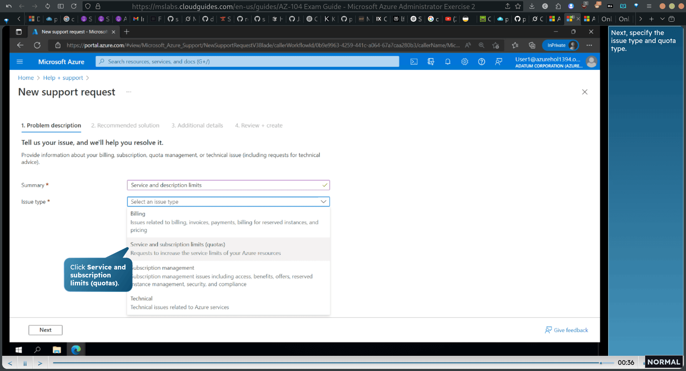
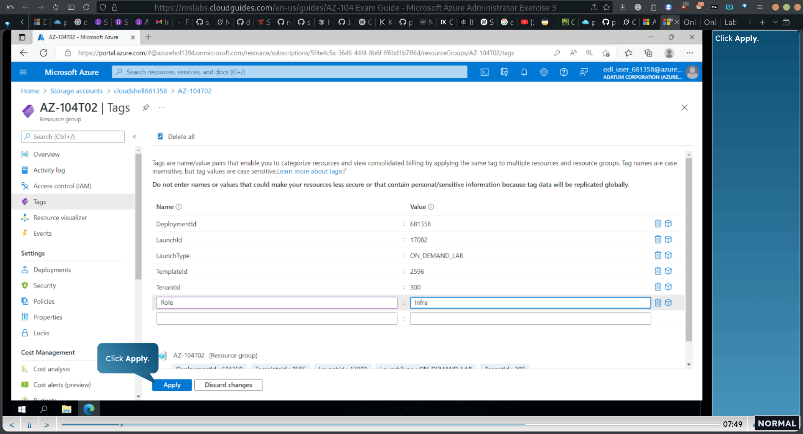
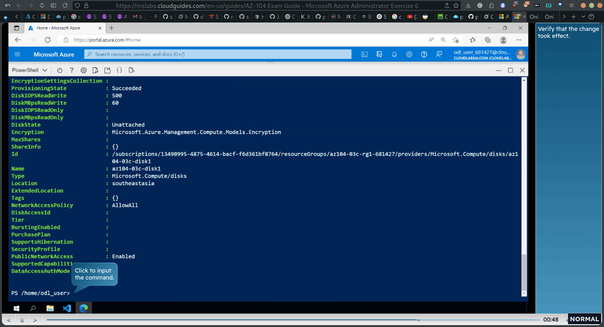
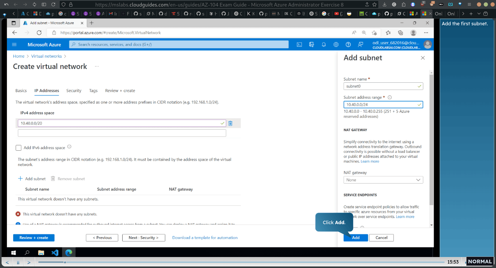
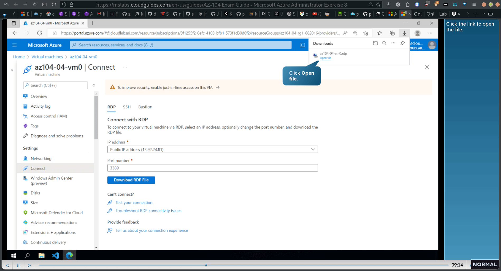

# 777-azure-notes-3(az-104)

[Online Hosted Instructions | AZ-104-MicrosoftAzureAdministrator](https://microsoftlearning.github.io/AZ-104-MicrosoftAzureAdministrator/)

online lab:

- [AZ-104 Exam Guide - Microsoft Azure Administrator](https://mslabs.cloudguides.com/guides/AZ-104%20Exam%20Guide%20-%20Microsoft%20Azure%20Administrator)

- exercies lab 8 is useful in setting network


-> clickable

1. Manage Azure Active Directory identities >


- in private mode browser

Task 2: Create Azure AD groups with assigned and
dynamic membership


- asign user to use these premium active directory


- create group


- dynamic user


dynamic query (rule that appiled)

e.g. job title equal cloud administrator


another example


assigned example
pick the user

---

## Task 3: Create an Azure AD tenant


## Task 4: Manage Azure AD guest users


- copy User principal name


- switching


invite external user


- guest user now

and then add the user into group

---

# 2. Manage subscriptions and RBAC >

## Task 1: Implement management groups


property -> setting -> access

search management group

click start using management group


- create a new management group


- copy the subscription ID

## Task 2: Create custom RBAC roles


- replace the sub ID (from clipboard)

cloud shell -> power shell


click the storage blog then


upload the json file in the home directory


New-AzRoleDefinition -InputFile $HOME/az104-82a-customRoleDefinition.json

## Task 3: Assign RBAC roles

copy a new created user , User principal name again


- access control IAM


add role assignment


adding member (new created user)

- login your new created user
  check wheather he can access all resource (from search bar)


help + support

- Create a support request



- Service and subscription limits (quotas) type issue

---

# 3. Manage governance via Azure Policy >

User -> property -> edit -> setting


created user

click user -> assigned role


user admin role

login in that new ac


view AD

click and scroll and click user settings


notice don't have any permission

scroll up click user

create new user

## Task 2: Create Azure AD groups with assigned and dynamic membership

click ad company

click licnese


select all product

click try/buy


click new item and assigne with new ac

go back azure AD -> Group

created new three group

1. it cloud admin
   dynamic rule => job title equal cloud admin

2. securit group for it system admin

3. security group for lab admin

click security(all three are inside) , click cloud admin

click members verify that cloud admin is in the group

## Task 3: Create an Azure AD tenant

back to adatumn active directory -> click manage tenants (first page)


overview


click the link lab (new tenant)

- god damn it is the same exercise i did before , what the foo (i click the wrong link), no wonder why it is the same

---

## 3. Manage governance via Azure Policy ( real one)

## Task 1: Create and assign tags via the Azure portal


click the ac


click the tag in the left



new role -> infra

go back storage ac link (from tab bar)


new tag did'nt in the frontend though

## Task 2: Enforce tagging via an Azure policy

search policy -> Definition


assign

- define the scope

review and created

go back to the resource group


- click created

new storage

## Task 3: Apply tagging via an Azure policy

search policy -> assignment


delete assignemn and confirm

click assign policy , -> scope ->

click policy defitinion -> more


- Inherit a tag from the resource group if missing


Select the check box labeled Create a remediation task.

create

now new created storage account will come up tag in the front end (go the resource-> overview : tag )

---

# 4. Manage Azure resources by using the Azure portal >

## Task 1: Deploy resources to an existing resource group

search disk


32 gb -> create

## Task 2: Move a resource between resource groups


select new disk -> move -> move to other resource groups

search resource group and verify

## Task 3: Implement and test a resource lock


delete lock from a new disk item

warning -> delet fail

---

# 5. Manage Azure resources by using Azure Resource Manager templates >

## Task 1: Review an ARM template for deployment of an Azure managed disk


deployment


select one and -> template


click input and look for the info


extract the downloaded file

---

## Task 2: Create an Azure managed disk by using an ARM template

Search Deploy a custom template in portal

click build your won template

load file

upload the download and extracted template


remove the unnessary item in json


delete these three

and this one


delete the os line as well


edit parameters

click load file and upload parameter from extrated file


- change the resource group if necessary, like disk name

create

## Task 3: Review the ARM template-based deployment of the managed disk

search resource group -> deployment -> select -> _inputs and templates_

---

## 6. Manage Azure resources by using Azure PowerShell

## Task 1: Start a PowerShell session in Azure Cloud Shell

cloud shell -> powershell


## Task 2: Create a resource group and an Azure managed disk by using Azure PowerShell

$location = (Get-AzResourceGroup -Name az104-03b-rgl-681427).Location

From the PowerShell session within Azure Cloud Shell, run the commands as shown to create a resource group in the same Azure region as the resource group you created in the previous lab.

New-AzResourceGroup -Name $rgName -Location $location


Get-AzResourceGroup -Name $rgName


Next, create a new managed disk with the same properties as those created in the previous two labs.

$diskConfig = New-AzDiskConfig `


properitis

Get-AzDisk -ResourceGroupName $rgName -Name $diskName

## Task 3: Configure the managed disk by using Azure PowerShell

New-AzDiskUpdateConfig -DisksizeGB 64 | Update-AzDisk -ResourceGroupName $rgName -DiskName $diskName



verify the change

Get-AzDisk -ResourceGroupName $rgName -Name $diskName

(Get-AzDisk -ResourceGroupName $rgName -Name $diskName).Skul
verify the current sku


New-AzDiskUpdateConfig -Sku Premium_LRS | Update-AzDisk -ResourceGroupName $rgName -DiskName $diskName

chanage the premium
verify the change


---

## 7. Manage Azure resources by using the Azure CLI > bash

## Task 1: Start a Bash session in Azure Cloud Shell

cloud -> bash

## Task 2: Create a resource group and an Azure managed disk by using Azure CLI

LOCATION=$(az group show --name 'lle-QZc-rgl-&SlléT --query location --out tsv)

RGNAME=‘az104-03d-rgl-681427"

az group create --name $RGNAME --location $LOCATION


az group show --name $RGNAME

- checking


DISKNAME=‘az104-03d-diskl"

az disk create \ resource group , name $Disname , sku 'Standard_LRS', --size-gb 32


az disk show --resource-group $RGNAME --name $DISKNAME

- retrieve the property on newly created disk

## Task 3: Configure the managed disk by using Azure CLI

az disk update --resource-group $RGNAME --name $DISKNAME --size-gb 64
az disk show --resource-group $RGNAME --name $DISKNAME --query diskSizeGb

az disk update --resource-group $RGNAME --name $DISKNAME --sku 'Premium_LRS'


verify:
az disk show --resource-group $RGNAME --name $DISKNAME --query sku

---

# 8. Implement virtual networking >

## Task 1: Create and configure a virtual network

Virtual network


modify the ip address /20


subnet /24

10.40.0.0/20 -> 10.40.0.0/24

Sure! Here's how to **choose the right subnet size** based on your scenario in Azure.

---

### üîç 1. Ask: How many IP addresses do you need?

Azure reserves **5 IPs** per subnet, so subtract that from the total.

| CIDR  | Usable IPs | Typical Use                                              |
| ----- | ---------- | -------------------------------------------------------- |
| `/30` | 1          | Point-to-point links                                     |
| `/29` | 3          | Tiny test environments                                   |
| `/28` | 11         | Small dev/test subnet                                    |
| `/27` | 27         | Small VM group or service tier                           |
| `/26` | 59         | Medium-sized web tier                                    |
| `/24` | 251        | Larger services or databases                             |
| `/20` | 4091       | Whole VNet address space (avoid using this as a subnet!) |

---

### üìò Example Use Cases

#### üî∏ If you're creating:

- **A dev/test subnet with 2–5 VMs** → use **`/28`** or **`/27`**
- **A frontend subnet for 20-30 web servers** ‚Üí use **`/26`**
- **A shared services subnet (DNS, AD)** ‚Üí use **`/27`**
- **A future-proof subnet for scalable apps** ‚Üí use **`/24`**

---

### 🧮 How to calculate the subnet size

Use the formula:

```
2^(32 - CIDR block) - 5 = usable IPs
```

So for `/26`:

```
2^(32-26) - 5 = 64 - 5 = 59 usable IPs
```

---

### ‚úÖ Subnet Planning Tips for Azure

1. **Start small**, but leave space to scale (e.g., use `/27` instead of `/28`)
2. **Separate roles** into subnets: frontend, backend, database, management
3. Avoid using the **entire address space** in a single subnet
4. **Leave gaps** for future subnets when designing your CIDR blocks

---

If you tell me:

- How many VMs or services you want to deploy
- Whether it’s dev, test, or production
- How much room you want for future expansion

… I can recommend the best CIDR for your subnet. Want to do that?

Great question! You **subtract 5 IP addresses** from each Azure subnet because **Azure reserves them for internal use.** Here's the breakdown:

---

### üîπ Why does Azure reserve 5 IP addresses per subnet?

When you create a subnet in Azure, it automatically reserves **5 IPs** for internal functions:

| Reserved IP | Purpose                                                          |
| ----------- | ---------------------------------------------------------------- |
| **.0**      | **Network address** (e.g., `10.40.0.0`) — identifies the subnet  |
| **.1**      | **Default gateway** — used by Azure for routing outbound traffic |
| **.2 - .3** | Reserved by **Azure for future use**                             |
| **.255**    | **Broadcast address** (in traditional networking), reserved      |

> So: **First 4 + last 1 = 5 reserved IPs**

---

### üî∏ Example: `10.40.0.0/24` subnet

- Total IPs: `2^(32 - 24) = 256`
- Reserved by Azure: `5`
- **Usable IPs**: `256 - 5 = 251`

---

### ‚úÖ Why this matters:

When planning your subnets, always keep these 5 reserved IPs in mind. If you need 20 VMs, a `/27` (32 total IPs → 27 usable) would work. But if you use `/28` (16 total IPs), you'd only get **11 usable** — maybe not enough.

---

Let me know how many machines or services you're planning, and I can suggest a subnet size that leaves enough usable space!

Why does Azure reserve 5 IP addresses per subnet?

When you create a subnet in Azure, it automatically reserves 5 IPs for internal functions:
Reserved IP Purpose
.0 Network address (e.g., 10.40.0.0) — identifies the subnet
.1 Default gateway — used by Azure for routing outbound traffic
.2 - .3 Reserved by Azure for future use
.255 Broadcast address (in traditional networking), reserved

So: First 4 + last 1 = 5 reserved IPs

---

create


select subnet

add new subnet for newly


10.40.1.0/24

## Task 2: Deploy virtual machines into the virtual network

cloud -> powershell ->storage

upload


upload both VM -> vms loop parameters and template

code . -> vs code

parameter -> change the password


$rgName = 'az104-04-rgl-682016"

New-AzResourceGroupDeployment `


## Task 3: Configure private and public IP addresses of Azure VMs


connect device -> ip config


associate


add public id address

assignment -> static 10.40.0.4


select second device

ip config ->


again

## Task 4: Configure network security groups

Search VM
select the first VM


connect -> RDP -> Remote desktop -> download RDP file


using public addres -> port 3389 -> RDP

connect fail as expected

- -> network security group


go to resource


- allow inbond security rules


allow rdp

click priority , -> 300 , name


- Network interfaces -> associate

select associated to network security group

select both newly

go back to VM


now can be used in rdp

## Task 5: Configure Azure DNS for internal name resolution

private azure dns zones

search private azure dns zones

Virtual network links -> add


- Enable auto registration

- Verify that both virtual machines appear in the list of record set as auto registered. Next, return to the RDP session for the first virtual machine.


back to rdp window -> , run as admin powershell :


nslookup az104-04-vm0.contoso.org
In the Windows PowerShell console, run the commands as shown to test internal name resolution in the newly created private DNS zone.


nslookup az104-84-vm1.contoso.org

## Task 6: Configure Azure DNS for external name resolution

search dns zone


name -> dns name


overview -> record set


- Add a record set that uses the public IP address of the first virtual machine.

- Next, add a record set that uses the public IP address of the second virtual machine.


- copy the name of name sever 1

cloud shell -> nslookup az104-84-vm@.contoso682016.org nsl1-03.azure-dns.com.

- In the PowerShell console, run the command as shown fo test external name resolution in the newly created DNS zone for the first DNS record set. Note: Use the name of Name server 1 and the name of the DNS domain created earlier in this task.


- Verify that the output of the command includes the public IP address of the virtual machine. Now test external name resolution for the second virtual machine DNS record set.

nslookup az104-84-vml.contoso682016.org ns1-83.azure-dns.com.


---

## 9. Implement inter- site connectivity >

## Task 1: Create and configure a virtual network

In this first task, you will deploy three virtual machines, each into a separate virtual network, with two of them in the same Azure region and the third one in another Azure region.

cloud shell -> power -> storage -> upload


loop paraetmers -> loop template

code . -> change the password (seem like a azure policy ? have to change password)


- Note: The first two virtual networks and a pair of virtual machines will be deployed in East US [Azure_region_1]. The third virtual network and the third virtual machine will be deployed in the same resource group but in West US [Azure_region_2].

$location1='eastus'

$locat...  = ' westus'
$rgName = '2z104-85-rg0-682068"

- using loop template :


## Task 2: Configure local and global virtual network peering

search Virtual network

verify the cli result:


click -> peering -> add

name (from .. to )


- Next, select the option to block traffic that originates from outside this virtual network.

scroll down: (for _remote Virtual network_)


- block traffic aswell

- Provide the information fo establish global peering between this virtual network in the East US region and the virtual network in the West US region.
- First, provide the peering link name for this virtual network. Note: This step establishes two global peerings: one from az104-05-vnet0 to az104-05-vnet2 and the other from az104-05-vnet2 fo az104-05-vnet0.


block traffic as well

back to network :


select second vnet1

- peering again

- Provide the information fo establish global peering between the second virtual nefwork in the East US region and the one in the West US region.
- Note: This step establishes two global peerings: one from az104-05-vnet1 to az104-05-vnet2 and the other from az104-05-vnet2 to az104-05-vnet1.


## Task 3: Test inter-site connectivity

Search VM
select the firts in east us

click onlien -> rdp

- run powershell as admin

Test-NetConnection -ComputerName 10.51.0.4 -Port 3389 -InformationLevel 'Detailed’
Note: The test uses TCP 3389 since this is this port is allowed by default by operating system firewall.


exam the output

Test-NetConnection -ComputerName 10.52.0.4 -Port 3389 -InformationLevel 'Detailed’


select the second vm

Test-NetConnection -ComputerName 10.52.0.4 -Port 3389 -InformationLevel 'Detailed'

---

# 10. Implement traffic management >

## Task 1: Deploy virtual machines

- The first two will reside in a hub virtual network, and the remaining two will reside in separate spoke virtual networks.


upload loop json , change the password , then

New-AzResourceGroupDeployment


$location = (Get-AzResourceGroup -ResourceGrouphame $rgName).location
$vmNames = (Get-AzVM -ResourceGroupName $rgName).Name


foreach ($vmName in $vmNames) {

Set-AzVMeExtension °
-ResourceGroupName $rgName
-Location $location _
-VMName $vmName _
-Name ‘networkWatcherAgent' °
-Publisher 'Microsoft.Azure.NetworkWatcher
-Type 'NetworkWatcherAgentilindows' \*
-TypeHandlerVersion '1.4'


---

## Task 2: Configure the hub and spoke network topology

virtual netowrk -> first -> scroll peering

- between the hub virtual network and the first spoke virtual nefwork.
- Note: This step establishes two local peerings: one from az104-06-vnet01 to az104-06-vnet2 and the other from az104-06-vnet2 fo az104-06-vnet0l1.


Note: This step establishes two local peerings: one from az104-06-vnet01 to az104-06-vnet3 and the other from az104-06-vnet3 to az104-06-vnet01, which will complete the hub and spoke topology.


- above operation block traffic as well

## Task 3: Test transitivity of virtual network peering

using network watcher


-> connection troubleshot


- First, test the connection from the hub virtual network to the first spoke virtual network.
- Note: 10.62.0.4 repres ents the private IP address of az104-06- vm2.

destination -> manually -> private ip of vm2

destination port -> 3382 rdp


grid view

- The status is Reachable. The network path shows that the connection was direct, with no intermediate hops in between the virtual machines.

network watcher -> connection troubleshoot

Next, test the connection from the hub virtual network to the second spoke virtual network. Note: 10.63.0.4 repre sents the private IP address of az104-06- vm3.


vm2 -> private ip of vm3

- The status is Unreachable. This task is now complete. Click the screen to continue.

alarm result :


## Task 4: Configure routing in the hub and spoke topology

search vm -> frist vm0-> networking -> network interface link


ip config -> ip forwarding -> enable


- Set IP forwarding to Enable d and save the change.

- Note: This setting is required for the virtual machine named az104-06- vm0 to function as a router, which will route traffic between two spoke virtual networks.

-> click save

-> click vm0 overview -> run command (under operation )


run commad -> powershell (turn it into router lol)

Install-WindowsFeature RemoteAccess -IncludeManagementTools

Run the script as shown fo install the Remote Access Windows Server role.


back , and click run powershell script

Install-WindowsFeature -Name Routing -IncludeManagementTools -IncludeAllSubFeature
Install-WindowsFeature -Name "RSAT-RemoteAccess-Powershell”
TInstall-RemoteAccess -VpnType RoutingOnly
Get-NetAdapter | Set-NetIPInterface -Forwarding Enabled

Run the script as
shown fo install the
Routing role service.


- Next, you'll create and configure user- defined routes on the spoke virtual networks.

Search for and select Route tables.


- In Azure Route Tables, the setting "Propagate gateway routes" controls whether routes from a Virtual Network Gateway (VPN or ExpressRoute) are automatically added to your custom route table.


- Add a route from the first spoke virtual nefwork to the second spoke virtual network.


Next hop type
Select next hop type
Virtual network gateway
Virtual network
Internet
Virtual appliance
None

### üîπ 1. **Virtual Network Gateway**

- **Used when:** You want traffic to go through a **VPN gateway** or **ExpressRoute gateway**.
- **Example:** Sending traffic to an **on-premises network** via VPN.
- **Use case:**

  - Destination: `192.168.0.0/16`
  - Next hop: **Virtual Network Gateway**
    ‚Üí Tells Azure: "Send this traffic to my on-premises network through the gateway."

---

### üîπ 2. **Virtual Network**

- **Used when:** Traffic should stay **within the Azure virtual network**.
- **Effect:** Tells Azure: "This traffic is local. Keep it inside the VNet."
- **Use case:** You don’t usually set this manually because **VNet-to-VNet** traffic is routed automatically by Azure.
  But in **complex setups**, you might override a more specific route.

---

### üîπ 3. **Internet**

- **Used when:** You want traffic to go **directly to the internet**.
- **Effect:** Sends packets out through the Azure **default internet gateway**.
- **Use case:**

  - Destination: `0.0.0.0/0`
  - Next hop: **Internet**
    ‚Üí All outbound traffic not matching any other route goes to the internet.

---

### üîπ 4. **Virtual Appliance**

- **Used when:** You have a **Network Virtual Appliance (NVA)**, such as:

  - A firewall
  - A router (e.g., a Fortinet, Palo Alto, or pfSense VM)

- You need to specify the **IP address of that NVA**.
- **Use case:**

  - Destination: `0.0.0.0/0`
  - Next hop: **Virtual Appliance**
  - IP address: `10.40.0.4`
    ‚Üí Routes all internet-bound traffic **through your firewall first**.

✅ This is what your tutorial likely uses — to **inspect/filter traffic** through a custom appliance (for learning or security).

---

### üîπ 5. **None**

- **Used when:** You want to **block traffic** to a specific range.
- **Effect:** Azure drops the traffic (no next hop).
- **Use case:**

  - Destination: `10.0.0.0/8`
  - Next hop: **None**
    ‚Üí Blocks traffic to that network. Used in **network segmentation** or **security policies**.

---

### 🧠 Summary Table

| Next Hop Type               | Sends Traffic To…                       | Typical Use                  |
| --------------------------- | --------------------------------------- | ---------------------------- |
| **Virtual Network Gateway** | VPN/ExpressRoute gateway to on-premises | Hybrid networking            |
| **Virtual Network**         | Inside same Azure VNet                  | Local routing override       |
| **Internet**                | Azure internet gateway                  | Public outbound              |
| **Virtual Appliance**       | Your own firewall/router VM             | Custom inspection or control |
| **None**                    | Nowhere (drop traffic)                  | Blocking or isolating        |

---


Great! Let's break down this route:

---

## üß≠ Route Details

- **Destination IP/CIDR:** `10.63.0.0/20`
- **Next hop type:** **Virtual appliance**
- **Next hop address:** `10.60.0.4`

---

## 🧠 What This Route Means

> “Any traffic going to the IP range `10.63.0.0 – 10.63.15.255` should be sent to the **virtual appliance** at IP `10.60.0.4`.”

---

## ✅ Why it’s configured this way

This is a **custom route** in Azure, probably set up for **traffic inspection or control**.

### The reasons behind it likely include:

### üî∏ 1. **Security filtering**

- `10.60.0.4` is likely a **Network Virtual Appliance (NVA)** (e.g., a firewall).
- Traffic destined for `10.63.0.0/20` (another subnet or VNet) is forced to pass **through the firewall** for inspection, logging, or policy enforcement.

### üî∏ 2. **Centralized routing**

- All routes to certain networks (like `10.63.0.0/20`) are sent to a **central appliance**.
- This allows for:

  - **Traffic monitoring**
  - **Access control**
  - **Packet filtering**
  - **NAT or proxy services**

### üî∏ 3. **Hub-and-spoke network design**

- `10.60.0.4` is likely in the **hub VNet**.
- `10.63.0.0/20` may be in a **spoke VNet**.
- This route forces **spoke-to-spoke or spoke-to-on-prem** traffic to **go via the hub**, using `10.60.0.4` as a gateway.

---

## üîê Why not route directly?

Azure by default allows traffic between subnets in the same VNet, or between peered VNets if allowed. However, **this route overrides that** to:

- Enforce **security policies**
- Apply **custom logic** via the appliance
- Enable **logging, IDS/IPS, or DLP** controls

---

## üìò Visual Representation

```
[ VM in Subnet A ]
     |
     |--(Route to 10.63.0.0/20)-->
     |       via Virtual Appliance (10.60.0.4)
     |
[ Firewall or Router VM (NVA) ]
     |
     |--> Forwards traffic to 10.63.0.0/20
```

---

## üö¶ Final Note

- This type of setup is common in **production-grade** Azure environments where **segmentation and security** are critical.
- Without this route, traffic might bypass security controls and go directly to `10.63.0.0/20`.

---

22104-06-route-vnet2-to-vnet3

back to routes -> setting -> subnets -> add subnets

Associate the route table to the subnet in the first spoke virtual nefwork.


search route table and add another


- Add a route from the second spoke virtual network to the first spoke virtual network.

- 10.62.0.0/20 (destination ip) -> 10.60.0.4 (next hub address)


- Associate the route table to the subnet in the second spoke virtual network.


return network watcher -> troubleshoot

- Test the connection from the second spoke virtual network to the first spoke virtual network.


- The status is Reachable. The network path shows that the traffic was routed via the IP address for the hub virtual machine you configured as a router.

Note: These results are expected, since the traffic between spoke virtual networks is now routed via the virtual machine located in the hub virtual network, which functions as a router.

## Task 5: Implement Azure Load Balancer

search load balancer

create


add a frontend ip confirm


no zone (testing)

adding backend pool


vnet01

- Add the two virtual machines in the hub virtual network to the backend pool.


add load balancing rule


port , backend port 80

new health probe


Great question! Here's why **port 80** is often used for both the **frontend port** (on the Azure Load Balancer) and the **backend port** (on your VM or service):

---

## üîπ What is Port 80?

- **Port 80** is the **default port for HTTP** (unencrypted web traffic).
- It's what browsers use when you type a URL without "https\://" — e.g., `http://example.com`.

---

## 🔄 Frontend Port vs. Backend Port in Azure Load Balancer

| Term              | Meaning                                                                      |
| ----------------- | ---------------------------------------------------------------------------- |
| **Frontend port** | The port that **users connect to** on the load balancer’s public IP          |
| **Backend port**  | The port on the **virtual machine (backend)** where the request is forwarded |

---

## ‚úÖ Why both are set to **80** in most tutorials:

### üî∏ 1. **Simple Web Server Demo**

- Most basic web apps or test VMs run **HTTP servers** like Nginx, Apache, or IIS on port 80.
- Matching frontend and backend ports = **straightforward setup**.

### üî∏ 2. **No Port Translation Needed**

- Setting both ports to 80 means:

  - The user accesses: `http://<load-balancer-ip>:80`
  - Azure forwards it directly to `http://<backend-vm-ip>:80`

- This avoids confusion and makes **debugging easier**.

### üî∏ 3. **Browser Compatibility**

- Browsers automatically assume port 80 for HTTP.
- Users don’t need to specify a port in the URL.

---

## üß™ Example

- You deploy a load balancer in front of 3 VMs.
- Each VM runs a web server on port **80**.
- You configure:

  - **Frontend port**: 80
  - **Backend port**: 80

- A user hits `http://<LB-IP>`, and Azure routes the request to a healthy backend VM on port 80.

---

## üîê What if you want to use HTTPS (secure)?

- Then you'd use **port 443** instead:

  - Frontend port: **443**
  - Backend port: **443**

- You’d also need an **SSL certificate** installed.

---

### 🔁 What if frontend ≠ backend ports?

You **can** set:

- Frontend: 8080
- Backend: 80

Then users would need to access:
`http://<LB-IP>:8080`
Azure would forward it to port 80 on the backend.

This is useful in special cases, like:

- Port conflict on frontend IP
- Hosting multiple services with different public ports

---

## ‚úÖ Summary

| Setting                       | Reason                                        |
| ----------------------------- | --------------------------------------------- |
| Port 80                       | Default for HTTP traffic                      |
| Same frontend & backend ports | Simplifies setup and avoids translation       |
| Tutorials use it              | Because it's the most common web app scenario |

---


outbond rules-> none here

go to resource -> frontend ip config -> copy the ip address


test it in local browser

The target virtual machine changed to the second VM in the hub virtual network, as indicated by the message. This task is now complete. Close the browser tab.

refresh the ip -> from vm0 to vm1 (load balanced)

## Task 6: Implement Azure Application Gateway

- In this next task, you will implement an Azure Application Gateway in front of the two Azure virtual machines in the spoke virtual networks.


vnet01 -> subnet -> add subnet


Click save.

- Note: The Application Gateway requires a dedicated subnet with a minimum size of /27.

search application gateway -> creat


- In the Target column, enter the private IP addresses of virtual machines in the spoke virtual networks.


adding routing rule

listener


backend setting:


add new backend setting


copy the frontend ip address
The target virtual machine changed to the VM in the second spoke virtual network, as indicated by the message.

- Note: This result illustrates that Application Gateway can target virtual machines on multiple virtual networks. Additionally, Application Gateway can target endpoints in other Azure regions or even outside of Azure,
  **- unlike Azure Load Balancer, which load balances across virtual machines in the same virtual network.**

---

# 11. Manage Azure Storage

Lab scenario: In this lab, you'll evaluate the use of Azure Storage for storing files currently residing in on-premises data stores. To minimize the cost of storage, you'll place less frequently accessed files in lower-priced storage ftiers. You'll also explore different protection mechanisms that Azure Storage offers, including network access, authentication, authorization, and replication. Finally, you'll determine to what extent the Azure Files service might be suitable for hosting your on-premises file shares.

## Task 1: Deploy an Azure virtual machine


## Task 2: Create and configure an Azure Storage account


storage ac -> rg1


hot type

enable soft delete


click the new ac -> geo replication-> setting -> config

Set Replication to Locally-redundant storage (LRS) and save the change.


Note that the storage account only has the primary location. Return to the Configuration blade.

- Set Blob access tier (default) to Cool and save the change. Note: The cool access tier is optimal for data that is not accessed frequently.

save

## Task 3: Manage blob storage

ac -> container -> new -> upload a blob


upload license

hot type

Note: You can download the blob, change its access tier, acquire a lease, and assign custom metadata. You can also edit the file directly within the Azure portal, create snapshots, and generate an SAS token.

## Task 4: Manage authentication and authorization for Azure Storage

copy the blob url -> firefox -> url


Since the _container’s public access_ level is set to private, the resource was not found. Close the browser window to return to the Azure portal.

- Open the Generate SAS tab.

- Update the start date and then click Generate SAS token and URL.

generate the real url

now the browser can view it


- Next, click Switch to Azure AD User Account.

An error appears because you do not have permission to change the authentication method. In the left pane, click Access Control (IAM).

add role assignment

- Search for and then select the Storage Blob Data Owner role.


select member , search for username -> review and assign

back to

- Click Switch to Azure AD User Account fo verify that you can change the authentication method.

## Task 5: Create and configure an Azure Files share

container -> file share


new share Scroll down the Windows tab and copy the script.

you can select different os here

search VM


- paste the scrpit you copy early

$connectTestResult =
if (SconnectTestResult.TcpTestSucceeded) {

# Save the password so the drive will persist on reboot

cmd.exe /C “cmdkey /add:® “strgaz104t07682720.file.core.windows.net™ " /user:” "localhost\strg:

Test-NetConnection -ComputerName strgaz104t07682720.file.core.windows.net

# Mount the drive

New-PSDrive -Name Z -PSProvider FileSystem -Root "\\strgaz104t07682720.file.core.windows.ne’

} else [
Write-Error -Message "Unable to reach the Azure storage account via port 445. Check to make


another script:

New-Item -Type Directory -Path 'Z:\az104-07-folder'

New-Item -Type File -Path 'Z:\az104-07-folder\az-104-07-file.txt"


Return fo the File shares blade to verify the new folder and file were created.

the folder and the file is created (lol why need this part)

## Task 6: Manage network access for Azure Storage

back to file share blades (storage ac)

- Under Security + networking in the left pane, click Networking.


- Enabled from selected virtual networks and IP addresses rather than all networks

Note: You can use these settings to configure direct connectivity between Azure virtual machines on designated subnets of virtual networks and the storage account by using service endpoints.

Click the Add your client IP address check box and save the change.


Next, open a new InPrivate window and navigate to the blob SAS URL you generated previously.
Since you are connecting from your client IP address, the license file downloaded successfully.

Invoke-WebRequest -URI 'your sas url'


- Since you are connecting from the IP address assigned to an Azure virtual machine hosting the Cloud Shell instance, the download attempt failed.
  red word

---
