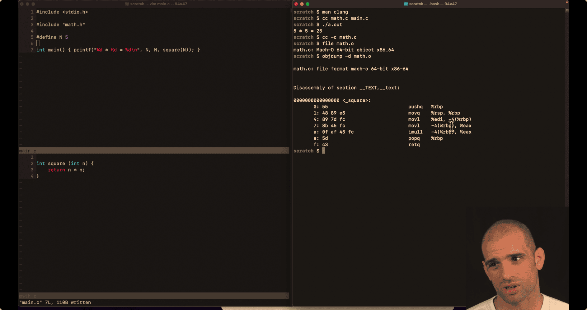

# csprimer-computersystem-concept4

053 What happens in the compilation pipeline

Call -> Compile assemble link load

main.c (source) -> assemble code -> main.o -> a.out(binary)



objdump
hexdump

cc -c -> math.c -> obj without link
method 1: cc (two .c)
./a.out

method2:
cc -c main.c
cc main.o math.o
./a.out

man clang -> short view of how Complier do, parts

cc -E main.c
-E Run the preprocessor stage.

- this is the Preprocessing output

Assembling output: (llvm process)

cc -S main.c
-S Run the previous stages as well as LLVM generation and optimization stages and target-specific code generation,
cat main.s

---

045 Helping Max rotate bits right


unsigned 8 bits


copy that part -> add or shift 1 and then combine the other part

in node:

> -8 >>1
> -4
> -8 >>>1 (it will give positive number )
> 2147483644

if it is signed int, need to use logical right shift

number -> first digit
bit -> second digit

cpu : arithmetical shift or logical shift

---

extra ai finding `% ` and `&` (out topic)

Let’s use `k = 19` and `n = 8`:

- `19` in binary: `00010011`
- `8` in binary: `00001000`
- `n - 1 = 7` in binary: `00000111`

Bitwise operation:

```
   00010011   (19)
&  00000111   (7)
------------
   00000011   (3)
```

So, `19 & 7 = 3`

Math operation:

```
19 % 8 = 3
```

**Result:**  
Both `19 % 8` and `19 & 7` give `3`, because `& 7` keeps only the last 3 bits, which is the remainder when dividing by 8.

**only when `k` is a power of 2 (like 2, 4, 8, 16, etc.) can you use `x & (k - 1)` instead of `x % k`.**

For other values of `k`, this does not work.  
Example:

- For `x = 7`, `k = 5`:
  - `7 % 5 = 2`
  - `7 & 4 = 4` (wrong result)  
    So, use `x & (k - 1)` only when `k` is a power of 2.

---

- some bit review:
  Original n: 101100  
  n - 1: 101011  
  n & (n - 1): 101000

Step-by-step:

- The rightmost 1 in 101100 is at position 2 (from the right).
- Subtracting 1 flips that 1 to 0 and all trailing 0s to 1s: 101011.
- ANDing:  
   101100  
  & 101011  
  = 101000

**n & (n - 1):Result: The rightmost 1 is cleared.**

n & 1 checks if the rightmost bit of n is 1 (odd) or 0 (even).

Example:  
n = 6 (binary: 110)  
n & 1 = 110 & 001 = 000 → result is 0 (even)

n = 7 (binary: 111)  
n & 1 = 111 & 001 = 001 → result is 1 (odd)

**So, n & 1 extracts the least significant bit.**

| Method             | Iterations Needed              | Performance Benefit    |
| ------------------ | ------------------------------ | ---------------------- |
| `n >>= 1` `>> =  ` | Up to 32                       | Slower for sparse bits |
| `n &= (n-1)`       | Only set bits (Hamming weight) | Faster overall         |

---

```c
bool ispangram(char *s) {
  uint32_t bs = 0;
  char c;
  while (*s != '\n') {
    /* c = tolower(*s); */
    /* s++; */
    c = tolower(*s++);
    if (c < 'a' || c > 'z')
      continue;
    bs |= 1 << (c - 'a');
  }
  // TODO implement this!
  return bs == 0x03ffffff; // how is  this 26 bits are set
//So, `return bs == 0x03ffffff;` returns true only if all 26 letters were found.
}

```

```
bs (binary): 00000000000000000000000000
              ^                        ^
             'a'                     'z'
```

Suppose the string is "bad":

1. Start: bs = 00000000000000000000000000

2. For 'b':
   - 'b' - 'a' = 1
   - Set bit 1:  
     bs = 00000000000000000000000010

3. For 'a':
   - 'a' - 'a' = 0
   - Set bit 0:  
     bs = 00000000000000000000000011

4. For 'd':
   - 'd' - 'a' = 3
   - Set bit 3:  
     bs = 00000000000000000000001011

**Visual:**  
Each time a letter is found, its corresponding bit is turned ON (set to 1).  
So, after "bad", bits for 'a', 'b', and 'd' are set:

```
bs (binary): 00000000000000000000001011
              zyxwvutsrqponmlkjihgfedcba
```

Read from right to left:

- The rightmost bit is 'a', next is 'b', then 'c', etc.
- After "bad", bits for 'a', 'b', and 'd' are 1.

---

#### Key Differences Between the Two Pangram Implementations

Both use bit manipulation, but there are important differences in approach and efficiency:

---

### 🔍 **Character Processing**

**Your Version:**

```c
c = tolower(*s++);
if (c < 'a' || c > 'z')
    continue;
bs |= 1 << (c - 'a');
```

**Vim Version:**

```c
while ((c = *s++) != '\0') {
    if (c < '@') continue; // ignore first 64 chars
    bs |= 1 << (c & 0x1f);
}
```

**Differences:**

- **Your version**: Uses `tolower()` function call + explicit range check
- **Vim version**: Uses bitwise AND (`& 0x1f`) + simpler range check
- **Vim version is faster**: No function call overhead

---

### 🎯 **Bit Mapping**

**Your Version:**

```c
bs |= 1 << (c - 'a');  // 'a' maps to bit 0, 'z' maps to bit 25
```

**Vim Version:**

```c
bs |= 1 << (c & 0x1f);  // 'a'/'A' maps to bit 1, 'z'/'Z' maps to bit 26
```

**Key Insight:**

- **Your version**: `'a' - 'a' = 0`, so 'a' uses bit 0
- **Vim version**: `'a' & 0x1f = 97 & 31 = 1`, so 'a' uses bit 1
- **Vim version**: `'A' & 0x1f = 65 & 31 = 1`, so 'A' also uses bit 1

---

### 🔢 **Mask Comparison**

**Your Version:**

```c
return bs == 0x03ffffff;  // 26 bits set: 00000011 11111111 11111111 11111111
```

**Vim Version:**

```c
return (bs & MASK) == MASK;  // MASK = 0x07fffffe: 00000111 11111111 11111111 11111110
```

**Bit Analysis:**

- **Your mask**: `0x03ffffff` = bits 0-25 set (26 bits total)
- **Vim mask**: `0x07fffffe` = bits 1-26 set (26 bits total)

---

### ⚡ **Performance Comparison**

| Aspect              | Your Version              | Vim Version              |
| ------------------- | ------------------------- | ------------------------ |
| **Case handling**   | `tolower()` function call | Bitwise AND (faster)     |
| **Range check**     | `c < 'a' \|\| c > 'z'`    | `c < '@'` (simpler)      |
| **Bit calculation** | `c - 'a'` (subtraction)   | `c & 0x1f` (bitwise AND) |
| **Bit positions**   | 0-25                      | 1-26                     |

**Vim version advantages:**

- No function calls (`tolower()` is expensive)
- Simpler range checking
- More efficient bit operations
- Case-insensitive without function calls

---

### 🎯 **Why Vim Version is More Efficient**

1. **`tolower()` vs `& 0x1f`**:

   ```c
   // Your version: function call overhead
   c = tolower(*s++);

   // Vim version: direct bit manipulation
   c = *s++;  // no function call
   ```

2. **Range checking**:

   ```c
   // Your version: two comparisons
   if (c < 'a' || c > 'z')

   // Vim version: one comparison
   if (c < '@')
   ```

3. **Bit mapping**:

   ```c
   // Your version: arithmetic
   c - 'a'  // requires subtraction

   // Vim version: bitwise
   c & 0x1f  // faster bitwise operation
   ```

---

### �� **Both Work, But Vim Version is Optimized**

Both implementations correctly detect pangrams, but the vim version uses more efficient bit manipulation techniques to achieve the same result with better performance. The key insight is using `& 0x1f` to handle case-insensitive letter mapping without function calls.

---

continue:

#### Understanding the Vim Version Bitwise Operation

Let me break down the magic of `c & 0x1f` with concrete examples!

---

### 🎯 **The Core Trick: `c & 0x1f`**

**What `0x1f` means:**

- `0x1f` = 31 in decimal = `00011111` in binary
- It's a mask that keeps only the **last 5 bits**

**Why 5 bits?**

- We need to represent 26 letters (a-z)
- 2⁵ = 32, so 5 bits can represent 0-31
- Perfect for our 26 letters!

---

### 📊 **Bit-by-Bit Examples**

**Example 1: Letter 'a' (lowercase)**

```
'a' = 97 decimal = 01100001 binary
0x1f = 31 decimal = 00011111 binary

'a' & 0x1f:
  01100001  (97)
& 00011111  (31)
= 00000001  (1)

So 'a' maps to bit position 1
```

**Example 2: Letter 'A' (uppercase)**

```
'A' = 65 decimal = 01000001 binary
0x1f = 31 decimal = 00011111 binary

'A' & 0x1f:
  01000001  (65)
& 00011111  (31)
= 00000001  (1)

So 'A' also maps to bit position 1!
```

**Example 3: Letter 'z' (lowercase)**

```
'z' = 122 decimal = 01111010 binary
0x1f = 31 decimal = 00011111 binary

'z' & 0x1f:
  01111010  (122)
& 00011111  (31)
= 00011010  (26)

So 'z' maps to bit position 26
```

---

### 🔍 **Complete Letter Mapping**

| Letter  | ASCII  | Binary            | `& 0x1f` | Bit Position |
| ------- | ------ | ----------------- | -------- | ------------ |
| 'a'/'A' | 97/65  | 01100001/01000001 | 1        | Bit 1        |
| 'b'/'B' | 98/66  | 01100010/01000010 | 2        | Bit 2        |
| 'c'/'C' | 99/67  | 01100011/01000011 | 3        | Bit 3        |
| ...     | ...    | ...               | ...      | ...          |
| 'z'/'Z' | 122/90 | 01111010/01011010 | 26       | Bit 26       |

---

### 🎯 **Why This Works for Case-Insensitive**

**The Magic:**

- Uppercase 'A' = 65 = `01000001`
- Lowercase 'a' = 97 = `01100001`
- Both have the same last 5 bits: `00001`
- `& 0x1f` extracts only those last 5 bits!

**Visual Comparison:**

```
'A': 01000001
'a': 01100001
     ^^^^^^^^
     Last 5 bits are identical!
```

---

### 🔧 **Step-by-Step Process**

**For input: "Hello"**

1. **'H' (72):**

   ```
   72 & 0x1f = 01001000 & 00011111 = 00001000 = 8
   Set bit 8: bs |= 1 << 8
   ```

2. **'e' (101):**

   ```
   101 & 0x1f = 01100101 & 00011111 = 00000101 = 5
   Set bit 5: bs |= 1 << 5
   ```

3. **'l' (108):**

   ```
   108 & 0x1f = 01101100 & 00011111 = 00001100 = 12
   Set bit 12: bs |= 1 << 12
   ```

4. **'l' (108):** (same as above, bit already set)

5. **'o' (111):**
   ```
   111 & 0x1f = 01101111 & 00011111 = 00001111 = 15
   Set bit 15: bs |= 1 << 15
   ```

**Result:** `bs` has bits 5, 8, 12, and 15 set.

---

### 🎯 **The Final Check**

**Mask: `0x07fffffe`**

```
0x07fffffe = 00000111 11111111 11111111 11111110
             ^^^^^^^^  ^^^^^^^^^^^^^^^^^^^^^^^^^^^
             Bits 1-26 set (26 bits total)
```

**Check: `(bs & MASK) == MASK`**

- If all 26 letters are found, `bs` will have bits 1-26 set
- `bs & MASK` extracts only bits 1-26
- If it equals `MASK`, all 26 letters were found!

---

### 🎯 **Why This is Better Than `tolower()`**

**Your approach:**

```c
c = tolower(*s++);  // Function call overhead
if (c < 'a' || c > 'z') continue;  // Two comparisons
bs |= 1 << (c - 'a');  // Subtraction
```

**Vim approach:**

```c
c = *s++;  // No function call
if (c < '@') continue;  // One comparison
bs |= 1 << (c & 0x1f);  // Bitwise AND (faster than subtraction)
```

The bitwise approach eliminates function calls and uses faster operations!

---

```c
void DA_push(DA *da, void *x) {
  da->items[da->length++] = x;
  // TODO push to the end
  /* `da->items[da->length++] = x;` works as follows: */
  /**/
  /* - `da->length` is the current number of items in the array. */
  /* - `da->items[da->length]` points to the next empty slot (right after the
   * last item). */
  /* - `= x` assigns `x` to that slot. */
  /* - `da->length++` increases the length by 1, so the next push will go to the
   * next slot. */
  /**/
  /* This way, each new item is placed at the end of the array. */
}

```

---

## dynamic array:

Looking at the selected line and the context, `void **items` is a **double pointer** (pointer to pointer). Here's why this design is used:

### Why `void **items` (double pointer)?

1. **Generic storage**: `void *` can point to any data type, making the array generic
2. **Array of pointers**: `void **` is an array of `void *` pointers
3. **Dynamic allocation**: Each element is a pointer to data stored elsewhere

### Memory layout:

```
DA struct:
┌─────────────┐
│ void **items│ ──┐
│ int length  │   │
│ int capacity│   │
└─────────────┘   │
                  │
                  ▼
Array of pointers: [void*][void*][void*][void*]...
                     │     │     │     │
                     ▼     ▼     ▼     ▼
                   data   data  data  data
```

### Why not just `void *items`?

- `void *items` would be a single pointer to one piece of data
- `void **items` is a pointer to an array of pointers, allowing multiple elements

### In your code:

```c
// Allocates array of STARTING_CAPACITY pointers
da->items = malloc(STARTING_CAPACITY * sizeof(void *));

// Each element stores a pointer to actual data
da->items[da->length++] = x;  // x is a pointer (like &x, &y)
```

This allows storing pointers to different data types (`&x` for int, `&y` for float) in the same dynamic array.

---

Excellent question! You're confusing two different concepts. Let me clarify:

### `--da->length` vs `--pointer`

#### What `--da->length` Actually Does

`--da->length` is **pre-decrementing an INTEGER**, not a pointer!

- `da->length` is an `int` (the count of items)
- `--da->length` decrements this integer by 1
- This has **nothing to do with pointer arithmetic**

#### Visual Example

```c
// Before pop: da->length = 3
// Array: [item0, item1, item2, empty, ...]
//         index 0    1     2      3
//                          ↑
//                    last valid item at index 2

void *DA_pop(DA *da) {
    return da->items[--da->length];
}

// What happens:
// 1. --da->length: decrements length from 3 to 2
// 2. da->items[2]: access the item at index 2 (the last item)
// 3. Return that item

// After pop: da->length = 2
// Array: [item0, item1, ???, empty, ...]
//         index 0    1     2     3
//                          ↑
//                    no longer part of array
```

#### Why Pre-decrement (`--`) Instead of Post-decrement (`--`)?

In `DA_pop()`, we need **pre-decrement** because:

```c
// Before: length = 3, last item is at index 2
// Array indices: [0, 1, 2] - but length is 3

return da->items[--da->length];
// 1. First: decrement length from 3 to 2
// 2. Then: use the new value (2) as index
// 3. Return da->items[2] - which is the last item!
```

If we used **post-decrement** (wrong):

```c
return da->items[da->length--];  // WRONG!
// 1. First: use current length (3) as index
// 2. Then: decrement length to 2
// 3. Return da->items[3] - which is OUT OF BOUNDS!
```

#### Pointer Arithmetic vs Integer Arithmetic

You're thinking of **pointer arithmetic**:

```c
int *ptr = &array[5];
ptr--;  // Now points to array[4] (previous memory address)
```

But `da->length` is just an **integer counter**:

```c
int length = 5;
--length;  // Now length = 4 (just a number, not an address)
```

#### The Pattern

- **`DA_push()`**: `da->items[da->length++]` - use current length, then increment
- **`DA_pop()`**: `da->items[--da->length]` - decrement first, then use new value

Both ensure `da->length` always represents the count of valid items!

---

```c
#include <assert.h>
#include <stdio.h>
#include <stdlib.h>

#define STARTING_CAPACITY 8

typedef struct DA {
  void **items; // pointer to anything
  int length;   // number of items
  int capacity;
  // TODO define our struct
} DA;

// Helper function to expand the array when it gets full
void DA_expand(DA *da) {
  // Double the capacity (common strategy)
  int new_capacity = da->capacity * 2; //  or use capacity <<= 1;

  // Allocate new, larger array
  void **new_items = realloc(da->items, new_capacity * sizeof(void *));

  // Check if allocation succeeded
  if (new_items == NULL) {
    printf("Error: Failed to expand dynamic array!\n");
    exit(1);
  }

  // Update the DA structure
  da->items = new_items;
  da->capacity = new_capacity;
}

DA *DA_new(void) {
  DA *da = malloc(sizeof(DA));      // Allocate memory for the DA struct
  da->length = 0;                   // Start with 0 items
  da->capacity = STARTING_CAPACITY; // Set initial capacity
  da->items =
      malloc(STARTING_CAPACITY * sizeof(void *)); // Allocate array of pointers
  return da;
  //- `DA *da` declares a pointer variable named `da` of type `DA`.
}

int DA_size(DA *da) {
  return da->length;
  // TODO return the number of items in the dynamic array
}

void DA_push(DA *da, void *x) {
  // Check if we need to expand the array
  if (da->length >= da->capacity) {
    DA_expand(da);
  }

  // Add the item at the end
  da->items[da->length] = x;
  da->length++;

  // TODO push to the end
  /* `da->items[da->length++] = x;` works as follows: */
  /**/
  /* - `da->length` is the current number of items in the array. */
  /* - `da->items[da->length]` points to the next empty slot (right after the
   * last item). */
  /* - `= x` assigns `x` to that slot. */
  /* - `da->length++` increases the length by 1, so the next push will go to the
   * next slot. */
  /**/
  /* This way, each new item is placed at the end of the array. */
}

void *DA_pop(DA *da) {
  // Check if array is empty
  if (da->length <= 0) {
    return NULL;
  }

  // Decrement length and return the last item
  da->length--;
  return da->items[da->length];
  // TODO pop from the end
}

void DA_set(DA *da, void *x, int i) {
  // Check if index is valid
  if (i < 0 || i >= da->length) {
    return; // Invalid index, do nothing
  }

  // Set the value at index i
  da->items[i] = x;
  // TODO set at a given index, if possible
}

void *DA_get(DA *da, int i) {
  // Check if index is valid
  if (i < 0 || i >= da->length) {
    return NULL; // Invalid index, return NULL
  }

  // Return the value at index i
  return da->items[i];
  // TODO get from a given index, if possible
}

void DA_free(DA *da) {
  // TODO deallocate anything on the heap
  free(da->items);
  /* No, only the memory for the `items` array (the pointers) is freed, not the
   * values those pointers reference. */
  free(da);
}

int main() {
  DA *da = DA_new();

  assert(DA_size(da) == 0);

  // basic push and pop test
  int x = 5;
  float y = 12.4;
  DA_push(da, &x);
  DA_push(da, &y);
  assert(DA_size(da) == 2);

  assert(DA_pop(da) == &y);
  assert(DA_size(da) == 1);

  assert(DA_pop(da) == &x);
  assert(DA_size(da) == 0);
  assert(DA_pop(da) == NULL);

  // basic set/get test
  DA_push(da, &x);
  DA_set(da, &y, 0);
  assert(DA_get(da, 0) == &y);
  DA_pop(da);
  assert(DA_size(da) == 0);

  // expansion test
  DA *da2 = DA_new(); // use another DA to show it doesn't get overriden , good
                      // for testing
  DA_push(da2, &x);
  int i, n = 100 * STARTING_CAPACITY, arr[n];
  for (i = 0; i < n; i++) {
    arr[i] = i;
    DA_push(da, &arr[i]);
  }
  assert(DA_size(da) == n);
  for (i = 0; i < n; i++) {
    assert(DA_get(da, i) == &arr[i]);
  }
  for (; n; n--)
    DA_pop(da);
  assert(DA_size(da) == 0);
  assert(DA_pop(da2) == &x); // this will fail if da doesn't expand

  DA_free(da);
  DA_free(da2);
  printf("OK\n");
}
```

- all assert passed
```c
void DA_expand(DA *da) {
  // Double the capacity (common strategy)
  int new_capacity = da->capacity * 2; //  or use capacity <<= 1;

  // Allocate new, larger array
  void **new_items = realloc(da->items, new_capacity * sizeof(void *));

  // Check if allocation succeeded
  if (new_items == NULL) {
    printf("Error: Failed to expand dynamic array!\n");
    exit(1);
  }

  // Update the DA structure
  da->items = new_items;
  da->capacity = new_capacity;
}
```

- the key is auto expand
- double is not optimal , e.g. python double at first (small amount) , then decrease the  ratio latter when getting big
- when using assert testing, create another block of memory for second test


**No, you cannot use `++da->length` in push.** Here's why:

### Current push: `da->items[da->length++] = x;` (CORRECT)

With post-increment (`da->length++`):
1. **First**: Use current `da->length` as array index
2. **Then**: Increment `da->length` by 1

Example: If `da->length = 2` (items at indices 0, 1):
- Uses index `2` (the next empty slot)
- Assigns `x` to `da->items[2]`
- Then increments `da->length` to `3`
- Result: Item added at correct position

### If you used `da->items[++da->length] = x;` (WRONG)

With pre-increment (`++da->length`):
1. **First**: Increment `da->length` by 1
2. **Then**: Use the incremented value as array index

Example: If `da->length = 2` (items at indices 0, 1):
- Increments `da->length` to `3` first
- Uses index `3` to assign `x`
- Assigns `x` to `da->items[3]`
- Result: **Skips index 2!** Creates a gap in the array

### Why push and pop use different increment styles

- **Push**: Needs to use the current length as the next available index, then increment
- **Pop**: Needs to decrement first to get the last valid index, then use it

The operations are asymmetric by nature:
- Push adds at position `length`, then updates length
- Pop updates length first, then accesses position `length-1`


---

- 040 Varint C extension

[1. Extending Python with C or C++ — Python 3.13.7 documentation](https://docs.python.org/3/extending/extending.html)
[Building a Python C Extension Module – Real Python](https://realpython.com/build-python-c-extension-module/)
e.g numpy

python variant review:

```python
part |= (n and 0x80 or 0x00)
```

This is setting bit 7 (the most significant bit) of the current byte to indicate whether more bytes follow in the varint encoding.

Here's how it works:

1. `n and 0x80` - This is a Python idiom that returns `0x80` if `n` is truthy (non-zero), otherwise `0`
2. `or 0x00` - This ensures we get `0x00` if the left side is falsy
3. `part |= ...` - ORs the result with `part` to set the continuation bit

**The purpose**: In varint encoding, each byte uses 7 bits for data and 1 bit (the MSB) as a continuation flag:
- If the continuation bit is **1** (`0x80`): more bytes follow
- If the continuation bit is **0** (`0x00`): this is the last byte

So when `n > 0` (meaning more bits remain to encode), it sets the continuation bit to 1. When `n == 0` (this will be the last byte), it sets the continuation bit to 0.

A cleaner way to write this would be:
```python
part |= 0x80 if n else 0x00
```

The `|=` operator is the **bitwise OR assignment** operator. It performs a bitwise OR operation between the left operand and right operand, then assigns the result back to the left operand.

## Basic syntax:
```python
a |= b  # equivalent to: a = a | b
```

```python
# Let's say part = 0x16 (22 in decimal, 7 bits of data)
part = 0x16   # Binary: 00010110
n = 1         # Truthy, so we use 0x80
mask = 0x80   # Binary: 10000000

part |= mask

# Step by step:
# part = 00010110  (0x16)
# mask = 10000000  (0x80)
# OR =   10010110  (0x96)
# Result: part = 0x96

n = 150  # Binary: 10010110

# First iteration:
part = n & 0x7f     # part = 150 & 127 = 22 = 0x16
n >>= 7             # n = 150 >> 7 = 1  
n > 0, so: part |= 0x80  # part = 0x16 | 0x80 = 0x96
# Result: 0x96 (binary: 10010110)

# Second iteration:  
part = n & 0x7f     # part = 1 & 127 = 1 = 0x01
n >>= 7             # n = 1 >> 7 = 0
n == 0, so: part |= 0x00  # part = 0x01 | 0x00 = 0x01  
# Result: 0x01 (binary: 00000001)

# Final encoding: [0x96, 0x01]
```


the core concept is just take the first (msb ) as condition sign,
is if not 0 , and 0x80, if 0 (= end of that bit process) and turn it 0 (otherwise it will just keep looping) -> encoder part

```c
#define PY_SSIZE_T_CLEAN
#include <Python.h>

static PyObject *cvarint_encode(PyObject *self, PyObject *args) {
  unsigned long long n;
  int i = 0;
  char part, out[10] = {0}; // Initialize array to zero
  if (!PyArg_ParseTuple(args, "K", &n))
    return NULL;

  // Handle zero case explicitly
  if (n == 0) {
    out[i++] = 0x00;
  } else {
    while (n > 0) {
      part = n & 0x7f; // Extract the 7 least significant bits
      n >>= 7;
      if (n > 0) {
        part |= 0x80; // Set continuation bit
      }
      out[i++] = part;
    }
  }

  return PyBytes_FromStringAndSize(out, i);
}

static PyObject *cvarint_decode(PyObject *self, PyObject *args) {
  const char *varn;
  char b;
  unsigned long long n = 0;
  int i, shamt = 0;
  if (!PyArg_ParseTuple(args, "y", &varn))
    return NULL;

  for (i = 0;; i++) {
    b = varn[i];
    if (b == 0)
      break;
    n |= ((unsigned long long)(b & 0x7f) << shamt);
    shamt += 7;
  }
  return PyLong_FromUnsignedLongLong(n);
}

static PyMethodDef CVarintMethods[] = {
    {"encode", cvarint_encode, METH_VARARGS, "Encode an integer as varint."},
    {"decode", cvarint_decode, METH_VARARGS,
     "Decode varint bytes to an integer."},
    {NULL, NULL, 0, NULL}};

static struct PyModuleDef cvarintmodule = {
    PyModuleDef_HEAD_INIT, "cvarint",
    "A C implementation of protobuf varint encoding", -1, CVarintMethods};

PyMODINIT_FUNC PyInit_cvarint(void) { return PyModule_Create(&cvarintmodule); }
```

`python setup.py build_ext --inplace`
`python test.py`

```python
import struct
import time
import random
import sys

import cvarint


def encode(n):
    out = []
    while n > 0:
        part = n & 0x7F
        n >>= 7
        part |= n and 0x80 or 0x00
        out.append(part)
    return bytes(out)


def decode(varn):
    n = 0
    for b in reversed(varn):
        n <<= 7
        n |= b & 0x7F
    return n


if __name__ == "__main__":
    # Basic cases to ensure encoding is correct
    cases = (
        ("1.uint64", b"\x01"),
        ("150.uint64", b"\x96\x01"),
        ("maxint.uint64", b"\xff\xff\xff\xff\xff\xff\xff\xff\xff\x01"),
    )
    for fname, expectation in cases:
        with open(fname, "rb") as f:
            n = struct.unpack(">Q", f.read())[0]
            assert encode(n) == expectation
            assert decode(encode(n)) == n
            # print(f"Expected {cvarint.decode(cvarint.encode(n))} to be {n}")
            assert cvarint.encode(n) == expectation
            # print(f"expected {expectation}, got {cvarint.encode(n)} for {n}")
            assert cvarint.decode(cvarint.encode(n)) == n

    # print("ok")
    # sys.exit(0)
    # Now roundtrip test for speed!
    num_cases = 1000000
    py_time = 0
    c_time = 0

    print("Running speed test...")

    for _ in range(num_cases):
        n = random.getrandbits(64)
        # time the python
        start = time.process_time_ns()
        res = decode(encode(n))
        end = time.process_time_ns()
        py_time += end - start
        assert n == res
        # time the C
        start = time.process_time_ns()
        res = cvarint.decode(cvarint.encode(n))
        end = time.process_time_ns()
        c_time += end - start
        try:
            assert n == res
        except AssertionError:
            print(f"Failed on {n}: round trip result was {res}")
            break

    py_time_sec = float(py_time) / 1000000000
    c_time_sec = float(c_time) / 1000000000
    print(
        f"Executed {num_cases:,} random tests\n\n"
        f"Python:\t{int(py_time / num_cases):>6}ns per case "
        f"({py_time_sec:0.3f}s total)\n"
        f"C:\t{int(c_time / num_cases):>6}ns per case "
        f"({c_time_sec:0.3f}s total)"
    )
```
----------
ai ans:


Looking at your C code, let me explain how both the encode and decode functions work:

### C Encode Function (`cvarint_encode`)

The encode function converts an unsigned 64-bit integer into varint format:

1. **Input**: Takes an unsigned long long (`K` format in PyArg_ParseTuple)
2. **Process**:
   - **Zero case**: If input is 0, directly stores `0x00` 
   - **Non-zero case**: Uses a while loop to process 7 bits at a time:
     - `part = n & 0x7f` - Extract lower 7 bits
     - `n >>= 7` - Shift right by 7 bits for next iteration
     - If more data remains (`n > 0`), set the continuation bit: `part |= 0x80`
     - Store the byte in the output array
3. **Output**: Returns a PyBytes object containing the varint-encoded bytes

### C Decode Function (`cvarint_decode`)

The decode function has a **critical bug**. Here's how it currently works:

1. **Input**: Takes a bytes object (`y` format)
2. **Process**: 
   - Loops through each byte until it finds a `0x00` byte
   - For each byte: `n |= ((unsigned long long)(b & 0x7f) << shamt)`
   - Increments shift amount by 7 bits each iteration
3. **Bug**: It stops when it encounters any `0x00` byte, not when the continuation bit is clear

### The Problem

The decode function should stop when it finds a byte WITHOUT the continuation bit (0x80), but instead it stops when it finds a zero byte. This works accidentally in your test because:

- Your Python encode function handles zero specially 
- The test cases happen to not expose this bug
- But it will fail on many valid varint sequences
jjj
### Correct Decode Logic

The decode should be:

```c path=/home/peter/Desktop/Test/code_c/varint-extension/cvarintmodule.c start_line=36 end_line=42
  for (i = 0;; i++) {
    b = varn[i];
    n |= ((unsigned long long)(b & 0x7f) << shamt);
    shamt += 7;
    if ((b & 0x80) == 0)  // Stop when continuation bit is NOT set
      break;
  }
```

The current version stops on zero bytes instead of checking the continuation bit, which is why it might fail on certain inputs where a valid varint byte happens to be 0x00 but isn't the last byte.

---

I'll use sequential thinking to break down this C function and explain each concept in simple, professional terms.


## C Function Breakdown: `cvarint_decode` Explained Like a Pro

Let me break down this function line by line, explaining each C concept in simple but professional terms!

### Function Signature & Purpose

```c
static PyObject *cvarint_decode(PyObject *self, PyObject *args)
```

**What it does**: Converts varint bytes back to a Python integer
**C Concepts**:
- `static`: Function is only visible in this file (encapsulation)
- `PyObject *`: Everything in Python C API is a PyObject pointer
- `self`: The module object (usually NULL for module functions)
- `args`: Tuple of arguments passed from Python

### Variable Declarations

```c
const char *varn;           // Pointer to the input bytes
char b;                     // Current byte being processed
unsigned long long n = 0;   // Result accumulator (64-bit integer)
int i, shamt = 0;          // Loop counter and shift amount
```

**C Concepts Explained**:
- `const char *`: Read-only pointer to character data (the bytes)
- `unsigned long long`: 64-bit unsigned integer (can hold very large numbers)
- `int i, shamt = 0`: Multiple variable declaration (C shorthand)

### Argument Parsing

```c
if (!PyArg_ParseTuple(args, "y", &varn))
    return NULL;
```

**What it does**: Extracts the bytes argument from Python
**C Concepts**:
- `PyArg_ParseTuple()`: Python C API function to parse arguments
- `"y"`: Format code meaning "bytes object"
- `&varn`: Address of varn (pass by reference)
- `return NULL`: Signals error to Python (Python C API convention)

**Why important**: This is how C functions receive Python data safely

### The Main Decoding Loop

```c
for (i = 0;; i++) {
    b = varn[i];
    n |= ((unsigned long long)(b & 0x7f) << shamt);
    shamt += 7;
    if ((b & 0x80) == 0)
        break;
}
```

Let me break this down step by step:

#### Step 1: Loop Structure
```c
for (i = 0;; i++)
```
**C Concept**: Infinite loop with manual break
- `i = 0`: Start at index 0
- `;;`: No condition (infinite loop)
- `i++`: Increment after each iteration

#### Step 2: Get Current Byte
```c
b = varn[i];
```
**What it does**: Gets the i-th byte from the input
**C Concept**: Array indexing with pointer arithmetic

#### Step 3: The Magic Bit Operations
```c
n |= ((unsigned long long)(b & 0x7f) << shamt);
```

This is the heart of the function! Let me explain each part:

##### `b & 0x7f` - Extract Data Bits
- `0x7f` = `01111111` in binary
- AND operation keeps only the lower 7 bits
- **Purpose**: Remove the continuation bit, keep only data

##### `(unsigned long long)` - Type Casting
- Converts the result to 64-bit integer
- **Purpose**: Ensures we have enough bits for shifting

##### `<< shamt` - Left Shift
- Shifts bits left by `shamt` positions
- **Purpose**: Position the data bits correctly in the result

##### `n |=` - Bitwise OR Assignment
- ORs the result with the accumulator
- **Purpose**: Combines this byte's data with previous bytes

#### Step 4: Update Shift Amount
```c
shamt += 7;
```
**What it does**: Increases shift amount by 7 for next byte
**Why**: Each byte contributes 7 bits, so next byte needs 7 more positions

#### Step 5: Check for End
```c
if ((b & 0x80) == 0)
    break;
```
**What it does**: Checks if this is the last byte
**C Concept**: 
- `0x80` = `10000000` in binary (bit 7)
- `b & 0x80`: Extracts only bit 7
- `== 0`: Checks if bit 7 is 0 (no more bytes)

### Return Value

```c
return PyLong_FromUnsignedLongLong(n);
```

**What it does**: Converts C integer to Python integer
**C Concept**: 
- `PyLong_FromUnsignedLongLong()`: Python C API function
- Creates a Python `int` object from C `unsigned long long`

### Visual Example: Decoding [0x96, 0x01] → 150

Let me create a demonstration to show exactly how this works:


[2 tools called]

Perfect! Now let me explain the key concepts in simple terms:

### Key C Concepts Explained Simply

#### **1. Pointers (`const char *varn`)**
```c
const char *varn;
```
**Simple explanation**: A pointer is like a street address that tells you where to find data
- `varn` points to the first byte of our input data
- `const` means "don't change the data" (read-only)
- `char` means each item is a byte (8 bits)

#### **2. Bitwise AND (`&`)**
```c
b & 0x7f
```
**Simple explanation**: AND is like a filter that only lets certain bits through
- `0x7f` = `01111111` (keeps only the lower 7 bits)
- **Purpose**: Remove the continuation bit, keep only data

**Visual**:
```
Byte:     10010110
Filter:   01111111
Result:   00010110  (only lower 7 bits kept)
```

#### **3. Left Shift (`<<`)**
```c
data << shamt
```
**Simple explanation**: Shifting left moves bits to higher positions (multiplies by 2^shift)
- `1 << 7` = `1 * 2^7` = `128`
- **Purpose**: Position data bits correctly in the result

**Visual**:
```
Before: 00000001
After:  10000000  (shifted left by 7)
```

#### **4. Bitwise OR (`|=`)**
```c
n |= shifted_data
```
**Simple explanation**: OR combines bits from two numbers
- If either bit is 1, result is 1
- **Purpose**: Add this byte's data to our accumulator

**Visual**:
```
n:       00000000 00010110  (22)
data:    00000000 10000000  (128)
result:  00000000 10010110  (150)
```

#### **5. Type Casting**
```c
(unsigned long long)(b & 0x7f)
```
**Simple explanation**: Converting from one type to another
- `char` (8 bits) → `unsigned long long` (64 bits)
- **Purpose**: Ensure we have enough bits for shifting

#### **6. Infinite Loop with Break**
```c
for (i = 0;; i++) {
    // ... process byte
    if (condition) break;  // Exit when done
}
```
**Simple explanation**: Loop until we find the end condition
- **Purpose**: Process all bytes until we find the last one

### Why This Algorithm Works

#### **The Big Picture**:
1. **Read each byte** from the input
2. **Extract 7 data bits** (remove continuation bit)
3. **Position them correctly** using left shift
4. **Add them to result** using bitwise OR
5. **Stop when** continuation bit is 0

#### **Why Left Shift by 7?**
- Each byte contributes 7 bits of data
- First byte: bits 0-6
- Second byte: bits 7-13
- Third byte: bits 14-20
- And so on...

#### **Why OR to Combine?**
- OR is perfect for combining non-overlapping bit patterns
- Each byte's data goes to different bit positions
- OR combines them without interference

### Professional Tips

#### **1. Memory Safety**
- `const char *` prevents accidental modification
- Always check bounds in real applications

#### **2. Performance**
- Bit operations are very fast
- No multiplication/division needed
- Direct memory access

#### **3. Portability**
- `unsigned long long` ensures 64-bit support
- Bit operations work the same on all platforms

#### **4. Error Handling**
- Check for buffer overflows in production code
- Validate input length

This function is a perfect example of **efficient C programming**: it uses bit operations to achieve maximum performance while maintaining clarity! 🚀

---

# 041 Basic hashmap

## Copilot  (14efae81-a0e7-4193-b89f-f53cffe0f011) ───

Looking at this hashmap implementation, let me explain how the hash bucket selection works with detailed examples.

### How `hash % h->num_buckets` Works

The modulo operation (`%`) maps any hash value to a valid bucket index within the array bounds.

#### Example with STARTING_BUCKETS = 8:

```c
STARTING_BUCKETS = 8
// So we have buckets indexed: 0, 1, 2, 3, 4, 5, 6, 7
```

#### Hash Examples from your code:
```c
printf("%d\n", djb2("oof")); // Let's say this outputs: 193485
printf("%d\n", djb2("foo")); // Let's say this outputs: 193487  
printf("%d\n", djb2("bar")); // Let's say this outputs: 97299
```

#### Bucket Assignment:
```c
// For key "oof":
hash = 193485
bucket_index = 193485 % 8 = 5  // Goes to bucket[5]

// For key "foo": 
hash = 193487
bucket_index = 193487 % 8 = 7  // Goes to bucket[7]

// For key "bar":
hash = 97299  
bucket_index = 97299 % 8 = 3   // Goes to bucket[3]
```

#### What the Selected Lines Do:

```c
/* return h->buckets[hash % h->num_buckets]->value; */  // WRONG - assumes only one node
Node *n = h->buckets[hash % h->num_buckets];           // CORRECT - gets head of chain
```

The commented line is wrong because it assumes there's exactly one node at that bucket. But with hash collisions, multiple keys can map to the same bucket, forming a linked list.

#### Visual Example:
```
Buckets array (size 8):
[0] -> NULL
[1] -> NULL  
[2] -> NULL
[3] -> Node("bar") -> NULL
[4] -> NULL
[5] -> Node("oof") -> NULL
[6] -> NULL
[7] -> Node("foo") -> NULL
```

#### With Collision Example:
If two keys hash to the same bucket:
```c
// Both "key1" and "key2" hash to bucket 3
[3] -> Node("key2") -> Node("key1") -> NULL
```

That's why the code needs to traverse the linked list at each bucket to find the correct key-value pair by comparing both the cached hash and the actual key string.


```c
#include <assert.h>
#include <stdint.h>
#include <stdio.h>
#include <stdlib.h>
#include <string.h>

#define STARTING_BUCKETS 8
#define MAX_KEY_SIZE 32 // todo this constraint

typedef uint32_t Hash;

typedef struct Node {
  char *key;
  void *value;
  Hash hash; // cache it
  struct Node *next;
} Node;

typedef struct Hashmap {
  Node **buckets;
  int num_buckets;
} Hashmap;

Hash djb2(const char *s) {
  Hash h = 8351;
  char ch;
  while ((ch = *s++))      // *s++ = next item
    h = (h << 5) + h + ch; // moving form *32 to shift 5 times + h
  return h;
}

Hashmap *Hashmap_new() {
  Hashmap *h = malloc(sizeof(Hashmap));
  // array here to be malloc aswell:
  h->buckets = calloc(STARTING_BUCKETS, sizeof(Node));
  h->num_buckets = STARTING_BUCKETS;
  return h;
}

void Hashmap_free(Hashmap *h) {
  Node *prior, *n;
  for (int i = 0; i < h->num_buckets; i++) {
    n = h->buckets[i];
    while (n != NULL) {
      prior = n;
      n = n->next;
      free(prior->key);
      free(prior);
    }
  }
  // Todo free all the nodes, long running program need to free even os will
  // handle it
  free(h->buckets);
  free(h);
}

void Hashmap_set(Hashmap *h, char *key, void *value) {
  Hash hash = djb2(key);
  int i = hash % h->num_buckets;
  Node *n = h->buckets[i];
  while (n != NULL) {
    if (n->hash == hash && strncmp(key, n->key, MAX_KEY_SIZE) == 0) {
      n->value = value;
      return; // stop
    }
    n = n->next;
  }
  // iterate over linked at hash location , if hash and key match given, replace
  // vaule, if no match found, insert new node at head of linked list
  n = malloc(sizeof(Node));
  /* n->key = key // use strdup otherwise the hash map will break */
  n->key = strdup(key); // use strdup otherwise the hash map will break, can't
                        // just point it to key
  n->value = value;
  n->hash = hash;
  n->next = h->buckets[i];
  h->buckets[i] = n;
}

void *Hashmap_get(Hashmap *h, char *key) {
  // iterate over linked list hash location
  //  return val if match, otherwise null
  Hash hash = djb2(key);
  /* return h->buckets[hash % h->num_buckets]->value; */
  Node *n = h->buckets[hash % h->num_buckets];
  while (n != NULL) {
    if (n->hash == hash && strncmp(key, n->key, MAX_KEY_SIZE) == 0) {
      return n->value;
    }
    n = n->next;
  }
  return NULL;
}

void Hashmap_delete(Hashmap *h, char *key) {
  Hash hash = djb2(key);
  int i = hash % h->num_buckets;
  Node *piror = NULL, *n = h->buckets[i];
  while (n != NULL) {
    if (n->hash == hash && strncmp(key, n->key, MAX_KEY_SIZE) == 0) {
      if (piror == NULL) {
        h->buckets[i] = NULL;
      } else {
        piror->next = n->next;
      }
      free(n);
      return;
    }
    piror = n;
    /* h->buckets[i] = NULL; // not necessarily */
    n = n->next;

    // free that as well, that's why people
    // need garbage collector
  }
}

int main() {
  Hashmap *h = Hashmap_new();
  printf("%d\n", djb2("oof"));
  printf("%d\n", djb2("foo"));
  printf("%d\n", djb2("bar"));

  // basic get/set functionality
  int a = 5;
  float b = 7.2;
  Hashmap_set(h, "item a", &a);
  Hashmap_set(h, "item b", &b);
  assert(Hashmap_get(h, "item a") == &a);
  assert(Hashmap_get(h, "item b") == &b);

  // using the same key should override the previous value
  int c = 20;
  Hashmap_set(h, "item a", &c);
  assert(Hashmap_get(h, "item a") == &c);

  // basic delete functionality
  Hashmap_delete(h, "item a");
  assert(Hashmap_get(h, "item a") == NULL);

  // handle collisions correctly
  // note: this doesn't necessarily test expansion
  int i, n = STARTING_BUCKETS * 10, ns[n];
  char key[MAX_KEY_SIZE];
  for (i = 0; i < n; i++) {
    ns[i] = i;
    sprintf(key, "item %d", i);
    Hashmap_set(h, key, &ns[i]);
  }
  for (i = 0; i < n; i++) {
    sprintf(key, "item %d", i);
    assert(Hashmap_get(h, key) == &ns[i]);
  }

  Hashmap_free(h);

  /* stretch goals: */
  /* - expand the underlying array if we start to get a lot of collisions */
  /* - support non-string keys */
  /* - try different hash functions */
  /* - switch from chaining to open addressing */
  /* - use a sophisticated rehashing scheme to avoid clustered collisions */
  /* - implement some features from Python dicts, such as reducing space use,
   */
  /* maintaing key ordering etc. see
   * https://www.youtube.com/watch?v=npw4s1QTmPg
   */
  /* for ideas */
  printf("ok\n");
}
```

this is the finished code ,

explanation:
#### Hashmap Implementation: Line-by-Line Explanation

#### 🎯 The Big Picture: What is a Hashmap?

Think of a hashmap like a **filing cabinet with numbered drawers**:

```
Drawer 0: [empty]
Drawer 1: [apple] → [cherry]  ← Linked list for collisions
Drawer 2: [empty]
Drawer 3: [banana]
...
Drawer 7: [empty]
```

- **Key**: The label on the file (like "apple")
- **Value**: The actual file contents
- **Hash function**: The filing system that tells us which drawer to use
- **Buckets**: The drawers (numbered 0-7)
- **Collision**: When two files want the same drawer
- **Linked list**: Multiple files in the same drawer, chained together

#### 📋 Data Structures Explained

#### **The Node Structure**
```c
typedef struct Node {
  char *key;        // The label (string)
  void *value;      // The file contents (any type)
  Hash hash;        // The computed hash (cached for speed)
  struct Node *next; // Pointer to next file in same drawer
} Node;
```

**Line-by-line explanation**:
- `char *key`: Pointer to the key string (like "apple")
- `void *value`: Pointer to the actual data (can be any type)
- `Hash hash`: The computed hash value (cached to avoid recomputation)
- `struct Node *next`: Pointer to the next node in the chain (for collisions)

#### **The Hashmap Structure**
```c
typedef struct Hashmap {
  Node **buckets;   // Array of pointers to Node chains
  int num_buckets;  // Number of drawers (8)
} Hashmap;
```

**Line-by-line explanation**:
- `Node **buckets`: Array of pointers to Node chains (the drawers)
- `int num_buckets`: Number of buckets/drawers (8 in your case)

#### 🔢 Hash Function: The Filing System

```c
Hash djb2(const char *s) {
  Hash h = 8351;    // Start with a prime number
  char ch;
  while ((ch = *s++))      // Get next character, move pointer
    h = (h << 5) + h + ch; // Multiply by 33, add character
  return h;
}
```

**Line-by-line explanation**:

**Line 1**: `Hash h = 8351;`
- Start with a prime number (primes give better distribution)
- This is our "seed" value

**Line 2**: `char ch;`
- Variable to hold each character as we process it

**Line 3**: `while ((ch = *s++))`
- `*s++`: Get the character at current position, then move pointer to next
- `ch = *s++`: Assign the character to ch
- `while ((ch = *s++))`: Continue while ch is not null terminator
- This processes each character in the string

**Line 4**: `h = (h << 5) + h + ch;`
- `h << 5`: Shift h left by 5 bits (multiply by 32)
- `(h << 5) + h`: This equals `h * 33` (32 + 1)
- `+ ch`: Add the ASCII value of the current character
- This creates a hash that depends on all characters

**Line 5**: `return h;`
- Return the final hash value

**Why this works**: Each character affects the final hash, and the prime multiplier helps distribute keys evenly.

#### 🏗️ Creating the Hashmap

```c
Hashmap *Hashmap_new() {
  Hashmap *h = malloc(sizeof(Hashmap));  // Allocate hashmap struct
  h->buckets = calloc(STARTING_BUCKETS, sizeof(Node));  // Allocate bucket array
  h->num_buckets = STARTING_BUCKETS;  // Set number of buckets
  return h;  // Return the new hashmap
}
```

**Line-by-line explanation**:

**Line 1**: `Hashmap *h = malloc(sizeof(Hashmap));`
- `malloc(sizeof(Hashmap))`: Allocate memory for one Hashmap struct
- `Hashmap *h`: Create a pointer to hold the address
- This gives us space for the hashmap structure

**Line 2**: `h->buckets = calloc(STARTING_BUCKETS, sizeof(Node));`
- `calloc(STARTING_BUCKETS, sizeof(Node))`: Allocate array of 8 Node structs
- `h->buckets`: Point the buckets field to this array
- `calloc`: Like malloc, but initializes memory to zero
- **BUG**: Should be `sizeof(Node *)` not `sizeof(Node)`

**Line 3**: `h->num_buckets = STARTING_BUCKETS;`
- Set the number of buckets to 8
- This tells us how many "drawers" we have

**Line 4**: `return h;`
- Return the pointer to our new hashmap

**Memory layout after creation**:
```
Hashmap h:
┌─────────────────┐
│ buckets: 0x1000  │  ← Points to bucket array
│ num_buckets: 8   │
└─────────────────┘
         │
         ▼
    buckets array:
    ┌─────────┬─────────┬─────────┬─────────┬─────────┬─────────┬─────────┬─────────┐
    │  NULL   │  NULL   │  NULL   │  NULL   │  NULL   │  NULL   │  NULL   │  NULL   │
    └─────────┴─────────┴─────────┴─────────┴─────────┴─────────┴─────────┴─────────┘
```

#### ➕ Adding Items: Hashmap_set()

```c
void Hashmap_set(Hashmap *h, char *key, void *value) {
  Hash hash = djb2(key);  // Calculate hash for the key
  int i = hash % h->num_buckets;  // Find which bucket to use
  
  Node *n = h->buckets[i];  // Get first node in that bucket
  while (n != NULL) {  // Search through the chain
    if (n->hash == hash && strncmp(key, n->key, MAX_KEY_SIZE) == 0) {
      n->value = value;  // Update existing key
      return;
    }
    n = n->next;  // Move to next node in chain
  }
  
  // Key not found, create new node
  n = malloc(sizeof(Node));  // Allocate new node
  n->key = strdup(key);  // Copy the key string
  n->value = value;  // Set the value
  n->hash = hash;  // Store the hash
  n->next = h->buckets[i];  // Point to current first node
  h->buckets[i] = n;  // Make this node the new first
}
```

**Line-by-line explanation**:

**Line 1**: `Hash hash = djb2(key);`
- Calculate the hash for the key
- This tells us which "drawer" to use

**Line 2**: `int i = hash % h->num_buckets;`
- `hash % h->num_buckets`: Get remainder when dividing by 8
- This gives us a bucket index between 0 and 7
- Example: hash 12345 % 8 = 1, so use bucket 1

**Line 3**: `Node *n = h->buckets[i];`
- Get the first node in the target bucket
- This might be NULL if the bucket is empty

**Lines 4-9**: **Search for existing key**
```c
while (n != NULL) {
  if (n->hash == hash && strncmp(key, n->key, MAX_KEY_SIZE) == 0) {
    n->value = value;  // Found existing key, update value
    return;
  }
  n = n->next;  // Move to next node in chain
}
```
- `while (n != NULL)`: Continue while we have nodes to check
- `n->hash == hash`: First check if hashes match (fast)
- `strncmp(key, n->key, MAX_KEY_SIZE) == 0`: Then check if strings match
- `n->value = value`: Update the existing value
- `n = n->next`: Move to next node in the chain

**Lines 11-16**: **Create new node if key not found**
```c
n = malloc(sizeof(Node));  // Allocate memory for new node
n->key = strdup(key);  // Copy the key string
n->value = value;  // Set the value
n->hash = hash;  // Store the hash
n->next = h->buckets[i];  // Point to current first node
h->buckets[i] = n;  // Make this node the new first
```
- `malloc(sizeof(Node))`: Allocate memory for a new Node
- `strdup(key)`: Create a copy of the key string (we own this memory)
- `n->value = value`: Set the value pointer
- `n->hash = hash`: Store the computed hash
- `n->next = h->buckets[i]`: Point to whatever was first in the bucket
- `h->buckets[i] = n`: Make this new node the first in the bucket

**Why insert at the head?** Because it's faster - we don't need to traverse the entire chain.

#### 🔍 Finding Items: Hashmap_get()

```c
void *Hashmap_get(Hashmap *h, char *key) {
  Hash hash = djb2(key);  // Calculate hash
  Node *n = h->buckets[hash % h->num_buckets];  // Get first node in bucket
  
  while (n != NULL) {  // Search through chain
    if (n->hash == hash && strncmp(key, n->key, MAX_KEY_SIZE) == 0) {
      return n->value;  // Found it!
    }
    n = n->next;  // Move to next node
  }
  
  return NULL;  // Not found
}
```

**Line-by-line explanation**:

**Line 1**: `Hash hash = djb2(key);`
- Calculate the hash for the key we're looking for

**Line 2**: `Node *n = h->buckets[hash % h->num_buckets];`
- Find which bucket the key should be in
- Get the first node in that bucket

**Lines 3-7**: **Search through the chain**
```c
while (n != NULL) {
  if (n->hash == hash && strncmp(key, n->key, MAX_KEY_SIZE) == 0) {
    return n->value;  // Found it!
  }
  n = n->next;  // Move to next node
}
```
- `while (n != NULL)`: Continue while we have nodes to check
- `n->hash == hash`: First check if hashes match (fast comparison)
- `strncmp(key, n->key, MAX_KEY_SIZE) == 0`: Then check if strings match
- `return n->value`: Return the value if found
- `n = n->next`: Move to next node in the chain

**Line 8**: `return NULL;`
- If we exit the loop, the key wasn't found

#### 🗑️ Deleting Items: Hashmap_delete()

```c
void Hashmap_delete(Hashmap *h, char *key) {
  Hash hash = djb2(key);  // Calculate hash
  int i = hash % h->num_buckets;  // Find bucket
  Node *piror = NULL, *n = h->buckets[i];  // Set up pointers
  
  while (n != NULL) {  // Search for the key
    if (n->hash == hash && strncmp(key, n->key, MAX_KEY_SIZE) == 0) {
      if (piror == NULL) {
        h->buckets[i] = NULL;  // ❌ BUG: Should be n->next
      } else {
        piror->next = n->next;  // Skip the deleted node
      }
      free(n);  // ❌ BUG: Should free n->key first
      return;
    }
    piror = n;  // Move previous pointer
    n = n->next;  // Move current pointer
  }
}
```

- the code is correst , ai is wrong, primer just try to remove prior as well

**Line-by-line explanation**:

**Line 1**: `Hash hash = djb2(key);`
- Calculate the hash for the key to delete

**Line 2**: `int i = hash % h->num_buckets;`
- Find which bucket contains the key

**Line 3**: `Node *piror = NULL, *n = h->buckets[i];`
- `piror`: Pointer to the previous node (starts as NULL)
- `n`: Pointer to the current node (starts as first node in bucket)
- We need both pointers to properly remove a node from a linked list

**Lines 4-12**: **Search and delete**
```c
while (n != NULL) {
  if (n->hash == hash && strncmp(key, n->key, MAX_KEY_SIZE) == 0) {
    if (piror == NULL) {
      h->buckets[i] = NULL;  // ❌ BUG: Should be n->next
    } else {
      piror->next = n->next;  // Skip the deleted node
    }
    free(n);  // ❌ BUG: Should free n->key first
    return;
  }
  piror = n;  // Move previous pointer
  n = n->next;  // Move current pointer
}
```

**The deletion logic**:
- `if (piror == NULL)`: We're deleting the first node in the chain
- `h->buckets[i] = NULL`: **BUG** - Should be `n->next` to maintain the chain
- `else`: We're deleting a node in the middle/end of the chain
- `piror->next = n->next`: Skip the deleted node by connecting previous to next
- `free(n)`: **BUG** - Should free `n->key` first, then `n`

**Why we need two pointers**: In a linked list, to delete a node, we need to update the previous node's `next` pointer to skip the deleted node.

#### 🧹 Cleaning Up: Hashmap_free()

```c
void Hashmap_free(Hashmap *h) {
  for (int i = 0; i < h->num_buckets; i++) {  // Loop through all buckets
    Node *n = h->buckets[i];  // Get first node in bucket
    while (n != NULL) {  // Loop through all nodes in chain
      Node *next = n->next;  // Save pointer to next node
      free(n->key);  // Free the key string
      free(n);  // Free the node
      n = next;  // Move to next node
    }
  }
  free(h->buckets);  // Free the bucket array
  free(h);  // Free the hashmap struct
}
```

**Line-by-line explanation**:

**Line 1**: `for (int i = 0; i < h->num_buckets; i++)`
- Loop through all buckets (0 to 7)

**Line 2**: `Node *n = h->buckets[i];`
- Get the first node in the current bucket

**Lines 3-7**: **Free all nodes in the chain**
```c
while (n != NULL) {
  Node *next = n->next;  // Save pointer to next node
  free(n->key);  // Free the key string
  free(n);  // Free the node
  n = next;  // Move to next node
}
```
- `Node *next = n->next`: Save the next pointer BEFORE freeing the current node
- `free(n->key)`: Free the string we allocated with `strdup()`
- `free(n)`: Free the node itself
- `n = next`: Move to the next node

**Why save `next` first?** Because once we `free(n)`, we can't access `n->next` anymore!

**Lines 8-9**: **Free the hashmap structure**
```c
free(h->buckets);  // Free the bucket array
free(h);  // Free the hashmap struct
```

#### 🔗 How Linked Lists Solve Collisions

#### **The Problem**
What happens when two keys hash to the same bucket?

```
"apple" → hash = 12345 → bucket 1
"cherry" → hash = 12345 → bucket 1 (collision!)
```

#### **The Solution: Chaining**
Instead of overwriting, we chain nodes together:

```
Before adding "cherry":
Bucket 1: [apple] → NULL

After adding "cherry":
Bucket 1: [cherry] → [apple] → NULL
```

#### **Step-by-Step Example**

**1. Add "apple"**:
```c
Hashmap_set(h, "apple", &value1);
```
- Hash: 12345
- Bucket: 12345 % 8 = 1
- Result: `buckets[1]` points to apple node

**2. Add "cherry"**:
```c
Hashmap_set(h, "cherry", &value2);
```
- Hash: 12345 (same as apple!)
- Bucket: 12345 % 8 = 1 (same bucket!)
- Result: `buckets[1]` points to cherry node, cherry points to apple

**Memory layout**:
```
buckets[1]: 0x3000  ← Points to cherry node
                │
                ▼
            Node at 0x3000:
            ┌─────────────┐
            │ key: "cherry"│
            │ value: &val2 │
            │ hash: 12345 │
            │ next: 0x2000│ ──→ Points to apple node
            └─────────────┘
                            │
                            ▼
                        Node at 0x2000:
                        ┌─────────────┐
                        │ key: "apple" │
                        │ value: &val1 │
                        │ hash: 12345 │
                        │ next: NULL  │
                        └─────────────┘
```

### 🐛 Bugs Found and How to Fix Them

#### **Bug 1: Wrong sizeof() in Hashmap_new()**
```c
// Current (wrong):
h->buckets = calloc(STARTING_BUCKETS, sizeof(Node));

// Fixed:
h->buckets = calloc(STARTING_BUCKETS, sizeof(Node *));
```
**Why**: We want an array of pointers to Node, not an array of Node structs.

#### **Bug 2: Broken deletion logic**
```c
// Current (wrong):
if (piror == NULL) {
  h->buckets[i] = NULL;  // Breaks the chain!
}
free(n);  // Memory leak!

// Fixed:
if (prev == NULL) {
  h->buckets[i] = n->next;  // Update head of chain
} else {
  prev->next = n->next;  // Skip the deleted node
}
free(n->key);  // Free the key first
free(n);  // Then free the node
```

### 🎯 Key Concepts Summary

#### **Why Use Hashmaps?**
- **Fast lookup**: O(1) average case vs O(n) for linear search
- **Flexible keys**: Can use strings, numbers, etc.
- **Dynamic size**: Can grow as needed

#### **Why Use Linked Lists for Collisions?**
- **Simple**: Easy to implement and understand
- **Flexible**: Can handle unlimited collisions
- **Memory efficient**: Only allocates what's needed

#### **Why Cache the Hash?**
- **Performance**: Avoid recomputing hash during comparisons
- **Consistency**: Same hash value used throughout node's lifetime

#### **Why Use strdup()?**
- **Ownership**: Hashmap owns its copy of the key
- **Safety**: External key can be freed without breaking hashmap
- **Flexibility**: Can modify keys without affecting hashmap

### 🚀 Next Steps

1. **Fix the bugs** mentioned above
2. **Test with Valgrind** to check for memory leaks
3. **Add dynamic resizing** when load factor gets too high
4. **Add utility functions** like `Hashmap_size()`, `Hashmap_contains()`
5. **Consider performance optimizations** like better hash functions

Your hashmap implementation shows excellent understanding of C data structures and memory management! With these fixes, you'll have a solid, working hashmap.
