# csprimer-computersystem-concept5

[csprimer-operatingsystem-concept1](20250927-csprimer-operatingsystem-concept1.md)

- [(143) How a Single Bit Inside Your Processor Shields Your Operating System's Integrity - YouTube](https://www.youtube.com/watch?v=H4SDPLiUnv4&list=PL9vTTBa7QaQPdvEuMTqS9McY-ieaweU8M&index=3) excellent animated video teaching low level

- [777-gdb-gef](20250919-777-gdb-gef.md)
- [777-low-level-optimization](20250924-777-low-level-optimization.md)

assembly

- [NASM Tutorial](https://cs.lmu.edu/~ray/notes/nasmtutorial/)
  [Guide to x86 Assembly](https://flint.cs.yale.edu/cs421/papers/x86-asm/asm.html#calling)
- [Ray Toal](https://cs.lmu.edu/~ray/) -> ray has tons of useful resources
  [Clean Code](https://cs.lmu.edu/~ray/notes/cleancode/)

- [x64 NASM Cheat Sheet](https://gist.github.com/justinian/385c70347db8aca7ba93e87db90fc9a6) -> **useful**
  [Chromium OS Docs - Linux System Call Table](https://chromium.googlesource.com/chromiumos/docs/+/master/constants/syscalls.md) -> systemcall to register cheatsheat
  [Assembly - System Calls](https://www.tutorialspoint.com/assembly_programming/assembly_system_calls.htm) ->
  tutorialspoint

  [x86 and amd64 instruction reference](https://www.felixcloutier.com/x86/) -> **damn**

  project :
  [hackclub/some-assembly-required: 📖 An approachable introduction to Assembly.](https://github.com/hackclub/some-assembly-required)
  [some-assembly-required/guide/resources.md at main · hackclub/some-assembly-required](https://github.com/hackclub/some-assembly-required/blob/main/guide/resources.md)

- **debugger gef and pwndbg**
  [unix-gdb](20250402-unix-gdb.md)

# x64 NASM cheat sheet

## Registers

|                         | 64 bit | 32 bit | 16 bit | 8 bit |
| ----------------------- | ------ | ------ | ------ | ----- |
| A (accumulator)         | `RAX`  | `EAX`  | `AX`   | `AL`  |
| B (base, addressing)    | `RBX`  | `EBX`  | `BX`   | `BL`  |
| C (counter, iterations) | `RCX`  | `ECX`  | `CX`   | `CL`  |
| D (data)                | `RDX`  | `EDX`  | `DX`   | `DL`  |
|                         | `RDI`  | `EDI`  | `DI`   | `DIL` |
|                         | `RSI`  | `ESI`  | `SI`   | `SIL` |
| Numbered (n=8..15)      | `Rn`   | `RnD`  | `RnW`  | `RnB` |
| Stack pointer           | `RSP`  | `ESP`  | `SP`   | `SPL` |
| Frame pointer           | `RBP`  | `EBP`  | `BP`   | `BPL` |

```asm
; ----------------------------------------------------------------------------------------
; Writes "Hello, World" to the console using only system calls. Runs on 64-bit Linux only.
; To assemble and run:
;
;     nasm -felf64 hello_linux.asm && ld hello_linux.o && ./a.out
;
; Derived from the NASM tutorial at https://cs.lmu.edu/~ray/notes/nasmtutorial/
; ----------------------------------------------------------------------------------------

          global    _start

          section   .text
_start:   mov       rax, 1                  ; system call for write
          mov       rdi, 1                  ; file handle 1 is stdout
          mov       rsi, message            ; address of string to output
          mov       rdx, 13                 ; number of bytes
          syscall                           ; invoke operating system to do the write
          mov       rax, 60                 ; system call for exit
          xor       rdi, rdi                ; exit code 0
          syscall                           ; invoke operating system to exit

          section   .data
message:  db        "Hello, World", 10      ; note the newline at the end

```

objdump -d file.o -> show the code exactly , better than hexdump , as `-d` is for asm

48 31 ff `xor    %rdi,%rdi`` use less bytes than `move`
more efficient?

output are from right to left as arch form intel

att Display instruction in AT&T syntax
intel Display instruction in Intel syntax

`objdump -Mintel,x86-64 -d hello_linux.o` -> turn back intel to left to right

`ld` -> link file for becoming excutable

```
language
Disassembly of section .text:

0000000000000000 <_start>:
   0:   b8 01 00 00 00          mov    eax,0x1
   5:   bf 01 00 00 00          mov    edi,0x1
   a:   48 be 00 00 00 00 00    movabs rsi,0x0
  11:   00 00 00
  14:   ba 0d 00 00 00          mov    edx,0xd
  19:   0f 05                   syscall
  1b:   b8 3c 00 00 00          mov    eax,0x3c
  20:   48 31 ff                xor    rdi,rdi
  23:   0f 05                   syscall

```

- b8 is the r0 register , there is 7 register out there , b8 to bf all the r0 to r7 (32 bits eax to edi)

use `file x.file` to check what type of file it is

lldb , breakpoint , -> run -> register eax -> step -> or reg read (show all register)

you can config register in different format

---

## Whats the difference between Intel and ATT assembly syntax

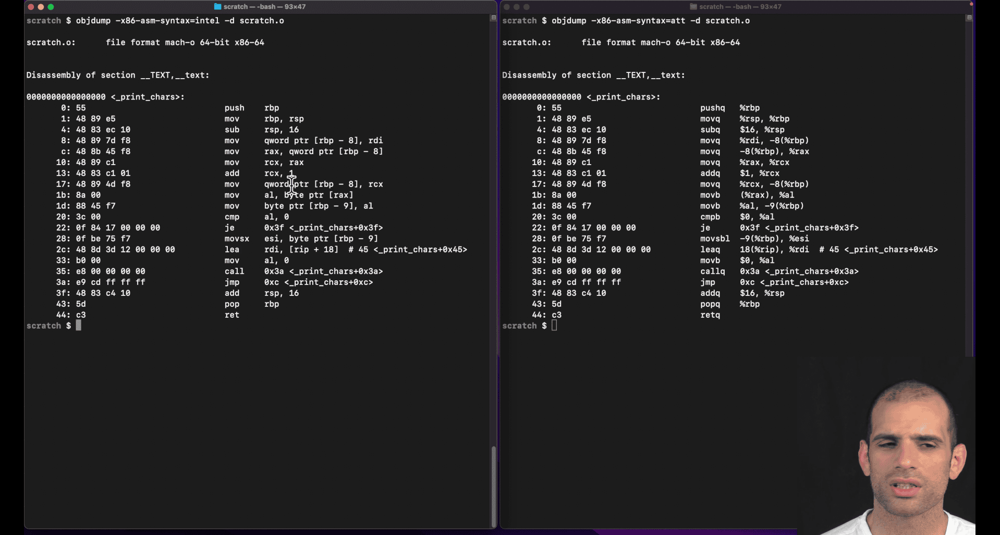

left intel, right : att(unix)

att show more info, from right to left though

att: q->quartword

#### Intel vs AT&T Syntax Differences

**AT&T syntax** (used by GNU assembler `as`, `gcc`, `objdump`):

- **Operand order**: `source, destination` (opposite of Intel)
- **Register prefixes**: `%` before registers (`%rax`, `%rdi`)
- **Immediate prefixes**: `$` before constants (`$42`, `$0x100`)
- **Memory addressing**: `(%rax)` for dereference, `4(%rax)` for offset
- **Size suffixes**: `b` (byte), `w` (word), `l` (long/dword), `q` (quad/qword)

**Intel syntax** (used by NASM, MASM, Intel docs):

- **Operand order**: `destination, source` (more intuitive)
- **No prefixes**: `rax`, `rdi` (no `%`)
- **No immediate prefix**: `42`, `0x100` (no `$`)
- **Memory addressing**: `[rax]`, `[rax+4]`
- **No size suffixes**: size inferred from operands

#### AT&T Size Suffixes Explained

| Suffix | Size          | Example           | Intel Equivalent |
| ------ | ------------- | ----------------- | ---------------- |
| `b`    | 8-bit (byte)  | `movb %al, %bl`   | `mov bl, al`     |
| `w`    | 16-bit (word) | `movw %ax, %bx`   | `mov bx, ax`     |
| `l`    | 32-bit (long) | `movl %eax, %ebx` | `mov ebx, eax`   |
| `q`    | 64-bit (quad) | `movq %rax, %rbx` | `mov rbx, rax`   |

#### Examples

**AT&T**:

```asm
movq $42, %rax        # Move immediate 42 to rax
movl %eax, (%rbx)     # Move eax to memory at rbx
addq $8, %rsp         # Add 8 to rsp
subq %rdx, %rcx       # Subtract rdx from rcx
```

**Intel**:

```asm
mov rax, 42           # Move immediate 42 to rax
mov [rbx], eax        # Move eax to memory at rbx
add rsp, 8            # Add 8 to rsp
sub rcx, rdx          # Subtract rdx from rcx
```

#### Why AT&T Uses Suffixes

- **Explicit sizing**: Makes instruction size clear in source code
- **Historical**: AT&T syntax predates modern assemblers that infer sizes
- **Consistency**: Same suffix system across all instruction types

#### Tools and Syntax

- **GNU tools** (`gcc`, `objdump`, `gdb`): Default to AT&T
- **NASM**: Intel syntax
- **GAS**: Can use `.intel_syntax` directive for Intel syntax
- **LLDB/GDB**: Can switch between syntaxes with `set disassembly-flavor intel`

Most Linux/Unix development uses AT&T syntax, while Windows development typically uses Intel syntax.

---

## What are the general purpose registers in x8664

- [777-gdb-gef](20250919-777-gdb-gef.md)

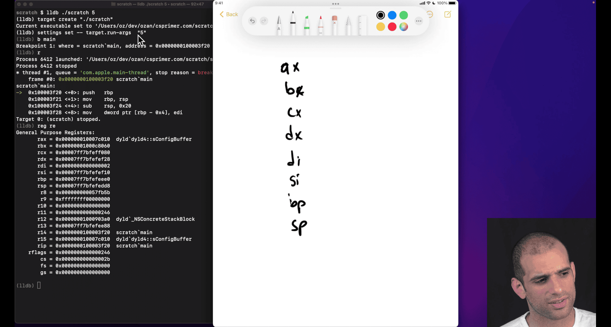

ax, bx , cx ,dx,di,si (legacy register)
ah -> half (less common)
al -> last (less common)
di , si -> , destination, source
bp, sp -> base pointer, stack pointer

bp-> top of the last stack frame (**compiler don't always update this value though**)

ip -> instruction pointer (store currently executing instruction)

flags -> result of previous executing instruction, (overflow , last comparison situation etc)

inter doing 'extend' version register

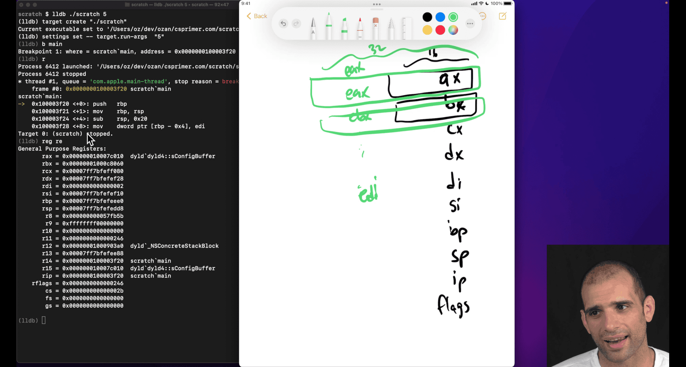

smaller register will overflow (like adding ax to bx) even in larger physical register , just like making smaller btyes version
why still here:

1. smaller size
2. compatible

rax -> more extend from 32bits to 64 bits from eax

some case that doing 32bits register `+-+*/` in 64 bits, higher bits will zero out, but 16 bits won't WTF

cpu not able to do some out of order executions because it don't know whether the extra bits need or not, zero out?

- `reg read --all` in lldb

- calling convention -> e.g unix , need to put return into rax

---

## What is the fetch‑decode‑execute cycle?

### Fetch-Decode-Execute Cycle

The **Fetch-Decode-Execute cycle** is the fundamental process that CPUs use to execute machine instructions. It's a continuous loop that processes instructions one at a time.

### **The Three Stages**

#### **1. Fetch (IF - Instruction Fetch)**

- CPU reads the next instruction from memory
- Uses the **Instruction Pointer (`%rip`)** to know where to fetch from
- Loads instruction into the **Instruction Register (IR)**
- Increments `%rip` to point to next instruction

#### **2. Decode (ID - Instruction Decode)**

- CPU analyzes the fetched instruction
- Determines:
  - What operation to perform (opcode)
  - Which registers to use (operands)
  - What addressing mode to use
  - How many bytes the instruction occupies
- Sets up control signals for execution

#### **3. Execute (EX - Execute)**

- CPU performs the actual operation
- Examples:
  - Arithmetic/logic operations
  - Memory read/write
  - Register transfers
  - Control flow changes (jumps, calls)

### **Visual Representation**

```
┌─────────┐    ┌─────────┐    ┌─────────┐
│  FETCH  │───▶│ DECODE  │───▶│ EXECUTE │
│         │    │         │    │         │
│ Read    │    │ Analyze │    │ Perform │
│ from    │    │ opcode  │    │ operation│
│ %rip    │    │ & ops   │    │         │
└─────────┘    └─────────┘    └─────────┘
     ▲                              │
     └──────────────────────────────┘
```

### **Detailed Example**

Let's trace through: `mov %rax, %rbx`

#### **Fetch Stage:**

```
1. CPU reads instruction at address in %rip
2. Loads "mov %rax, %rbx" into Instruction Register
3. Increments %rip to next instruction
```

#### **Decode Stage:**

```
1. CPU recognizes "mov" opcode
2. Identifies source: %rax register
3. Identifies destination: %rbx register
4. Determines this is a register-to-register move
5. Sets up internal control signals
```

#### **Execute Stage:**

```
1. CPU reads value from %rax
2. Writes that value to %rbx
3. Instruction complete, ready for next cycle
```

### **Modern CPU Enhancements**

#### **Pipelining**

Modern CPUs overlap these stages:

```
Cycle 1: [FETCH] [     ] [     ]
Cycle 2: [DECODE] [FETCH] [     ]
Cycle 3: [EXECUTE] [DECODE] [FETCH]
Cycle 4: [     ] [EXECUTE] [DECODE]
Cycle 5: [     ] [     ] [EXECUTE]
```

#### **Superscalar Execution**

- Multiple execution units work in parallel
- Can execute multiple instructions simultaneously
- Still follows fetch-decode-execute, but with parallelism

#### **Out-of-Order Execution**

- Instructions can execute out of program order
- CPU reorders instructions for better performance
- Maintains program correctness through dependency tracking

### **Special Cases**

#### **Control Flow Instructions**

```asm
jmp label    # Changes %rip directly
call func    # Saves return address, then jumps
ret          # Restores %rip from stack
```

#### **Memory Access**

```asm
mov (%rax), %rbx    # Fetch: instruction
                   # Decode: memory read operation
                   # Execute: read from memory, write to %rbx
```

### **Performance Implications**

#### **Fetch Bottlenecks:**

- Cache misses slow down fetch
- Branch mispredictions waste fetch cycles

#### **Decode Bottlenecks:**

- Complex instruction formats take longer to decode
- Variable-length instructions (x86) complicate decoding

#### **Execute Bottlenecks:**

- Memory access latency
- Complex arithmetic operations
- Resource conflicts

### **In Assembly Programming**

Understanding the cycle helps with:

#### **Optimization:**

```asm
## Good: Simple instructions decode faster
mov %rax, %rbx    # Fast decode/execute

## Slower: Complex addressing modes
mov 8(%rax,%rcx,4), %rbx    # More complex decode
```

#### **Debugging:**

- `%rip` shows where CPU is fetching next
- Understanding why certain instructions are slower
- Recognizing pipeline stalls

### **Quick Summary**

1. **Fetch**: Read instruction from `%rip`
2. **Decode**: Figure out what to do
3. **Execute**: Do the operation
4. **Repeat**: Move to next instruction

This cycle runs billions of times per second in modern CPUs, with sophisticated optimizations to make it as fast as possible!


extra function like jump , function call , -> advance movement
then need to analysis what is the next move gonna do


store the next move in ip/pc -> , instruction pointer ~= Pointer counter

- store the address , next thing to fetch , encode and execute

iterating -> nature of the machine, e.g. cpu clocks

```c
#include <stdio.h>
#include <stdlib.h>
int square(int n) { return n * n; }

int main(int argc, char **argv) {
  int n = atoi(argv[1]);
  printf("%d x %d = %d\n", n, n, square(n));
}
```

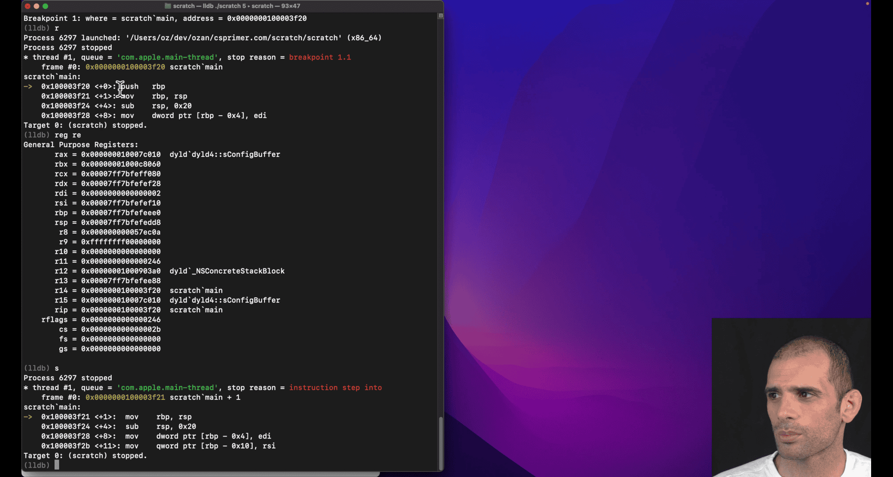

` 0x555555555158 <+0>: pushq  %rbp
    0x555555555159 <+1>:`

it only take 1 byte to pushq rbp in x86

`s` + `reg re rip`

`rip = 0x0000555555555159  scratch main + 1`

```
 0x555555555159 <+1>:  movq   %rsp, %rbp
    0x55555555515c <+4>:  subq   $0x20, %rsp

```

movq -> three bytes from +1 to +4

**imagine** movq is fetch
1 step

```
       rip = 0x000055555555515c  scratch`main + 4
       rbp = 0x00007fffffffcac0
       rsp = 0x00007fffffffcac0

```

0x55555555515c <+4>: subq $0x20, %rsp

rsp = 0x00007fffffffcaa0

from ac0 to aa0

rip = 0x0000555555555160 scratch`main + 8 (indicate subq = 4 bytes)

---

## The System V AMD64 calling convention

### What is a Calling Convention?

A **calling convention** is a standardized set of rules that defines:

- How function arguments are passed
- Which registers are preserved across function calls
- How return values are handled
- How the stack is managed
- Who (caller or callee) is responsible for cleanup

**Why needed?** Without conventions, different functions couldn't call each other reliably. It's like agreeing on a common "language" for function communication.

---

### **System V AMD64 Calling Convention** (Unix Family)

This is the standard calling convention for 64-bit Linux/Unix systems (also used by macOS).

- window use slightly different convention -> wiki x86 calling conventions

#### **Argument Passing**

| Position | Register | Purpose                                   |
| -------- | -------- | ----------------------------------------- |
| 1st      | `%rdi`   | First integer/pointer argument            |
| 2nd      | `%rsi`   | Second integer/pointer argument           |
| 3rd      | `%rdx`   | Third integer/pointer argument            |
| 4th      | `%rcx`   | Fourth integer/pointer argument           |
| 5th      | `%r8`    | Fifth integer/pointer argument            |
| 6th      | `%r9`    | Sixth integer/pointer argument            |
| 7th+     | Stack    | Additional arguments pushed right-to-left |

#### **Return Values**

| Type            | Register | Description             |
| --------------- | -------- | ----------------------- |
| Integer/Pointer | `%rax`   | Return value            |
| Large structs   | `%rax`   | Pointer to return value |
| Floating point  | `%xmm0`  | Return value            |

#### **Register Preservation**

| Category         | Registers                                                            | Responsibility             |
| ---------------- | -------------------------------------------------------------------- | -------------------------- |
| **Caller-saved** | `%rax`, `%rcx`, `%rdx`, `%rsi`, `%rdi`, `%r8`, `%r9`, `%r10`, `%r11` | Caller must save if needed |
| **Callee-saved** | `%rbx`, `%rbp`, `%r12`, `%r13`, `%r14`, `%r15`                       | Callee must preserve       |

- this is kind of important
- function caller , function callee

┌─────────────────┐
│ callee_function │ ← Currently executing (CALLEE)
├─────────────────┤
│ caller_function │ ← Waiting for callee to return (CALLER)
├─────────────────┤
│ main │ ← Waiting for caller to return

---

### **Examples**

#### **C Function Call:**

```c
int add(int a, int b, int c, int d, int e, int f, int g) {
    return a + b + c + d + e + f + g;
}
```

#### **Assembly Implementation:**

```asm
## Arguments passed in:
## %rdi = a, %rsi = b, %rdx = c, %rcx = d
## %r8 = e, %r9 = f, stack = g

add:
    # Save callee-saved registers if needed
    push %rbx
    push %rbp

    # Get 7th argument from stack
    mov 24(%rsp), %rax    # Skip saved %rbp, %rbx, return addr

    # Add all arguments
    add %rsi, %rdi        # a + b
    add %rdx, %rdi        # + c
    add %rcx, %rdi        # + d
    add %r8, %rdi         # + e
    add %r9, %rdi         # + f
    add %rax, %rdi        # + g

    # Return value in %rax
    mov %rdi, %rax

    # Restore callee-saved registers
    pop %rbp
    pop %rbx
    ret
```

#### **Calling the Function:**

```asm
## Prepare arguments
mov $1, %rdi      # 1st arg
mov $2, %rsi      # 2nd arg
mov $3, %rdx      # 3rd arg
mov $4, %rcx      # 4th arg
mov $5, %r8       # 5th arg
mov $6, %r9       # 6th arg
push $7           # 7th arg on stack

call add          # Call function
add $8, %rsp      # Clean up stack (remove pushed arg)
## Result in %rax
```

---

### **Stack Management**

#### **Stack Layout During Function Call:**

```
High Memory
    ↓
┌─────────────┐
│   Arg 7     │ ← %rsp + 24 (after call)
├─────────────┤
│ Return Addr │ ← %rsp + 16 (pushed by call)
├─────────────┤
│ Saved %rbp  │ ← %rsp + 8
├─────────────┤
│ Saved %rbx  │ ← %rsp (current)
└─────────────┘
Low Memory
```

#### **Red Zone**

- 128 bytes below `%rsp` are reserved
- Functions can use this space without adjusting `%rsp`
- Useful for leaf functions (functions that don't call others)

---

### **Floating Point Arguments**

| Position | Register | Purpose                        |
| -------- | -------- | ------------------------------ |
| 1st      | `%xmm0`  | First floating point argument  |
| 2nd      | `%xmm1`  | Second floating point argument |
| 3rd      | `%xmm2`  | Third floating point argument  |
| 4th      | `%xmm3`  | Fourth floating point argument |
| 5th+     | Stack    | Additional FP arguments        |

---

### **Common Patterns**

#### **Function Prologue:**

```asm
my_function:
    push %rbp           # Save caller's base pointer
    mov %rsp, %rbp      # Set new base pointer
    sub $16, %rsp       # Allocate local variables
    # Function body...
```

#### **Function Epilogue:**

```asm
    mov %rbp, %rsp      # Restore stack pointer
    pop %rbp            # Restore base pointer
    ret                 # Return to caller
```

#### **System Calls (Linux):**

```asm
mov $1, %rax            # sys_write
mov $1, %rdi            # file descriptor
mov $message, %rsi      # buffer
mov $13, %rdx           # length
syscall                 # Make system call
```

---

### **Key Points**

1. **First 6 integer args**: `%rdi`, `%rsi`, `%rdx`, `%rcx`, `%r8`, `%r9`
2. **Return value**: `%rax`
3. **Caller-saved**: Use freely, but save if needed after call
4. **Callee-saved**: Must preserve if used
5. **Stack alignment**: Keep stack 16-byte aligned
6. **Red zone**: 128 bytes below `%rsp` are safe to use

This convention ensures that C functions, assembly functions, and system calls can all work together seamlessly!

---

| Category         | Registers                                                            | Responsibility                 |
| ---------------- | -------------------------------------------------------------------- | ------------------------------ |
| **Caller-saved** | `%rax`, `%rcx`, `%rdx`, `%rsi`, `%rdi`, `%r8`, `%r9`, `%r10`, `%r11` | **Caller must save if needed** |
| **Callee-saved** | `%rbx`, `%rbp`, `%r12`, `%r13`, `%r14`, `%r15`                       | **Callee must preserve**       |

- this is kind of important
- function caller , function callee

### What Your Teacher Means

Your teacher is explaining the **callee-saved register preservation rule**. When a function (callee) wants to use a callee-saved register, it must:

1. **Save the original value** (push to stack)
2. **Use the register** for its own purposes
3. **Restore the original value** (pop from stack) before returning

This ensures the caller gets back the same register values it had before the call.

---

## **The Rule in Action**

### **❌ Wrong Way (Breaks the Convention):**

```asm
callee_function:
    mov $500, %rbx        # Using callee-saved register
    # ... do work with %rbx ...
    ret                   # Returns without restoring %rbx!
```

**Problem**: Caller's `%rbx` value is lost forever!

### **✅ Correct Way (Follows Convention):**

```asm
callee_function:
    push %rbx             # Save caller's %rbx value
    mov $500, %rbx        # Use %rbx for our purposes
    # ... do work with %rbx ...
    pop %rbx              # Restore caller's %rbx value
    ret                   # Now caller gets original %rbx back
```

---

## **When You Need to Do This**

### **Situation 1: You Need Extra Registers**

```asm
my_function:
    # You need more registers than caller-saved ones provide
    push %rbx             # Save callee-saved register
    push %r12             # Save another callee-saved register

    mov $100, %rbx        # Use %rbx
    mov $200, %r12        # Use %r12
    # ... complex calculations ...

    pop %r12              # Restore in reverse order
    pop %rbx
    ret
```

### **Situation 2: Long Function with Many Operations**

```asm
complex_calculation:
    push %rbx             # Save before using
    push %r12
    push %r13

    # Phase 1: Use %rbx
    mov %rdi, %rbx
    add $10, %rbx

    # Phase 2: Use %r12
    mov %rsi, %r12
    mul %r12

    # Phase 3: Use %r13
    mov %rdx, %r13
    add %r13, %rax

    # Restore all registers
    pop %r13
    pop %r12
    pop %rbx
    ret
```

### **Situation 3: Function Calls Other Functions**

```asm
wrapper_function:
    push %rbx             # Save before calling other functions

    mov $100, %rbx        # Use %rbx
    call some_function    # This might use %rbx too!
    add %rbx, %rax        # Still need %rbx after call

    pop %rbx              # Restore before returning
    ret
```

---

## **Stack Layout During Preservation**

```
Before push %rbx:
┌─────────────┐
│ Return Addr │ ← %rsp
└─────────────┘

After push %rbx:
┌─────────────┐
│ Saved %rbx  │ ← %rsp (new top)
├─────────────┤
│ Return Addr │
└─────────────┘

After push %r12:
┌─────────────┐
│ Saved %r12  │ ← %rsp (new top)
├─────────────┤
│ Saved %rbx  │
├─────────────┤
│ Return Addr │
└─────────────┘
```

---

## **Complete Example**

```asm
# Caller function
caller:
    mov $100, %rbx        # Caller sets %rbx = 100
    mov $200, %r12        # Caller sets %r12 = 200

    call callee           # Call callee function

    # After call, %rbx and %r12 should still be 100 and 200
    add %rbx, %rax        # Should add 100
    ret

# Callee function
callee:
    # Save callee-saved registers we want to use
    push %rbx             # Save caller's %rbx
    push %r12             # Save caller's %r12

    # Now we can use them freely
    mov $500, %rbx        # Use %rbx for our work
    mov $600, %r12        # Use %r12 for our work
    add %rbx, %r12        # %r12 = 500 + 600 = 1100

    mov %r12, %rax        # Return 1100

    # Restore original values before returning
    pop %r12              # Restore caller's %r12 = 200
    pop %rbx              # Restore caller's %rbx = 100
    ret
```

---

## **Key Points**

1. **Push before use**: Save callee-saved registers before modifying them
2. **Pop before return**: Restore them before returning
3. **Reverse order**: Pop in reverse order of push (LIFO - Last In, First Out)
4. **Only if needed**: Only save registers you actually use
5. **Caller-saved are free**: You can use caller-saved registers without saving

### **Memory Trick:**

- **Push** = "Put away for safekeeping"
- **Pop** = "Get back what you put away"
- **Order**: Like stacking plates - last plate on top comes off first

This ensures that function calls are "transparent" - the caller doesn't know or care what registers the callee used internally!

---

## Computer Architecture Terms Explained

## **Computer Architecture**

**Computer Architecture** is the **high-level design** of a computer system. It defines:

- What operations the computer can perform
- How programs interact with the hardware
- The interface between software and hardware
- The overall system organization

**Think of it as**: The "blueprint" or "specification" of how a computer should work.

---

## **Instruction Set Architecture (ISA)**

**ISA** is the **interface** between software and hardware. It defines:

- **What instructions** the processor can execute
- **How instructions are encoded** (binary format)
- **What registers** are available
- **How memory is addressed**
- **What data types** are supported
- **How exceptions/interrupts** are handled

### **ISA Examples:**

- **x86-64**: Intel/AMD 64-bit processors
- **ARM**: ARM processors (phones, tablets, some servers)
- **RISC-V**: Open-source instruction set
- **MIPS**: Educational/embedded processors

### **ISA Components:**

```asm
# x86-64 ISA examples
mov %rax, %rbx        # Move instruction
add %rax, %rbx        # Add instruction
jmp label             # Jump instruction
call function         # Call instruction
syscall               # System call instruction
```

---

## **Microarchitecture**

**Microarchitecture** is the **low-level implementation** of an ISA. It defines:

- **How instructions are executed** internally
- **What execution units** exist (ALU, FPU, etc.)
- **How the pipeline** works
- **Cache organization**
- **Branch prediction** mechanisms
- **Out-of-order execution** details

**Think of it as**: The "engineering details" of how the ISA is actually built.

---

## **Relationship Between Them**

```
Software Program
       ↓
   ISA Interface    ← What the program sees
       ↓
Microarchitecture   ← How it's actually implemented
       ↓
   Hardware
```

### **Analogy: Car Design**

- **Architecture**: "This car should have 4 wheels, an engine, and seats"
- **ISA**: "The steering wheel turns left/right, gas pedal accelerates, brake pedal stops"
- **Microarchitecture**: "The engine uses V8 configuration, fuel injection system, automatic transmission with 6 gears"

---

## **Examples**

### **Same ISA, Different Microarchitectures:**

**x86-64 ISA** can be implemented by different microarchitectures:

| Processor     | Microarchitecture   | Features                                |
| ------------- | ------------------- | --------------------------------------- |
| Intel Core i7 | Skylake/Coffee Lake | 4-8 cores, AVX-512, branch prediction   |
| AMD Ryzen     | Zen/Zen2/Zen3       | Different cache design, execution units |
| Intel Atom    | Silvermont          | Low-power, simpler pipeline             |

**All run the same x86-64 programs**, but with different performance characteristics.

### **Different ISAs, Similar Goals:**

| ISA    | Microarchitecture | Use Case         |
| ------ | ----------------- | ---------------- |
| ARM    | Cortex-A78        | Mobile phones    |
| x86-64 | Intel Core        | Desktop/laptop   |
| RISC-V | SiFive U74        | Embedded systems |

---

## **Levels of Abstraction**

```
High Level
    ↓
┌─────────────────┐
│   Application   │ ← Your C/Python program
├─────────────────┤
│   Operating     │ ← Linux/Windows
│   System        │
├─────────────────┤
│   ISA           │ ← x86-64 instructions
├─────────────────┤
│ Microarchitecture│ ← How x86-64 is implemented
├─────────────────┤
│   Hardware      │ ← Actual transistors
└─────────────────┘
Low Level
```

---

## **Why This Matters for Assembly**

### **ISA Level (What You Write):**

```asm
mov %rax, %rbx        # This is ISA - same on all x86-64
add %rax, %rbx        # This is ISA - same on all x86-64
```

### **Microarchitecture Level (What Happens Inside):**

- **Intel processor**: Might execute this in 1 cycle with 3 execution units
- **AMD processor**: Might execute this in 1 cycle with 2 execution units
- **Different cache behavior**: Intel might have better branch prediction
- **Different power consumption**: AMD might be more power-efficient

---

## **Key Takeaways**

1. **ISA**: The "contract" between software and hardware
2. **Microarchitecture**: The "implementation" of that contract
3. **Same ISA**: Programs run on different processors
4. **Different Microarchitecture**: Different performance, power, features
5. **Assembly programming**: You work at the ISA level
6. **Performance optimization**: Understanding microarchitecture helps

### **For Assembly Learning:**

- Focus on **ISA** (instruction set) - this is what you write
- Understand **microarchitecture** concepts (pipeline, cache) for optimization
- Know that your assembly code will run on any x86-64 processor, but performance varies

**Think of ISA as the "language" and microarchitecture as the "accent" - same language, different ways of speaking it!**

---

## Sum to N

```
; Slower way:
mov eax, 0      ; Load immediate value 0 into eax

; Faster way:
xor eax, eax    ; eax = eax ⊕ eax = 0anguage
```

### XOR Bit-Level Visual Examples

#### XOR Truth Table

```
A | B | A ⊕ B
--|---|------
0 | 0 |   0
0 | 1 |   1
1 | 0 |   1
1 | 1 |   0
```

**Key Rule**: XOR returns 1 only when the inputs are **different**

```
Before XOR:
eax = 10110101
eax = 10110101
     --------
XOR = 00000000  ← Always 0 when both operands are identical!
```

```asm
section .text
global sum_to_n
sum_to_n:
; accumlator , zero eax (return vale) "total"
; loop:
; ; add edi into eax, primer trying to use n-1 ,n-2 so that he can use rdi
; eventual will get to 0
; jump to loop if edi eq -1
; mov rax,0 ; if we use other reg, then we gonna copy that in the end, so just directly using rax
; faster to just xor to zero out than move rax,0
  xor eax,eax
  mov ecx,-1 ;;make this as cmp vaule
_loop:
  add eax,edi ; intel way
  sub edi,1
  cmp edi,ecx
  jne _loop
  ; sub 1 from edi
  ; comparing edi to -1 (break point?)
; jump to loop if edi != -1

	ret


```

stage 1 this work

Your teacher is explaining a **fundamental connection** between arithmetic operations and conditional logic in assembly! Let me break down what they mean:

### The Key Insight: SUB Modifies Flags for Jumps

Your teacher is pointing out that `sub` doesn't just perform subtraction - it also **updates CPU flags** that conditional jump instructions examine to make decisions.

### CPU Flags That SUB Modifies

When you execute `sub eax, ebx`, the CPU sets these flags based on the result:

```
Flags Modified by SUB:
┌─────────────────────────────────────┐
│ Zero Flag (ZF)     - Set if result = 0 │
│ Carry Flag (CF)    - Set if borrow occurred │
│ Sign Flag (SF)     - Set if result < 0 │
│ Overflow Flag (OF) - Set if signed overflow │
│ Parity Flag (PF)   - Set if even 1s │
│ Auxiliary Flag (AF)- Set if carry in low 4 bits │
└─────────────────────────────────────┘
```

### How Jumps Use These Flags

Conditional jumps examine these flags to decide whether to jump:

```assembly
; Example: Compare two numbers
mov eax, 10
mov ebx, 5
sub eax, ebx    ; eax = 5, flags updated based on (10-5=5)

; Now jumps can use the flags:
je  equal       ; Jump if ZF=1 (if eax was 0)
jne not_equal   ; Jump if ZF=0 (if eax was not 0)
jl  less        ; Jump if SF≠OF (if result was negative)
jg  greater     ; Jump if ZF=0 AND SF=OF (if result was positive)
```

### Visual Example: SUB as Comparison

```assembly
mov eax, 15
mov ebx, 10
sub eax, ebx    ; eax = 5, but flags are set based on comparison

; Flags after SUB:
; ZF = 0 (result not zero)
; SF = 0 (result positive)
; CF = 0 (no borrow)
; OF = 0 (no overflow)

; Now we can jump based on these flags:
je  equal       ; Won't jump (ZF=0)
jne not_equal   ; WILL jump (ZF=0)
jl  less        ; Won't jump (SF=OF=0)
jg  greater     ; WILL jump (ZF=0 and SF=OF=0)
```

### The Connection: CMP is Actually SUB!

Here's the **big revelation** your teacher is hinting at:

```assembly
; These two are essentially the same:
cmp eax, ebx    ; Compare eax with ebx
sub eax, ebx    ; Subtract ebx from eax

; The difference:
; CMP: Updates flags, doesn't store result
; SUB: Updates flags AND stores result in eax
```

### Practical Example

```assembly
mov eax, 20
mov ebx, 15

; Method 1: Using CMP (traditional)
cmp eax, ebx    ; Compare without changing eax
jg  greater     ; Jump if eax > ebx
; eax still contains 20

; Method 2: Using SUB (what your teacher is pointing out)
sub eax, ebx    ; eax = 5, flags set based on comparison
jg  greater     ; Jump if original eax > ebx
; eax now contains 5
```

### Why This Matters

Your teacher is teaching you that:

1. **Arithmetic operations affect program flow** - SUB doesn't just do math, it prepares flags for jumps
2. **CMP and SUB are related** - CMP is SUB without storing the result
3. **Flags are the bridge** between arithmetic and conditional logic
4. **You can use SUB for comparison** if you don't mind losing the original value

This is why understanding flags is crucial in assembly - they're the mechanism that connects arithmetic operations to conditional program flow!

---

### The Key Insight: SUB Sets Flags Automatically!

When `sub edi,1` executes, it **automatically sets CPU flags** based on the result:

```
After sub edi,1:
- If edi was 5 → edi becomes 4 → flags indicate "positive"
- If edi was 1 → edi becomes 0 → flags indicate "zero"
- If edi was 0 → edi becomes -1 → flags indicate "negative"
```

### How JG Uses These Flags

`jg` (Jump if Greater) examines the flags set by `sub`:

```assembly
sub edi,1    ; edi = edi - 1, flags updated
jg _loop     ; Jump if result > -1 (i.e., if edi >= 0)
```

### Step-by-Step Logic

Let's trace through what happens:

```
Initial: edi = 3
Loop 1:  sub edi,1 → edi = 2 → flags: positive → jg jumps → continue
Loop 2:  sub edi,1 → edi = 1 → flags: positive → jg jumps → continue
Loop 3:  sub edi,1 → edi = 0 → flags: zero → jg jumps → continue
Loop 4:  sub edi,1 → edi = -1 → flags: negative → jg doesn't jump → exit
```

- this is a do while loop

---

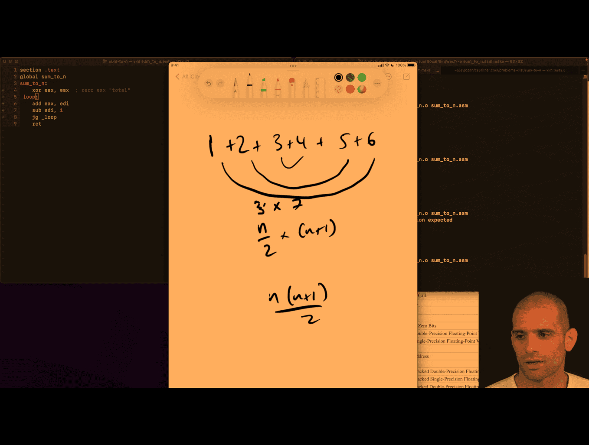
much easy to remember damn

middle -> n/2 -> 3 (i) -> (i) +(i+1) =>3+4 (just my thinking)

n(n+1)/2 (n = total number )

```language
  mov ecx,edi
  add edi,1 ;(n+1)
;  mol edi, ecx  this wont work these reg
  imul edi,ecx
  shr edi,1 ;;shift bit right , like /2
  mov eax,edi
	ret
---
  mov   ecx, edi     ; ecx = n
  inc   edi          ; edi = n + 1
  mov   eax, ecx     ; eax = n
  mul   edi          ; EDX:EAX = eax * edi = n * (n+1)

  ; Now divide by 2:
  ; If you know the product fits in 32 bits, and you only care about low 32 bits:
  shr   eax, 1       ; eax = (n*(n+1)) / 2

```

can't use mul in here, use imul

```asm

  mov eax,edi
  inc edi
  imul eax,edi
  shr eax,1
	ret
```

lldb debuging is easier in this case

b main,
s in, check reg

- interesting diff btw clang and gcc
  gcc here in terms of assembly of code
- **clang win** because it turns while loop case into constant case, the formula, **damn**

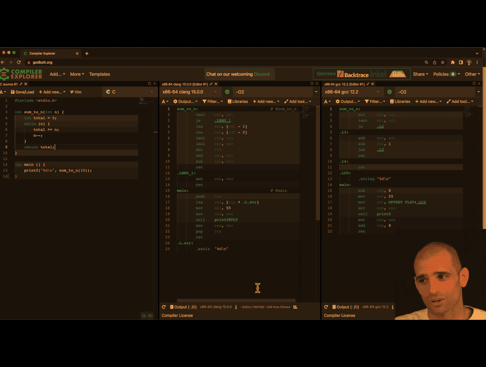

## matrix-access

#### Explain the picture

Your teacher is showing two equivalent ways to compute the memory address of an element in a row‑major `int` matrix:

- Top line (byte arithmetic):
  - matrix + rindex _ (cols _ 4) + cindex \* 4
  - Meaning: start at base address `matrix`, skip `rindex` full rows (each row has `cols` ints, each int is 4 bytes), then move `cindex` more ints (4 bytes each).

- Bottom line (factored):
  - matrix + 4 _ (rindex _ cols + cindex)
  - Same thing, just factoring out the 4. The term in parentheses is the element offset; multiplying by 4 converts elements → bytes.

Key points:

- 4 is `sizeof(int)` on your platform. More generally: matrix + sizeof(T) _ (rindex _ cols + cindex).
- If you do pointer arithmetic on an `int*`, you normally write `(int*)matrix + (rindex * cols + cindex)` because `+ 1` already advances by 4 bytes for `int`.
- The inner offset `rindex * cols + cindex` is the standard row‑major index.

---

```asm
section .text
global index
index:
; extern int index(int *matrix, int rows, int cols, int rindex, int cindex);
	; rdi: matrix
	; esi: rows
	; edx: cols
	; ecx: rindex
	; r8d: cindex
  imul ecx, edx
  add ecx,r8d
  imul ecx, 4
  add rcx, rdi
  mov eax,[rcx] ; this deference
	ret

```

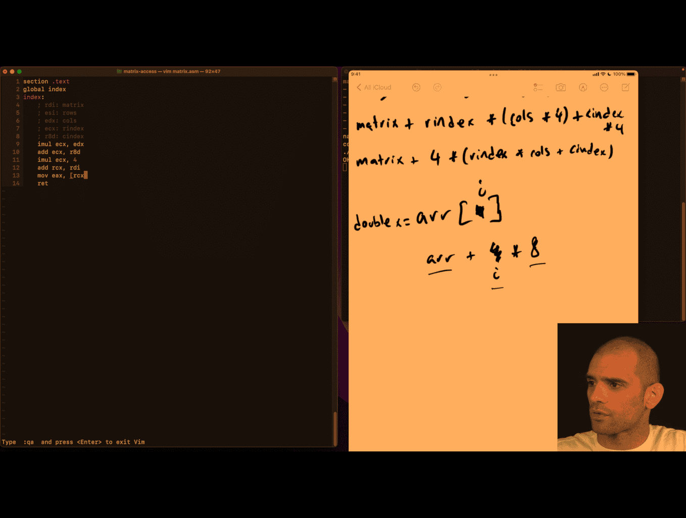

```asm
section .text
global index
index:
; extern int index(int *matrix, int rows, int cols, int rindex, int cindex);
	; rdi: matrix
	; esi: rows
	; edx: cols
	; ecx: rindex
	; r8d: cindex
  imul ecx, edx
  add ecx,r8d
  mov eax,[rdi + 4 * rcx]
	ret

```

just deference inside pointer, damn

---

## x8664 pangram

#### What that line does

- The expression `c & 0x1f` keeps only the low 5 bits of `c` (values 0–31).
- For ASCII letters this maps both cases to 1–26:
  - 'A'(65) → 65 & 31 = 1 … 'Z'(90) → 26
  - 'a'(97) → 97 & 31 = 1 … 'z'(122) → 26
- `1 << k` builds a mask with bit k set.
- `bs |= ...` sets that bit in `bs` and keeps previous bits set.

So each letter toggles its corresponding bit 1..26 in `bs`.

#### Bit visual

Assume a 32‑bit view (bit 31 on the left … bit 0 on the right). `MASK = 0x07fffffe` has bits 1..26 set:

```
0000 0111 1111 1111 1111 1111 1111 1110
                ^....................^
                bit26 ............. bit1
```

Start with `bs = 0`.

- Seeing 'C' (ASCII 67):
  - k = 67 & 31 = 3
  - mask = 1 << 3 = 0b...00001000
  - bs |= mask sets bit 3:

```
bs before: 0000 0000 0000 0000 0000 0000 0000 0000
mask     : 0000 0000 0000 0000 0000 0000 0000 1000
bs after : 0000 0000 0000 0000 0000 0000 0000 1000
```

- Seeing 'x' (ASCII 120):
  - k = 120 & 31 = 24
  - mask = 1 << 24 = 0b...0001 0000 0000 0000 0000 0000
  - bs after sets bit 24 as well:

```
bs before: 0000 0000 0000 0000 0000 0000 0000 1000
mask     : 0000 0001 0000 0000 0000 0000 0000 0000
bs after : 0000 0001 0000 0000 0000 0000 0000 1000
```

After processing the whole string, the pangram test

```
(bs & 0x07fffffe) == 0x07fffffe
```

checks that all bits 1..26 are set, meaning every letter A–Z/a–z appeared at least once.

Notes:

- The `if (c < '@') continue;` quickly skips many non-letters; letters below '@' don’t exist, and letters map to 1..26 anyway.
- Using `1u << ...` is slightly safer (unsigned shift), but with shifts up to 26 a plain `1` is fine on typical 32‑bit ints.

---

## x64 pangram

```c
#define MASK 0x07fffffe

bool ispangram(char *s) {
  uint32_t bs = 0;
  char c;
  while ((c = *s++) != '\0') {
    if (c < '@')
      continue; // ignore first 64 chars in ascii table
    bs |= 1 << (c & 0x1f);
  }
  return (bs & MASK) == MASK;
}
```

```asm
%define MASK 0x07fffffe
section .text
global pangram
pangram:
	; rdi: source string
  xor ecx,ecx ; bs = 0
.loop:
  movzx edx, byte [rdi] ; c=*s will be edx, read from rdi, zero out extend
  cmp edx,0
  je .end
  add rdi,1 ; s++
  cmp edx,'@' ; if c is in first 64 chars of ascii table
  jl .loop ; continue
  and edx,0x1f
  bts ecx, edx ;bitset set ecx to how many bits of edx
  jmp .loop
.end:
  xor eax,eax
  and ecx,MASK ; last return part
  cmp ecx,MASK
  sete al ; set equal
  ; todo sometime return 1!
	ret
```

---

## binary-converter asm

```c
#include <assert.h>
#include <stdio.h>

extern int binary_convert(char *bits);

int main(void) {
  assert(binary_convert("0") == 0);
  assert(binary_convert("1") == 1);
  assert(binary_convert("110") == 6);
  assert(binary_convert("1111") == 15);
  assert(binary_convert("10101101") == 173);
  printf("OK\n");
}
```

```asm
section .text
global binary_convert
binary_convert:
  xor eax,eax
.loop:
  movzx ecx,byte[rdi]
  cmp ecx,0
  je .end
  shl eax,1
  and ecx, 1 ; TODO this assumes that , ecx is surly '0' o  '1'
  add eax,ecx
  add rdi,1
  jmp .loop
.end:
	ret

```

### x86-64 Assembly Logic: binary_convert

This explains what your teacher is teaching in the provided routine: converting a binary string like "10101101" into an integer using shifts and adds.

### High-level algorithm (language-agnostic)

Given a string of bits b0 b1 ... bn-1 (each '0' or '1'), compute the integer value:

- Start with result = 0
- For each character c in the string:
  - result = result << 1 // multiply by 2
  - result = result + bit(c) // add 0 or 1
- Return result

This is exactly how we interpret binary: left shift accumulates previous bits, then we add the new least-significant bit.

### System V AMD64 calling convention refresher

- First argument (char\* s) is in `rdi`
- Return value is in `rax`
- `eax` is the low 32 bits of `rax`
- Clobbering caller-saved registers like `rax`, `rcx`, `rdi` is allowed in leaf functions unless the ABI requires otherwise for the caller

### The code

```startLine:endLine:/home/peter/Desktop/cursor_project/binary_convert.s
section .text
global binary_convert
binary_convert:
  xor eax,eax
.loop:
  movzx ecx,byte[rdi]
  cmp ecx,0
  je .end
  shl eax,1
  and ecx, 1 ; TODO this assumes that , ecx is surly '0' o  '1'
  add eax,ecx
  add rdi,1
  jmp .loop
.end:
	ret
```

### Line-by-line explanation

- `xor eax, eax`
  - Sets `eax = 0` (the current accumulated integer). `xor reg,reg` is a common zeroing idiom.
- `.loop:` label
- `movzx ecx, byte [rdi]`
  - Load the next byte from the string pointer `rdi` into `ecx` and zero-extend it. After this, `ecx` holds the ASCII code of the current character.
- `cmp ecx, 0` then `je .end`
  - Checks for the string terminator `\0`. If end of string, jump to return.
- `shl eax, 1`
  - Multiply current result by 2 (shift left by 1). This is how we make room for the next bit.
- `and ecx, 1`
  - Mask the low bit of the ASCII code. This is a clever fast-path that works because ASCII '0' (0x30 = 48) is even (low bit 0) and '1' (0x31 = 49) is odd (low bit 1). It is unsafe for other characters; it treats any odd ASCII as 1 and any even ASCII as 0.
- `add eax, ecx`
  - Add that bit (0 or 1) to the result.
- `add rdi, 1`
  - Advance the pointer to the next character.
- `jmp .loop`
  - Repeat.
- `.end: ret`
  - Return with the result in `eax`/`rax`.

### Worked trace: input "10101101"

We track only `eax` (result) and the current char.

Initial: `eax = 0`

1. c='1' (0x31 → low bit 1)

- shift: eax = 0 << 1 = 0
- add: eax = 0 + 1 = 1

2. c='0' (0x30 → low bit 0)

- shift: 1 << 1 = 2
- add: 2 + 0 = 2

3. c='1'

- shift: 2 << 1 = 4
- add: 4 + 1 = 5

4. c='0'

- shift: 5 << 1 = 10
- add: 10 + 0 = 10

5. c='1'

- shift: 10 << 1 = 20
- add: 20 + 1 = 21

6. c='1'

- shift: 21 << 1 = 42
- add: 42 + 1 = 43

7. c='0'

- shift: 43 << 1 = 86
- add: 86 + 0 = 86

8. c='1'

- shift: 86 << 1 = 172
- add: 172 + 1 = 173

End: '\0' → return 173. Matches your test.

### Visual bit growth (LSB on the right)

After each char: value in binary

- start: 00000000
- '1' → 00000001
- '0' → (<<1): 00000010
- '1' → 00000101
- '0' → 00001010
- '1' → 00010101
- '1' → 00101011
- '0' → 01010110
- '1' → 10101101 (173)

### What your teacher is emphasizing

- Binary parsing is just repeated: result = result \* 2 + next_bit
- Using `shl` to multiply by 2 and `and 1` to extract a bit
- Looping over a C string via pointer in `rdi` and checking for `\0`
- Returning via `eax` per ABI

### Pitfalls and correctness

- The `and ecx, 1` trick accepts any odd byte as bit 1 and any even byte as bit 0. That means characters like '3' (0x33) would be treated as 1, and '2' (0x32) as 0. If the input may contain non-'0'/'1', you should validate.

#### Safer variant (validate ASCII '0'/'1')

Conceptually:

- If c == '0' → bit = 0
- Else if c == '1' → bit = 1
- Else stop or error

One assembly approach (keeping branchless where possible):

- Subtract '0' to normalize: `ecx = c - '0'` → '0'→0, '1'→1, others outside 0..1
- Test range 0..1; if not in range, decide policy (stop or reject)

Sketch:

```startLine:endLine:/home/peter/Desktop/cursor_project/binary_convert_safe_idea.s
; ecx currently holds c (zero-extended)
sub ecx, '0'        ; '0'->0, '1'->1, others → not 0/1
cmp ecx, 1
ja .invalid         ; if ecx > 1, it's invalid char
; here ecx is 0 or 1, safe to use
shl eax, 1
add eax, ecx
; advance pointer and loop
```

Policy at `.invalid` could be to stop parsing (like `strtol`) or return an error code.

### Why 32-bit `eax` is fine

- Your test values fit in 32 bits, and zeroing `eax` implicitly zeros the full `rax`. If you want to allow inputs longer than 31 bits, you can perform the shift/add in `rax` with `shl rax,1` and `add rax,rcx` (ensure `rcx` is 0/1 and properly zero-extended).

### C equivalent for intuition

```startLine:endLine:/home/peter/Desktop/cursor_project/binary_convert_reference.c
##include <stdint.h>

int binary_convert(const char *s) {
    uint32_t x = 0;
    for (unsigned char c; (c = *s++) != '\0'; ) {
        x <<= 1;
        x += (c & 1); // same assumption as asm: even→0, odd→1
    }
    return (int)x;
}
```

### Takeaways

- Parsing binary is shift-left then add-bit
- `and 1` extracts the low bit fast, but assumes valid input
- Understanding the ABI and pointer walking is key to reading small assembly routines

---

1. **Pointer Dereferencing**:
   - The register `rdi` holds the memory address of the current character in the string.
   - `byte [rdi]` means: "Access the byte at the memory address stored in `rdi`."

2. **Zero-Extension**:
   - `movzx` stands for "move with zero-extension."
   - It loads the byte (8 bits) from `byte [rdi]` into the lower 8 bits of `ecx` and sets the upper 24 bits of `ecx` to 0. This ensures that `ecx` holds a 32-bit value with the loaded byte in the least significant byte (LSB).

#### **Memory Layout (String in Memory)**

Let’s say the string is `"10101101\0"` (null-terminated). The memory layout might look like this:

| Address (`rdi`) | Value (Byte) | ASCII Code |
| --------------- | ------------ | ---------- |
| `0x1000`        | `'1'`        | `0x31`     |
| `0x1001`        | `'0'`        | `0x30`     |
| `0x1002`        | `'1'`        | `0x31`     |
| `0x1003`        | `'0'`        | `0x30`     |
| `0x1004`        | `'1'`        | `0x31`     |
| `0x1005`        | `'1'`        | `0x31`     |
| `0x1006`        | `'0'`        | `0x30`     |
| `0x1007`        | `'1'`        | `0x31`     |
| `0x1008`        | `'\0'`       | `0x00`     |

---

#### **Execution Steps**

1.  **First Iteration**:
    - `rdi = 0x1000`
    - `movzx ecx, byte [rdi]` → Load `'1'` (ASCII `0x31`) into `ecx`.
    - `ecx = 0x00000031` (32-bit value with zero-extension).

2.  **Second Iteration**:
    - `add rdi, 1` → `rdi = 0x1001`
    - `movzx ecx, byte [rdi]` → Load `'0'` (ASCII `0x30`) into `ecx`.
    - `ecx = 0x00000030`.

3.  **Third Iteration**:
    - `add rdi, 1` → `rdi = 0x1002`
    - `movzx ecx, byte [rdi]` → Load `'1'` (ASCII `0x31`) into `ecx`.
    - `ecx = 0x00000031`.

4.  **Repeat Until Null Terminator**:
    - The loop continues until `cmp ecx, 0` detects the null terminator (`0x00`) at `rdi = 0x1008`.

---

## cone-volumn

`mulss` and `xmm0` are part of the x86 assembly language, specifically for the SSE (Streaming SIMD Extensions) instruction set.

- **`mulss`**: This instruction performs scalar single-precision floating-point multiplication. It multiplies the lower 32-bit floating-point value in the source operand (register or memory) with the lower 32-bit floating-point value in the destination operand (register) and stores the result in the destination operand. The higher bits of the destination register remain unchanged.

- **`xmm0`**: This is one of the 128-bit SSE registers. It is used to store floating-point values or SIMD data. In the context of `mulss`, only the lower 32 bits of `xmm0` are used for the operation.

In your code:

```asm
mulss xmm0, xmm0
```

This multiplies the lower 32-bit floating-point value in `xmm0` by itself (i.e., `xmm0 = xmm0 * xmm0`), effectively squaring the value.

1. **SSE Registers (`xmm0`–`xmm15`)**:
   - These are 128-bit registers introduced with the SSE (Streaming SIMD Extensions) instruction set.
   - They can handle scalar (single value) or SIMD (multiple values) floating-point operations.
   - Instructions like `mulss` (scalar single-precision) and `mulps` (packed single-precision) use these registers.

2. **x87 FPU Stack Registers (`st(0)`–`st(7)`)**:
   - These are part of the older x87 floating-point unit, which uses a stack-based architecture.
   - Instructions like `fmul` operate on these registers.
   - They support extended precision (80-bit floating-point numbers).

### Modern Usage

- SSE/AVX registers (`xmm`, `ymm`, `zmm`) are preferred in modern code because they are faster and support SIMD operations.
- The x87 FPU is mostly used for legacy code or when extended precision is required.

In your code, `xmm0` is used because it is part of the SSE register set, which is optimized for single-precision floating-point operations.

##### `mulss` Example:

```asm
movss xmm0, [a]      ; Load scalar value from memory into xmm0
movss xmm1, [b]      ; Load scalar value from memory into xmm1
mulss xmm0, xmm1     ; xmm0 = xmm0 * xmm1 (only lower 32 bits are multiplied)
```

Here, only the lower 32 bits of `xmm0` and `xmm1` are multiplied, and the result is stored in the lower 32 bits of `xmm0`.

##### `mulps` Example:

```asm
movaps xmm0, [vec1]  ; Load packed values (4 floats) from memory into xmm0
movaps xmm1, [vec2]  ; Load packed values (4 floats) from memory into xmm1
mulps xmm0, xmm1     ; xmm0 = xmm0 * xmm1 (element-wise multiplication of 4 floats)
```

Here, all four 32-bit floating-point values in `xmm0` and `xmm1` are multiplied in parallel, and the results are stored in `xmm0`.

#### Memory Layout Example:

Assume the memory contains:

```asm
vec1: dd 1.0, 2.0, 3.0, 4.0  ; Four floats
vec2: dd 5.0, 6.0, 7.0, 8.0  ; Four floats
```

After `mulps xmm0, xmm1`, the result in `xmm0` will be:

```
xmm0 = [1.0*5.0, 2.0*6.0, 3.0*7.0, 4.0*8.0]
     = [5.0, 12.0, 21.0, 32.0]
```

#### Summary

- Use `mulss` for single-value (scalar) floating-point multiplication.
- Use `mulps` for parallel (SIMD) multiplication of multiple floating-point values.

---

```c
#include <assert.h>
#include <math.h>
#include <stdio.h>

#define float_near(a, b) fabsf((a) - (b)) < 0.01

extern float volume(float radius, float height);

int main(void) {
  assert(float_near(0.0f, volume(0.0f, 0.0f)));
  assert(float_near(2.09f, volume(1.0f, 2.0f)));
  assert(float_near(174.23f, volume(5.5f, 5.5f)));
  assert(float_near(9.05f, volume(1.234f, 5.678f)));
  printf("OK\n");
}
```

```asm
default rel

section .text
global volume
volume:
  ;V = r *r *h *pi /3
  mulss xmm0,xmm0 ; v =r*r
  mulss xmm0,xmm1 ; V *= h
  mulss xmm0, [pi_on_3] ; V*= pi/3
 	ret

section .rodata ;constant data ? slight protection

;pi_on_3: dd 3.14 ; floating point 3.14
pi_on_3: dd 1.0471975512 ; floating point 3.14

```

---

## low level recursion

goal :
what is function call in the low level, what is stack for

In assembly language, `push` and `pop` are instructions for manipulating the stack:

- `push`: Puts a value onto the stack by:
  1. Decrementing the stack pointer (RSP)
  2. Storing the value at the new stack pointer location

- `pop`: Retrieves a value from the stack by:
  1. Loading the value at the current stack pointer location
  2. Incrementing the stack pointer

In this Fibonacci implementation, the stack is needed for two key reasons:

1. **Preserving values during function calls**
   When `fib` calls itself recursively, registers get overwritten. For example:
   - Line 12: `push rdi` saves `n-1` before the recursive call
   - Line 17: `push rax` saves the result of `fib(n-1)` before calculating `fib(n-2)`

2. **Managing recursive call state**
   Each recursive call needs its own context (parameters and return values)

Without the stack, the intermediate values would be lost when the function makes recursive calls, making it impossible to add `fib(n-1)` and `fib(n-2)` together at the end.

---

```asm
section .text
global fib
fib:
  ;general case:
  ;return fib(n-1)+fib(n-2)
  ;
  mov eax,edi ; edi -> n , eax -> return ; base case: if n <= 1, return n
  cmp edi,1
  jle .end

  sub edi, 1
  push rdi ; push n -1 the top the stack is n-1, as edi will ebe clobbered
  call fib ; f(n-1) need to use stack now, some value need to be modified by the callee
  pop rdi
  ; we get result in eax
  ;
  push rax ; push f(n-1) to stack,as eax will be clobbered
  sub edi,1
  call fib ; f(n-1)

  pop rcx; eax has value at the moment, pop previously computed f(n-1) from top of stack and ...
  add eax , ecx ; add it into newly computed f(n-2)

.end
	ret

```

- stack alignment requirements

Your teacher is referring to **stack alignment requirements** in the x64 calling convention (System V ABI on Linux).

**The key rule: The stack pointer (RSP) must be 16-byte aligned before each `call` instruction.**

Here's what's happening in your code:

1. **When your function starts**: RSP is misaligned (8 bytes off from 16-byte boundary) because the `call fib` instruction pushed an 8-byte return address

2. **Your pushes/pops**:
   - `push rdi` (line 12) - pushes 8 bytes
   - `push rax` (line 17) - pushes 8 bytes
   - Total: 16 bytes pushed, so RSP becomes 16-byte aligned again

3. **Before recursive calls**: The stack is properly aligned when you call `fib`

**Why alignment matters:**

- Modern processors and some instructions (especially SIMD) require 16-byte aligned memory access for optimal performance
- The ABI mandates it - violating alignment can cause crashes or performance penalties
- Some system functions expect proper alignment

**In your code:** You're accidentally getting correct alignment because you push exactly 16 bytes total (2 × 8-byte pushes). But this is fragile - if you added another push without a matching one, you'd break alignment.

**Proper practice:** Explicitly ensure RSP is 16-byte aligned before each `call`, often by adjusting RSP or using `sub rsp, 8` if needed.

---

### Why Use EBP as a Frame Pointer?

- It gives constant offsets for parameters and locals throughout the function.
- Debuggers and backtracers can easily walk frames using saved EBP.
- Modern compilers may omit frame pointers for optimization, but the conceptual model remains.

### Mapping to 64-bit System V (Linux/macOS)

Key differences vs 32-bit cdecl:

- First six integer/pointer parameters are in registers: `RDI`, `RSI`, `RDX`, `RCX`, `R8`, `R9` (remaining go on stack).
- Return value is in `RAX`.
- Callee-saved: `RBX`, `RBP`, `R12–R15`.
- **16-byte stack alignment requirement at each `call`.** On entry to a function (right after a `call`), `RSP % 16 == 8`. Before you execute another `call`, you must adjust the stack so `RSP % 16 == 0` (e.g., `push` once or `sub rsp, 8`).
- Leaf functions (no calls) may use the red zone (128 bytes below `RSP`) without adjusting `RSP`.

Minimal 64-bit prologue/epilogue pattern:

```startLine:endLine:/home/peter/Desktop/cursor_project/examples/prologue_sysv64.s
; Prologue
push rbp
mov  rbp, rsp
sub  rsp, N        ; allocate locals (choose N to keep alignment before calls)

; ... body ...

; Epilogue
mov  rsp, rbp
pop  rbp
ret
```

### Why Push/Pop and How the Stack Changes

x86-64 push/pop semantics (32-bit similar with 4-byte steps):

- `push rX` → `rsp = rsp - 8; [rsp] = rX`
- `pop rX` → `rX = [rsp]; rsp = rsp + 8`

LIFO discipline lets you save and restore temporary state (parameters, partial results, saved registers) and also helps meet alignment constraints before calls.

### Checklist: Writing Correct Calls

- Caller side:
  - Save caller-saved registers you need later.
  - Place arguments (stack or regs depending on ABI).
  - Ensure stack alignment before `call` (SysV64: `rsp % 16 == 0`).
  - Call target and then clean up arguments (cdecl) / not needed (SysV64’s callee cleans "home space" only on Windows x64, not SysV).

- Callee side:
  - Prologue: save `EBP/RBP`, set frame, allocate locals, save callee-saved you touch.
  - Body: do work, keep contract.
  - Epilogue: restore callee-saved, deallocate locals, restore frame, place return in `EAX/RAX`, `ret`.

### Key Takeaways

- The **stack** is the scratchpad for function calls: return addresses, parameters, locals, saved registers.
- **Calling conventions** are contracts that let separately compiled code interoperate.
- Visualizing offsets from `EBP/RBP` makes parameter/local access and frame layout clear.
- On 64-bit SysV, remember the **16-byte alignment** rule before each `call`.

---

## What is the fetch decode execute cycle

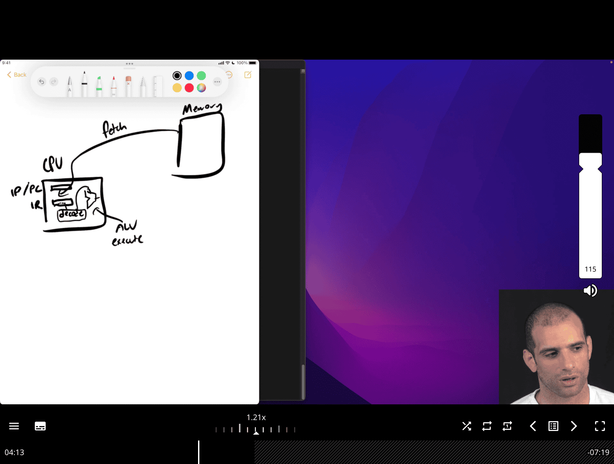

---

## Faster sum

- [google/benchmark: A microbenchmark support library](https://github.com/google/benchmark)
  perf as other tool as well
- [Linux perf Examples](https://www.brendangregg.com/perf.html)
  [yuninxia/hands-on-simd-programming: 🧩 Hands-on SIMD Programming with C++](https://github.com/yuninxia/hands-on-simd-programming/tree/main)

look deep what is going on , and how to beat O1 in gcc

concept:
use your pc architecture, e.g. skyleak intel, 8 thread
if able to use c to tell the compiler that the code are independent, then it can run faster

**SIMD (Single Instruction, Multiple Data)** code is programming that uses special processor instructions to perform the same operation on multiple data points simultaneously, significantly boosting performance for tasks like image and audio processing. You can write SIMD code directly using compiler intrinsics (e.g., Intel's SSE/AVX, ARM's NEON), or rely on libraries (like NumPy or Numba for Python, or high-level libraries like simdjson for JSON parsing) and compilers that automatically "vectorize" your code to leverage these instructions.

```c
/* int sum(int *nums, int n) { */
/*   int total = 0; */
/*   for (int i = 0; i < n; i++) */
/*     total += nums[i]; */
/*   return total; */
/* } */

int sum(int *nums, int n) {
  int t1 = 0, t2 = 0, t3 = 0, t4 = 0;
  for (int i = 0; i < n; i += 4) {

    t1 += nums[i];
    t2 += nums[i + 1];
    t3 += nums[i + 2];
    t4 += nums[i + 3];
  }
  return t1 + t2 + t3 + t4;
}
```

- **tested on clang , cc (gcc) -O 2 , with manual t1..t4 , gcc -O2 better than clang**
- however, og iterative movement, clang -O2 is the best of the best in the case, damn

I test it with t8 in gcc -O2 , close to clang -O2 non optimize, so clang i guess is also using similar approach

[yuninxia/hands-on-simd-programming: 🧩 Hands-on SIMD Programming with C++](https://github.com/yuninxia/hands-on-simd-programming/tree/main)

- clang compiler is able to found vectorized register, and using simd programming, that is specifically for your cpu bits
  e.g `paddd xmm0 xmm2`

### Vector Registers Explained

- `%xmm0`, `%xmm1`, `%xmm2` are 128-bit SIMD registers
- Each can hold 4 x 32-bit integers or 2 x 64-bit integers simultaneously
- Operations work on all elements in parallel

### Assembly Breakdown

at & t style , not intel

```asm
pxor   %xmm1,%xmm1        # Clear xmm1 to zero (4 zeros)
movdqu (%rdi,%rsi,1),%xmm2 # Load 4 integers from memory into xmm2
paddd  %xmm2,%xmm0        # Parallel add: xmm0 += xmm2 (4 additions at once)
movdqu 0x10(%rdi,%rsi,1),%xmm2 # Load next 4 integers (16 bytes offset)
paddd  %xmm2,%xmm1        # Parallel add to second accumulator
```

### How Clang Optimizes `sum += i`

For a simple loop like:

```c
int sum = 0;
for (int i = 0; i < n; i++) {
    sum += arr[i];
}
```

**Clang -O2 applies:**

1. **Loop Unrolling**: Process 8 elements per iteration instead of 1
2. **Vectorization**: Use SIMD to add 4 integers simultaneously
3. **Multiple Accumulators**: Two separate sum registers (`xmm0`, `xmm1`) to avoid dependency chains
4. **Memory Prefetching**: Load next data while processing current

---

### CPU Microarchitecture Fundamentals

#### 1. Instruction Pipeline

Modern CPUs don't execute instructions one at a time. Instead, they use a **pipeline** that processes multiple instructions simultaneously:

```
Clock Cycle:  1    2    3    4    5    6    7    8
Instruction 1: [F]  [D]  [E]  [M]  [W]
Instruction 2:      [F]  [D]  [E]  [M]  [W]
Instruction 3:           [F]  [D]  [E]  [M]  [W]
Instruction 4:                [F]  [D]  [E]  [M]  [W]

F = Fetch, D = Decode, E = Execute, M = Memory, W = Write-back
```

**Key Insight**: If instructions are independent, the CPU can start executing the next instruction before the previous one finishes.

#### 2. Out-of-Order Execution

Modern CPUs can reorder instructions to maximize parallelism:

```c
// Original order:
a = x + y;    // Instruction 1
b = z + w;    // Instruction 2 (independent of instruction 1)
c = a + b;    // Instruction 3 (depends on 1 and 2)

// CPU might execute as:
// Cycle 1: Start x+y and z+w simultaneously
// Cycle 2: Finish both additions
// Cycle 3: Start a+b
```

#### Compiler Limitations

1. **Conservative Analysis**: Compilers must be safe and can't always prove independence
2. **Heuristic-Based**: Optimization decisions are based on patterns, not perfect analysis
3. **Generic Optimizations**: Compilers optimize for average cases, not your specific data

#### Human Advantages

1. **Domain Knowledge**: You know your data patterns
2. **Aggressive Optimization**: You can make assumptions compilers can't
3. **Targeted Optimization**: You can optimize for specific CPU characteristics

### Performance Analysis with perf

#### Basic perf Commands

```bash
## Profile your program
perf record ./benchmark_O1
perf report

## Get detailed statistics
perf stat ./benchmark_O1

## Analyze cache performance
perf stat -e cache-misses,cache-references ./benchmark_O1

## Profile specific functions
perf record -g ./benchmark_O1
perf report --stdio
```

#### Key Metrics to Watch

1. **Instructions Per Cycle (IPC)**: Higher is better
2. **Cache Miss Rate**: Lower is better
3. **Branch Misprediction Rate**: Lower is better
4. **Memory Bandwidth**: Higher is better

### Understanding Your CPU: Intel Skylake

#### Skylake Characteristics

- **8 threads** (4 cores with hyperthreading)
- **Out-of-order execution** with 8 execution ports
- **AVX2 support** for 256-bit SIMD operations
- **L1 cache**: 32KB data + 32KB instruction per core
- **L2 cache**: 256KB per core
- **L3 cache**: 8MB shared

#### Why Your Optimization Works

```c
// Your 4-way unrolling exploits:
t1 += nums[i];     // Port 2/3: Load + Add
t2 += nums[i+1];   // Port 2/3: Load + Add (parallel)
t3 += nums[i+2];   // Port 2/3: Load + Add (parallel)
t4 += nums[i+3];   // Port 2/3: Load + Add (parallel)
```

Skylake can execute 4 independent load+add operations simultaneously!

### Advanced Optimization Techniques

#### 1. SIMD (Single Instruction, Multiple Data)

```c
##include <immintrin.h>

int sum_simd(int *nums, int n) {
  __m256i sum_vec = _mm256_setzero_si256();

  for (int i = 0; i < n; i += 8) {
    __m256i data = _mm256_loadu_si256((__m256i*)&nums[i]);
    sum_vec = _mm256_add_epi32(sum_vec, data);
  }

  // Horizontal sum
  int result[8];
  _mm256_storeu_si256((__m256i*)result, sum_vec);
  return result[0] + result[1] + result[2] + result[3] +
         result[4] + result[5] + result[6] + result[7];
}
```

#### 2. Cache-Aware Optimization

```c
// Process data in cache-friendly chunks
int sum_cache_aware(int *nums, int n) {
  const int CACHE_LINE_SIZE = 64;
  const int INTS_PER_LINE = CACHE_LINE_SIZE / sizeof(int);

  int total = 0;
  for (int i = 0; i < n; i += INTS_PER_LINE) {
    int chunk_sum = 0;
    for (int j = 0; j < INTS_PER_LINE && i + j < n; j++) {
      chunk_sum += nums[i + j];
    }
    total += chunk_sum;
  }
  return total;
}
```

#### 3. Compiler Hints

```c
// Tell compiler about data independence
int sum_hinted(int *nums, int n) {
  int total = 0;
  for (int i = 0; i < n; i++) {
    total += nums[i];
    __builtin_prefetch(&nums[i + 1], 0, 3);  // Prefetch next element
  }
  return total;
}
```

### Key Takeaways

1. **CPU Parallelism**: Modern CPUs can execute multiple independent instructions simultaneously
2. **Compiler Limitations**: Compilers can't always find the best optimizations
3. **Manual Optimization**: Understanding CPU architecture lets you write faster code
4. **Measurement**: Always benchmark your optimizations with real tools
5. **Targeted Optimization**: Optimize for your specific CPU and data patterns

### Next Steps

1. **Profile Your Code**: Use `perf` to find bottlenecks
2. **Experiment**: Try different unrolling factors and techniques
3. **Learn SIMD**: Use vector instructions for maximum performance
4. **Cache Optimization**: Understand memory hierarchy and access patterns
5. **Assembly Analysis**: Look at generated assembly to understand compiler decisions

Remember: **Premature optimization is the root of all evil**, but understanding how to optimize when needed is invaluable!

---

## Color quantizing

Got it 👍 Let’s keep it short and clear:

### Color Quantizing

- **What it is:** Reducing the number of distinct colors in an image (e.g., from millions → 256 palette colors).
- **Why:** Saves memory, makes processing/rendering faster, and is common in GIFs, icons, or embedded systems.
- **How:** Each pixel’s RGB value is mapped to the “nearest” color in a limited palette (via clustering, uniform quantization, or lookup tables).

---

### Branchless Color Conversion

- **Normal approach:** Color conversion (say RGB → grayscale) often uses `if` conditions or clamps like:

  ```c
  if (val < 0) val = 0;
  if (val > 255) val = 255;
  ```

  which cause _branches_ → slower on modern CPUs due to pipeline stalls.

- **Branchless approach:** Replace conditionals with arithmetic/bitwise tricks. Example (clamping to \[0,255]):

  ```c
  val = (val & ~(val >> 31));        // clamp negatives to 0
  val = (val | ((255 - val) >> 31)); // clamp above 255 to 255
  ```

  or using `min/max` intrinsics (`_mm_min_epu8`, `_mm_max_epu8`) in SIMD.

👉 **Why branchless?** Faster and more predictable performance, especially in inner loops of image processing.

---

- [List of 8-bit computer hardware graphics - Wikipedia](https://en.wikipedia.org/wiki/List_of_8-bit_computer_hardware_graphics#8-bit_RGB_palettes)

```c
#define RED0 0x00
#define RED1 0x20
#define RED2 0x40
#define RED3 0x60
#define RED4 0x80
#define RED5 0xa0
#define RED6 0xc0
#define RED7 0xe0
#define GREEN0 0x00
#define GREEN1 0x04
#define GREEN2 0x08
#define GREEN3 0x0c
#define GREEN4 0x10
#define GREEN5 0x14
#define GREEN6 0x18
#define GREEN7 0x1c
#define BLUE0 0x00
#define BLUE1 0x01
#define BLUE2 0x02
#define BLUE3 0x03

unsigned char quantize(unsigned char red, unsigned char green,
                       unsigned char blue) {
  return (red & 0xe0) | ((green & 0xe0) >> 3) | (blue >> 6);
  // 3-3-2 bit rgb
}

unsigned char quantize_prior(unsigned char red, unsigned char green,
                             unsigned char blue) {
  unsigned char out = 0;
  if (red < 0x20)
    out += RED0;
  else if (red < 0x40)
    out += RED1;
  else if (red < 0x60)
    out += RED2;
  else if (red < 0x80)
    out += RED3;
  else if (red < 0xa0)
    out += RED4;
  else if (red < 0xc0)
    out += RED5;
  else if (red < 0xe0)
    out += RED6;
  else
    out += RED7;

  if (green < 0x20)
    out += GREEN0;
  else if (green < 0x40)
    out += GREEN1;
  else if (green < 0x60)
    out += GREEN2;
  else if (green < 0x80)
    out += GREEN3;
  else if (green < 0xa0)
    out += GREEN4;
  else if (green < 0xc0)
    out += GREEN5;
  else if (green < 0xe0)
    out += GREEN6;
  else
    out += GREEN7;

  if (blue < 0x40)
    out += BLUE0;
  else if (blue < 0x80)
    out += BLUE1;
  else if (blue < 0xc0)
    out += BLUE2;
  else
    out += BLUE3;

  return out;
}
```

#### 1. Red Component (3 bits)

```c
red & 0xe0
```

- `0xe0` = `11100000` in binary
- This masks the red value to keep only the top 3 bits
- Result: `0x00`, `0x20`, `0x40`, `0x60`, `0x80`, `0xa0`, `0xc0`, or `0xe0`

#### 2. Green Component (3 bits)

```c
(green & 0xe0) >> 3
```

- First mask green to top 3 bits: `green & 0xe0`
- Then shift right by 3 positions: `>> 3`
- Result: `0x00`, `0x04`, `0x08`, `0x0c`, `0x10`, `0x14`, `0x18`, or `0x1c`

#### 3. Blue Component (2 bits)

```c
blue >> 6
```

- Shift blue right by 6 positions, keeping only top 2 bits
- Result: `0x00`, `0x01`, `0x02`, or `0x03`

#### 4. Combine Components

```c
(red & 0xe0) | ((green & 0xe0) >> 3) | (blue >> 6)
```

- Use bitwise OR to combine all three components
- Each component occupies non-overlapping bit positions

### Visual Representation

#### 8-bit Color Encoding (3-3-2)

```
Bit:  7  6  5  4  3  2  1  0
     [R][R][R][G][G][G][B][B]
     Red  Green  Blue
     3     3      2
```

#### Example: RGB(0xAB, 0xCD, 0xEF)

```
Red:   0xAB = 10101011
       0xAB & 0xe0 = 10100000 = 0xa0

Green: 0xCD = 11001101
       0xCD & 0xe0 = 11000000 = 0xc0
       0xc0 >> 3 = 00011000 = 0x18

Blue:  0xEF = 11101111
       0xEF >> 6 = 00000011 = 0x03

Result: 0xa0 | 0x18 | 0x03 = 0xbb
```

### Performance Analysis

#### Branching Version (Slow)

```c
unsigned char quantize_prior(unsigned char red, unsigned char green, unsigned char blue) {
  unsigned char out = 0;

  // Red component - 7 branches!
  if (red < 0x20)
    out += RED0;
  else if (red < 0x40)
    out += RED1;
  else if (red < 0x60)
    out += RED2;
  else if (red < 0x80)
    out += RED3;
  else if (red < 0xa0)
    out += RED4;
  else if (red < 0xc0)
    out += RED5;
  else if (red < 0xe0)
    out += RED6;
  else
    out += RED7;

  // Green component - 7 more branches!
  if (green < 0x20)
    out += GREEN0;
  else if (green < 0x40)
    out += GREEN1;
  // ... more branches

  // Blue component - 3 more branches!
  if (blue < 0x40)
    out += BLUE0;
  else if (blue < 0x80)
    out += BLUE1;
  else if (blue < 0xc0)
    out += BLUE2;
  else
    out += BLUE3;

  return out;
}
```

**Problems**:

- **17 conditional branches** total
- **Unpredictable execution path** (depends on input values)
- **Branch mispredictions** cause pipeline stalls
- **Inconsistent performance** (some inputs faster than others)

#### Branchless Version (Fast)

```c
unsigned char quantize(unsigned char red, unsigned char green, unsigned char blue) {
  return (red & 0xe0) | ((green & 0xe0) >> 3) | (blue >> 6);
}
```

**Advantages**:

- **Zero branches** - always executes the same instructions
- **Predictable execution time** - same performance for all inputs
- **Better CPU pipeline utilization** - no stalls
- **Higher instruction-level parallelism** - operations can be pipelined

- [777-bits](20250601-777-bits.md) -> cmu low level course

---

### General Principles of Branchless Programming

#### 1. Replace Conditionals with Arithmetic

**Instead of**:

```c
if (x > 0)
  return x;
else
  return -x;
```

**Use**:

```c
return (x ^ (x >> 31)) - (x >> 31);  // Branchless abs()
```

#### 2. Use Bitwise Operations for Ranges

**Instead of**:

```c
if (x >= 0 && x < 8)
  return x;
else
  return 0;
```

**Use**:

```c
return x & 7;  // x % 8, but faster
```

#### 3. Use Lookup Tables for Complex Mappings

**Instead of**:

```c
if (x == 0) return 0;
else if (x == 1) return 1;
else if (x == 2) return 4;
// ... many more branches
```

**Use**:

```c
static const int lookup[] = {0, 1, 4, 9, 16, 25, 36, 49};
return lookup[x & 7];
```

#### 4. Use Conditional Moves When Possible

**Instead of**:

```c
if (condition)
  result = value1;
else
  result = value2;
```

**Use**:

```c
result = condition ? value1 : value2;  // Often compiles to conditional move
```

### When to Use Branchless Techniques

#### Good Candidates:

- **Hot loops** (executed millions of times)
- **Image/video processing** (pixel-by-pixel operations)
- **Cryptographic functions** (constant-time requirements)
- **Real-time systems** (predictable performance needed)

#### When Branches Are Acceptable:

- **Cold code** (rarely executed)
- **Complex logic** (hard to make branchless)
- **Readable code** (maintainability over performance)
- **Compiler optimizations** (modern compilers are good at branch prediction)

### Advanced Branchless Techniques

#### 1. SIMD Branchless Operations

```c
##include <immintrin.h>

// Process 8 pixels simultaneously
__m256i quantize_simd(__m256i red, __m256i green, __m256i blue) {
  __m256i red_quantized = _mm256_and_si256(red, _mm256_set1_epi32(0xe0));
  __m256i green_quantized = _mm256_srli_epi32(_mm256_and_si256(green, _mm256_set1_epi32(0xe0)), 3);
  __m256i blue_quantized = _mm256_srli_epi32(blue, 6);

  return _mm256_or_si256(_mm256_or_si256(red_quantized, green_quantized), blue_quantized);
}
```

#### 2. Bit Manipulation Tricks

```c
// Branchless min/max
int min_branchless(int a, int b) {
  return b ^ ((a ^ b) & -(a < b));
}

int max_branchless(int a, int b) {
  return a ^ ((a ^ b) & -(a < b));
}

// Branchless sign function
int sign_branchless(int x) {
  return (x > 0) - (x < 0);
}
```

### Key Takeaways

1. **Branches are expensive** due to branch mispredictions and pipeline stalls
2. **Bitwise operations** can often replace conditional logic
3. **Predictable execution** is crucial for performance-critical code
4. **Profile before optimizing** - not all branches are performance bottlenecks
5. **Balance readability** with performance - sometimes branches are clearer

### Next Steps

1. **Profile your code** to identify branch mispredictions
2. **Experiment with bitwise operations** to replace conditionals
3. **Use SIMD** for vectorized branchless operations
4. **Study assembly output** to understand compiler optimizations
5. **Benchmark different approaches** to measure real performance gains

The key insight: **Modern CPUs are optimized for predictable, linear execution. Branchless code exploits this by eliminating the unpredictability of conditional jumps.**

---

## What is a cache line (brief explanation)

A **cache line** is the smallest unit of data that a CPU cache transfers between main memory (RAM) and the cache.

- Typically **32 to 128 bytes** in size.
- When the CPU needs data, it fetches an entire cache line (not just a single variable) into the cache.
- This works because of **spatial locality**: if the program accesses one memory location, it’s likely to access nearby locations soon.

👉 In short: a cache line is a fixed-size block of memory that serves as the fundamental unit of caching.

---

[Algorithms for Modern Hardware - Algorithmica](https://en.algorithmica.org/hpc/)

## Why are there multiple levels of CPU cache

[Intel Skylake](https://7-cpu.com/cpu/Skylake.html)
Here’s how to count cache lines (and sets) from the specs.
Formulas:

Number of lines = cache_size_bytes / line_size_bytes
Number of sets = number_of_lines / associativity = cache_size / (line_size × associativity)
Line offset bits = log2(line_size); index bits = log2(number_of_sets)

Computed:
L1 Data: 32 KB, 64 B/line, 8‑way
lines = 32×1024 / 64 = 512
sets = 512 / 8 = 64
bits: offset = 6, index = 6
L1 Instruction: 32 KB, 64 B/line, 8‑way
lines = 512
sets = 64
bits: offset = 6, index = 6
L2: 256 KB, 64 B/line, 4‑way
lines = 256×1024 / 64 = 4096
sets = 4096 / 4 = 1024
bits: offset = 6, index = 10

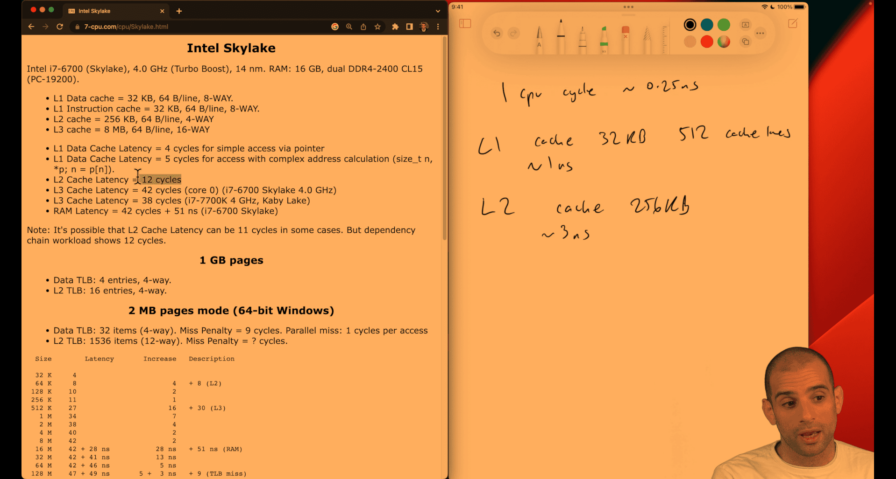

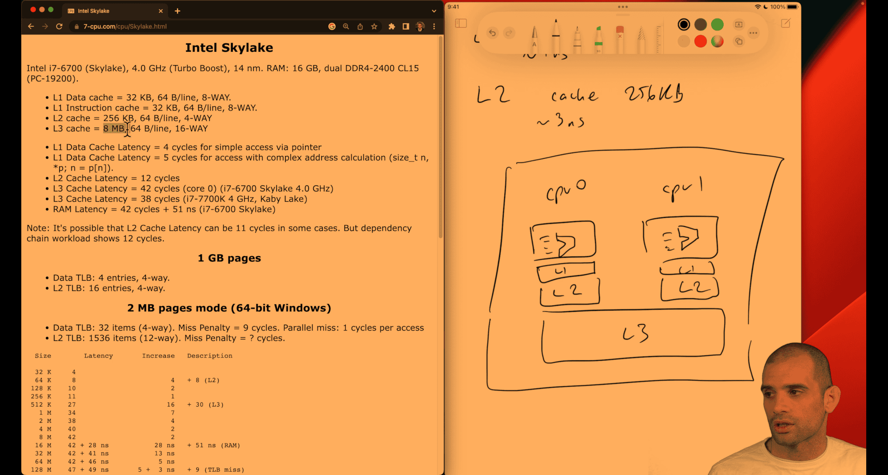

like a tradeoff btw shipping, cost, time , quantity

---

## Understanding CPU caches

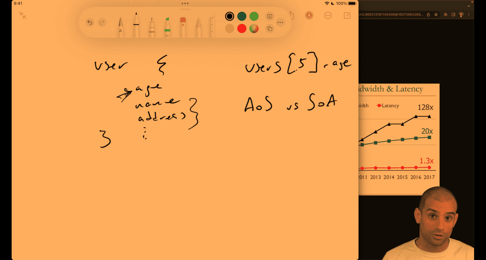

concept:

- array of struct vs struct of array

cpu cache will auto detecting or gussing the next item near the memory

- pointer chasing , like orm(relationship database), object point to another object

cache may have that pointe, or may be not

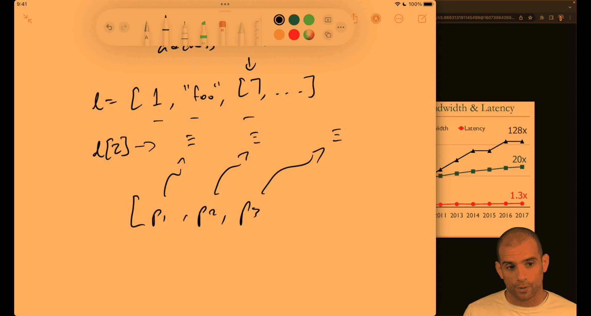

p1 -> python object, how it keep the pointer still be O(1) -> l[2] -> python object
pointer to python number

python will also preconstruct small number first

python data structure use pointer as their interface to different type(pointer chasing effect ) so they are relatively slow

numpy -> type first -> faster

usually when space is larger , time also slower, there is cache utilization in algorithm

e.g. hash map implementation, 2 different to do , two different key to same value ; chaining way ; open addressing

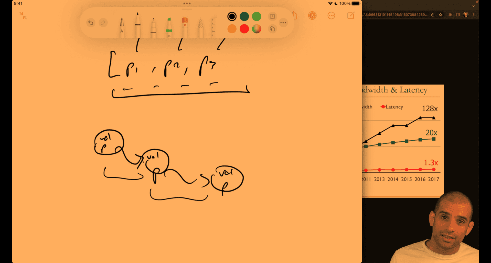
linked list as well, unless you preconfig close memory for each other to make it more efficient

list -> lisp

array approach is better

---

## Grayscale speedup

```c
#include <stdio.h>
#include <stdlib.h>
#include <time.h>

#define int32le(b) (b)[0] | ((b)[1] << 8) | ((b)[2] << 16) | ((b)[3] << 24)

// TODO: make a small change to this function to make it much faster
void grayscale(unsigned char *pixels, int32_t width, int32_t height) {
  int x, y, offset;
  unsigned char lum;
  for (x = 0; x < width; x++) {
    for (y = 0; y < height; y++) {
      offset = 3 * (y * width + x);
      lum = 0.0722 * (double)pixels[offset] +
            0.7152 * (double)pixels[offset + 1] +
            0.2126 * (double)pixels[offset + 2];
      pixels[offset] = lum;
      pixels[offset + 1] = lum;
      pixels[offset + 2] = lum;
    }
  }
}

int main () {
  // open source file and read bytes
  FILE *fh = fopen("teapots.bmp", "r");
  fseek(fh, 0, SEEK_END);
  long size = ftell(fh);
  rewind(fh);
  unsigned char *buffer = malloc(size);
  fread(buffer, size, 1, fh);
  fclose(fh);
  // process in place
  //
  int32_t offset = int32le(buffer + 10), width = int32le(buffer + 18),
          height = int32le(buffer + 22);
  clock_t start = clock();
  grayscale(buffer + offset, width, height);
  clock_t end = clock();
  printf("Elapsed: %0.3fs\n", (double)(end - start) / CLOCKS_PER_SEC);
  // write output
  fh = fopen("out.bmp", "w");
  fwrite(buffer, size, 1, fh);
  fclose(fh);
  free(buffer);
}
```

Measuring cache performance with perf and cachegrind

[Valgrind Home](https://valgrind.org/) or Perf
perf need linux native for more detail, primer said it cann't work on vm

first , it is a clomn first iteration, not row first iteration -> slower

[c - Why does the order of the loops affect performance when iterating over a 2D array? - Stack Overflow](https://stackoverflow.com/questions/9936132/why-does-the-order-of-the-loops-affect-performance-when-iterating-over-a-2d-arra)
it seem the speed is depend on programming languages

column first or row first

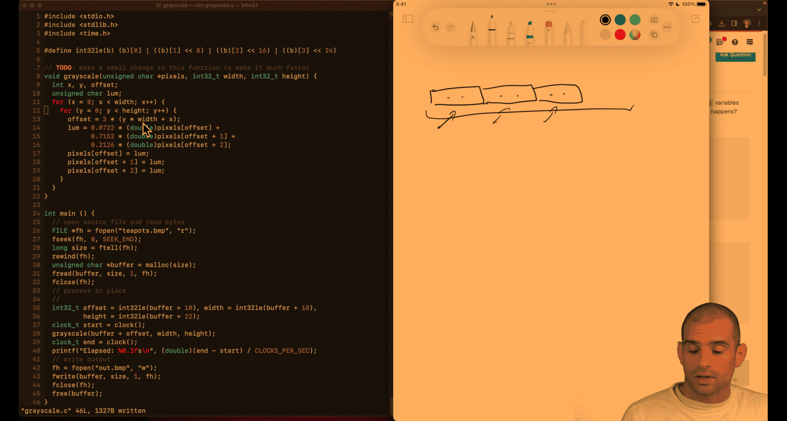
fit in cache line -> row, kind of like a putting a line of ikea stuff

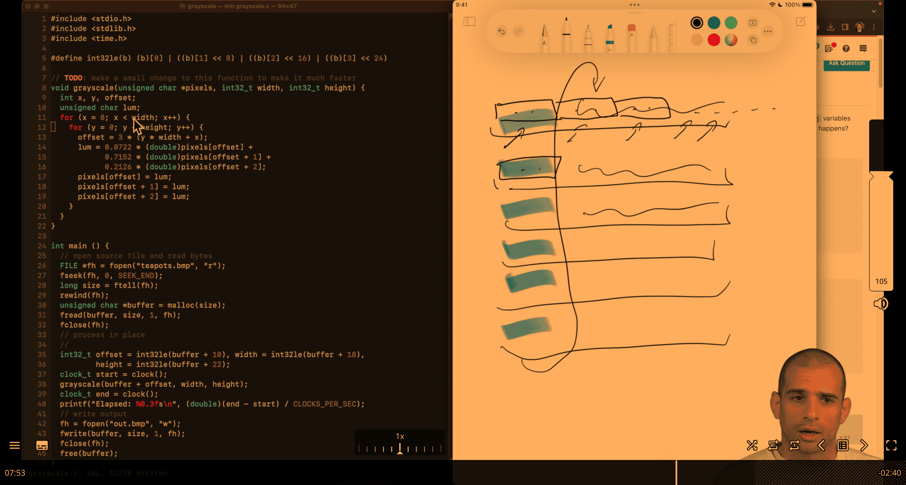

- just exchange x and y line -> row based -> fit the cache line -> faster

---

## pointer-chase

```python
import csv
import datetime
import math
import time


class Address(object):
    def __init__(self, address_line, zipcode):
        self.address_line = address_line
        self.zipcode = zipcode


class DollarAmount(object):
    def __init__(self, dollars, cents):
        self.dollars = dollars
        self.cents = cents


class Payment(object):
    def __init__(self, dollar_amount, time):
        self.amount = dollar_amount
        self.time = time


class User(object):
    def __init__(self, user_id, name, age, address, payments):
        self.user_id = user_id
        self.name = name
        self.age = age
        self.address = address
        self.payments = payments


def average_age(users):
    total = 0
    for u in users.values():
        total += u.age
    return total / len(users)


def average_payment_amount(users):
    amount = 0
    count = 0
    for u in users.values():
        count += len(u.payments)
        for p in u.payments:
            amount += float(p.amount.dollars) + float(p.amount.cents) / 100
    return amount / count


def stddev_payment_amount(users):
    mean = average_payment_amount(users)
    squared_diffs = 0
    count = 0
    for u in users.values():
        count += len(u.payments)
        for p in u.payments:
            amount = float(p.amount.dollars) + float(p.amount.cents) / 100
            diff = amount - mean
            squared_diffs += diff * diff
    return math.sqrt(squared_diffs / count)


def load_data():
    users = {}
    with open('users.csv') as f:
        for line in csv.reader(f):
            uid, name, age, address_line, zip_code = line
            addr = Address(address_line, zip_code)
            users[int(uid)] = User(int(uid), name, int(age), addr, [])
    with open('payments.csv') as f:
        for line in csv.reader(f):
            amount, timestamp, uid = line
            payment = Payment(
                DollarAmount(dollars=int(amount)//100, cents=int(amount) % 100),
                time=datetime.datetime.fromisoformat(timestamp))
            users[int(uid)].payments.append(payment)
    return users


if __name__ == '__main__':
    t = time.perf_counter()
    users = load_data()
    print(f'Data loading: {time.perf_counter() - t:.3f}s')
    t = time.perf_counter()
    assert abs(average_age(users) - 59.626) < 0.01
    assert abs(stddev_payment_amount(users) - 288684.849) < 0.01
    assert abs(average_payment_amount(users) - 499850.559) < 0.01
    print(f'Computation {time.perf_counter() - t:.3f}s')
```

optimized version:

```python
import csv
import math
import time


def average_age(ages):
    total = 0
    for x in ages:
        total += x
    return total / len(ages)


def average_payment_amount(payments):
    total = 0
    for dollars, cents in payments:
        total += dollars + cents / 100
    return total / len(payments)


def stddev_payment_amount(payments):
    mean = average_payment_amount(payments)
    squared_diffs = 0
    for dollars, cents in payments:
        amount = dollars + cents / 100
        diff = amount - mean
        squared_diffs += diff * diff
    return math.sqrt(squared_diffs / len(payments))


def load_data():
    ages, payments = [], []
    with open("users.csv") as f:
        for line in csv.reader(f):
            uid, name, age, address_line, zip_code = line
            ages.append(int(age))
    with open("payments.csv") as f:
        for line in csv.reader(f):
            amount, timestamp, uid = line
            payments.append((float(int(amount) // 100), float(amount) % 100))
    return ages, payments


if __name__ == "__main__":
    t = time.perf_counter()
    ages, payments = load_data()
    print(f"Data loading: {time.perf_counter() - t:.3f}s")
    t = time.perf_counter()
    assert abs(average_age(ages) - 59.626) < 0.01
    assert abs(stddev_payment_amount(payments) - 288684.849) < 0.01
    assert abs(average_payment_amount(payments) - 499850.559) < 0.01
    print(f"Computation {time.perf_counter() - t:.3f}s")
```

#### Version 1: Eliminated DollarAmount Class

```python
class Payment(object):
    def __init__(self, dollars, cents, time):
        self.dollars = dollars            # Direct attribute
        self.cents = cents                # Direct attribute
        self.time = time                  # PyObject overhead
```

**Optimizations:**

- Eliminated 1,000,000 DollarAmount objects
- Reduced attribute access: `p.dollars` instead of `p.amount.dollars`
- **PyObject reduction**: ~1M objects eliminated

**Memory Access Pattern:**

```python
## Fewer indirections
amount = p.dollars + p.cents / 100
##     ↑      ↑           ↑
##   Payment  dollars    cents
```

#### Version 3: Simplified User and Payment Classes

```python
class Payment(object):
    def __init__(self, dollars, cents):
        self.dollars = dollars            # Direct attribute
        self.cents = cents                # Direct attribute

class User(object):
    def __init__(self, age, payments):
        self.age = age                    # Direct attribute
        self.payments = payments          # PyObject overhead
```

**Optimizations:**

- Eliminated 100,000 Address objects
- Removed time from Payment (not used in calculations)
- Removed user_id, name from User (not used in calculations)
- **PyObject reduction**: ~100K objects eliminated

**Key Insight:** Only store data that's actually used in computations!

#### Version 4: Eliminated ALL Classes

```python
def load_data():
    ages, payments = [], []               # Simple lists
    # ... load data ...
    ages.append(int(age))                 # Direct list append
    payments.append((float(int(amount) // 100), float(amount) % 100))  # Tuples
    return ages, payments

def average_payment_amount(payments):
    total = 0
    for dollars, cents in payments:       # Direct tuple unpacking
        total += dollars + cents / 100    # Direct arithmetic
    return total / len(payments)
```

**Optimizations:**

- Eliminated ALL custom classes
- Using built-in types: lists and tuples
- **PyObject reduction**: ~2.2M objects eliminated

**Memory Access Pattern:**

```python
## Direct array access
for dollars, cents in payments:  # Sequential memory access
    total += dollars + cents / 100
```

### Performance Impact Analysis

#### Memory Usage Comparison

| Version   | PyObjects | Memory Overhead | Data Structure     |
| --------- | --------- | --------------- | ------------------ |
| Original  | ~2.2M     | ~70MB           | Nested objects     |
| Version 1 | ~1.2M     | ~38MB           | Flattened Payment  |
| Version 3 | ~1.1M     | ~35MB           | Simplified classes |
| Version 4 | ~100K     | ~3MB            | Lists + tuples     |

#### CPU Performance Factors

##### 1. **Attribute Access Overhead**

```python
## Original: Dictionary lookup for each attribute
p.amount.dollars  # 2 dictionary lookups + pointer dereference

## Version 4: Direct array access
dollars, cents = payment  # 1 tuple unpacking operation
```

##### 2. **Memory Locality**

```python
## Original: Objects scattered in memory
user1 -> payment1 -> amount1 -> dollars1
user2 -> payment2 -> amount2 -> dollars2
## Poor cache locality

## Version 4: Sequential arrays
ages = [age1, age2, age3, ...]           # Sequential memory
payments = [(d1,c1), (d2,c2), (d3,c3)]  # Sequential memory
## Excellent cache locality
```

##### 3. **CPU Instructions**

```python
## Original: Many LOAD_ATTR instructions
LOAD_ATTR     # Load object attribute
LOAD_ATTR     # Load nested attribute
LOAD_ATTR     # Load nested attribute

## Version 4: Simple array operations
LOAD_FAST     # Load from local variable
BINARY_ADD    # Direct arithmetic
```

#### Cache Performance

**Cache Line Size**: 64 bytes

**Original Version:**

- Each PyObject: ~32 bytes overhead + data
- Cache line utilization: ~50% (overhead vs data)
- Cache misses: High (scattered objects)

**Version 4:**

- Tuples: Minimal overhead
- Cache line utilization: ~95% (mostly data)
- Cache misses: Low (sequential access)

### Why This Optimization Works

#### 1. **Reduced Memory Allocation**

- Fewer objects = less memory allocation overhead
- Less garbage collection pressure
- Better memory pool utilization

#### 2. **Improved Cache Locality**

- Sequential data structures
- Predictable memory access patterns
- CPU prefetcher can work effectively

#### 3. **Simplified CPU Instructions**

- Fewer attribute lookups
- Direct arithmetic operations
- Reduced function call overhead

#### 4. **Better Compiler Optimization**

- Simpler code patterns
- More opportunities for optimization
- Better register allocation

### Key Lessons

#### 1. **Only Store What You Need**

```python
## Bad: Store everything
class User(object):
    def __init__(self, user_id, name, age, address, payments):
        # Store all fields even if unused

## Good: Store only what's computed
ages = [age1, age2, age3, ...]  # Only ages needed for average_age()
```

#### 2. **Use Built-in Types When Possible**

```python
## Bad: Custom classes for simple data
class Payment(object):
    def __init__(self, dollars, cents):
        self.dollars = dollars
        self.cents = cents

## Good: Built-in tuples
payments = [(dollars1, cents1), (dollars2, cents2), ...]
```

#### 3. **Minimize Object Hierarchies**

```python
## Bad: Deep nesting
user.payment.amount.dollars

## Good: Flat structure
payment[0]  # dollars
payment[1]  # cents
```

#### 4. **Consider Data Layout**

```python
## Bad: Scattered objects
users = {id1: user1, id2: user2, ...}

## Good: Sequential arrays
ages = [age1, age2, age3, ...]
```

### Performance Expectations

With ~1M payments and ~100K users:

- **Original**: ~2.2M PyObjects, ~70MB overhead
- **Version 4**: ~100K PyObjects, ~3MB overhead

**Expected speedup**: 5-20x depending on:

- CPU cache size
- Memory bandwidth
- Data access patterns

The optimization demonstrates that **reducing PyObject overhead can provide massive performance improvements** in Python, especially for data-intensive applications.

### Conclusion

This progression shows how **eliminating unnecessary PyObjects** can dramatically improve Python performance by:

1. **Reducing memory overhead** (70MB → 3MB)
2. **Improving cache locality** (scattered → sequential)
3. **Simplifying CPU instructions** (attribute lookups → direct access)
4. **Enabling better optimization** (complex → simple patterns)

The key insight: **Use the simplest data structure that meets your needs** - often built-in types like lists and tuples are faster than custom classes.

---

## Bogosum

```c
/*
 * INSTRUCTIONS
 *
 * Consider the code below, and ask yourself the following questions:
 *
 * - How many memory accesses does it take to compute the sum of nums?
 * - How many cache hits/misses do you expect to see for ordered vs random
 * access?
 * - What would change if you:
 *   - reordered the fields of the struct?
 *   - removed `foo` and `bar`?
 *   - changed `value` to a short?
 * - Are there certain values of N that would substantially change your
 * calculations?
 * - Whatever else you find interesting!
 *
 * Try to form concrete hypotheses, and compare to the results you see in perf
 * and/or cachegrind. Note: if the cachegrind simulation takes too long, try
 * lower values of n. Also, you may want to compile at -O1 to avoid redundant
 * memory access at -O0.
 *
 * Advanced/strech goal: approximate the expected execution time of both ordered
 * and random, and try to explain any differences you see with actual
 * measurements!
 *
 */
#include <stdio.h>
#include <stdlib.h>
#include <string.h>
#include <time.h>

struct number {
    short foo;
    int value;
    short bar;
};


int sum(struct number nums[], int indexes[], int n) {
    int idx, total = 0;

    for (int i = 0; i < n; i++) {
        idx = indexes[i];
        total += nums[idx].value;
    }
    return total;
}

void shuffle(int *array, size_t n) {
  if (n > 1) {
    size_t i;
    for (i = n - 1; i > 0; i--) {
      size_t j = (unsigned int)(drand48() * (i + 1));
      int t = array[j];
      array[j] = array[i];
      array[i] = t;
    }
  }
}

int main(int argc, char **argv) {
  srand(1);
  int i, n = (1 << 26);
  int *ordered = malloc(n * sizeof(int));
  int *random = malloc(n * sizeof(int));
  struct number *nums = malloc(n * sizeof(struct number));
  // construct arrays of indices
  for (i = 0; i < n; i++) {
    ordered[i] = i;
    random[i] = i;
  }
  shuffle(random, n);
  // pick random numbers to sum
  for (i = 0; i < n; i++)
    nums[i].value = rand();
  if (argc == 2 && strcmp(argv[1], "baseline") == 0)
    exit(0);
  clock_t start, end;
  if (argc == 1 || strcmp(argv[1], "ordered") == 0) {
    start = clock();
    int sum1 = sum(nums, ordered, n);
    end = clock();
    printf("Ordered: %d in %0.3fs\n", sum1,
           (double)(end - start) / CLOCKS_PER_SEC);
  }
  if (argc == 1 || strcmp(argv[1], "random") == 0) {
    start = clock();
    int sum2 = sum(nums, random, n);
    end = clock();
    printf("Random:  %d in %0.3fs\n", sum2,
           (double)(end - start) / CLOCKS_PER_SEC);
  }
}

```

Ah, I see what your teacher is correcting! Let me explain the **memory alignment** and **struct padding** concepts that I missed in my initial analysis.

### **Struct Padding and Memory Alignment**

Your teacher is pointing out that the struct is actually **12 bytes**, not 8 bytes as I calculated. Here's why:

```c
struct number {
    short foo;    // 2 bytes
    int value;    // 4 bytes - MUST be aligned to 4-byte boundary
    short bar;    // 2 bytes
};
```

**Actual memory layout with padding:**

```
Offset 0-1:   short foo    (2 bytes)
Offset 2-3:   [padding]    (2 bytes) - unused!
Offset 4-7:   int value    (4 bytes) - aligned to 4-byte boundary
Offset 8-9:   short bar    (2 bytes)
Offset 10-11: [padding]    (2 bytes) - unused!
```

**Total: 12 bytes per struct** (not 8!)

### **Why This Padding Exists**

The compiler adds padding because:

1. **Performance**: CPUs can access aligned data much faster than misaligned data
2. **Hardware requirements**: Some CPUs require certain data types to be aligned
3. **Cache efficiency**: Aligned data loads more efficiently into cache lines

### **Updated Cache Analysis**

**Cache line behavior (64-byte cache lines):**

- Each struct: 12 bytes
- Structs per cache line: 64 ÷ 12 = **5 complete structs** per cache line
- Remaining space: 4 bytes unused

**Cache performance:**

- **Ordered access**: 1 miss per 5 accesses = **20% miss rate**
- **Random access**: ~100% miss rate
- **Expected speedup**: Random access should be about **5x slower** than ordered access

### **Cache Capacity Analysis**

With your teacher's L3 cache = 7MB:

- **L1 cache** (~32KB): Can hold ~2,730 structs (0.004% of dataset)
- **L2 cache** (~1MB): Can hold ~87,000 structs (0.13% of dataset)
- **L3 cache** (7MB): Can hold ~583,000 structs (0.87% of dataset)

**Total dataset size**: 67M structs × 12 bytes = **805MB**

### **The "Struct Header" Concept**

When your teacher mentions "struct header," they're referring to the **implicit overhead** that structs have due to alignment requirements. It's not a literal header, but rather the padding that gets added to make the struct properly aligned.

### **Key Lessons**

1. **Memory alignment** significantly impacts both space usage and performance
2. **Struct padding** can waste memory and reduce cache efficiency
3. **Even large caches** can only hold tiny fractions of big datasets
4. **Small details** like padding can have big performance impacts

This is exactly why understanding memory hierarchy is crucial - these low-level details matter a lot for performance!

---

change struct order , int first -> bigger 2. delete those char to test the struct

3. delete the struct

```c
int sum(short nums[], int indexes[], int n) {
  int idx, total = 0;

  for (int i = 0; i < n; i++) {
    idx = indexes[i];
    total += nums[idx];
  }
  return total;
}

```


