# csprimer-algorithms

## 002 Convert to Roman

1. understand the problem
2. start from smaller problem
3. found pattern, solve by recursions or loop etc
4. create your own test, think line by line?

plan:
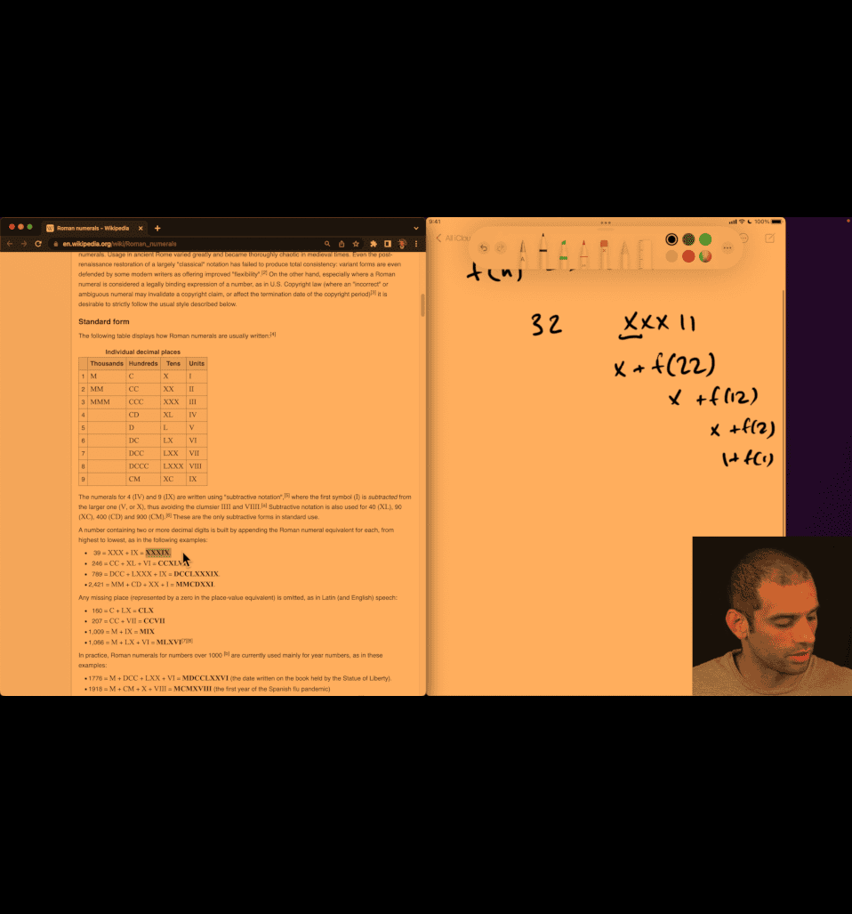

recursively -> substract the larger problem -> smaller

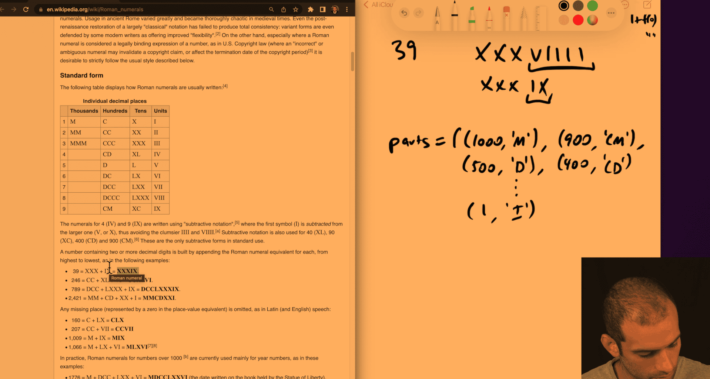

scratch and keep planing:

```python
def f(n):
  for d,r:
    if d<=n:
      return r+f(n-d)
  return ""

```

```python
parts = [
    (1000, "M"),
    (900, "CM"),
    (500, "D"),
    (400, "CD"),
    (100, "C"),
    (90, "XC"),
    (50, "L"),
    (40, "XL"),
    (10, "X"),
    (9, "IX"),
    (5, "V"),
    (4, "IV"),
    (1, "I"),
]


def f(n):
    if n <= 0:
        return ""
    for d, r in parts:
        if d <= n:
            return r + f(n - d)
    return ""

if __name__ == "__main__":
    cases = ((39, "XXXIX"), (2421, "MMCDXXI"), (1066, "MLXVI"))
    for n, x in cases:
        assert f(n) == x
    print("ok")
```

more overkill feature:
binary search `bisect`

```python
from bisect import bisect_right

values = [1, 4, 5, 9, 10, 40, 50, 90, 100, 400, 500, 900, 1000]
symbols = ["I", "IV", "V", "IX", "X", "XL", "L", "XC", "C", "CD", "D", "CM", "M"]


def f(n):
    r = ""
    while n > 0:
        i = bisect_right(values, n) - 1  # largest value <= n
        r += symbols[i]
        n -= values[i]
    return r

```

---

## 003 Correct binary search.mp4

```python
from typing import List, Optional

def binsearch(nums: List[int], target: int) -> Optional[int]:
    lo = 0
    hi = len(nums) - 1
    # Invariant: if target is in nums, then it is within indices [lo, hi]
    while lo <= hi:
        mid = lo + (hi - lo) // 2  # avoids overflow and biases toward lower mid
        value = nums[mid]
        if value == target:
            return mid
        if value < target:
            lo = mid + 1  # target, if present, is in [mid+1, hi]
        else:
            hi = mid - 1  # target, if present, is in [lo, mid-1]
    return None

#if name=main:
a = [-5, -2, 0]
b = [0, 2, 3, 4, 9]

cases = [
    (a, -5, 0),
    (a, -2, 1),
    (a,  0, 2),
    (a,  2, None),
    (a, -3, None),

    (b,  0, 0),
    (b,  3, 2),
    (b,  4, 3),
    (b,  2, 1),
    (b,  9, 4),
]
for nums, n, exp in cases:
    assert binsearch(nums, n) == exp, (nums, n, exp, binsearch(nums, n))
print('ok')

```

---

## 010 The enormous difference between polynomial and exponential.mp4

O(n^2) vs O(2^n)

---

## 011 Building an intuition for common running times.mp4

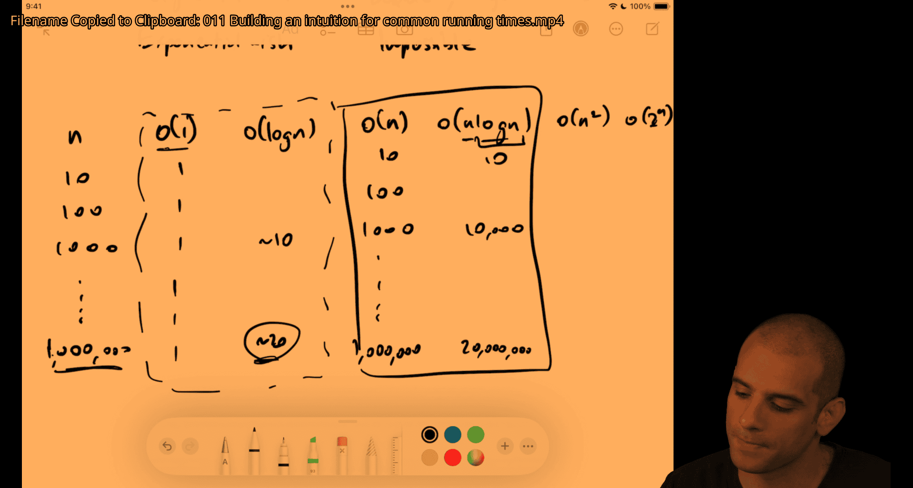

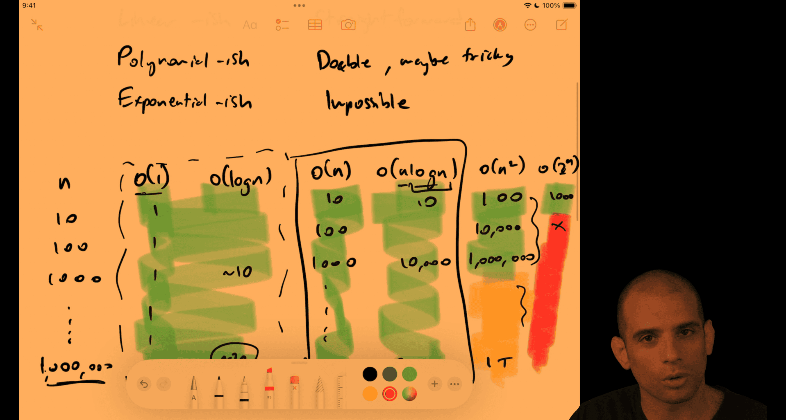

- o(n^2) is ok if n <=1000
  but not for o(2^n)

---

006 Finding duplicates

## Asymptotic Analysis and Finding Duplicates

### Introduction: Asymptotic Analysis as a Tool

#### The Love-Hate Relationship

- Many engineers have mixed feelings about Big O notation
- Common issues: **under-using** and **over-using** it
- It's **one tool** in your toolkit, not the only thing

#### What Asymptotic Analysis Does

**Theoretical perspective**:

- Allows speaking about trade-offs between approaches
- **Agnostic of the specific system** running the code
- Enables algorithms from the 1950s to remain relevant today
- Part of a multi-decade (approaching multi-century) conversation about algorithms

**Practical reality**:

- You **cannot** be agnostic of your actual system
- Real systems matter: machine, language, data characteristics, RAM constraints
- Some of the most important decisions depend on context

**The balance**:

- Theory helps us speak generally and universally
- Practice requires considering the actual system
- Both perspectives are necessary

### The Problem: Finding Duplicates

**Task**: Write a function `hasDuplicate(array)` that returns `true` if there are duplicate integers in an array, `false` otherwise.

**Three different engineers propose three different approaches.**

### Solution 1: Nested Loops (Compare Everything)

#### Approach

- For each element in the array, compare it to every other element
- Can optimize by using symmetry (comparing A to B but not B to A)

#### Complexity Analysis

**Time**: O(n²)

- Work grows as the **area of a square** (n × n)
- Even with symmetry optimization (comparing only half), it's still fundamentally n²
- Constant factors (like 1/2) don't change the complexity class

**Space**: O(1)

- No extra data structures needed

#### Growth Example

- Going from 10 to 20 elements: 100 → 400 comparisons
- Going from 10 to 100 elements: 100 → 10,000 comparisons
- **Substantial growth** as n increases

#### When to Use

- Simple and straightforward
- Good for small, bounded n
- Easy to understand and maintain
- **Not ideal** for large databases or unbounded growth

### Solution 2: Sort Then Check Adjacent Pairs

#### Approach

1. Sort the array (non-destructive or sort a copy)
2. Iterate through checking adjacent pairs
3. If any adjacent pair is equal, there's a duplicate

#### Complexity Analysis

**Time**: O(n log n)

- Sorting: O(n log n) - this is "astonishing" because most intuitive sorts are O(n²)
- Iteration: O(n)
- **Combined**: O(n log n) (the n log n term dominates)

**Space**: O(n) or O(1)

- O(n) if you need to create a copy (non-destructive)
- O(1) if you can sort in-place

#### Understanding n log n

**Key insight**: n log n is much closer to linear than to n²

**Concrete examples**:

- log₂(1024) = 10 (since 2¹⁰ = 1024)
- log₂(1 billion) ≈ 30 (since 2³⁰ ≈ 1 billion)
- The logarithm grows **very slowly** compared to n

**Comparison**:

- For 10,000 elements: iteration takes 10,000 units of work
- n log n is substantially better than n² for large n

#### When to Use

- Better than O(n²) for large n
- May require extra space if sorting in-place isn't possible
- More complex than nested loops

### Solution 3: Hash Map/Set (Single Pass)

#### Approach

- Iterate through array once
- For each element, check if it's already in a hash map/set
- If yes → duplicate found
- If no → add it to the hash map/set

#### Complexity Analysis

**Time**: O(n)

- Single pass through array: O(n)
- Hash map operations (insert, lookup): O(1) average case
- **Combined**: O(n)

**Space**: O(n)

- Must store all elements in the hash map
- Space grows proportionally with input size

#### Comparison to Solution 2

**Theoretically**: O(n) is better than O(n log n)

- There exists some n where Solution 3 is definitely faster

**Practically**:

- Requires O(n) space (Solution 2 might use O(1) if in-place)
- May not be feasible if RAM is constrained
- More complex than Solution 1

#### When to Use

- Best theoretical time complexity
- Requires extra space
- Consider: Do we have enough RAM? Is n large enough that the difference matters?

### Key Insights About Asymptotic Analysis

#### What It Discards

1. **Constant factors**
   - O(n²) vs O(½n²) are the same complexity class
   - The 1/2 optimization doesn't change the analysis

2. **Non-dominant terms**
   - O(n log n + n) = O(n log n)
   - The +n term is dominated by n log n

3. **Exact counts**
   - Focus is on **pattern of growth**, not precise numbers

#### Complexity Classes That Matter

In practice, only a handful of complexity classes make a meaningful difference:

- **Constant**: O(1)
- **Linear**: O(n)
- **Logarithmic**: O(log n)
- **Linearithmic**: O(n log n)
- **Polynomial**: O(n²), O(n³), etc.
- **Exponential**: O(2ⁿ) - typically intractable

#### When Theory Meets Practice

**Questions to ask**:

1. At what n does this algorithm become too slow?
2. Will our business/database ever reach that n?
3. Is the simpler O(n²) code better if it's more maintainable?
4. Can we afford the space for the O(n) solution?
5. Is the code maintainable and robust?

**Example consideration**:

- If checking millions of integers and never trillions
- If O(n²) is fast enough (< 10ms) for your use case
- If simpler code reduces bugs and maintenance cost
- **Then**: O(n²) might be the right choice

### Real-World Application: Database Joins

The three approaches to finding duplicates **mirror** the three main database join algorithms:

1. **Nested Loop Join**: O(n²) - compare everything to everything
2. **Sort-Merge Join**: O(n log n) - sort then merge
3. **Hash Join**: O(n) - build hash table, probe

This pattern appears in many contexts throughout computer science.

### Takeaways

1. **Asymptotic analysis is a tool**, not the only consideration
2. **Theory enables universal conversation** about algorithms across decades
3. **Practice requires system-specific thinking** - machine, data, constraints
4. **Simple code can be better** if n is bounded and maintainability matters
5. **Know when each approach is best**:
   - Small n, simple code → O(n²) might be fine
   - Large n, space available → O(n) hash approach
   - Large n, space constrained → O(n log n) sort approach
6. **Be able to articulate trade-offs** in both theoretical and practical terms
7. **This pattern (nested loops, sort, hash) appears everywhere** - recognizing it is valuable

### Practice Questions

- **Beginner**: Which approach do you prefer and why?
- **Intermediate**: When would you prefer each approach over the others?
- **Advanced**: Find a clear circumstance where each of the three is better than the other two

### Notes on Notation

- The speaker uses "O of n" notation but notes that formal Big O definition will be covered separately
- Focus here is on **intuitive understanding** of growth patterns
- Complexity classes will be covered in more detail in future videos

---

007 Fizzbuzz sum.mp4

**Critical question**: Do I need to look at every element?

- If **yes** (e.g., printing FizzBuzz for each number): You're stuck at O(n)
- If **no** (e.g., just need the sum): Look for mathematical patterns or closed-form solutions

**Within complexity class**: You can still optimize constant factors, but for **substantial** improvement, you need a different complexity class.

with divide and conquer, asking yourself, is there a log time solution to this, would
be like saying, could I purchase with divide and conquer, where I divide this into two or
more pieces, solve these problems in a way where I can combine the results ?

- the first way that you might want to think about this, you want to try and find a pattern,
  right, where we can have a mathematical expression for computing that pattern, and so you might

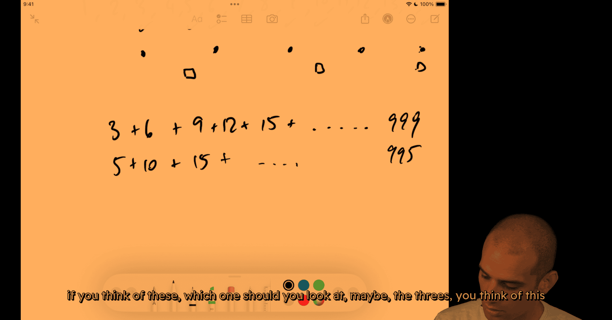

any faster way , pattern?

deduct the repeated part (15 common divider for 3 and 5)

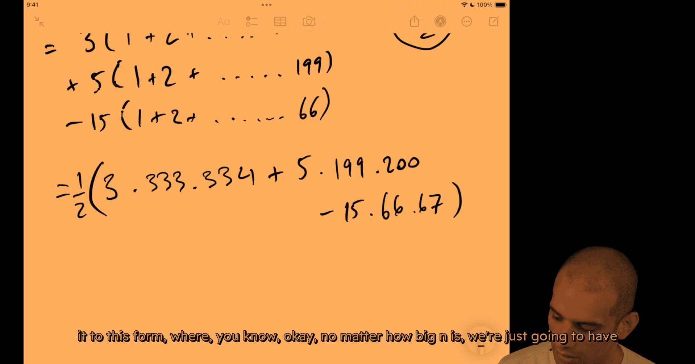

a few multiplications and a few addition subtractions divided by 2, right, n could be billions,
constant time solutions

---

008 Just iterate.mp4


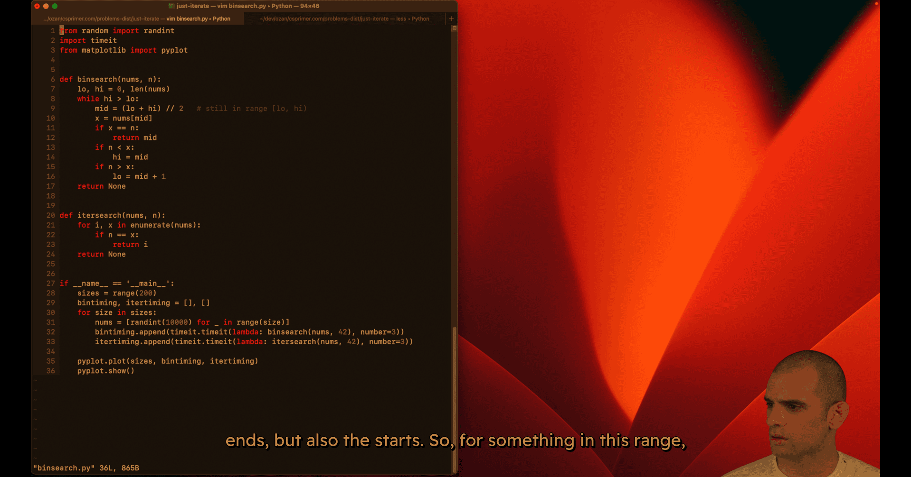

```python
from random import randint
import timeit
from matplotlib import pyplot

def binsearch(nums, n):
    lo = 0
    hi = len(nums)
    while hi > lo:
        mid = (lo + hi) // 2  # still in range [lo, hi)
        x = nums[mid]
        if x == n:
            return mid
        if n < x:
            hi = mid
        else:
            lo = mid + 1
    return None

def itersearch(nums, n):
    for i, x in enumerate(nums):
        if n == x:
            return i
    return None

if __name__ == '__main__':
    sizes = range(200)
    bintiming, itertiming = [], []
    for size in sizes:
        nums = [randint(0, 10000) for _ in range(size)]
        bintiming.append(timeit.timeit(lambda: binsearch(nums, 42), number=3))
        itertiming.append(timeit.timeit(lambda: itersearch(nums, 42), number=3))
    pyplot.plot(sizes, bintiming, itertiming)
    pyplot.show()

```

---

# 009 Analysis practice.mp4

i just skip the video

- **Problem**: Cut a 3×3×3 cube into 27 unit cubes with minimum cuts

## Asymptotic Analysis: Comprehensive Study Notes

### Introduction: The Goal of Asymptotic Analysis

#### Purpose

- **Primary goal**: Assess the time and space cost, in Big O terms, of most programs you'll encounter
- Enable comparison of algorithms in a **hardware-agnostic** way
- Provide a universal language to discuss algorithms across different systems and contexts
- Balance theoretical understanding with practical systems considerations

#### The Balance: Theory vs. Practice

**Theoretical perspective**:

- Allows us to say "this algorithm from the 50s is good" in a universal way
- Makes sense regardless of what machine it's running on
- Enables conversation about algorithms independent of hardware

**Practical reality**:

- Cannot ignore hardware, data characteristics, or context
- Cannot ignore maintainability of code
- Need both theoretical and systems understanding

**The goal**: Be comfortable enough with analysis to proceed to graph search, divide-and-conquer, dynamic programming, and extend analysis techniques to those algorithms.

### Core Definition: When Is One Algorithm Better?

#### The Fundamental Question

Given two algorithms, can we say one is objectively better than the other?

**Answer**: Yes, if there exists some n where one algorithm definitely outperforms the other, regardless of:

- Constant factors
- Hardware differences (Raspberry Pi vs. supercomputer)
- Boot-up time or initialization overhead

#### Example

- **Algorithm A**: Linear time (O(n)) on a slow Raspberry Pi
- **Algorithm B**: Quadratic time (O(n²)) on a supercomputer

**Question**: Is A better than B?

**Answer**: Yes! There exists some n where the linear algorithm on the Raspberry Pi will beat the quadratic algorithm on the supercomputer. Eventually, the growth rate dominates.

#### Key Insight

- Not for every n, but for **some** n
- Constant factors don't matter in the limit
- Hardware differences don't matter in the limit
- The growth pattern (linear vs. quadratic) is what matters

### Complexity Classes: The Four Practical Groups

#### 1. Constant-ish

- **O(1)**: Constant time
- **O(log n)**: Logarithmic time
- **O(√n)**: Square root time

**Characteristics**:

- Effectively "free" or very cheap
- Log n grows extremely slowly (log₂(1000) ≈ 10, log₂(1M) ≈ 20, log₂(1B) ≈ 30)
- Practical systems perspective: these are all "constant-ish"

#### 2. Linear-ish

- **O(n)**: Linear time
- **O(n log n)**: Linearithmic time

**Characteristics**:

- Scale horizontally: "for every dollar we make, add another server"
- Generally manageable for most applications
- n log n is much closer to linear than to quadratic

#### 3. Polynomial

- **O(n²)**: Quadratic time
- **O(n³)**: Cubic time
- **O(nᵏ)**: Polynomial time for any constant k

**Characteristics**:

- May need clever optimizations at scale
- At Google scale, might not be affordable
- Generally workable but requires careful consideration

#### 4. Non-Polynomial (Hard Problems)

- **O(2ⁿ)**: Exponential time
- **O(n!)**: Factorial time

**Characteristics**:

- Effectively **impossible** for meaningful n
- For exponential: 2⁵⁰ is already intractable
- Cannot use such algorithms in practice

#### Practical Framing

The four groups help answer:

- **Is it effectively free?** → Constant-ish
- **Can we scale horizontally?** → Linear-ish
- **Do we need clever optimizations?** → Polynomial
- **Is it impossible?** → Non-polynomial

### Units of Measurement

#### Time Complexity

**Unit**: Operations

- Could be CPU cycles, seconds, or any consistent unit
- When constant factors are discarded, the exact unit doesn't matter
- **Assumption**: Each operation takes consistent time (not always true for big integers, user-defined types, etc.)

**Example**: Counting function calls

- If each function call takes the same time regardless of input
- Then counting function calls is a valid proxy for time
- **Hazard**: If function call time varies with input, need to be more careful

#### Space Complexity

**Unit**: Memory units

- Could be bytes, stack frames, pages, disk blocks
- Need a consistent unit that grows predictably

**Common units**:

- **Stack frames**: For recursive functions, each call uses one stack frame
- **Array elements**: For data structures, count elements stored
- **Bytes**: For raw memory usage

**Example**: Stack space

- Each recursive call pushes a stack frame
- Stack frame size is consistent (contains function locals, return address, etc.)
- Can count stack frames as units of space

### Example 1: Constant Time Operations

#### Simple Multiplication

```python
def multiply(a, b):
    return a * b
```

**Time Complexity**: O(1)

- One operation (multiplication)
- Irrespective of input size

**Assumptions**:

- Integers are primitive types (fit in CPU registers)
- Multiplication is a single CPU instruction
- Not Python big integers (arbitrarily sized)
- Not user-defined types with custom `__mul__` methods

**When assumptions break**:

- Python big integers: multiplication time grows with number size
- Cryptographic operations: multiplying huge primes is not constant
- User-defined types: `__mul__` could do anything

**Key takeaway**: Always consider what assumptions you're making about input types and operations.

### Example 2: Square Root Functions

#### Built-in Square Root

```python
import math
def sqrt_builtin(n):
    return math.sqrt(n)
```

**Time Complexity**: Depends on implementation

- If hardware floating-point: O(1) - constant time
- If software implementation: Could be O(log n) or O(√n)

#### Binary Search Square Root

```python
def sqrt_binary_search(n):
    # Binary search for k such that k² ≤ n < (k+1)²
    left, right = 1, n
    while left < right:
        mid = (left + right) // 2
        if mid * mid <= n:
            left = mid + 1
        else:
            right = mid
    return left - 1
```

**Time Complexity**: O(log n)

- Binary search over space from 1 to n
- Each iteration halves the search space

#### Linear Search Square Root

```python
def sqrt_linear(n):
    k = 1
    while k * k <= n:
        k += 1
    return k - 1
```

**Time Complexity**: O(√n)

- Tries 1², 2², 3², ... until finding the answer
- Terminates early at √n iterations

#### Comparison: O(log n) vs. O(√n)

**Theoretical**: O(log n) is better (lower complexity class)

**Practical considerations**:

- **Constant factors**: Binary search has branch prediction overhead
- **Threshold**: At n = 64, √64 = 8, log₂(64) = 6
- **Real systems**: May need to benchmark to determine which is actually faster
- **Interview perspective**: Want to hear about systems considerations, not just "I'd benchmark"

**Key insight**: Sometimes O(log n) vs. O(√n) are close enough that constant factors and systems considerations matter more than the theoretical difference.

### Example 3: Factorial - Recursive vs. Iterative

#### Recursive Factorial

```python
def factorial_recursive(n):
    if n <= 1:
        return 1
    return n * factorial_recursive(n - 1)
```

**Time Complexity**: O(n)

- Makes n function calls (n, n-1, n-2, ..., 1)
- Each call does one multiplication
- Total: n multiplications

**Space Complexity**: O(n)

- Each recursive call uses one stack frame
- Maximum stack depth: n
- Total: n stack frames

**Call chain**: Linear chain, not a tree

- factorial(10) → factorial(9) → factorial(8) → ... → factorial(1)
- Just a straight line, not branching

#### Iterative Factorial

```python
def factorial_iterative(n):
    result = 1
    for i in range(1, n + 1):
        result *= i
    return result
```

**Time Complexity**: O(n)

- Loop runs n times
- Each iteration: one multiplication
- Total: n multiplications

**Space Complexity**: O(1)

- Only one accumulator variable
- No stack frames
- Constant space

#### Comparison

**Time**: Both O(n) - same asymptotic complexity

**Space**:

- Recursive: O(n) - stack frames
- Iterative: O(1) - constant space

**Practical speed**: Iterative is typically faster

- No function call overhead
- No stack frame allocation
- But both are O(n), so this is just a constant factor difference

### Tail Call Optimization

#### What Is Tail Call Optimization?

**Tail position**: The very last operation in a function, with nothing after it

**Tail call**: A recursive call in tail position

**Tail call optimization (TCO)**: Compiler/interpreter optimization that converts tail-recursive functions to iterative form automatically

#### Example: Non-Tail Recursive

```python
def factorial_recursive(n):
    if n <= 1:
        return 1
    return n * factorial_recursive(n - 1)  # NOT tail position
```

**Why not tail?**: After the recursive call returns, we still need to multiply by n

#### Converting to Tail Recursive

```python
def factorial_tail_recursive(n, accumulator=1):
    if n <= 1:
        return accumulator
    return factorial_tail_recursive(n - 1, n * accumulator)  # Tail position
```

**Now it's tail recursive**: The recursive call is the very last thing, nothing happens after it

#### Benefits of TCO

- **Space**: O(n) → O(1) (no stack frames needed)
- **Speed**: Eliminates function call overhead
- **Automatic**: Compiler/interpreter handles the conversion

#### Languages with TCO

- **LISP**: Heavily recursive, TCO is standard
- **JavaScript**: V8 and other engines support TCO (but not in spec)
- **Python**: Does NOT support TCO (by design choice)

**Key insight**: If you can write tail-recursive code, TCO can give you the benefits of iteration (O(1) space) while keeping recursive code structure.

### Example 4: Fibonacci - Multiple Approaches

#### Naive Recursive Fibonacci

```python
def fib_naive(n):
    if n <= 1:
        return n
    return fib_naive(n - 1) + fib_naive(n - 2)
```

**Time Complexity**: O(2ⁿ)

- **Tree structure**: Each call branches into two subproblems
- **Height**: Approximately n (from n down to base cases)
- **Branching factor**: 2 (each node has 2 children)
- **Total nodes**: Approximately 2ⁿ
- **Tighter bound exists**: But O(2ⁿ) is a valid upper bound

**Why exponential?**

- fib(10) calls fib(9) and fib(8)
- fib(9) calls fib(8) and fib(7)
- fib(8) is computed **twice** (once from fib(10), once from fib(9))
- Massive redundant computation

**Space Complexity**: O(n)

- **Stack depth**: Maximum depth is n (one path from root to leaf)
- **Not O(2ⁿ)**: Stack shrinks and grows, never exceeds n
- Even though we make 2ⁿ function calls, we don't need 2ⁿ stack frames simultaneously

#### Memoized Fibonacci

```python
def fib_memoized(n, memo={}):
    if n in memo:
        return memo[n]
    if n <= 1:
        return n
    memo[n] = fib_memoized(n - 1, memo) + fib_memoized(n - 2, memo)
    return memo[n]
```

**Time Complexity**: O(n)

- **Unique subproblems**: Only n unique values (0, 1, 2, ..., n)
- **Each computed once**: After first computation, cached result is reused
- **Total work**: n function calls, each doing O(1) work (after memoization)

**Space Complexity**: O(n)

- **Memo cache**: Stores n values (0 through n)
- **Stack depth**: Still O(n) maximum
- **Total**: O(n) space

**Key insight**: Memoization eliminates redundant subproblem computation by caching results.

#### Bottom-Up Dynamic Programming

```python
def fib_bottom_up(n):
    if n <= 1:
        return n
    a, b = 0, 1
    for i in range(2, n + 1):
        a, b = b, a + b
    return b
```

**Time Complexity**: O(n)

- Loop runs n-1 times
- Each iteration: constant work (addition, assignment)
- Total: O(n)

**Space Complexity**: O(1)

- **Key insight**: Only need the last two values
- **State**: Two integers (a and b)
- **No array needed**: Don't need to store all previous values
- **No stack**: Iterative, not recursive

**Comparison to memoized**:

- **Time**: Both O(n) - same
- **Space**: Bottom-up is O(1) vs. O(n) for memoized
- **Why better?**: Recognized that only recent state (last 2 values) is needed

#### The Progression

1. **Naive recursive**: O(2ⁿ) time, O(n) space - exponential, unusable
2. **Memoized**: O(n) time, O(n) space - linear, much better
3. **Bottom-up**: O(n) time, O(1) space - optimal for this problem

**Key lesson**: After fixing time complexity, can often optimize space by recognizing what state is actually needed.

### Practical Considerations

#### When Constant Factors Matter

**Examples**:

- **Branch prediction**: Binary search has unpredictable branches
- **Function call overhead**: Recursive calls have overhead
- **Cache locality**: Array access patterns affect performance
- **Memory allocation**: Dynamic allocation has overhead

**When to benchmark**:

- Complexity classes are close (e.g., O(log n) vs. O(√n))
- Constant factors might dominate for your n
- Need to understand systems-level behavior

**Not enough to just benchmark**: Need to understand why one might be faster/slower to validate your benchmark.

#### Making Assumptions

**Always need to state assumptions**:

- Input types (integers, not big integers)
- Operation costs (multiplication is constant)
- System characteristics (stack frame size, etc.)

**When assumptions break**:

- Python big integers: operations grow with size
- User-defined types: could have arbitrary behavior
- Dynamic languages: types unknown until runtime

**Key**: Be explicit about assumptions, especially in interviews or documentation.

#### Industry Usage

**Common vocabulary**:

- "This is O(n²)" - frequently used
- "Polynomial time solution" - used
- "Exponential, can't use this" - used

**Rarely used**:

- Θ (theta) - tight bound notation
- Ω (omega) - lower bound notation
- o (little-o) - strict upper bound
- Formal mathematical definitions

**Practical focus**: Big O for upper bounds, complexity classes, and trade-off discussions.

#### Common Use Cases

**Database operations**:

- Join algorithms: nested loop (O(n²)) vs. hash join (O(n)) vs. sort-merge (O(n log n))
- Index selection: affects query complexity
- Query optimization: choosing algorithms based on data size

**Data processing**:

- GraphQL resolvers: combining data from multiple sources
- ETL pipelines: processing large datasets
- Real-time systems: latency requirements

**Key question**: At what scale does this algorithm become too slow?

### Key Takeaways

#### 1. Asymptotic Analysis Is a Tool

- One tool in your toolkit, not the only consideration
- Enables universal conversation about algorithms
- Must be balanced with systems knowledge

#### 2. The Core Definition

- Algorithm A is better than B if there exists some n where A outperforms B
- Constant factors and hardware don't matter in the limit
- Growth pattern (linear, quadratic, exponential) is what matters

#### 3. Complexity Classes

- **Constant-ish**: O(1), O(log n), O(√n) - effectively free
- **Linear-ish**: O(n), O(n log n) - scale horizontally
- **Polynomial**: O(n²), O(n³) - may need optimization
- **Non-polynomial**: O(2ⁿ), O(n!) - effectively impossible

#### 4. Units Matter

- **Time**: Operations (CPU cycles, function calls, etc.)
- **Space**: Memory units (stack frames, array elements, bytes)
- Need consistent units that grow predictably

#### 5. Optimization Strategies

- **Memoization**: Cache subproblem results → reduces redundant computation
- **Bottom-up DP**: Build solutions iteratively, recognize minimal state needed
- **Tail call optimization**: Convert tail-recursive to iterative automatically

#### 6. Practical Balance

- Theory enables universal discussion
- Practice requires systems knowledge
- Sometimes need to benchmark (especially when complexity classes are close)
- Constant factors matter in real systems

#### 7. Common Patterns

- **Recursive → Iterative**: Often improves space from O(n) to O(1)
- **Naive → Memoized**: Eliminates redundant computation
- **Memoized → Bottom-up**: Can reduce space by recognizing minimal state

### Practice Problems

#### Beginner

1. What's the time and space complexity of a simple loop that sums an array?
2. Compare recursive vs. iterative factorial implementations.
3. Why is naive Fibonacci O(2ⁿ) but memoized is O(n)?

#### Intermediate

1. Convert a tail-recursive function to iterative form.
2. Optimize a memoized solution to use O(1) space when possible.
3. Analyze the square root binary search vs. linear search trade-offs.

#### Advanced

1. Find a tighter bound than O(2ⁿ) for naive Fibonacci (hint: consider early termination).
2. Implement tail call optimization manually using a trampoline pattern.
3. Analyze space complexity of recursive algorithms with branching (when is it O(depth) vs. O(nodes)?)

### Additional Notes

#### The Cube Cutting Problem (Brain Teaser)

- **Problem**: Cut a 3×3×3 cube into 27 unit cubes with minimum cuts
- **Key insight**: Consider the innermost cube - it requires 6 cuts (one per face)
- **Technique**: Simplify by discarding pieces, focus on the piece requiring most work
- **Answer**: Minimum is 6 cuts (cannot be done in fewer)

#### Stretch Goals

- Find tighter bounds for Fibonacci (better than O(2ⁿ))
- Analyze when tail call optimization can be applied automatically
- Understand trampoline pattern for manual TCO

#### Resources for Further Study

- Donald Knuth's "The Art of Computer Programming"
- Formal definitions of Big O, Θ, Ω notation
- Systems-level performance analysis (branch prediction, cache locality)
- Compiler optimizations (TCO, inlining, etc.)

---

# 015 Parenthesis match.mp4

So, queues are intuitive like that, hopefully you're processing things in order.
buffer, you can kind of think of that as a queue of bytes.

stack: do the opposite of a queue, which is to process something in the opposite order.
we want to work in the order of the things most recently visited as a priority

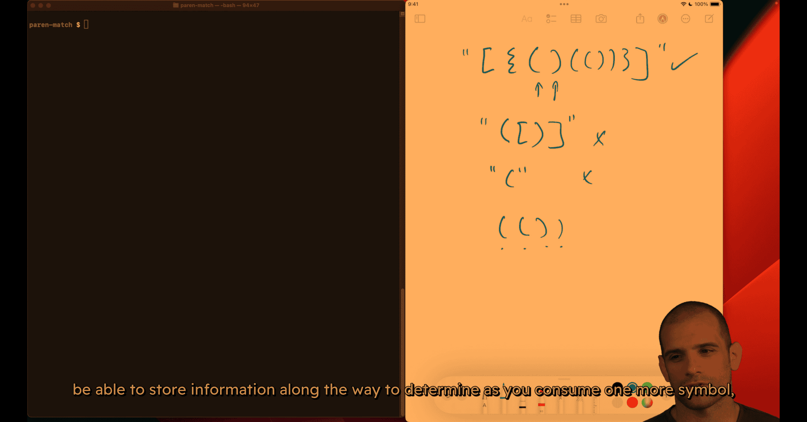

**"Do I need to access things in reverse order of when I encountered them?"**

If **yes** → Use a stack!

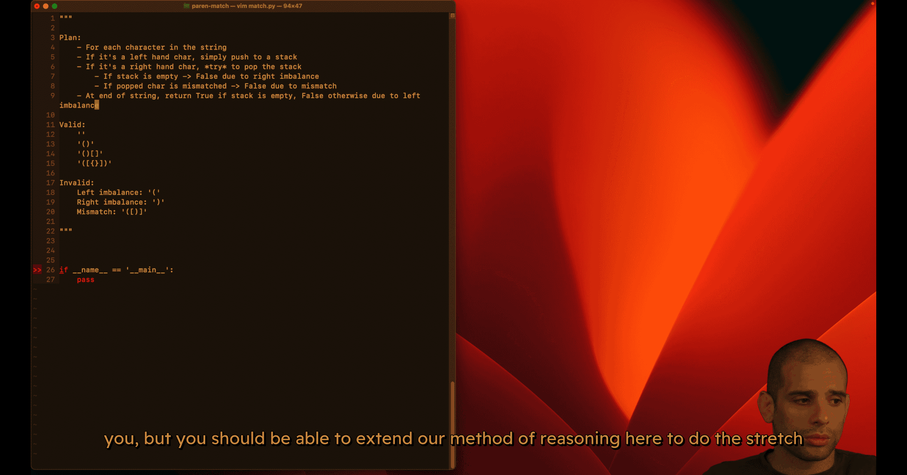

1. plan
2. small case

primer will state clear the test case , and even name the error case name 'categorical thinking'

of the reason why this is false. I just like being categorical and having a kind of model
type of error and so on in the test cases.

step1 :

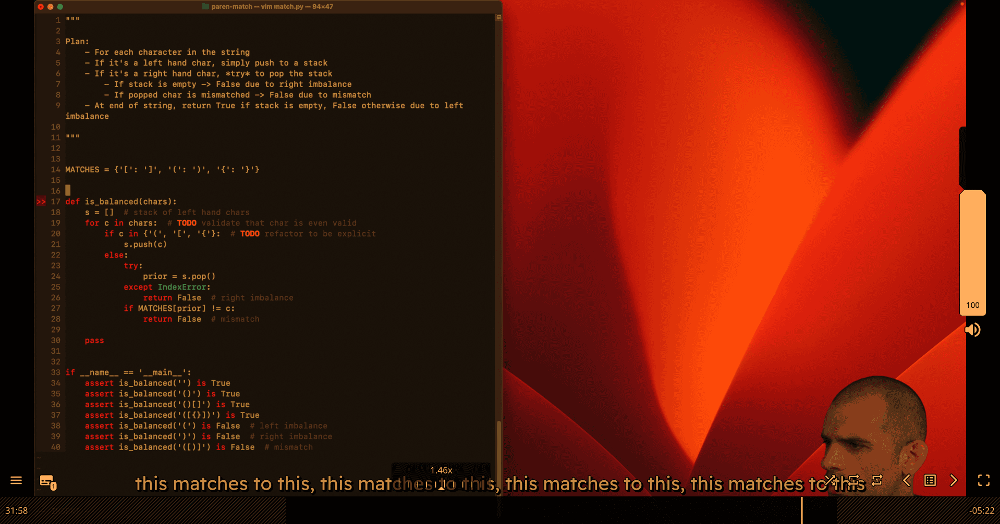

step 2 :

matches left:

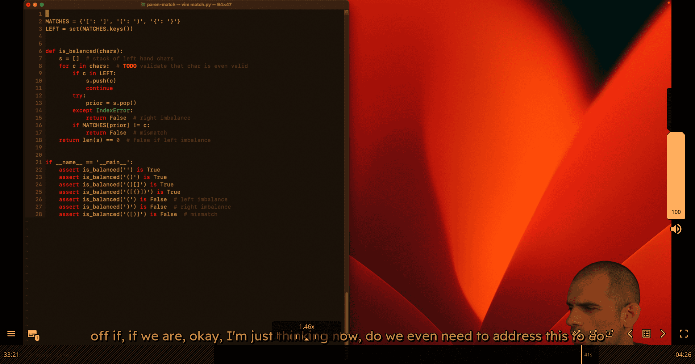
up in our dictionary is not equal to the new value, then we have a mismatch. Maybe actually

```python
"""
Parenthesis Matching Implementation
Based on the algorithm plan from the lecture
"""

MATCHES = {'[': ']', '(': ')', '{': '}'}
LEFT = set(MATCHES.keys())
RIGHT = set(MATCHES.values())

def is_balanced(chars):
    """
    Plan:
    - For each character in the string
    - If it's a left hand char, simply push to a stack
    - If it's a right hand char, *try* to pop the stack
      - If stack is empty -> False due to right imbalance
      - If popped char is mismatched -> False due to mismatch
    - At end of string, return True if stack is empty, False otherwise due to left imbalance
    """
    s = []  # stack of left hand chars
    for c in chars:  # TODO: validate that char is even valid
        if c in LEFT:
            s.append(c)  # Fixed: Python lists use append(), not push()
            continue
        if c not in RIGHT: # Space case
          continue
        try:
            prior = s.pop()
        except IndexError:
            return False  # right imbalance
        if MATCHES[prior] != c:
            return False  # mismatch
    return len(s) == 0  # false if left imbalance


if __name__ == '__main__':
    # Valid cases
    assert is_balanced('') is True
    assert is_balanced('()') is True
    assert is_balanced('()[]{}') is True
    assert is_balanced('({[]})') is True
    
    # Invalid cases
    assert is_balanced('(') is False  # left imbalance
    assert is_balanced(')') is False  # right imbalance
    assert is_balanced('([)]') is False  # mismatch
    
    print("All tests passed!")

```

----------

016 Doubly linked list.mp4


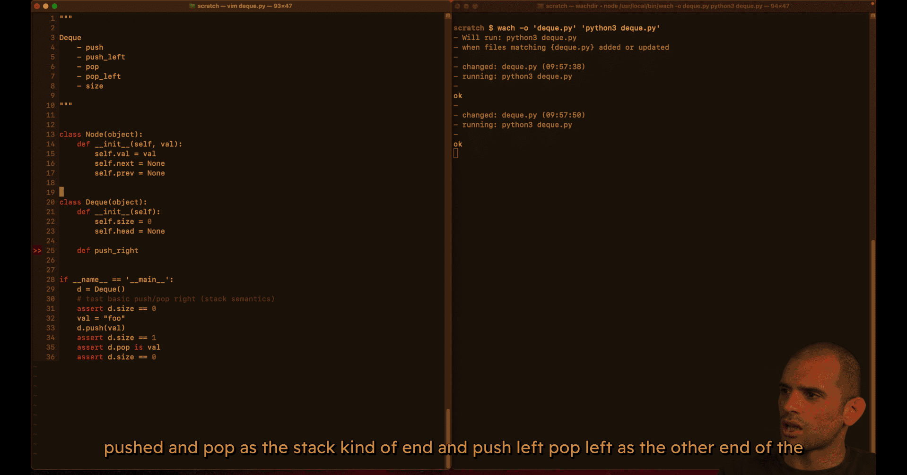

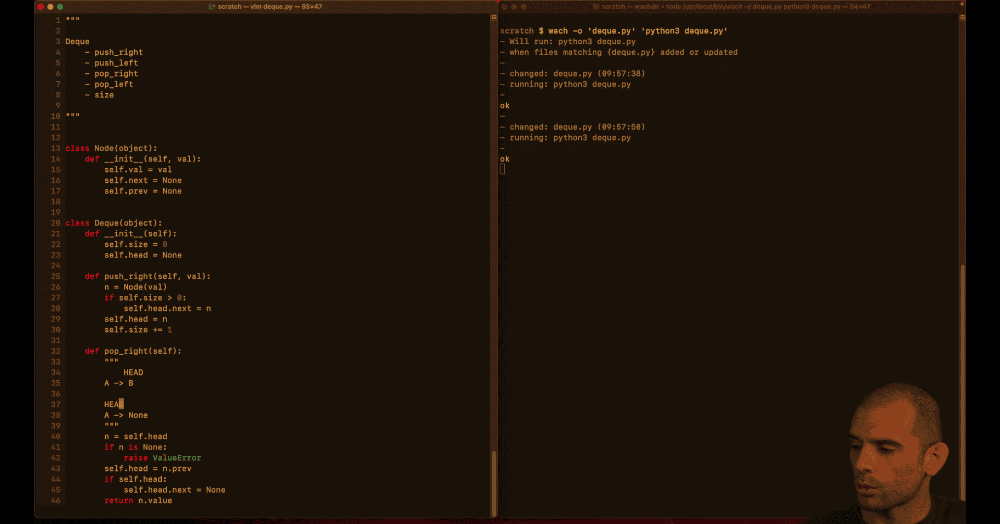

using comment to show the mvp e.g. 

double linked list:
head become tail, next become prev
1. empty case 

/home/peter/Desktop/cursor_project/doubly-linked-list-notes.md

### Memory Management: Critical Considerations

#### The Problem: Circular References

**Circular reference example**:
```python
## Node A points to Node B
A.next = B
B.prev = A

## Even if nothing else references A or B,
## they still reference each other!
## Reference count never drops to zero
```

**In Python**:
- **Reference counting**: Fast, but fails with circular references
- **Tracing garbage collection**: Slow, but handles circular references
- **Best practice**: Break references explicitly to avoid circular references

#### Solution: Always Break Links

**When removing a node**:
1. **Set `next = None`** on the node before it
2. **Set `prev = None`** on the node after it
3. **Update head/tail** appropriately
4. **Set head/tail to None** when deque becomes empty

**Example in pop_right**:
```python
self.head = n.prev        # Move head back
if self.head is not None:
    self.head.next = None  # Break forward link (critical!)
else:
    self.tail = None       # Also clear tail if empty
```

#### Why This Matters

**Long-running processes**:
- Servers, databases, web applications
- Memory leaks accumulate over time
- Can cause performance degradation or crashes

**Best practice**:
- Always set pointers to `None` when removing nodes
- Be explicit about breaking references
- Test that memory is properly reclaimed

----------

017 Basic calculator.mp4

plan :

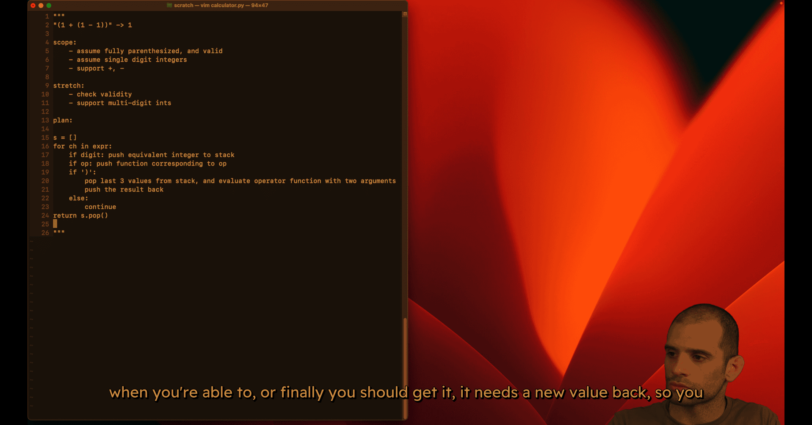


test case:

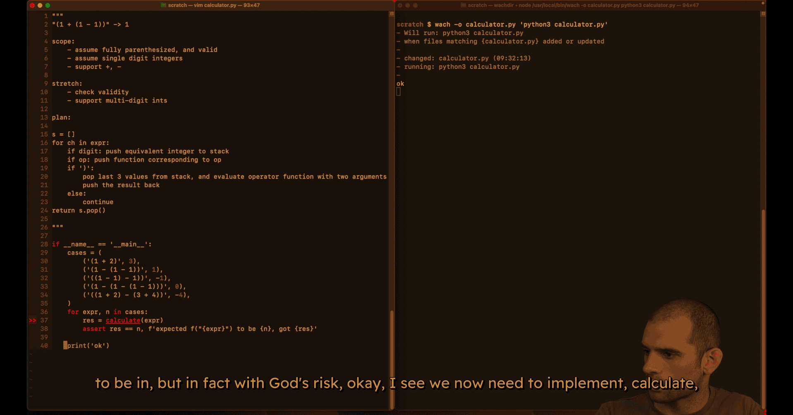

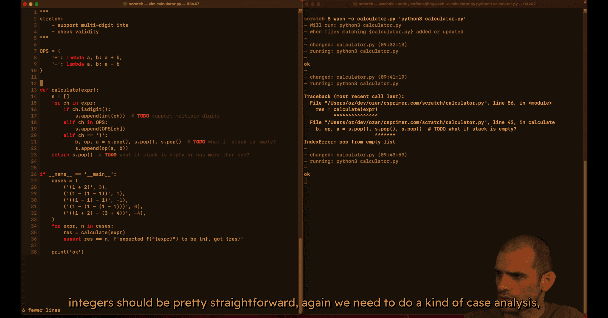

mvp (single digit mode work)

primer logic for double digit :
```python
if len(is) == 0 or not isinstance(s[-i],int):
  s.append(int(ch))
else:
  s[-1]=s[-1]*10+int(ch)
```

gpt logic:
```python
            # Combine with previous digit if present (multi-digit support)
            if stack and isinstance(stack[-1], int):
                stack[-1] = stack[-1] * 10 + digit
            else:
                stack.append(digit)

```

