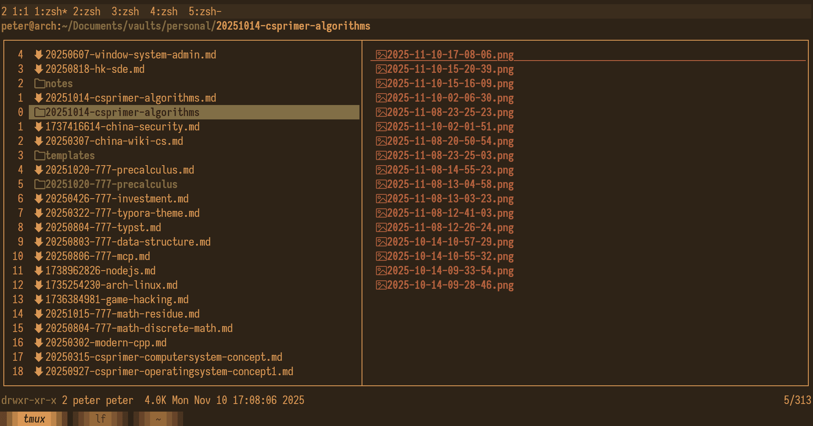
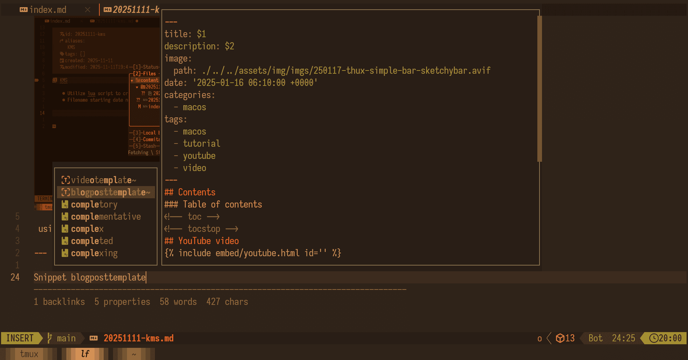
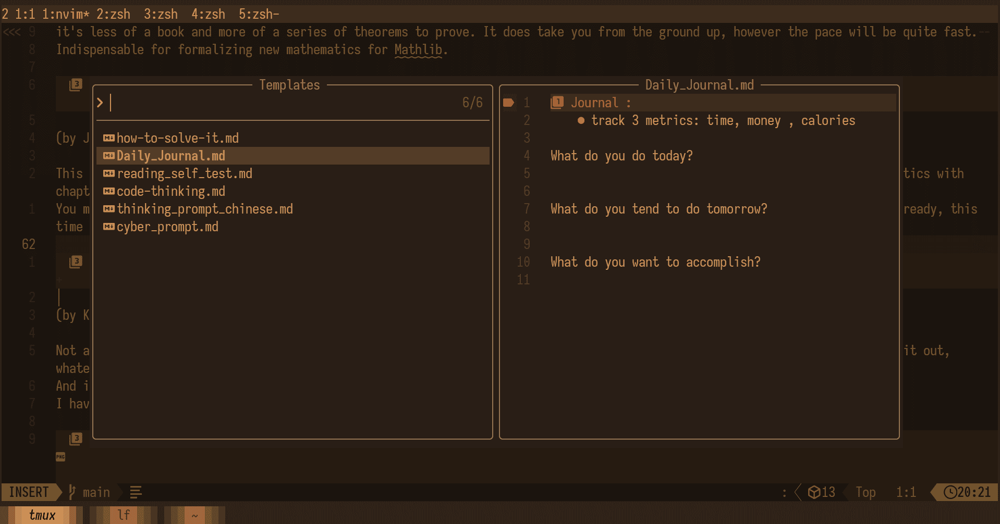
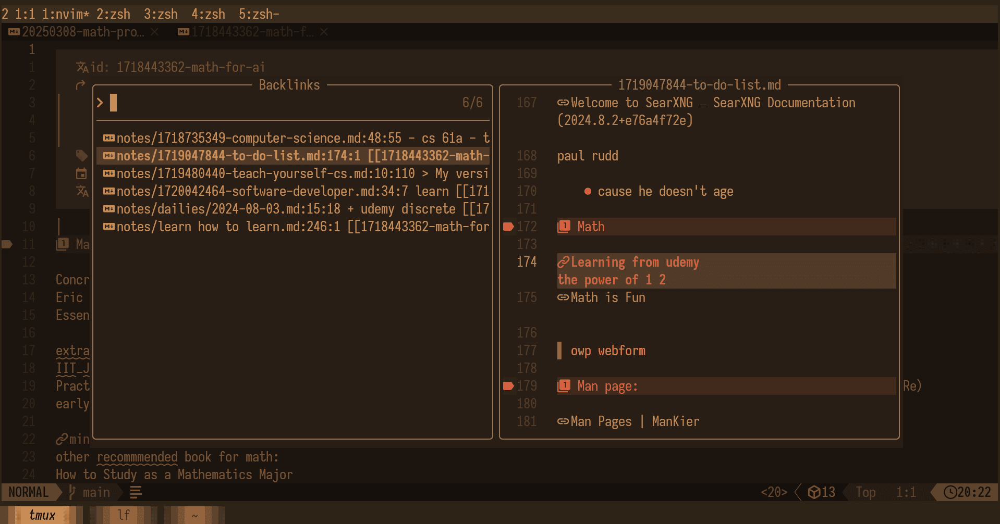
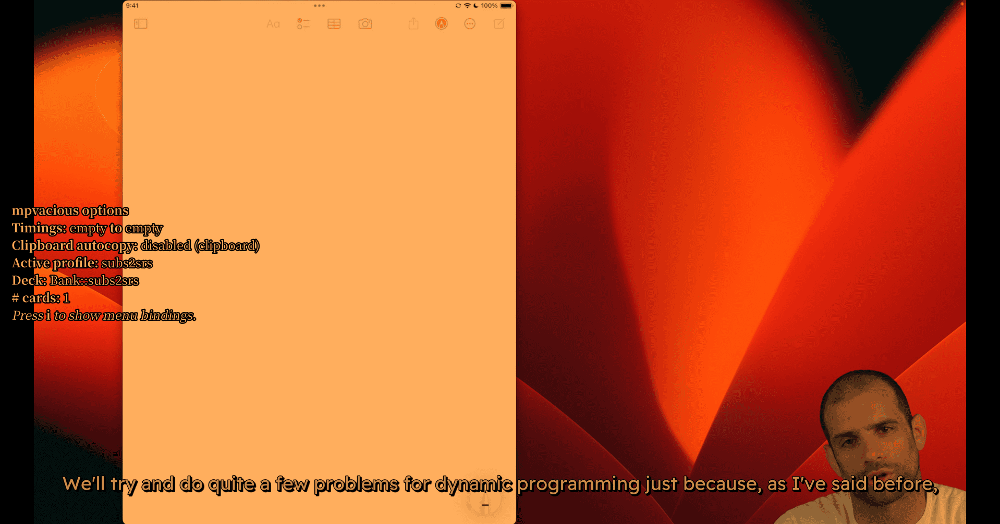
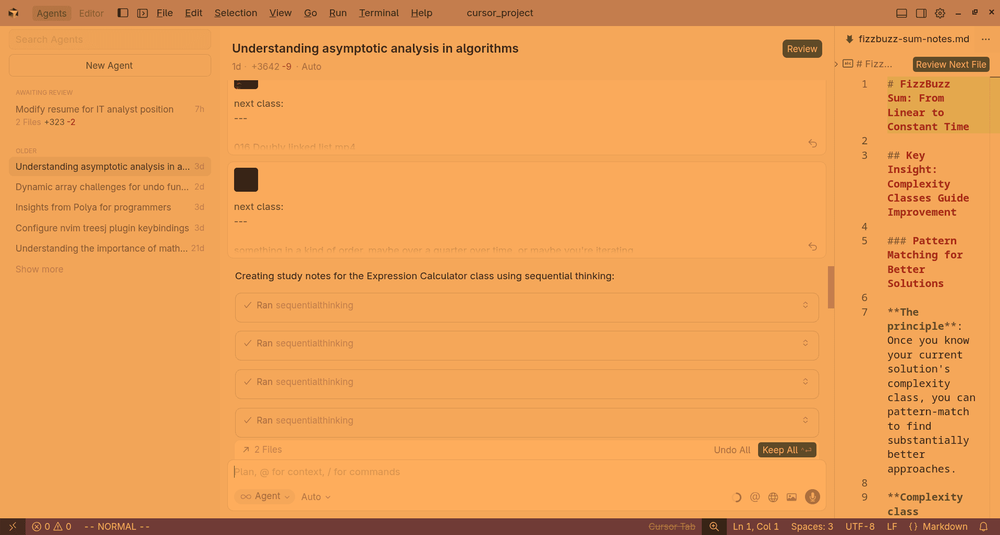

# KMS

- Utilize lua script to create pasted img into markdown notes with markdown links 
- Filename starting date number so that the newest file can always be sorted in the top





- using git for cross platform sync

---

Snippet Customization





---

# Template insertions:





----------

# Showing backlinks

showing which notes have wiki links which pointed to current notes 





---

# PDF reading experience


One for og english version and other is translated paragraph

dark mode for focusing on English only


---
# Video Learning experience



- auto copying clipboard
- Capturing current subs into anki (flashcard program)
- full open source 

---
# Using cursor AI related tools for studying




- Using mcp and subtitles(whisper ai model (video to text))
to generate notes
1 notes 1 program code

---

# Turn webpages into epub

```bash
#!/bin/sh

set -eu

# Point this at whatever file your URLs are stored in.
urls="urls"

# Make the directory where we'll store the clean HTML for each post.
mkdir -p posts

# Iterate over the URLs, download them and clean them up with the readability-cli
# We use a count here to ensure that we organize the output posts in the same order that they are specified
# in the input file. This is helpful as you can lay out the full order of your book by just editing the URLs file.
count=1
cat "$urls" | while read url
do
    output=$(printf "posts/%03d.html" $count)
    readable -q --low-confidence force "$url" -o "$output" 2>&1 > /dev/null
    count=$((count+1))
done

# Take all of the posts and put them into a book.
pandoc -o TheBook.epub posts/*.html

```

- take advantage of using firefox reader mode to capture html 
- pandoc for convert epub

---

# Using MS markitdowns tools to convert files into markdown

[microsoft/markitdown: Python tool for converting files and office documents to Markdown.](https://github.com/microsoft/markitdown)

At the moment, the following optional dependencies are available:

    [all] Installs all optional dependencies
    [pptx] Installs dependencies for PowerPoint files
    [docx] Installs dependencies for Word files
    [xlsx] Installs dependencies for Excel files
    [xls] Installs dependencies for older Excel files
    [pdf] Installs dependencies for PDF files
    [outlook] Installs dependencies for Outlook messages
    [az-doc-intel] Installs dependencies for Azure Document Intelligence
    [audio-transcription] Installs dependencies for audio transcription of wav and mp3 files
    [youtube-transcription] Installs dependencies for fetching YouTube video transcription


