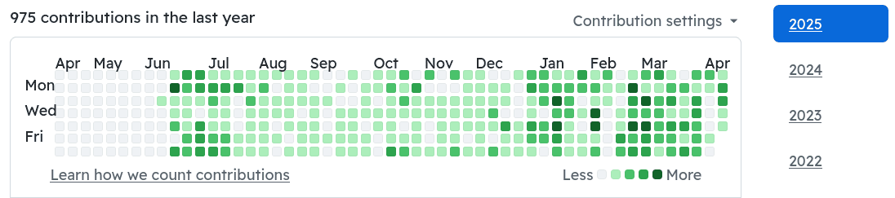

> Learned Linux in just two weeks—starting with Arch Linux—and successfully replaced my previous macOS (2020 m1 macbook) workflow by repurposing an old Dell OptiPlex 7040 (2015 product). Gained hands-on experience with essential Linux tools such as `udev`, virtual machines, `bash`, `nvim`, `tmux`, `thorium`, `pacman`, `systemd` and `linux kernel` etc.

[[20250508-777-salesforce]]

My linux experience:

[[1735254230-arch-linux|arch-linux]](it record my journey of using arch linux), [[20250217-asahi-linux|asahi-linux]](using fedora linux in M1 macbook as server with minimalist sever style), [[1736285296-arch-linux-qemu|arch-linux-qemu]](Learned Virtual Machine using KVM, VMware Workstation, etc )

- self learned a trick to use VMware img and then convert it to kvm favora img
  qemu-img convert -O qcow2 test.vmdk test-better.qcow2 (it improve the linux
  lab about 80% responsiveness time in terms of CLI usage)

- [[20250304-efficient-command-line]]

[peterjumper (Peter)](https://github.com/peterjumper)

- Arch Linux (Catchos)

  - Used performance-optimized distribution necessitates recompiling essential Arch Linux packages for x86-64-v3
  - Adapted various sched-ext schedulers for improved responsiveness(SSD)
  - latest linux keneral with kvm enabled and patched
  - Latest BBRv3 (TCP congestion control algorithm) by Google

- Fedora Linux -> Macbook pro m1 (dual boot)

## Script:

- [[1720985816-webtoebook|web_to_ebook]]

## Programming & Computer Science:

- [[20250315-csprimer-computersystem-concept]]
- [[20250504-csprimer-computersystem-concept2|csprimer-computersystem-concept_2]]
- [[20250513-csprimer-computersystem-concept3|csprimer-computersystem-concept3]]
- [[20250513-csprimer-computersystem-concept3|csprimer-computersystem-concept3]]
- [20250708-csprimer-computersystem-concept4]
- [20250708-csprimer-computersystem-concept5]
- [[20250313-777-compiler|777-Compiler]]
- [[20250319-cs-sicp]]
- [[1737418909-cs61a|cs61a]]
- [[20250402-cs61a-part2|cs61a-part2]]
- [[1719513191-python-my-note|python my note 2024-06-28]]
- [[20250508-777-salesforce|777-salesforce]]
- [[20250513-777-azure-learning|777-azure-learning]]
- az-900: [[20250516-777-azure-notes]]

## Network study:

- [[1736130293-ccna-notes1]]
- [[1736133301-ccna-notes2]]
- [[1736544044-ccna-notes3-day9]]
- [[1736738616-ccna-notes4-day10]]
- [[1736888244-ccna-notes5-day11]]
- [[1736909764-ccna-notes6-day12]]
- [[1736973840-ccna-notes6-day12]]
- [[1736976154-ccna-notes7-day13-subnetting]]
- [[1737061712-ccna-notes8-vlan]]

## Hardware knowledge

[[20250417-it-support-experience|it-support-experience]]

## CLI:

- [[1720567413-zsh]]

## Devops:

- [[20250405-python-uv]]
- [[1735671282-python-subtitle]]
- [[20250404-777-python-ipynb|777-python-ipynb]]
- [[20250405-cs-missing-semester]]
- [[20230305-mydocker]]

> To follow the path: look to the master, follow the master, walk with the master, see through the master, become the master.
