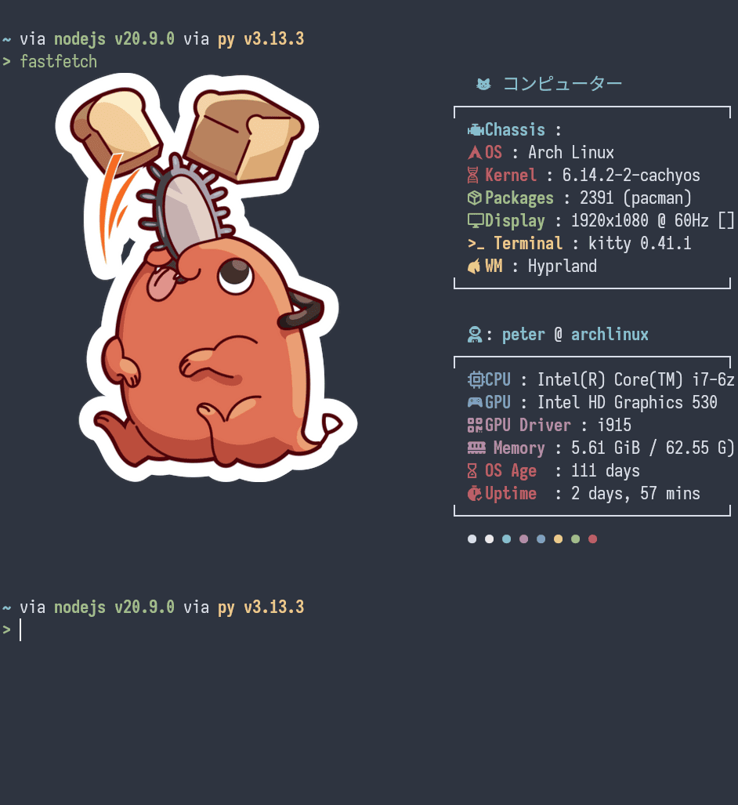

My linux experience:

[[1735254230-arch-linux|arch-linux]], [[20250217-asahi-linux|asahi-linux]], [[1736285296-arch-linux-qemu|arch-linux-qemu]]

- [[20250304-efficient-command-line]]

[peterjumper (Peter)](https://github.com/peterjumper)

- Arch Linux (Catchos)

  - Used performance-optimized distribution necessitates recompiling essential Arch Linux packages for x86-64-v3
  - Adapted various sched-ext schedulers for improved responsiveness(SSD)
  - latest linux keneral with kvm enabled and patched
  - Latest BBRv3 (TCP congestion control algorithm) by Google

- Fedora Linux -> Macbook pro m1 (dual boot)

## Script:

- [[1720985816-webtoebook|web_to_ebook]]

## Programming & Computer Science:

- [[20250315-csprimer-computersystem-concept]]
- [[20250313-777-compiler|777-Compiler]]
- [[20250319-cs-sicp]]
- [[1737418909-cs61a|cs61a]]
- [[20250402-cs61a-part2|cs61a-part2]]
- [[1719513191-python-my-note|python my note 2024-06-28]]

## Network study:

- [[1736130293-ccna-notes1]]
- [[1736133301-ccna-notes2]]
- [[1736544044-ccna-notes3-day9]]
- [[1736738616-ccna-notes4-day10]]
- [[1736888244-ccna-notes5-day11]]
- [[1736909764-ccna-notes6-day12]]
- [[1736973840-ccna-notes6-day12]]
- [[1736976154-ccna-notes7-day13-subnetting]]
- [[1737061712-ccna-notes8-vlan]]

## Hardware knowledge

[[20250417-it-support-experience|it-support-experience]]

## CLI:

- [[1720567413-zsh]]

## Devops:

- [[20230305-mydocker]]
- [[20250405-python-uv]]
- [[1735671282-python-subtitle]]
- [[20250404-777-python-ipynb|777-python-ipynb]]
- [[20250405-cs-missing-semester]]

> To follow the path: look to the master, follow the master, walk with the master, see through the master, become the master.
